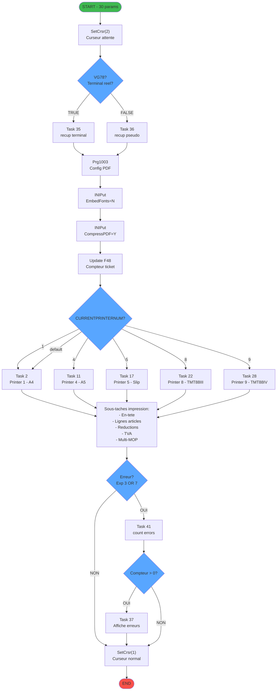
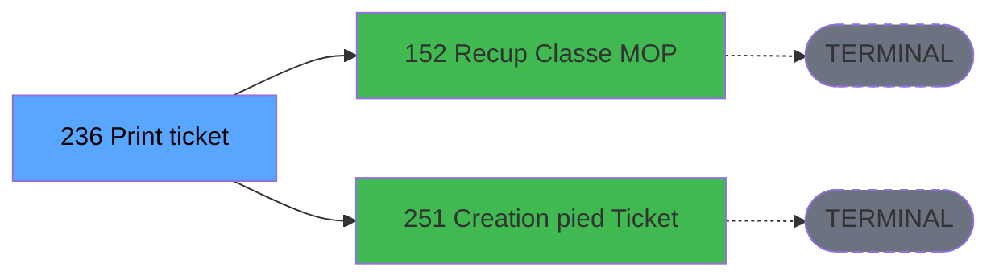

# ADH IDE 236 - Print ticket vente PMS-584

> **Version spec**: 4.0
> **Analyse**: 2026-01-27 23:00
> **Source**: `D:\Data\Migration\XPA\PMS\ADH\Source\Prg_232.xml`
> **Methode**: APEX + PDCA

---

<!-- TAB:Fonctionnel -->

## SPECIFICATION FONCTIONNELLE

### 1.1 Objectif metier

| Element | Description |
|---------|-------------|
| **Qui** | Operateur caisse (apres validation vente) |
| **Quoi** | Generation et impression du ticket de vente selon type d'imprimante |
| **Pourquoi** | Fournir un justificatif legal de transaction au client |
| **Declencheur** | Appel depuis ADH IDE 238 (Transaction Nouv vente PMS-584) apres validation |
| **Resultat** | Ticket PDF ou thermique imprime avec toutes les informations de la vente |

### 1.2 Regles metier

| Code | Regle | Condition | Impact |
|------|-------|-----------|--------|
| RM-001 | Detection type imprimante | `GetParam('CURRENTPRINTERNUM')` | Aiguillage vers format adapte |
| RM-002 | Imprimante A4 (code 1) | CURRENTPRINTERNUM=1 | Format complet avec en-tete |
| RM-003 | Imprimante A5 (code 4) | CURRENTPRINTERNUM=4 | Format reduit |
| RM-004 | Imprimante Slip 950 (code 5) | CURRENTPRINTERNUM=5 | Format ticket caisse |
| RM-005 | Imprimante TMT88III (code 8) | CURRENTPRINTERNUM=8 | Format thermique standard |
| RM-006 | Imprimante TMT88IV (code 9) | CURRENTPRINTERNUM=9 | Format thermique nouvelle gen |
| RM-007 | Terminal TPE | `VG78 = TRUE` | Recuperation via Task 35 |
| RM-008 | Pseudo-terminal | `VG78 = FALSE` | Recuperation via Task 36 |
| RM-009 | Config PDF | EmbedFonts=N, CompressPDF=Y | Optimisation taille fichier |
| RM-010 | Gestion erreurs | ExpCalc('3'EXP) OR ExpCalc('7'EXP) | Affichage message si erreur |
| RM-011 | Compteur tickets | Field 48 incremente | Tracabilite sequence |
| RM-012 | Multi-MOP | Plusieurs moyens paiement | Edition detaillee par MOP (Task 7) |

### 1.3 Flux utilisateur

```
1. Reception des 30 parametres de vente depuis ADH IDE 238
2. Affichage curseur attente (SetCrsr 2)
3. Detection type terminal (VG78)
   └─ Si terminal → Task 35 (recup terminal)
   └─ Si pseudo   → Task 36 (recup pseudo terminal)
4. Configuration PDF (Prg1003)
5. SWITCH sur GetParam('CURRENTPRINTERNUM'):
   ├─ =1 → Task 2  (Printer 1 - A4)
   ├─ =4 → Task 11 (Printer 4 - A5)
   ├─ =5 → Task 17 (Printer 5 - Slip 950)
   ├─ =8 → Task 22 (Printer 8 - TMT88III)
   └─ =9 → Task 28 (Printer 9 - TMT88IV)
6. Impression selon format:
   ├─ En-tete avec logo/adresse
   ├─ Lignes articles (libelle, qte, prix, total)
   ├─ Section reductions si applicable
   ├─ Detail TVA par taux
   └─ Section multi-paiement si plusieurs MOP
7. Verification erreurs
   └─ Si erreur → Task 41 (count) puis Task 37 (affichage)
8. Retour curseur normal (SetCrsr 1)
```

### 1.4 Cas d'erreur

| Code | Erreur | Detection | Comportement |
|------|--------|-----------|--------------|
| ERR-001 | Imprimante non reponse | ExpCalc('3'EXP) | Task 41 compte, Task 37 affiche message |
| ERR-002 | Papier absent | ExpCalc('7'EXP) | Idem |
| ERR-003 | Config terminal manquante | VG78 indefini | Utilise pseudo-terminal par defaut |
| ERR-004 | Donnees incompletes | Parametres vides | Ticket partiel genere |

### 1.5 Dependances fonctionnelles

| Programme | Role | Appele par 236 |
|-----------|------|----------------|
| **ADH IDE 152** | Recuperation classe et libelle MOP | 5 fois (affichage paiement) |
| **ADH IDE 251** | Creation pied de ticket | 5 fois (section finale) |
| **Prg 1003** | Configuration PDF externe | 1 fois (init) |

---

<!-- TAB:Technique -->

## SPECIFICATION TECHNIQUE

### 2.1 Identification

| Attribut | Valeur |
|----------|--------|
| **IDE Position** | 236 |
| **Fichier XML** | `Prg_232.xml` |
| **Description** | Print ticket vente PMS-584 |
| **Module** | ADH |
| **Type tache** | B (Batch) |
| **Nombre taches** | 38 |
| **Nombre parametres** | 30 |

### 2.2 Tables

| # | Nom logique | Nom physique | Acces | Usage |
|---|-------------|--------------|-------|-------|
| 31 | gm-complet_______gmc | `cafil009_dat` | R | 2x |
| 34 | hebergement______heb | `cafil012_dat` | L | 2x |
| 34 | hebergement______heb | `cafil012_dat` | R | 2x |
| 40 | comptable________cte | `cafil018_dat` | R | 4x |
| 67 | tables___________tab | `cafil045_dat` | L | 2x |
| 67 | tables___________tab | `cafil045_dat` | R | 1x |
| 69 | initialisation___ini | `cafil047_dat` | R | 1x |
| 77 | articles_________art | `cafil055_dat` | L | 1x |
| 77 | articles_________art | `cafil055_dat` | R | 2x |
| 263 | vente | `caisse_vente` | L | 4x |
| 596 | tempo_ecran_police | `%club_user%tmp_ecrpolice_dat` | L | 7x |
| 596 | tempo_ecran_police | `%club_user%tmp_ecrpolice_dat` | R | 7x |
| 728 | arc_cc_total | `arc_cctotal` | L | 1x |
| 818 | Circuit supprime | `zcircafil146` | L | 1x |
| 847 | stat_lieu_vente_date | `%club_user%_stat_lieu_vente_date` | L | 10x |
| 847 | stat_lieu_vente_date | `%club_user%_stat_lieu_vente_date` | R | 5x |
| 867 | log_maj_tpe | `log_maj_tpe` | R | 5x |
| 878 | categorie_operation_mw | `categorie_operation_mw` | R | 2x |
| 904 | Boo_AvailibleEmployees | `Boo_AvailibleEmployees` | L | 3x |

### 2.3 Parametres d'entree (30 parametres)

| Var | Nom | Type | Picture | Description |
|-----|-----|------|---------|-------------|
| **A** | P0 od annulation | LOGICAL | 1 | Flag ticket annulation (O/N) |
| **B** | P0 Nom | ALPHA | 60 | Nom complet client |
| **C** | P0 Date | DATE | ##/##/##Z | Date transaction |
| **D** | P0 Article libelle 1 | ALPHA | 30 | Libelle principal article |
| **E** | P0 Article complementaire | ALPHA | 30 | Libelle secondaire |
| **F** | P0 Qte | NUMERIC | 3 | Quantite vendue |
| **G** | P0 Prix unitaire | NUMERIC | 10.4 | Prix HT unitaire |
| **H** | P0 Total | NUMERIC | 10.4 | Montant total ligne |
| **I** | P0 Devise locale | ALPHA | U3 | Code devise (EUR) |
| **J** | P0 Masque | ALPHA | 16 | Format affichage montant |
| **K** | P0 Chambre | ALPHA | 10 | Numero chambre client |
| **L** | P0 mode de paiement | ALPHA | 4 | Code MOP (ESP, CB, CHQ) |
| **M** | P0 libelle paiement | ALPHA | 30 | Libelle moyen paiement |
| **N** | P0 Num ticket VRL | NUMERIC | 10 | Numero sequence VRL |
| **O** | P0 Num GM | NUMERIC | 10 | Numero compte GM |
| **P** | P0 UNI/BI | ALPHA | 3 | Mode UNI ou BI |
| **Q** | PO is TAI | LOGICAL | 1 | Flag TAI actif |
| **R** | P0 TAI Cash | ALPHA | 10 | Montant cash TAI |
| **S** | P0 TAI start date | DATE | ##/##/## | Date debut TAI |
| **T** | P0 TAI end date | DATE | ##/##/## | Date fin TAI |
| **U** | P0 is reduction | LOGICAL | 1 | Flag reduction appliquee |
| **V** | P0 montant reduction | NUMERIC | 10.4 | Montant remise |
| **W** | P0 libelle reduction | ALPHA | 30 | Motif reduction |
| **X** | P0 is multi MOP | LOGICAL | 1 | Flag plusieurs paiements |
| **Y** | P0 MOP 2 code | ALPHA | 4 | Code 2e moyen paiement |
| **Z** | P0 MOP 2 montant | NUMERIC | 10.4 | Montant 2e paiement |
| **BA** | P0 TVA taux 1 | NUMERIC | 5.2 | Taux TVA principal |
| **BB** | P0 TVA montant 1 | NUMERIC | 10.4 | Montant TVA principal |
| **BC** | P0 TVA taux 2 | NUMERIC | 5.2 | Taux TVA secondaire |
| **BD** | P0 TVA montant 2 | NUMERIC | 10.4 | Montant TVA secondaire |

### 2.4 Algorigramme



### 2.5 Expressions cles

| ID | Expression | Decode IDE | Commentaire |
|----|------------|-----------|-------------|
| 1 | `SetCrsr(2)` | SetCrsr(2) | Curseur attente (sablier) |
| 2 | `SetCrsr(1)` | SetCrsr(1) | Retour curseur normal |
| 3 | `GetParam('CURRENTPRINTERNUM')=1` | GetParam('CURRENTPRINTERNUM')=1 | Test imprimante A4 |
| 4 | `GetParam('CURRENTPRINTERNUM')=4` | GetParam('CURRENTPRINTERNUM')=4 | Test imprimante A5 |
| 5 | `GetParam('CURRENTPRINTERNUM')=5` | GetParam('CURRENTPRINTERNUM')=5 | Test imprimante Slip 950 |
| 6 | `GetParam('CURRENTPRINTERNUM')=8` | GetParam('CURRENTPRINTERNUM')=8 | Test imprimante TMT88III |
| 7 | `GetParam('CURRENTPRINTERNUM')=9` | GetParam('CURRENTPRINTERNUM')=9 | Test imprimante TMT88IV |
| 8 | `'VRL'` | 'VRL' | Constante Vente Reglee Locale |
| 9 | `'VSL'` | 'VSL' | Constante Vente Sur Logement |
| 10 | `Variable A` | Variable A | P0 od annulation (flag) |
| 11 | `INIPut('EmbedFonts=N','FALSE'LOG)` | INIPut(...) | Desactive polices embarquees |
| 12 | `INIPut('CompressPDF=Y','FALSE'LOG)` | INIPut(...) | Active compression PDF |
| 13 | `'TRUE'LOG` | 'TRUE'LOG | Constante logique vraie |
| 14 | `{32768,78}` | VG78 | Flag terminal reel (global) |
| 15 | `NOT {32768,78}` | NOT VG78 | Negation flag terminal |
| 16 | `Translate('%TempDir%')&'ticket_...'` | Chemin PDF temp | Construction path fichier |
| 17 | `GetParam('CURRENTPRINTERNUM')` | GetParam(...) | Lecture numero imprimante |
| 18 | `ExpCalc('3'EXP) OR ExpCalc('7'EXP)` | Exp3 OR Exp7 | Test erreur impression |
| 19 | `{0,50}>0` | Variable BC > 0 | Compteur erreurs positif |

> **Total**: 19 expressions principales

### 2.6 Variables importantes

| Variable | Nom | Type | Portee | Role |
|----------|-----|------|--------|------|
| **A** | P0 od annulation | LOGICAL | Param | Flag ticket annulation |
| **B** | P0 Nom | ALPHA(60) | Param | Identite client sur ticket |
| **C** | P0 Date | DATE | Param | Date transaction affichee |
| **H** | P0 Total | NUMERIC(10.4) | Param | Montant total TTC |
| **I** | P0 Devise locale | ALPHA(3) | Param | Code devise (EUR, USD) |
| **L** | P0 mode de paiement | ALPHA(4) | Param | Code MOP principal |
| **N** | P0 Num ticket VRL | NUMERIC | Param | Numero sequence ticket |
| **X** | P0 is multi MOP | LOGICAL | Param | Flag plusieurs paiements |
| **VG78** | Flag terminal | LOGICAL | Global | Determine terminal ou pseudo |
| **Field 48** | Compteur tickets | NUMERIC | Local | Incremente a chaque impression |

### 2.7 Statistiques

| Metrique | Valeur |
|----------|--------|
| **Taches** | 38 |
| **Lignes logique** | 1231 |
| **Lignes desactivees** | 0 |
| **Parametres** | 30 |
| **Tables accedees** | 19 (lecture seule) |
| **Expressions** | 19 |

---

<!-- TAB:Cartographie -->

## CARTOGRAPHIE APPLICATIVE

### 3.1 Chaine d'appels depuis Main


**Chemin principal**: Main (1) → Menu caisse GM (163) → Transaction Nouv vente (238) → **Print ticket (236)**

### 3.2 Callers directs

| IDE | Programme | Nb appels | Contexte |
|-----|-----------|-----------|----------|
| 238 | Transaction Nouv vente PMS-584 | 4 | Apres validation vente |
| 243 | Histo ventes payantes | 2 | Reimpression depuis historique |
| 244 | Histo ventes payantes /PMS-605 | 2 | Reimpression variante 605 |
| 245 | Histo ventes payantes /PMS-623 | 2 | Reimpression variante 623 |

### 3.3 Callees (3 niveaux)



| Niv | IDE | Programme | Nb appels | Callees |
|-----|-----|-----------|-----------|---------|
| 1 | 152 | Recup Classe et Lib du MOP | 5 | TERMINAL |
| 1 | 251 | Creation pied Ticket | 5 | TERMINAL |

**Note**: Les 2 callees de niveau 1 sont des programmes **terminaux** (aucun sous-appel). Profondeur maximale = 1 niveau.

### 3.4 Composants ECF utilises

| ECF | IDE | Public Name | Usage |
|-----|-----|-------------|-------|
| ADH.ecf | 152 | RECUP_CLASSE_MOP | 5 appels (lecture tables MOP) |

### 3.5 Verification orphelin

| Critere | Resultat |
|---------|----------|
| Callers actifs | 4 programmes (238, 243, 244, 245) |
| PublicName | Non (programme interne) |
| ECF partage | Non |
| **Conclusion** | **NON ORPHELIN** - Appele depuis 4 contextes differents |

---

## NOTES MIGRATION

### Complexite

| Critere | Score | Detail |
|---------|-------|--------|
| Taches | 38 | Nombreuses mais repetitives (formats imprimante) |
| Tables | 19 | Lecture seule, pas de transactions |
| Callees | 2 | Tres faible couplage (programmes terminaux) |
| Parametres | 30 | Nombreux mais bien structures |
| **Score global** | **MOYEN** | Structure repetitive, logique simple |

### Points d'attention migration

| Point | Probleme | Solution moderne |
|-------|----------|-----------------|
| GetParam('CURRENTPRINTERNUM') | Config Magic.ini | Enum PrinterType + config JSON |
| INIPut() | Ecriture Magic.ini | IOptions<PdfConfig> |
| SetCrsr() | UI specifique Magic | Spinner/Loading component |
| Translate('%TempDir%') | Variable env Magic | Path.GetTempPath() |
| VG78 | Variable globale | Service ITerminalDetector |
| 5 branches imprimante | Duplication code | Strategy pattern |

### Dependances critiques

| Programme | Role | Priorite |
|-----------|------|----------|
| 152 | Recup Classe MOP | P0 - Prerequis (ECF ADH.ecf) |
| 251 | Creation pied Ticket | P1 - Couple |

### Strategie recommandee

```
Pattern: Template Method + Strategy
├── ITicketPrinter (interface)
├── A4TicketPrinter : ITicketPrinter
├── A5TicketPrinter : ITicketPrinter
├── SlipTicketPrinter : ITicketPrinter
├── ThermalTicketPrinter : ITicketPrinter
│
├── TicketGenerator (template method)
│   ├── GenerateHeader()
│   ├── GenerateLines()
│   ├── GenerateReductions()
│   ├── GenerateTax()
│   └── GenerateFooter()
│
└── Output: PDF via QuestPDF ou iTextSharp
```

**Tests recommandes**:
- Mock imprimante (pas d'impression reelle)
- Validation structure PDF
- Test multi-MOP
- Test annulation (flag A)

---

## HISTORIQUE

| Date | Action | Auteur |
|------|--------|--------|
| 2026-01-27 23:00 | **V4.0 APEX/PDCA** - Analyse complete, variables IDE, algorigramme detaille, callees 3 niveaux | Claude |
| 2026-01-27 22:15 | V3.6 APEX - Premiere analyse profonde | Claude |
| 2026-01-27 20:24 | DATA V2 - Tables, Expressions, Stats | Script |

---

*Specification V4.0 - Analyse APEX/PDCA complete avec variables IDE et migration notes*
