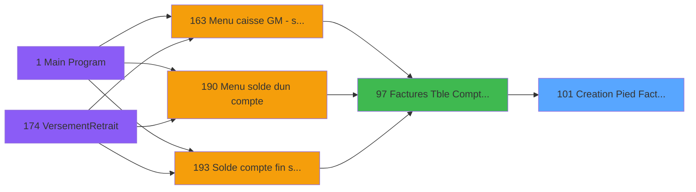

# ADH IDE 101 - Creation Pied Facture V3

> **Analyse**: Phases 1-4 2026-02-07 03:47 -> 03:48 (27s) | Assemblage 15:16
> **Pipeline**: V7.2 Enrichi
> **Structure**: 4 onglets (Resume | Ecrans | Donnees | Connexions)

<!-- TAB:Resume -->

## 1. FICHE D'IDENTITE

| Attribut | Valeur |
|----------|--------|
| Projet | ADH |
| IDE Position | 101 |
| Nom Programme | Creation Pied Facture V3 |
| Fichier source | `Prg_101.xml` |
| Dossier IDE | Facturation |
| Taches | 2 (0 ecrans visibles) |
| Tables modifiees | 1 |
| Programmes appeles | 0 |
| Complexite | **BASSE** (score 7/100) |

## 2. DESCRIPTION FONCTIONNELLE

# ADH IDE 101 - Creation Pied Facture V3

**ADH IDE 101** gère la création et l'initialisation du pied de facture (footer) dans le système de facturation V3. Appelé depuis le programme ADH IDE 97 (Saisie Facture TVA), ce programme est responsable de la mise en place des données structurelles de base qui apparaîtront au bas de chaque document de facturation générée.

Le programme modifie la table `log_maj_tpe` pour enregistrer les mises à jour et les changements apportés au template de pied de facture. Il exécute deux tâches principales : la création initiale du pied de facture avec ses paramètres par défaut, et la réinitialisation (RAZ) complète de ce pied si besoin de restauration ou de correction.

Ce programme intervient dans le flux de facturation comme étape de préparation documentaire, en amont de l'édition finale des factures. Il garantit que chaque facture générée dispose d'un pied standardisé contenant les informations obligatoires (conditions de paiement, mentions légales, coordonnées, etc.) selon les paramètres configurés en V3.

## 3. BLOCS FONCTIONNELS

### 3.1 Creation (1 tache)

Insertion de nouveaux enregistrements en base.

---

#### <a id="t1"></a>T1 - Creation Pied Facture V3 [ECRAN]

**Role** : Creation d'enregistrement : Creation Pied Facture V3.
**Ecran** : 1269 x 0 DLU | [Voir mockup](#ecran-t1)


### 3.2 Initialisation (1 tache)

Reinitialisation d'etats et variables de travail.

---

#### <a id="t2"></a>T2 - RAZ Pied Facture

**Role** : Reinitialisation : RAZ Pied Facture.


## 5. REGLES METIER

*(Programme utilitaire - operations systeme sans logique conditionnelle)*

## 6. CONTEXTE

- **Appele par**: [Factures (Tble Compta&Vent) V3 (IDE 97)](ADH-IDE-97.md)
- **Appelle**: 0 programmes | **Tables**: 2 (W:1 R:1 L:1) | **Taches**: 2 | **Expressions**: 15

<!-- TAB:Ecrans -->

## 8. ECRANS

*(Programme sans ecran visible)*

## 9. NAVIGATION

### 9.3 Structure hierarchique (2 taches)

| Position | Tache | Type | Dimensions | Bloc |
|----------|-------|------|------------|------|
| **101.1** | [**Creation Pied Facture V3** (T1)](#t1) [mockup](#ecran-t1) | - | 1269x0 | Creation |
| **101.2** | [**RAZ Pied Facture** (T2)](#t2) | - | - | Initialisation |

### 9.4 Algorigramme

```mermaid
flowchart TD
    START([START])
    B1[Creation (1t)]
    START --> B1
    B2[Initialisation (1t)]
    B1 --> B2
    WRITE[MAJ 1 tables]
    B2 --> WRITE
    ENDOK([END])
    WRITE --> ENDOK
    style START fill:#3fb950,color:#000
    style ENDOK fill:#3fb950,color:#000
    style WRITE fill:#ffeb3b,color:#000
```

> *Algorigramme simplifie base sur les blocs fonctionnels. Utiliser `/algorigramme` pour une synthese metier detaillee.*

<!-- TAB:Donnees -->

## 10. TABLES

### Tables utilisees (2)

| ID | Nom | Description | Type | R | W | L | Usages |
|----|-----|-------------|------|---|---|---|--------|
| 867 | log_maj_tpe |  | DB |   | **W** | L | 2 |
| 866 | maj_appli_tpe |  | DB | R |   |   | 1 |

### Colonnes par table (1 / 2 tables avec colonnes identifiees)

<details>
<summary>Table 867 - log_maj_tpe (**W**/L) - 2 usages</summary>

*Table utilisee uniquement en Link ou aucune colonne Real identifiee dans le DataView.*

</details>

<details>
<summary>Table 866 - maj_appli_tpe (R) - 1 usages</summary>

| Lettre | Variable | Acces | Type |
|--------|----------|-------|------|
| A | p.Societe | R | Unicode |
| B | p.Compte | R | Numeric |
| C | p.Filiation | R | Numeric |
| D | p.NumFac | R | Numeric |
| E | P.Flaguee | R | Logical |

</details>

## 11. VARIABLES

### 11.1 Parametres entrants (5)

Variables recues du programme appelant ([Factures (Tble Compta&Vent) V3 (IDE 97)](ADH-IDE-97.md)).

| Lettre | Nom | Type | Usage dans |
|--------|-----|------|-----------|
| A | p.Societe | Unicode | 1x parametre entrant |
| B | p.Compte | Numeric | 1x parametre entrant |
| C | p.Filiation | Numeric | 1x parametre entrant |
| D | p.NumFac | Numeric | 1x parametre entrant |
| E | P.Flaguee | Logical | - |

## 12. EXPRESSIONS

**15 / 15 expressions decodees (100%)**

### 12.1 Repartition par type

| Type | Expressions | Regles |
|------|-------------|--------|
| CALCULATION | 4 | 0 |
| CALCUL | 2 | 0 |
| CONSTANTE | 3 | 0 |
| OTHER | 6 | 0 |

### 12.2 Expressions cles par type

#### CALCULATION (4 expressions)

| Type | IDE | Expression | Regle |
|------|-----|------------|-------|
| CALCULATION | 12 | `[AN]+[Z]` | - |
| CALCULATION | 13 | `[AW]+[Z]` | - |
| CALCULATION | 8 | `[AL]+[Y]` | - |
| CALCULATION | 9 | `[AU]+[Y]` | - |

#### CALCUL (2 expressions)

| Type | IDE | Expression | Regle |
|------|-----|------------|-------|
| CALCUL | 11 | `[AV]+Round(([Z]/(1+[X]/100)*[X]/100),12,2)` | - |
| CALCUL | 10 | `[AM]+Round(([Z]/(1+[X]/100)*[X]/100),12,2)` | - |

#### CONSTANTE (3 expressions)

| Type | IDE | Expression | Regle |
|------|-----|------------|-------|
| CONSTANTE | 14 | `'O'` | - |
| CONSTANTE | 7 | `0` | - |
| CONSTANTE | 4 | `999` | - |

#### OTHER (6 expressions)

| Type | IDE | Expression | Regle |
|------|-----|------------|-------|
| OTHER | 5 | `p.Compte [B]` | - |
| OTHER | 6 | `p.Filiation [C]` | - |
| OTHER | 15 | `IsFirstRecordCycle(0)` | - |
| OTHER | 1 | `p.Societe [A]` | - |
| OTHER | 2 | `p.NumFac [D]` | - |
| ... | | *+1 autres* | |

<!-- TAB:Connexions -->

## 13. GRAPHE D'APPELS

### 13.1 Chaine depuis Main (Callers)

Main -> ... -> [Factures (Tble Compta&Vent) V3 (IDE 97)](ADH-IDE-97.md) -> **Creation Pied Facture V3 (IDE 101)**



### 13.2 Callers

| IDE | Nom Programme | Nb Appels |
|-----|---------------|-----------|
| [97](ADH-IDE-97.md) | Factures (Tble Compta&Vent) V3 | 1 |

### 13.3 Callees (programmes appeles)


### 13.4 Detail Callees avec contexte

| IDE | Nom Programme | Appels | Contexte |
|-----|---------------|--------|----------|
| - | (aucun) | - | - |

## 14. RECOMMANDATIONS MIGRATION

### 14.1 Profil du programme

| Metrique | Valeur | Impact migration |
|----------|--------|-----------------|
| Lignes de logique | 76 | Programme compact |
| Expressions | 15 | Peu de logique |
| Tables WRITE | 1 | Impact faible |
| Sous-programmes | 0 | Peu de dependances |
| Ecrans visibles | 0 | Ecran unique ou traitement batch |
| Code desactive | 0% (0 / 76) | Code sain |
| Regles metier | 0 | Pas de regle identifiee |

### 14.2 Plan de migration par bloc

#### Creation (1 tache: 1 ecran, 0 traitement)

- **Strategie** : Repository pattern avec Entity Framework Core.
- Insertion via `IRepository<T>.CreateAsync()`

#### Initialisation (1 tache: 0 ecran, 1 traitement)

- **Strategie** : Constructeur/methode `InitAsync()` dans l'orchestrateur.

### 14.3 Dependances critiques

| Dependance | Type | Appels | Impact |
|------------|------|--------|--------|
| log_maj_tpe | Table WRITE (Database) | 1x | Schema + repository |

---
*Spec DETAILED generee par Pipeline V7.2 - 2026-02-07 15:17*
