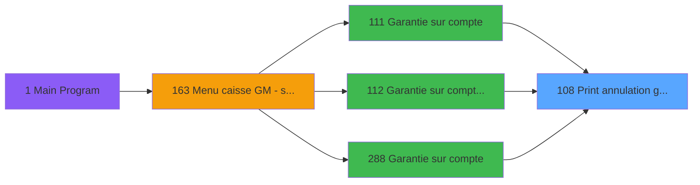

# ADH IDE 108 - Print annulation garantie

> **Analyse**: Phases 1-4 2026-02-07 03:48 -> 03:49 (28s) | Assemblage 15:24
> **Pipeline**: V7.2 Enrichi
> **Structure**: 4 onglets (Resume | Ecrans | Donnees | Connexions)

<!-- TAB:Resume -->

## 1. FICHE D'IDENTITE

| Attribut | Valeur |
|----------|--------|
| Projet | ADH |
| IDE Position | 108 |
| Nom Programme | Print annulation garantie |
| Fichier source | `Prg_108.xml` |
| Dossier IDE | Garanties |
| Taches | 14 (1 ecrans visibles) |
| Tables modifiees | 0 |
| Programmes appeles | 1 |
| Complexite | **BASSE** (score 12/100) |

## 2. DESCRIPTION FONCTIONNELLE

Le programme ADH IDE 108 gère l'impression de documents d'annulation de garantie. Il est appelé depuis trois points d'entrée principaux liés à la gestion des garanties sur compte (IDE 111, 112, 288), ce qui indique son rôle dans le workflow de révocation ou suppression de couvertures de garantie. Le programme interagit avec le gestionnaire d'imprimante (IDE 182) pour réinitialiser l'état de l'imprimante avant le traitement.

La structure tâche révèle un pattern d'édition répétée d'extraits de compte : après une première édition, quatre tâches supplémentaires alternent entre configuration imprimante (Printer 4) et édition d'extrait. Ce pattern suggère la génération de multiples copies du document d'annulation, probablement pour les archives, le client et les différents services impliqués dans la gestion de la garantie.

Le flux d'exécution s'appuie sur des tâches d'impression séquentielles avec réinitialisation préalable, indiquant une forte dépendance à l'état de l'imprimante. L'absence de callees (aucun autre programme n'appelle IDE 108) confirme son rôle terminal dans le processus de garantie.

## 3. BLOCS FONCTIONNELS

### 3.1 Traitement (4 taches)

Traitements internes.

---

#### <a id="t1"></a>T1 - (sans nom)

**Role** : Traitement interne.

<details>
<summary>3 sous-taches directes</summary>

| Tache | Nom | Bloc |
|-------|-----|------|
| [T8](#t8) | Iteration **[ECRAN]** | Traitement |
| [T9](#t9) | Veuillez patienter... **[ECRAN]** | Traitement |
| [T10](#t10) | recup nom adherent | Traitement |

</details>

---

#### <a id="t8"></a>T8 - Iteration [ECRAN]

**Role** : Traitement : Iteration.
**Ecran** : 422 x 56 DLU (MDI) | [Voir mockup](#ecran-t8)

---

#### <a id="t9"></a>T9 - Veuillez patienter... [ECRAN]

**Role** : Traitement : Veuillez patienter....
**Ecran** : 422 x 56 DLU (MDI) | [Voir mockup](#ecran-t9)

---

#### <a id="t10"></a>T10 - recup nom adherent

**Role** : Consultation/chargement : recup nom adherent.
**Variables liees** : B (P0 code adherent), H (W0 n° adherent)


### 3.2 Impression (10 taches)

Generation des documents et tickets.

---

#### <a id="t2"></a>T2 - Printer 1

**Role** : Generation du document : Printer 1.
**Delegue a** : [Raz Current Printer (IDE 182)](ADH-IDE-182.md)

---

#### <a id="t3"></a>T3 - edition extrait compte

**Role** : Generation du document : edition extrait compte.
**Delegue a** : [Raz Current Printer (IDE 182)](ADH-IDE-182.md)

---

#### <a id="t4"></a>T4 - edition extrait compte

**Role** : Generation du document : edition extrait compte.
**Delegue a** : [Raz Current Printer (IDE 182)](ADH-IDE-182.md)

---

#### <a id="t5"></a>T5 - Printer 4

**Role** : Generation du document : Printer 4.
**Delegue a** : [Raz Current Printer (IDE 182)](ADH-IDE-182.md)

---

#### <a id="t6"></a>T6 - edition extrait compte

**Role** : Generation du document : edition extrait compte.
**Delegue a** : [Raz Current Printer (IDE 182)](ADH-IDE-182.md)

---

#### <a id="t7"></a>T7 - edition extrait compte

**Role** : Generation du document : edition extrait compte.
**Delegue a** : [Raz Current Printer (IDE 182)](ADH-IDE-182.md)

---

#### <a id="t11"></a>T11 - Printer 8

**Role** : Generation du document : Printer 8.
**Delegue a** : [Raz Current Printer (IDE 182)](ADH-IDE-182.md)

---

#### <a id="t12"></a>T12 - edition extrait compte

**Role** : Generation du document : edition extrait compte.
**Delegue a** : [Raz Current Printer (IDE 182)](ADH-IDE-182.md)

---

#### <a id="t13"></a>T13 - Printer 9

**Role** : Generation du document : Printer 9.
**Delegue a** : [Raz Current Printer (IDE 182)](ADH-IDE-182.md)

---

#### <a id="t14"></a>T14 - edition extrait compte

**Role** : Generation du document : edition extrait compte.
**Delegue a** : [Raz Current Printer (IDE 182)](ADH-IDE-182.md)


## 5. REGLES METIER

*(Programme d'impression - logique technique sans conditions metier)*

## 6. CONTEXTE

- **Appele par**: [Garantie sur compte (IDE 111)](ADH-IDE-111.md), [Garantie sur compte PMS-584 (IDE 112)](ADH-IDE-112.md), [Garantie sur compte (IDE 288)](ADH-IDE-288.md)
- **Appelle**: 1 programmes | **Tables**: 5 (W:0 R:2 L:3) | **Taches**: 14 | **Expressions**: 8

<!-- TAB:Ecrans -->

## 8. ECRANS

### 8.1 Forms visibles (1 / 14)

| # | Position | Tache | Nom | Type | Largeur | Hauteur | Bloc |
|---|----------|-------|-----|------|---------|---------|------|
| 1 | 108.3.1 | T9 | Veuillez patienter... | MDI | 422 | 56 | Traitement |

### 8.2 Mockups Ecrans

---

#### <a id="ecran-t9"></a>108.3.1 - Veuillez patienter...
**Tache** : [T9](#t9) | **Type** : MDI | **Dimensions** : 422 x 56 DLU
**Bloc** : Traitement | **Titre IDE** : Veuillez patienter...

<!-- FORM-DATA:
{
    "width":  422,
    "vFactor":  8,
    "type":  "MDI",
    "hFactor":  8,
    "controls":  [
                     {
                         "x":  0,
                         "type":  "label",
                         "var":  "",
                         "y":  0,
                         "w":  423,
                         "fmt":  "",
                         "name":  "",
                         "h":  29,
                         "color":  "",
                         "text":  "",
                         "parent":  null
                     },
                     {
                         "x":  120,
                         "type":  "label",
                         "var":  "",
                         "y":  10,
                         "w":  221,
                         "fmt":  "",
                         "name":  "",
                         "h":  8,
                         "color":  "7",
                         "text":  "Impression en cours ...",
                         "parent":  null
                     },
                     {
                         "x":  2,
                         "type":  "label",
                         "var":  "",
                         "y":  29,
                         "w":  420,
                         "fmt":  "",
                         "name":  "",
                         "h":  27,
                         "color":  "",
                         "text":  "",
                         "parent":  null
                     },
                     {
                         "x":  36,
                         "type":  "label",
                         "var":  "",
                         "y":  38,
                         "w":  355,
                         "fmt":  "",
                         "name":  "",
                         "h":  8,
                         "color":  "",
                         "text":  "Impression de l\u0027annulation de garantie",
                         "parent":  null
                     },
                     {
                         "x":  4,
                         "type":  "image",
                         "var":  "",
                         "y":  2,
                         "w":  72,
                         "fmt":  "",
                         "name":  "",
                         "h":  25,
                         "color":  "",
                         "text":  "",
                         "parent":  null
                     }
                 ],
    "taskId":  "108.3.1",
    "height":  56
}
-->

## 9. NAVIGATION

Ecran unique: **Veuillez patienter...**

### 9.3 Structure hierarchique (14 taches)

| Position | Tache | Type | Dimensions | Bloc |
|----------|-------|------|------------|------|
| **108.1** | [**(sans nom)** (T1)](#t1) | MDI | - | Traitement |
| 108.1.1 | [Iteration (T8)](#t8) [mockup](#ecran-t8) | MDI | 422x56 | |
| 108.1.2 | [Veuillez patienter... (T9)](#t9) [mockup](#ecran-t9) | MDI | 422x56 | |
| 108.1.3 | [recup nom adherent (T10)](#t10) | MDI | - | |
| **108.2** | [**Printer 1** (T2)](#t2) | MDI | - | Impression |
| 108.2.1 | [edition extrait compte (T3)](#t3) | MDI | - | |
| 108.2.2 | [edition extrait compte (T4)](#t4) | MDI | - | |
| 108.2.3 | [Printer 4 (T5)](#t5) | MDI | - | |
| 108.2.4 | [edition extrait compte (T6)](#t6) | MDI | - | |
| 108.2.5 | [edition extrait compte (T7)](#t7) | MDI | - | |
| 108.2.6 | [Printer 8 (T11)](#t11) | MDI | - | |
| 108.2.7 | [edition extrait compte (T12)](#t12) | MDI | - | |
| 108.2.8 | [Printer 9 (T13)](#t13) | MDI | - | |
| 108.2.9 | [edition extrait compte (T14)](#t14) | MDI | - | |

### 9.4 Algorigramme

```mermaid
flowchart TD
    START([START])
    B1[Traitement (4t)]
    START --> B1
    B2[Impression (10t)]
    B1 --> B2
    ENDOK([END])
    B2 --> ENDOK
    style START fill:#3fb950,color:#000
    style ENDOK fill:#3fb950,color:#000
```

> *Algorigramme simplifie base sur les blocs fonctionnels. Utiliser `/algorigramme` pour une synthese metier detaillee.*

<!-- TAB:Donnees -->

## 10. TABLES

### Tables utilisees (5)

| ID | Nom | Description | Type | R | W | L | Usages |
|----|-----|-------------|------|---|---|---|--------|
| 39 | depot_garantie___dga | Depots et garanties | DB | R |   |   | 7 |
| 30 | gm-recherche_____gmr | Index de recherche | DB | R |   |   | 1 |
| 91 | garantie_________gar | Depots et garanties | DB |   |   | L | 7 |
| 31 | gm-complet_______gmc |  | DB |   |   | L | 1 |
| 34 | hebergement______heb | Hebergement (chambres) | DB |   |   | L | 1 |

### Colonnes par table (1 / 2 tables avec colonnes identifiees)

<details>
<summary>Table 39 - depot_garantie___dga (R) - 7 usages</summary>

| Lettre | Variable | Acces | Type |
|--------|----------|-------|------|
| A | W1 initialisation | R | Alpha |
| B | W1 large | R | Alpha |
| C | W1 normal | R | Alpha |
| D | W1 condense | R | Alpha |
| E | W1 detection papier | R | Alpha |
| F | W1 inhibe panel | R | Alpha |
| G | W1 massicot | R | Alpha |
| H | W1 selection feuille | R | Alpha |
| I | W1 selection rouleau | R | Alpha |

</details>

<details>
<summary>Table 30 - gm-recherche_____gmr (R) - 1 usages</summary>

*Table utilisee uniquement en Link ou aucune colonne Real identifiee dans le DataView.*

</details>

## 11. VARIABLES

### 11.1 Parametres entrants (5)

Variables recues du programme appelant ([Garantie sur compte (IDE 111)](ADH-IDE-111.md)).

| Lettre | Nom | Type | Usage dans |
|--------|-----|------|-----------|
| A | P0 societe | Alpha | - |
| B | P0 code adherent | Numeric | - |
| C | P0 filiation | Numeric | - |
| D | P0 nom village | Alpha | - |
| E | P0 masque montant | Alpha | - |

### 11.2 Variables de travail (6)

Variables internes au programme.

| Lettre | Nom | Type | Usage dans |
|--------|-----|------|-----------|
| F | W0 nom | Alpha | - |
| G | W0 prenom | Alpha | - |
| H | W0 n° adherent | Numeric | - |
| I | W0 lettre contrôle | Alpha | - |
| J | W0 filiation | Numeric | - |
| K | W0 Chambre | Alpha | - |

## 12. EXPRESSIONS

**8 / 8 expressions decodees (100%)**

### 12.1 Repartition par type

| Type | Expressions | Regles |
|------|-------------|--------|
| OTHER | 2 | 0 |
| CONDITION | 5 | 0 |
| CAST_LOGIQUE | 1 | 0 |

### 12.2 Expressions cles par type

#### OTHER (2 expressions)

| Type | IDE | Expression | Regle |
|------|-----|------------|-------|
| OTHER | 2 | `SetCrsr (1)` | - |
| OTHER | 1 | `SetCrsr (2)` | - |

#### CONDITION (5 expressions)

| Type | IDE | Expression | Regle |
|------|-----|------------|-------|
| CONDITION | 6 | `GetParam ('CURRENTPRINTERNUM')=8` | - |
| CONDITION | 7 | `GetParam ('CURRENTPRINTERNUM')=9` | - |
| CONDITION | 5 | `GetParam ('CURRENTPRINTERNUM')=5` | - |
| CONDITION | 3 | `GetParam ('CURRENTPRINTERNUM')=1` | - |
| CONDITION | 4 | `GetParam ('CURRENTPRINTERNUM')=4` | - |

#### CAST_LOGIQUE (1 expressions)

| Type | IDE | Expression | Regle |
|------|-----|------------|-------|
| CAST_LOGIQUE | 8 | `'TRUE'LOG` | - |

<!-- TAB:Connexions -->

## 13. GRAPHE D'APPELS

### 13.1 Chaine depuis Main (Callers)

Main -> ... -> [Garantie sur compte (IDE 111)](ADH-IDE-111.md) -> **Print annulation garantie (IDE 108)**

Main -> ... -> [Garantie sur compte PMS-584 (IDE 112)](ADH-IDE-112.md) -> **Print annulation garantie (IDE 108)**

Main -> ... -> [Garantie sur compte (IDE 288)](ADH-IDE-288.md) -> **Print annulation garantie (IDE 108)**



### 13.2 Callers

| IDE | Nom Programme | Nb Appels |
|-----|---------------|-----------|
| [111](ADH-IDE-111.md) | Garantie sur compte | 2 |
| [112](ADH-IDE-112.md) | Garantie sur compte PMS-584 | 2 |
| [288](ADH-IDE-288.md) | Garantie sur compte | 2 |

### 13.3 Callees (programmes appeles)


### 13.4 Detail Callees avec contexte

| IDE | Nom Programme | Appels | Contexte |
|-----|---------------|--------|----------|
| [182](ADH-IDE-182.md) | Raz Current Printer | 1 | Impression ticket/document |

## 14. RECOMMANDATIONS MIGRATION

### 14.1 Profil du programme

| Metrique | Valeur | Impact migration |
|----------|--------|-----------------|
| Lignes de logique | 239 | Taille moyenne |
| Expressions | 8 | Peu de logique |
| Tables WRITE | 0 | Impact faible |
| Sous-programmes | 1 | Peu de dependances |
| Ecrans visibles | 1 | Ecran unique ou traitement batch |
| Code desactive | 0% (0 / 239) | Code sain |
| Regles metier | 0 | Pas de regle identifiee |

### 14.2 Plan de migration par bloc

#### Traitement (4 taches: 2 ecrans, 2 traitements)

- **Strategie** : Orchestrateur avec 2 ecrans (Razor/React) et 2 traitements backend (services).
- Les ecrans deviennent des composants UI, les traitements invisibles deviennent des services injectables.
- 1 sous-programme(s) a migrer ou a reutiliser depuis les services existants.
- Decomposer les taches en services unitaires testables.

#### Impression (10 taches: 0 ecran, 10 traitements)

- **Strategie** : Templates HTML -> PDF via wkhtmltopdf ou Puppeteer.
- `PrintService` injectable avec choix imprimante

### 14.3 Dependances critiques

| Dependance | Type | Appels | Impact |
|------------|------|--------|--------|
| [Raz Current Printer (IDE 182)](ADH-IDE-182.md) | Sous-programme | 1x | Normale - Impression ticket/document |

---
*Spec DETAILED generee par Pipeline V7.2 - 2026-02-07 15:25*
