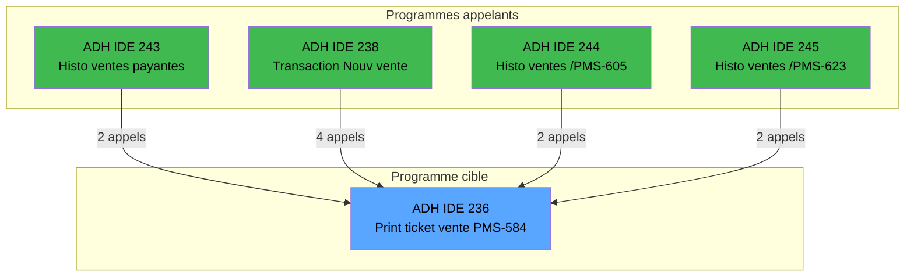

# ADH IDE 236 - Print ticket vente PMS-584

> **Version spec**: 3.0
> **Analyse**: 2026-01-26 22:44 → 22:50
> **Source**: `Prg_232.xml`

---

<!-- TAB:Fonctionnel -->

## SPECIFICATION FONCTIONNELLE

### 1.1 Objectif metier

| Element | Description |
|---------|-------------|
| **Qui** | Operateur de caisse |
| **Quoi** | Impression du ticket de vente |
| **Pourquoi** | Fournir un justificatif au client apres une vente |
| **Declencheur** | Validation d'une vente dans l'ecran de transaction |

### 1.2 Regles metier

| Code | Regle | Condition |
|------|-------|-----------|
| RM-001 | Impression multi-copies | Selon parametre `NUMBERCOPIES` |
| RM-002 | Format selon imprimante | Adapte selon `CURRENTPRINTERNUM` (1,4,5,8,9) |
| RM-003 | Gestion annulation | Affichage mention "ANNULATION" si flag active |
| RM-004 | Mode PDF optionnel | Generation fichier PDF si parametre active |

### 1.3 Flux utilisateur

1. L'operateur valide une vente
2. Le systeme appelle ce programme avec les donnees de vente
3. Le ticket est imprime (ou genere en PDF)
4. Le programme retourne au caller

### 1.4 Cas d'erreur

| Erreur | Comportement |
|--------|--------------|
| Imprimante non disponible | Message d'erreur systeme |
| Donnees manquantes | Ticket incomplet imprime |

---

<!-- TAB:Technique -->

## SPECIFICATION TECHNIQUE

### 2.1 Identification

| Attribut | Valeur |
|----------|--------|
| **Format IDE** | ADH IDE 236 |
| **Fichier XML** | Prg_232.xml |
| **Type** | B (Batch) |
| **Parametres** | 30 |
| **Module** | ADH |
| **Dossier IDE** | Ventes |

### 2.2 Tables (15 tables)

| IDE# | Nom Physique | Nom Logique | Access | Usage |
|------|--------------|-------------|--------|-------|
| #596 | `%club_user%tmp_ecrpolice_dat` | tempo_ecran_police | **W** | 14x |
| #31 | `cafil009_dat` | gm-complet_______gmc | R | 2x |
| #34 | `cafil012_dat` | hebergement______heb | R | 4x |
| #40 | `cafil018_dat` | comptable________cte | R | 4x |
| #67 | `cafil045_dat` | tables___________tab | R | 3x |
| #69 | `cafil047_dat` | initialisation___ini | R | 1x |
| #77 | `cafil055_dat` | articles_________art | R | 3x |
| #263 | `caisse_vente` | vente | R | 4x |
| #728 | `arc_cctotal` | arc_cc_total | R | 1x |
| #818 | `zcircafil146` | Circuit supprime | R | 1x |
| #847 | `%club_user%_stat_lieu_vente_date` | stat_lieu_vente_date | R | 15x |
| #867 | `log_maj_tpe` | log_maj_tpe | R | 5x |
| #878 | `categorie_operation_mw` | categorie_operation_mw | R | 2x |
| #904 | `Boo_AvailibleEmployees` | Boo_AvailibleEmployees | R | 3x |
| #1037 | `Table_1037` | Unknown | R | 2x |

### 2.3 Parametres d'entree (30)

| # | Nom | Type |
|---|-----|------|
| P1 | P0 od annulation | LOGICAL |
| P2 | P0 Nom | ALPHA |
| P3 | P0 Date | DATE |
| P4 | P0 Article libelle 1 | ALPHA |
| P5 | P0 Article complementaire | ALPHA |
| P6 | P0 Qte *NU* | NUMERIC |
| P7 | P0 Prix unitaire | NUMERIC |
| P8 | P0 Total | NUMERIC |
| P9 | P0 Devise locale | ALPHA |
| P10 | P0 Masque | ALPHA |
| P11 | P0 Chambre | ALPHA |
| P12 | P0 mode de paiement | ALPHA |
| P13 | P0 libelle paiement | ALPHA |
| P14 | PO is TAI | LOGICAL |
| P15 | P0 TAI Cash | ALPHA |
| P16 | P0 TAI start date | DATE |
| P17 | P0 TAI end date | DATE |
| P18 | W0 en-tete ? | ALPHA |
| P19 | W0 fin tache | ALPHA |
| P20 | W0 copies | NUMERIC |
| ... | (10 autres) | ... |

### 2.4 Expressions cles

| # | Expression | Signification |
|---|------------|---------------|
| 3 | `GetParam('CURRENTPRINTERNUM')=1` | Imprimante principale |
| 16 | `Translate('%TempDir%')&'ticket_vente_'...` | Chemin fichier PDF |
| 18 | `ExpCalc('3'EXP) OR ExpCalc('7'EXP)` | Condition format special |

### 2.5 Statistiques

| Metrique | Valeur |
|----------|--------|
| Tables | 15 (1W / 14R) |
| Expressions | 705 |
| Expressions decodees | 448 (64%) |
| Variables locales | 39 |

---

<!-- TAB:Cartographie -->

## CARTOGRAPHIE APPLICATIVE

### 3.1 Callers (programmes qui appellent ADH IDE 236)

| IDE | Programme | Description | Nb appels | Dossier |
|-----|-----------|-------------|-----------|---------|
| 243 | ADH IDE 243 | Histo ventes payantes | 2 | Ventes |
| 238 | ADH IDE 238 | Transaction Nouv vente PMS-584 | 4 | Ventes |
| 244 | ADH IDE 244 | Histo ventes payantes /PMS-605 | 2 | Ventes |
| 245 | ADH IDE 245 | Histo ventes payantes /PMS-623 | 2 | Ventes |

> **Total**: 10 appels depuis 4 programmes actifs

### 3.2 Callees (programmes appeles par ADH IDE 236)

| IDE | Programme | Description | Contexte |
|-----|-----------|-------------|----------|
| - | Aucun | Ce programme n'appelle pas d'autres programmes | - |

### 3.3 Diagramme de dependances

### 3.4 Verification orphelin

| Critere | Resultat |
|---------|----------|
| Callers (TaskID obj="232") | **4 programmes** |
| PublicName | Non |
| Dossier | Ventes (actif) |
| **Conclusion** | **Programme ACTIF - NON ORPHELIN** |

### 3.5 Impact modification

| Type de changement | Programmes impactes | Severite |
|--------------------|---------------------|----------|
| Modification signature | 4 programmes | HAUTE |
| Changement format ticket | Aucun (sortie) | BASSE |
| Ajout parametre | 4 programmes | MOYENNE |

---

## HISTORIQUE

| Date | Action | Auteur |
|------|--------|--------|
| 2026-01-26 | Creation specification v2.0 | Claude |
| 2026-01-26 | Ajout section callers | Claude |
| 2026-01-26 | **Upgrade v3.0**: 3 onglets, timing, cartographie Mermaid | Claude |

---

*Specification v3.0 - Format avec onglets Fonctionnel/Technique/Cartographie*
