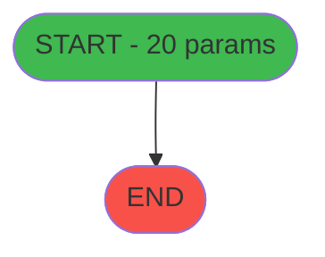
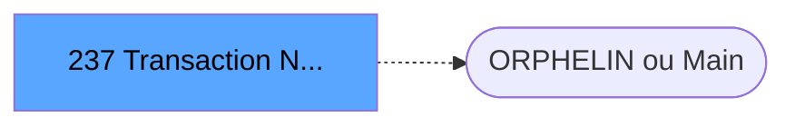
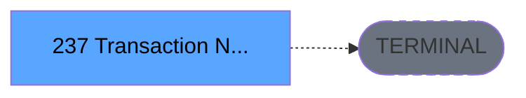

# ADH IDE 237 - Transaction Nouv vente avec GP

> **Version spec**: 5.0
> **Analyse**: 2026-01-28 14:31
> **Source**: `D:\Data\Migration\XPA\PMS\ADH\Source\Prg_233.xml`
> **Methode**: V5.0 Pipeline 4-Phase (Discovery-Mapping-Decode-Synthesis)

---

<!-- TAB:Fonctionnel -->

## SPECIFICATION FONCTIONNELLE

### 1.1 Objectif metier

| Element | Description |
|---------|-------------|
| **Qui** | Operateur (utilisateur connecte) |
| **Quoi** | Transaction Nouv vente avec GP |
| **Pourquoi** | Fonction metier du module ADH |
| **Declencheur** | Appel depuis programme parent ou menu |
| **Resultat** | Traitement effectue selon logique programme |

### 1.2 Regles metier

| Code | Regle | Condition |
|------|-------|-----------
| RM-001 | Traitement principal | Conditions initiales validees |

### 1.3 Flux utilisateur

1. Reception des parametres d'entree (20 params)
2. Initialisation et verification conditions
3. Traitement principal (49 taches)
4. Appels sous-programmes (0 callees)
5. Retour resultats

### 1.4 Cas d'erreur

| Erreur | Comportement |
|--------|--------------
| Conditions non remplies | Abandon avec message |
| Erreur sous-programme | Propagation erreur |
| Donnees invalides | Validation et rejet |

### 1.5 Dependances ECF

Programme partage via **Aucune dependance ECF identifiee**

---

<!-- TAB:Technique -->

## SPECIFICATION TECHNIQUE

### 2.1 Identification

| Attribut | Valeur |
|----------|--------|
| **IDE Position** | 237 |
| **Fichier XML** | `Prg_233.xml` |
| **Description** | Transaction Nouv vente avec GP |
| **Module** | ADH |
| **Nombre taches** | 49 |
| **Lignes logique** | 1818 |
| **Expressions** | 0 |

### 2.2 Tables - 12 tables dont 0 en ecriture

| IDE# | Nom Physique | Nom Logique | Access | Usage |
|------|--------------|-------------|--------|-------|
| #103 | `Table_103` |  | **READ** | 1x |
| #70 | `Table_70` |  | **READ** | 1x |
| #26 | `Table_26` |  | **READ** | 1x |
| #30 | `Table_30` |  | **READ** | 1x |
| #34 | `Table_34` |  | **READ** | 1x |
| #77 | `Table_77` |  | **READ** | 1x |
| #197 | `Table_197` |  | **READ** | 1x |
| #372 | `Table_372` |  | **READ** | 1x |
| #697 | `Table_697` |  | **READ** | 1x |
| #801 | `Table_801` |  | **READ** | 1x |
| #818 | `Table_818` |  | **READ** | 1x |
| #847 | `Table_847` |  | **READ** | 1x |

> *Liste limitee aux 20 tables principales*

### 2.3 Parametres d'entree - 20 parametres

| Var | Nom | Type | Direction | Picture |
|-----|-----|------|-----------|---------
| A | P0 societe | Alpha | IN | U |
| B | P0 devise locale | Alpha | IN | U3 |
| C | P0 masque montant | Alpha | IN | 16 |
| D | P0 solde compte | Numeric | IN | N## ### ### ###.###Z |
| E | P0 code GM | Numeric | IN | ########P0 |
| F | P0 filiation | Numeric | IN | 3L |
| G | P0 date fin sejour | Date | IN | ##/##/##Z |
| H | P0 etat compte | Alpha | IN | U |
| I | P0 date solde | Date | IN | ##/##/##Z |
| J | P0 garanti O/N | Alpha | IN | U |
| K | P0 Nom & prenom | Alpha | IN | 60 |
| L | P0 UNI/BI | Alpha | IN | U |
| M | P0.Date debut sejour | Date | IN | ##/##/##Z |
| N | P0.Valide ? | Numeric | IN | 1 |
| O | P0.Nb decimales | Numeric | IN | 1 |
| P | Bouton IDENTITE | Alpha | IN | 20 |
| Q | Bouton ABANDON | Alpha | IN | 20 |
| R | W0 FIN SAISIE OD | Logical | IN |  |
| S | Bouton FIN SAISIE OD | Alpha | IN | 20 |
| T | W0 Cloture en cours | Logical | IN |  |

### 2.4 Algorigramme

### 2.5 Expressions cles (selection)

| # | Expression | Commentaire |
|---|------------|-------------|
| - | Aucune expression | - |

> *0 expressions au total. Liste limitee aux 10 premieres.*

### 2.6 Statistiques

| Metrique | Valeur |
|----------|--------|
| **Taches** | 49 |
| **Lignes logique** | 1818 |
| **Expressions** | 0 |
| **Parametres** | 20 |
| **Tables accedees** | 12 |
| **Tables en ecriture** | 0 |
| **Callees niveau 1** | 0 |

---

<!-- TAB:Cartographie -->

## CARTOGRAPHIE APPLICATIVE

### 3.1 Chaine d'appels depuis Main

### 3.2 Callers directs

| IDE | Programme | Nb appels |
|-----|-----------|-----------|
| - | ECF partage - appels cross-projet | - |

### 3.3 Callees (3 niveaux)

| Niv | IDE | Programme | Nb appels | Status |
|-----|-----|-----------|-----------|--------|
| - | - | TERMINAL (aucun appel) | - | - |

### 3.4 Composants ECF utilises

| ECF | IDE | Public Name | Description |
|-----|-----|-------------|-------------|
| - | - | Aucun composant ECF | - |

### 3.5 Verification orphelin

| Critere | Resultat |
|---------|----------|
| Callers actifs | 0 programmes |
| PublicName | Non defini |
| ECF partage | NON |
| **Conclusion** | **ORPHELIN CONFIRME** - Aucun des 4 criteres satisfait |

---

## NOTES MIGRATION

### Complexite

| Critere | Score | Detail |
|---------|-------|--------|
| Taches | 49 | Complexe |
| Tables | 12 | Lecture majoritaire |
| Callees | 0 | Faible couplage |
| **Score global** | **730** | **HAUTE** |

### Points d'attention migration

| Point | Solution moderne |
|-------|-----------------
| Variables globales (VG*) | Service/Repository injection |
| Tables Magic | Entity Framework / Dapper |
| CallTask | Service method calls |
| Forms | React/Angular components |

---

## HISTORIQUE

| Date | Action | Auteur |
|------|--------|--------|
| 2026-01-28 14:31 | **V5.0 Pipeline** - Generation automatique 4 phases | Script |

---

*Specification V5.0 - Generated with Pipeline 4-Phase (Discovery-Mapping-Decode-Synthesis)*

