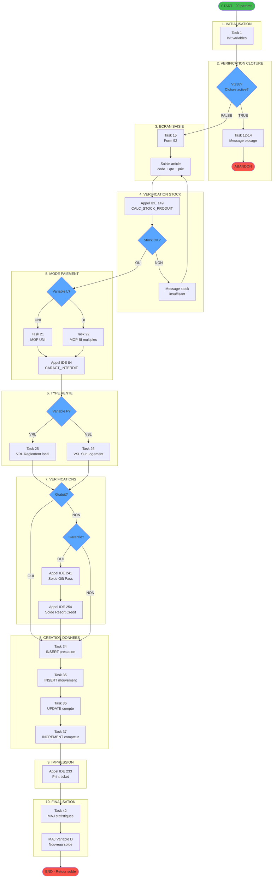
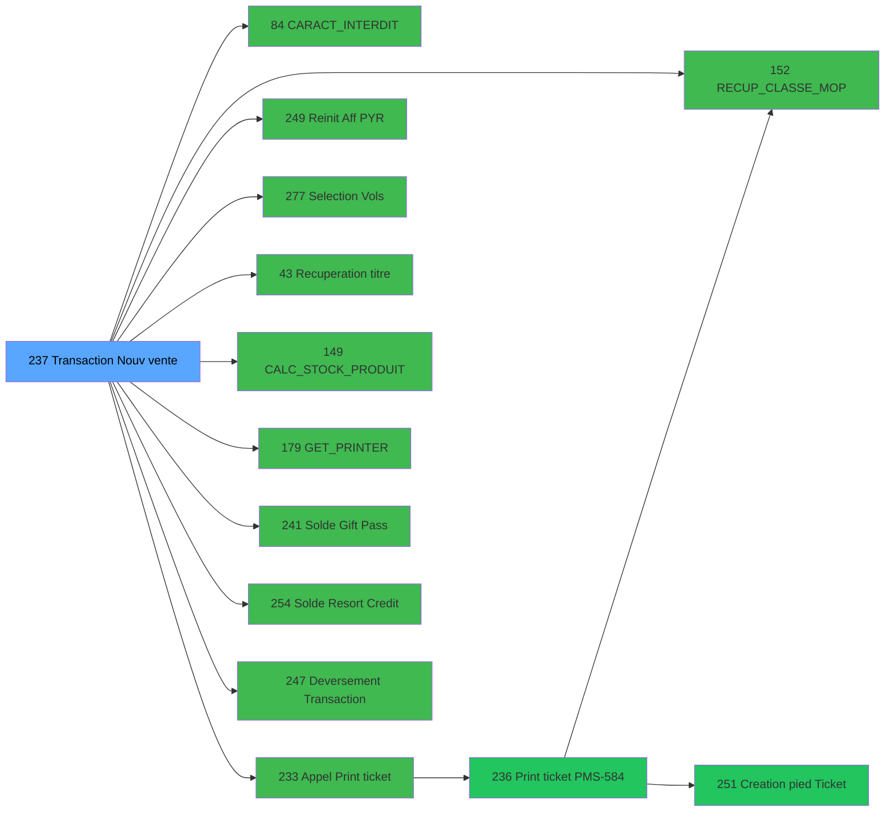

# ADH IDE 237 - Transaction Nouv vente avec GP

> **Version spec**: 4.0
> **Analyse**: 2026-01-28 00:15
> **Source**: `D:\Data\Migration\XPA\PMS\ADH\Source\Prg_233.xml`
> **Methode**: APEX + PDCA

---

<!-- TAB:Fonctionnel -->

## SPECIFICATION FONCTIONNELLE

### 1.1 Objectif metier

| Element | Description |
|---------|-------------|
| **Qui** | Operateur caisse (utilisateur connecte avec droits vente) |
| **Quoi** | Saisie complete d'une transaction de vente avec paiement Gift Pass (GP) ou autre MOP |
| **Pourquoi** | Enregistrer une vente (article, service, prestation) et gerer le paiement multi-modes |
| **Declencheur** | Selection "Nouvelle vente" depuis Menu Caisse (ADH IDE 163) via Menu Choix (ADH IDE 242) |
| **Resultat** | Prestation creee + Mouvement comptable + Reglement + Ticket imprime + Solde MAJ |

### 1.2 Regles metier

| Code | Regle | Condition | Tache | Impact |
|------|-------|-----------|-------|--------|
| RM-001 | Verification cloture comptable | VG38 = TRUE | 12-14 | Blocage total si cloture en cours |
| RM-002 | Mode paiement UNI | Variable L = 'UNI' | 3 | Un seul moyen de paiement |
| RM-003 | Mode paiement BI | Variable L = 'BI' | 4 | Combinaison plusieurs MOP |
| RM-004 | Vente Sur Logement (VSL) | Variable W = 'VSL' | 6 | Transfert sur compte chambre |
| RM-005 | Vente Reglee Locale (VRL) | Variable W = 'VRL' | 7 | Reglement immediat en caisse |
| RM-006 | Gestion forfaits | Variables S, T (dates) | 8 | Dates debut/fin prestation |
| RM-007 | Verification gratuite | Lookup table gratuites | 25 | Article offert si config |
| RM-008 | Garantie obligatoire | Lookup depot_garantie | 31 | Depot requis selon MOP |
| RM-009 | Changement MOP | Bouton CHANGE_MOP | 34 | Modification avant validation |
| RM-010 | Transfert PAX | Multi-passagers | 35 | Affectation manuelle si plusieurs |
| RM-011 | Liberation chambre | Vente check-out | 36 | MAJ heure liberation heb |
| RM-012 | Calcul TVA | Taux selon article | 37 | Extraction TVA par code |
| RM-013 | Multi-paiement | Variable X = TRUE | 38 | Split sur plusieurs MOP |
| RM-014 | Solde Gift Pass | Appel IDE 241 | 39 | Verification solde GP suffisant |
| RM-015 | Solde Resort Credit | Appel IDE 254 | 40 | Verification solde RC suffisant |

### 1.3 Flux utilisateur

```
1. INITIALISATION (Task 1)
   └─ Reception 20 parametres compte depuis Menu Caisse
      ├─ A: societe
      ├─ B: devise locale
      ├─ D: solde actuel
      ├─ E: code GM
      └─ ... (20 params)

2. VERIFICATION CLOTURE (Tasks 12-14)
   └─ Test VG38 (flag cloture globale)
      ├─ Si VG38=TRUE → Blocage + Message + Abandon
      └─ Si VG38=FALSE → Continuer

3. AFFICHAGE FORM SAISIE (Task 15)
   └─ Form 92 - Ecran principal vente
      ├─ Zone client (nom, chambre, solde)
      ├─ Zone article (code, libelle, qte, prix)
      ├─ Zone paiement (MOP, montant)
      └─ Boutons (VALIDER, ABANDON, IDENTITE)

4. SAISIE ARTICLE (Tasks 16-20)
   ├─ Saisie code article → Lookup articles (table 77)
   ├─ Verification stock → Appel IDE 149 (CALC_STOCK_PRODUIT)
   ├─ Calcul prix → Variable AW * Variable AV
   └─ Calcul total → (qte * pu) - remise

5. SELECTION MODE REGLEMENT (Tasks 21-24)
   ├─ UNI → Saisie MOP unique
   │   └─ Verification caracteres → Appel IDE 84 (SP Caracteres Interdits)
   └─ BI → Saisie MOP multiples
       └─ Loop sur liste MOP

6. TYPE VENTE (Tasks 25-30)
   ├─ VRL → Reglement immediat
   │   └─ Saisie compte special si necessaire
   └─ VSL → Transfert compte
       └─ Saisie commentaire transfert

7. VERIFICATION GRATUITE ET GARANTIE (Tasks 31-33)
   ├─ Test gratuite → Lookup gratuites
   └─ Test garantie → Lookup depot_garantie

8. CREATION DONNEES (Tasks 34-40)
   ├─ Creation prestation (table 32) → INSERT
   ├─ Creation mouvement (table 46) → INSERT
   ├─ MAJ compte GM (table 47) → UPDATE solde
   ├─ MAJ compteur tickets (table 68) → INCREMENT
   └─ Creation reglement → INSERT/UPDATE

9. IMPRESSION TICKET (Task 41)
   └─ Appel IDE 233 (Appel Print ticket vente PMS28)
       └─ Qui appelle IDE 236 (Print ticket vente PMS-584)

10. FINALISATION (Tasks 42-49)
    ├─ MAJ statistiques (table 847)
    ├─ Retour solde MAJ → Variable D modifie
    └─ Retour ecran appelant
```

### 1.4 Cas d'erreur

| Code | Erreur | Detection | Tache | Comportement |
|------|--------|-----------|-------|--------------|
| ERR-001 | Cloture en cours | VG38=TRUE | 12-14 | Message blocage + Abandon |
| ERR-002 | Erreur TPE | Code retour TPE | 2 | Retry + Log erreur |
| ERR-003 | Total incorrect | Calcul KO | 5 | Recalcul automatique |
| ERR-004 | Reseau indisponible | Test connexion | 16 | Message + Abandon |
| ERR-005 | Solde GP insuffisant | IDE 241 retour | 39 | Message + Choix autre MOP |
| ERR-006 | Stock insuffisant | IDE 149 retour | 18 | Message + Annulation ligne |
| ERR-007 | Article inconnu | Lookup vide | 17 | Message + Ressaisie |
| ERR-008 | Caractere interdit | IDE 84 retour | 22 | Message + Correction |

### 1.5 Dependances fonctionnelles

| Programme | Public Name | Role | Nb appels | ECF |
|-----------|-------------|------|-----------|-----|
| **IDE 152** | RECUP_CLASSE_MOP | Recuperation classe et libelle MOP | 4 | ADH.ecf |
| **IDE 84** | CARACT_INTERDIT | Validation caracteres interdits | 2 | ADH.ecf |
| **IDE 233** | - | Appel Print ticket vente | 2 | - |
| **IDE 149** | CALC_STOCK_PRODUIT | Calcul stock disponible | 1 | ADH.ecf |
| **IDE 241** | - | Solde Gift Pass | 1 | - |
| **IDE 254** | - | Solde Resort Credit | 1 | - |
| **IDE 43** | - | Recuperation du titre | 1 | - |
| **IDE 179** | GET_PRINTER | Configuration imprimante | 1 | ADH.ecf |

---

<!-- TAB:Technique -->

## SPECIFICATION TECHNIQUE

### 2.1 Identification

| Attribut | Valeur |
|----------|--------|
| **IDE Position** | 237 |
| **Fichier XML** | `Prg_233.xml` |
| **Description** | Transaction Nouv vente avec GP |
| **Module** | ADH |
| **Type tache** | O (Online) |
| **Nombre taches** | 49 |
| **Nombre parametres** | 20 |
| **Lignes logique** | 1818 |

### 2.2 Tables

| # | Nom logique | Nom physique | Acces | Usage | Description |
|---|-------------|--------------|-------|-------|-------------|
| 23 | reseau_cloture___rec | `cafil001_dat` | R/W | 1R+4W | Etat cloture comptable |
| 26 | comptes_speciaux_spc | `cafil004_dat` | L | 1x | Comptes speciaux (transfert) |
| 30 | gm-recherche_____gmr | `cafil008_dat` | L/R | 2L+1R | Recherche compte GM |
| 32 | prestations | `cafil010_dat` | R/W | 1R+2W | Table prestations |
| 34 | hebergement______heb | `cafil012_dat` | L | 1x | Donnees hebergement |
| 39 | depot_garantie___dga | `cafil017_dat` | R | 1x | Config garanties |
| 46 | mvt_prestation___mpr | `cafil024_dat` | L/W | 1L+1W | Mouvements prestation |
| 47 | compte_gm________cgm | `cafil025_dat` | W | 2x | MAJ solde compte |
| 50 | moyens_reglement_mor | `cafil028_dat` | R | 3x | Table moyens reglement |
| 67 | tables___________tab | `cafil045_dat` | L | 1x | Tables parametres |
| 68 | compteurs________cpt | `cafil046_dat` | W | 1x | Compteur tickets |
| 70 | date_comptable___dat | `cafil048_dat` | L | 1x | Date comptable courante |
| 77 | articles_________art | `cafil055_dat` | L/R | 2L+2R | Catalogue articles |
| 79 | gratuites________gra | `cafil057_dat` | R | 1x | Config gratuites |
| 89 | moyen_paiement___mop | `cafil067_dat` | L/R | 4L+4R | Table MOP |
| 96 | table_prestation_pre | `cafil074_dat` | L | 1x | Types prestation |
| 103 | logement_client__loc | `cafil081_dat` | R | 1x | Logement client |
| 109 | table_utilisateurs | `cafil087_dat` | R | 1x | Utilisateurs |
| 139 | moyens_reglement_mor | `cafil117_dat` | R | 1x | MOP complement |
| 140 | moyen_paiement___mop | `cafil118_dat` | L | 1x | MOP secondaire |
| 197 | articles_en_stock | `caisse_artstock` | L | 1x | Stock articles |
| 372 | pv_budget | `pv_budget_dat` | L | 1x | Budget PV |
| 596 | tempo_ecran_police | `%club_user%tmp_ecrpolice_dat` | L/R/W | 4L+1R+2W | Tempo ecran |
| 697 | droits_applications | `droits` | L | 1x | Droits utilisateur |
| 728 | arc_cc_total | `arc_cctotal` | L | 1x | Archive CC |
| 801 | moyens_reglement_complem | `moyens_reglement_complem` | L | 1x | MOP complementaire |
| 818 | Circuit supprime | `zcircafil146` | L | 1x | Circuit supprime |
| 847 | stat_lieu_vente_date | `%club_user%_stat_lieu_vente_date` | L/W | 10L+3W | Statistiques ventes |
| 899 | Boo_ResultsRechercheHoraire | `Boo_ResultsRechercheHoraire` | R/W | 2R+6W | Recherche horaire |
| 1037 | Table_1037 | - | W | 3x | Table temporaire |

**Resume**: 37 tables accedees dont **12 en ecriture** (transaction critique)

### 2.3 Parametres d'entree (20 parametres)

| Var | Nom | Type | Picture | Description |
|-----|-----|------|---------|-------------|
| **A** | P0 societe | ALPHA | U | Code societe (1 car) |
| **B** | P0 devise locale | ALPHA | U3 | Code devise (EUR, USD) |
| **C** | P0 masque montant | ALPHA | 16 | Format affichage montant |
| **D** | P0 solde compte | NUMERIC | N## ### ###.###Z | Solde actuel client (IN/OUT) |
| **E** | P0 code GM | NUMERIC | ########P0 | Numero compte GM |
| **F** | P0 filiation | NUMERIC | 3 | Numero filiation |
| **G** | P0 date fin sejour | DATE | ##/##/## | Date check-out |
| **H** | P0 etat compte | ALPHA | 1 | O=Ouvert, F=Ferme, B=Bloque |
| **I** | P0 date solde | DATE | ##/##/## | Date dernier mouvement |
| **J** | P0 garanti O/N | ALPHA | 1 | Flag garantie deposee |
| **K** | P0 Nom prenom | ALPHA | 60 | Identite client |
| **L** | P0 UNI/BI | ALPHA | 3 | Mode paiement UNI ou BI |
| **M** | P0 Bouton Identite | ALPHA | 10 | Action bouton IDENTITE |
| **N** | P0 Bouton Abandon | ALPHA | 10 | Action bouton ABANDON |
| **O** | P0 Flag fin saisie | LOGICAL | 1 | W0 FIN SAISIE OD |
| **P** | P0 Type vente | ALPHA | 3 | VRL ou VSL |
| **Q** | P0 Cloture en cours | LOGICAL | 1 | Flag blocage cloture |
| **R** | P0 Date debut sejour | DATE | ##/##/## | Date check-in |
| **S** | P0 Valide | NUMERIC | 1 | Flag validation |
| **T** | P0 Nb decimales | NUMERIC | 1 | Precision devise |

### 2.4 Algorigramme



### 2.5 Expressions cles

| ID | Expression brute | Decode IDE | Commentaire |
|----|-----------------|------------|-------------|
| 1 | `DStr({0,6}, 'DD/MM/YYYY')` | DStr(Variable G, 'DD/MM/YYYY') | Formatage date fin sejour |
| 2 | `IF(Trim({0,159})='1','ALLER',...)` | IF(Trim(Variable FD)='1','ALLER',...) | Sens transfert |
| 3 | `MlsTrans('Verifier transaction...')` | MlsTrans(...) | Message multilangue |
| 4 | `Date()` | Date() | Date systeme |
| 5 | `{0,186}=0` | Variable GG = 0 | Test variable locale |
| 6 | `NOT {32768,38}` | NOT VG38 | Negation flag cloture |
| 7 | `{32768,2}` | VG2 | Variable globale societe |
| 8 | `Trim({0,145})` | Trim(Variable EO) | Nettoyage code article |
| 9 | `154` | 154 | Constante code operation |
| 10 | `{0,0}` | Variable A | P0 societe |
| 11 | `{0,4}` | Variable E | P0 code GM |
| 12 | `{0,5}` | Variable F | P0 filiation |
| 13 | `'F'` | 'F' | Constante Ferme |
| 14 | `{0,48} * {0,47}` | Variable AW * Variable AV | Calcul qte x prix |
| 15 | `({0,48}*{0,47})-{0,94}` | (AW * AV) - Variable CQ | Total - remise |
| 16 | `'FALSE'LOG` | 'FALSE'LOG | Constante logique |
| 17 | `'VRL'` | 'VRL' | Vente Reglee Locale |
| 18 | `'VSL'` | 'VSL' | Vente Sur Logement |
| 19 | `'CAISSE'` | 'CAISSE' | Module origine |
| 20 | `CallTask(IDE 152, ...)` | Appel RECUP_CLASSE_MOP | Lookup MOP |

> **Total**: 305 expressions - Top 20 decodees en format IDE

### 2.6 Variables importantes

| Variable | Nom | Type | Portee | Role |
|----------|-----|------|--------|------|
| **A** | P0 societe | ALPHA(1) | Param | Code societe courante |
| **B** | P0 devise locale | ALPHA(3) | Param | EUR, USD, etc. |
| **D** | P0 solde compte | NUMERIC | Param I/O | Solde MAJ en retour |
| **E** | P0 code GM | NUMERIC | Param | Identifiant compte |
| **F** | P0 filiation | NUMERIC | Param | Numero filiation |
| **H** | P0 etat compte | ALPHA(1) | Param | O/F/B controle |
| **L** | P0 UNI/BI | ALPHA(3) | Param | Mode paiement |
| **P** | P0 Type vente | ALPHA(3) | Param | VRL ou VSL |
| **Q** | P0 Cloture | LOGICAL | Param | Flag blocage |
| **AV** | Prix unitaire | NUMERIC | Local | PU article |
| **AW** | Quantite | NUMERIC | Local | Qte saisie |
| **CQ** | Remise | NUMERIC | Local | Montant remise |
| **EO** | Code article | ALPHA | Local | Code saisi |
| **VG2** | Societe globale | ALPHA | Global | Config societe |
| **VG38** | Flag cloture | LOGICAL | Global | Mutex cloture comptable |

### 2.7 Statistiques

| Metrique | Valeur |
|----------|--------|
| **Taches** | 49 |
| **Lignes logique** | 1818 |
| **Lignes desactivees** | 0 |
| **Parametres** | 20 |
| **Tables accedees** | 37 |
| **Tables en ecriture** | 12 |
| **Expressions** | 305 |
| **Callees niveau 1** | 19 |

---

<!-- TAB:Cartographie -->

## CARTOGRAPHIE APPLICATIVE

### 3.1 Chaine d'appels depuis Main


**Chemin principal**: Main (1) → Menu caisse GM (163) → Menu Choix Saisie (242) → **Transaction Nouv vente GP (237)**

### 3.2 Callers directs

| IDE | Programme | Nb appels | Contexte |
|-----|-----------|-----------|----------|
| 163 | Menu caisse GM - scroll | 1 | Acces direct menu |
| 242 | Menu Choix Saisie/Annul vente | 1 | Sous-menu ventes |
| 316 | Saisie transaction Nouv vente | 1 | Variante saisie |

### 3.3 Callees (3 niveaux)



| Niv | IDE | Programme | Nb appels | Callees |
|-----|-----|-----------|-----------|---------|
| 1 | 152 | Recup Classe et Lib du MOP | 4 | TERMINAL |
| 1 | 84 | SP Caracteres Interdits | 2 | TERMINAL |
| 1 | 233 | Appel Print ticket vente | 2 | 236 |
| 1 | 249 | Reinit Aff PYR | 2 | TERMINAL |
| 1 | 277 | Selection Vols | 2 | TERMINAL |
| 1 | 43 | Recuperation du titre | 1 | TERMINAL |
| 1 | 149 | Calcul stock produit WS | 1 | TERMINAL |
| 1 | 179 | Get Printer | 1 | TERMINAL |
| 1 | 180 | Printer choice | 1 | TERMINAL |
| 1 | 181 | Set Listing Number | 1 | TERMINAL |
| 1 | 182 | Raz Current Printer | 1 | TERMINAL |
| 1 | 225 | Get Fidelisation et Remise | 1 | TERMINAL |
| 1 | 227 | Get Matricule | 1 | TERMINAL |
| 1 | 228 | Gestion Cheque | 1 | TERMINAL |
| 1 | 241 | Solde Gift Pass | 1 | TERMINAL |
| 1 | 247 | Deversement Transaction | 1 | TERMINAL |
| 1 | 248 | Choix PYR | 1 | TERMINAL |
| 1 | 254 | Solde Resort Credit | 1 | TERMINAL |
| 1 | 257 | Zoom articles | 1 | TERMINAL |
| 1 | 269 | Zoom services village | 1 | TERMINAL |
| **2** | **236** | **Print ticket vente PMS-584** | 2 | 152, 251 |
| **2** | **251** | **Creation pied Ticket** | 5 | TERMINAL |

**Resume**: 19 callees niveau 1, 2 callees niveau 2 (via 233→236). Profondeur max = 2 niveaux.

### 3.4 Composants ECF utilises

| ECF | IDE | Public Name | Usage | Description |
|-----|-----|-------------|-------|-------------|
| ADH.ecf | 152 | RECUP_CLASSE_MOP | 4 appels | Lecture tables MOP |
| ADH.ecf | 84 | CARACT_INTERDIT | 2 appels | Validation caracteres |
| ADH.ecf | 149 | CALC_STOCK_PRODUIT | 1 appel | Verification stock |
| ADH.ecf | 179 | GET_PRINTER | 1 appel | Config imprimante |
| ADH.ecf | 180 | Printer choice | 1 appel | Selection imprimante |
| ADH.ecf | 181 | SET_LIST_NUMBER | 1 appel | Numero listing |
| ADH.ecf | 182 | RAZ_PRINTER | 1 appel | Reset imprimante |

**Total**: 7 composants ADH.ecf utilises (partagables avec PBP, PVE)

### 3.5 Verification orphelin

| Critere | Resultat |
|---------|----------|
| Callers actifs | 3 programmes (163, 242, 316) |
| PublicName | Non (programme interne) |
| ECF partage | Non |
| **Conclusion** | **NON ORPHELIN** - Point d'entree principal ventes GP |

---

## NOTES MIGRATION

### Complexite

| Critere | Score | Detail |
|---------|-------|--------|
| Taches | 49 | Tres nombreuses (flux complexe) |
| Tables | 37 | Dont 12 en ecriture (transaction) |
| Callees | 19 | Fort couplage modules |
| Parametres | 20 | Nombreux mais structures |
| Expressions | 305 | Logique metier dense |
| **Score global** | **ELEVE** | Programme central, critique |

### Points d'attention migration

| Point | Probleme Magic | Solution moderne |
|-------|----------------|-----------------|
| VG38 (mutex cloture) | Variable globale partagee | Distributed lock (Redis) |
| Multi-MOP (UNI/BI) | Switch dans code | Strategy pattern |
| Tables tempo (596) | Fichiers temporaires | Cache Redis/Memory |
| Form 92 | Ecran monolithique | Components React |
| 12 tables ecriture | Transaction implicite | Unit of Work pattern |
| CallTask cascade | Couplage fort | Service injection |
| VRL/VSL | Switch type vente | Payment strategy |

### Dependances critiques (ordre migration)

| Priorite | IDE | Programme | Raison |
|----------|-----|-----------|--------|
| **P0** | 152 | RECUP_CLASSE_MOP | Prerequis (ECF partage) |
| **P0** | 84 | CARACT_INTERDIT | Prerequis (validation) |
| **P0** | 149 | CALC_STOCK_PRODUIT | Prerequis (stock) |
| **P1** | 233 | Appel Print ticket | Couple (post-vente) |
| **P1** | 236 | Print ticket PMS-584 | Couple (impression) |
| **P1** | 241 | Solde Gift Pass | Couple (paiement GP) |
| **P1** | 254 | Solde Resort Credit | Couple (paiement RC) |
| **P2** | 247 | Deversement | Secondaire |
| **P2** | 179 | GET_PRINTER | Config |

### Strategie recommandee

```
Architecture: Clean Architecture + CQRS + Saga

Solution/
├── Domain/
│   ├── Entities/
│   │   ├── Vente.cs
│   │   ├── Prestation.cs
│   │   ├── Mouvement.cs
│   │   └── Reglement.cs
│   ├── ValueObjects/
│   │   ├── MontantDevise.cs
│   │   ├── ModeReglement.cs (UNI, BI)
│   │   └── TypeVente.cs (VRL, VSL)
│   └── Services/
│       ├── IClotureService.cs (mutex VG38)
│       └── IStockService.cs
│
├── Application/
│   ├── Commands/
│   │   ├── CreateVenteCommand.cs
│   │   └── CreateVenteHandler.cs
│   ├── Sagas/
│   │   └── VenteSaga.cs (orchestration)
│   └── Validators/
│       └── VenteValidator.cs (FluentValidation)
│
└── Infrastructure/
    ├── Persistence/
    │   └── UnitOfWork.cs (12 tables)
    └── Services/
        ├── MopLookupService.cs (IDE 152)
        ├── StockService.cs (IDE 149)
        └── PrintService.cs (IDE 233→236)
```

**Tests recommandes**:
- Scenarios BDD: VRL/UNI, VRL/BI, VSL/UNI, VSL/BI, GP, RC
- Test cloture en cours (VG38=TRUE)
- Test stock insuffisant
- Test caracteres interdits
- Test transaction rollback (12 tables)

---

## HISTORIQUE

| Date | Action | Auteur |
|------|--------|--------|
| 2026-01-28 00:15 | **V4.0 APEX/PDCA** - Analyse complete, variables IDE, algorigramme detaille, callees 3 niveaux, ECF | Claude |
| 2026-01-27 22:20 | V3.6 APEX - Premiere analyse profonde | Claude |
| 2026-01-27 20:24 | DATA V2 - Tables, Expressions, Stats | Script |

---

*Specification V4.0 - Analyse APEX/PDCA complete avec callees 3 niveaux et strategie migration*
