# ADH IDE 237 - Transaction Nouv vente avec GP

> **Version spec**: 5.0
> **Analyse**: 2026-01-28 15:36
> **Source**: `D:\Data\Migration\XPA\PMS\ADH\Source\Prg_233.xml`
> **Methode**: V5.0 Pipeline 4-Phase (Discovery-Mapping-Decode-Synthesis)

---

<!-- TAB:Fonctionnel -->

## SPECIFICATION FONCTIONNELLE

### 1.1 Objectif metier

| Element | Description |
|---------|-------------|
| **Qui** | Operateur (utilisateur connecte) |
| **Quoi** | Transaction Nouv vente avec GP |
| **Pourquoi** | Fonction metier du module ADH |
| **Declencheur** | Appel depuis programme parent ou menu |
| **Resultat** | Traitement effectue selon logique programme |

### 1.2 Regles metier

| Code | Regle | Condition |
|------|-------|-----------
| RM-001 | Validation | IF(Trim(Var_BA)='1','ALLER',IF(Trim(Var_BA)='2'... |
| RM-002 | Navigation | IF(Var_GA=0,IF(Var_W='VSL',Var_M,Date()),Var_CR) |
| RM-003 | Navigation | IF (Var_C='','15.2',Var_C) |
| RM-004 | Navigation | IF({32768,7} OR {32768,35} OR {32768,87},'Var_C... |
| RM-005 | Navigation | IF(NOT Var_CL,Var_CK,Var_CO) |
| RM-006 | Navigation | IF(Var_W='VRL','Date consommation','Date début ... |
| RM-007 | Calculation | IF(Var_CO<>0 AND NOT(Var_CL),Fix(Var_CN*Var_CO/... |
| RM-008 | Navigation | IF(Var_GA=0,IF(Var_W='VSL',Var_G,Var_CS),Var_CS) |
| RM-009 | Navigation | IF(Var_W='VRL' OR Var_W='VSL','Nb forfait',IF(V... |
| RM-010 | Navigation | IF(IN (Var_W,'VRL','VSL','TRF','PYR'),31.125,14... |

### 1.3 Flux utilisateur

1. Reception des parametres d'entree (20 params)
2. Initialisation et verification conditions
3. Traitement principal (49 taches)
4. Appels sous-programmes (0 callees)
5. Retour resultats

### 1.4 Cas d'erreur

| Erreur | Comportement |
|--------|--------------
| Conditions non remplies | Abandon avec message |
| Erreur sous-programme | Propagation erreur |
| Donnees invalides | Validation et rejet |

### 1.5 Dependances ECF

Programme partage via **Aucune dependance ECF identifiee**

---

<!-- TAB:Technique -->

## SPECIFICATION TECHNIQUE

### 2.1 Identification

| Attribut | Valeur |
|----------|--------|
| **IDE Position** | 237 |
| **Fichier XML** | `Prg_233.xml` |
| **Description** | Transaction Nouv vente avec GP |
| **Module** | ADH |
| **Nombre taches** | 49 |
| **Lignes logique** | 1818 |
| **Expressions** | 849 |

### 2.2 Tables - 40 tables dont 9 en ecriture

| IDE# | Nom Physique | Nom Logique | Access | Usage |
|------|--------------|-------------|--------|-------|
| #23 | `cafil001_dat` | reseau_cloture___rec | READ | 1x |
| #23 | `cafil001_dat` | reseau_cloture___rec | WRITE | 4x |
| #26 | `cafil004_dat` | comptes_speciaux_spc | LINK | 1x |
| #30 | `cafil008_dat` | gm-recherche_____gmr | LINK | 2x |
| #30 | `cafil008_dat` | gm-recherche_____gmr | READ | 1x |
| #32 | `cafil010_dat` | prestations | READ | 1x |
| #32 | `cafil010_dat` | prestations | WRITE | 2x |
| #34 | `cafil012_dat` | hebergement______heb | LINK | 1x |
| #39 | `cafil017_dat` | depot_garantie___dga | READ | 1x |
| #46 | `cafil024_dat` | mvt_prestation___mpr | LINK | 1x |
| #46 | `cafil024_dat` | mvt_prestation___mpr | WRITE | 1x |
| #47 | `cafil025_dat` | compte_gm________cgm | WRITE | 2x |
| #50 | `cafil028_dat` | moyens_reglement_mor | READ | 3x |
| #67 | `cafil045_dat` | tables___________tab | LINK | 1x |
| #68 | `cafil046_dat` | compteurs________cpt | WRITE | 1x |
| #70 | `cafil048_dat` | date_comptable___dat | LINK | 1x |
| #77 | `cafil055_dat` | articles_________art | LINK | 2x |
| #77 | `cafil055_dat` | articles_________art | READ | 2x |
| #79 | `cafil057_dat` | gratuites________gra | READ | 1x |
| #89 | `cafil067_dat` | moyen_paiement___mop | LINK | 4x |

> *Liste limitee aux 20 tables principales*

### 2.3 Parametres d'entree - 20 parametres

| Var | Nom | Type | Direction | Picture |
|-----|-----|------|-----------|---------
| A | P0 societe | Alpha | IN | U |
| B | P0 devise locale | Alpha | IN | U3 |
| C | P0 masque montant | Alpha | IN | 16 |
| D | P0 solde compte | Numeric | IN | N## ### ### ###.###Z |
| E | P0 code GM | Numeric | IN | ########P0 |
| F | P0 filiation | Numeric | IN | 3L |
| G | P0 date fin sejour | Date | IN | ##/##/##Z |
| H | P0 etat compte | Alpha | IN | U |
| I | P0 date solde | Date | IN | ##/##/##Z |
| J | P0 garanti O/N | Alpha | IN | U |
| K | P0 Nom & prenom | Alpha | IN | 60 |
| L | P0 UNI/BI | Alpha | IN | U |
| M | P0.Date debut sejour | Date | IN | ##/##/##Z |
| N | P0.Valide ? | Numeric | IN | 1 |
| O | P0.Nb decimales | Numeric | IN | 1 |
| P | Bouton IDENTITE | Alpha | IN | 20 |
| Q | Bouton ABANDON | Alpha | IN | 20 |
| R | W0 FIN SAISIE OD | Logical | IN |  |
| S | Bouton FIN SAISIE OD | Alpha | IN | 20 |
| T | W0 Cloture en cours | Logical | IN |  |

### 2.4 Algorigramme

```mermaid
flowchart TD
    START([START - 20 params])
    T1["1 Transaction Nouv ven..."]
    T2["2 Reglement suite a er..."]
    T3["3 verif reg restant"]
    T4["4 creation rglement"]
    T5["5 Verif total par ligne"]
    T6["6 Dsaffectation"]
    T7["7 Saisie mode de rglem..."]
    T8["8 Saisie mode de rglem..."]
    T9["9 RAZ tempo reglement"]
    T10["10 Saisie commentaire ..."]
    T11["11 Saisie ident cpt sp..."]
    T12["12 Test si cloture en ..."]
    T13["13 Blocage cloture v1"]
    T14["14 Blocage cloture T2H"]
    T15["15 Reaffichage infos c..."]
    T16["16 Test reseau"]
    T17["17 Forfait"]
    T18["18 Saisie des dates fo..."]
    T19["19 Saisie dates forfait"]
    T20["20 Effacement forfait"]
    T21["21 Effacement mvt forfait"]
    T22["22 Creation prestation"]
    T23["23 Deblocage cloture v1"]
    T24["24 Deblocage cloture T2H"]
    T25["25 Gratuite "]
    T26["26 Recherche imputatio..."]
    T27["27 Creation Tempo"]
    T28["28 Creation reglement"]
    T29["29 Creation"]
    T30["30 Affiche saisie"]
    T31["31 garantie"]
    T32["32 RAZ tempo ligne vente"]
    T33["33 Increment Num Ticke..."]
    T34["34 Changement MOP"]
    T35["35 Calcul nombre carte..."]
    T36["36 Raz Affectation Tra..."]
    T37["37 Compte Enregs affects"]
    T38["38 Type Transfert"]
    T39["39 Affiche dtails tran..."]
    T40["40 Affectation PAX  Tr..."]
    T41["41 Supprime enregs non..."]
    T42["42 Compte Enregs affects"]
    T43["43 Tout dcocher"]
    T44["44 Affectation Auto"]
    T45["45 MaJ Num Chque"]
    T46["46 Maj heure Liberatio..."]
    T47["47 Creationheurelibera..."]
    T48["48 RAZ LCO liberation"]
    T49["49 Rcup nb chambres LCO"]
    ENDOK([END])
    START --> T1
    T1 --> T2
    T2 --> T3
    T3 --> T4
    T4 --> T5
    T5 --> T6
    T6 --> T7
    T7 --> T8
    T8 --> T9
    T9 --> T10
    T10 --> T11
    T11 --> T12
    T12 --> T13
    T13 --> T14
    T14 --> T15
    T15 --> T16
    T16 --> T17
    T17 --> T18
    T18 --> T19
    T19 --> T20
    T20 --> T21
    T21 --> T22
    T22 --> T23
    T23 --> T24
    T24 --> T25
    T25 --> T26
    T26 --> T27
    T27 --> T28
    T28 --> T29
    T29 --> T30
    T30 --> T31
    T31 --> T32
    T32 --> T33
    T33 --> T34
    T34 --> T35
    T35 --> T36
    T36 --> T37
    T37 --> T38
    T38 --> T39
    T39 --> T40
    T40 --> T41
    T41 --> T42
    T42 --> T43
    T43 --> T44
    T44 --> T45
    T45 --> T46
    T46 --> T47
    T47 --> T48
    T48 --> T49
    T49 --> ENDOK

    style START fill:#3fb950
    style ENDOK fill:#f85149
```

### 2.5 Expressions cles (selection)

| # | Expression | Commentaire |
|---|------------|-------------|
| 201 | `'Des informations du transfert Aller ne sont pas saisies ...` | Other |
| 202 | `'Des informations du transfert Retour ne sont pas saisies...` | Other |
| 265 | `'Voulez vous utiliser le Gift Pass ?'` | Other |
| 63 | `IF(VG214=6,'RC','GP')` | Condition |
| 11 | `IF({32768,63},'Gift Pass / RC','Gift Pass')` | Condition |
| 12 | `StrBuild(MlsTrans('La quantité totale @1@ ne correspond p...` | Other |

> *849 expressions au total. Liste limitee aux 10 premieres.*

### 2.6 Statistiques

| Metrique | Valeur |
|----------|--------|
| **Taches** | 49 |
| **Lignes logique** | 1818 |
| **Expressions** | 849 |
| **Parametres** | 20 |
| **Tables accedees** | 40 |
| **Tables en ecriture** | 9 |
| **Callees niveau 1** | 0 |

---

<!-- TAB:Cartographie -->

## CARTOGRAPHIE APPLICATIVE

### 3.1 Chaine d'appels depuis Main

### 3.2 Callers directs

| IDE | Programme | Nb appels |
|-----|-----------|-----------|
| - | ECF partage - appels cross-projet | - |

### 3.3 Callees (3 niveaux)

| Niv | IDE | Programme | Nb appels | Status |
|-----|-----|-----------|-----------|--------|
| - | - | TERMINAL (aucun appel) | - | - |

### 3.4 Composants ECF utilises

| ECF | IDE | Public Name | Description |
|-----|-----|-------------|-------------|
| - | - | Aucun composant ECF | - |

### 3.5 Verification orphelin

| Critere | Resultat |
|---------|----------|
| Callers actifs | 0 programmes |
| PublicName | Non defini |
| ECF partage | NON |
| **Conclusion** | **ORPHELIN CONFIRME** - Aucun des 4 criteres satisfait |

---

## NOTES MIGRATION

### Complexite

| Critere | Score | Detail |
|---------|-------|--------|
| Taches | 49 | Complexe |
| Tables | 40 | Ecriture (9 tables) |
| Callees | 0 | Faible couplage |
| **Score global** | **2589** | **TRES HAUTE** |

### Points d'attention migration

| Point | Solution moderne |
|-------|-----------------
| Variables globales (VG*) | Service/Repository injection |
| Tables Magic | Entity Framework / Dapper |
| CallTask | Service method calls |
| Forms | React/Angular components |

---

## HISTORIQUE

| Date | Action | Auteur |
|------|--------|--------|
| 2026-01-28 15:36 | **V5.0 Pipeline** - Generation automatique 4 phases | Script |

---

*Specification V5.0 - Generated with Pipeline 4-Phase (Discovery-Mapping-Decode-Synthesis)*

