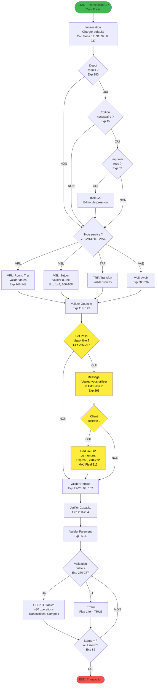
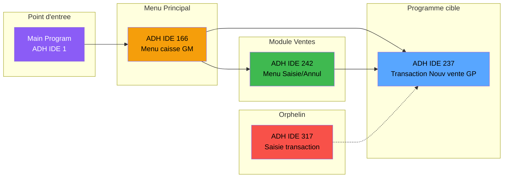

# ADH IDE 237 - Transaction Nouv vente avec GP

> **Version spec**: 3.1
> **Analyse**: 2026-01-27 09:40 → 10:05
> **Source**: `Prg_233.xml`

---

<!-- TAB:Fonctionnel -->

## SPECIFICATION FONCTIONNELLE

### 1.1 Objectif metier

| Element | Description |
|---------|-------------|
| **Qui** | Operateur de caisse |
| **Quoi** | Ecran de transaction de vente avec Gift Pass |
| **Pourquoi** | Permettre la vente avec paiement par Gift Pass |
| **Declencheur** | Selection menu "Nouvelle vente" avec compte Gift Pass |

### 1.2 Regles metier

| Code | Regle | Condition |
|------|-------|-----------|
| RM-001 | Verification solde GP | Solde Gift Pass > 0 et status != 'O' |
| RM-002 | Proposition GP | Message "Voulez-vous utiliser le Gift Pass ?" |
| RM-003 | Deduction automatique | Si accepte: deduction du montant facture |
| RM-004 | Services VRL/VSL/TRF | Validation specifique selon type service |
| RM-005 | Controle capacite | Verification disponibilite places/chambres |
| RM-006 | Validation remise | Remise ne peut depasser le plafond |

### 1.3 Flux utilisateur

1. Selection article depuis catalogue
2. Saisie quantite et prix unitaire
3. Verification solde Gift Pass disponible
4. **Question**: "Voulez-vous utiliser le Gift Pass ?"
5. Si oui: deduction GP du montant
6. Application reduction si code promo
7. Validation transaction
8. Mise a jour compteurs et statistiques

### 1.4 Cas d'erreur

| Erreur | Comportement |
|--------|--------------|
| Solde GP insuffisant | Message d'erreur, refus utilisation GP |
| GP en opposition (status='O') | GP non propose |
| Article derniere minute invalide | Warning, demande confirmation |
| Cloture en cours | Blocage saisie, message informatif |
| Quantite > capacite | Message "Plus de places disponibles" |

---

<!-- TAB:Technique -->

## SPECIFICATION TECHNIQUE

### 2.1 Identification

| Attribut | Valeur |
|----------|--------|
| **Format IDE** | ADH IDE 237 |
| **Fichier XML** | Prg_233.xml |
| **Type** | O (Online) |
| **Parametres** | 20 |
| **Module** | ADH |
| **Dossier IDE** | Ventes |

### 2.2 Tables (30 tables - 9 en ecriture)

| IDE# | Nom Physique | Nom Logique | Access | Usage |
|------|--------------|-------------|--------|-------|
| #23 | `cafil001_dat` | reseau_cloture___rec | **W** | 5x |
| #32 | `cafil010_dat` | prestations | **W** | 3x |
| #46 | `cafil024_dat` | mvt_prestation___mpr | **W** | 2x |
| #47 | `cafil025_dat` | compte_gm________cgm | **W** | 2x |
| #68 | `cafil046_dat` | compteurs________cpt | **W** | 1x |
| #596 | `%club_user%tmp_ecrpolice_dat` | tempo_ecran_police | **W** | 7x |
| #847 | `%club_user%_stat_lieu_vente_date` | stat_lieu_vente_date | **W** | 13x |
| #899 | `Boo_ResultsRechercheHoraire` | Boo_ResultsRechercheHoraire | **W** | 8x |
| #1037 | `Table_1037` | Unknown | **W** | 3x |
| #26 | `cafil004_dat` | comptes_speciaux_spc | R | 1x |
| #30 | `cafil008_dat` | gm-recherche_____gmr | R | 3x |
| #34 | `cafil012_dat` | hebergement______heb | R | 1x |
| #39 | `cafil017_dat` | depot_garantie___dga | R | 1x |
| #50 | `cafil028_dat` | moyens_reglement_mor | R | 3x |
| #67 | `cafil045_dat` | tables___________tab | R | 1x |
| #70 | `cafil048_dat` | date_comptable___dat | R | 1x |
| #77 | `cafil055_dat` | articles_________art | R | 4x |
| #79 | `cafil057_dat` | gratuites________gra | R | 1x |
| #89 | `cafil067_dat` | moyen_paiement___mop | R | 8x |
| #96 | `cafil074_dat` | table_prestation_pre | R | 1x |
| #103 | `cafil081_dat` | logement_client__loc | R | 1x |
| #109 | `cafil087_dat` | table_utilisateurs | R | 1x |
| #139 | `cafil117_dat` | moyens_reglement_mor | R | 1x |
| #140 | `cafil118_dat` | moyen_paiement___mop | R | 1x |
| #197 | `caisse_artstock` | articles_en_stock | R | 1x |
| #372 | `pv_budget_dat` | pv_budget | R | 1x |
| #697 | `droits` | droits_applications | R | 1x |
| #728 | `arc_cctotal` | arc_cc_total | R | 1x |
| #801 | `moyens_reglement_complem` | moyens_reglement_complem | R | 1x |
| #818 | `zcircafil146` | Circuit supprime | R | 1x |

### 2.3 Parametres d'entree (20)

| # | Nom | Type | Description |
|---|-----|------|-------------|
| P1 | P0 societe | ALPHA | Code societe |
| P2 | P0 devise locale | ALPHA | EUR, USD, etc. |
| P3 | P0 masque montant | ALPHA | Format affichage |
| P4 | P0 solde compte | NUMERIC | Solde actuel |
| P5 | P0 code GM | NUMERIC | Code client GM |
| P6 | P0 filiation | NUMERIC | Filiation compte |
| P7 | P0 date fin sejour | DATE | Fin sejour client |
| P8 | P0 etat compte | ALPHA | Etat du compte |
| P9 | P0 date solde | DATE | Date calcul solde |
| P10 | P0 garanti O/N | ALPHA | Compte garanti |
| P11 | P0 Nom & prenom | ALPHA | Identite client |
| P12 | P0 UNI/BI | ALPHA | Type compte |
| P13 | Bouton IDENTITE | ALPHA | Action identite |
| P14 | Bouton ABANDON | ALPHA | Action abandon |
| P15 | W0 FIN SAISIE OD | LOGICAL | Flag fin saisie |
| P16 | Bouton FIN SAISIE OD | ALPHA | Action fin |
| P17 | W0 Cloture en cours | LOGICAL | Flag cloture |
| P18 | W0 code article | NUMERIC | Article selectionne |
| P19 | W0 imputation | NUMERIC | Code imputation |
| P20 | W0 sous-imput. | NUMERIC | Sous-imputation |

### 2.4 Algorigramme

> **Legende**: Jaune = Flux Gift Pass

### 2.5 Expressions cles

| # | Expression | Signification |
|---|------------|---------------|
| 265 | Message GP | "Voulez-vous utiliser le Gift Pass ?" |
| 266 | `{32768,38} AND {0,33}>0 AND {0,135}<>'O'` | GP disponible et pas en opposition |
| 267 | `{0,213} > 0 AND {32768,63}` | Solde GP > 0 |
| 268 | `{0,213}` | Montant solde GP |
| 269 | `{0,214} = 6` | GP epuise |
| 26 | `{0,23}='VRL' OR {0,23}='VSL'` | Service VRL ou VSL |

### 2.6 Variables Gift Pass

| Field | Nom | Type | Role |
|-------|-----|------|------|
| {0,213} | Solde GP | NUMERIC | Solde Gift Pass disponible |
| {0,214} | Status GP | NUMERIC | 6 = epuise |
| {0,135} | Opposition | ALPHA | 'O' = en opposition |
| {32768,38} | GP v2 actif | LOGICAL | Version GP |

### 2.7 Statistiques

| Metrique | Valeur |
|----------|--------|
| Tables | 30 (9W / 21R) |
| Expressions | 849 |
| Expressions decodees | 547 (64%) |
| Variables locales | 171 |
| Operations UPDATE | ~80 |

---

<!-- TAB:Cartographie -->

## CARTOGRAPHIE APPLICATIVE

### 3.1 Chaine d'appels depuis Main

> **Legende**: Violet = Main | Orange = Menu | Vert = Caller actif | Bleu = Cible | Rouge = Orphelin

### 3.2 Callers directs (programmes qui appellent ADH IDE 237)

| IDE | Programme | Description | Nb appels | Chemin depuis Main | Status |
|-----|-----------|-------------|-----------|-------------------|--------|
| 166 | ADH IDE 166 | Menu caisse GM - scroll | 1 | Main → **166** → 237 | ACTIF |
| 242 | ADH IDE 242 | Menu Choix Saisie/Annul vente | 1 | Main → 166 → **242** → 237 | ACTIF |
| 317 | ADH IDE 317 | Saisie transaction Nouv vente | 1 | *Aucun* (Suppr) | ORPHELIN |

> **Total**: 2 appels actifs depuis 2 programmes + 1 orphelin ignore

### 3.3 Callees (programmes appeles par ADH IDE 237)

| IDE | Programme | Description | Contexte |
|-----|-----------|-------------|----------|
| 229 | ADH IDE 229 | Edition/Impression | Si recu necessaire |
| 237 | Task 237 | Validation GP | Interne (sous-tache) |

### 3.4 Verification orphelin

| Critere | Resultat |
|---------|----------|
| Callers (TaskID obj="233") | **3 programmes** |
| Callers actifs | 2 (Prg_162, Prg_238) |
| Callers orphelins | 1 (Prg_313 dans Suppr) |
| PublicName | Non |
| Dossier | Ventes (actif) |
| Distance depuis Main | 2-3 niveaux |
| **Conclusion** | **Programme ACTIF - NON ORPHELIN** |

### 3.5 Impact modification

| Type de changement | Programmes impactes | Severite |
|--------------------|---------------------|----------|
| Modification signature | 2 programmes actifs | CRITIQUE |
| Changement logique GP | Aucun (local) | MOYENNE |
| Ajout parametre | 2 programmes actifs | HAUTE |
| Modification validation | Aucun | BASSE |

### 3.6 Dependances externes

| Dependance | Type | Description |
|------------|------|-------------|
| {32768,38} | VG | Gift Pass v2.00 actif |
| {32768,60} | VG | Flag utilisateur |
| {32768,63} | VG | Condition GP |
| Table #801 | Donnees | Moyens reglement complement |
| Table #728 | Donnees | Archive CC total |

### 3.7 Note sur ADH IDE 317

Le programme ADH IDE 317 (Prg_313.xml) est dans le dossier **Suppr** (orphelin). Son appel vers ADH IDE 237 ne compte pas comme utilisation active car lui-meme n'est jamais appele depuis Main.

---

## HISTORIQUE

| Date | Action | Auteur |
|------|--------|--------|
| 2026-01-26 | Creation specification v2.0 | Claude |
| 2026-01-26 | Ajout section callers et verification orphelin | Claude |
| 2026-01-26 | Upgrade v3.0: 3 onglets, timing, cartographie Mermaid | Claude |
| 2026-01-27 | **Upgrade v3.1**: Algorigramme GP, chaine Main complete | Claude |

---

*Specification v3.1 - Format avec Algorigramme et Chaine Main*
