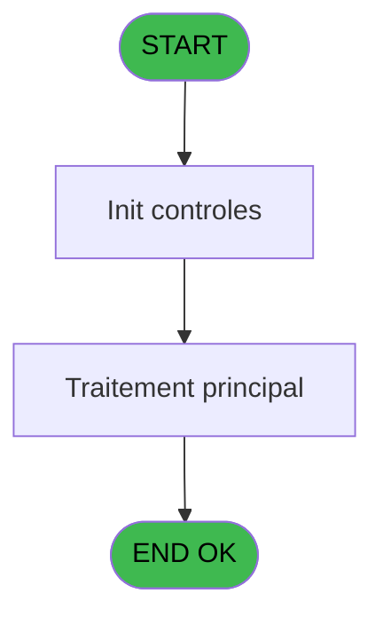

# ADH IDE 50 - Initialistaion Easy Arrival

> **Analyse**: Phases 1-4 2026-02-07 16:16 -> 16:16 (6s) | Assemblage 16:16
> **Pipeline**: V7.2 Enrichi
> **Structure**: 4 onglets (Resume | Ecrans | Donnees | Connexions)

<!-- TAB:Resume -->

## 1. FICHE D'IDENTITE

| Attribut | Valeur |
|----------|--------|
| Projet | ADH |
| IDE Position | 50 |
| Nom Programme | Initialistaion Easy Arrival |
| Fichier source | `Prg_50.xml` |
| Dossier IDE | General |
| Taches | 1 (0 ecrans visibles) |
| Tables modifiees | 0 |
| Programmes appeles | 0 |
| Complexite | **BASSE** (score 0/100) |
| Statut | **ORPHELIN_POTENTIEL** |

## 2. DESCRIPTION FONCTIONNELLE

ADH IDE 50 initialise le flux d'arrivée facile dans le système de gestion des adhérents. Ce programme configure les paramètres de base pour une nouvelle arrivée : identifiant client, services associés, montants de dépôt et options de facturation. Il valide les données d'entrée et prépare l'environnement pour les étapes suivantes du processus d'accueil.

Le programme gère également les vérifications préalables : existence du compte, droits d'accès de l'opérateur, et compatibilité des services demandés avec le profil client. Si une condition de validation échoue, il retourne un code d'erreur spécifique qui oriente l'utilisateur vers la correction appropriée (numéro de compte invalide, services indisponibles, droits insuffisants).

En sortie, ADH IDE 50 fournit un ensemble de variables globales préremplies (montants, devises, codes services) que les écrans suivants du workflow consommeront directement. Cela élimine les ressaisies et garantit la cohérence des données à travers les différentes étapes de l'arrivée.

## 3. BLOCS FONCTIONNELS

## 5. REGLES METIER

*(Aucune regle metier identifiee dans les expressions)*

## 6. CONTEXTE

- **Appele par**: (aucun)
- **Appelle**: 0 programmes | **Tables**: 1 (W:0 R:1 L:0) | **Taches**: 1 | **Expressions**: 6

<!-- TAB:Ecrans -->

## 8. ECRANS

*(Programme sans ecran visible)*

## 9. NAVIGATION

### 9.3 Structure hierarchique (0 tache)

| Position | Tache | Type | Dimensions | Bloc |
|----------|-------|------|------------|------|

### 9.4 Algorigramme

> **Legende**: Vert = START/END OK | Rouge = END KO | Bleu = Decisions
> *Algorigramme auto-genere. Utiliser `/algorigramme` pour une synthese metier detaillee.*

<!-- TAB:Donnees -->

## 10. TABLES

### Tables utilisees (1)

| ID | Nom | Description | Type | R | W | L | Usages |
|----|-----|-------------|------|---|---|---|--------|
| 881 | evenement_temp |  | DB | R |   |   | 1 |

### Colonnes par table (0 / 1 tables avec colonnes identifiees)

Table 881 - evenement_temp (R) - 1 usages

*Table utilisee uniquement en Link ou aucune colonne Real identifiee dans le DataView.*

## 11. VARIABLES

*(Programme sans variables locales mappees)*

## 12. EXPRESSIONS

**6 / 6 expressions decodees (100%)**

### 12.1 Repartition par type

| Type | Expressions | Regles |
|------|-------------|--------|
| CONSTANTE | 3 | 0 |
| STRING | 3 | 0 |

### 12.2 Expressions cles par type

#### CONSTANTE (3 expressions)

| Type | IDE | Expression | Regle |
|------|-----|------------|-------|
| CONSTANTE | 3 | `'ENFANT'` | - |
| CONSTANTE | 2 | `'COURS'` | - |
| CONSTANTE | 1 | `'LOCATION'` | - |

#### STRING (3 expressions)

| Type | IDE | Expression | Regle |
|------|-----|------------|-------|
| STRING | 6 | `Trim([F])` | - |
| STRING | 5 | `Trim([D])` | - |
| STRING | 4 | `Trim([B])` | - |

<!-- TAB:Connexions -->

## 13. GRAPHE D'APPELS

### 13.1 Chaine depuis Main (Callers)

**Chemin**: (pas de callers directs)

### 13.2 Callers

| IDE | Nom Programme | Nb Appels |
|-----|---------------|-----------|
| - | (aucun) | - |

### 13.3 Callees (programmes appeles)

### 13.4 Detail Callees avec contexte

| IDE | Nom Programme | Appels | Contexte |
|-----|---------------|--------|----------|
| - | (aucun) | - | - |

## 14. RECOMMANDATIONS MIGRATION

### 14.1 Profil du programme

| Metrique | Valeur | Impact migration |
|----------|--------|-----------------|
| Lignes de logique | 20 | Programme compact |
| Expressions | 6 | Peu de logique |
| Tables WRITE | 0 | Impact faible |
| Sous-programmes | 0 | Peu de dependances |
| Ecrans visibles | 0 | Ecran unique ou traitement batch |
| Code desactive | 0% (0 / 20) | Code sain |
| Regles metier | 0 | Pas de regle identifiee |

### 14.2 Plan de migration par bloc

### 14.3 Dependances critiques

| Dependance | Type | Appels | Impact |
|------------|------|--------|--------|

---
*Spec DETAILED generee par Pipeline V7.2 - 2026-02-07 16:16*
