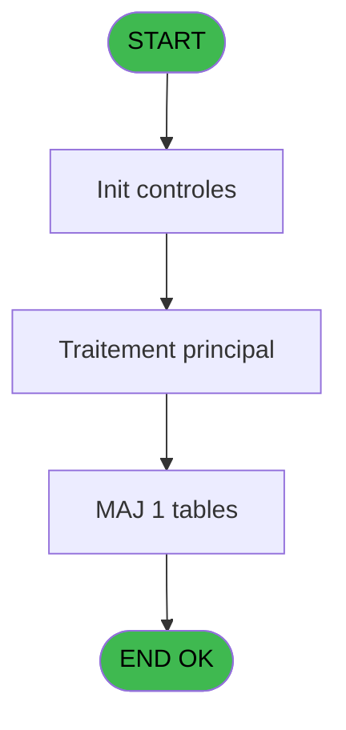

# ADH IDE 60 - Creation entete facture

> **Analyse**: Phases 1-4 2026-02-07 16:16 -> 16:16 (6s) | Assemblage 16:16
> **Pipeline**: V7.2 Enrichi
> **Structure**: 4 onglets (Resume | Ecrans | Donnees | Connexions)

<!-- TAB:Resume -->

## 1. FICHE D'IDENTITE

| Attribut | Valeur |
|----------|--------|
| Projet | ADH |
| IDE Position | 60 |
| Nom Programme | Creation entete facture |
| Fichier source | `Prg_60.xml` |
| Dossier IDE | Facturation |
| Taches | 1 (0 ecrans visibles) |
| Tables modifiees | 1 |
| Programmes appeles | 0 |
| Complexite | **BASSE** (score 7/100) |
| Statut | **ORPHELIN_POTENTIEL** |

## 2. DESCRIPTION FONCTIONNELLE

ADH IDE 60 crée l'en-tête d'une facture TVA en lisant les paramètres de taxation stockés dans la table `taxe_add_param`. Le programme récupère les valeurs de configuration (taux, libellés, codes fiscaux) nécessaires pour initialiser la structure de facture avant d'ajouter les lignes détail. C'est une opération d'initialisation critique qui garantit la cohérence des données fiscales sur toute la facture.

Le programme modifie uniquement `taxe_add_param` pour enregistrer les choix de paramétrage ou mettre à jour les valeurs par défaut utilisées. Les paramètres stockés incluent les taux TVA applicables, les modes de calcul (TVA incluse/excluse), et les codes de ventilation comptable. Ces données persistes permettent à chaque création de facture suivante de réutiliser la configuration sans la ressaisir.

Ce programme s'intègre dans le flux de facturation ADH (modules Factures et Easy Checkout) en amont de la saisie des articles. Une fois l'en-tête créée avec les bons paramètres fiscaux, les programmes de détail (Saisie_facture_tva, FACTURES_CHECK_OUT) peuvent appliquer la TVA correctement ligne par ligne.

## 3. BLOCS FONCTIONNELS

## 5. REGLES METIER

*(Aucune regle metier identifiee dans les expressions)*

## 6. CONTEXTE

- **Appele par**: (aucun)
- **Appelle**: 0 programmes | **Tables**: 1 (W:1 R:0 L:0) | **Taches**: 1 | **Expressions**: 7

<!-- TAB:Ecrans -->

## 8. ECRANS

*(Programme sans ecran visible)*

## 9. NAVIGATION

### 9.3 Structure hierarchique (0 tache)

| Position | Tache | Type | Dimensions | Bloc |
|----------|-------|------|------------|------|

### 9.4 Algorigramme

> **Legende**: Vert = START/END OK | Rouge = END KO | Bleu = Decisions
> *Algorigramme auto-genere. Utiliser `/algorigramme` pour une synthese metier detaillee.*

<!-- TAB:Donnees -->

## 10. TABLES

### Tables utilisees (1)

| ID | Nom | Description | Type | R | W | L | Usages |
|----|-----|-------------|------|---|---|---|--------|
| 932 | taxe_add_param |  | DB |   | **W** |   | 1 |

### Colonnes par table (1 / 1 tables avec colonnes identifiees)

Table 932 - taxe_add_param (**W**) - 1 usages

| Lettre | Variable | Acces | Type |
|--------|----------|-------|------|
| A | p.NumFact | W | Numeric |
| B | p.Nom | W | Unicode |
| C | p.Adresse | W | Unicode |
| D | p.CodePostal | W | Unicode |
| E | p.Ville | W | Unicode |
| F | p.Tel | W | Unicode |
| G | P.Pays | W | Unicode |

## 11. VARIABLES

### 11.1 Parametres entrants (7)

Variables recues en parametre.

| Lettre | Nom | Type | Usage dans |
|--------|-----|------|-----------|
| A | p.NumFact | Numeric | 1x parametre entrant |
| B | p.Nom | Unicode | 1x parametre entrant |
| C | p.Adresse | Unicode | 1x parametre entrant |
| D | p.CodePostal | Unicode | 1x parametre entrant |
| E | p.Ville | Unicode | 1x parametre entrant |
| F | p.Tel | Unicode | 1x parametre entrant |
| G | P.Pays | Unicode | 1x parametre entrant |

## 12. EXPRESSIONS

**7 / 7 expressions decodees (100%)**

### 12.1 Repartition par type

| Type | Expressions | Regles |
|------|-------------|--------|
| OTHER | 7 | 0 |

### 12.2 Expressions cles par type

#### OTHER (7 expressions)

| Type | IDE | Expression | Regle |
|------|-----|------------|-------|
| OTHER | 5 | `p.Ville [E]` | - |
| OTHER | 6 | `p.Tel [F]` | - |
| OTHER | 7 | `P.Pays [G]` | - |
| OTHER | 4 | `p.CodePostal [D]` | - |
| OTHER | 1 | `p.NumFact [A]` | - |
| ... | | *+2 autres* | |

<!-- TAB:Connexions -->

## 13. GRAPHE D'APPELS

### 13.1 Chaine depuis Main (Callers)

**Chemin**: (pas de callers directs)

### 13.2 Callers

| IDE | Nom Programme | Nb Appels |
|-----|---------------|-----------|
| - | (aucun) | - |

### 13.3 Callees (programmes appeles)

### 13.4 Detail Callees avec contexte

| IDE | Nom Programme | Appels | Contexte |
|-----|---------------|--------|----------|
| - | (aucun) | - | - |

## 14. RECOMMANDATIONS MIGRATION

### 14.1 Profil du programme

| Metrique | Valeur | Impact migration |
|----------|--------|-----------------|
| Lignes de logique | 23 | Programme compact |
| Expressions | 7 | Peu de logique |
| Tables WRITE | 1 | Impact faible |
| Sous-programmes | 0 | Peu de dependances |
| Ecrans visibles | 0 | Ecran unique ou traitement batch |
| Code desactive | 0% (0 / 23) | Code sain |
| Regles metier | 0 | Pas de regle identifiee |

### 14.2 Plan de migration par bloc

### 14.3 Dependances critiques

| Dependance | Type | Appels | Impact |
|------------|------|--------|--------|
| taxe_add_param | Table WRITE (Database) | 1x | Schema + repository |

---
*Spec DETAILED generee par Pipeline V7.2 - 2026-02-07 16:17*
