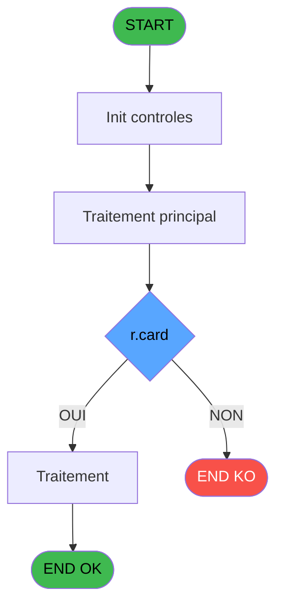

# ADH IDE 80 - Card scan read

> **Analyse**: Phases 1-4 2026-02-07 16:14 -> 16:14 (6s) | Assemblage 16:14
> **Pipeline**: V7.2 Enrichi
> **Structure**: 4 onglets (Resume | Ecrans | Donnees | Connexions)

<!-- TAB:Resume -->

## 1. FICHE D'IDENTITE

| Attribut | Valeur |
|----------|--------|
| Projet | ADH |
| IDE Position | 80 |
| Nom Programme | Card scan read |
| Fichier source | `Prg_80.xml` |
| Dossier IDE | General |
| Taches | 1 (0 ecrans visibles) |
| Tables modifiees | 0 |
| Programmes appeles | 0 |
| Complexite | **BASSE** (score 0/100) |
| Statut | **ORPHELIN_POTENTIEL** |

## 2. DESCRIPTION FONCTIONNELLE

ADH IDE 80 est un programme de lecture de codes à barres/cartes magnétiques destiné à l'identification rapide de clients dans le système de gestion de caisse. Il capture et décode les données brutes du scanner de cartes (code barre, RFID, bande magnétique) et les restitue au programme appelant pour vérification d'identité.

Le programme fonctionne comme un handler événementiel déclenchant une saisie manuelle ou une lecture scanner. Il gère les erreurs de format (code invalide, carte expirée, etc.) et retourne un code client normalisé exploitable par les modules de caisse (vérification droits, chargement compte). La logique inclut probablement une validation du format du code lu, un mapping vers l'ID client en base, et un retour d'erreur si la carte n'existe pas ou est bloquée.

C'est un composant critique de la chaîne d'accès caisse car il conditionne l'authentification initiale du client. Les modules downstream (ADH IDE 121 - Gestion caisse, ADH IDE 122 - Ouverture session) dépendent du code retourné par ce programme pour accéder aux données de compte et autoriser les opérations.

## 3. BLOCS FONCTIONNELS

## 5. REGLES METIER

2 regles identifiees:

### Autres (2 regles)

#### [RM-001] Negation de (r.card [H]) (condition inversee)

| Element | Detail |
|---------|--------|
| **Condition** | `NOT (r.card [H])` |
| **Si vrai** | Action si vrai |
| **Variables** | H (r.card) |
| **Expression source** | Expression 12 : `NOT (r.card [H])` |
| **Exemple** | Si NOT (r.card [H]) → Action si vrai |

#### [RM-002] Condition composite: pv.card id [F]>'' AND NOT (r.card [H])

| Element | Detail |
|---------|--------|
| **Condition** | `pv.card id [F]>'' AND NOT (r.card [H])` |
| **Si vrai** | Action si vrai |
| **Variables** | F (pv.card id), H (r.card) |
| **Expression source** | Expression 15 : `pv.card id [F]>'' AND NOT (r.card [H])` |
| **Exemple** | Si pv.card id [F]>'' AND NOT (r.card [H]) → Action si vrai |

## 6. CONTEXTE

- **Appele par**: (aucun)
- **Appelle**: 0 programmes | **Tables**: 2 (W:0 R:1 L:1) | **Taches**: 1 | **Expressions**: 15

<!-- TAB:Ecrans -->

## 8. ECRANS

*(Programme sans ecran visible)*

## 9. NAVIGATION

### 9.3 Structure hierarchique (0 tache)

| Position | Tache | Type | Dimensions | Bloc |
|----------|-------|------|------------|------|

### 9.4 Algorigramme

> **Legende**: Vert = START/END OK | Rouge = END KO | Bleu = Decisions
> *Algorigramme auto-genere. Utiliser `/algorigramme` pour une synthese metier detaillee.*

<!-- TAB:Donnees -->

## 10. TABLES

### Tables utilisees (2)

| ID | Nom | Description | Type | R | W | L | Usages |
|----|-----|-------------|------|---|---|---|--------|
| 30 | gm-recherche_____gmr | Index de recherche | DB | R |   |   | 1 |
| 312 | ez_card |  | DB |   |   | L | 1 |

### Colonnes par table (2 / 1 tables avec colonnes identifiees)

Table 30 - gm-recherche_____gmr (R) - 1 usages

| Lettre | Variable | Acces | Type |
|--------|----------|-------|------|
| A | p.code-8chiffres | R | Numeric |
| B | p.filiation | R | Numeric |
| C | p.chaine U | R | Alpha |
| D | p.chaine U10 | R | Alpha |
| E | p.Club Med Pass select | R | Logical |
| F | pv.card id | R | Alpha |
| G | p.status | R | Alpha |
| H | r.card | R | Logical |

## 11. VARIABLES

### 11.1 Parametres entrants (6)

Variables recues en parametre.

| Lettre | Nom | Type | Usage dans |
|--------|-----|------|-----------|
| A | p.code-8chiffres | Numeric | - |
| B | p.filiation | Numeric | - |
| C | p.chaine U | Alpha | - |
| D | p.chaine U10 | Alpha | - |
| E | p.Club Med Pass select | Logical | - |
| G | p.status | Alpha | - |

### 11.2 Autres (2)

Variables diverses.

| Lettre | Nom | Type | Usage dans |
|--------|-----|------|-----------|
| F | pv.card id | Alpha | 2x refs |
| H | r.card | Logical | 4x refs |

## 12. EXPRESSIONS

**15 / 15 expressions decodees (100%)**

### 12.1 Repartition par type

| Type | Expressions | Regles |
|------|-------------|--------|
| CALCULATION | 1 | 0 |
| NEGATION | 1 | 5 |
| CONDITION | 1 | 5 |
| CONSTANTE | 1 | 0 |
| OTHER | 10 | 0 |
| CAST_LOGIQUE | 1 | 0 |

### 12.2 Expressions cles par type

#### CALCULATION (1 expressions)

| Type | IDE | Expression | Regle |
|------|-----|------------|-------|
| CALCULATION | 6 | `Right (Trim ([Q]),Len (Trim ([Q]))-1)` | - |

#### NEGATION (1 expressions)

| Type | IDE | Expression | Regle |
|------|-----|------------|-------|
| NEGATION | 12 | `NOT (r.card [H])` | [RM-001](#rm-RM-001) |

#### CONDITION (1 expressions)

| Type | IDE | Expression | Regle |
|------|-----|------------|-------|
| CONDITION | 15 | `pv.card id [F]>'' AND NOT (r.card [H])` | [RM-002](#rm-RM-002) |

#### CONSTANTE (1 expressions)

| Type | IDE | Expression | Regle |
|------|-----|------------|-------|
| CONSTANTE | 1 | `''` | - |

#### OTHER (10 expressions)

| Type | IDE | Expression | Regle |
|------|-----|------------|-------|
| OTHER | 10 | `[K]` | - |
| OTHER | 9 | `[J]` | - |
| OTHER | 11 | `[L]` | - |
| OTHER | 14 | `pv.card id [F]` | - |
| OTHER | 13 | `r.card [H]` | - |
| ... | | *+5 autres* | |

#### CAST_LOGIQUE (1 expressions)

| Type | IDE | Expression | Regle |
|------|-----|------------|-------|
| CAST_LOGIQUE | 7 | `'TRUE'LOG` | - |

<!-- TAB:Connexions -->

## 13. GRAPHE D'APPELS

### 13.1 Chaine depuis Main (Callers)

**Chemin**: (pas de callers directs)

### 13.2 Callers

| IDE | Nom Programme | Nb Appels |
|-----|---------------|-----------|
| - | (aucun) | - |

### 13.3 Callees (programmes appeles)

### 13.4 Detail Callees avec contexte

| IDE | Nom Programme | Appels | Contexte |
|-----|---------------|--------|----------|
| - | (aucun) | - | - |

## 14. RECOMMANDATIONS MIGRATION

### 14.1 Profil du programme

| Metrique | Valeur | Impact migration |
|----------|--------|-----------------|
| Lignes de logique | 34 | Programme compact |
| Expressions | 15 | Peu de logique |
| Tables WRITE | 0 | Impact faible |
| Sous-programmes | 0 | Peu de dependances |
| Ecrans visibles | 0 | Ecran unique ou traitement batch |
| Code desactive | 0% (0 / 34) | Code sain |
| Regles metier | 2 | Quelques regles a preserver |

### 14.2 Plan de migration par bloc

### 14.3 Dependances critiques

| Dependance | Type | Appels | Impact |
|------------|------|--------|--------|

---
*Spec DETAILED generee par Pipeline V7.2 - 2026-02-07 16:15*
