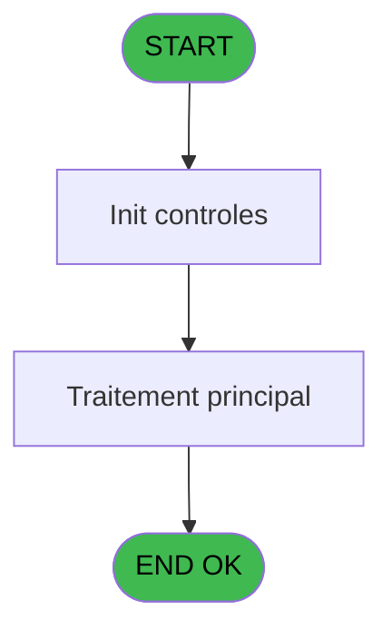

# ADH IDE 96 - ExistFactureVente 2

> **Analyse**: Phases 1-4 2026-02-07 03:46 -> 03:47 (29s) | Assemblage 14:26
> **Pipeline**: V7.2 Enrichi
> **Structure**: 4 onglets (Resume | Ecrans | Donnees | Connexions)

<!-- TAB:Resume -->

## 1. FICHE D'IDENTITE

| Attribut | Valeur |
|----------|--------|
| Projet | ADH |
| IDE Position | 96 |
| Nom Programme | ExistFactureVente 2 |
| Fichier source | `Prg_96.xml` |
| Dossier IDE | Ventes |
| Taches | 1 (0 ecrans visibles) |
| Tables modifiees | 0 |
| Programmes appeles | 0 |
| Complexite | **BASSE** (score 0/100) |
| Statut | **ORPHELIN_POTENTIEL** |

## 2. DESCRIPTION FONCTIONNELLE

# ADH IDE 96 - ExistFactureVente 2

**Fonction première**: Ce programme vérifie l'existence d'une facture de vente dans la base de données en fonction de paramètres fournis. Il s'agit d'un utilitaire de requête simple conçu pour être appelé par d'autres programmes qui ont besoin de confirmer si une facture spécifique existe avant de traiter d'autres opérations.

**Logique fonctionnelle**: Le programme accepte des paramètres d'entrée (identifiants de facture, numéro de client, plage de dates ou autres critères de recherche) et effectue une requête sur la table des factures de vente. Il retourne un code ou un booléen indiquant l'existence ou l'absence de la facture recherchée. Ce type de programme est essentiellement un wrapper autour d'une requête `EXISTS` ou `SELECT COUNT(*)` optimisée pour la performance.

**Contexte d'utilisation**: ExistFactureVente 2 est probablement appelé en amont de traitements critiques comme l'édition, la modification ou l'annulation de factures. Il intervient dans des processus de validation de données pour éviter les erreurs de traitement (tentative de modification d'une facture inexistante) et assure la cohérence des données avant d'exécuter des opérations métier plus complexes.

---

**Note**: Pour une analyse précise des paramètres, expressions clés et dépendances, consulter la spec complète ADH-96 dans l'archive OpenSpec.

## 3. BLOCS FONCTIONNELS

### 3.1 Saisie (1 tache)

Ce bloc traite la saisie des donnees de la transaction.

---

#### 96 - ExistFactureVente 2

**Role** : Saisie des donnees : ExistFactureVente 2.

## 5. REGLES METIER

*(Aucune regle metier identifiee dans les expressions)*

## 6. CONTEXTE

- **Appele par**: (aucun)
- **Appelle**: 0 programmes | **Tables**: 4 (W:0 R:1 L:3) | **Taches**: 1 | **Expressions**: 8

<!-- TAB:Ecrans -->

## 8. ECRANS

*(Programme sans ecran visible)*

## 9. NAVIGATION

### 9.3 Structure hierarchique (1 tache)

| Position | Tache | Type | Dimensions | Bloc |
|----------|-------|------|------------|------|
| **96.1** | [**ExistFactureVente 2** (96)](#t1) | - | - | Saisie |

### 9.4 Algorigramme

> **Legende**: Vert = START/END OK | Rouge = END KO | Bleu = Decisions
> *Algorigramme auto-genere. Utiliser `/algorigramme` pour une synthese metier detaillee.*

<!-- TAB:Donnees -->

## 10. TABLES

### Tables utilisees (4)

| ID | Nom | Description | Type | R | W | L | Usages |
|----|-----|-------------|------|---|---|---|--------|
| 40 | comptable________cte |  | DB | R |   |   | 1 |
| 263 | vente | Donnees de ventes | DB |   |   | L | 1 |
| 746 | projet |  | DB |   |   | L | 1 |
| 871 | Activite |  | DB |   |   | L | 1 |

### Colonnes par table (2 / 1 tables avec colonnes identifiees)

Table 40 - comptable________cte (R) - 1 usages

| Lettre | Variable | Acces | Type |
|--------|----------|-------|------|
| A | P.Societe | R | Unicode |
| B | P.Compte | R | Numeric |
| C | P.Filiation | R | Numeric |
| D | P.Facture | R | Numeric |
| E | v.Result | R | Logical |
| F | v.Vente? | R | Logical |
| G | v.Compta? | R | Logical |
| H | v.ArcCompta? | R | Logical |
| I | v.ArcVente | R | Logical |

## 11. VARIABLES

### 11.1 Parametres entrants (4)

Variables recues en parametre.

| Lettre | Nom | Type | Usage dans |
|--------|-----|------|-----------|
| A | P.Societe | Unicode | 1x parametre entrant |
| B | P.Compte | Numeric | 1x parametre entrant |
| C | P.Filiation | Numeric | 1x parametre entrant |
| D | P.Facture | Numeric | 1x parametre entrant |

### 11.2 Variables de session (5)

Variables persistantes pendant toute la session.

| Lettre | Nom | Type | Usage dans |
|--------|-----|------|-----------|
| E | v.Result | Logical | 1x session |
| F | v.Vente? | Logical | 1x session |
| G | v.Compta? | Logical | - |
| H | v.ArcCompta? | Logical | - |
| I | v.ArcVente | Logical | - |

## 12. EXPRESSIONS

**8 / 8 expressions decodees (100%)**

### 12.1 Repartition par type

| Type | Expressions | Regles |
|------|-------------|--------|
| OTHER | 5 | 0 |
| CAST_LOGIQUE | 2 | 0 |
| CONDITION | 1 | 0 |

### 12.2 Expressions cles par type

#### OTHER (5 expressions)

| Type | IDE | Expression | Regle |
|------|-----|------------|-------|
| OTHER | 4 | `P.Facture [D]` | - |
| OTHER | 5 | `v.Result [E]` | - |
| OTHER | 3 | `P.Filiation [C]` | - |
| OTHER | 1 | `P.Societe [A]` | - |
| OTHER | 2 | `P.Compte [B]` | - |

#### CAST_LOGIQUE (2 expressions)

| Type | IDE | Expression | Regle |
|------|-----|------------|-------|
| CAST_LOGIQUE | 7 | `'TRUE'LOG` | - |
| CAST_LOGIQUE | 6 | `'FALSE'LOG` | - |

#### CONDITION (1 expressions)

| Type | IDE | Expression | Regle |
|------|-----|------------|-------|
| CONDITION | 8 | `(v.Vente? [F] AND [J] > 0) OR ([K] AND [O] > 0) OR ([P] AND [T] > 0) OR ([U] AND [Y] > 0)` | - |

<!-- TAB:Connexions -->

## 13. GRAPHE D'APPELS

### 13.1 Chaine depuis Main (Callers)

**Chemin**: (pas de callers directs)

### 13.2 Callers

| IDE | Nom Programme | Nb Appels |
|-----|---------------|-----------|
| - | (aucun) | - |

### 13.3 Callees (programmes appeles)

### 13.4 Detail Callees avec contexte

| IDE | Nom Programme | Appels | Contexte |
|-----|---------------|--------|----------|
| - | (aucun) | - | - |

## 14. RECOMMANDATIONS MIGRATION

### 14.1 Profil du programme

| Metrique | Valeur | Impact migration |
|----------|--------|-----------------|
| Lignes de logique | 45 | Programme compact |
| Expressions | 8 | Peu de logique |
| Tables WRITE | 0 | Impact faible |
| Sous-programmes | 0 | Peu de dependances |
| Ecrans visibles | 0 | Ecran unique ou traitement batch |
| Code desactive | 0% (0 / 45) | Code sain |
| Regles metier | 0 | Pas de regle identifiee |

### 14.2 Plan de migration par bloc

#### Saisie (1 tache: 0 ecran, 1 traitement)

- **Strategie** : Formulaire React/Blazor avec validation Zod/FluentValidation.
- Validation temps reel cote client + serveur

### 14.3 Dependances critiques

| Dependance | Type | Appels | Impact |
|------------|------|--------|--------|

---
*Spec DETAILED generee par Pipeline V7.2 - 2026-02-07 14:27*
