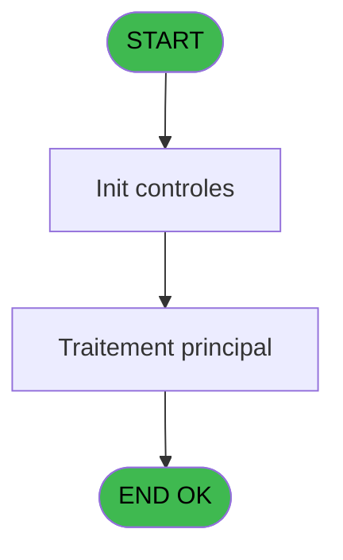

# CAB IDE 15 - Edition od unique

> **Analyse**: Phases 1-4 2026-02-03 10:01 -> 10:01 (15s) | Assemblage 10:01
> **Pipeline**: V7.2 Enrichi
> **Structure**: 4 onglets (Resume | Ecrans | Donnees | Connexions)

<!-- TAB:Resume -->

## 1. FICHE D'IDENTITE

| Attribut | Valeur |
|----------|--------|
| Projet | CAB |
| IDE Position | 15 |
| Nom Programme | Edition od unique |
| Fichier source | `Prg_15.xml` |
| Domaine metier | Impression |
| Taches | 6 (1 ecrans visibles) |
| Tables modifiees | 0 |
| Programmes appeles | 0 |

## 2. DESCRIPTION FONCTIONNELLE

**Edition od unique** assure la gestion complete de ce processus, accessible depuis [  Creation O.D (IDE 16)](CAB-IDE-16.md).

Le flux de traitement s'organise en **2 blocs fonctionnels** :

- **Traitement** (5 taches) : traitements metier divers
- **Impression** (1 tache) : generation de tickets et documents

Detail : phases du traitement

#### Phase 1 : Traitement (5 taches)

- **15** - Veuillez patienter ... **[[ECRAN]](#ecran-t1)**
- **15.2** - Counter
- **15.2.1** - Impression reçu change
- **15.3.1** - Veuillez patienter ... **[[ECRAN]](#ecran-t5)**
- **15.3** - Nb copies normal

#### Phase 2 : Impression (1 tache)

- **15.1** - Choix imprimante v1

## 3. BLOCS FONCTIONNELS

### 3.1 Traitement (5 taches)

Traitements internes.

---

#### 15 - Veuillez patienter ... [[ECRAN]](#ecran-t1)

**Role** : Traitement : Veuillez patienter ....
**Ecran** : 422 x 56 DLU (MDI) | [Voir mockup](#ecran-t1)

4 sous-taches directes

| Tache | Nom | Bloc |
|-------|-----|------|
| [15.2](#t3) | Counter | Traitement |
| [15.2.1](#t4) | Impression reçu change | Traitement |
| [15.3.1](#t5) | Veuillez patienter ... **[[ECRAN]](#ecran-t5)** | Traitement |
| [15.3](#t9) | Nb copies normal | Traitement |

---

#### 15.2 - Counter

**Role** : Traitement : Counter.

---

#### 15.2.1 - Impression reçu change

**Role** : Generation du document : Impression reçu change.

---

#### 15.3.1 - Veuillez patienter ... [[ECRAN]](#ecran-t5)

**Role** : Traitement : Veuillez patienter ....
**Ecran** : 424 x 56 DLU (MDI) | [Voir mockup](#ecran-t5)

---

#### 15.3 - Nb copies normal

**Role** : Traitement : Nb copies normal.
**Variables liees** : P (W0 nb copies)

### 3.2 Impression (1 tache)

Generation des documents et tickets.

---

#### 15.1 - Choix imprimante v1

**Role** : Selection par l'operateur : Choix imprimante v1.
**Variables liees** : O (W0 imprimante)

## 5. REGLES METIER

*(Aucune regle metier identifiee)*

## 6. CONTEXTE

- **Appele par**: [  Creation O.D (IDE 16)](CAB-IDE-16.md)
- **Appelle**: 0 programmes | **Tables**: 2 (W:0 R:2 L:0) | **Taches**: 6 | **Expressions**: 9

<!-- TAB:Ecrans -->

## 8. ECRANS

### 8.1 Forms visibles (1 / 6)

| # | Position | Tache | Nom | Type | Largeur | Hauteur | Bloc |
|---|----------|-------|-----|------|---------|---------|------|
| 1 | 15 | 15 | Veuillez patienter ... | MDI | 422 | 56 | Traitement |

### 8.2 Mockups Ecrans

---

#### 15 - Veuillez patienter ...
**Tache** : [15](#t1) | **Type** : MDI | **Dimensions** : 422 x 56 DLU
**Bloc** : Traitement | **Titre IDE** : Veuillez patienter ...

<!-- FORM-DATA:
{
    "width":  422,
    "vFactor":  8,
    "type":  "MDI",
    "hFactor":  8,
    "controls":  [
                     {
                         "x":  0,
                         "type":  "label",
                         "var":  "",
                         "y":  0,
                         "w":  423,
                         "fmt":  "",
                         "name":  "",
                         "h":  29,
                         "color":  "",
                         "text":  "",
                         "parent":  null
                     },
                     {
                         "x":  120,
                         "type":  "label",
                         "var":  "",
                         "y":  10,
                         "w":  221,
                         "fmt":  "",
                         "name":  "",
                         "h":  8,
                         "color":  "7",
                         "text":  "Impression en cours ...",
                         "parent":  null
                     },
                     {
                         "x":  0,
                         "type":  "label",
                         "var":  "",
                         "y":  29,
                         "w":  423,
                         "fmt":  "",
                         "name":  "",
                         "h":  27,
                         "color":  "",
                         "text":  "",
                         "parent":  null
                     },
                     {
                         "x":  114,
                         "type":  "label",
                         "var":  "",
                         "y":  38,
                         "w":  203,
                         "fmt":  "",
                         "name":  "",
                         "h":  8,
                         "color":  "",
                         "text":  "Edition reçu change",
                         "parent":  null
                     },
                     {
                         "x":  4,
                         "type":  "image",
                         "var":  "",
                         "y":  2,
                         "w":  72,
                         "fmt":  "",
                         "name":  "",
                         "h":  25,
                         "color":  "",
                         "text":  "",
                         "parent":  null
                     }
                 ],
    "taskId":  "15",
    "height":  56
}
-->

## 9. NAVIGATION

Ecran unique: **Veuillez patienter ...**

### 9.3 Structure hierarchique (6 taches)

| Position | Tache | Type | Dimensions | Bloc |
|----------|-------|------|------------|------|
| **15.1** | [**Veuillez patienter ...** (15)](#t1) [mockup](#ecran-t1) | MDI | 422x56 | Traitement |
| 15.1.1 | [Counter (15.2)](#t3) | MDI | - | |
| 15.1.2 | [Impression reçu change (15.2.1)](#t4) | MDI | - | |
| 15.1.3 | [Veuillez patienter ... (15.3.1)](#t5) [mockup](#ecran-t5) | MDI | 424x56 | |
| 15.1.4 | [Nb copies normal (15.3)](#t9) | - | - | |
| **15.2** | [**Choix imprimante v1** (15.1)](#t2) | MDI | - | Impression |

### 9.4 Algorigramme

> **Legende**: Vert = START/END OK | Rouge = END KO | Bleu = Decisions
> *Algorigramme auto-genere. Utiliser `/algorigramme` pour une synthese metier detaillee.*

<!-- TAB:Donnees -->

## 10. TABLES

### Tables utilisees (2)

| ID | Nom | Description | Type | R | W | L | Usages |
|----|-----|-------------|------|---|---|---|--------|
| 24 | imprimante_______prn |  | DB | R |   |   | 1 |
| 69 | initialisation___ini |  | DB | R |   |   | 1 |

### Colonnes par table (2 / 2 tables avec colonnes identifiees)

Table 24 - imprimante_______prn (R) - 1 usages

| Lettre | Variable | Acces | Type |
|--------|----------|-------|------|
| O | W0 imprimante | R | Numeric |

Table 69 - initialisation___ini (R) - 1 usages

| Lettre | Variable | Acces | Type |
|--------|----------|-------|------|
| A | P0 od annulation | R | Logical |
| B | P0 Nom | R | Alpha |
| C | P0 Date | R | Date |
| D | P0 Article libelle 1 | R | Alpha |
| E | P0 Article complementaire | R | Alpha |
| F | P0 Qte | R | Numeric |
| G | P0 Prix unitaire | R | Numeric |
| H | P0 Total | R | Numeric |
| I | P0 Devise locale | R | Alpha |
| J | P0 Masque | R | Alpha |
| K | P0 Date Appel | R | Date |
| L | P0 Heure Appel | R | Time |
| M | P0 fictif | R | Logical |
| N | P0 duree | R | Time |
| O | W0 imprimante | R | Numeric |
| P | W0 nb copies | R | Numeric |
| Q | W0 en-tête ? | R | Alpha |
| R | W0 fin tâche | R | Alpha |

## 11. VARIABLES

### 11.1 Parametres entrants (14)

Variables recues du programme appelant ([  Creation O.D (IDE 16)](CAB-IDE-16.md)).

| Lettre | Nom | Type | Usage dans |
|--------|-----|------|-----------|
| A | P0 od annulation | Logical | - |
| B | P0 Nom | Alpha | - |
| C | P0 Date | Date | - |
| D | P0 Article libelle 1 | Alpha | - |
| E | P0 Article complementaire | Alpha | - |
| F | P0 Qte | Numeric | - |
| G | P0 Prix unitaire | Numeric | - |
| H | P0 Total | Numeric | - |
| I | P0 Devise locale | Alpha | - |
| J | P0 Masque | Alpha | - |
| K | P0 Date Appel | Date | - |
| L | P0 Heure Appel | Time | - |
| M | P0 fictif | Logical | - |
| N | P0 duree | Time | - |

### 11.2 Variables de travail (4)

Variables internes au programme.

| Lettre | Nom | Type | Usage dans |
|--------|-----|------|-----------|
| O | W0 imprimante | Numeric | [15.1](#t2) |
| P | W0 nb copies | Numeric | - |
| Q | W0 en-tête ? | Alpha | - |
| R | W0 fin tâche | Alpha | - |

Toutes les 18 variables (liste complete)

| Cat | Lettre | Nom Variable | Type |
|-----|--------|--------------|------|
| P0 | **A** | P0 od annulation | Logical |
| P0 | **B** | P0 Nom | Alpha |
| P0 | **C** | P0 Date | Date |
| P0 | **D** | P0 Article libelle 1 | Alpha |
| P0 | **E** | P0 Article complementaire | Alpha |
| P0 | **F** | P0 Qte | Numeric |
| P0 | **G** | P0 Prix unitaire | Numeric |
| P0 | **H** | P0 Total | Numeric |
| P0 | **I** | P0 Devise locale | Alpha |
| P0 | **J** | P0 Masque | Alpha |
| P0 | **K** | P0 Date Appel | Date |
| P0 | **L** | P0 Heure Appel | Time |
| P0 | **M** | P0 fictif | Logical |
| P0 | **N** | P0 duree | Time |
| W0 | **O** | W0 imprimante | Numeric |
| W0 | **P** | W0 nb copies | Numeric |
| W0 | **Q** | W0 en-tête ? | Alpha |
| W0 | **R** | W0 fin tâche | Alpha |

## 12. EXPRESSIONS

**9 / 9 expressions decodees (100%)**

### 12.1 Repartition par type

| Type | Expressions | Regles |
|------|-------------|--------|
| CONSTANTE | 2 | 0 |
| CONDITION | 2 | 0 |
| OTHER | 2 | 0 |
| NEGATION | 1 | 0 |
| REFERENCE_VG | 1 | 0 |
| CAST_LOGIQUE | 1 | 0 |

### 12.2 Expressions cles par type

#### CONSTANTE (2 expressions)

| Type | IDE | Expression | Regle |
|------|-----|------------|-------|
| CONSTANTE | 8 | `501` | - |
| CONSTANTE | 7 | `'CAB'` | - |

#### CONDITION (2 expressions)

| Type | IDE | Expression | Regle |
|------|-----|------------|-------|
| CONDITION | 2 | `W0 imprimante [O]>4` | - |
| CONDITION | 1 | `W0 imprimante [O]<5` | - |

#### OTHER (2 expressions)

| Type | IDE | Expression | Regle |
|------|-----|------------|-------|
| OTHER | 4 | `SetCrsr (1)` | - |
| OTHER | 3 | `SetCrsr (2)` | - |

#### NEGATION (1 expressions)

| Type | IDE | Expression | Regle |
|------|-----|------------|-------|
| NEGATION | 5 | `NOT VG6` | - |

#### REFERENCE_VG (1 expressions)

| Type | IDE | Expression | Regle |
|------|-----|------------|-------|
| REFERENCE_VG | 6 | `VG6` | - |

#### CAST_LOGIQUE (1 expressions)

| Type | IDE | Expression | Regle |
|------|-----|------------|-------|
| CAST_LOGIQUE | 9 | `'TRUE'LOG` | - |

<!-- TAB:Connexions -->

## 13. GRAPHE D'APPELS

### 13.1 Chaine depuis Main (Callers)

Main -> ... -> [  Creation O.D (IDE 16)](CAB-IDE-16.md) -> **Edition od unique (IDE 15)**

### 13.2 Callers

| IDE | Nom Programme | Nb Appels |
|-----|---------------|-----------|
| [16](CAB-IDE-16.md) |   Creation O.D | 1 |

### 13.3 Callees (programmes appeles)

### 13.4 Detail Callees avec contexte

| IDE | Nom Programme | Appels | Contexte |
|-----|---------------|--------|----------|
| - | (aucun) | - | - |

## 14. RECOMMANDATIONS MIGRATION

### 14.1 Profil du programme

| Metrique | Valeur | Impact migration |
|----------|--------|-----------------|
| Lignes de logique | 53 | Programme compact |
| Expressions | 9 | Peu de logique |
| Tables WRITE | 0 | Impact faible |
| Sous-programmes | 0 | Peu de dependances |
| Ecrans visibles | 1 | Ecran unique ou traitement batch |
| Code desactive | 0% (0 / 53) | Code sain |
| Regles metier | 0 | Pas de regle identifiee |

### 14.2 Plan de migration par bloc

#### Traitement (5 taches: 2 ecrans, 3 traitements)

- **Strategie** : Orchestrateur avec 2 ecrans (Razor/React) et 3 traitements backend (services).
- Les ecrans deviennent des composants UI, les traitements invisibles deviennent des services injectables.
- Decomposer les taches en services unitaires testables.

#### Impression (1 tache: 0 ecran, 1 traitement)

- **Strategie** : Templates HTML -> PDF via wkhtmltopdf ou Puppeteer.
- `PrintService` injectable avec choix imprimante

### 14.3 Dependances critiques

| Dependance | Type | Appels | Impact |
|------------|------|--------|--------|

---
*Spec DETAILED generee par Pipeline V7.2 - 2026-02-03 10:01*
