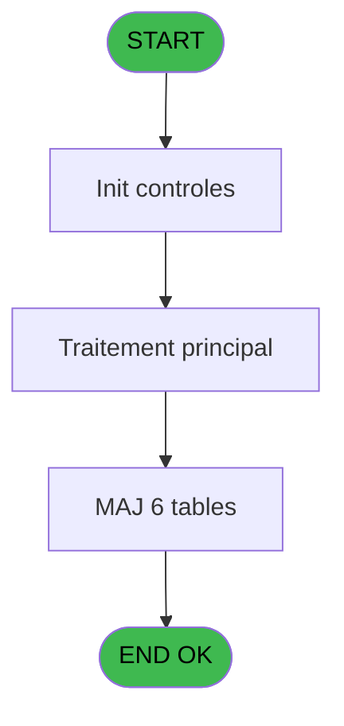

# CAB IDE 16 - Creation O.D

> **Analyse**: Phases 1-4 2026-02-03 10:01 -> 10:01 (14s) | Assemblage 10:01
> **Pipeline**: V7.2 Enrichi
> **Structure**: 4 onglets (Resume | Ecrans | Donnees | Connexions)

<!-- TAB:Resume -->

## 1. FICHE D'IDENTITE

| Attribut | Valeur |
|----------|--------|
| Projet | CAB |
| IDE Position | 16 |
| Nom Programme | Creation O.D |
| Fichier source | `Prg_16.xml` |
| Domaine metier | General |
| Taches | 7 (0 ecrans visibles) |
| Tables modifiees | 6 |
| Programmes appeles | 1 |

## 2. DESCRIPTION FONCTIONNELLE

**Creation O.D** assure la gestion complete de ce processus, accessible depuis [Facturation appel (IDE 20)](CAB-IDE-20.md).

Le flux de traitement s'organise en **4 blocs fonctionnels** :

- **Creation** (4 taches) : insertion d'enregistrements en base (mouvements, prestations)
- **Consultation** (1 tache) : ecrans de recherche, selection et consultation
- **Traitement** (1 tache) : traitements metier divers
- **Saisie** (1 tache) : ecrans de saisie utilisateur (formulaires, champs, donnees)

**Donnees modifiees** : 6 tables en ecriture (gm-recherche_____gmr, comptable_gratuite, compte_gm________cgm, gratuites________gra, intermed__gratuititg, intermed_compta__ite).

Detail : phases du traitement

#### Phase 1 : Saisie (1 tache)

- **16** - Saisie d'un O.D unique **[[ECRAN]](#ecran-t1)**

#### Phase 2 : Creation (4 taches)

- **16.1** - Creation d'un O.D
- **16.2** - Creation d'un O.D
- **16.3** - Creation d'un O.D
- **16.4** - Creation d'un O.D

#### Phase 3 : Traitement (1 tache)

- **16.5** - Gratuite ?

#### Phase 4 : Consultation (1 tache)

- **16.5.1** - Recherche imputation/ssimput

#### Tables impactees

| Table | Operations | Role metier |
|-------|-----------|-------------|
| intermed_compta__ite | **W** (1 usages) |  |
| gm-recherche_____gmr | **W** (1 usages) | Index de recherche |
| compte_gm________cgm | **W** (1 usages) | Comptes GM (generaux) |
| comptable_gratuite | **W** (1 usages) |  |
| gratuites________gra | **W** (1 usages) |  |
| intermed__gratuititg | **W** (1 usages) |  |

## 3. BLOCS FONCTIONNELS

### 3.1 Saisie (1 tache)

L'operateur saisit les donnees de la transaction via 1 ecran (Saisie d'un O.D unique).

---

#### 16 - Saisie d'un O.D unique [[ECRAN]](#ecran-t1)

**Role** : Saisie des donnees : Saisie d'un O.D unique.
**Ecran** : 1042 x 215 DLU (MDI) | [Voir mockup](#ecran-t1)

### 3.2 Creation (4 taches)

Insertion de nouveaux enregistrements en base.

---

#### 16.1 - Creation d'un O.D

**Role** : Creation d'enregistrement : Creation d'un O.D.

---

#### 16.2 - Creation d'un O.D

**Role** : Creation d'enregistrement : Creation d'un O.D.

---

#### 16.3 - Creation d'un O.D

**Role** : Creation d'enregistrement : Creation d'un O.D.

---

#### 16.4 - Creation d'un O.D

**Role** : Creation d'enregistrement : Creation d'un O.D.

### 3.3 Traitement (1 tache)

Traitements internes.

---

#### 16.5 - Gratuite ?

**Role** : Traitement : Gratuite ?.
**Variables liees** : P (P0 gratuite), Q (P0 raison gratuite), U (W0 gratuite ?)

### 3.4 Consultation (1 tache)

Ecrans de recherche et consultation.

---

#### 16.5.1 - Recherche imputation/ssimput

**Role** : Traitement : Recherche imputation/ssimput.

## 5. REGLES METIER

*(Aucune regle metier identifiee)*

## 6. CONTEXTE

- **Appele par**: [Facturation appel (IDE 20)](CAB-IDE-20.md)
- **Appelle**: 1 programmes | **Tables**: 11 (W:6 R:1 L:4) | **Taches**: 7 | **Expressions**: 15

<!-- TAB:Ecrans -->

## 8. ECRANS

*(Programme sans ecran visible)*

## 9. NAVIGATION

### 9.3 Structure hierarchique (7 taches)

| Position | Tache | Type | Dimensions | Bloc |
|----------|-------|------|------------|------|
| **16.1** | [**Saisie d'un O.D unique** (16)](#t1) [mockup](#ecran-t1) | MDI | 1042x215 | Saisie |
| **16.2** | [**Creation d'un O.D** (16.1)](#t2) | MDI | - | Creation |
| 16.2.1 | [Creation d'un O.D (16.2)](#t3) | MDI | - | |
| 16.2.2 | [Creation d'un O.D (16.3)](#t4) | MDI | - | |
| 16.2.3 | [Creation d'un O.D (16.4)](#t5) | MDI | - | |
| **16.3** | [**Gratuite ?** (16.5)](#t6) | MDI | - | Traitement |
| **16.4** | [**Recherche imputation/ssimput** (16.5.1)](#t7) | MDI | - | Consultation |

### 9.4 Algorigramme

> **Legende**: Vert = START/END OK | Rouge = END KO | Bleu = Decisions
> *Algorigramme auto-genere. Utiliser `/algorigramme` pour une synthese metier detaillee.*

<!-- TAB:Donnees -->

## 10. TABLES

### Tables utilisees (11)

| ID | Nom | Description | Type | R | W | L | Usages |
|----|-----|-------------|------|---|---|---|--------|
| 26 | comptes_speciaux_spc | Comptes GM (generaux) | DB |   |   | L | 1 |
| 30 | gm-recherche_____gmr | Index de recherche | DB |   | **W** |   | 1 |
| 38 | comptable_gratuite |  | DB |   | **W** |   | 1 |
| 40 | comptable________cte |  | DB |   |   | L | 1 |
| 47 | compte_gm________cgm | Comptes GM (generaux) | DB |   | **W** |   | 1 |
| 70 | date_comptable___dat |  | DB | R |   |   | 1 |
| 77 | articles_________art | Articles et stock | DB |   |   | L | 1 |
| 79 | gratuites________gra |  | DB |   | **W** |   | 1 |
| 152 | parametres_pour_pabx |  | DB |   |   | L | 1 |
| 172 | intermed__gratuititg |  | DB |   | **W** |   | 1 |
| 173 | intermed_compta__ite |  | DB |   | **W** |   | 1 |

### Colonnes par table (4 / 7 tables avec colonnes identifiees)

Table 30 - gm-recherche_____gmr (**W**) - 1 usages

*Table utilisee uniquement en Link ou aucune colonne Real identifiee dans le DataView.*

Table 38 - comptable_gratuite (**W**) - 1 usages

| Lettre | Variable | Acces | Type |
|--------|----------|-------|------|
| A | W1 ret.lien gratuite | W | Numeric |
| P | P0 gratuite | W | Logical |
| Q | P0 raison gratuite | W | Alpha |
| U | W0 gratuite ? | W | Alpha |

Table 47 - compte_gm________cgm (**W**) - 1 usages

| Lettre | Variable | Acces | Type |
|--------|----------|-------|------|
| B | P0 solde compte | W | Numeric |

Table 70 - date_comptable___dat (R) - 1 usages

| Lettre | Variable | Acces | Type |
|--------|----------|-------|------|
| A | P0 societe | R | Alpha |
| B | P0 solde compte | R | Numeric |
| C | P0 code GM | R | Numeric |
| D | P0 filiation | R | Numeric |
| E | P0 prix unitaire | R | Numeric |
| F | P0 date d'achat | R | Date |
| G | P0 annulation | R | Logical |
| H | P0 numero tel | R | Alpha |
| I | P0 nom | R | Alpha |
| J | P0 devise | R | Alpha |
| K | P0 masque | R | Alpha |
| L | P0 date appel | R | Date |
| M | P0 heure appel | R | Time |
| N | P0 fictif | R | Logical |
| O | P0 cloture | R | Logical |
| P | P0 gratuite | R | Logical |
| Q | P0 raison gratuite | R | Alpha |
| R | P0 duree | R | Time |
| S | W0 nbre articles | R | Numeric |
| T | W0 montant | R | Numeric |
| U | W0 gratuite ? | R | Alpha |
| V | W0 ret lien special | R | Numeric |

Table 79 - gratuites________gra (**W**) - 1 usages

*Table utilisee uniquement en Link ou aucune colonne Real identifiee dans le DataView.*

Table 172 - intermed__gratuititg (**W**) - 1 usages

*Table utilisee uniquement en Link ou aucune colonne Real identifiee dans le DataView.*

Table 173 - intermed_compta__ite (**W**) - 1 usages

*Table utilisee uniquement en Link ou aucune colonne Real identifiee dans le DataView.*

## 11. VARIABLES

### 11.1 Parametres entrants (18)

Variables recues du programme appelant ([Facturation appel (IDE 20)](CAB-IDE-20.md)).

| Lettre | Nom | Type | Usage dans |
|--------|-----|------|-----------|
| A | P0 societe | Alpha | 1x parametre entrant |
| B | P0 solde compte | Numeric | - |
| C | P0 code GM | Numeric | 1x parametre entrant |
| D | P0 filiation | Numeric | 1x parametre entrant |
| E | P0 prix unitaire | Numeric | 1x parametre entrant |
| F | P0 date d'achat | Date | - |
| G | P0 annulation | Logical | - |
| H | P0 numero tel | Alpha | 1x parametre entrant |
| I | P0 nom | Alpha | 1x parametre entrant |
| J | P0 devise | Alpha | - |
| K | P0 masque | Alpha | - |
| L | P0 date appel | Date | 1x parametre entrant |
| M | P0 heure appel | Time | 1x parametre entrant |
| N | P0 fictif | Logical | - |
| O | P0 cloture | Logical | 2x parametre entrant |
| P | P0 gratuite | Logical | - |
| Q | P0 raison gratuite | Alpha | - |
| R | P0 duree | Time | - |

### 11.2 Variables de travail (4)

Variables internes au programme.

| Lettre | Nom | Type | Usage dans |
|--------|-----|------|-----------|
| S | W0 nbre articles | Numeric | - |
| T | W0 montant | Numeric | - |
| U | W0 gratuite ? | Alpha | - |
| V | W0 ret lien special | Numeric | - |

Toutes les 22 variables (liste complete)

| Cat | Lettre | Nom Variable | Type |
|-----|--------|--------------|------|
| P0 | **A** | P0 societe | Alpha |
| P0 | **B** | P0 solde compte | Numeric |
| P0 | **C** | P0 code GM | Numeric |
| P0 | **D** | P0 filiation | Numeric |
| P0 | **E** | P0 prix unitaire | Numeric |
| P0 | **F** | P0 date d'achat | Date |
| P0 | **G** | P0 annulation | Logical |
| P0 | **H** | P0 numero tel | Alpha |
| P0 | **I** | P0 nom | Alpha |
| P0 | **J** | P0 devise | Alpha |
| P0 | **K** | P0 masque | Alpha |
| P0 | **L** | P0 date appel | Date |
| P0 | **M** | P0 heure appel | Time |
| P0 | **N** | P0 fictif | Logical |
| P0 | **O** | P0 cloture | Logical |
| P0 | **P** | P0 gratuite | Logical |
| P0 | **Q** | P0 raison gratuite | Alpha |
| P0 | **R** | P0 duree | Time |
| W0 | **S** | W0 nbre articles | Numeric |
| W0 | **T** | W0 montant | Numeric |
| W0 | **U** | W0 gratuite ? | Alpha |
| W0 | **V** | W0 ret lien special | Numeric |

## 12. EXPRESSIONS

**15 / 15 expressions decodees (100%)**

### 12.1 Repartition par type

| Type | Expressions | Regles |
|------|-------------|--------|
| CALCULATION | 1 | 0 |
| CONSTANTE | 1 | 0 |
| DATE | 1 | 0 |
| CONCATENATION | 1 | 0 |
| REFERENCE_VG | 1 | 0 |
| OTHER | 7 | 0 |
| CONDITION | 2 | 0 |
| NEGATION | 1 | 0 |

### 12.2 Expressions cles par type

#### CALCULATION (1 expressions)

| Type | IDE | Expression | Regle |
|------|-----|------------|-------|
| CALCULATION | 6 | `P0 prix unitaire [E]*[AC]` | - |

#### CONSTANTE (1 expressions)

| Type | IDE | Expression | Regle |
|------|-----|------------|-------|
| CONSTANTE | 7 | `1` | - |

#### DATE (1 expressions)

| Type | IDE | Expression | Regle |
|------|-----|------------|-------|
| DATE | 1 | `Date ()` | - |

#### CONCATENATION (1 expressions)

| Type | IDE | Expression | Regle |
|------|-----|------------|-------|
| CONCATENATION | 13 | `DStr (P0 date appel [L],'DD/MM/YYYY')&' '&TStr (P0 heure appel [M],'HH:MM')` | - |

#### REFERENCE_VG (1 expressions)

| Type | IDE | Expression | Regle |
|------|-----|------------|-------|
| REFERENCE_VG | 2 | `VG2` | - |

#### OTHER (7 expressions)

| Type | IDE | Expression | Regle |
|------|-----|------------|-------|
| OTHER | 11 | `P0 nom [I]` | - |
| OTHER | 12 | `'TEL CAB  '&P0 numero tel [H]` | - |
| OTHER | 15 | `P0 cloture [O]` | - |
| OTHER | 10 | `[Y]` | - |
| OTHER | 3 | `P0 societe [A]` | - |
| ... | | *+2 autres* | |

#### CONDITION (2 expressions)

| Type | IDE | Expression | Regle |
|------|-----|------------|-------|
| CONDITION | 9 | `[AE]='O'` | - |
| CONDITION | 8 | `[AE]<>'O'` | - |

#### NEGATION (1 expressions)

| Type | IDE | Expression | Regle |
|------|-----|------------|-------|
| NEGATION | 14 | `NOT (P0 cloture [O])` | - |

<!-- TAB:Connexions -->

## 13. GRAPHE D'APPELS

### 13.1 Chaine depuis Main (Callers)

Main -> ... -> [Facturation appel (IDE 20)](CAB-IDE-20.md) -> **Creation O.D (IDE 16)**

### 13.2 Callers

| IDE | Nom Programme | Nb Appels |
|-----|---------------|-----------|
| [20](CAB-IDE-20.md) | Facturation appel | 1 |

### 13.3 Callees (programmes appeles)

### 13.4 Detail Callees avec contexte

| IDE | Nom Programme | Appels | Contexte |
|-----|---------------|--------|----------|
| [15](CAB-IDE-15.md) |   Edition od unique | 1 | Impression ticket/document |

## 14. RECOMMANDATIONS MIGRATION

### 14.1 Profil du programme

| Metrique | Valeur | Impact migration |
|----------|--------|-----------------|
| Lignes de logique | 244 | Taille moyenne |
| Expressions | 15 | Peu de logique |
| Tables WRITE | 6 | Fort impact donnees |
| Sous-programmes | 1 | Peu de dependances |
| Ecrans visibles | 0 | Ecran unique ou traitement batch |
| Code desactive | 0% (0 / 244) | Code sain |
| Regles metier | 0 | Pas de regle identifiee |

### 14.2 Plan de migration par bloc

#### Saisie (1 tache: 1 ecran, 0 traitement)

- **Strategie** : Formulaire React/Blazor avec validation Zod/FluentValidation.
- Reproduire 1 ecran : Saisie d'un O.D unique
- Validation temps reel cote client + serveur

#### Creation (4 taches: 0 ecran, 4 traitements)

- **Strategie** : Repository pattern avec Entity Framework Core.
- Insertion via `IRepository<T>.CreateAsync()`

#### Traitement (1 tache: 0 ecran, 1 traitement)

- **Strategie** : 1 service(s) backend injectable(s) (Domain Services).
- 1 sous-programme(s) a migrer ou a reutiliser depuis les services existants.
- Decomposer les taches en services unitaires testables.

#### Consultation (1 tache: 0 ecran, 1 traitement)

- **Strategie** : Composants de recherche/selection en modales.

### 14.3 Dependances critiques

| Dependance | Type | Appels | Impact |
|------------|------|--------|--------|
| gm-recherche_____gmr | Table WRITE (Database) | 1x | Schema + repository |
| comptable_gratuite | Table WRITE (Database) | 1x | Schema + repository |
| compte_gm________cgm | Table WRITE (Database) | 1x | Schema + repository |
| gratuites________gra | Table WRITE (Database) | 1x | Schema + repository |
| intermed__gratuititg | Table WRITE (Database) | 1x | Schema + repository |
| intermed_compta__ite | Table WRITE (Database) | 1x | Schema + repository |
| [  Edition od unique (IDE 15)](CAB-IDE-15.md) | Sous-programme | 1x | Normale - Impression ticket/document |

---
*Spec DETAILED generee par Pipeline V7.2 - 2026-02-03 10:02*
