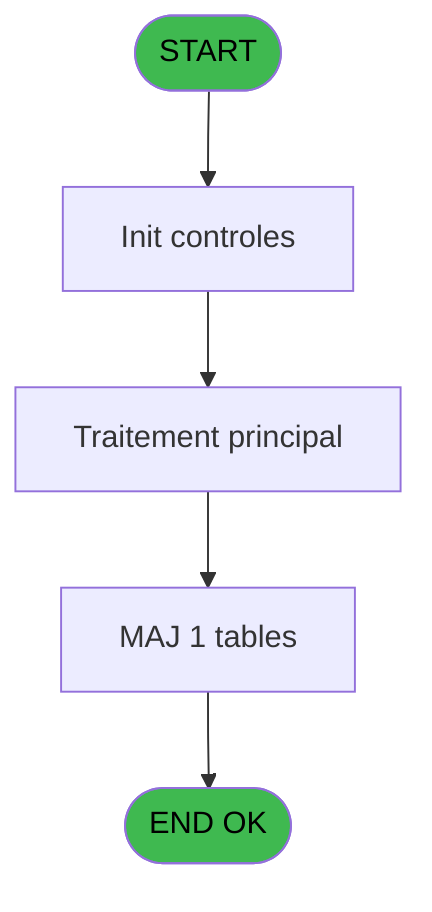

# CAB IDE 19 - Test si cloture en cours

> **Analyse**: Phases 1-4 2026-02-03 10:02 -> 10:03 (16s) | Assemblage 10:03
> **Pipeline**: V7.2 Enrichi
> **Structure**: 4 onglets (Resume | Ecrans | Donnees | Connexions)

<!-- TAB:Resume -->

## 1. FICHE D'IDENTITE

| Attribut | Valeur |
|----------|--------|
| Projet | CAB |
| IDE Position | 19 |
| Nom Programme | Test si cloture en cours |
| Fichier source | `Prg_19.xml` |
| Domaine metier | General |
| Taches | 3 (0 ecrans visibles) |
| Tables modifiees | 1 |
| Programmes appeles | 0 |

## 2. DESCRIPTION FONCTIONNELLE

**Test si cloture en cours** assure la gestion complete de ce processus, accessible depuis [Facturation appel (IDE 20)](CAB-IDE-20.md).

Le flux de traitement s'organise en **1 blocs fonctionnels** :

- **Traitement** (3 taches) : traitements metier divers

**Donnees modifiees** : 1 tables en ecriture (reseau_cloture___rec).

## 3. BLOCS FONCTIONNELS

### 3.1 Traitement (3 taches)

Traitements internes.

---

#### 19 - Test si cloture en cours

**Role** : Verification : Test si cloture en cours.
**Variables liees** : B (> cloture en cours), D (W1 cloture en cours)

---

#### 19.1 - Blocage cloture

**Role** : Traitement : Blocage cloture.
**Variables liees** : B (> cloture en cours), D (W1 cloture en cours)

---

#### 19.2 - Blocage cloture

**Role** : Traitement : Blocage cloture.
**Variables liees** : B (> cloture en cours), D (W1 cloture en cours)

## 5. REGLES METIER

*(Aucune regle metier identifiee)*

## 6. CONTEXTE

- **Appele par**: [Facturation appel (IDE 20)](CAB-IDE-20.md)
- **Appelle**: 0 programmes | **Tables**: 1 (W:1 R:1 L:0) | **Taches**: 3 | **Expressions**: 11

<!-- TAB:Ecrans -->

## 8. ECRANS

*(Programme sans ecran visible)*

## 9. NAVIGATION

### 9.3 Structure hierarchique (3 taches)

| Position | Tache | Type | Dimensions | Bloc |
|----------|-------|------|------------|------|
| **19.1** | [**Test si cloture en cours** (19)](#t1) | MDI | - | Traitement |
| 19.1.1 | [Blocage cloture (19.1)](#t2) | MDI | - | |
| 19.1.2 | [Blocage cloture (19.2)](#t5) | MDI | - | |

### 9.4 Algorigramme

> **Legende**: Vert = START/END OK | Rouge = END KO | Bleu = Decisions
> *Algorigramme auto-genere. Utiliser `/algorigramme` pour une synthese metier detaillee.*

<!-- TAB:Donnees -->

## 10. TABLES

### Tables utilisees (1)

| ID | Nom | Description | Type | R | W | L | Usages |
|----|-----|-------------|------|---|---|---|--------|
| 23 | reseau_cloture___rec | Donnees reseau/cloture | DB | R | **W** |   | 3 |

### Colonnes par table (1 / 1 tables avec colonnes identifiees)

Table 23 - reseau_cloture___rec (R/**W**) - 3 usages

| Lettre | Variable | Acces | Type |
|--------|----------|-------|------|
| A | > societe | W | Alpha |
| B | > cloture en cours | W | Logical |
| C | W1 fin tache | W | Alpha |
| D | W1 cloture en cours | W | Numeric |

## 11. VARIABLES

### 11.1 Autres (4)

Variables diverses.

| Lettre | Nom | Type | Usage dans |
|--------|-----|------|-----------|
| A | > societe | Alpha | 2x refs |
| B | > cloture en cours | Logical | - |
| C | W1 fin tache | Alpha | 1x refs |
| D | W1 cloture en cours | Numeric | [19](#t1), [19.1](#t2), [19.2](#t5) |

## 12. EXPRESSIONS

**11 / 11 expressions decodees (100%)**

### 12.1 Repartition par type

| Type | Expressions | Regles |
|------|-------------|--------|
| CONSTANTE | 3 | 0 |
| CONDITION | 5 | 0 |
| CAST_LOGIQUE | 1 | 0 |
| NEGATION | 1 | 0 |
| REFERENCE_VG | 1 | 0 |

### 12.2 Expressions cles par type

#### CONSTANTE (3 expressions)

| Type | IDE | Expression | Regle |
|------|-----|------------|-------|
| CONSTANTE | 5 | `'C'` | - |
| CONSTANTE | 3 | `'F'` | - |
| CONSTANTE | 2 | `'C'` | - |

#### CONDITION (5 expressions)

| Type | IDE | Expression | Regle |
|------|-----|------------|-------|
| CONDITION | 7 | `W1 cloture en cours [D]<>0` | - |
| CONDITION | 8 | `W1 cloture en cours [D]=0` | - |
| CONDITION | 6 | `W1 fin tache [C]='F'` | - |
| CONDITION | 1 | `> societe [A]=''` | - |
| CONDITION | 4 | `> societe [A]` | - |

#### CAST_LOGIQUE (1 expressions)

| Type | IDE | Expression | Regle |
|------|-----|------------|-------|
| CAST_LOGIQUE | 9 | `'TRUE'LOG` | - |

#### NEGATION (1 expressions)

| Type | IDE | Expression | Regle |
|------|-----|------------|-------|
| NEGATION | 10 | `NOT VG6` | - |

#### REFERENCE_VG (1 expressions)

| Type | IDE | Expression | Regle |
|------|-----|------------|-------|
| REFERENCE_VG | 11 | `VG6` | - |

<!-- TAB:Connexions -->

## 13. GRAPHE D'APPELS

### 13.1 Chaine depuis Main (Callers)

Main -> ... -> [Facturation appel (IDE 20)](CAB-IDE-20.md) -> **Test si cloture en cours (IDE 19)**

### 13.2 Callers

| IDE | Nom Programme | Nb Appels |
|-----|---------------|-----------|
| [20](CAB-IDE-20.md) | Facturation appel | 1 |

### 13.3 Callees (programmes appeles)

### 13.4 Detail Callees avec contexte

| IDE | Nom Programme | Appels | Contexte |
|-----|---------------|--------|----------|
| - | (aucun) | - | - |

## 14. RECOMMANDATIONS MIGRATION

### 14.1 Profil du programme

| Metrique | Valeur | Impact migration |
|----------|--------|-----------------|
| Lignes de logique | 36 | Programme compact |
| Expressions | 11 | Peu de logique |
| Tables WRITE | 1 | Impact faible |
| Sous-programmes | 0 | Peu de dependances |
| Ecrans visibles | 0 | Ecran unique ou traitement batch |
| Code desactive | 0% (0 / 36) | Code sain |
| Regles metier | 0 | Pas de regle identifiee |

### 14.2 Plan de migration par bloc

#### Traitement (3 taches: 0 ecran, 3 traitements)

- **Strategie** : 3 service(s) backend injectable(s) (Domain Services).
- Decomposer les taches en services unitaires testables.

### 14.3 Dependances critiques

| Dependance | Type | Appels | Impact |
|------------|------|--------|--------|
| reseau_cloture___rec | Table WRITE (Database) | 2x | Schema + repository |

---
*Spec DETAILED generee par Pipeline V7.2 - 2026-02-03 10:03*
