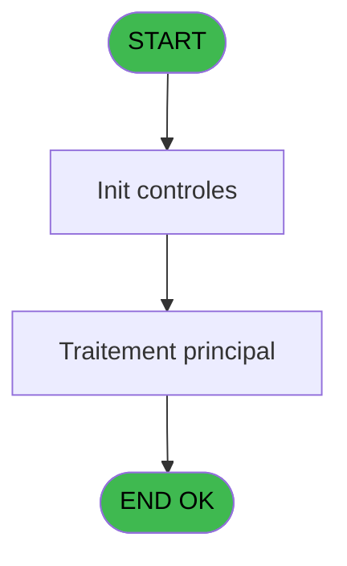

# CAB IDE 21 - Liste des affilies  @

> **Analyse**: Phases 1-4 2026-02-03 10:03 -> 10:03 (17s) | Assemblage 10:03
> **Pipeline**: V7.2 Enrichi
> **Structure**: 4 onglets (Resume | Ecrans | Donnees | Connexions)

<!-- TAB:Resume -->

## 1. FICHE D'IDENTITE

| Attribut | Valeur |
|----------|--------|
| Projet | CAB |
| IDE Position | 21 |
| Nom Programme | Liste des affilies  @ |
| Fichier source | `Prg_21.xml` |
| Domaine metier | General |
| Taches | 2 (1 ecrans visibles) |
| Tables modifiees | 0 |
| Programmes appeles | 0 |
| :warning: Statut | **ORPHELIN_POTENTIEL** |

## 2. DESCRIPTION FONCTIONNELLE

**Liste des affilies  @** assure la gestion complete de ce processus.

Le flux de traitement s'organise en **2 blocs fonctionnels** :

- **Calcul** (1 tache) : calculs de montants, stocks ou compteurs
- **Traitement** (1 tache) : traitements metier divers

**Logique metier** : 2 regles identifiees couvrant conditions metier.

Detail : phases du traitement

#### Phase 1 : Traitement (1 tache)

- **21** - Êcran **[[ECRAN]](#ecran-t1)**

#### Phase 2 : Calcul (1 tache)

- **21.1** - Reaffichage infos compte

## 3. BLOCS FONCTIONNELS

### 3.1 Traitement (1 tache)

Traitements internes.

---

#### 21 - Êcran [[ECRAN]](#ecran-t1)

**Role** : Traitement : Êcran.
**Ecran** : 1133 x 231 DLU (MDI) | [Voir mockup](#ecran-t1)

### 3.2 Calcul (1 tache)

Calculs metier : montants, stocks, compteurs.

---

#### 21.1 - Reaffichage infos compte

**Role** : Reinitialisation : Reaffichage infos compte.
**Variables liees** : D (< solde compte), E (< etat compte)

## 5. REGLES METIER

2 regles identifiees:

### Autres (2 regles)

#### [RM-001] Traitement conditionnel si [AU] est a zero

| Element | Detail |
|---------|--------|
| **Condition** | `[AU]=0` |
| **Si vrai** | '40 ans' |
| **Si faux** | IF([AW]=0,Str([AX],'2')&' mois',Str([AW],'3')&' ans')) |
| **Expression source** | Expression 10 : `IF([AU]=0,'40 ans',IF([AW]=0,Str([AX],'2')&' mois',Str([AW],` |
| **Exemple** | Si [AU]=0 → '40 ans'. Sinon → IF([AW]=0,Str([AX],'2')&' mois',Str([AW],'3')&' ans')) |

#### [RM-002] Si [U]<Date () alors 'dernier sejour :' sinon IF ([T]>Date (),'prochain sejour :','sejour en cours'))

| Element | Detail |
|---------|--------|
| **Condition** | `[U]<Date ()` |
| **Si vrai** | 'dernier sejour :' |
| **Si faux** | IF ([T]>Date (),'prochain sejour :','sejour en cours')) |
| **Expression source** | Expression 12 : `IF ([U]<Date (),'dernier sejour :',IF ([T]>Date (),'prochain` |
| **Exemple** | Si [U]<Date () → 'dernier sejour :'. Sinon → IF ([T]>Date (),'prochain sejour :','sejour en cours')) |

## 6. CONTEXTE

- **Appele par**: (aucun)
- **Appelle**: 0 programmes | **Tables**: 3 (W:0 R:2 L:1) | **Taches**: 2 | **Expressions**: 18

<!-- TAB:Ecrans -->

## 8. ECRANS

### 8.1 Forms visibles (1 / 2)

| # | Position | Tache | Nom | Type | Largeur | Hauteur | Bloc |
|---|----------|-------|-----|------|---------|---------|------|
| 1 | 21 | 21 | Êcran | MDI | 1133 | 231 | Traitement |

### 8.2 Mockups Ecrans

---

#### 21 - Êcran
**Tache** : [21](#t1) | **Type** : MDI | **Dimensions** : 1133 x 231 DLU
**Bloc** : Traitement | **Titre IDE** : Êcran

<!-- FORM-DATA:
{
    "width":  1133,
    "vFactor":  8,
    "type":  "MDI",
    "hFactor":  8,
    "controls":  [
                     {
                         "x":  0,
                         "type":  "label",
                         "var":  "",
                         "y":  0,
                         "w":  1130,
                         "fmt":  "",
                         "name":  "",
                         "h":  18,
                         "color":  "",
                         "text":  "",
                         "parent":  null
                     },
                     {
                         "x":  22,
                         "type":  "table",
                         "var":  "",
                         "name":  "",
                         "titleH":  15,
                         "color":  "110",
                         "w":  901,
                         "y":  27,
                         "fmt":  "",
                         "parent":  null,
                         "text":  "",
                         "rowH":  32,
                         "h":  170,
                         "cols":  [
                                      {
                                          "title":  "Nom/Prénom",
                                          "layer":  1,
                                          "w":  438
                                      },
                                      {
                                          "title":  "Sexe",
                                          "layer":  2,
                                          "w":  97
                                      },
                                      {
                                          "title":  "Age",
                                          "layer":  3,
                                          "w":  122
                                      },
                                      {
                                          "title":  "Numéro",
                                          "layer":  4,
                                          "w":  211
                                      }
                                  ],
                         "rows":  4
                     },
                     {
                         "x":  0,
                         "type":  "label",
                         "var":  "",
                         "y":  203,
                         "w":  1130,
                         "fmt":  "",
                         "name":  "",
                         "h":  24,
                         "color":  "",
                         "text":  "",
                         "parent":  null
                     },
                     {
                         "x":  54,
                         "type":  "edit",
                         "var":  "",
                         "y":  45,
                         "w":  295,
                         "fmt":  "",
                         "name":  "",
                         "h":  8,
                         "color":  "110",
                         "text":  "",
                         "parent":  4
                     },
                     {
                         "x":  682,
                         "type":  "edit",
                         "var":  "",
                         "y":  47,
                         "w":  120,
                         "fmt":  "",
                         "name":  "",
                         "h":  8,
                         "color":  "110",
                         "text":  "",
                         "parent":  4
                     },
                     {
                         "x":  802,
                         "type":  "edit",
                         "var":  "",
                         "y":  47,
                         "w":  20,
                         "fmt":  "1",
                         "name":  "",
                         "h":  8,
                         "color":  "110",
                         "text":  "",
                         "parent":  4
                     },
                     {
                         "x":  840,
                         "type":  "edit",
                         "var":  "",
                         "y":  47,
                         "w":  42,
                         "fmt":  "",
                         "name":  "",
                         "h":  8,
                         "color":  "110",
                         "text":  "",
                         "parent":  4
                     },
                     {
                         "x":  114,
                         "type":  "edit",
                         "var":  "",
                         "y":  65,
                         "w":  132,
                         "fmt":  "WWW DD MMMMZ",
                         "name":  "",
                         "h":  8,
                         "color":  "110",
                         "text":  "",
                         "parent":  4
                     },
                     {
                         "x":  318,
                         "type":  "edit",
                         "var":  "",
                         "y":  65,
                         "w":  132,
                         "fmt":  "WWW DD MMMMZ",
                         "name":  "",
                         "h":  8,
                         "color":  "110",
                         "text":  "",
                         "parent":  4
                     },
                     {
                         "x":  6,
                         "type":  "edit",
                         "var":  "",
                         "y":  4,
                         "w":  267,
                         "fmt":  "20",
                         "name":  "",
                         "h":  8,
                         "color":  "",
                         "text":  "",
                         "parent":  1
                     },
                     {
                         "x":  800,
                         "type":  "edit",
                         "var":  "",
                         "y":  4,
                         "w":  203,
                         "fmt":  "WWW DD MMM YYYYT",
                         "name":  "",
                         "h":  8,
                         "color":  "",
                         "text":  "",
                         "parent":  1
                     },
                     {
                         "x":  492,
                         "type":  "edit",
                         "var":  "",
                         "y":  47,
                         "w":  30,
                         "fmt":  "2",
                         "name":  "gmr_sexe",
                         "h":  8,
                         "color":  "110",
                         "text":  "",
                         "parent":  4
                     },
                     {
                         "x":  575,
                         "type":  "edit",
                         "var":  "",
                         "y":  47,
                         "w":  90,
                         "fmt":  "8",
                         "name":  "",
                         "h":  8,
                         "color":  "110",
                         "text":  "",
                         "parent":  4
                     },
                     {
                         "x":  820,
                         "type":  "edit",
                         "var":  "",
                         "y":  47,
                         "w":  20,
                         "fmt":  "1",
                         "name":  "",
                         "h":  8,
                         "color":  "110",
                         "text":  "",
                         "parent":  4
                     },
                     {
                         "x":  935,
                         "type":  "image",
                         "var":  "",
                         "y":  52,
                         "w":  182,
                         "fmt":  "",
                         "name":  "",
                         "h":  92,
                         "color":  "",
                         "text":  "",
                         "parent":  null
                     },
                     {
                         "x":  54,
                         "type":  "edit",
                         "var":  "",
                         "y":  55,
                         "w":  198,
                         "fmt":  "17",
                         "name":  "",
                         "h":  8,
                         "color":  "110",
                         "text":  "",
                         "parent":  4
                     },
                     {
                         "x":  54,
                         "type":  "edit",
                         "var":  "",
                         "y":  65,
                         "w":  53,
                         "fmt":  "4",
                         "name":  "",
                         "h":  8,
                         "color":  "110",
                         "text":  "",
                         "parent":  4
                     },
                     {
                         "x":  258,
                         "type":  "edit",
                         "var":  "",
                         "y":  65,
                         "w":  52,
                         "fmt":  "4",
                         "name":  "",
                         "h":  8,
                         "color":  "110",
                         "text":  "",
                         "parent":  4
                     },
                     {
                         "x":  9,
                         "type":  "button",
                         "var":  "",
                         "y":  206,
                         "w":  168,
                         "fmt":  "\u0026Quitter",
                         "name":  "",
                         "h":  18,
                         "color":  "",
                         "text":  "",
                         "parent":  null
                     }
                 ],
    "taskId":  "21",
    "height":  231
}
-->

<strong>Champs : 14 champs</strong>

| Pos (x,y) | Nom | Variable | Type |
|-----------|-----|----------|------|
| 54,45 | (sans nom) | - | edit |
| 682,47 | (sans nom) | - | edit |
| 802,47 | 1 | - | edit |
| 840,47 | (sans nom) | - | edit |
| 114,65 | WWW DD MMMMZ | - | edit |
| 318,65 | WWW DD MMMMZ | - | edit |
| 6,4 | 20 | - | edit |
| 800,4 | WWW DD MMM YYYYT | - | edit |
| 492,47 | gmr_sexe | - | edit |
| 575,47 | 8 | - | edit |
| 820,47 | 1 | - | edit |
| 54,55 | 17 | - | edit |
| 54,65 | 4 | - | edit |
| 258,65 | 4 | - | edit |

<strong>Boutons : 1 boutons</strong>

| Bouton | Pos (x,y) | Action |
|--------|-----------|--------|
| Quitter | 9,206 | Quitte le programme |

## 9. NAVIGATION

Ecran unique: **Êcran**

### 9.3 Structure hierarchique (2 taches)

| Position | Tache | Type | Dimensions | Bloc |
|----------|-------|------|------------|------|
| **21.1** | [**Êcran** (21)](#t1) [mockup](#ecran-t1) | MDI | 1133x231 | Traitement |
| **21.2** | [**Reaffichage infos compte** (21.1)](#t2) | MDI | - | Calcul |

### 9.4 Algorigramme

> **Legende**: Vert = START/END OK | Rouge = END KO | Bleu = Decisions
> *Algorigramme auto-genere. Utiliser `/algorigramme` pour une synthese metier detaillee.*

<!-- TAB:Donnees -->

## 10. TABLES

### Tables utilisees (3)

| ID | Nom | Description | Type | R | W | L | Usages |
|----|-----|-------------|------|---|---|---|--------|
| 30 | gm-recherche_____gmr | Index de recherche | DB | R |   |   | 1 |
| 31 | gm-complet_______gmc |  | DB |   |   | L | 1 |
| 47 | compte_gm________cgm | Comptes GM (generaux) | DB | R |   |   | 1 |

### Colonnes par table (2 / 2 tables avec colonnes identifiees)

Table 30 - gm-recherche_____gmr (R) - 1 usages

| Lettre | Variable | Acces | Type |
|--------|----------|-------|------|
| A | > societe | R | Alpha |
| B | > code adherent | R | Numeric |
| C | > filiation | R | Numeric |
| D | < solde compte | R | Numeric |
| E | < etat compte | R | Alpha |
| F | < date solde | R | Date |
| G | < garanti O/N | R | Alpha |
| H | v. titre | R | Alpha |
| I | v. nom & prenom | R | Alpha |

Table 47 - compte_gm________cgm (R) - 1 usages

| Lettre | Variable | Acces | Type |
|--------|----------|-------|------|
| D | < solde compte | R | Numeric |
| E | < etat compte | R | Alpha |

## 11. VARIABLES

### 11.1 Variables de session (2)

Variables persistantes pendant toute la session.

| Lettre | Nom | Type | Usage dans |
|--------|-----|------|-----------|
| H | v. titre | Alpha | 1x session |
| I | v. nom & prenom | Alpha | - |

### 11.2 Autres (7)

Variables diverses.

| Lettre | Nom | Type | Usage dans |
|--------|-----|------|-----------|
| A | > societe | Alpha | 2x refs |
| B | > code adherent | Numeric | 1x refs |
| C | > filiation | Numeric | - |
| D | < solde compte | Numeric | - |
| E | < etat compte | Alpha | - |
| F | < date solde | Date | - |
| G | < garanti O/N | Alpha | - |

## 12. EXPRESSIONS

**18 / 18 expressions decodees (100%)**

### 12.1 Repartition par type

| Type | Expressions | Regles |
|------|-------------|--------|
| CONDITION | 5 | 2 |
| CONSTANTE | 5 | 0 |
| DATE | 1 | 0 |
| REFERENCE_VG | 1 | 0 |
| OTHER | 2 | 0 |
| CAST_LOGIQUE | 2 | 0 |
| STRING | 1 | 0 |
| CONCATENATION | 1 | 0 |

### 12.2 Expressions cles par type

#### CONDITION (5 expressions)

| Type | IDE | Expression | Regle |
|------|-----|------------|-------|
| CONDITION | 12 | `IF ([U]<Date (),'dernier sejour :',IF ([T]>Date (),'prochain sejour :','sejour en cours'))` | [RM-002](#rm-RM-002) |
| CONDITION | 10 | `IF([AU]=0,'40 ans',IF([AW]=0,Str([AX],'2')&' mois',Str([AW],'3')&' ans'))` | [RM-001](#rm-RM-001) |
| CONDITION | 7 | `> code adherent [B]` | - |
| CONDITION | 6 | `> societe [A]` | - |
| CONDITION | 1 | `> societe [A]=''` | - |

#### CONSTANTE (5 expressions)

| Type | IDE | Expression | Regle |
|------|-----|------------|-------|
| CONSTANTE | 14 | `' au '` | - |
| CONSTANTE | 15 | `1` | - |
| CONSTANTE | 13 | `' du '` | - |
| CONSTANTE | 2 | `'C'` | - |
| CONSTANTE | 11 | `'-'` | - |

#### DATE (1 expressions)

| Type | IDE | Expression | Regle |
|------|-----|------------|-------|
| DATE | 4 | `Date ()` | - |

#### REFERENCE_VG (1 expressions)

| Type | IDE | Expression | Regle |
|------|-----|------------|-------|
| REFERENCE_VG | 5 | `VG2` | - |

#### OTHER (2 expressions)

| Type | IDE | Expression | Regle |
|------|-----|------------|-------|
| OTHER | 18 | `[Q]` | - |
| OTHER | 8 | `Stat (0,'C'MODE)` | - |

#### CAST_LOGIQUE (2 expressions)

| Type | IDE | Expression | Regle |
|------|-----|------------|-------|
| CAST_LOGIQUE | 17 | `INIPut ('AllowCreateInModify  = N','FALSE'LOG)` | - |
| CAST_LOGIQUE | 16 | `INIPut ('AllowCreateInModify  = Y','FALSE'LOG)` | - |

#### STRING (1 expressions)

| Type | IDE | Expression | Regle |
|------|-----|------------|-------|
| STRING | 3 | `Trim (v. titre [H])` | - |

#### CONCATENATION (1 expressions)

| Type | IDE | Expression | Regle |
|------|-----|------------|-------|
| CONCATENATION | 9 | `Trim ([K])&' '&[L]` | - |

<!-- TAB:Connexions -->

## 13. GRAPHE D'APPELS

### 13.1 Chaine depuis Main (Callers)

**Chemin**: (pas de callers directs)

### 13.2 Callers

| IDE | Nom Programme | Nb Appels |
|-----|---------------|-----------|
| - | (aucun) | - |

### 13.3 Callees (programmes appeles)

### 13.4 Detail Callees avec contexte

| IDE | Nom Programme | Appels | Contexte |
|-----|---------------|--------|----------|
| - | (aucun) | - | - |

## 14. RECOMMANDATIONS MIGRATION

### 14.1 Profil du programme

| Metrique | Valeur | Impact migration |
|----------|--------|-----------------|
| Lignes de logique | 55 | Programme compact |
| Expressions | 18 | Peu de logique |
| Tables WRITE | 0 | Impact faible |
| Sous-programmes | 0 | Peu de dependances |
| Ecrans visibles | 1 | Ecran unique ou traitement batch |
| Code desactive | 0% (0 / 55) | Code sain |
| Regles metier | 2 | Quelques regles a preserver |

### 14.2 Plan de migration par bloc

#### Traitement (1 tache: 1 ecran, 0 traitement)

- **Strategie** : 1 composant(s) UI (Razor/React) avec formulaires et validation.
- Decomposer les taches en services unitaires testables.

#### Calcul (1 tache: 0 ecran, 1 traitement)

- **Strategie** : Services de calcul purs (Domain Services).
- Migrer la logique de calcul (stock, compteurs, montants)

### 14.3 Dependances critiques

| Dependance | Type | Appels | Impact |
|------------|------|--------|--------|

---
*Spec DETAILED generee par Pipeline V7.2 - 2026-02-03 10:03*
