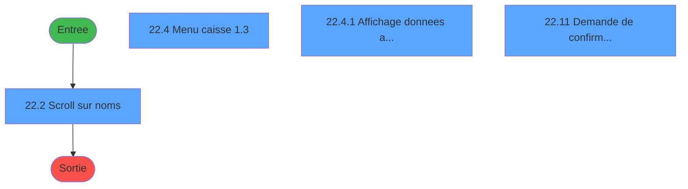
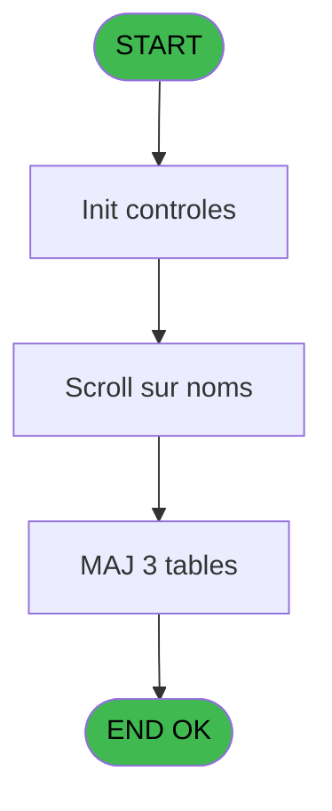

# CAB IDE 22 - Menu caisse GM - scroll @

> **Analyse**: Phases 1-4 2026-02-03 10:03 -> 10:04 (17s) | Assemblage 10:04
> **Pipeline**: V7.2 Enrichi
> **Structure**: 4 onglets (Resume | Ecrans | Donnees | Connexions)

<!-- TAB:Resume -->

## 1. FICHE D'IDENTITE

| Attribut | Valeur |
|----------|--------|
| Projet | CAB |
| IDE Position | 22 |
| Nom Programme | Menu caisse GM - scroll @ |
| Fichier source | `Prg_22.xml` |
| Domaine metier | Caisse |
| Taches | 18 (4 ecrans visibles) |
| Tables modifiees | 3 |
| Programmes appeles | 0 |
| :warning: Statut | **ORPHELIN_POTENTIEL** |

## 2. DESCRIPTION FONCTIONNELLE

**Menu caisse GM - scroll @** assure la gestion complete de ce processus.

Le flux de traitement s'organise en **3 blocs fonctionnels** :

- **Traitement** (16 taches) : traitements metier divers
- **Saisie** (1 tache) : ecrans de saisie utilisateur (formulaires, champs, donnees)
- **Consultation** (1 tache) : ecrans de recherche, selection et consultation

**Donnees modifiees** : 3 tables en ecriture (reseau_cloture___rec, param__telephone_tel, unilateral_bilateral).

Detail : phases du traitement

#### Phase 1 : Traitement (16 taches)

- **22** - (sans nom) **[[ECRAN]](#ecran-t1)**
- **22.1** - Station eteinte erreur  v1
- **22.2** - Scroll sur noms **[[ECRAN]](#ecran-t3)**
- **22.2.1** - Action
- **22.3** - Lecture MK3
- **22.4** - Menu caisse                1.3 **[[ECRAN]](#ecran-t6)**
- **22.4.2** - GM purge ?
- **22.4.3** - GM purge ?
- **22.4.4** - Appel programme
- **22.6** - Lecture paramètres par     1.6
- **22.7** - Lecture Paramètres TEL     1.7
- **22.8** - Lecture Parametre Change
- **22.9** - Lecture n° village PME
- **22.10** - Message **[[ECRAN]](#ecran-t17)**
- **22.11** - Demande de confirmation **[[ECRAN]](#ecran-t18)**
- **22.12** - Station eteinte erreur  v1

#### Phase 2 : Consultation (1 tache)

- **22.4.1** - Affichage donnees adherent **[[ECRAN]](#ecran-t7)**

#### Phase 3 : Saisie (1 tache)

- **22.5** - Saisie nbre decimales

#### Tables impactees

| Table | Operations | Role metier |
|-------|-----------|-------------|
| reseau_cloture___rec | **W** (2 usages) | Donnees reseau/cloture |
| param__telephone_tel | **W** (1 usages) |  |
| unilateral_bilateral | **W** (1 usages) |  |

## 3. BLOCS FONCTIONNELS

### 3.1 Traitement (16 taches)

Traitements internes.

---

#### 22 - (sans nom) [[ECRAN]](#ecran-t1)

**Role** : Tache d'orchestration : point d'entree du programme (16 sous-taches). Coordonne l'enchainement des traitements.
**Ecran** : 640 x 184 DLU (MDI) | [Voir mockup](#ecran-t1)

15 sous-taches directes

| Tache | Nom | Bloc |
|-------|-----|------|
| [22.1](#t2) | Station eteinte erreur  v1 | Traitement |
| [22.2](#t3) | Scroll sur noms **[[ECRAN]](#ecran-t3)** | Traitement |
| [22.2.1](#t4) | Action | Traitement |
| [22.3](#t5) | Lecture MK3 | Traitement |
| [22.4](#t6) | Menu caisse                1.3 **[[ECRAN]](#ecran-t6)** | Traitement |
| [22.4.2](#t8) | GM purge ? | Traitement |
| [22.4.3](#t9) | GM purge ? | Traitement |
| [22.4.4](#t10) | Appel programme | Traitement |
| [22.6](#t13) | Lecture paramètres par     1.6 | Traitement |
| [22.7](#t14) | Lecture Paramètres TEL     1.7 | Traitement |
| [22.8](#t15) | Lecture Parametre Change | Traitement |
| [22.9](#t16) | Lecture n° village PME | Traitement |
| [22.10](#t17) | Message **[[ECRAN]](#ecran-t17)** | Traitement |
| [22.11](#t18) | Demande de confirmation **[[ECRAN]](#ecran-t18)** | Traitement |
| [22.12](#t24) | Station eteinte erreur  v1 | Traitement |

---

#### 22.1 - Station eteinte erreur  v1

**Role** : Traitement : Station eteinte erreur  v1.

---

#### 22.2 - Scroll sur noms [[ECRAN]](#ecran-t3)

**Role** : Traitement : Scroll sur noms.
**Ecran** : 1184 x 246 DLU (MDI) | [Voir mockup](#ecran-t3)

---

#### 22.2.1 - Action

**Role** : Traitement : Action.
**Variables liees** : V (W0 choix action)

---

#### 22.3 - Lecture MK3

**Role** : Traitement : Lecture MK3.

---

#### 22.4 - Menu caisse                1.3 [[ECRAN]](#ecran-t6)

**Role** : Traitement : Menu caisse                1.3.
**Ecran** : 1226 x 268 DLU (MDI) | [Voir mockup](#ecran-t6)
**Variables liees** : BV (W0 titre menu caisse)

---

#### 22.4.2 - GM purge ?

**Role** : Traitement : GM purge ?.

---

#### 22.4.3 - GM purge ?

**Role** : Traitement : GM purge ?.

---

#### 22.4.4 - Appel programme

**Role** : Traitement : Appel programme.
**Variables liees** : B (> prefixe appel), C (> date appel), D (> heure appel), Z (WP0 prog d'appel)

---

#### 22.6 - Lecture paramètres par     1.6

**Role** : Traitement : Lecture paramètres par     1.6.

---

#### 22.7 - Lecture Paramètres TEL     1.7

**Role** : Traitement : Lecture Paramètres TEL     1.7.

---

#### 22.8 - Lecture Parametre Change

**Role** : Traitement : Lecture Parametre Change.

---

#### 22.9 - Lecture n° village PME

**Role** : Traitement : Lecture n° village PME.
**Variables liees** : H (P0 village_à_CAM ?), I (P0 village à tel ?), K (P0 village BiBop ?), L (P0 village PME), R (P0 code village)

---

#### 22.10 - Message [[ECRAN]](#ecran-t17)

**Role** : Traitement : Message.
**Ecran** : 474 x 61 DLU (MDI) | [Voir mockup](#ecran-t17)

---

#### 22.11 - Demande de confirmation [[ECRAN]](#ecran-t18)

**Role** : Traitement : Demande de confirmation.
**Ecran** : 458 x 67 DLU (MDI) | [Voir mockup](#ecran-t18)

---

#### 22.12 - Station eteinte erreur  v1

**Role** : Traitement : Station eteinte erreur  v1.

### 3.2 Consultation (1 tache)

Ecrans de recherche et consultation.

---

#### 22.4.1 - Affichage donnees adherent [[ECRAN]](#ecran-t7)

**Role** : Reinitialisation : Affichage donnees adherent.
**Ecran** : 1223 x 65 DLU (Modal) | [Voir mockup](#ecran-t7)
**Variables liees** : BT (W0 affichage presence)

### 3.3 Saisie (1 tache)

Ce bloc traite la saisie des donnees de la transaction.

---

#### 22.5 - Saisie nbre decimales

**Role** : Saisie des donnees : Saisie nbre decimales.
**Variables liees** : M (P0 nbre_de_decimales)

## 5. REGLES METIER

*(Aucune regle metier identifiee)*

## 6. CONTEXTE

- **Appele par**: (aucun)
- **Appelle**: 0 programmes | **Tables**: 17 (W:3 R:8 L:9) | **Taches**: 18 | **Expressions**: 23

<!-- TAB:Ecrans -->

## 8. ECRANS

### 8.1 Forms visibles (4 / 18)

| # | Position | Tache | Nom | Type | Largeur | Hauteur | Bloc |
|---|----------|-------|-----|------|---------|---------|------|
| 1 | 22.3 | 22.2 | Scroll sur noms | MDI | 1184 | 246 | Traitement |
| 2 | 22.5 | 22.4 | Menu caisse                1.3 | MDI | 1226 | 268 | Traitement |
| 3 | 22.5.1 | 22.4.1 | Affichage donnees adherent | Modal | 1223 | 65 | Consultation |
| 4 | 22.12 | 22.11 | Demande de confirmation | MDI | 458 | 67 | Traitement |

### 8.2 Mockups Ecrans

---

#### 22.3 - Scroll sur noms
**Tache** : [22.2](#t3) | **Type** : MDI | **Dimensions** : 1184 x 246 DLU
**Bloc** : Traitement | **Titre IDE** : Scroll sur noms

<!-- FORM-DATA:
{
    "width":  1184,
    "vFactor":  8,
    "type":  "MDI",
    "hFactor":  8,
    "controls":  [
                     {
                         "x":  0,
                         "type":  "label",
                         "var":  "",
                         "y":  0,
                         "w":  1171,
                         "fmt":  "",
                         "name":  "",
                         "h":  21,
                         "color":  "",
                         "text":  "",
                         "parent":  null
                     },
                     {
                         "x":  17,
                         "type":  "label",
                         "var":  "",
                         "y":  23,
                         "w":  146,
                         "fmt":  "",
                         "name":  "",
                         "h":  8,
                         "color":  "7",
                         "text":  "Numero telephone",
                         "parent":  null
                     },
                     {
                         "x":  15,
                         "type":  "label",
                         "var":  "",
                         "y":  32,
                         "w":  413,
                         "fmt":  "",
                         "name":  "",
                         "h":  173,
                         "color":  "",
                         "text":  "",
                         "parent":  null
                     },
                     {
                         "x":  437,
                         "type":  "table",
                         "var":  "",
                         "name":  "",
                         "titleH":  12,
                         "color":  "110",
                         "w":  728,
                         "y":  32,
                         "fmt":  "",
                         "parent":  null,
                         "text":  "",
                         "rowH":  13,
                         "h":  173,
                         "cols":  [
                                      {
                                          "title":  "Nom",
                                          "layer":  1,
                                          "w":  399
                                      },
                                      {
                                          "title":  "Prénom",
                                          "layer":  2,
                                          "w":  123
                                      },
                                      {
                                          "title":  "Sexe",
                                          "layer":  3,
                                          "w":  59
                                      },
                                      {
                                          "title":  "Divers",
                                          "layer":  4,
                                          "w":  115
                                      }
                                  ],
                         "rows":  4
                     },
                     {
                         "x":  443,
                         "type":  "label",
                         "var":  "",
                         "y":  46,
                         "w":  34,
                         "fmt":  "",
                         "name":  "",
                         "h":  9,
                         "color":  "144",
                         "text":  "8",
                         "parent":  8
                     },
                     {
                         "x":  1054,
                         "type":  "label",
                         "var":  "",
                         "y":  47,
                         "w":  18,
                         "fmt":  "",
                         "name":  "",
                         "h":  8,
                         "color":  "149",
                         "text":  "m",
                         "parent":  8
                     },
                     {
                         "x":  1075,
                         "type":  "label",
                         "var":  "",
                         "y":  47,
                         "w":  29,
                         "fmt":  "",
                         "name":  "",
                         "h":  8,
                         "color":  "149",
                         "text":  "*",
                         "parent":  8
                     },
                     {
                         "x":  122,
                         "type":  "label",
                         "var":  "",
                         "y":  102,
                         "w":  205,
                         "fmt":  "",
                         "name":  "",
                         "h":  8,
                         "color":  "7",
                         "text":  "Nom du GM",
                         "parent":  7
                     },
                     {
                         "x":  3,
                         "type":  "label",
                         "var":  "",
                         "y":  219,
                         "w":  1168,
                         "fmt":  "",
                         "name":  "",
                         "h":  24,
                         "color":  "",
                         "text":  "",
                         "parent":  null
                     },
                     {
                         "x":  35,
                         "type":  "label",
                         "var":  "",
                         "y":  154,
                         "w":  385,
                         "fmt":  "",
                         "name":  "",
                         "h":  15,
                         "color":  "",
                         "text":  "{\\rtf1\\ansi\\deff0\\deftab720{\\fonttbl{\\f0\\fnil MS Sans Serif;}{\\f1\\fnil\\fcharset2 Symbol;}{\\f2\\fswiss\\fprq2 System;}{\\f3\\fswiss\\fprq2 MS Sans Serif;}}\r\n{\\colortbl\\red0\\green0\\blue0;\\red0\\green64\\blue128;\\red0\\green0\\blue160;}\r\n\\deflang1036\\pard{\\*\\pn\\pnlvlblt\\pnf1\\pnindent0{\\pntxtb\\\u0027b7}}\\plain\\f3\\fs16\\cf0\\b {\\pntext\\f1\\\u0027b7\\tab} Change non GM taper sur la touche  \\plain\\f3\\fs16\\cf2\\b /\\plain\\f3\\fs24\\cf2\\b \r\n\\par }\r\n",
                         "parent":  7
                     },
                     {
                         "x":  35,
                         "type":  "label",
                         "var":  "",
                         "y":  168,
                         "w":  374,
                         "fmt":  "",
                         "name":  "",
                         "h":  15,
                         "color":  "",
                         "text":  "{\\rtf1\\ansi\\deff0\\deftab720{\\fonttbl{\\f0\\fnil MS Sans Serif;}{\\f1\\fnil\\fcharset2 Symbol;}{\\f2\\fswiss\\fprq2 System;}{\\f3\\fswiss\\fprq2 MS Sans Serif;}}\r\n{\\colortbl\\red0\\green0\\blue0;\\red0\\green64\\blue128;}\r\n\\deflang1036\\pard{\\*\\pn\\pnlvlblt\\pnf1\\pnindent0{\\pntxtb\\\u0027b7}}\\plain\\f3\\fs16\\cf0\\b\\i {\\pntext\\f1\\\u0027b7\\tab} \\plain\\f3\\fs16\\cf0\\b Lecture PME taper sur la touche  \\plain\\f3\\fs16\\cf0\\b\\i  \\plain\\f3\\fs24\\cf1\\b +\r\n\\par }\r\n",
                         "parent":  7
                     },
                     {
                         "x":  35,
                         "type":  "label",
                         "var":  "",
                         "y":  183,
                         "w":  374,
                         "fmt":  "",
                         "name":  "",
                         "h":  16,
                         "color":  "",
                         "text":  "{\\rtf1\\ansi\\deff0\\deftab720{\\fonttbl{\\f0\\fnil MS Sans Serif;}{\\f1\\fnil\\fcharset2 Symbol;}{\\f2\\fswiss\\fprq2 System;}{\\f3\\fswiss\\fprq2 MS Sans Serif;}}\r\n{\\colortbl\\red0\\green0\\blue0;\\red0\\green64\\blue128;}\r\n\\deflang1036\\pard{\\*\\pn\\pnlvlblt\\pnf1\\pnindent0{\\pntxtb\\\u0027b7}}\\plain\\f3\\fs16\\cf0\\b {\\pntext\\f1\\\u0027b7\\tab} Lecture CAM  taper sur la touche  \\plain\\f3\\fs16\\cf0\\b\\i  \\plain\\f3\\fs24\\cf1\\b *\r\n\\par }\r\n",
                         "parent":  7
                     },
                     {
                         "x":  476,
                         "type":  "edit",
                         "var":  "",
                         "y":  47,
                         "w":  344,
                         "fmt":  "",
                         "name":  "",
                         "h":  8,
                         "color":  "110",
                         "text":  "",
                         "parent":  8
                     },
                     {
                         "x":  846,
                         "type":  "edit",
                         "var":  "",
                         "y":  47,
                         "w":  98,
                         "fmt":  "",
                         "name":  "",
                         "h":  8,
                         "color":  "110",
                         "text":  "",
                         "parent":  8
                     },
                     {
                         "x":  120,
                         "type":  "edit",
                         "var":  "",
                         "y":  116,
                         "w":  234,
                         "fmt":  "",
                         "name":  "W1 detecte \u0027*\u0027",
                         "h":  13,
                         "color":  "110",
                         "text":  "",
                         "parent":  7
                     },
                     {
                         "x":  138,
                         "type":  "edit",
                         "var":  "",
                         "y":  118,
                         "w":  171,
                         "fmt":  "",
                         "name":  "W1 chaîne_recherchee",
                         "h":  10,
                         "color":  "110",
                         "text":  "",
                         "parent":  7
                     },
                     {
                         "x":  5,
                         "type":  "image",
                         "var":  "",
                         "y":  2,
                         "w":  59,
                         "fmt":  "",
                         "name":  "",
                         "h":  18,
                         "color":  "",
                         "text":  "",
                         "parent":  null
                     },
                     {
                         "x":  75,
                         "type":  "edit",
                         "var":  "",
                         "y":  6,
                         "w":  395,
                         "fmt":  "30",
                         "name":  "",
                         "h":  8,
                         "color":  "",
                         "text":  "",
                         "parent":  null
                     },
                     {
                         "x":  901,
                         "type":  "edit",
                         "var":  "",
                         "y":  6,
                         "w":  259,
                         "fmt":  "WWW DD MMM YYYYT",
                         "name":  "",
                         "h":  8,
                         "color":  "",
                         "text":  "",
                         "parent":  null
                     },
                     {
                         "x":  173,
                         "type":  "edit",
                         "var":  "",
                         "y":  22,
                         "w":  238,
                         "fmt":  "",
                         "name":  "",
                         "h":  10,
                         "color":  "7",
                         "text":  "",
                         "parent":  null
                     },
                     {
                         "x":  1105,
                         "type":  "button",
                         "var":  "",
                         "y":  45,
                         "w":  29,
                         "fmt":  "...",
                         "name":  "",
                         "h":  11,
                         "color":  "",
                         "text":  "",
                         "parent":  8
                     },
                     {
                         "x":  1027,
                         "type":  "image",
                         "var":  "",
                         "y":  46,
                         "w":  26,
                         "fmt":  "",
                         "name":  "",
                         "h":  10,
                         "color":  "",
                         "text":  "",
                         "parent":  8
                     },
                     {
                         "x":  980,
                         "type":  "edit",
                         "var":  "",
                         "y":  47,
                         "w":  30,
                         "fmt":  "2",
                         "name":  "gmr_sexe",
                         "h":  8,
                         "color":  "110",
                         "text":  "",
                         "parent":  8
                     },
                     {
                         "x":  24,
                         "type":  "image",
                         "var":  "",
                         "y":  35,
                         "w":  86,
                         "fmt":  "",
                         "name":  "",
                         "h":  42,
                         "color":  "",
                         "text":  "",
                         "parent":  7
                     },
                     {
                         "x":  250,
                         "type":  "image",
                         "var":  "",
                         "y":  38,
                         "w":  160,
                         "fmt":  "",
                         "name":  "",
                         "h":  46,
                         "color":  "",
                         "text":  "",
                         "parent":  7
                     },
                     {
                         "x":  12,
                         "type":  "button",
                         "var":  "",
                         "y":  222,
                         "w":  168,
                         "fmt":  "\u0026Quitter",
                         "name":  "",
                         "h":  18,
                         "color":  "",
                         "text":  "",
                         "parent":  null
                     },
                     {
                         "x":  992,
                         "type":  "button",
                         "var":  "",
                         "y":  222,
                         "w":  168,
                         "fmt":  "\u0026Lecture C\u0026AM",
                         "name":  "CAM",
                         "h":  18,
                         "color":  "",
                         "text":  "",
                         "parent":  null
                     }
                 ],
    "taskId":  "22.3",
    "height":  246
}
-->

<strong>Champs : 8 champs</strong>

| Pos (x,y) | Nom | Variable | Type |
|-----------|-----|----------|------|
| 476,47 | (sans nom) | - | edit |
| 846,47 | (sans nom) | - | edit |
| 120,116 | W1 detecte '*' | - | edit |
| 138,118 | W1 chaîne_recherchee | - | edit |
| 75,6 | 30 | - | edit |
| 901,6 | WWW DD MMM YYYYT | - | edit |
| 173,22 | (sans nom) | - | edit |
| 980,47 | gmr_sexe | - | edit |

<strong>Boutons : 3 boutons</strong>

| Bouton | Pos (x,y) | Action |
|--------|-----------|--------|
| ... | 1105,45 | Bouton fonctionnel |
| Quitter | 12,222 | Quitte le programme |
| Lecture CAM | 992,222 | Bouton fonctionnel |

---

#### 22.5 - Menu caisse                1.3
**Tache** : [22.4](#t6) | **Type** : MDI | **Dimensions** : 1226 x 268 DLU
**Bloc** : Traitement | **Titre IDE** : Menu caisse                1.3

<!-- FORM-DATA:
{
    "width":  1226,
    "vFactor":  8,
    "type":  "MDI",
    "hFactor":  8,
    "controls":  [
                     {
                         "x":  0,
                         "type":  "label",
                         "var":  "",
                         "y":  0,
                         "w":  1223,
                         "fmt":  "",
                         "name":  "",
                         "h":  21,
                         "color":  "",
                         "text":  "",
                         "parent":  null
                     },
                     {
                         "x":  501,
                         "type":  "label",
                         "var":  "",
                         "y":  100,
                         "w":  237,
                         "fmt":  "",
                         "name":  "",
                         "h":  16,
                         "color":  "143",
                         "text":  "Ecaissement en CASH",
                         "parent":  null
                     },
                     {
                         "x":  412,
                         "type":  "label",
                         "var":  "",
                         "y":  134,
                         "w":  372,
                         "fmt":  "",
                         "name":  "",
                         "h":  84,
                         "color":  "",
                         "text":  "",
                         "parent":  null
                     },
                     {
                         "x":  428,
                         "type":  "label",
                         "var":  "",
                         "y":  139,
                         "w":  54,
                         "fmt":  "",
                         "name":  "",
                         "h":  47,
                         "color":  "",
                         "text":  "",
                         "parent":  null
                     },
                     {
                         "x":  480,
                         "type":  "label",
                         "var":  "",
                         "y":  143,
                         "w":  282,
                         "fmt":  "",
                         "name":  "",
                         "h":  42,
                         "color":  "6",
                         "text":  "",
                         "parent":  7
                     },
                     {
                         "x":  515,
                         "type":  "label",
                         "var":  "",
                         "y":  148,
                         "w":  200,
                         "fmt":  "",
                         "name":  "",
                         "h":  8,
                         "color":  "146",
                         "text":  "Facturation",
                         "parent":  7
                     },
                     {
                         "x":  515,
                         "type":  "label",
                         "var":  "",
                         "y":  159,
                         "w":  200,
                         "fmt":  "",
                         "name":  "",
                         "h":  8,
                         "color":  "146",
                         "text":  "Message",
                         "parent":  7
                     },
                     {
                         "x":  515,
                         "type":  "label",
                         "var":  "",
                         "y":  170,
                         "w":  200,
                         "fmt":  "",
                         "name":  "",
                         "h":  8,
                         "color":  "146",
                         "text":  "Filiations",
                         "parent":  7
                     },
                     {
                         "x":  536,
                         "type":  "label",
                         "var":  "",
                         "y":  199,
                         "w":  123,
                         "fmt":  "",
                         "name":  "",
                         "h":  8,
                         "color":  "",
                         "text":  "Votre choix",
                         "parent":  7
                     },
                     {
                         "x":  6,
                         "type":  "label",
                         "var":  "",
                         "y":  227,
                         "w":  162,
                         "fmt":  "",
                         "name":  "",
                         "h":  10,
                         "color":  "7",
                         "text":  "Numéro téléphone",
                         "parent":  null
                     },
                     {
                         "x":  0,
                         "type":  "label",
                         "var":  "",
                         "y":  241,
                         "w":  1222,
                         "fmt":  "",
                         "name":  "",
                         "h":  24,
                         "color":  "",
                         "text":  "",
                         "parent":  null
                     },
                     {
                         "x":  664,
                         "type":  "edit",
                         "var":  "",
                         "y":  198,
                         "w":  26,
                         "fmt":  "",
                         "name":  "W1 choix action",
                         "h":  10,
                         "color":  "110",
                         "text":  "",
                         "parent":  7
                     },
                     {
                         "x":  5,
                         "type":  "image",
                         "var":  "",
                         "y":  2,
                         "w":  59,
                         "fmt":  "",
                         "name":  "",
                         "h":  18,
                         "color":  "",
                         "text":  "",
                         "parent":  null
                     },
                     {
                         "x":  77,
                         "type":  "edit",
                         "var":  "",
                         "y":  6,
                         "w":  267,
                         "fmt":  "20",
                         "name":  "",
                         "h":  8,
                         "color":  "",
                         "text":  "",
                         "parent":  null
                     },
                     {
                         "x":  955,
                         "type":  "edit",
                         "var":  "",
                         "y":  6,
                         "w":  259,
                         "fmt":  "WWW DD MMM YYYYT",
                         "name":  "",
                         "h":  8,
                         "color":  "",
                         "text":  "",
                         "parent":  null
                     },
                     {
                         "x":  404,
                         "type":  "image",
                         "var":  "",
                         "y":  96,
                         "w":  77,
                         "fmt":  "",
                         "name":  "",
                         "h":  29,
                         "color":  "",
                         "text":  "",
                         "parent":  null
                     },
                     {
                         "x":  931,
                         "type":  "image",
                         "var":  "",
                         "y":  139,
                         "w":  160,
                         "fmt":  "",
                         "name":  "",
                         "h":  57,
                         "color":  "",
                         "text":  "",
                         "parent":  null
                     },
                     {
                         "x":  128,
                         "type":  "image",
                         "var":  "",
                         "y":  147,
                         "w":  163,
                         "fmt":  "",
                         "name":  "",
                         "h":  60,
                         "color":  "",
                         "text":  "",
                         "parent":  null
                     },
                     {
                         "x":  441,
                         "type":  "button",
                         "var":  "",
                         "y":  147,
                         "w":  28,
                         "fmt":  "A",
                         "name":  "A",
                         "h":  10,
                         "color":  "",
                         "text":  "",
                         "parent":  null
                     },
                     {
                         "x":  441,
                         "type":  "button",
                         "var":  "",
                         "y":  159,
                         "w":  28,
                         "fmt":  "B",
                         "name":  "B",
                         "h":  8,
                         "color":  "",
                         "text":  "",
                         "parent":  null
                     },
                     {
                         "x":  441,
                         "type":  "button",
                         "var":  "",
                         "y":  170,
                         "w":  28,
                         "fmt":  "C",
                         "name":  "C",
                         "h":  8,
                         "color":  "",
                         "text":  "",
                         "parent":  null
                     },
                     {
                         "x":  1134,
                         "type":  "image",
                         "var":  "",
                         "y":  205,
                         "w":  86,
                         "fmt":  "",
                         "name":  "",
                         "h":  32,
                         "color":  "",
                         "text":  "",
                         "parent":  null
                     },
                     {
                         "x":  170,
                         "type":  "edit",
                         "var":  "",
                         "y":  227,
                         "w":  238,
                         "fmt":  "",
                         "name":  "",
                         "h":  10,
                         "color":  "7",
                         "text":  "",
                         "parent":  null
                     },
                     {
                         "x":  7,
                         "type":  "button",
                         "var":  "",
                         "y":  244,
                         "w":  168,
                         "fmt":  "\u0026Quitter",
                         "name":  "",
                         "h":  18,
                         "color":  "",
                         "text":  "",
                         "parent":  null
                     }
                 ],
    "taskId":  "22.5",
    "height":  268
}
-->

<strong>Champs : 4 champs</strong>

| Pos (x,y) | Nom | Variable | Type |
|-----------|-----|----------|------|
| 664,198 | W1 choix action | - | edit |
| 77,6 | 20 | - | edit |
| 955,6 | WWW DD MMM YYYYT | - | edit |
| 170,227 | (sans nom) | - | edit |

<strong>Boutons : 4 boutons</strong>

| Bouton | Pos (x,y) | Action |
|--------|-----------|--------|
| A | 441,147 | Bouton fonctionnel |
| B | 441,159 | Bouton fonctionnel |
| C | 441,170 | Bouton fonctionnel |
| Quitter | 7,244 | Quitte le programme |

---

#### 22.5.1 - Affichage donnees adherent
**Tache** : [22.4.1](#t7) | **Type** : Modal | **Dimensions** : 1223 x 65 DLU
**Bloc** : Consultation | **Titre IDE** : Affichage donnees adherent

<!-- FORM-DATA:
{
    "width":  1223,
    "vFactor":  8,
    "type":  "Modal",
    "hFactor":  8,
    "controls":  [
                     {
                         "x":  2,
                         "type":  "label",
                         "var":  "",
                         "y":  1,
                         "w":  1220,
                         "fmt":  "",
                         "name":  "",
                         "h":  63,
                         "color":  "",
                         "text":  "",
                         "parent":  null
                     },
                     {
                         "x":  762,
                         "type":  "label",
                         "var":  "",
                         "y":  14,
                         "w":  456,
                         "fmt":  "",
                         "name":  "",
                         "h":  48,
                         "color":  "151",
                         "text":  "Compte",
                         "parent":  null
                     },
                     {
                         "x":  1152,
                         "type":  "label",
                         "var":  "",
                         "y":  21,
                         "w":  29,
                         "fmt":  "",
                         "name":  "",
                         "h":  8,
                         "color":  "154",
                         "text":  "*",
                         "parent":  7
                     },
                     {
                         "x":  10,
                         "type":  "edit",
                         "var":  "",
                         "y":  3,
                         "w":  706,
                         "fmt":  "48",
                         "name":  "",
                         "h":  10,
                         "color":  "7",
                         "text":  "",
                         "parent":  null
                     },
                     {
                         "x":  722,
                         "type":  "edit",
                         "var":  "",
                         "y":  3,
                         "w":  230,
                         "fmt":  "15",
                         "name":  "",
                         "h":  10,
                         "color":  "7",
                         "text":  "",
                         "parent":  null
                     },
                     {
                         "x":  952,
                         "type":  "edit",
                         "var":  "",
                         "y":  3,
                         "w":  158,
                         "fmt":  "",
                         "name":  "",
                         "h":  10,
                         "color":  "7",
                         "text":  "",
                         "parent":  null
                     },
                     {
                         "x":  1110,
                         "type":  "edit",
                         "var":  "",
                         "y":  3,
                         "w":  29,
                         "fmt":  "1",
                         "name":  "",
                         "h":  10,
                         "color":  "7",
                         "text":  "",
                         "parent":  null
                     },
                     {
                         "x":  1146,
                         "type":  "edit",
                         "var":  "",
                         "y":  3,
                         "w":  58,
                         "fmt":  "",
                         "name":  "",
                         "h":  10,
                         "color":  "7",
                         "text":  "",
                         "parent":  null
                     },
                     {
                         "x":  6,
                         "type":  "image",
                         "var":  "",
                         "y":  15,
                         "w":  158,
                         "fmt":  "",
                         "name":  "",
                         "h":  46,
                         "color":  "",
                         "text":  "",
                         "parent":  null
                     },
                     {
                         "x":  206,
                         "type":  "edit",
                         "var":  "",
                         "y":  17,
                         "w":  386,
                         "fmt":  "30",
                         "name":  "",
                         "h":  8,
                         "color":  "7",
                         "text":  "",
                         "parent":  null
                     },
                     {
                         "x":  599,
                         "type":  "edit",
                         "var":  "",
                         "y":  17,
                         "w":  24,
                         "fmt":  "1",
                         "name":  "",
                         "h":  8,
                         "color":  "7",
                         "text":  "",
                         "parent":  null
                     },
                     {
                         "x":  629,
                         "type":  "edit",
                         "var":  "",
                         "y":  17,
                         "w":  88,
                         "fmt":  "6",
                         "name":  "",
                         "h":  8,
                         "color":  "7",
                         "text":  "",
                         "parent":  null
                     },
                     {
                         "x":  1186,
                         "type":  "image",
                         "var":  "",
                         "y":  20,
                         "w":  26,
                         "fmt":  "",
                         "name":  "",
                         "h":  10,
                         "color":  "",
                         "text":  "",
                         "parent":  null
                     },
                     {
                         "x":  772,
                         "type":  "edit",
                         "var":  "",
                         "y":  26,
                         "w":  114,
                         "fmt":  "",
                         "name":  "",
                         "h":  8,
                         "color":  "",
                         "text":  "",
                         "parent":  7
                     },
                     {
                         "x":  902,
                         "type":  "edit",
                         "var":  "",
                         "y":  26,
                         "w":  24,
                         "fmt":  "",
                         "name":  "",
                         "h":  8,
                         "color":  "",
                         "text":  "",
                         "parent":  7
                     },
                     {
                         "x":  206,
                         "type":  "edit",
                         "var":  "",
                         "y":  28,
                         "w":  101,
                         "fmt":  "7",
                         "name":  "",
                         "h":  8,
                         "color":  "7",
                         "text":  "",
                         "parent":  null
                     },
                     {
                         "x":  318,
                         "type":  "edit",
                         "var":  "",
                         "y":  28,
                         "w":  395,
                         "fmt":  "U30",
                         "name":  "",
                         "h":  8,
                         "color":  "7",
                         "text":  "",
                         "parent":  null
                     },
                     {
                         "x":  930,
                         "type":  "edit",
                         "var":  "",
                         "y":  32,
                         "w":  176,
                         "fmt":  "15",
                         "name":  "",
                         "h":  8,
                         "color":  "2",
                         "text":  "",
                         "parent":  7
                     },
                     {
                         "x":  1122,
                         "type":  "edit",
                         "var":  "",
                         "y":  32,
                         "w":  75,
                         "fmt":  "6",
                         "name":  "",
                         "h":  8,
                         "color":  "",
                         "text":  "",
                         "parent":  7
                     },
                     {
                         "x":  206,
                         "type":  "edit",
                         "var":  "",
                         "y":  38,
                         "w":  88,
                         "fmt":  "6",
                         "name":  "",
                         "h":  8,
                         "color":  "7",
                         "text":  "",
                         "parent":  null
                     },
                     {
                         "x":  304,
                         "type":  "edit",
                         "var":  "",
                         "y":  38,
                         "w":  114,
                         "fmt":  "8",
                         "name":  "",
                         "h":  8,
                         "color":  "7",
                         "text":  "",
                         "parent":  null
                     },
                     {
                         "x":  432,
                         "type":  "edit",
                         "var":  "",
                         "y":  38,
                         "w":  50,
                         "fmt":  "U3",
                         "name":  "",
                         "h":  8,
                         "color":  "7",
                         "text":  "",
                         "parent":  null
                     },
                     {
                         "x":  492,
                         "type":  "edit",
                         "var":  "",
                         "y":  38,
                         "w":  62,
                         "fmt":  "",
                         "name":  "",
                         "h":  8,
                         "color":  "7",
                         "text":  "",
                         "parent":  null
                     },
                     {
                         "x":  206,
                         "type":  "edit",
                         "var":  "",
                         "y":  49,
                         "w":  37,
                         "fmt":  "2",
                         "name":  "",
                         "h":  8,
                         "color":  "7",
                         "text":  "",
                         "parent":  null
                     },
                     {
                         "x":  242,
                         "type":  "edit",
                         "var":  "",
                         "y":  49,
                         "w":  190,
                         "fmt":  "WWW DD/MM/YYYYZ",
                         "name":  "",
                         "h":  8,
                         "color":  "7",
                         "text":  "",
                         "parent":  null
                     },
                     {
                         "x":  442,
                         "type":  "edit",
                         "var":  "",
                         "y":  49,
                         "w":  37,
                         "fmt":  "2",
                         "name":  "",
                         "h":  8,
                         "color":  "7",
                         "text":  "",
                         "parent":  null
                     },
                     {
                         "x":  490,
                         "type":  "edit",
                         "var":  "",
                         "y":  49,
                         "w":  190,
                         "fmt":  "WWW DD/MM/YYYYZ",
                         "name":  "",
                         "h":  8,
                         "color":  "7",
                         "text":  "",
                         "parent":  null
                     },
                     {
                         "x":  772,
                         "type":  "edit",
                         "var":  "",
                         "y":  52,
                         "w":  395,
                         "fmt":  "30",
                         "name":  "",
                         "h":  8,
                         "color":  "7",
                         "text":  "",
                         "parent":  7
                     }
                 ],
    "taskId":  "22.5.1",
    "height":  65
}
-->

<strong>Champs : 23 champs</strong>

| Pos (x,y) | Nom | Variable | Type |
|-----------|-----|----------|------|
| 10,3 | 48 | - | edit |
| 722,3 | 15 | - | edit |
| 952,3 | (sans nom) | - | edit |
| 1110,3 | 1 | - | edit |
| 1146,3 | (sans nom) | - | edit |
| 206,17 | 30 | - | edit |
| 599,17 | 1 | - | edit |
| 629,17 | 6 | - | edit |
| 772,26 | (sans nom) | - | edit |
| 902,26 | (sans nom) | - | edit |
| 206,28 | 7 | - | edit |
| 318,28 | U30 | - | edit |
| 930,32 | 15 | - | edit |
| 1122,32 | 6 | - | edit |
| 206,38 | 6 | - | edit |
| 304,38 | 8 | - | edit |
| 432,38 | U3 | - | edit |
| 492,38 | (sans nom) | - | edit |
| 206,49 | 2 | - | edit |
| 242,49 | WWW DD/MM/YYYYZ | - | edit |
| 442,49 | 2 | - | edit |
| 490,49 | WWW DD/MM/YYYYZ | - | edit |
| 772,52 | 30 | - | edit |

---

#### 22.12 - Demande de confirmation
**Tache** : [22.11](#t18) | **Type** : MDI | **Dimensions** : 458 x 67 DLU
**Bloc** : Traitement | **Titre IDE** : Demande de confirmation

<!-- FORM-DATA:
{
    "width":  458,
    "vFactor":  8,
    "type":  "MDI",
    "hFactor":  8,
    "controls":  [
                     {
                         "x":  0,
                         "type":  "label",
                         "var":  "",
                         "y":  1,
                         "w":  458,
                         "fmt":  "",
                         "name":  "",
                         "h":  66,
                         "color":  "",
                         "text":  "",
                         "parent":  null
                     },
                     {
                         "x":  120,
                         "type":  "label",
                         "var":  "",
                         "y":  10,
                         "w":  318,
                         "fmt":  "",
                         "name":  "",
                         "h":  25,
                         "color":  "7",
                         "text":  "Etes vous certain de vouloir quitter l\u0027application",
                         "parent":  null
                     },
                     {
                         "x":  1,
                         "type":  "label",
                         "var":  "",
                         "y":  44,
                         "w":  454,
                         "fmt":  "",
                         "name":  "",
                         "h":  21,
                         "color":  "6",
                         "text":  "",
                         "parent":  null
                     },
                     {
                         "x":  40,
                         "type":  "button",
                         "var":  "",
                         "y":  48,
                         "w":  154,
                         "fmt":  "",
                         "name":  "Bouton Ok",
                         "h":  14,
                         "color":  "",
                         "text":  "",
                         "parent":  4
                     },
                     {
                         "x":  261,
                         "type":  "button",
                         "var":  "",
                         "y":  48,
                         "w":  154,
                         "fmt":  "",
                         "name":  "Bouton Quitter",
                         "h":  14,
                         "color":  "",
                         "text":  "",
                         "parent":  4
                     },
                     {
                         "x":  6,
                         "type":  "image",
                         "var":  "",
                         "y":  4,
                         "w":  76,
                         "fmt":  "",
                         "name":  "",
                         "h":  30,
                         "color":  "",
                         "text":  "",
                         "parent":  1
                     }
                 ],
    "taskId":  "22.12",
    "height":  67
}
-->

<strong>Boutons : 2 boutons</strong>

| Bouton | Pos (x,y) | Action |
|--------|-----------|--------|
| Ok | 40,48 | Valide la saisie et enregistre |
| Quitter | 261,48 | Quitte le programme |

## 9. NAVIGATION

### 9.1 Enchainement des ecrans

**Detail par enchainement :**

| Depuis | Action | Vers | Retour |
|--------|--------|------|--------|

### 9.3 Structure hierarchique (18 taches)

| Position | Tache | Type | Dimensions | Bloc |
|----------|-------|------|------------|------|
| **22.1** | [**(sans nom)** (22)](#t1) [mockup](#ecran-t1) | MDI | 640x184 | Traitement |
| 22.1.1 | [Station eteinte erreur  v1 (22.1)](#t2) | MDI | - | |
| 22.1.2 | [Scroll sur noms (22.2)](#t3) [mockup](#ecran-t3) | MDI | 1184x246 | |
| 22.1.3 | [Action (22.2.1)](#t4) | MDI | - | |
| 22.1.4 | [Lecture MK3 (22.3)](#t5) | Modal | - | |
| 22.1.5 | [Menu caisse                1.3 (22.4)](#t6) [mockup](#ecran-t6) | MDI | 1226x268 | |
| 22.1.6 | [GM purge ? (22.4.2)](#t8) | MDI | - | |
| 22.1.7 | [GM purge ? (22.4.3)](#t9) | MDI | - | |
| 22.1.8 | [Appel programme (22.4.4)](#t10) | MDI | - | |
| 22.1.9 | [Lecture paramètres par     1.6 (22.6)](#t13) | MDI | - | |
| 22.1.10 | [Lecture Paramètres TEL     1.7 (22.7)](#t14) | MDI | - | |
| 22.1.11 | [Lecture Parametre Change (22.8)](#t15) | MDI | - | |
| 22.1.12 | [Lecture n° village PME (22.9)](#t16) | MDI | - | |
| 22.1.13 | [Message (22.10)](#t17) [mockup](#ecran-t17) | MDI | 474x61 | |
| 22.1.14 | [Demande de confirmation (22.11)](#t18) [mockup](#ecran-t18) | MDI | 458x67 | |
| 22.1.15 | [Station eteinte erreur  v1 (22.12)](#t24) | MDI | - | |
| **22.2** | [**Affichage donnees adherent** (22.4.1)](#t7) [mockup](#ecran-t7) | Modal | 1223x65 | Consultation |
| **22.3** | [**Saisie nbre decimales** (22.5)](#t11) | Modal | - | Saisie |

### 9.4 Algorigramme

> **Legende**: Vert = START/END OK | Rouge = END KO | Bleu = Decisions
> *Algorigramme auto-genere. Utiliser `/algorigramme` pour une synthese metier detaillee.*

<!-- TAB:Donnees -->

## 10. TABLES

### Tables utilisees (17)

| ID | Nom | Description | Type | R | W | L | Usages |
|----|-----|-------------|------|---|---|---|--------|
| 23 | reseau_cloture___rec | Donnees reseau/cloture | DB |   | **W** |   | 2 |
| 26 | comptes_speciaux_spc | Comptes GM (generaux) | DB | R |   |   | 1 |
| 27 | donnees_village__dvi |  | DB |   |   | L | 1 |
| 29 | voyages__________voy |  | DB |   |   | L | 1 |
| 30 | gm-recherche_____gmr | Index de recherche | DB | R |   | L | 4 |
| 31 | gm-complet_______gmc |  | DB |   |   | L | 2 |
| 34 | hebergement______heb | Hebergement (chambres) | DB |   |   | L | 1 |
| 39 | depot_garantie___dga | Depots et garanties | DB |   |   | L | 1 |
| 47 | compte_gm________cgm | Comptes GM (generaux) | DB | R |   | L | 2 |
| 63 | parametres___par |  | DB | R |   |   | 1 |
| 69 | initialisation___ini |  | DB | R |   |   | 1 |
| 76 | cartes_a_memoire_cam |  | DB | R |   |   | 1 |
| 78 | param__telephone_tel |  | DB |   | **W** |   | 1 |
| 122 | unilateral_bilateral |  | DB |   | **W** |   | 1 |
| 123 | fichier_messagerie |  | DB | R |   | L | 2 |
| 130 | fichier_langue |  | DB |   |   | L | 1 |
| 178 | num_village_pme___nvp |  | DB | R |   |   | 1 |

### Colonnes par table (7 / 11 tables avec colonnes identifiees)

Table 23 - reseau_cloture___rec (**W**) - 2 usages

*Table utilisee uniquement en Link ou aucune colonne Real identifiee dans le DataView.*

Table 26 - comptes_speciaux_spc (R) - 1 usages

| Lettre | Variable | Acces | Type |
|--------|----------|-------|------|
| A | v. code gm | R | Numeric |
| B | v. prenom | R | Alpha |
| C | W1 control_fin | R | Alpha |
| D | W1 detecte '*' | R | Alpha |
| E | W1 chaîne_recherchee | R | Alpha |
| F | W1 ret lien message | R | Numeric |

Table 30 - gm-recherche_____gmr (R/L) - 4 usages

| Lettre | Variable | Acces | Type |
|--------|----------|-------|------|
| A | W2 ret lien GM | R | Numeric |
| B | W2 fin tache | R | Alpha |

Table 47 - compte_gm________cgm (R/L) - 2 usages

| Lettre | Variable | Acces | Type |
|--------|----------|-------|------|
| A | W2 ret lien heberg. | R | Numeric |
| B | W2 Heb Deb à DatJour | R | Numeric |
| C | W2 Heb Fin à DatJour | R | Numeric |
| D | W2 age | R | Alpha |
| E | W2 date debut | R | Alpha |
| F | W2 date fin | R | Alpha |

Table 63 - parametres___par (R) - 1 usages

*Table utilisee uniquement en Link ou aucune colonne Real identifiee dans le DataView.*

Table 69 - initialisation___ini (R) - 1 usages

*Table utilisee uniquement en Link ou aucune colonne Real identifiee dans le DataView.*

Table 76 - cartes_a_memoire_cam (R) - 1 usages

*Table utilisee uniquement en Link ou aucune colonne Real identifiee dans le DataView.*

Table 78 - param__telephone_tel (**W**) - 1 usages

| Lettre | Variable | Acces | Type |
|--------|----------|-------|------|
| G | > Numero telephone | W | Alpha |
| T | P0 telephone village | W | Alpha |

Table 122 - unilateral_bilateral (**W**) - 1 usages

*Table utilisee uniquement en Link ou aucune colonne Real identifiee dans le DataView.*

Table 123 - fichier_messagerie (R/L) - 2 usages

| Lettre | Variable | Acces | Type |
|--------|----------|-------|------|
| A | WP1 code_retour | R | Alpha |
| B | WP1 solde_compte | R | Numeric |
| C | WP1 etat compte | R | Alpha |
| D | WP1 date du solde | R | Date |
| E | WP1 garanti O/N | R | Alpha |
| F | WP1 date fin sejour | R | Date |
| G | WP1 position-menu | R | Numeric |
| H | WP1 nom-prog | R | Alpha |
| I | W1 message | R | Alpha |
| J | W1 GM purge ! | R | Numeric |
| K | W1 GM valide ? | R | Numeric |
| L | W1 ret lien message | R | Numeric |
| M | W1 affiche message | R | Numeric |
| N | W1 Test NETPOOL | R | Alpha |
| O | W1 test pooling autocom | R | Logical |
| P | W1 test pooling monetique | R | Logical |
| Q | W1 Nom Prenom | R | Alpha |
| R | W1 Nom | R | Alpha |
| S | W1 Prenom | R | Alpha |
| T | W1 Quitter | R | Logical |
| U | W1 choix action | R | Alpha |

Table 178 - num_village_pme___nvp (R) - 1 usages

| Lettre | Variable | Acces | Type |
|--------|----------|-------|------|
| BS | W0 code village PME | R | Numeric |
| H | P0 village_à_CAM ? | R | Alpha |
| I | P0 village à tel ? | R | Alpha |
| K | P0 village BiBop ? | R | Alpha |
| L | P0 village PME | R | Alpha |
| R | P0 code village | R | Alpha |
| S | P0 nom village | R | Alpha |
| T | P0 telephone village | R | Alpha |
| U | P0 fax village | R | Alpha |

## 11. VARIABLES

### 11.1 Parametres entrants (14)

Variables recues en parametre.

| Lettre | Nom | Type | Usage dans |
|--------|-----|------|-----------|
| H | P0 village_à_CAM ? | Alpha | - |
| I | P0 village à tel ? | Alpha | - |
| J | P0 parking ? | Alpha | - |
| K | P0 village BiBop ? | Alpha | - |
| L | P0 village PME | Alpha | [22.9](#t16) |
| M | P0 nbre_de_decimales | Numeric | - |
| N | P0 masque montant | Alpha | - |
| O | P0 masque cumul | Alpha | - |
| P | P0 devise locale | Alpha | - |
| Q | P0 tel cam | Alpha | - |
| R | P0 code village | Alpha | - |
| S | P0 nom village | Alpha | - |
| T | P0 telephone village | Alpha | - |
| U | P0 fax village | Alpha | - |

### 11.2 Variables de travail (11)

Variables internes au programme.

| Lettre | Nom | Type | Usage dans |
|--------|-----|------|-----------|
| V | W0 choix action | Alpha | [22.2.1](#t4) |
| BP | W0 utilisation caiss | Alpha | - |
| BQ | W0 code retour | Alpha | - |
| BR | W0 Uni/Bi-Lateral | Alpha | - |
| BS | W0 code village PME | Numeric | - |
| BT | W0 affichage presence | Logical | - |
| BU | W0 titre gm | Alpha | - |
| BV | W0 titre menu caisse | Alpha | - |
| BW | W0 GO | Logical | - |
| BX | W0 Fictif | Logical | - |
| BY | W0 fin | Logical | - |

### 11.3 Autres (26)

Variables diverses.

| Lettre | Nom | Type | Usage dans |
|--------|-----|------|-----------|
| A | > societe | Alpha | 1x refs |
| B | > prefixe appel | Alpha | - |
| C | > date appel | Date | - |
| D | > heure appel | Time | - |
| E | > Montant | Numeric | - |
| F | > Duree | Time | - |
| G | > Numero telephone | Alpha | - |
| W | WP0 chaîne recherche | Alpha | - |
| X | WP0 code GM | Numeric | - |
| Y | WP0 filiation | Numeric | - |
| Z | WP0 prog d'appel | Alpha | - |
| BA | WP0 fonction-call | Alpha | - |
| BB | WP0 numero CAM | Numeric | - |
| BC | WP0 numero PME | Numeric | - |
| BD | WP0 code secret PME | Numeric | - |
| BE | WP0 type carte | Alpha | - |
| BF | WP0 longueur code | Numeric | - |
| BG | WP0 nb code accepte | Numeric | - |
| BH | WP0 borne min | Numeric | - |
| BI | WP0 type triplet | Alpha | - |
| BJ | WP0 interface PABX | Alpha | - |
| BK | WP0 Max Ligne/poste | Numeric | - |
| BL | WP0 S.D.A | Alpha | - |
| BM | WP0 longueur poste | Numeric | - |
| BN | WP0 montant carte PM | Numeric | - |
| BO | WP0 carte bloquee | Alpha | - |

Toutes les 51 variables (liste complete)

| Cat | Lettre | Nom Variable | Type |
|-----|--------|--------------|------|
| P0 | **H** | P0 village_à_CAM ? | Alpha |
| P0 | **I** | P0 village à tel ? | Alpha |
| P0 | **J** | P0 parking ? | Alpha |
| P0 | **K** | P0 village BiBop ? | Alpha |
| P0 | **L** | P0 village PME | Alpha |
| P0 | **M** | P0 nbre_de_decimales | Numeric |
| P0 | **N** | P0 masque montant | Alpha |
| P0 | **O** | P0 masque cumul | Alpha |
| P0 | **P** | P0 devise locale | Alpha |
| P0 | **Q** | P0 tel cam | Alpha |
| P0 | **R** | P0 code village | Alpha |
| P0 | **S** | P0 nom village | Alpha |
| P0 | **T** | P0 telephone village | Alpha |
| P0 | **U** | P0 fax village | Alpha |
| W0 | **V** | W0 choix action | Alpha |
| W0 | **BP** | W0 utilisation caiss | Alpha |
| W0 | **BQ** | W0 code retour | Alpha |
| W0 | **BR** | W0 Uni/Bi-Lateral | Alpha |
| W0 | **BS** | W0 code village PME | Numeric |
| W0 | **BT** | W0 affichage presence | Logical |
| W0 | **BU** | W0 titre gm | Alpha |
| W0 | **BV** | W0 titre menu caisse | Alpha |
| W0 | **BW** | W0 GO | Logical |
| W0 | **BX** | W0 Fictif | Logical |
| W0 | **BY** | W0 fin | Logical |
| Autre | **A** | > societe | Alpha |
| Autre | **B** | > prefixe appel | Alpha |
| Autre | **C** | > date appel | Date |
| Autre | **D** | > heure appel | Time |
| Autre | **E** | > Montant | Numeric |
| Autre | **F** | > Duree | Time |
| Autre | **G** | > Numero telephone | Alpha |
| Autre | **W** | WP0 chaîne recherche | Alpha |
| Autre | **X** | WP0 code GM | Numeric |
| Autre | **Y** | WP0 filiation | Numeric |
| Autre | **Z** | WP0 prog d'appel | Alpha |
| Autre | **BA** | WP0 fonction-call | Alpha |
| Autre | **BB** | WP0 numero CAM | Numeric |
| Autre | **BC** | WP0 numero PME | Numeric |
| Autre | **BD** | WP0 code secret PME | Numeric |
| Autre | **BE** | WP0 type carte | Alpha |
| Autre | **BF** | WP0 longueur code | Numeric |
| Autre | **BG** | WP0 nb code accepte | Numeric |
| Autre | **BH** | WP0 borne min | Numeric |
| Autre | **BI** | WP0 type triplet | Alpha |
| Autre | **BJ** | WP0 interface PABX | Alpha |
| Autre | **BK** | WP0 Max Ligne/poste | Numeric |
| Autre | **BL** | WP0 S.D.A | Alpha |
| Autre | **BM** | WP0 longueur poste | Numeric |
| Autre | **BN** | WP0 montant carte PM | Numeric |
| Autre | **BO** | WP0 carte bloquee | Alpha |

## 12. EXPRESSIONS

**23 / 23 expressions decodees (100%)**

### 12.1 Repartition par type

| Type | Expressions | Regles |
|------|-------------|--------|
| CONSTANTE | 10 | 0 |
| CONDITION | 11 | 0 |
| NEGATION | 1 | 0 |
| REFERENCE_VG | 1 | 0 |

### 12.2 Expressions cles par type

#### CONSTANTE (10 expressions)

| Type | IDE | Expression | Regle |
|------|-----|------------|-------|
| CONSTANTE | 18 | `''` | - |
| CONSTANTE | 17 | `'00'` | - |
| CONSTANTE | 19 | `0` | - |
| CONSTANTE | 21 | `14` | - |
| CONSTANTE | 20 | `12` | - |
| ... | | *+5 autres* | |

#### CONDITION (11 expressions)

| Type | IDE | Expression | Regle |
|------|-----|------------|-------|
| CONDITION | 12 | `W0 choix action [V]='F' OR [AY]` | - |
| CONDITION | 8 | `W0 choix action [V]='C' OR W0 choix action [V]='A'` | - |
| CONDITION | 13 | `[AP]='O'` | - |
| CONDITION | 15 | `[AP]<>'O'` | - |
| CONDITION | 14 | `P0 village PME [L]='O'` | - |
| ... | | *+6 autres* | |

#### NEGATION (1 expressions)

| Type | IDE | Expression | Regle |
|------|-----|------------|-------|
| NEGATION | 22 | `NOT VG6` | - |

#### REFERENCE_VG (1 expressions)

| Type | IDE | Expression | Regle |
|------|-----|------------|-------|
| REFERENCE_VG | 23 | `VG6` | - |

### 12.3 Toutes les expressions (23)

Voir les 23 expressions

#### CONSTANTE (10)

| IDE | Expression Decodee |
|-----|-------------------|
| 2 | `'C'` |
| 9 | `'M'` |
| 10 | `'L'` |
| 11 | `'S'` |
| 16 | `'F'` |
| 17 | `'00'` |
| 18 | `''` |
| 19 | `0` |
| 20 | `12` |
| 21 | `14` |

#### CONDITION (11)

| IDE | Expression Decodee |
|-----|-------------------|
| 1 | `> societe [A]=''` |
| 3 | `W0 choix action [V]='S'` |
| 4 | `W0 choix action [V]='F' AND GetParam ('CHANGEAPPLICATION')='N'` |
| 5 | `W0 choix action [V]='L'` |
| 6 | `W0 choix action [V]='M'` |
| 7 | `W0 choix action [V]='A'` |
| 8 | `W0 choix action [V]='C' OR W0 choix action [V]='A'` |
| 12 | `W0 choix action [V]='F' OR [AY]` |
| 13 | `[AP]='O'` |
| 14 | `P0 village PME [L]='O'` |
| 15 | `[AP]<>'O'` |

#### NEGATION (1)

| IDE | Expression Decodee |
|-----|-------------------|
| 22 | `NOT VG6` |

#### REFERENCE_VG (1)

| IDE | Expression Decodee |
|-----|-------------------|
| 23 | `VG6` |

<!-- TAB:Connexions -->

## 13. GRAPHE D'APPELS

### 13.1 Chaine depuis Main (Callers)

**Chemin**: (pas de callers directs)

### 13.2 Callers

| IDE | Nom Programme | Nb Appels |
|-----|---------------|-----------|
| - | (aucun) | - |

### 13.3 Callees (programmes appeles)

### 13.4 Detail Callees avec contexte

| IDE | Nom Programme | Appels | Contexte |
|-----|---------------|--------|----------|
| - | (aucun) | - | - |

## 14. RECOMMANDATIONS MIGRATION

### 14.1 Profil du programme

| Metrique | Valeur | Impact migration |
|----------|--------|-----------------|
| Lignes de logique | 539 | Programme volumineux |
| Expressions | 23 | Peu de logique |
| Tables WRITE | 3 | Impact modere |
| Sous-programmes | 0 | Peu de dependances |
| Ecrans visibles | 4 | Quelques ecrans |
| Code desactive | 0% (0 / 539) | Code sain |
| Regles metier | 0 | Pas de regle identifiee |

### 14.2 Plan de migration par bloc

#### Traitement (16 taches: 5 ecrans, 11 traitements)

- **Strategie** : Orchestrateur avec 5 ecrans (Razor/React) et 11 traitements backend (services).
- Les ecrans deviennent des composants UI, les traitements invisibles deviennent des services injectables.
- Decomposer les taches en services unitaires testables.

#### Consultation (1 tache: 1 ecran, 0 traitement)

- **Strategie** : Composants de recherche/selection en modales.
- 1 ecran : Affichage donnees adherent

#### Saisie (1 tache: 0 ecran, 1 traitement)

- **Strategie** : Formulaire React/Blazor avec validation Zod/FluentValidation.
- Validation temps reel cote client + serveur

### 14.3 Dependances critiques

| Dependance | Type | Appels | Impact |
|------------|------|--------|--------|
| reseau_cloture___rec | Table WRITE (Database) | 2x | Schema + repository |
| param__telephone_tel | Table WRITE (Database) | 1x | Schema + repository |
| unilateral_bilateral | Table WRITE (Database) | 1x | Schema + repository |

---
*Spec DETAILED generee par Pipeline V7.2 - 2026-02-03 10:04*
