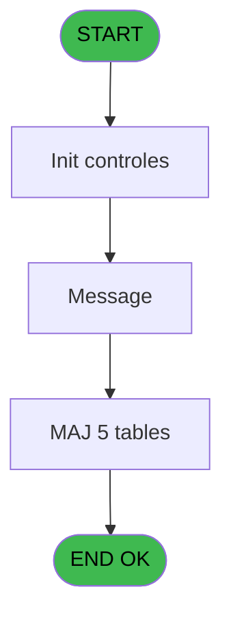

# CAB IDE 24 - Messages  @

> **Analyse**: Phases 1-4 2026-02-03 10:04 -> 10:05 (18s) | Assemblage 10:05
> **Pipeline**: V7.2 Enrichi
> **Structure**: 4 onglets (Resume | Ecrans | Donnees | Connexions)

<!-- TAB:Resume -->

## 1. FICHE D'IDENTITE

| Attribut | Valeur |
|----------|--------|
| Projet | CAB |
| IDE Position | 24 |
| Nom Programme | Messages  @ |
| Fichier source | `Prg_24.xml` |
| Domaine metier | General |
| Taches | 12 (1 ecrans visibles) |
| Tables modifiees | 5 |
| Programmes appeles | 0 |
| :warning: Statut | **ORPHELIN_POTENTIEL** |

## 2. DESCRIPTION FONCTIONNELLE

**Messages  @** assure la gestion complete de ce processus.

Le flux de traitement s'organise en **4 blocs fonctionnels** :

- **Traitement** (7 taches) : traitements metier divers
- **Creation** (2 taches) : insertion d'enregistrements en base (mouvements, prestations)
- **Calcul** (2 taches) : calculs de montants, stocks ou compteurs
- **Validation** (1 tache) : controles et verifications de coherence

**Donnees modifiees** : 5 tables en ecriture (compte_gm________cgm, historik_station, fichier_messagerie, fichier_validation, fichier_echanges).

Detail : phases du traitement

#### Phase 1 : Traitement (7 taches)

- **24** - message **[[ECRAN]](#ecran-t1)**
- **24.1** - Recup. poste et ligne
- **24.2** - Test reseau
- **24.3** - Test si message
- **24.4** - Message **[[ECRAN]](#ecran-t5)**
- **24.4.1** - Ecriture Historique
- **24.4.2** - Ecriture Historique

#### Phase 2 : Validation (1 tache)

- **24.4.3** - Maj Validation

#### Phase 3 : Creation (2 taches)

- **24.4.4** - Creation Echange
- **24.4.6** - Creation Echange

#### Phase 4 : Calcul (2 taches)

- **24.4.5** - Calcul Flag
- **24.5** - Deblocage compte

#### Tables impactees

| Table | Operations | Role metier |
|-------|-----------|-------------|
| fichier_messagerie | **W**/L (4 usages) |  |
| fichier_echanges | **W** (2 usages) |  |
| historik_station | **W** (2 usages) | Historique / journal |
| compte_gm________cgm | **W** (2 usages) | Comptes GM (generaux) |
| fichier_validation | **W** (1 usages) |  |

## 3. BLOCS FONCTIONNELS

### 3.1 Traitement (7 taches)

Traitements internes.

---

#### 24 - message [[ECRAN]](#ecran-t1)

**Role** : Tache d'orchestration : point d'entree du programme (7 sous-taches). Coordonne l'enchainement des traitements.
**Ecran** : 352 x 122 DLU (MDI) | [Voir mockup](#ecran-t1)

6 sous-taches directes

| Tache | Nom | Bloc |
|-------|-----|------|
| [24.1](#t2) | Recup. poste et ligne | Traitement |
| [24.2](#t3) | Test reseau | Traitement |
| [24.3](#t4) | Test si message | Traitement |
| [24.4](#t5) | Message **[[ECRAN]](#ecran-t5)** | Traitement |
| [24.4.1](#t6) | Ecriture Historique | Traitement |
| [24.4.2](#t7) | Ecriture Historique | Traitement |

**Variables liees** : H (W0 message ?)

---

#### 24.1 - Recup. poste et ligne

**Role** : Consultation/chargement : Recup. poste et ligne.
**Variables liees** : I (W0 n° poste), J (W0 n° ligne)

---

#### 24.2 - Test reseau

**Role** : Verification : Test reseau.
**Variables liees** : G (W0 reseau)

---

#### 24.3 - Test si message

**Role** : Verification : Test si message.
**Variables liees** : H (W0 message ?)

---

#### 24.4 - Message [[ECRAN]](#ecran-t5)

**Role** : Traitement : Message.
**Ecran** : 1072 x 213 DLU (MDI) | [Voir mockup](#ecran-t5)
**Variables liees** : H (W0 message ?)

---

#### 24.4.1 - Ecriture Historique

**Role** : Consultation/chargement : Ecriture Historique.

---

#### 24.4.2 - Ecriture Historique

**Role** : Consultation/chargement : Ecriture Historique.

### 3.2 Validation (1 tache)

Controles de coherence : 1 tache verifie les donnees et conditions.

---

#### 24.4.3 - Maj Validation

**Role** : Verification : Maj Validation.

### 3.3 Creation (2 taches)

Insertion de nouveaux enregistrements en base.

---

#### 24.4.4 - Creation Echange

**Role** : Creation d'enregistrement : Creation Echange.

---

#### 24.4.6 - Creation Echange

**Role** : Creation d'enregistrement : Creation Echange.

### 3.4 Calcul (2 taches)

Calculs metier : montants, stocks, compteurs.

---

#### 24.4.5 - Calcul Flag

**Role** : Calcul : Calcul Flag.

---

#### 24.5 - Deblocage compte

**Role** : Traitement : Deblocage compte.
**Variables liees** : B (> compte)

## 5. REGLES METIER

*(Aucune regle metier identifiee)*

## 6. CONTEXTE

- **Appele par**: (aucun)
- **Appelle**: 0 programmes | **Tables**: 6 (W:5 R:1 L:1) | **Taches**: 12 | **Expressions**: 7

<!-- TAB:Ecrans -->

## 8. ECRANS

### 8.1 Forms visibles (1 / 12)

| # | Position | Tache | Nom | Type | Largeur | Hauteur | Bloc |
|---|----------|-------|-----|------|---------|---------|------|
| 1 | 24.4 | 24.4 | Message | MDI | 1072 | 213 | Traitement |

### 8.2 Mockups Ecrans

---

#### 24.4 - Message
**Tache** : [24.4](#t5) | **Type** : MDI | **Dimensions** : 1072 x 213 DLU
**Bloc** : Traitement | **Titre IDE** : Message

<!-- FORM-DATA:
{
    "width":  1072,
    "vFactor":  8,
    "type":  "MDI",
    "hFactor":  8,
    "controls":  [
                     {
                         "x":  1,
                         "type":  "label",
                         "var":  "",
                         "y":  2,
                         "w":  1063,
                         "fmt":  "",
                         "name":  "",
                         "h":  17,
                         "color":  "",
                         "text":  "",
                         "parent":  null
                     },
                     {
                         "x":  5,
                         "type":  "label",
                         "var":  "",
                         "y":  32,
                         "w":  1058,
                         "fmt":  "",
                         "name":  "",
                         "h":  21,
                         "color":  "",
                         "text":  "",
                         "parent":  null
                     },
                     {
                         "x":  295,
                         "type":  "label",
                         "var":  "",
                         "y":  38,
                         "w":  42,
                         "fmt":  "",
                         "name":  "",
                         "h":  8,
                         "color":  "7",
                         "text":  "Par",
                         "parent":  null
                     },
                     {
                         "x":  507,
                         "type":  "label",
                         "var":  "",
                         "y":  38,
                         "w":  27,
                         "fmt":  "",
                         "name":  "",
                         "h":  8,
                         "color":  "7",
                         "text":  "le",
                         "parent":  null
                     },
                     {
                         "x":  5,
                         "type":  "label",
                         "var":  "",
                         "y":  53,
                         "w":  1058,
                         "fmt":  "",
                         "name":  "",
                         "h":  120,
                         "color":  "",
                         "text":  "",
                         "parent":  null
                     },
                     {
                         "x":  15,
                         "type":  "table",
                         "var":  "",
                         "name":  "",
                         "titleH":  12,
                         "color":  "110",
                         "w":  878,
                         "y":  62,
                         "fmt":  "",
                         "parent":  null,
                         "text":  "",
                         "rowH":  14,
                         "h":  99,
                         "cols":  [
                                      {
                                          "title":  "Message",
                                          "layer":  1,
                                          "w":  846
                                      }
                                  ],
                         "rows":  1
                     },
                     {
                         "x":  0,
                         "type":  "label",
                         "var":  "",
                         "y":  185,
                         "w":  1064,
                         "fmt":  "",
                         "name":  "",
                         "h":  24,
                         "color":  "",
                         "text":  "",
                         "parent":  null
                     },
                     {
                         "x":  546,
                         "type":  "edit",
                         "var":  "",
                         "y":  38,
                         "w":  139,
                         "fmt":  "",
                         "name":  "",
                         "h":  8,
                         "color":  "7",
                         "text":  "",
                         "parent":  null
                     },
                     {
                         "x":  695,
                         "type":  "edit",
                         "var":  "",
                         "y":  38,
                         "w":  75,
                         "fmt":  "HH:MM",
                         "name":  "",
                         "h":  8,
                         "color":  "7",
                         "text":  "",
                         "parent":  null
                     },
                     {
                         "x":  349,
                         "type":  "edit",
                         "var":  "",
                         "y":  38,
                         "w":  139,
                         "fmt":  "",
                         "name":  "",
                         "h":  8,
                         "color":  "7",
                         "text":  "",
                         "parent":  null
                     },
                     {
                         "x":  21,
                         "type":  "edit",
                         "var":  "",
                         "y":  76,
                         "w":  826,
                         "fmt":  "",
                         "name":  "",
                         "h":  10,
                         "color":  "110",
                         "text":  "",
                         "parent":  12
                     },
                     {
                         "x":  8,
                         "type":  "button",
                         "var":  "",
                         "y":  189,
                         "w":  226,
                         "fmt":  "\\A\u0026bandonner",
                         "name":  "Btn Abandonner",
                         "h":  18,
                         "color":  "",
                         "text":  "",
                         "parent":  null
                     },
                     {
                         "x":  242,
                         "type":  "button",
                         "var":  "",
                         "y":  189,
                         "w":  226,
                         "fmt":  "\u0026Suppression messages",
                         "name":  "Btn Valider",
                         "h":  18,
                         "color":  "",
                         "text":  "",
                         "parent":  null
                     },
                     {
                         "x":  7,
                         "type":  "edit",
                         "var":  "",
                         "y":  6,
                         "w":  267,
                         "fmt":  "20",
                         "name":  "",
                         "h":  8,
                         "color":  "",
                         "text":  "",
                         "parent":  1
                     },
                     {
                         "x":  779,
                         "type":  "edit",
                         "var":  "",
                         "y":  6,
                         "w":  278,
                         "fmt":  "WWW DD MMM YYYYT",
                         "name":  "",
                         "h":  8,
                         "color":  "",
                         "text":  "",
                         "parent":  1
                     },
                     {
                         "x":  896,
                         "type":  "image",
                         "var":  "",
                         "y":  60,
                         "w":  160,
                         "fmt":  "",
                         "name":  "",
                         "h":  53,
                         "color":  "",
                         "text":  "",
                         "parent":  null
                     }
                 ],
    "taskId":  "24.4",
    "height":  213
}
-->

<strong>Champs : 6 champs</strong>

| Pos (x,y) | Nom | Variable | Type |
|-----------|-----|----------|------|
| 546,38 | (sans nom) | - | edit |
| 695,38 | HH:MM | - | edit |
| 349,38 | (sans nom) | - | edit |
| 21,76 | (sans nom) | - | edit |
| 7,6 | 20 | - | edit |
| 779,6 | WWW DD MMM YYYYT | - | edit |

<strong>Boutons : 2 boutons</strong>

| Bouton | Pos (x,y) | Action |
|--------|-----------|--------|
| \Abandonner | 8,189 | Annule et retour au menu |
| Suppression messages | 242,189 | Supprime l'element selectionne |

## 9. NAVIGATION

Ecran unique: **Message**

### 9.3 Structure hierarchique (12 taches)

| Position | Tache | Type | Dimensions | Bloc |
|----------|-------|------|------------|------|
| **24.1** | [**message** (24)](#t1) [mockup](#ecran-t1) | MDI | 352x122 | Traitement |
| 24.1.1 | [Recup. poste et ligne (24.1)](#t2) | MDI | - | |
| 24.1.2 | [Test reseau (24.2)](#t3) | MDI | - | |
| 24.1.3 | [Test si message (24.3)](#t4) | MDI | - | |
| 24.1.4 | [Message (24.4)](#t5) [mockup](#ecran-t5) | MDI | 1072x213 | |
| 24.1.5 | [Ecriture Historique (24.4.1)](#t6) | MDI | - | |
| 24.1.6 | [Ecriture Historique (24.4.2)](#t7) | MDI | - | |
| **24.2** | [**Maj Validation** (24.4.3)](#t8) | MDI | - | Validation |
| **24.3** | [**Creation Echange** (24.4.4)](#t9) | MDI | - | Creation |
| 24.3.1 | [Creation Echange (24.4.6)](#t14) | MDI | - | |
| **24.4** | [**Calcul Flag** (24.4.5)](#t10) | MDI | - | Calcul |
| 24.4.1 | [Deblocage compte (24.5)](#t11) | MDI | - | |

### 9.4 Algorigramme

> **Legende**: Vert = START/END OK | Rouge = END KO | Bleu = Decisions
> *Algorigramme auto-genere. Utiliser `/algorigramme` pour une synthese metier detaillee.*

<!-- TAB:Donnees -->

## 10. TABLES

### Tables utilisees (6)

| ID | Nom | Description | Type | R | W | L | Usages |
|----|-----|-------------|------|---|---|---|--------|
| 47 | compte_gm________cgm | Comptes GM (generaux) | DB |   | **W** |   | 2 |
| 80 | codes_autocom____aut |  | DB | R |   |   | 1 |
| 88 | historik_station | Historique / journal | DB |   | **W** |   | 2 |
| 123 | fichier_messagerie |  | DB |   | **W** | L | 4 |
| 131 | fichier_validation |  | DB |   | **W** |   | 1 |
| 136 | fichier_echanges |  | DB |   | **W** |   | 2 |

### Colonnes par table (2 / 6 tables avec colonnes identifiees)

Table 47 - compte_gm________cgm (**W**) - 2 usages

| Lettre | Variable | Acces | Type |
|--------|----------|-------|------|
| B | > compte | W | Numeric |

Table 80 - codes_autocom____aut (R) - 1 usages

*Table utilisee uniquement en Link ou aucune colonne Real identifiee dans le DataView.*

Table 88 - historik_station (**W**) - 2 usages

*Table utilisee uniquement en Link ou aucune colonne Real identifiee dans le DataView.*

Table 123 - fichier_messagerie (**W**/L) - 4 usages

| Lettre | Variable | Acces | Type |
|--------|----------|-------|------|
| A | W1 ret lien message | W | Numeric |
| B | W1 fin tache | W | Alpha |
| C | Btn Abandonner | W | Alpha |
| D | Btn Valider | W | Alpha |

Table 131 - fichier_validation (**W**) - 1 usages

*Table utilisee uniquement en Link ou aucune colonne Real identifiee dans le DataView.*

Table 136 - fichier_echanges (**W**) - 2 usages

*Table utilisee uniquement en Link ou aucune colonne Real identifiee dans le DataView.*

## 11. VARIABLES

### 11.1 Variables de session (1)

Variables persistantes pendant toute la session.

| Lettre | Nom | Type | Usage dans |
|--------|-----|------|-----------|
| L | v. titre | Alpha | 1x session |

### 11.2 Variables de travail (5)

Variables internes au programme.

| Lettre | Nom | Type | Usage dans |
|--------|-----|------|-----------|
| G | W0 reseau | Alpha | [24.2](#t3) |
| H | W0 message ? | Alpha | [24](#t1), [24.3](#t4), [24.4](#t5) |
| I | W0 n° poste | Numeric | - |
| J | W0 n° ligne | Numeric | - |
| K | W0 fin tache | Alpha | 1x calcul interne |

### 11.3 Autres (6)

Variables diverses.

| Lettre | Nom | Type | Usage dans |
|--------|-----|------|-----------|
| A | > societe | Alpha | - |
| B | > compte | Numeric | - |
| C | > filiation | Numeric | - |
| D | > village tel | Alpha | 1x refs |
| E | > type triplet | Alpha | 1x refs |
| F | > Interface | Alpha | 1x refs |

## 12. EXPRESSIONS

**7 / 7 expressions decodees (100%)**

### 12.1 Repartition par type

| Type | Expressions | Regles |
|------|-------------|--------|
| CONSTANTE | 2 | 0 |
| CONDITION | 4 | 0 |
| STRING | 1 | 0 |

### 12.2 Expressions cles par type

#### CONSTANTE (2 expressions)

| Type | IDE | Expression | Regle |
|------|-----|------------|-------|
| CONSTANTE | 5 | `'F'` | - |
| CONSTANTE | 2 | `34` | - |

#### CONDITION (4 expressions)

| Type | IDE | Expression | Regle |
|------|-----|------------|-------|
| CONDITION | 6 | `W0 message ? [H]='O'` | - |
| CONDITION | 7 | `> village tel [D]='O' AND > Interface [F]='CLUB' AND > type triplet [E]='1'` | - |
| CONDITION | 3 | `W0 reseau [G]<>'R'` | - |
| CONDITION | 4 | `W0 fin tache [K]='F'` | - |

#### STRING (1 expressions)

| Type | IDE | Expression | Regle |
|------|-----|------------|-------|
| STRING | 1 | `Trim (v. titre [L])` | - |

<!-- TAB:Connexions -->

## 13. GRAPHE D'APPELS

### 13.1 Chaine depuis Main (Callers)

**Chemin**: (pas de callers directs)

### 13.2 Callers

| IDE | Nom Programme | Nb Appels |
|-----|---------------|-----------|
| - | (aucun) | - |

### 13.3 Callees (programmes appeles)

### 13.4 Detail Callees avec contexte

| IDE | Nom Programme | Appels | Contexte |
|-----|---------------|--------|----------|
| - | (aucun) | - | - |

## 14. RECOMMANDATIONS MIGRATION

### 14.1 Profil du programme

| Metrique | Valeur | Impact migration |
|----------|--------|-----------------|
| Lignes de logique | 177 | Programme compact |
| Expressions | 7 | Peu de logique |
| Tables WRITE | 5 | Impact modere |
| Sous-programmes | 0 | Peu de dependances |
| Ecrans visibles | 1 | Ecran unique ou traitement batch |
| Code desactive | 0% (0 / 177) | Code sain |
| Regles metier | 0 | Pas de regle identifiee |

### 14.2 Plan de migration par bloc

#### Traitement (7 taches: 2 ecrans, 5 traitements)

- **Strategie** : Orchestrateur avec 2 ecrans (Razor/React) et 5 traitements backend (services).
- Les ecrans deviennent des composants UI, les traitements invisibles deviennent des services injectables.
- Decomposer les taches en services unitaires testables.

#### Validation (1 tache: 0 ecran, 1 traitement)

- **Strategie** : FluentValidation avec validators specifiques.
- Chaque tache de validation -> un validator injectable

#### Creation (2 taches: 0 ecran, 2 traitements)

- **Strategie** : Repository pattern avec Entity Framework Core.
- Insertion via `IRepository<T>.CreateAsync()`

#### Calcul (2 taches: 0 ecran, 2 traitements)

- **Strategie** : Services de calcul purs (Domain Services).
- Migrer la logique de calcul (stock, compteurs, montants)

### 14.3 Dependances critiques

| Dependance | Type | Appels | Impact |
|------------|------|--------|--------|
| compte_gm________cgm | Table WRITE (Database) | 2x | Schema + repository |
| historik_station | Table WRITE (Database) | 2x | Schema + repository |
| fichier_messagerie | Table WRITE (Database) | 2x | Schema + repository |
| fichier_validation | Table WRITE (Database) | 1x | Schema + repository |
| fichier_echanges | Table WRITE (Database) | 2x | Schema + repository |

---
*Spec DETAILED generee par Pipeline V7.2 - 2026-02-03 10:05*
