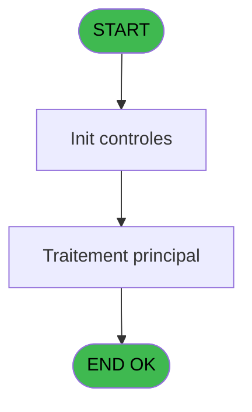

# CAB IDE 31 - Lecture paramètres init

> **Analyse**: Phases 1-4 2026-02-03 10:07 -> 10:07 (14s) | Assemblage 10:07
> **Pipeline**: V7.2 Enrichi
> **Structure**: 4 onglets (Resume | Ecrans | Donnees | Connexions)

<!-- TAB:Resume -->

## 1. FICHE D'IDENTITE

| Attribut | Valeur |
|----------|--------|
| Projet | CAB |
| IDE Position | 31 |
| Nom Programme | Lecture paramètres init |
| Fichier source | `Prg_31.xml` |
| Domaine metier | General |
| Taches | 1 (0 ecrans visibles) |
| Tables modifiees | 0 |
| Programmes appeles | 0 |

## 2. DESCRIPTION FONCTIONNELLE

**Lecture paramètres init** assure la gestion complete de ce processus, accessible depuis [Visualisation Appel (IDE 33)](CAB-IDE-33.md).

Le flux de traitement s'organise en **1 blocs fonctionnels** :

- **Saisie** (1 tache) : ecrans de saisie utilisateur (formulaires, champs, donnees)

## 3. BLOCS FONCTIONNELS

### 3.1 Saisie (1 tache)

Ce bloc traite la saisie des donnees de la transaction.

---

#### 31 - Saisie nbre decimales

**Role** : Saisie des donnees : Saisie nbre decimales.
**Variables liees** : A (< Nbre decimal)

## 5. REGLES METIER

*(Aucune regle metier identifiee)*

## 6. CONTEXTE

- **Appele par**: [Visualisation Appel (IDE 33)](CAB-IDE-33.md)
- **Appelle**: 0 programmes | **Tables**: 1 (W:0 R:1 L:0) | **Taches**: 1 | **Expressions**: 5

<!-- TAB:Ecrans -->

## 8. ECRANS

*(Programme sans ecran visible)*

## 9. NAVIGATION

### 9.3 Structure hierarchique (1 tache)

| Position | Tache | Type | Dimensions | Bloc |
|----------|-------|------|------------|------|
| **31.1** | [**Saisie nbre decimales** (31)](#t1) | Modal | - | Saisie |

### 9.4 Algorigramme

> **Legende**: Vert = START/END OK | Rouge = END KO | Bleu = Decisions
> *Algorigramme auto-genere. Utiliser `/algorigramme` pour une synthese metier detaillee.*

<!-- TAB:Donnees -->

## 10. TABLES

### Tables utilisees (1)

| ID | Nom | Description | Type | R | W | L | Usages |
|----|-----|-------------|------|---|---|---|--------|
| 69 | initialisation___ini |  | DB | R |   |   | 1 |

### Colonnes par table (1 / 1 tables avec colonnes identifiees)

Table 69 - initialisation___ini (R) - 1 usages

| Lettre | Variable | Acces | Type |
|--------|----------|-------|------|
| A | < Nbre decimal | R | Numeric |
| B | < Masque montant | R | Alpha |
| C | < Masque cumul | R | Alpha |
| D | < Devise local | R | Alpha |
| E | < Nom du village | R | Alpha |

## 11. VARIABLES

### 11.1 Autres (5)

Variables diverses.

| Lettre | Nom | Type | Usage dans |
|--------|-----|------|-----------|
| A | < Nbre decimal | Numeric | - |
| B | < Masque montant | Alpha | - |
| C | < Masque cumul | Alpha | - |
| D | < Devise local | Alpha | - |
| E | < Nom du village | Alpha | - |

## 12. EXPRESSIONS

**5 / 5 expressions decodees (100%)**

### 12.1 Repartition par type

| Type | Expressions | Regles |
|------|-------------|--------|
| OTHER | 3 | 0 |
| CONCATENATION | 2 | 0 |

### 12.2 Expressions cles par type

#### OTHER (3 expressions)

| Type | IDE | Expression | Regle |
|------|-----|------------|-------|
| OTHER | 5 | `[I]` | - |
| OTHER | 4 | `[G]` | - |
| OTHER | 1 | `[H]` | - |

#### CONCATENATION (2 expressions)

| Type | IDE | Expression | Regle |
|------|-----|------------|-------|
| CONCATENATION | 3 | `'N'&Right (' ### ### ### ###'&Left ('.',[H])&Left ('###',[H]),16)&'Z'` | - |
| CONCATENATION | 2 | `'N'&Right ('## ### ### ###'&Left ('.',[H])&Fill ('#',[H]),14)&'Z'` | - |

<!-- TAB:Connexions -->

## 13. GRAPHE D'APPELS

### 13.1 Chaine depuis Main (Callers)

Main -> ... -> [Visualisation Appel (IDE 33)](CAB-IDE-33.md) -> **Lecture paramètres init (IDE 31)**

### 13.2 Callers

| IDE | Nom Programme | Nb Appels |
|-----|---------------|-----------|
| [33](CAB-IDE-33.md) | Visualisation Appel | 1 |

### 13.3 Callees (programmes appeles)

### 13.4 Detail Callees avec contexte

| IDE | Nom Programme | Appels | Contexte |
|-----|---------------|--------|----------|
| - | (aucun) | - | - |

## 14. RECOMMANDATIONS MIGRATION

### 14.1 Profil du programme

| Metrique | Valeur | Impact migration |
|----------|--------|-----------------|
| Lignes de logique | 16 | Programme compact |
| Expressions | 5 | Peu de logique |
| Tables WRITE | 0 | Impact faible |
| Sous-programmes | 0 | Peu de dependances |
| Ecrans visibles | 0 | Ecran unique ou traitement batch |
| Code desactive | 0% (0 / 16) | Code sain |
| Regles metier | 0 | Pas de regle identifiee |

### 14.2 Plan de migration par bloc

#### Saisie (1 tache: 0 ecran, 1 traitement)

- **Strategie** : Formulaire React/Blazor avec validation Zod/FluentValidation.
- Validation temps reel cote client + serveur

### 14.3 Dependances critiques

| Dependance | Type | Appels | Impact |
|------------|------|--------|--------|

---
*Spec DETAILED generee par Pipeline V7.2 - 2026-02-03 10:07*
