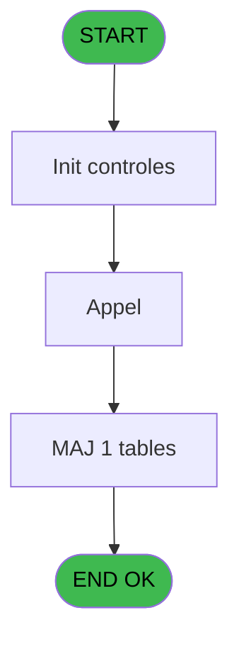
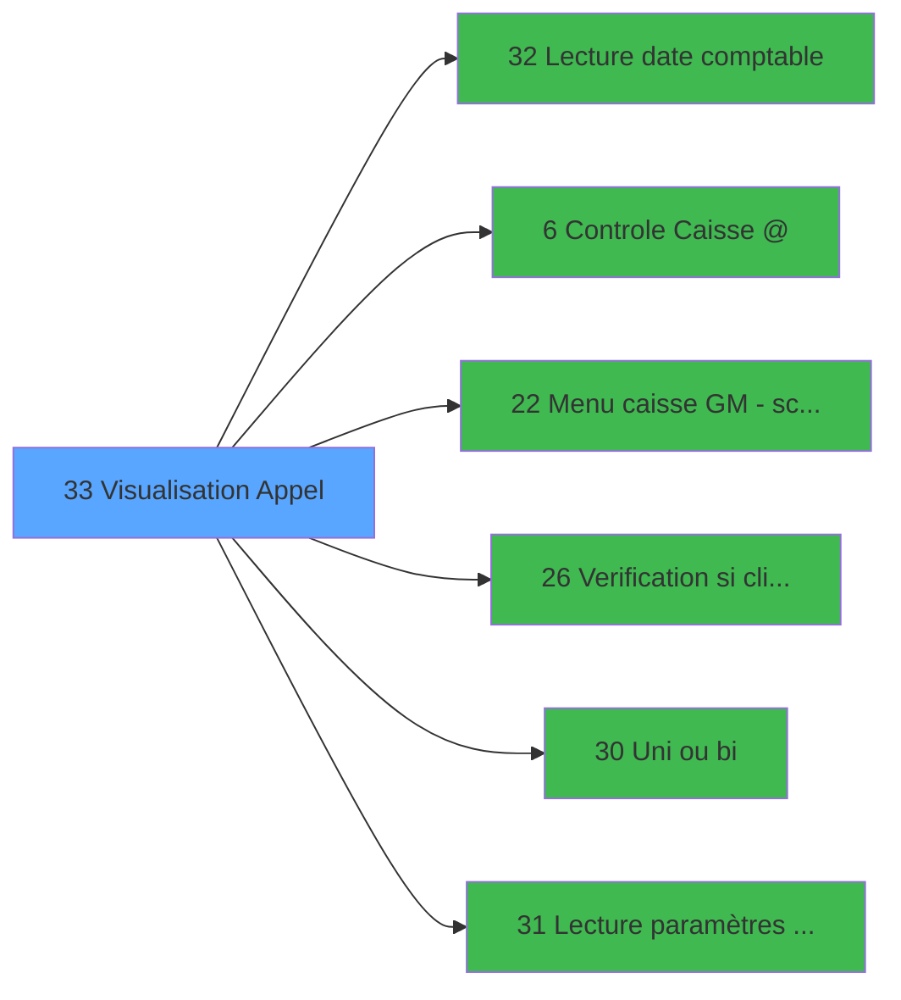

# CAB IDE 33 - Visualisation Appel

> **Analyse**: Phases 1-4 2026-02-03 10:08 -> 10:08 (14s) | Assemblage 10:08
> **Pipeline**: V7.2 Enrichi
> **Structure**: 4 onglets (Resume | Ecrans | Donnees | Connexions)

<!-- TAB:Resume -->

## 1. FICHE D'IDENTITE

| Attribut | Valeur |
|----------|--------|
| Projet | CAB |
| IDE Position | 33 |
| Nom Programme | Visualisation Appel |
| Fichier source | `Prg_33.xml` |
| Domaine metier | General |
| Taches | 9 (1 ecrans visibles) |
| Tables modifiees | 1 |
| Programmes appeles | 6 |

## 2. DESCRIPTION FONCTIONNELLE

**Visualisation Appel** assure la gestion complete de ce processus, accessible depuis [Main Program (IDE 1)](CAB-IDE-1.md).

Le flux de traitement s'organise en **2 blocs fonctionnels** :

- **Traitement** (7 taches) : traitements metier divers
- **Validation** (2 taches) : controles et verifications de coherence

**Donnees modifiees** : 1 tables en ecriture (historique_pabx).

Detail : phases du traitement

#### Phase 1 : Traitement (7 taches)

- **33** - Visualisation Appel **[[ECRAN]](#ecran-t1)**
- **33.1** - Visualisation appels Cabines **[[ECRAN]](#ecran-t2)**
- **33.1.1** - Refresch view
- **33.1.4** - Changement enregistrement
- **33.1.5** - Suprression ligne = 0
- **33.2** - Recup marge GM
- **33.3** - Recup marge GO

Delegue a : [Menu caisse GM - scroll @ (IDE 22)](CAB-IDE-22.md), [   Uni ou bi (IDE 30)](CAB-IDE-30.md)

#### Phase 2 : Validation (2 taches)

- **33.1.2** - Controle de caisse
- **33.1.3** - Verification cloture

Delegue a : [Controle Caisse @ (IDE 6)](CAB-IDE-6.md), [Verification si client/serveur (IDE 26)](CAB-IDE-26.md)

#### Tables impactees

| Table | Operations | Role metier |
|-------|-----------|-------------|
| historique_pabx | **W** (2 usages) | Historique / journal |

## 3. BLOCS FONCTIONNELS

### 3.1 Traitement (7 taches)

Traitements internes.

---

#### 33 - Visualisation Appel [[ECRAN]](#ecran-t1)

**Role** : Tache d'orchestration : point d'entree du programme (7 sous-taches). Coordonne l'enchainement des traitements.
**Ecran** : 83 x 54 DLU (MDI) | [Voir mockup](#ecran-t1)

6 sous-taches directes

| Tache | Nom | Bloc |
|-------|-----|------|
| [33.1](#t2) | Visualisation appels Cabines **[[ECRAN]](#ecran-t2)** | Traitement |
| [33.1.1](#t3) | Refresch view | Traitement |
| [33.1.4](#t6) | Changement enregistrement | Traitement |
| [33.1.5](#t7) | Suprression ligne = 0 | Traitement |
| [33.2](#t8) | Recup marge GM | Traitement |
| [33.3](#t9) | Recup marge GO | Traitement |

**Variables liees** : M (v. prefixe appel), N (v. date d'appel), O (v. heure appel), Q (v. duree appel)
**Delegue a** : [Menu caisse GM - scroll @ (IDE 22)](CAB-IDE-22.md), [   Uni ou bi (IDE 30)](CAB-IDE-30.md)

---

#### 33.1 - Visualisation appels Cabines [[ECRAN]](#ecran-t2)

**Role** : Traitement : Visualisation appels Cabines.
**Ecran** : 1080 x 274 DLU (MDI) | [Voir mockup](#ecran-t2)
**Delegue a** : [Menu caisse GM - scroll @ (IDE 22)](CAB-IDE-22.md), [   Uni ou bi (IDE 30)](CAB-IDE-30.md)

---

#### 33.1.1 - Refresch view

**Role** : Traitement : Refresch view.
**Delegue a** : [Menu caisse GM - scroll @ (IDE 22)](CAB-IDE-22.md), [   Uni ou bi (IDE 30)](CAB-IDE-30.md)

---

#### 33.1.4 - Changement enregistrement

**Role** : Traitement : Changement enregistrement.
**Variables liees** : T (v. changement enrgt)
**Delegue a** : [Menu caisse GM - scroll @ (IDE 22)](CAB-IDE-22.md), [   Uni ou bi (IDE 30)](CAB-IDE-30.md)

---

#### 33.1.5 - Suprression ligne = 0

**Role** : Traitement : Suprression ligne = 0.
**Delegue a** : [Menu caisse GM - scroll @ (IDE 22)](CAB-IDE-22.md), [   Uni ou bi (IDE 30)](CAB-IDE-30.md)

---

#### 33.2 - Recup marge GM

**Role** : Consultation/chargement : Recup marge GM.
**Variables liees** : U (v. marge GM), V (v. marge GO)
**Delegue a** : [Menu caisse GM - scroll @ (IDE 22)](CAB-IDE-22.md), [   Uni ou bi (IDE 30)](CAB-IDE-30.md)

---

#### 33.3 - Recup marge GO

**Role** : Consultation/chargement : Recup marge GO.
**Variables liees** : U (v. marge GM), V (v. marge GO)
**Delegue a** : [Menu caisse GM - scroll @ (IDE 22)](CAB-IDE-22.md), [   Uni ou bi (IDE 30)](CAB-IDE-30.md)

### 3.2 Validation (2 taches)

Controles de coherence : 2 taches verifient les donnees et conditions.

---

#### 33.1.2 - Controle de caisse

**Role** : Verification : Controle de caisse.
**Variables liees** : C (v. controle de caisse)
**Delegue a** : [Controle Caisse @ (IDE 6)](CAB-IDE-6.md), [Verification si client/serveur (IDE 26)](CAB-IDE-26.md)

---

#### 33.1.3 - Verification cloture

**Role** : Verification : Verification cloture.
**Variables liees** : S (v. cloture en cour)
**Delegue a** : [Controle Caisse @ (IDE 6)](CAB-IDE-6.md), [Verification si client/serveur (IDE 26)](CAB-IDE-26.md)

## 5. REGLES METIER

*(Aucune regle metier identifiee)*

## 6. CONTEXTE

- **Appele par**: [Main Program (IDE 1)](CAB-IDE-1.md)
- **Appelle**: 6 programmes | **Tables**: 3 (W:1 R:2 L:0) | **Taches**: 9 | **Expressions**: 10

<!-- TAB:Ecrans -->

## 8. ECRANS

### 8.1 Forms visibles (1 / 9)

| # | Position | Tache | Nom | Type | Largeur | Hauteur | Bloc |
|---|----------|-------|-----|------|---------|---------|------|
| 1 | 33.1 | 33.1 | Visualisation appels Cabines | MDI | 1080 | 274 | Traitement |

### 8.2 Mockups Ecrans

---

#### 33.1 - Visualisation appels Cabines
**Tache** : [33.1](#t2) | **Type** : MDI | **Dimensions** : 1080 x 274 DLU
**Bloc** : Traitement | **Titre IDE** : Visualisation appels Cabines

<!-- FORM-DATA:
{
    "width":  1080,
    "vFactor":  8,
    "type":  "MDI",
    "hFactor":  8,
    "controls":  [
                     {
                         "x":  0,
                         "type":  "label",
                         "var":  "",
                         "y":  0,
                         "w":  1078,
                         "fmt":  "",
                         "name":  "",
                         "h":  19,
                         "color":  "",
                         "text":  "",
                         "parent":  null
                     },
                     {
                         "x":  691,
                         "type":  "label",
                         "var":  "",
                         "y":  24,
                         "w":  368,
                         "fmt":  "",
                         "name":  "",
                         "h":  24,
                         "color":  "",
                         "text":  "",
                         "parent":  null
                     },
                     {
                         "x":  109,
                         "type":  "label",
                         "var":  "",
                         "y":  29,
                         "w":  198,
                         "fmt":  "",
                         "name":  "",
                         "h":  16,
                         "color":  "143",
                         "text":  "Clôture en cours",
                         "parent":  null
                     },
                     {
                         "x":  727,
                         "type":  "label",
                         "var":  "",
                         "y":  32,
                         "w":  155,
                         "fmt":  "",
                         "name":  "",
                         "h":  8,
                         "color":  "7",
                         "text":  "Date Comptable",
                         "parent":  6
                     },
                     {
                         "x":  31,
                         "type":  "label",
                         "var":  "",
                         "y":  54,
                         "w":  1030,
                         "fmt":  "",
                         "name":  "",
                         "h":  17,
                         "color":  "",
                         "text":  "",
                         "parent":  null
                     },
                     {
                         "x":  455,
                         "type":  "label",
                         "var":  "",
                         "y":  58,
                         "w":  181,
                         "fmt":  "",
                         "name":  "",
                         "h":  8,
                         "color":  "7",
                         "text":  "Appel Non Facture",
                         "parent":  null
                     },
                     {
                         "x":  455,
                         "type":  "label",
                         "var":  "",
                         "y":  58,
                         "w":  181,
                         "fmt":  "",
                         "name":  "",
                         "h":  8,
                         "color":  "7",
                         "text":  "Appel Facture",
                         "parent":  null
                     },
                     {
                         "x":  882,
                         "type":  "label",
                         "var":  "",
                         "y":  59,
                         "w":  168,
                         "fmt":  "",
                         "name":  "",
                         "h":  8,
                         "color":  "",
                         "text":  "(Montant au taux GM)",
                         "parent":  10
                     },
                     {
                         "x":  28,
                         "type":  "table",
                         "var":  "",
                         "name":  "",
                         "titleH":  12,
                         "color":  "110",
                         "w":  1034,
                         "y":  71,
                         "fmt":  "",
                         "parent":  null,
                         "text":  "",
                         "rowH":  14,
                         "h":  138,
                         "cols":  [
                                      {
                                          "title":  "Numéro Poste",
                                          "layer":  1,
                                          "w":  130
                                      },
                                      {
                                          "title":  "Date appel",
                                          "layer":  2,
                                          "w":  132
                                      },
                                      {
                                          "title":  "Heure d\u0027appel",
                                          "layer":  3,
                                          "w":  122
                                      },
                                      {
                                          "title":  "Durée",
                                          "layer":  4,
                                          "w":  109
                                      },
                                      {
                                          "title":  "Numéro appelé",
                                          "layer":  5,
                                          "w":  276
                                      },
                                      {
                                          "title":  "Montant devise",
                                          "layer":  6,
                                          "w":  229
                                      }
                                  ],
                         "rows":  6
                     },
                     {
                         "x":  30,
                         "type":  "label",
                         "var":  "",
                         "y":  206,
                         "w":  1029,
                         "fmt":  "",
                         "name":  "",
                         "h":  18,
                         "color":  "",
                         "text":  "",
                         "parent":  null
                     },
                     {
                         "x":  43,
                         "type":  "label",
                         "var":  "",
                         "y":  211,
                         "w":  59,
                         "fmt":  "",
                         "name":  "",
                         "h":  8,
                         "color":  "7",
                         "text":  "Nom",
                         "parent":  35
                     },
                     {
                         "x":  30,
                         "type":  "label",
                         "var":  "",
                         "y":  224,
                         "w":  1029,
                         "fmt":  "",
                         "name":  "",
                         "h":  18,
                         "color":  "",
                         "text":  "",
                         "parent":  null
                     },
                     {
                         "x":  40,
                         "type":  "label",
                         "var":  "",
                         "y":  229,
                         "w":  151,
                         "fmt":  "",
                         "name":  "",
                         "h":  9,
                         "color":  "7",
                         "text":  "Montant si GO",
                         "parent":  38
                     },
                     {
                         "x":  0,
                         "type":  "label",
                         "var":  "",
                         "y":  247,
                         "w":  1075,
                         "fmt":  "",
                         "name":  "",
                         "h":  24,
                         "color":  "",
                         "text":  "",
                         "parent":  null
                     },
                     {
                         "x":  62,
                         "type":  "edit",
                         "var":  "",
                         "y":  87,
                         "w":  75,
                         "fmt":  "",
                         "name":  "HIS ní poste",
                         "h":  8,
                         "color":  "142",
                         "text":  "",
                         "parent":  14
                     },
                     {
                         "x":  168,
                         "type":  "edit",
                         "var":  "",
                         "y":  87,
                         "w":  120,
                         "fmt":  "",
                         "name":  "",
                         "h":  8,
                         "color":  "110",
                         "text":  "",
                         "parent":  14
                     },
                     {
                         "x":  322,
                         "type":  "edit",
                         "var":  "",
                         "y":  87,
                         "w":  64,
                         "fmt":  "",
                         "name":  "",
                         "h":  8,
                         "color":  "110",
                         "text":  "",
                         "parent":  14
                     },
                     {
                         "x":  536,
                         "type":  "edit",
                         "var":  "",
                         "y":  87,
                         "w":  252,
                         "fmt":  "",
                         "name":  "",
                         "h":  8,
                         "color":  "110",
                         "text":  "",
                         "parent":  14
                     },
                     {
                         "x":  419,
                         "type":  "edit",
                         "var":  "",
                         "y":  87,
                         "w":  98,
                         "fmt":  "",
                         "name":  "",
                         "h":  8,
                         "color":  "110",
                         "text":  "",
                         "parent":  14
                     },
                     {
                         "x":  2,
                         "type":  "image",
                         "var":  "",
                         "y":  1,
                         "w":  59,
                         "fmt":  "",
                         "name":  "",
                         "h":  17,
                         "color":  "",
                         "text":  "",
                         "parent":  null
                     },
                     {
                         "x":  70,
                         "type":  "edit",
                         "var":  "",
                         "y":  5,
                         "w":  584,
                         "fmt":  "40",
                         "name":  "",
                         "h":  8,
                         "color":  "",
                         "text":  "",
                         "parent":  1
                     },
                     {
                         "x":  707,
                         "type":  "edit",
                         "var":  "",
                         "y":  5,
                         "w":  365,
                         "fmt":  "WWW DD MMM YYYYT",
                         "name":  "",
                         "h":  8,
                         "color":  "",
                         "text":  "",
                         "parent":  1
                     },
                     {
                         "x":  25,
                         "type":  "image",
                         "var":  "",
                         "y":  24,
                         "w":  77,
                         "fmt":  "",
                         "name":  "",
                         "h":  29,
                         "color":  "",
                         "text":  "",
                         "parent":  null
                     },
                     {
                         "x":  901,
                         "type":  "edit",
                         "var":  "",
                         "y":  32,
                         "w":  139,
                         "fmt":  "",
                         "name":  "",
                         "h":  8,
                         "color":  "7",
                         "text":  "",
                         "parent":  6
                     },
                     {
                         "x":  803,
                         "type":  "edit",
                         "var":  "",
                         "y":  87,
                         "w":  224,
                         "fmt":  "## ### ### ###.###Z",
                         "name":  "",
                         "h":  8,
                         "color":  "110",
                         "text":  "",
                         "parent":  14
                     },
                     {
                         "x":  110,
                         "type":  "edit",
                         "var":  "",
                         "y":  211,
                         "w":  741,
                         "fmt":  "60",
                         "name":  "",
                         "h":  8,
                         "color":  "7",
                         "text":  "",
                         "parent":  35
                     },
                     {
                         "x":  208,
                         "type":  "edit",
                         "var":  "",
                         "y":  230,
                         "w":  224,
                         "fmt":  "## ### ### ###.###Z",
                         "name":  "",
                         "h":  8,
                         "color":  "",
                         "text":  "",
                         "parent":  38
                     },
                     {
                         "x":  451,
                         "type":  "edit",
                         "var":  "",
                         "y":  230,
                         "w":  75,
                         "fmt":  "5",
                         "name":  "",
                         "h":  8,
                         "color":  "",
                         "text":  "",
                         "parent":  38
                     },
                     {
                         "x":  6,
                         "type":  "button",
                         "var":  "",
                         "y":  250,
                         "w":  154,
                         "fmt":  "\u0026Quitter",
                         "name":  "",
                         "h":  18,
                         "color":  "",
                         "text":  "",
                         "parent":  42
                     },
                     {
                         "x":  171,
                         "type":  "button",
                         "var":  "",
                         "y":  250,
                         "w":  154,
                         "fmt":  "20",
                         "name":  "",
                         "h":  18,
                         "color":  "",
                         "text":  "",
                         "parent":  null
                     },
                     {
                         "x":  336,
                         "type":  "button",
                         "var":  "",
                         "y":  250,
                         "w":  168,
                         "fmt":  "\u0026Contrôle caisse",
                         "name":  "",
                         "h":  18,
                         "color":  "",
                         "text":  "",
                         "parent":  null
                     },
                     {
                         "x":  913,
                         "type":  "button",
                         "var":  "",
                         "y":  250,
                         "w":  154,
                         "fmt":  "\u0026Encaissement",
                         "name":  "",
                         "h":  18,
                         "color":  "",
                         "text":  "",
                         "parent":  null
                     }
                 ],
    "taskId":  "33.1",
    "height":  274
}
-->

<strong>Champs : 12 champs</strong>

| Pos (x,y) | Nom | Variable | Type |
|-----------|-----|----------|------|
| 62,87 | HIS ní poste | - | edit |
| 168,87 | (sans nom) | - | edit |
| 322,87 | (sans nom) | - | edit |
| 536,87 | (sans nom) | - | edit |
| 419,87 | (sans nom) | - | edit |
| 70,5 | 40 | - | edit |
| 707,5 | WWW DD MMM YYYYT | - | edit |
| 901,32 | (sans nom) | - | edit |
| 803,87 | ## ### ### ###.###Z | - | edit |
| 110,211 | 60 | - | edit |
| 208,230 | ## ### ### ###.###Z | - | edit |
| 451,230 | 5 | - | edit |

<strong>Boutons : 4 boutons</strong>

| Bouton | Pos (x,y) | Action |
|--------|-----------|--------|
| Quitter | 6,250 | Quitte le programme |
| 20 | 171,250 | Bouton fonctionnel |
| Contrôle caisse | 336,250 | Appel [Controle Caisse @ (IDE 6)](CAB-IDE-6.md) |
| Encaissement | 913,250 | Bouton fonctionnel |

## 9. NAVIGATION

Ecran unique: **Visualisation appels Cabines**

### 9.3 Structure hierarchique (9 taches)

| Position | Tache | Type | Dimensions | Bloc |
|----------|-------|------|------------|------|
| **33.1** | [**Visualisation Appel** (33)](#t1) [mockup](#ecran-t1) | MDI | 83x54 | Traitement |
| 33.1.1 | [Visualisation appels Cabines (33.1)](#t2) [mockup](#ecran-t2) | MDI | 1080x274 | |
| 33.1.2 | [Refresch view (33.1.1)](#t3) | MDI | - | |
| 33.1.3 | [Changement enregistrement (33.1.4)](#t6) | MDI | - | |
| 33.1.4 | [Suprression ligne = 0 (33.1.5)](#t7) | MDI | - | |
| 33.1.5 | [Recup marge GM (33.2)](#t8) | MDI | - | |
| 33.1.6 | [Recup marge GO (33.3)](#t9) | MDI | - | |
| **33.2** | [**Controle de caisse** (33.1.2)](#t4) | MDI | - | Validation |
| 33.2.1 | [Verification cloture (33.1.3)](#t5) | MDI | - | |

### 9.4 Algorigramme

> **Legende**: Vert = START/END OK | Rouge = END KO | Bleu = Decisions
> *Algorigramme auto-genere. Utiliser `/algorigramme` pour une synthese metier detaillee.*

<!-- TAB:Donnees -->

## 10. TABLES

### Tables utilisees (3)

| ID | Nom | Description | Type | R | W | L | Usages |
|----|-----|-------------|------|---|---|---|--------|
| 23 | reseau_cloture___rec | Donnees reseau/cloture | DB | R |   |   | 1 |
| 155 | historique_pabx | Historique / journal | DB |   | **W** |   | 2 |
| 157 | coef__telephone__coe |  | DB | R |   |   | 2 |

### Colonnes par table (2 / 3 tables avec colonnes identifiees)

Table 23 - reseau_cloture___rec (R) - 1 usages

| Lettre | Variable | Acces | Type |
|--------|----------|-------|------|
| S | v. cloture en cour | R | Logical |

Table 155 - historique_pabx (**W**) - 2 usages

| Lettre | Variable | Acces | Type |
|--------|----------|-------|------|
| A | v. fin tache | W | Logical |
| B | bouton facture/Nonfacture | W | Alpha |

Table 157 - coef__telephone__coe (R) - 2 usages

*Table utilisee uniquement en Link ou aucune colonne Real identifiee dans le DataView.*

## 11. VARIABLES

### 11.1 Variables de session (24)

Variables persistantes pendant toute la session.

| Lettre | Nom | Type | Usage dans |
|--------|-----|------|-----------|
| A | v. titre | Alpha | - |
| B | v. fin | Logical | 2x session |
| C | v. controle de caisse | Logical | [33.1.2](#t4) |
| D | v. paye | Alpha | 1x session |
| E | v. date comptable | Date | - |
| F | v. devise local | Alpha | - |
| G | v. societe | Alpha | - |
| H | v. Nbre decimal | Numeric | - |
| I | v. Masque montant | Alpha | - |
| J | v. Masque cumul | Alpha | - |
| K | v. Nom village | Alpha | - |
| L | v. uni, Bi | Alpha | - |
| M | v. prefixe appel | Alpha | - |
| N | v. date d'appel | Date | - |
| O | v. heure appel | Time | - |
| P | v. montant | Numeric | - |
| Q | v. duree appel | Time | - |
| R | v. numero tel | Alpha | - |
| S | v. cloture en cour | Logical | - |
| T | v. changement enrgt | Logical | [33.1.4](#t6) |
| U | v. marge GM | Numeric | - |
| V | v. marge GO | Numeric | - |
| W | v. refresh screen | Logical | - |
| X | v. vente | Logical | 1x session |

Toutes les 24 variables (liste complete)

| Cat | Lettre | Nom Variable | Type |
|-----|--------|--------------|------|
| V. | **A** | v. titre | Alpha |
| V. | **B** | v. fin | Logical |
| V. | **C** | v. controle de caisse | Logical |
| V. | **D** | v. paye | Alpha |
| V. | **E** | v. date comptable | Date |
| V. | **F** | v. devise local | Alpha |
| V. | **G** | v. societe | Alpha |
| V. | **H** | v. Nbre decimal | Numeric |
| V. | **I** | v. Masque montant | Alpha |
| V. | **J** | v. Masque cumul | Alpha |
| V. | **K** | v. Nom village | Alpha |
| V. | **L** | v. uni, Bi | Alpha |
| V. | **M** | v. prefixe appel | Alpha |
| V. | **N** | v. date d'appel | Date |
| V. | **O** | v. heure appel | Time |
| V. | **P** | v. montant | Numeric |
| V. | **Q** | v. duree appel | Time |
| V. | **R** | v. numero tel | Alpha |
| V. | **S** | v. cloture en cour | Logical |
| V. | **T** | v. changement enrgt | Logical |
| V. | **U** | v. marge GM | Numeric |
| V. | **V** | v. marge GO | Numeric |
| V. | **W** | v. refresh screen | Logical |
| V. | **X** | v. vente | Logical |

## 12. EXPRESSIONS

**10 / 10 expressions decodees (100%)**

### 12.1 Repartition par type

| Type | Expressions | Regles |
|------|-------------|--------|
| CONSTANTE | 2 | 0 |
| CAST_LOGIQUE | 3 | 0 |
| OTHER | 2 | 0 |
| NEGATION | 2 | 0 |
| CONCATENATION | 1 | 0 |

### 12.2 Expressions cles par type

#### CONSTANTE (2 expressions)

| Type | IDE | Expression | Regle |
|------|-----|------------|-------|
| CONSTANTE | 3 | `'C'` | - |
| CONSTANTE | 2 | `''` | - |

#### CAST_LOGIQUE (3 expressions)

| Type | IDE | Expression | Regle |
|------|-----|------------|-------|
| CAST_LOGIQUE | 8 | `INIPut ('AllowCreateInModify = N','FALSE'LOG)` | - |
| CAST_LOGIQUE | 7 | `INIPut ('AllowCreateInModify = Y','FALSE'LOG)` | - |
| CAST_LOGIQUE | 1 | `'FALSE'LOG` | - |

#### OTHER (2 expressions)

| Type | IDE | Expression | Regle |
|------|-----|------------|-------|
| OTHER | 6 | `v. controle de caisse [C]` | - |
| OTHER | 4 | `v. fin [B]` | - |

#### NEGATION (2 expressions)

| Type | IDE | Expression | Regle |
|------|-----|------------|-------|
| NEGATION | 9 | `NOT (v. changement enrgt [T]) AND v. paye [D]='' AND v. vente [X]` | - |
| NEGATION | 5 | `NOT (v. fin [B]) AND NOT (v. controle de caisse [C])` | - |

#### CONCATENATION (1 expressions)

| Type | IDE | Expression | Regle |
|------|-----|------------|-------|
| CONCATENATION | 10 | `MlsTrans('Montant')&' '&'('&{1,6}&')'` | - |

<!-- TAB:Connexions -->

## 13. GRAPHE D'APPELS

### 13.1 Chaine depuis Main (Callers)

Main -> ... -> [Main Program (IDE 1)](CAB-IDE-1.md) -> **Visualisation Appel (IDE 33)**

### 13.2 Callers

| IDE | Nom Programme | Nb Appels |
|-----|---------------|-----------|
| [1](CAB-IDE-1.md) | Main Program | 1 |

### 13.3 Callees (programmes appeles)

### 13.4 Detail Callees avec contexte

| IDE | Nom Programme | Appels | Contexte |
|-----|---------------|--------|----------|
| [32](CAB-IDE-32.md) |    Lecture date comptable | 2 | Sous-programme |
| [6](CAB-IDE-6.md) | Controle Caisse @ | 1 | Controle/validation |
| [22](CAB-IDE-22.md) | Menu caisse GM - scroll @ | 1 | Navigation menu |
| [26](CAB-IDE-26.md) | Verification si client/serveur | 1 | Controle/validation |
| [30](CAB-IDE-30.md) |    Uni ou bi | 1 | Sous-programme |
| [31](CAB-IDE-31.md) |    Lecture paramètres init | 1 | Reinitialisation |

## 14. RECOMMANDATIONS MIGRATION

### 14.1 Profil du programme

| Metrique | Valeur | Impact migration |
|----------|--------|-----------------|
| Lignes de logique | 144 | Programme compact |
| Expressions | 10 | Peu de logique |
| Tables WRITE | 1 | Impact faible |
| Sous-programmes | 6 | Dependances moderees |
| Ecrans visibles | 1 | Ecran unique ou traitement batch |
| Code desactive | 0% (0 / 144) | Code sain |
| Regles metier | 0 | Pas de regle identifiee |

### 14.2 Plan de migration par bloc

#### Traitement (7 taches: 2 ecrans, 5 traitements)

- **Strategie** : Orchestrateur avec 2 ecrans (Razor/React) et 5 traitements backend (services).
- Les ecrans deviennent des composants UI, les traitements invisibles deviennent des services injectables.
- 6 sous-programme(s) a migrer ou a reutiliser depuis les services existants.
- Decomposer les taches en services unitaires testables.

#### Validation (2 taches: 0 ecran, 2 traitements)

- **Strategie** : FluentValidation avec validators specifiques.
- Chaque tache de validation -> un validator injectable

### 14.3 Dependances critiques

| Dependance | Type | Appels | Impact |
|------------|------|--------|--------|
| historique_pabx | Table WRITE (Database) | 2x | Schema + repository |
| [   Lecture date comptable (IDE 32)](CAB-IDE-32.md) | Sous-programme | 2x | Haute - Sous-programme |
| [   Uni ou bi (IDE 30)](CAB-IDE-30.md) | Sous-programme | 1x | Normale - Sous-programme |
| [   Lecture paramètres init (IDE 31)](CAB-IDE-31.md) | Sous-programme | 1x | Normale - Reinitialisation |
| [Verification si client/serveur (IDE 26)](CAB-IDE-26.md) | Sous-programme | 1x | Normale - Controle/validation |
| [Controle Caisse @ (IDE 6)](CAB-IDE-6.md) | Sous-programme | 1x | Normale - Controle/validation |
| [Menu caisse GM - scroll @ (IDE 22)](CAB-IDE-22.md) | Sous-programme | 1x | Normale - Navigation menu |

---
*Spec DETAILED generee par Pipeline V7.2 - 2026-02-03 10:08*
