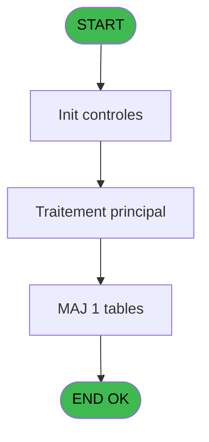
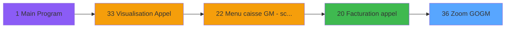
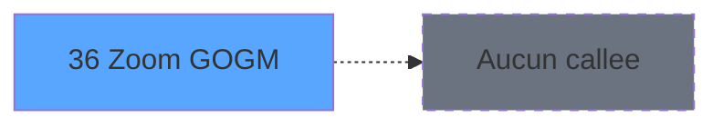

# CAB IDE 36 - Zoom GO/GM

> **Analyse**: Phases 1-4 2026-02-03 10:09 -> 10:09 (14s) | Assemblage 10:09
> **Pipeline**: V7.2 Enrichi
> **Structure**: 4 onglets (Resume | Ecrans | Donnees | Connexions)

<!-- TAB:Resume -->

## 1. FICHE D'IDENTITE

| Attribut | Valeur |
|----------|--------|
| Projet | CAB |
| IDE Position | 36 |
| Nom Programme | Zoom GO/GM |
| Fichier source | `Prg_36.xml` |
| Domaine metier | Consultation |
| Taches | 1 (1 ecrans visibles) |
| Tables modifiees | 1 |
| Programmes appeles | 0 |

## 2. DESCRIPTION FONCTIONNELLE

**Zoom GO/GM** assure la gestion complete de ce processus, accessible depuis [Facturation appel (IDE 20)](CAB-IDE-20.md).

Le flux de traitement s'organise en **1 blocs fonctionnels** :

- **Traitement** (1 tache) : traitements metier divers

**Donnees modifiees** : 1 tables en ecriture (coef__telephone__coe).

## 3. BLOCS FONCTIONNELS

### 3.1 Traitement (1 tache)

Traitements internes.

---

#### 36 - Qualite [[ECRAN]](#ecran-t1)

**Role** : Traitement : Qualite.
**Ecran** : 416 x 162 DLU (MDI) | [Voir mockup](#ecran-t1)

## 5. REGLES METIER

*(Aucune regle metier identifiee)*

## 6. CONTEXTE

- **Appele par**: [Facturation appel (IDE 20)](CAB-IDE-20.md)
- **Appelle**: 0 programmes | **Tables**: 1 (W:1 R:0 L:0) | **Taches**: 1 | **Expressions**: 5

<!-- TAB:Ecrans -->

## 8. ECRANS

### 8.1 Forms visibles (1 / 1)

| # | Position | Tache | Nom | Type | Largeur | Hauteur | Bloc |
|---|----------|-------|-----|------|---------|---------|------|
| 1 | 36 | 36 | Qualite | MDI | 416 | 162 | Traitement |

### 8.2 Mockups Ecrans

---

#### 36 - Qualite
**Tache** : [36](#t1) | **Type** : MDI | **Dimensions** : 416 x 162 DLU
**Bloc** : Traitement | **Titre IDE** : Qualite

<!-- FORM-DATA:
{
    "width":  416,
    "vFactor":  8,
    "type":  "MDI",
    "hFactor":  8,
    "controls":  [
                     {
                         "x":  106,
                         "type":  "table",
                         "var":  "",
                         "name":  "",
                         "titleH":  12,
                         "color":  "196",
                         "w":  210,
                         "y":  10,
                         "fmt":  "",
                         "parent":  null,
                         "text":  "",
                         "rowH":  11,
                         "h":  102,
                         "cols":  [
                                      {
                                          "title":  "Qualité",
                                          "layer":  1,
                                          "w":  177
                                      }
                                  ],
                         "rows":  1
                     },
                     {
                         "x":  112,
                         "type":  "label",
                         "var":  "",
                         "y":  11,
                         "w":  188,
                         "fmt":  "",
                         "name":  "",
                         "h":  9,
                         "color":  "7",
                         "text":  "Qualite",
                         "parent":  null
                     },
                     {
                         "x":  0,
                         "type":  "label",
                         "var":  "",
                         "y":  141,
                         "w":  414,
                         "fmt":  "",
                         "name":  "",
                         "h":  19,
                         "color":  "",
                         "text":  "",
                         "parent":  null
                     },
                     {
                         "x":  183,
                         "type":  "edit",
                         "var":  "",
                         "y":  24,
                         "w":  49,
                         "fmt":  "",
                         "name":  "",
                         "h":  8,
                         "color":  "177",
                         "text":  "",
                         "parent":  1
                     },
                     {
                         "x":  229,
                         "type":  "button",
                         "var":  "",
                         "y":  144,
                         "w":  144,
                         "fmt":  "\u0026Quitter",
                         "name":  "",
                         "h":  14,
                         "color":  "",
                         "text":  "",
                         "parent":  null
                     },
                     {
                         "x":  41,
                         "type":  "button",
                         "var":  "",
                         "y":  144,
                         "w":  144,
                         "fmt":  "\u0026Selectionner",
                         "name":  "",
                         "h":  14,
                         "color":  "",
                         "text":  "",
                         "parent":  null
                     },
                     {
                         "x":  178,
                         "type":  "image",
                         "var":  "",
                         "y":  118,
                         "w":  58,
                         "fmt":  "",
                         "name":  "",
                         "h":  18,
                         "color":  "",
                         "text":  "",
                         "parent":  null
                     }
                 ],
    "taskId":  "36",
    "height":  162
}
-->

<strong>Champs : 1 champs</strong>

| Pos (x,y) | Nom | Variable | Type |
|-----------|-----|----------|------|
| 183,24 | (sans nom) | - | edit |

<strong>Boutons : 2 boutons</strong>

| Bouton | Pos (x,y) | Action |
|--------|-----------|--------|
| Quitter | 229,144 | Quitte le programme |
| Selectionner | 41,144 | Ouvre la selection |

## 9. NAVIGATION

Ecran unique: **Qualite**

### 9.3 Structure hierarchique (1 tache)

| Position | Tache | Type | Dimensions | Bloc |
|----------|-------|------|------------|------|
| **36.1** | [**Qualite** (36)](#t1) [mockup](#ecran-t1) | MDI | 416x162 | Traitement |

### 9.4 Algorigramme

> **Legende**: Vert = START/END OK | Rouge = END KO | Bleu = Decisions
> *Algorigramme auto-genere. Utiliser `/algorigramme` pour une synthese metier detaillee.*

<!-- TAB:Donnees -->

## 10. TABLES

### Tables utilisees (1)

| ID | Nom | Description | Type | R | W | L | Usages |
|----|-----|-------------|------|---|---|---|--------|
| 157 | coef__telephone__coe |  | DB |   | **W** |   | 1 |

### Colonnes par table (1 / 1 tables avec colonnes identifiees)

Table 157 - coef__telephone__coe (**W**) - 1 usages

| Lettre | Variable | Acces | Type |
|--------|----------|-------|------|
| A | P0 societe | W | Alpha |
| B | PO Go/Gm | W | Alpha |
| C | W0 support-scroll | W | Alpha |
| D | bouton quitter | W | Alpha |
| E | bouton selectionner | W | Alpha |

## 11. VARIABLES

### 11.1 Parametres entrants (2)

Variables recues du programme appelant ([Facturation appel (IDE 20)](CAB-IDE-20.md)).

| Lettre | Nom | Type | Usage dans |
|--------|-----|------|-----------|
| A | P0 societe | Alpha | 1x parametre entrant |
| B | PO Go/Gm | Alpha | - |

### 11.2 Variables de travail (1)

Variables internes au programme.

| Lettre | Nom | Type | Usage dans |
|--------|-----|------|-----------|
| C | W0 support-scroll | Alpha | - |

### 11.3 Autres (2)

Variables diverses.

| Lettre | Nom | Type | Usage dans |
|--------|-----|------|-----------|
| D | bouton quitter | Alpha | - |
| E | bouton selectionner | Alpha | 1x refs |

## 12. EXPRESSIONS

**5 / 5 expressions decodees (100%)**

### 12.1 Repartition par type

| Type | Expressions | Regles |
|------|-------------|--------|
| CONSTANTE | 2 | 0 |
| CONDITION | 1 | 0 |
| OTHER | 2 | 0 |

### 12.2 Expressions cles par type

#### CONSTANTE (2 expressions)

| Type | IDE | Expression | Regle |
|------|-----|------------|-------|
| CONSTANTE | 5 | `''` | - |
| CONSTANTE | 2 | `'C'` | - |

#### CONDITION (1 expressions)

| Type | IDE | Expression | Regle |
|------|-----|------------|-------|
| CONDITION | 1 | `P0 societe [A]=''` | - |

#### OTHER (2 expressions)

| Type | IDE | Expression | Regle |
|------|-----|------------|-------|
| OTHER | 4 | `Stat (0,'C'MODE)` | - |
| OTHER | 3 | `bouton selectionner [E]` | - |

<!-- TAB:Connexions -->

## 13. GRAPHE D'APPELS

### 13.1 Chaine depuis Main (Callers)

Main -> ... -> [Facturation appel (IDE 20)](CAB-IDE-20.md) -> **Zoom GO/GM (IDE 36)**

### 13.2 Callers

| IDE | Nom Programme | Nb Appels |
|-----|---------------|-----------|
| [20](CAB-IDE-20.md) | Facturation appel | 1 |

### 13.3 Callees (programmes appeles)

### 13.4 Detail Callees avec contexte

| IDE | Nom Programme | Appels | Contexte |
|-----|---------------|--------|----------|
| - | (aucun) | - | - |

## 14. RECOMMANDATIONS MIGRATION

### 14.1 Profil du programme

| Metrique | Valeur | Impact migration |
|----------|--------|-----------------|
| Lignes de logique | 14 | Programme compact |
| Expressions | 5 | Peu de logique |
| Tables WRITE | 1 | Impact faible |
| Sous-programmes | 0 | Peu de dependances |
| Ecrans visibles | 1 | Ecran unique ou traitement batch |
| Code desactive | 0% (0 / 14) | Code sain |
| Regles metier | 0 | Pas de regle identifiee |

### 14.2 Plan de migration par bloc

#### Traitement (1 tache: 1 ecran, 0 traitement)

- **Strategie** : 1 composant(s) UI (Razor/React) avec formulaires et validation.
- Decomposer les taches en services unitaires testables.

### 14.3 Dependances critiques

| Dependance | Type | Appels | Impact |
|------------|------|--------|--------|
| coef__telephone__coe | Table WRITE (Database) | 1x | Schema + repository |

---
*Spec DETAILED generee par Pipeline V7.2 - 2026-02-03 10:09*
