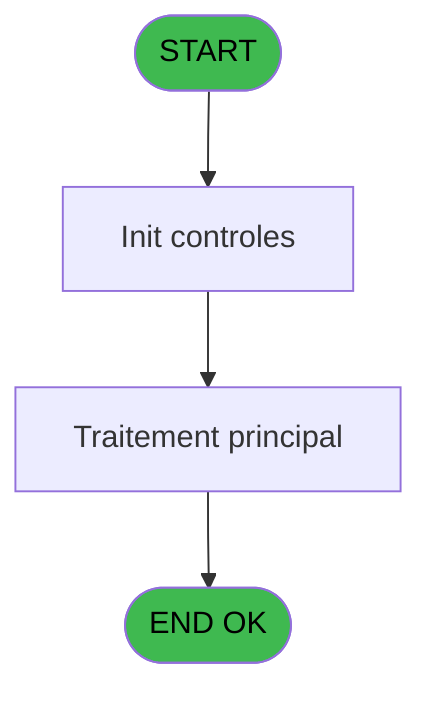
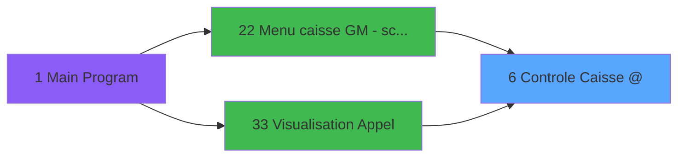

# CAB IDE 6 - Controle Caisse @

> **Analyse**: Phases 1-4 2026-02-03 09:58 -> 09:58 (19s) | Assemblage 09:58
> **Pipeline**: V7.2 Enrichi
> **Structure**: 4 onglets (Resume | Ecrans | Donnees | Connexions)

<!-- TAB:Resume -->

## 1. FICHE D'IDENTITE

| Attribut | Valeur |
|----------|--------|
| Projet | CAB |
| IDE Position | 6 |
| Nom Programme | Controle Caisse @ |
| Fichier source | `Prg_6.xml` |
| Domaine metier | Caisse |
| Taches | 4 (1 ecrans visibles) |
| Tables modifiees | 0 |
| Programmes appeles | 0 |

## 2. DESCRIPTION FONCTIONNELLE

**Controle Caisse @** assure la gestion complete de ce processus, accessible depuis [Menu caisse GM - scroll @ (IDE 22)](CAB-IDE-22.md), [Visualisation Appel (IDE 33)](CAB-IDE-33.md).

Le flux de traitement s'organise en **2 blocs fonctionnels** :

- **Calcul** (3 taches) : calculs de montants, stocks ou compteurs
- **Traitement** (1 tache) : traitements metier divers

Detail : phases du traitement

#### Phase 1 : Traitement (1 tache)

- **6** - Contrôle de la Caisse **[[ECRAN]](#ecran-t1)**

#### Phase 2 : Calcul (3 taches)

- **6.1** - Lecture date comptable
- **6.2** - Calcul Versement/retrait
- **6.3** - Calcul Versement/retrait

## 3. BLOCS FONCTIONNELS

### 3.1 Traitement (1 tache)

Traitements internes.

---

#### 6 - Contrôle de la Caisse [[ECRAN]](#ecran-t1)

**Role** : Traitement : Contrôle de la Caisse.
**Ecran** : 866 x 186 DLU (MDI) | [Voir mockup](#ecran-t1)
**Variables liees** : G (W0 caisse depart), I (W0 pièce caisse Rec), J (W0 pièce caisse Dep)

### 3.2 Calcul (3 taches)

Calculs metier : montants, stocks, compteurs.

---

#### 6.1 - Lecture date comptable

**Role** : Traitement : Lecture date comptable.
**Variables liees** : L (W0 date comptable)

---

#### 6.2 - Calcul Versement/retrait

**Role** : Calcul : Calcul Versement/retrait.

---

#### 6.3 - Calcul Versement/retrait

**Role** : Calcul : Calcul Versement/retrait.

## 5. REGLES METIER

*(Aucune regle metier identifiee)*

## 6. CONTEXTE

- **Appele par**: [Menu caisse GM - scroll @ (IDE 22)](CAB-IDE-22.md), [Visualisation Appel (IDE 33)](CAB-IDE-33.md)
- **Appelle**: 0 programmes | **Tables**: 4 (W:0 R:2 L:2) | **Taches**: 4 | **Expressions**: 13

<!-- TAB:Ecrans -->

## 8. ECRANS

### 8.1 Forms visibles (1 / 4)

| # | Position | Tache | Nom | Type | Largeur | Hauteur | Bloc |
|---|----------|-------|-----|------|---------|---------|------|
| 1 | 6 | 6 | Contrôle de la Caisse | MDI | 866 | 186 | Traitement |

### 8.2 Mockups Ecrans

---

#### 6 - Contrôle de la Caisse
**Tache** : [6](#t1) | **Type** : MDI | **Dimensions** : 866 x 186 DLU
**Bloc** : Traitement | **Titre IDE** : Contrôle de la Caisse

<!-- FORM-DATA:
{
    "width":  866,
    "vFactor":  8,
    "type":  "MDI",
    "hFactor":  8,
    "controls":  [
                     {
                         "x":  2,
                         "type":  "label",
                         "var":  "",
                         "y":  2,
                         "w":  858,
                         "fmt":  "",
                         "name":  "",
                         "h":  17,
                         "color":  "",
                         "text":  "",
                         "parent":  null
                     },
                     {
                         "x":  18,
                         "type":  "label",
                         "var":  "",
                         "y":  25,
                         "w":  827,
                         "fmt":  "",
                         "name":  "",
                         "h":  129,
                         "color":  "",
                         "text":  "",
                         "parent":  null
                     },
                     {
                         "x":  57,
                         "type":  "label",
                         "var":  "",
                         "y":  33,
                         "w":  121,
                         "fmt":  "",
                         "name":  "",
                         "h":  10,
                         "color":  "",
                         "text":  "Caisse depart",
                         "parent":  null
                     },
                     {
                         "x":  57,
                         "type":  "label",
                         "var":  "",
                         "y":  49,
                         "w":  117,
                         "fmt":  "",
                         "name":  "",
                         "h":  10,
                         "color":  "",
                         "text":  "Apport coffre",
                         "parent":  null
                     },
                     {
                         "x":  188,
                         "type":  "label",
                         "var":  "",
                         "y":  86,
                         "w":  486,
                         "fmt":  "",
                         "name":  "",
                         "h":  53,
                         "color":  "152",
                         "text":  "Pièces Caisse",
                         "parent":  null
                     },
                     {
                         "x":  259,
                         "type":  "label",
                         "var":  "",
                         "y":  102,
                         "w":  69,
                         "fmt":  "",
                         "name":  "",
                         "h":  10,
                         "color":  "",
                         "text":  "Recette",
                         "parent":  10
                     },
                     {
                         "x":  259,
                         "type":  "label",
                         "var":  "",
                         "y":  122,
                         "w":  77,
                         "fmt":  "",
                         "name":  "",
                         "h":  8,
                         "color":  "",
                         "text":  "Depense",
                         "parent":  10
                     },
                     {
                         "x":  2,
                         "type":  "label",
                         "var":  "",
                         "y":  159,
                         "w":  859,
                         "fmt":  "",
                         "name":  "",
                         "h":  23,
                         "color":  "",
                         "text":  "",
                         "parent":  null
                     },
                     {
                         "x":  191,
                         "type":  "edit",
                         "var":  "",
                         "y":  33,
                         "w":  216,
                         "fmt":  "18",
                         "name":  "W0 caisse depart",
                         "h":  10,
                         "color":  "110",
                         "text":  "",
                         "parent":  null
                     },
                     {
                         "x":  191,
                         "type":  "edit",
                         "var":  "",
                         "y":  49,
                         "w":  216,
                         "fmt":  "18",
                         "name":  "W0 apport coffre",
                         "h":  10,
                         "color":  "110",
                         "text":  "",
                         "parent":  null
                     },
                     {
                         "x":  388,
                         "type":  "edit",
                         "var":  "",
                         "y":  102,
                         "w":  216,
                         "fmt":  "18",
                         "name":  "W0 pièce caisse Rec",
                         "h":  10,
                         "color":  "110",
                         "text":  "",
                         "parent":  10
                     },
                     {
                         "x":  388,
                         "type":  "edit",
                         "var":  "",
                         "y":  120,
                         "w":  216,
                         "fmt":  "18",
                         "name":  "W0 pièce caisse Dep",
                         "h":  10,
                         "color":  "110",
                         "text":  "",
                         "parent":  10
                     },
                     {
                         "x":  8,
                         "type":  "edit",
                         "var":  "",
                         "y":  6,
                         "w":  267,
                         "fmt":  "20",
                         "name":  "",
                         "h":  8,
                         "color":  "",
                         "text":  "",
                         "parent":  1
                     },
                     {
                         "x":  572,
                         "type":  "edit",
                         "var":  "",
                         "y":  6,
                         "w":  278,
                         "fmt":  "WWW DD MMM YYYYT",
                         "name":  "",
                         "h":  8,
                         "color":  "",
                         "text":  "",
                         "parent":  1
                     },
                     {
                         "x":  659,
                         "type":  "image",
                         "var":  "",
                         "y":  28,
                         "w":  163,
                         "fmt":  "",
                         "name":  "",
                         "h":  60,
                         "color":  "",
                         "text":  "",
                         "parent":  null
                     },
                     {
                         "x":  12,
                         "type":  "button",
                         "var":  "",
                         "y":  162,
                         "w":  168,
                         "fmt":  "\u0026Quitter",
                         "name":  "",
                         "h":  18,
                         "color":  "",
                         "text":  "",
                         "parent":  null
                     }
                 ],
    "taskId":  "6",
    "height":  186
}
-->

<strong>Champs : 6 champs</strong>

| Pos (x,y) | Nom | Variable | Type |
|-----------|-----|----------|------|
| 191,33 | W0 caisse depart | - | edit |
| 191,49 | W0 apport coffre | - | edit |
| 388,102 | W0 pièce caisse Rec | - | edit |
| 388,120 | W0 pièce caisse Dep | - | edit |
| 8,6 | 20 | - | edit |
| 572,6 | WWW DD MMM YYYYT | - | edit |

<strong>Boutons : 1 boutons</strong>

| Bouton | Pos (x,y) | Action |
|--------|-----------|--------|
| Quitter | 12,162 | Quitte le programme |

## 9. NAVIGATION

Ecran unique: **Contrôle de la Caisse**

### 9.3 Structure hierarchique (4 taches)

| Position | Tache | Type | Dimensions | Bloc |
|----------|-------|------|------------|------|
| **6.1** | [**Contrôle de la Caisse** (6)](#t1) [mockup](#ecran-t1) | MDI | 866x186 | Traitement |
| **6.2** | [**Lecture date comptable** (6.1)](#t3) | MDI | - | Calcul |
| 6.2.1 | [Calcul Versement/retrait (6.2)](#t4) | MDI | - | |
| 6.2.2 | [Calcul Versement/retrait (6.3)](#t5) | MDI | - | |

### 9.4 Algorigramme

> **Legende**: Vert = START/END OK | Rouge = END KO | Bleu = Decisions
> *Algorigramme auto-genere. Utiliser `/algorigramme` pour une synthese metier detaillee.*

<!-- TAB:Donnees -->

## 10. TABLES

### Tables utilisees (4)

| ID | Nom | Description | Type | R | W | L | Usages |
|----|-----|-------------|------|---|---|---|--------|
| 40 | comptable________cte |  | DB | R |   |   | 2 |
| 70 | date_comptable___dat |  | DB | R |   |   | 1 |
| 89 | moyen_paiement___mop |  | DB |   |   | L | 1 |
| 140 | moyen_paiement___mop |  | DB |   |   | L | 1 |

### Colonnes par table (2 / 2 tables avec colonnes identifiees)

Table 40 - comptable________cte (R) - 2 usages

| Lettre | Variable | Acces | Type |
|--------|----------|-------|------|
| L | W0 date comptable | R | Date |

Table 70 - date_comptable___dat (R) - 1 usages

| Lettre | Variable | Acces | Type |
|--------|----------|-------|------|
| L | W0 date comptable | R | Date |

## 11. VARIABLES

### 11.1 Parametres entrants (6)

Variables recues du programme appelant ([Menu caisse GM - scroll @ (IDE 22)](CAB-IDE-22.md)).

| Lettre | Nom | Type | Usage dans |
|--------|-----|------|-----------|
| A | P0 societe | Alpha | - |
| B | P0 nbre decimales | Numeric | - |
| C | P0 nom village | Alpha | - |
| D | P0 masque cumul | Alpha | 1x parametre entrant |
| E | P0 devise locale | Alpha | - |
| F | P0 Uni/Bilateral | Alpha | 2x parametre entrant |

### 11.2 Variables de travail (12)

Variables internes au programme.

| Lettre | Nom | Type | Usage dans |
|--------|-----|------|-----------|
| G | W0 caisse depart | Numeric | [6](#t1) |
| H | W0 apport coffre | Numeric | - |
| I | W0 pièce caisse Rec | Numeric | [6](#t1) |
| J | W0 pièce caisse Dep | Numeric | [6](#t1) |
| K | W0 confirmation | Numeric | - |
| L | W0 date comptable | Date | [6.1](#t3) |
| M | W0 versement | Numeric | - |
| N | W0 retrait | Numeric | - |
| O | W0 solde cash | Numeric | - |
| P | W0 solde carte | Numeric | - |
| Q | W0 change | Numeric | - |
| R | W0 fin tache | Alpha | - |

Toutes les 18 variables (liste complete)

| Cat | Lettre | Nom Variable | Type |
|-----|--------|--------------|------|
| P0 | **A** | P0 societe | Alpha |
| P0 | **B** | P0 nbre decimales | Numeric |
| P0 | **C** | P0 nom village | Alpha |
| P0 | **D** | P0 masque cumul | Alpha |
| P0 | **E** | P0 devise locale | Alpha |
| P0 | **F** | P0 Uni/Bilateral | Alpha |
| W0 | **G** | W0 caisse depart | Numeric |
| W0 | **H** | W0 apport coffre | Numeric |
| W0 | **I** | W0 pièce caisse Rec | Numeric |
| W0 | **J** | W0 pièce caisse Dep | Numeric |
| W0 | **K** | W0 confirmation | Numeric |
| W0 | **L** | W0 date comptable | Date |
| W0 | **M** | W0 versement | Numeric |
| W0 | **N** | W0 retrait | Numeric |
| W0 | **O** | W0 solde cash | Numeric |
| W0 | **P** | W0 solde carte | Numeric |
| W0 | **Q** | W0 change | Numeric |
| W0 | **R** | W0 fin tache | Alpha |

## 12. EXPRESSIONS

**13 / 13 expressions decodees (100%)**

### 12.1 Repartition par type

| Type | Expressions | Regles |
|------|-------------|--------|
| CONSTANTE | 2 | 0 |
| DATE | 1 | 0 |
| REFERENCE_VG | 1 | 0 |
| OTHER | 2 | 0 |
| CONDITION | 7 | 0 |

### 12.2 Expressions cles par type

#### CONSTANTE (2 expressions)

| Type | IDE | Expression | Regle |
|------|-----|------------|-------|
| CONSTANTE | 12 | `'a'` | - |
| CONSTANTE | 10 | `'F'` | - |

#### DATE (1 expressions)

| Type | IDE | Expression | Regle |
|------|-----|------------|-------|
| DATE | 1 | `Date ()` | - |

#### REFERENCE_VG (1 expressions)

| Type | IDE | Expression | Regle |
|------|-----|------------|-------|
| REFERENCE_VG | 2 | `VG2` | - |

#### OTHER (2 expressions)

| Type | IDE | Expression | Regle |
|------|-----|------------|-------|
| OTHER | 13 | `{1,1}` | - |
| OTHER | 3 | `P0 masque cumul [D]` | - |

#### CONDITION (7 expressions)

| Type | IDE | Expression | Regle |
|------|-----|------------|-------|
| CONDITION | 8 | `W0 pièce caisse Rec [I]<0` | - |
| CONDITION | 9 | `W0 pièce caisse Dep [J]<0` | - |
| CONDITION | 11 | `[S]='F'` | - |
| CONDITION | 7 | `W0 caisse depart [G]<0` | - |
| CONDITION | 4 | `W0 date comptable [L]=6` | - |
| ... | | *+2 autres* | |

<!-- TAB:Connexions -->

## 13. GRAPHE D'APPELS

### 13.1 Chaine depuis Main (Callers)

Main -> ... -> [Menu caisse GM - scroll @ (IDE 22)](CAB-IDE-22.md) -> **Controle Caisse @ (IDE 6)**

Main -> ... -> [Visualisation Appel (IDE 33)](CAB-IDE-33.md) -> **Controle Caisse @ (IDE 6)**

### 13.2 Callers

| IDE | Nom Programme | Nb Appels |
|-----|---------------|-----------|
| [22](CAB-IDE-22.md) | Menu caisse GM - scroll @ | 1 |
| [33](CAB-IDE-33.md) | Visualisation Appel | 1 |

### 13.3 Callees (programmes appeles)

### 13.4 Detail Callees avec contexte

| IDE | Nom Programme | Appels | Contexte |
|-----|---------------|--------|----------|
| - | (aucun) | - | - |

## 14. RECOMMANDATIONS MIGRATION

### 14.1 Profil du programme

| Metrique | Valeur | Impact migration |
|----------|--------|-----------------|
| Lignes de logique | 90 | Programme compact |
| Expressions | 13 | Peu de logique |
| Tables WRITE | 0 | Impact faible |
| Sous-programmes | 0 | Peu de dependances |
| Ecrans visibles | 1 | Ecran unique ou traitement batch |
| Code desactive | 0% (0 / 90) | Code sain |
| Regles metier | 0 | Pas de regle identifiee |

### 14.2 Plan de migration par bloc

#### Traitement (1 tache: 1 ecran, 0 traitement)

- **Strategie** : 1 composant(s) UI (Razor/React) avec formulaires et validation.
- Decomposer les taches en services unitaires testables.

#### Calcul (3 taches: 0 ecran, 3 traitements)

- **Strategie** : Services de calcul purs (Domain Services).
- Migrer la logique de calcul (stock, compteurs, montants)

### 14.3 Dependances critiques

| Dependance | Type | Appels | Impact |
|------------|------|--------|--------|

---
*Spec DETAILED generee par Pipeline V7.2 - 2026-02-03 09:58*
