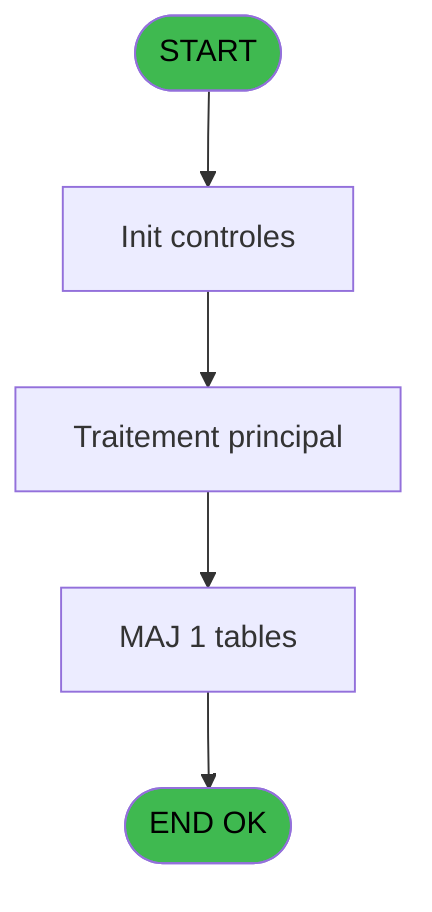

# CAB IDE 7 - Suppression demande verif pool

> **Analyse**: Phases 1-4 2026-02-03 09:58 -> 09:58 (19s) | Assemblage 09:58
> **Pipeline**: V7.2 Enrichi
> **Structure**: 4 onglets (Resume | Ecrans | Donnees | Connexions)

<!-- TAB:Resume -->

## 1. FICHE D'IDENTITE

| Attribut | Valeur |
|----------|--------|
| Projet | CAB |
| IDE Position | 7 |
| Nom Programme | Suppression demande verif pool |
| Fichier source | `Prg_7.xml` |
| Domaine metier | General |
| Taches | 3 (0 ecrans visibles) |
| Tables modifiees | 1 |
| Programmes appeles | 0 |

## 2. DESCRIPTION FONCTIONNELLE

**Suppression demande verif pool** assure la gestion complete de ce processus, accessible depuis [Verification pooling (IDE 9)](CAB-IDE-9.md).

Le flux de traitement s'organise en **1 blocs fonctionnels** :

- **Validation** (3 taches) : controles et verifications de coherence

**Donnees modifiees** : 1 tables en ecriture (comptes_pour_changer_activite).

## 3. BLOCS FONCTIONNELS

### 3.1 Validation (3 taches)

Controles de coherence : 3 taches verifient les donnees et conditions.

---

#### 7 - Suppression demande verif pool

**Role** : Verification : Suppression demande verif pool.

---

#### 7.1 - Suppression demande verif pool

**Role** : Verification : Suppression demande verif pool.

---

#### 7.2 - Suppression demande verif pool

**Role** : Verification : Suppression demande verif pool.

## 5. REGLES METIER

*(Aucune regle metier identifiee)*

## 6. CONTEXTE

- **Appele par**: [Verification pooling (IDE 9)](CAB-IDE-9.md)
- **Appelle**: 0 programmes | **Tables**: 1 (W:1 R:0 L:0) | **Taches**: 3 | **Expressions**: 3

<!-- TAB:Ecrans -->

## 8. ECRANS

*(Programme sans ecran visible)*

## 9. NAVIGATION

### 9.3 Structure hierarchique (3 taches)

| Position | Tache | Type | Dimensions | Bloc |
|----------|-------|------|------------|------|
| **7.1** | [**Suppression demande verif pool** (7)](#t1) | MDI | - | Validation |
| 7.1.1 | [Suppression demande verif pool (7.1)](#t4) | MDI | - | |
| 7.1.2 | [Suppression demande verif pool (7.2)](#t7) | MDI | - | |

### 9.4 Algorigramme

> **Legende**: Vert = START/END OK | Rouge = END KO | Bleu = Decisions
> *Algorigramme auto-genere. Utiliser `/algorigramme` pour une synthese metier detaillee.*

<!-- TAB:Donnees -->

## 10. TABLES

### Tables utilisees (1)

| ID | Nom | Description | Type | R | W | L | Usages |
|----|-----|-------------|------|---|---|---|--------|
| 476 | comptes_pour_changer_activite | Comptes GM (generaux) | TMP |   | **W** |   | 2 |

### Colonnes par table (0 / 1 tables avec colonnes identifiees)

Table 476 - comptes_pour_changer_activite (**W**) - 2 usages

*Table utilisee uniquement en Link ou aucune colonne Real identifiee dans le DataView.*

## 11. VARIABLES

*(Programme sans variables locales mappees)*

## 12. EXPRESSIONS

**3 / 3 expressions decodees (100%)**

### 12.1 Repartition par type

| Type | Expressions | Regles |
|------|-------------|--------|
| NEGATION | 1 | 0 |
| REFERENCE_VG | 2 | 0 |

### 12.2 Expressions cles par type

#### NEGATION (1 expressions)

| Type | IDE | Expression | Regle |
|------|-----|------------|-------|
| NEGATION | 1 | `NOT VG6` | - |

#### REFERENCE_VG (2 expressions)

| Type | IDE | Expression | Regle |
|------|-----|------------|-------|
| REFERENCE_VG | 3 | `VG7` | - |
| REFERENCE_VG | 2 | `VG6` | - |

<!-- TAB:Connexions -->

## 13. GRAPHE D'APPELS

### 13.1 Chaine depuis Main (Callers)

Main -> ... -> [Verification pooling (IDE 9)](CAB-IDE-9.md) -> **Suppression demande verif pool (IDE 7)**

### 13.2 Callers

| IDE | Nom Programme | Nb Appels |
|-----|---------------|-----------|
| [9](CAB-IDE-9.md) | Verification pooling | 2 |

### 13.3 Callees (programmes appeles)

### 13.4 Detail Callees avec contexte

| IDE | Nom Programme | Appels | Contexte |
|-----|---------------|--------|----------|
| - | (aucun) | - | - |

## 14. RECOMMANDATIONS MIGRATION

### 14.1 Profil du programme

| Metrique | Valeur | Impact migration |
|----------|--------|-----------------|
| Lignes de logique | 7 | Programme compact |
| Expressions | 3 | Peu de logique |
| Tables WRITE | 1 | Impact faible |
| Sous-programmes | 0 | Peu de dependances |
| Ecrans visibles | 0 | Ecran unique ou traitement batch |
| Code desactive | 0% (0 / 7) | Code sain |
| Regles metier | 0 | Pas de regle identifiee |

### 14.2 Plan de migration par bloc

#### Validation (3 taches: 0 ecran, 3 traitements)

- **Strategie** : FluentValidation avec validators specifiques.
- Chaque tache de validation -> un validator injectable

### 14.3 Dependances critiques

| Dependance | Type | Appels | Impact |
|------------|------|--------|--------|
| comptes_pour_changer_activite | Table WRITE (Temp) | 2x | Schema + repository |

---
*Spec DETAILED generee par Pipeline V7.2 - 2026-02-03 09:58*
