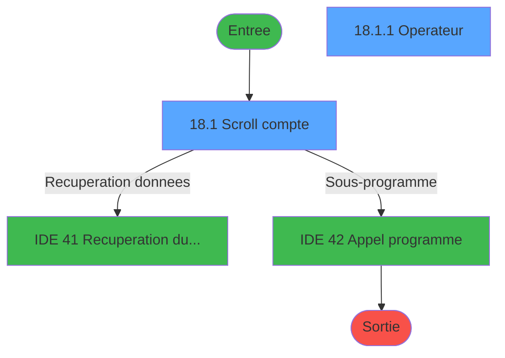
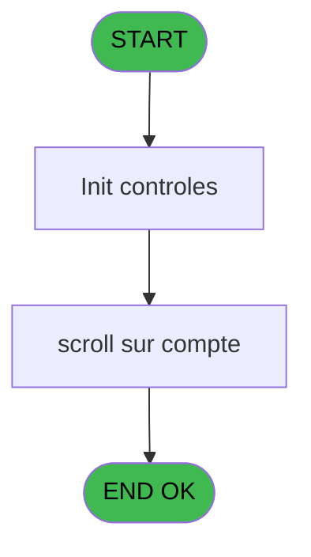
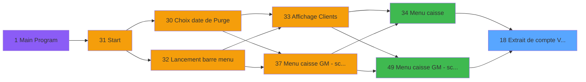
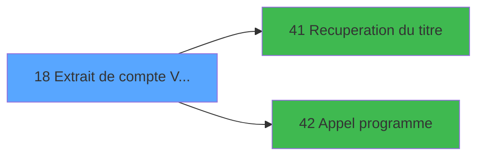

# CAP IDE 18 - Extrait de compte  Vente

> **Analyse**: Phases 1-4 2026-02-03 10:15 -> 10:15 (14s) | Assemblage 10:15
> **Pipeline**: V7.2 Enrichi
> **Structure**: 4 onglets (Resume | Ecrans | Donnees | Connexions)

<!-- TAB:Resume -->

## 1. FICHE D'IDENTITE

| Attribut | Valeur |
|----------|--------|
| Projet | CAP |
| IDE Position | 18 |
| Nom Programme | Extrait de compte  Vente |
| Fichier source | `Prg_18.xml` |
| Domaine metier | Ventes |
| Taches | 4 (2 ecrans visibles) |
| Tables modifiees | 0 |
| Programmes appeles | 2 |

## 2. DESCRIPTION FONCTIONNELLE

**Extrait de compte  Vente** assure la gestion complete de ce processus, accessible depuis [Menu caisse (IDE 34)](CAP-IDE-34.md), [Menu caisse GM - scroll @ (IDE 49)](CAP-IDE-49.md).

Le flux de traitement s'organise en **2 blocs fonctionnels** :

- **Calcul** (3 taches) : calculs de montants, stocks ou compteurs
- **Traitement** (1 tache) : traitements metier divers

**Logique metier** : 4 regles identifiees couvrant conditions metier, valeurs par defaut.

Detail : phases du traitement

#### Phase 1 : Calcul (3 taches)

- **18** - Extrait de compte **[[ECRAN]](#ecran-t1)**
- **18.1** - Scroll compte **[[ECRAN]](#ecran-t2)**
- **18.2** - Reaffichage infos compte

#### Phase 2 : Traitement (1 tache)

- **18.1.1** - Operateur **[[ECRAN]](#ecran-t3)**

Delegue a : [Recuperation du titre (IDE 41)](CAP-IDE-41.md), [Appel programme (IDE 42)](CAP-IDE-42.md)

## 3. BLOCS FONCTIONNELS

### 3.1 Calcul (3 taches)

Calculs metier : montants, stocks, compteurs.

---

#### 18 - Extrait de compte [[ECRAN]](#ecran-t1)

**Role** : Traitement : Extrait de compte.
**Ecran** : 875 x 250 DLU (MDI) | [Voir mockup](#ecran-t1)
**Variables liees** : G (P0 solde compte), H (P0 etat compte)

---

#### 18.1 - Scroll compte [[ECRAN]](#ecran-t2)

**Role** : Traitement : Scroll compte.
**Ecran** : 1354 x 293 DLU (MDI) | [Voir mockup](#ecran-t2)
**Variables liees** : G (P0 solde compte), H (P0 etat compte)

---

#### 18.2 - Reaffichage infos compte

**Role** : Reinitialisation : Reaffichage infos compte.
**Variables liees** : G (P0 solde compte), H (P0 etat compte)

### 3.2 Traitement (1 tache)

Traitements internes.

---

#### 18.1.1 - Operateur [[ECRAN]](#ecran-t3)

**Role** : Configuration/parametrage : Operateur.
**Ecran** : 307 x 83 DLU (MDI) | [Voir mockup](#ecran-t3)
**Delegue a** : [Recuperation du titre (IDE 41)](CAP-IDE-41.md), [Appel programme (IDE 42)](CAP-IDE-42.md)

## 5. REGLES METIER

4 regles identifiees:

### Autres (4 regles)

#### [RM-001] Valeur par defaut si {1,5} est vide

| Element | Detail |
|---------|--------|
| **Condition** | `{1` |
| **Si vrai** | 5}='' |
| **Si faux** | '15',{1,5}) |
| **Expression source** | Expression 9 : `IF ({1,5}='','15',{1,5})` |
| **Exemple** | Si {1 → 5}=''. Sinon → '15',{1,5}) |

#### [RM-002] Si [O]>0 alors 'x' sinon '')

| Element | Detail |
|---------|--------|
| **Condition** | `[O]>0` |
| **Si vrai** | 'x' |
| **Si faux** | '') |
| **Expression source** | Expression 12 : `IF ([O]>0,'x','')` |
| **Exemple** | Si [O]>0 → 'x'. Sinon → '') |

#### [RM-003] Si [L]='X' alors 141 sinon IF ([L]='A',143,110))

| Element | Detail |
|---------|--------|
| **Condition** | `[L]='X'` |
| **Si vrai** | 141 |
| **Si faux** | IF ([L]='A',143,110)) |
| **Expression source** | Expression 14 : `IF ([L]='X',141,IF ([L]='A',143,110))` |
| **Exemple** | Si [L]='X' → 141. Sinon → IF ([L]='A',143,110)) |

#### [RM-004] Si Stat (0 alors 'C'MODE) sinon 'T','')

| Element | Detail |
|---------|--------|
| **Condition** | `Stat (0` |
| **Si vrai** | 'C'MODE) |
| **Si faux** | 'T','') |
| **Expression source** | Expression 20 : `IF (Stat (0,'C'MODE),'T','')` |
| **Exemple** | Si Stat (0 → 'C'MODE). Sinon → 'T','') |

## 6. CONTEXTE

- **Appele par**: [Menu caisse (IDE 34)](CAP-IDE-34.md), [Menu caisse GM - scroll @ (IDE 49)](CAP-IDE-49.md)
- **Appelle**: 2 programmes | **Tables**: 4 (W:0 R:2 L:2) | **Taches**: 4 | **Expressions**: 26

<!-- TAB:Ecrans -->

## 8. ECRANS

### 8.1 Forms visibles (2 / 4)

| # | Position | Tache | Nom | Type | Largeur | Hauteur | Bloc |
|---|----------|-------|-----|------|---------|---------|------|
| 1 | 18.1 | 18.1 | Scroll compte | MDI | 1354 | 293 | Calcul |
| 2 | 18.1.1 | 18.1.1 | Operateur | MDI | 307 | 83 | Traitement |

### 8.2 Mockups Ecrans

---

#### 18.1 - Scroll compte
**Tache** : [18.1](#t2) | **Type** : MDI | **Dimensions** : 1354 x 293 DLU
**Bloc** : Calcul | **Titre IDE** : Scroll compte

<!-- FORM-DATA:
{
    "width":  1354,
    "vFactor":  8,
    "type":  "MDI",
    "hFactor":  8,
    "controls":  [
                     {
                         "x":  0,
                         "type":  "label",
                         "var":  "",
                         "y":  1,
                         "w":  1340,
                         "fmt":  "",
                         "name":  "",
                         "h":  19,
                         "color":  "",
                         "text":  "",
                         "parent":  null
                     },
                     {
                         "x":  3,
                         "type":  "label",
                         "var":  "",
                         "y":  23,
                         "w":  1341,
                         "fmt":  "",
                         "name":  "",
                         "h":  117,
                         "color":  "",
                         "text":  "",
                         "parent":  null
                     },
                     {
                         "x":  63,
                         "type":  "table",
                         "var":  "",
                         "name":  "",
                         "titleH":  12,
                         "color":  "110",
                         "w":  1227,
                         "y":  31,
                         "fmt":  "",
                         "parent":  null,
                         "text":  "",
                         "rowH":  13,
                         "h":  105,
                         "cols":  [
                                      {
                                          "title":  "Crédit/Débit",
                                          "layer":  1,
                                          "w":  105
                                      },
                                      {
                                          "title":  "Date",
                                          "layer":  2,
                                          "w":  97
                                      },
                                      {
                                          "title":  "Libellé",
                                          "layer":  3,
                                          "w":  189
                                      },
                                      {
                                          "title":  "Libellé supplémentaire",
                                          "layer":  4,
                                          "w":  188
                                      },
                                      {
                                          "title":  "Mode paiement",
                                          "layer":  5,
                                          "w":  242
                                      },
                                      {
                                          "title":  "Nombre d\u0027article(s)",
                                          "layer":  6,
                                          "w":  158
                                      },
                                      {
                                          "title":  "Montant",
                                          "layer":  7,
                                          "w":  209
                                      }
                                  ],
                         "rows":  7
                     },
                     {
                         "x":  390,
                         "type":  "label",
                         "var":  "",
                         "y":  142,
                         "w":  573,
                         "fmt":  "",
                         "name":  "",
                         "h":  119,
                         "color":  "",
                         "text":  "",
                         "parent":  null
                     },
                     {
                         "x":  575,
                         "type":  "label",
                         "var":  "",
                         "y":  147,
                         "w":  372,
                         "fmt":  "",
                         "name":  "",
                         "h":  95,
                         "color":  "",
                         "text":  "",
                         "parent":  null
                     },
                     {
                         "x":  577,
                         "type":  "label",
                         "var":  "",
                         "y":  148,
                         "w":  367,
                         "fmt":  "",
                         "name":  "",
                         "h":  106,
                         "color":  "",
                         "text":  "",
                         "parent":  null
                     },
                     {
                         "x":  601,
                         "type":  "label",
                         "var":  "",
                         "y":  157,
                         "w":  303,
                         "fmt":  "",
                         "name":  "",
                         "h":  81,
                         "color":  "",
                         "text":  "",
                         "parent":  null
                     },
                     {
                         "x":  604,
                         "type":  "label",
                         "var":  "",
                         "y":  158,
                         "w":  37,
                         "fmt":  "",
                         "name":  "",
                         "h":  79,
                         "color":  "",
                         "text":  "",
                         "parent":  null
                     },
                     {
                         "x":  649,
                         "type":  "label",
                         "var":  "",
                         "y":  161,
                         "w":  234,
                         "fmt":  "",
                         "name":  "",
                         "h":  8,
                         "color":  "7",
                         "text":  "Edition par imputation",
                         "parent":  null
                     },
                     {
                         "x":  649,
                         "type":  "label",
                         "var":  "",
                         "y":  173,
                         "w":  234,
                         "fmt":  "",
                         "name":  "",
                         "h":  8,
                         "color":  "7",
                         "text":  "Saisie libelle",
                         "parent":  null
                     },
                     {
                         "x":  649,
                         "type":  "label",
                         "var":  "",
                         "y":  185,
                         "w":  234,
                         "fmt":  "",
                         "name":  "",
                         "h":  8,
                         "color":  "7",
                         "text":  "Edition par date",
                         "parent":  null
                     },
                     {
                         "x":  649,
                         "type":  "label",
                         "var":  "",
                         "y":  197,
                         "w":  234,
                         "fmt":  "",
                         "name":  "",
                         "h":  8,
                         "color":  "7",
                         "text":  "Edition par nom",
                         "parent":  null
                     },
                     {
                         "x":  649,
                         "type":  "label",
                         "var":  "",
                         "y":  222,
                         "w":  234,
                         "fmt":  "",
                         "name":  "",
                         "h":  8,
                         "color":  "7",
                         "text":  "Edition cumule",
                         "parent":  null
                     },
                     {
                         "x":  640,
                         "type":  "label",
                         "var":  "",
                         "y":  242,
                         "w":  120,
                         "fmt":  "",
                         "name":  "",
                         "h":  9,
                         "color":  "",
                         "text":  "Votre choix",
                         "parent":  null
                     },
                     {
                         "x":  2,
                         "type":  "label",
                         "var":  "",
                         "y":  267,
                         "w":  1340,
                         "fmt":  "",
                         "name":  "",
                         "h":  24,
                         "color":  "",
                         "text":  "",
                         "parent":  null
                     },
                     {
                         "x":  649,
                         "type":  "label",
                         "var":  "",
                         "y":  210,
                         "w":  234,
                         "fmt":  "",
                         "name":  "",
                         "h":  8,
                         "color":  "7",
                         "text":  "Edition par service",
                         "parent":  null
                     },
                     {
                         "x":  178,
                         "type":  "edit",
                         "var":  "",
                         "y":  46,
                         "w":  85,
                         "fmt":  "DD/MMZ",
                         "name":  "",
                         "h":  8,
                         "color":  "110",
                         "text":  "",
                         "parent":  5
                     },
                     {
                         "x":  274,
                         "type":  "edit",
                         "var":  "",
                         "y":  46,
                         "w":  176,
                         "fmt":  "",
                         "name":  "",
                         "h":  8,
                         "color":  "110",
                         "text":  "",
                         "parent":  5
                     },
                     {
                         "x":  461,
                         "type":  "edit",
                         "var":  "",
                         "y":  46,
                         "w":  176,
                         "fmt":  "U15",
                         "name":  "CTE libelle supplem",
                         "h":  8,
                         "color":  "110",
                         "text":  "",
                         "parent":  5
                     },
                     {
                         "x":  101,
                         "type":  "edit",
                         "var":  "",
                         "y":  46,
                         "w":  30,
                         "fmt":  "UX",
                         "name":  "",
                         "h":  8,
                         "color":  "110",
                         "text":  "",
                         "parent":  5
                     },
                     {
                         "x":  1056,
                         "type":  "edit",
                         "var":  "",
                         "y":  46,
                         "w":  176,
                         "fmt":  "15",
                         "name":  "",
                         "h":  8,
                         "color":  "110",
                         "text":  "",
                         "parent":  5
                     },
                     {
                         "x":  973,
                         "type":  "edit",
                         "var":  "",
                         "y":  46,
                         "w":  30,
                         "fmt":  "2Z",
                         "name":  "",
                         "h":  8,
                         "color":  "110",
                         "text":  "",
                         "parent":  5
                     },
                     {
                         "x":  769,
                         "type":  "edit",
                         "var":  "",
                         "y":  241,
                         "w":  26,
                         "fmt":  "",
                         "name":  "W1 Choix_action",
                         "h":  10,
                         "color":  "110",
                         "text":  "",
                         "parent":  null
                     },
                     {
                         "x":  5,
                         "type":  "edit",
                         "var":  "",
                         "y":  6,
                         "w":  267,
                         "fmt":  "20",
                         "name":  "",
                         "h":  10,
                         "color":  "",
                         "text":  "",
                         "parent":  1
                     },
                     {
                         "x":  1038,
                         "type":  "edit",
                         "var":  "",
                         "y":  6,
                         "w":  280,
                         "fmt":  "WWW DD MMM YYYYT",
                         "name":  "",
                         "h":  10,
                         "color":  "",
                         "text":  "",
                         "parent":  1
                     },
                     {
                         "x":  910,
                         "type":  "edit",
                         "var":  "",
                         "y":  46,
                         "w":  19,
                         "fmt":  "1",
                         "name":  "",
                         "h":  8,
                         "color":  "110",
                         "text":  "",
                         "parent":  5
                     },
                     {
                         "x":  491,
                         "type":  "edit",
                         "var":  "",
                         "y":  6,
                         "w":  371,
                         "fmt":  "40",
                         "name":  "",
                         "h":  11,
                         "color":  "7",
                         "text":  "",
                         "parent":  null
                     },
                     {
                         "x":  608,
                         "type":  "button",
                         "var":  "",
                         "y":  161,
                         "w":  29,
                         "fmt":  "I",
                         "name":  "I",
                         "h":  9,
                         "color":  "",
                         "text":  "",
                         "parent":  null
                     },
                     {
                         "x":  413,
                         "type":  "image",
                         "var":  "",
                         "y":  165,
                         "w":  144,
                         "fmt":  "",
                         "name":  "",
                         "h":  62,
                         "color":  "",
                         "text":  "",
                         "parent":  null
                     },
                     {
                         "x":  608,
                         "type":  "button",
                         "var":  "",
                         "y":  173,
                         "w":  29,
                         "fmt":  "L",
                         "name":  "L",
                         "h":  9,
                         "color":  "",
                         "text":  "",
                         "parent":  null
                     },
                     {
                         "x":  608,
                         "type":  "button",
                         "var":  "",
                         "y":  185,
                         "w":  29,
                         "fmt":  "D",
                         "name":  "D",
                         "h":  9,
                         "color":  "",
                         "text":  "",
                         "parent":  null
                     },
                     {
                         "x":  608,
                         "type":  "button",
                         "var":  "",
                         "y":  197,
                         "w":  29,
                         "fmt":  "N",
                         "name":  "N",
                         "h":  9,
                         "color":  "",
                         "text":  "",
                         "parent":  null
                     },
                     {
                         "x":  608,
                         "type":  "button",
                         "var":  "",
                         "y":  222,
                         "w":  29,
                         "fmt":  "C",
                         "name":  "C",
                         "h":  9,
                         "color":  "",
                         "text":  "",
                         "parent":  null
                     },
                     {
                         "x":  7,
                         "type":  "button",
                         "var":  "",
                         "y":  270,
                         "w":  154,
                         "fmt":  "\u0026Quitter",
                         "name":  "",
                         "h":  18,
                         "color":  "",
                         "text":  "",
                         "parent":  null
                     },
                     {
                         "x":  648,
                         "type":  "edit",
                         "var":  "",
                         "y":  46,
                         "w":  230,
                         "fmt":  "",
                         "name":  "mop_libelle",
                         "h":  10,
                         "color":  "110",
                         "text":  "",
                         "parent":  5
                     },
                     {
                         "x":  608,
                         "type":  "button",
                         "var":  "",
                         "y":  210,
                         "w":  29,
                         "fmt":  "S",
                         "name":  "S",
                         "h":  9,
                         "color":  "",
                         "text":  "",
                         "parent":  null
                     }
                 ],
    "taskId":  "18.1",
    "height":  293
}
-->

<strong>Champs : 12 champs</strong>

| Pos (x,y) | Nom | Variable | Type |
|-----------|-----|----------|------|
| 178,46 | DD/MMZ | - | edit |
| 274,46 | (sans nom) | - | edit |
| 461,46 | CTE libelle supplem | - | edit |
| 101,46 | UX | - | edit |
| 1056,46 | 15 | - | edit |
| 973,46 | 2Z | - | edit |
| 769,241 | W1 Choix_action | - | edit |
| 5,6 | 20 | - | edit |
| 1038,6 | WWW DD MMM YYYYT | - | edit |
| 910,46 | 1 | - | edit |
| 491,6 | 40 | - | edit |
| 648,46 | mop_libelle | - | edit |

<strong>Boutons : 7 boutons</strong>

| Bouton | Pos (x,y) | Action |
|--------|-----------|--------|
| I | 608,161 | Bouton fonctionnel |
| L | 608,173 | Bouton fonctionnel |
| D | 608,185 | Bouton fonctionnel |
| N | 608,197 | Bouton fonctionnel |
| C | 608,222 | Bouton fonctionnel |
| Quitter | 7,270 | Quitte le programme |
| S | 608,210 | Bouton fonctionnel |

---

#### 18.1.1 - Operateur
**Tache** : [18.1.1](#t3) | **Type** : MDI | **Dimensions** : 307 x 83 DLU
**Bloc** : Traitement | **Titre IDE** : Operateur

<!-- FORM-DATA:
{
    "width":  307,
    "vFactor":  8,
    "type":  "MDI",
    "hFactor":  8,
    "controls":  [
                     {
                         "x":  24,
                         "type":  "label",
                         "var":  "",
                         "y":  7,
                         "w":  257,
                         "fmt":  "",
                         "name":  "",
                         "h":  43,
                         "color":  "",
                         "text":  "",
                         "parent":  null
                     },
                     {
                         "x":  26,
                         "type":  "label",
                         "var":  "",
                         "y":  8,
                         "w":  253,
                         "fmt":  "",
                         "name":  "",
                         "h":  41,
                         "color":  "",
                         "text":  "",
                         "parent":  null
                     },
                     {
                         "x":  1,
                         "type":  "label",
                         "var":  "",
                         "y":  58,
                         "w":  303,
                         "fmt":  "",
                         "name":  "",
                         "h":  23,
                         "color":  "",
                         "text":  "",
                         "parent":  null
                     },
                     {
                         "x":  10,
                         "type":  "button",
                         "var":  "",
                         "y":  62,
                         "w":  154,
                         "fmt":  "",
                         "name":  "",
                         "h":  16,
                         "color":  "",
                         "text":  "",
                         "parent":  4
                     },
                     {
                         "x":  100,
                         "type":  "edit",
                         "var":  "",
                         "y":  22,
                         "w":  104,
                         "fmt":  "",
                         "name":  "",
                         "h":  10,
                         "color":  "",
                         "text":  "",
                         "parent":  null
                     }
                 ],
    "taskId":  "18.1.1",
    "height":  83
}
-->

<strong>Champs : 1 champs</strong>

| Pos (x,y) | Nom | Variable | Type |
|-----------|-----|----------|------|
| 100,22 | (sans nom) | - | edit |

<strong>Boutons : 1 boutons</strong>

| Bouton | Pos (x,y) | Action |
|--------|-----------|--------|
| (sans nom) | 10,62 | Action declenchee |

## 9. NAVIGATION

### 9.1 Enchainement des ecrans

**Detail par enchainement :**

| Depuis | Action | Vers | Retour |
|--------|--------|------|--------|
| Scroll compte | Recuperation donnees | [Recuperation du titre (IDE 41)](CAP-IDE-41.md) | Retour ecran |
| Scroll compte | Sous-programme | [Appel programme (IDE 42)](CAP-IDE-42.md) | Retour ecran |

### 9.3 Structure hierarchique (4 taches)

| Position | Tache | Type | Dimensions | Bloc |
|----------|-------|------|------------|------|
| **18.1** | [**Extrait de compte** (18)](#t1) [mockup](#ecran-t1) | MDI | 875x250 | Calcul |
| 18.1.1 | [Scroll compte (18.1)](#t2) [mockup](#ecran-t2) | MDI | 1354x293 | |
| 18.1.2 | [Reaffichage infos compte (18.2)](#t4) | MDI | - | |
| **18.2** | [**Operateur** (18.1.1)](#t3) [mockup](#ecran-t3) | MDI | 307x83 | Traitement |

### 9.4 Algorigramme

> **Legende**: Vert = START/END OK | Rouge = END KO | Bleu = Decisions
> *Algorigramme auto-genere. Utiliser `/algorigramme` pour une synthese metier detaillee.*

<!-- TAB:Donnees -->

## 10. TABLES

### Tables utilisees (4)

| ID | Nom | Description | Type | R | W | L | Usages |
|----|-----|-------------|------|---|---|---|--------|
| 89 | moyen_paiement___mop |  | DB | R |   |   | 1 |
| 744 | pv_lieux_vente | Donnees de ventes | DB |   |   | L | 1 |
| 747 | regles_securite |  | DB | R |   |   | 1 |
| 861 | param_gen_mail |  | DB |   |   | L | 1 |

### Colonnes par table (1 / 2 tables avec colonnes identifiees)

Table 89 - moyen_paiement___mop (R) - 1 usages

| Lettre | Variable | Acces | Type |
|--------|----------|-------|------|
| A | v. passage coprs | R | Logical |
| B | W1 Choix_action | R | Alpha |
| C | W1 Fin_prog | R | Alpha |
| D | v.titre | R | Alpha |

Table 747 - regles_securite (R) - 1 usages

*Table utilisee uniquement en Link ou aucune colonne Real identifiee dans le DataView.*

## 11. VARIABLES

### 11.1 Parametres entrants (10)

Variables recues du programme appelant ([Menu caisse (IDE 34)](CAP-IDE-34.md)).

| Lettre | Nom | Type | Usage dans |
|--------|-----|------|-----------|
| A | P0 societe | Alpha | - |
| B | P0 code_retour | Alpha | - |
| C | P0 code_adherent | Numeric | 1x parametre entrant |
| D | P0 filiation | Numeric | - |
| E | P0 masque mtt | Alpha | - |
| F | P0 nom village | Alpha | 1x parametre entrant |
| G | P0 solde compte | Numeric | - |
| H | P0 etat compte | Alpha | - |
| I | P0 date solde | Date | - |
| J | P0 garanti O/N | Alpha | - |

### 11.2 Variables de travail (1)

Variables internes au programme.

| Lettre | Nom | Type | Usage dans |
|--------|-----|------|-----------|
| K | W0 choix action | Alpha | - |

## 12. EXPRESSIONS

**26 / 26 expressions decodees (100%)**

### 12.1 Repartition par type

| Type | Expressions | Regles |
|------|-------------|--------|
| CONDITION | 9 | 4 |
| CONSTANTE | 3 | 0 |
| DATE | 1 | 0 |
| REFERENCE_VG | 2 | 0 |
| OTHER | 7 | 0 |
| CAST_LOGIQUE | 2 | 0 |
| STRING | 1 | 0 |
| CONCATENATION | 1 | 0 |

### 12.2 Expressions cles par type

#### CONDITION (9 expressions)

| Type | IDE | Expression | Regle |
|------|-----|------------|-------|
| CONDITION | 14 | `IF ([L]='X',141,IF ([L]='A',143,110))` | [RM-003](#rm-RM-003) |
| CONDITION | 20 | `IF (Stat (0,'C'MODE),'T','')` | [RM-004](#rm-RM-004) |
| CONDITION | 9 | `IF ({1,5}='','15',{1,5})` | [RM-001](#rm-RM-001) |
| CONDITION | 12 | `IF ([O]>0,'x','')` | [RM-002](#rm-RM-002) |
| CONDITION | 18 | `[AA]='C'` | - |
| ... | | *+4 autres* | |

#### CONSTANTE (3 expressions)

| Type | IDE | Expression | Regle |
|------|-----|------------|-------|
| CONSTANTE | 13 | `'F'` | - |
| CONSTANTE | 11 | `''` | - |
| CONSTANTE | 3 | `2` | - |

#### DATE (1 expressions)

| Type | IDE | Expression | Regle |
|------|-----|------------|-------|
| DATE | 4 | `Date ()` | - |

#### REFERENCE_VG (2 expressions)

| Type | IDE | Expression | Regle |
|------|-----|------------|-------|
| REFERENCE_VG | 5 | `VG3` | - |
| REFERENCE_VG | 1 | `VG1` | - |

#### OTHER (7 expressions)

| Type | IDE | Expression | Regle |
|------|-----|------------|-------|
| OTHER | 22 | `Stat (0,'C'MODE)` | - |
| OTHER | 24 | `{1,4}` | - |
| OTHER | 25 | `[BK]` | - |
| OTHER | 10 | `P0 nom village [F]` | - |
| OTHER | 6 | `{1,1}` | - |
| ... | | *+2 autres* | |

#### CAST_LOGIQUE (2 expressions)

| Type | IDE | Expression | Regle |
|------|-----|------------|-------|
| CAST_LOGIQUE | 26 | `'FALSE'LOG` | - |
| CAST_LOGIQUE | 21 | `'TRUE'LOG` | - |

#### STRING (1 expressions)

| Type | IDE | Expression | Regle |
|------|-----|------------|-------|
| STRING | 2 | `Trim ([AC])` | - |

#### CONCATENATION (1 expressions)

| Type | IDE | Expression | Regle |
|------|-----|------------|-------|
| CONCATENATION | 23 | `Trim ([Y])&' '&Trim ([Z])` | - |

### 12.3 Toutes les expressions (26)

Voir les 26 expressions

#### CONDITION (9)

| IDE | Expression Decodee |
|-----|-------------------|
| 9 | `IF ({1,5}='','15',{1,5})` |
| 12 | `IF ([O]>0,'x','')` |
| 14 | `IF ([L]='X',141,IF ([L]='A',143,110))` |
| 20 | `IF (Stat (0,'C'MODE),'T','')` |
| 15 | `[AA]='N'` |
| 16 | `[AA]='D'` |
| 17 | `[AA]='S'` |
| 18 | `[AA]='C'` |
| 19 | `[AA]='I'` |

#### CONSTANTE (3)

| IDE | Expression Decodee |
|-----|-------------------|
| 3 | `2` |
| 11 | `''` |
| 13 | `'F'` |

#### DATE (1)

| IDE | Expression Decodee |
|-----|-------------------|
| 4 | `Date ()` |

#### REFERENCE_VG (2)

| IDE | Expression Decodee |
|-----|-------------------|
| 1 | `VG1` |
| 5 | `VG3` |

#### OTHER (7)

| IDE | Expression Decodee |
|-----|-------------------|
| 6 | `{1,1}` |
| 7 | `{1,3}` |
| 8 | `P0 code_adherent [C]` |
| 10 | `P0 nom village [F]` |
| 22 | `Stat (0,'C'MODE)` |
| 24 | `{1,4}` |
| 25 | `[BK]` |

#### CAST_LOGIQUE (2)

| IDE | Expression Decodee |
|-----|-------------------|
| 21 | `'TRUE'LOG` |
| 26 | `'FALSE'LOG` |

#### STRING (1)

| IDE | Expression Decodee |
|-----|-------------------|
| 2 | `Trim ([AC])` |

#### CONCATENATION (1)

| IDE | Expression Decodee |
|-----|-------------------|
| 23 | `Trim ([Y])&' '&Trim ([Z])` |

<!-- TAB:Connexions -->

## 13. GRAPHE D'APPELS

### 13.1 Chaine depuis Main (Callers)

Main -> ... -> [Menu caisse (IDE 34)](CAP-IDE-34.md) -> **Extrait de compte  Vente (IDE 18)**

Main -> ... -> [Menu caisse GM - scroll @ (IDE 49)](CAP-IDE-49.md) -> **Extrait de compte  Vente (IDE 18)**

### 13.2 Callers

| IDE | Nom Programme | Nb Appels |
|-----|---------------|-----------|
| [34](CAP-IDE-34.md) | Menu caisse | 1 |
| [49](CAP-IDE-49.md) | Menu caisse GM - scroll @ | 1 |

### 13.3 Callees (programmes appeles)

### 13.4 Detail Callees avec contexte

| IDE | Nom Programme | Appels | Contexte |
|-----|---------------|--------|----------|
| [41](CAP-IDE-41.md) | Recuperation du titre | 1 | Recuperation donnees |
| [42](CAP-IDE-42.md) | Appel programme | 1 | Sous-programme |

## 14. RECOMMANDATIONS MIGRATION

### 14.1 Profil du programme

| Metrique | Valeur | Impact migration |
|----------|--------|-----------------|
| Lignes de logique | 94 | Programme compact |
| Expressions | 26 | Peu de logique |
| Tables WRITE | 0 | Impact faible |
| Sous-programmes | 2 | Peu de dependances |
| Ecrans visibles | 2 | Quelques ecrans |
| Code desactive | 2.1% (2 / 94) | Code sain |
| Regles metier | 4 | Quelques regles a preserver |

### 14.2 Plan de migration par bloc

#### Calcul (3 taches: 2 ecrans, 1 traitement)

- **Strategie** : Services de calcul purs (Domain Services).
- Migrer la logique de calcul (stock, compteurs, montants)

#### Traitement (1 tache: 1 ecran, 0 traitement)

- **Strategie** : 1 composant(s) UI (Razor/React) avec formulaires et validation.
- 2 sous-programme(s) a migrer ou a reutiliser depuis les services existants.
- Decomposer les taches en services unitaires testables.

### 14.3 Dependances critiques

| Dependance | Type | Appels | Impact |
|------------|------|--------|--------|
| [Appel programme (IDE 42)](CAP-IDE-42.md) | Sous-programme | 1x | Normale - Sous-programme |
| [Recuperation du titre (IDE 41)](CAP-IDE-41.md) | Sous-programme | 1x | Normale - Recuperation donnees |

---
*Spec DETAILED generee par Pipeline V7.2 - 2026-02-03 10:15*
