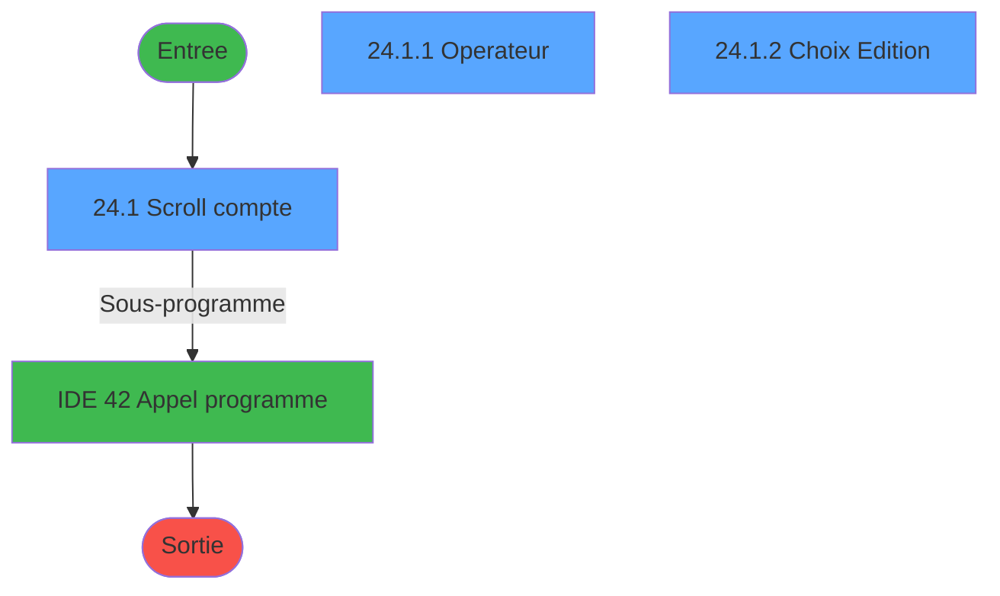
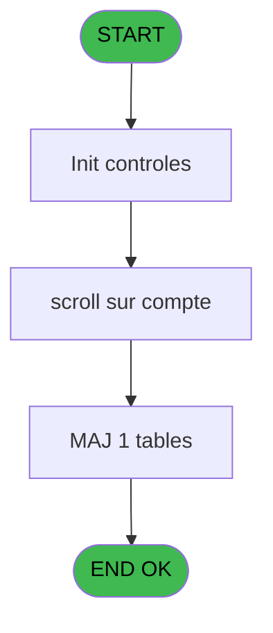
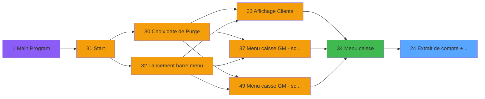
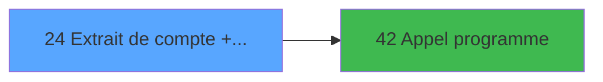

# CAP IDE 24 - Extrait de compte + ventes

> **Analyse**: Phases 1-4 2026-02-03 10:16 -> 10:17 (16s) | Assemblage 10:17
> **Pipeline**: V7.2 Enrichi
> **Structure**: 4 onglets (Resume | Ecrans | Donnees | Connexions)

<!-- TAB:Resume -->

## 1. FICHE D'IDENTITE

| Attribut | Valeur |
|----------|--------|
| Projet | CAP |
| IDE Position | 24 |
| Nom Programme | Extrait de compte + ventes |
| Fichier source | `Prg_24.xml` |
| Domaine metier | Ventes |
| Taches | 6 (3 ecrans visibles) |
| Tables modifiees | 1 |
| Programmes appeles | 1 |

## 2. DESCRIPTION FONCTIONNELLE

**Extrait de compte + ventes** assure la gestion complete de ce processus, accessible depuis [Menu caisse (IDE 34)](CAP-IDE-34.md).

Le flux de traitement s'organise en **4 blocs fonctionnels** :

- **Traitement** (2 taches) : traitements metier divers
- **Calcul** (2 taches) : calculs de montants, stocks ou compteurs
- **Impression** (1 tache) : generation de tickets et documents
- **Saisie** (1 tache) : ecrans de saisie utilisateur (formulaires, champs, donnees)

**Donnees modifiees** : 1 tables en ecriture (classification_memory).

**Logique metier** : 4 regles identifiees couvrant conditions metier, valeurs par defaut.

Detail : phases du traitement

#### Phase 1 : Saisie (1 tache)

- **24** - Extrait de compte + ventes **[[ECRAN]](#ecran-t1)**

#### Phase 2 : Calcul (2 taches)

- **24.1** - Scroll compte **[[ECRAN]](#ecran-t2)**
- **24.2** - Reaffichage infos compte

#### Phase 3 : Traitement (2 taches)

- **24.1.1** - Operateur **[[ECRAN]](#ecran-t3)**
- **24.1.3** - send mail

Delegue a : [Appel programme (IDE 42)](CAP-IDE-42.md)

#### Phase 4 : Impression (1 tache)

- **24.1.2** - Choix Edition **[[ECRAN]](#ecran-t5)**

#### Tables impactees

| Table | Operations | Role metier |
|-------|-----------|-------------|
| classification_memory | **W** (1 usages) |  |

## 3. BLOCS FONCTIONNELS

### 3.1 Saisie (1 tache)

L'operateur saisit les donnees de la transaction via 1 ecran (Extrait de compte + ventes).

---

#### 24 - Extrait de compte + ventes [[ECRAN]](#ecran-t1)

**Role** : Saisie des donnees : Extrait de compte + ventes.
**Ecran** : 640 x 128 DLU (MDI) | [Voir mockup](#ecran-t1)
**Variables liees** : G (P0 solde compte), H (P0 etat compte)

### 3.2 Calcul (2 taches)

Calculs metier : montants, stocks, compteurs.

---

#### 24.1 - Scroll compte [[ECRAN]](#ecran-t2)

**Role** : Traitement : Scroll compte.
**Ecran** : 1360 x 293 DLU (MDI) | [Voir mockup](#ecran-t2)
**Variables liees** : G (P0 solde compte), H (P0 etat compte)

---

#### 24.2 - Reaffichage infos compte

**Role** : Reinitialisation : Reaffichage infos compte.
**Variables liees** : G (P0 solde compte), H (P0 etat compte)

### 3.3 Traitement (2 taches)

Traitements internes.

---

#### 24.1.1 - Operateur [[ECRAN]](#ecran-t3)

**Role** : Configuration/parametrage : Operateur.
**Ecran** : 307 x 83 DLU (MDI) | [Voir mockup](#ecran-t3)
**Variables liees** : Q (v. operateur)
**Delegue a** : [Appel programme (IDE 42)](CAP-IDE-42.md)

---

#### 24.1.3 - send mail

**Role** : Traitement : send mail.
**Variables liees** : V (v. Envoi mail), X (v. email)
**Delegue a** : [Appel programme (IDE 42)](CAP-IDE-42.md)

### 3.4 Impression (1 tache)

Generation des documents et tickets.

---

#### 24.1.2 - Choix Edition [[ECRAN]](#ecran-t5)

**Role** : Generation du document : Choix Edition.
**Ecran** : 537 x 41 DLU | [Voir mockup](#ecran-t5)
**Variables liees** : K (W0 choix action), S (W1 Choix_action)

## 5. REGLES METIER

4 regles identifiees:

### Autres (4 regles)

#### [RM-001] Valeur par defaut si {1,5} est vide

| Element | Detail |
|---------|--------|
| **Condition** | `{1` |
| **Si vrai** | 5}='' |
| **Si faux** | '15',{1,5}) |
| **Expression source** | Expression 8 : `IF ({1,5}='','15',{1,5})` |
| **Exemple** | Si {1 → 5}=''. Sinon → '15',{1,5}) |

#### [RM-002] Si v. montant [O]>0 alors 'x' sinon '')

| Element | Detail |
|---------|--------|
| **Condition** | `v. montant [O]>0` |
| **Si vrai** | 'x' |
| **Si faux** | '') |
| **Variables** | O (v. montant) |
| **Expression source** | Expression 11 : `IF (v. montant [O]>0,'x','')` |
| **Exemple** | Si v. montant [O]>0 → 'x'. Sinon → '') |

#### [RM-003] Si v. credit debit [L]='X' alors 141 sinon IF (v. credit debit [L]='A',143,110))

| Element | Detail |
|---------|--------|
| **Condition** | `v. credit debit [L]='X'` |
| **Si vrai** | 141 |
| **Si faux** | IF (v. credit debit [L]='A',143,110)) |
| **Variables** | L (v. credit debit) |
| **Expression source** | Expression 13 : `IF (v. credit debit [L]='X',141,IF (v. credit debit [L]='A',` |
| **Exemple** | Si v. credit debit [L]='X' → 141. Sinon → IF (v. credit debit [L]='A',143,110)) |

#### [RM-004] Si Stat (0 alors 'C'MODE) sinon 'T','')

| Element | Detail |
|---------|--------|
| **Condition** | `Stat (0` |
| **Si vrai** | 'C'MODE) |
| **Si faux** | 'T','') |
| **Expression source** | Expression 17 : `IF (Stat (0,'C'MODE),'T','')` |
| **Exemple** | Si Stat (0 → 'C'MODE). Sinon → 'T','') |

## 6. CONTEXTE

- **Appele par**: [Menu caisse (IDE 34)](CAP-IDE-34.md)
- **Appelle**: 1 programmes | **Tables**: 3 (W:1 R:2 L:0) | **Taches**: 6 | **Expressions**: 34

<!-- TAB:Ecrans -->

## 8. ECRANS

### 8.1 Forms visibles (3 / 6)

| # | Position | Tache | Nom | Type | Largeur | Hauteur | Bloc |
|---|----------|-------|-----|------|---------|---------|------|
| 1 | 24.1 | 24.1 | Scroll compte | MDI | 1360 | 293 | Calcul |
| 2 | 24.1.1 | 24.1.1 | Operateur | MDI | 307 | 83 | Traitement |
| 3 | 24.1.2 | 24.1.2 | Choix Edition | Type0 | 537 | 41 | Impression |

### 8.2 Mockups Ecrans

---

#### 24.1 - Scroll compte
**Tache** : [24.1](#t2) | **Type** : MDI | **Dimensions** : 1360 x 293 DLU
**Bloc** : Calcul | **Titre IDE** : Scroll compte

<!-- FORM-DATA:
{
    "width":  1360,
    "vFactor":  8,
    "type":  "MDI",
    "hFactor":  8,
    "controls":  [
                     {
                         "x":  0,
                         "type":  "label",
                         "var":  "",
                         "y":  1,
                         "w":  1355,
                         "fmt":  "",
                         "name":  "",
                         "h":  19,
                         "color":  "",
                         "text":  "",
                         "parent":  null
                     },
                     {
                         "x":  43,
                         "type":  "label",
                         "var":  "",
                         "y":  29,
                         "w":  1266,
                         "fmt":  "",
                         "name":  "",
                         "h":  234,
                         "color":  "",
                         "text":  "",
                         "parent":  null
                     },
                     {
                         "x":  90,
                         "type":  "table",
                         "var":  "",
                         "name":  "",
                         "titleH":  12,
                         "color":  "110",
                         "w":  1166,
                         "y":  37,
                         "fmt":  "",
                         "parent":  null,
                         "text":  "",
                         "rowH":  13,
                         "h":  96,
                         "cols":  [
                                      {
                                          "title":  "Crédit/Débit",
                                          "layer":  1,
                                          "w":  105
                                      },
                                      {
                                          "title":  "Date",
                                          "layer":  2,
                                          "w":  97
                                      },
                                      {
                                          "title":  "Libellé",
                                          "layer":  3,
                                          "w":  189
                                      },
                                      {
                                          "title":  "Libellé supplémentaire",
                                          "layer":  4,
                                          "w":  188
                                      },
                                      {
                                          "title":  "Nombre d\u0027article(s)",
                                          "layer":  5,
                                          "w":  158
                                      },
                                      {
                                          "title":  "Montant",
                                          "layer":  6,
                                          "w":  209
                                      },
                                      {
                                          "title":  "Gift Pass",
                                          "layer":  7,
                                          "w":  186
                                      }
                                  ],
                         "rows":  7
                     },
                     {
                         "x":  92,
                         "type":  "label",
                         "var":  "",
                         "y":  139,
                         "w":  573,
                         "fmt":  "",
                         "name":  "",
                         "h":  119,
                         "color":  "",
                         "text":  "",
                         "parent":  null
                     },
                     {
                         "x":  875,
                         "type":  "label",
                         "var":  "",
                         "y":  136,
                         "w":  380,
                         "fmt":  "",
                         "name":  "",
                         "h":  18,
                         "color":  "",
                         "text":  "",
                         "parent":  null
                     },
                     {
                         "x":  277,
                         "type":  "label",
                         "var":  "",
                         "y":  144,
                         "w":  372,
                         "fmt":  "",
                         "name":  "",
                         "h":  95,
                         "color":  "",
                         "text":  "",
                         "parent":  null
                     },
                     {
                         "x":  279,
                         "type":  "label",
                         "var":  "",
                         "y":  145,
                         "w":  367,
                         "fmt":  "",
                         "name":  "",
                         "h":  106,
                         "color":  "",
                         "text":  "",
                         "parent":  null
                     },
                     {
                         "x":  303,
                         "type":  "label",
                         "var":  "",
                         "y":  154,
                         "w":  303,
                         "fmt":  "",
                         "name":  "",
                         "h":  81,
                         "color":  "",
                         "text":  "",
                         "parent":  null
                     },
                     {
                         "x":  306,
                         "type":  "label",
                         "var":  "",
                         "y":  155,
                         "w":  37,
                         "fmt":  "",
                         "name":  "",
                         "h":  79,
                         "color":  "",
                         "text":  "",
                         "parent":  null
                     },
                     {
                         "x":  351,
                         "type":  "label",
                         "var":  "",
                         "y":  158,
                         "w":  234,
                         "fmt":  "",
                         "name":  "",
                         "h":  8,
                         "color":  "7",
                         "text":  "Edition par imputation",
                         "parent":  null
                     },
                     {
                         "x":  351,
                         "type":  "label",
                         "var":  "",
                         "y":  170,
                         "w":  234,
                         "fmt":  "",
                         "name":  "",
                         "h":  8,
                         "color":  "7",
                         "text":  "Saisie libelle",
                         "parent":  null
                     },
                     {
                         "x":  351,
                         "type":  "label",
                         "var":  "",
                         "y":  182,
                         "w":  234,
                         "fmt":  "",
                         "name":  "",
                         "h":  8,
                         "color":  "7",
                         "text":  "Edition par date",
                         "parent":  null
                     },
                     {
                         "x":  351,
                         "type":  "label",
                         "var":  "",
                         "y":  194,
                         "w":  234,
                         "fmt":  "",
                         "name":  "",
                         "h":  8,
                         "color":  "7",
                         "text":  "Edition par nom",
                         "parent":  null
                     },
                     {
                         "x":  351,
                         "type":  "label",
                         "var":  "",
                         "y":  220,
                         "w":  234,
                         "fmt":  "",
                         "name":  "",
                         "h":  8,
                         "color":  "7",
                         "text":  "Edition cumule",
                         "parent":  null
                     },
                     {
                         "x":  342,
                         "type":  "label",
                         "var":  "",
                         "y":  239,
                         "w":  120,
                         "fmt":  "",
                         "name":  "",
                         "h":  9,
                         "color":  "",
                         "text":  "Votre choix",
                         "parent":  null
                     },
                     {
                         "x":  2,
                         "type":  "label",
                         "var":  "",
                         "y":  267,
                         "w":  1355,
                         "fmt":  "",
                         "name":  "",
                         "h":  24,
                         "color":  "",
                         "text":  "",
                         "parent":  null
                     },
                     {
                         "x":  351,
                         "type":  "label",
                         "var":  "",
                         "y":  207,
                         "w":  234,
                         "fmt":  "",
                         "name":  "",
                         "h":  8,
                         "color":  "7",
                         "text":  "Edition par service",
                         "parent":  null
                     },
                     {
                         "x":  200,
                         "type":  "edit",
                         "var":  "",
                         "y":  52,
                         "w":  92,
                         "fmt":  "##/##/####",
                         "name":  "v. date operation date",
                         "h":  8,
                         "color":  "110",
                         "text":  "",
                         "parent":  5
                     },
                     {
                         "x":  300,
                         "type":  "edit",
                         "var":  "",
                         "y":  52,
                         "w":  176,
                         "fmt":  "",
                         "name":  "",
                         "h":  8,
                         "color":  "110",
                         "text":  "",
                         "parent":  5
                     },
                     {
                         "x":  488,
                         "type":  "edit",
                         "var":  "",
                         "y":  52,
                         "w":  176,
                         "fmt":  "U15",
                         "name":  "CTE libelle supplem",
                         "h":  8,
                         "color":  "110",
                         "text":  "",
                         "parent":  5
                     },
                     {
                         "x":  128,
                         "type":  "edit",
                         "var":  "",
                         "y":  52,
                         "w":  30,
                         "fmt":  "UX",
                         "name":  "",
                         "h":  8,
                         "color":  "110",
                         "text":  "",
                         "parent":  5
                     },
                     {
                         "x":  841,
                         "type":  "edit",
                         "var":  "",
                         "y":  52,
                         "w":  176,
                         "fmt":  "15",
                         "name":  "",
                         "h":  8,
                         "color":  "110",
                         "text":  "",
                         "parent":  5
                     },
                     {
                         "x":  758,
                         "type":  "edit",
                         "var":  "",
                         "y":  52,
                         "w":  30,
                         "fmt":  "2Z",
                         "name":  "",
                         "h":  8,
                         "color":  "110",
                         "text":  "",
                         "parent":  5
                     },
                     {
                         "x":  471,
                         "type":  "edit",
                         "var":  "",
                         "y":  238,
                         "w":  26,
                         "fmt":  "",
                         "name":  "W1 Choix_action",
                         "h":  10,
                         "color":  "110",
                         "text":  "",
                         "parent":  null
                     },
                     {
                         "x":  5,
                         "type":  "edit",
                         "var":  "",
                         "y":  6,
                         "w":  267,
                         "fmt":  "20",
                         "name":  "",
                         "h":  8,
                         "color":  "",
                         "text":  "",
                         "parent":  1
                     },
                     {
                         "x":  1067,
                         "type":  "edit",
                         "var":  "",
                         "y":  6,
                         "w":  280,
                         "fmt":  "WWW DD MMM YYYYT",
                         "name":  "",
                         "h":  8,
                         "color":  "",
                         "text":  "",
                         "parent":  1
                     },
                     {
                         "x":  696,
                         "type":  "edit",
                         "var":  "",
                         "y":  52,
                         "w":  19,
                         "fmt":  "1",
                         "name":  "",
                         "h":  8,
                         "color":  "110",
                         "text":  "",
                         "parent":  5
                     },
                     {
                         "x":  879,
                         "type":  "edit",
                         "var":  "",
                         "y":  141,
                         "w":  371,
                         "fmt":  "40",
                         "name":  "",
                         "h":  11,
                         "color":  "7",
                         "text":  "",
                         "parent":  20
                     },
                     {
                         "x":  310,
                         "type":  "button",
                         "var":  "",
                         "y":  158,
                         "w":  29,
                         "fmt":  "I",
                         "name":  "I",
                         "h":  9,
                         "color":  "",
                         "text":  "",
                         "parent":  null
                     },
                     {
                         "x":  115,
                         "type":  "image",
                         "var":  "",
                         "y":  162,
                         "w":  144,
                         "fmt":  "",
                         "name":  "",
                         "h":  62,
                         "color":  "",
                         "text":  "",
                         "parent":  null
                     },
                     {
                         "x":  310,
                         "type":  "button",
                         "var":  "",
                         "y":  170,
                         "w":  29,
                         "fmt":  "L",
                         "name":  "L",
                         "h":  9,
                         "color":  "",
                         "text":  "",
                         "parent":  null
                     },
                     {
                         "x":  1014,
                         "type":  "image",
                         "var":  "",
                         "y":  170,
                         "w":  186,
                         "fmt":  "",
                         "name":  "",
                         "h":  70,
                         "color":  "",
                         "text":  "",
                         "parent":  null
                     },
                     {
                         "x":  310,
                         "type":  "button",
                         "var":  "",
                         "y":  182,
                         "w":  29,
                         "fmt":  "D",
                         "name":  "D",
                         "h":  9,
                         "color":  "",
                         "text":  "",
                         "parent":  null
                     },
                     {
                         "x":  310,
                         "type":  "button",
                         "var":  "",
                         "y":  194,
                         "w":  29,
                         "fmt":  "N",
                         "name":  "N",
                         "h":  9,
                         "color":  "",
                         "text":  "",
                         "parent":  null
                     },
                     {
                         "x":  310,
                         "type":  "button",
                         "var":  "",
                         "y":  220,
                         "w":  29,
                         "fmt":  "C",
                         "name":  "C",
                         "h":  9,
                         "color":  "",
                         "text":  "",
                         "parent":  null
                     },
                     {
                         "x":  7,
                         "type":  "button",
                         "var":  "",
                         "y":  270,
                         "w":  154,
                         "fmt":  "\u0026Quitter",
                         "name":  "",
                         "h":  18,
                         "color":  "",
                         "text":  "",
                         "parent":  null
                     },
                     {
                         "x":  1042,
                         "type":  "edit",
                         "var":  "",
                         "y":  52,
                         "w":  179,
                         "fmt":  "N10.3",
                         "name":  "arc_montant_free_extra",
                         "h":  10,
                         "color":  "110",
                         "text":  "",
                         "parent":  5
                     },
                     {
                         "x":  310,
                         "type":  "button",
                         "var":  "",
                         "y":  207,
                         "w":  29,
                         "fmt":  "S",
                         "name":  "S",
                         "h":  9,
                         "color":  "",
                         "text":  "",
                         "parent":  null
                     }
                 ],
    "taskId":  "24.1",
    "height":  293
}
-->

<strong>Champs : 12 champs</strong>

| Pos (x,y) | Nom | Variable | Type |
|-----------|-----|----------|------|
| 200,52 | v. date operation date | - | edit |
| 300,52 | (sans nom) | - | edit |
| 488,52 | CTE libelle supplem | - | edit |
| 128,52 | UX | - | edit |
| 841,52 | 15 | - | edit |
| 758,52 | 2Z | - | edit |
| 471,238 | W1 Choix_action | - | edit |
| 5,6 | 20 | - | edit |
| 1067,6 | WWW DD MMM YYYYT | - | edit |
| 696,52 | 1 | - | edit |
| 879,141 | 40 | - | edit |
| 1042,52 | arc_montant_free_extra | - | edit |

<strong>Boutons : 7 boutons</strong>

| Bouton | Pos (x,y) | Action |
|--------|-----------|--------|
| I | 310,158 | Bouton fonctionnel |
| L | 310,170 | Bouton fonctionnel |
| D | 310,182 | Bouton fonctionnel |
| N | 310,194 | Bouton fonctionnel |
| C | 310,220 | Bouton fonctionnel |
| Quitter | 7,270 | Quitte le programme |
| S | 310,207 | Bouton fonctionnel |

---

#### 24.1.1 - Operateur
**Tache** : [24.1.1](#t3) | **Type** : MDI | **Dimensions** : 307 x 83 DLU
**Bloc** : Traitement | **Titre IDE** : Operateur

<!-- FORM-DATA:
{
    "width":  307,
    "vFactor":  8,
    "type":  "MDI",
    "hFactor":  8,
    "controls":  [
                     {
                         "x":  24,
                         "type":  "label",
                         "var":  "",
                         "y":  7,
                         "w":  257,
                         "fmt":  "",
                         "name":  "",
                         "h":  43,
                         "color":  "",
                         "text":  "",
                         "parent":  null
                     },
                     {
                         "x":  26,
                         "type":  "label",
                         "var":  "",
                         "y":  8,
                         "w":  253,
                         "fmt":  "",
                         "name":  "",
                         "h":  41,
                         "color":  "",
                         "text":  "",
                         "parent":  null
                     },
                     {
                         "x":  1,
                         "type":  "label",
                         "var":  "",
                         "y":  58,
                         "w":  303,
                         "fmt":  "",
                         "name":  "",
                         "h":  23,
                         "color":  "",
                         "text":  "",
                         "parent":  null
                     },
                     {
                         "x":  10,
                         "type":  "button",
                         "var":  "",
                         "y":  62,
                         "w":  154,
                         "fmt":  "",
                         "name":  "",
                         "h":  16,
                         "color":  "",
                         "text":  "",
                         "parent":  4
                     },
                     {
                         "x":  100,
                         "type":  "edit",
                         "var":  "",
                         "y":  22,
                         "w":  104,
                         "fmt":  "",
                         "name":  "",
                         "h":  10,
                         "color":  "",
                         "text":  "",
                         "parent":  null
                     }
                 ],
    "taskId":  "24.1.1",
    "height":  83
}
-->

<strong>Champs : 1 champs</strong>

| Pos (x,y) | Nom | Variable | Type |
|-----------|-----|----------|------|
| 100,22 | (sans nom) | - | edit |

<strong>Boutons : 1 boutons</strong>

| Bouton | Pos (x,y) | Action |
|--------|-----------|--------|
| (sans nom) | 10,62 | Action declenchee |

---

#### 24.1.2 - Choix Edition
**Tache** : [24.1.2](#t5) | **Type** : Type0 | **Dimensions** : 537 x 41 DLU
**Bloc** : Impression | **Titre IDE** : Choix Edition

<!-- FORM-DATA:
{
    "width":  537,
    "vFactor":  8,
    "type":  "Type0",
    "hFactor":  8,
    "controls":  [
                     {
                         "x":  14,
                         "type":  "button",
                         "var":  "",
                         "y":  11,
                         "w":  158,
                         "fmt":  "\u0026Cancel",
                         "name":  "",
                         "h":  18,
                         "color":  "",
                         "text":  "",
                         "parent":  null
                     },
                     {
                         "x":  189,
                         "type":  "button",
                         "var":  "",
                         "y":  11,
                         "w":  158,
                         "fmt":  "\u0026Print",
                         "name":  "",
                         "h":  18,
                         "color":  "",
                         "text":  "",
                         "parent":  null
                     },
                     {
                         "x":  365,
                         "type":  "button",
                         "var":  "",
                         "y":  11,
                         "w":  158,
                         "fmt":  "P\u0026DF",
                         "name":  "",
                         "h":  18,
                         "color":  "",
                         "text":  "",
                         "parent":  null
                     }
                 ],
    "taskId":  "24.1.2",
    "height":  41
}
-->

<strong>Boutons : 3 boutons</strong>

| Bouton | Pos (x,y) | Action |
|--------|-----------|--------|
| Cancel | 14,11 | Annule et retour au menu |
| Print | 189,11 | Lance l'impression |
| PDF | 365,11 | Bouton fonctionnel |

## 9. NAVIGATION

### 9.1 Enchainement des ecrans

**Detail par enchainement :**

| Depuis | Action | Vers | Retour |
|--------|--------|------|--------|
| Scroll compte | Sous-programme | [Appel programme (IDE 42)](CAP-IDE-42.md) | Retour ecran |

### 9.3 Structure hierarchique (6 taches)

| Position | Tache | Type | Dimensions | Bloc |
|----------|-------|------|------------|------|
| **24.1** | [**Extrait de compte + ventes** (24)](#t1) [mockup](#ecran-t1) | MDI | 640x128 | Saisie |
| **24.2** | [**Scroll compte** (24.1)](#t2) [mockup](#ecran-t2) | MDI | 1360x293 | Calcul |
| 24.2.1 | [Reaffichage infos compte (24.2)](#t4) | MDI | - | |
| **24.3** | [**Operateur** (24.1.1)](#t3) [mockup](#ecran-t3) | MDI | 307x83 | Traitement |
| 24.3.1 | [send mail (24.1.3)](#t6) | - | - | |
| **24.4** | [**Choix Edition** (24.1.2)](#t5) [mockup](#ecran-t5) | - | 537x41 | Impression |

### 9.4 Algorigramme

> **Legende**: Vert = START/END OK | Rouge = END KO | Bleu = Decisions
> *Algorigramme auto-genere. Utiliser `/algorigramme` pour une synthese metier detaillee.*

<!-- TAB:Donnees -->

## 10. TABLES

### Tables utilisees (3)

| ID | Nom | Description | Type | R | W | L | Usages |
|----|-----|-------------|------|---|---|---|--------|
| 744 | pv_lieux_vente | Donnees de ventes | DB | R |   |   | 1 |
| 747 | regles_securite |  | DB | R |   |   | 1 |
| 910 | classification_memory |  | DB |   | **W** |   | 1 |

### Colonnes par table (1 / 3 tables avec colonnes identifiees)

Table 744 - pv_lieux_vente (R) - 1 usages

| Lettre | Variable | Acces | Type |
|--------|----------|-------|------|
| A | v. passage coprs | R | Logical |
| B | v. date purge | R | Unicode |
| C | v. societe | R | Unicode |
| D | v. compte gm | R | Numeric |
| E | v. date operation char | R | Unicode |
| F | v. heure operation | R | Unicode |
| G | v. filiation | R | Numeric |
| H | v. imputation | R | Numeric |
| I | v. sous imputation | R | Numeric |
| J | v. libelle | R | Unicode |
| K | v. libelle suppl | R | Unicode |
| L | v. credit debit | R | Unicode |
| M | v. flag annulation | R | Unicode |
| N | v. code_type | R | Unicode |
| O | v. montant | R | Numeric |
| P | v. nbre articles | R | Numeric |
| Q | v. operateur | R | Unicode |
| R | v. montant free extra | R | Numeric |
| S | W1 Choix_action | R | Alpha |
| T | W1 Fin_prog | R | Alpha |
| U | v.titre | R | Alpha |
| V | v. Envoi mail | R | Logical |
| W | v. PDF | R | Logical |
| X | v. email | R | Unicode |
| Y | v. nom fichier_extr_cpte | R | Unicode |
| Z | v. nom fichier_extr_vente | R | Unicode |

Table 747 - regles_securite (R) - 1 usages

*Table utilisee uniquement en Link ou aucune colonne Real identifiee dans le DataView.*

Table 910 - classification_memory (**W**) - 1 usages

*Table utilisee uniquement en Link ou aucune colonne Real identifiee dans le DataView.*

## 11. VARIABLES

### 11.1 Parametres entrants (10)

Variables recues du programme appelant ([Menu caisse (IDE 34)](CAP-IDE-34.md)).

| Lettre | Nom | Type | Usage dans |
|--------|-----|------|-----------|
| A | P0 societe | Alpha | - |
| B | P0 code_retour | Alpha | - |
| C | P0 code_adherent | Numeric | 1x parametre entrant |
| D | P0 filiation | Numeric | 1x parametre entrant |
| E | P0 masque mtt | Alpha | - |
| F | P0 nom village | Alpha | 1x parametre entrant |
| G | P0 solde compte | Numeric | - |
| H | P0 etat compte | Alpha | - |
| I | P0 date solde | Date | - |
| J | P0 garanti O/N | Alpha | - |

### 11.2 Variables de session (13)

Variables persistantes pendant toute la session.

| Lettre | Nom | Type | Usage dans |
|--------|-----|------|-----------|
| L | v. credit debit | Unicode | 1x session |
| M | v. flag annulation | Unicode | - |
| N | v. code_type | Unicode | - |
| O | v. montant | Numeric | 1x session |
| P | v. nbre articles | Numeric | - |
| Q | v. operateur | Unicode | - |
| R | v. montant free extra | Numeric | - |
| U | v.titre | Alpha | - |
| V | v. Envoi mail | Logical | - |
| W | v. PDF | Logical | - |
| X | v. email | Unicode | - |
| Y | v. nom fichier_extr_cpte | Unicode | 3x session |
| Z | v. nom fichier_extr_vente | Unicode | 3x session |

### 11.3 Variables de travail (1)

Variables internes au programme.

| Lettre | Nom | Type | Usage dans |
|--------|-----|------|-----------|
| K | W0 choix action | Alpha | - |

### 11.4 Autres (2)

Variables diverses.

| Lettre | Nom | Type | Usage dans |
|--------|-----|------|-----------|
| S | W1 Choix_action | Alpha | - |
| T | W1 Fin_prog | Alpha | - |

Toutes les 26 variables (liste complete)

| Cat | Lettre | Nom Variable | Type |
|-----|--------|--------------|------|
| P0 | **A** | P0 societe | Alpha |
| P0 | **B** | P0 code_retour | Alpha |
| P0 | **C** | P0 code_adherent | Numeric |
| P0 | **D** | P0 filiation | Numeric |
| P0 | **E** | P0 masque mtt | Alpha |
| P0 | **F** | P0 nom village | Alpha |
| P0 | **G** | P0 solde compte | Numeric |
| P0 | **H** | P0 etat compte | Alpha |
| P0 | **I** | P0 date solde | Date |
| P0 | **J** | P0 garanti O/N | Alpha |
| W0 | **K** | W0 choix action | Alpha |
| V. | **L** | v. credit debit | Unicode |
| V. | **M** | v. flag annulation | Unicode |
| V. | **N** | v. code_type | Unicode |
| V. | **O** | v. montant | Numeric |
| V. | **P** | v. nbre articles | Numeric |
| V. | **Q** | v. operateur | Unicode |
| V. | **R** | v. montant free extra | Numeric |
| V. | **U** | v.titre | Alpha |
| V. | **V** | v. Envoi mail | Logical |
| V. | **W** | v. PDF | Logical |
| V. | **X** | v. email | Unicode |
| V. | **Y** | v. nom fichier_extr_cpte | Unicode |
| V. | **Z** | v. nom fichier_extr_vente | Unicode |
| Autre | **S** | W1 Choix_action | Alpha |
| Autre | **T** | W1 Fin_prog | Alpha |

## 12. EXPRESSIONS

**34 / 34 expressions decodees (100%)**

### 12.1 Repartition par type

| Type | Expressions | Regles |
|------|-------------|--------|
| CONDITION | 9 | 4 |
| CONSTANTE | 2 | 0 |
| DATE | 2 | 0 |
| FORMAT | 2 | 0 |
| REFERENCE_VG | 2 | 0 |
| OTHER | 8 | 0 |
| CAST_LOGIQUE | 3 | 0 |
| STRING | 3 | 0 |
| CONCATENATION | 3 | 0 |

### 12.2 Expressions cles par type

#### CONDITION (9 expressions)

| Type | IDE | Expression | Regle |
|------|-----|------------|-------|
| CONDITION | 13 | `IF (v. credit debit [L]='X',141,IF (v. credit debit [L]='A',143,110))` | [RM-003](#rm-RM-003) |
| CONDITION | 17 | `IF (Stat (0,'C'MODE),'T','')` | [RM-004](#rm-RM-004) |
| CONDITION | 8 | `IF ({1,5}='','15',{1,5})` | [RM-001](#rm-RM-001) |
| CONDITION | 11 | `IF (v. montant [O]>0,'x','')` | [RM-002](#rm-RM-002) |
| CONDITION | 21 | `[BK] <> 0` | - |
| ... | | *+4 autres* | |

#### CONSTANTE (2 expressions)

| Type | IDE | Expression | Regle |
|------|-----|------------|-------|
| CONSTANTE | 12 | `'F'` | - |
| CONSTANTE | 10 | `''` | - |

#### DATE (2 expressions)

| Type | IDE | Expression | Regle |
|------|-----|------------|-------|
| DATE | 26 | `DVal(P0 filiation [D],'YYYYMMDD')` | - |
| DATE | 3 | `Date ()` | - |

#### FORMAT (2 expressions)

| Type | IDE | Expression | Regle |
|------|-----|------------|-------|
| FORMAT | 25 | `InStr('NDS',Trim([AA]))>0` | - |
| FORMAT | 23 | `DStr(VG1,'YYYYMMDD')` | - |

#### REFERENCE_VG (2 expressions)

| Type | IDE | Expression | Regle |
|------|-----|------------|-------|
| REFERENCE_VG | 4 | `VG3` | - |
| REFERENCE_VG | 1 | `VG1` | - |

#### OTHER (8 expressions)

| Type | IDE | Expression | Regle |
|------|-----|------------|-------|
| OTHER | 24 | `MlsTrans('Historique des transactions')` | - |
| OTHER | 19 | `Stat (0,'C'MODE)` | - |
| OTHER | 29 | `Translate('%club_exportdata%')&'Pdf\'` | - |
| OTHER | 28 | `[BM] OR [BU]` | - |
| OTHER | 6 | `{1,3}` | - |
| ... | | *+3 autres* | |

#### CAST_LOGIQUE (3 expressions)

| Type | IDE | Expression | Regle |
|------|-----|------------|-------|
| CAST_LOGIQUE | 34 | `'FALSE'LOG` | - |
| CAST_LOGIQUE | 22 | `'FALSE'LOG` | - |
| CAST_LOGIQUE | 18 | `'TRUE'LOG` | - |

#### STRING (3 expressions)

| Type | IDE | Expression | Regle |
|------|-----|------------|-------|
| STRING | 31 | `Trim([BW])` | - |
| STRING | 30 | `Trim([BT])` | - |
| STRING | 2 | `Trim ([AC])` | - |

#### CONCATENATION (3 expressions)

| Type | IDE | Expression | Regle |
|------|-----|------------|-------|
| CONCATENATION | 33 | `'HISTO_VENTE_'&Trim(v. nom fichier_extr_cpte [Y])&'_'&Trim(v. nom fichier_extr_vente [Z])&'.pdf'` | - |
| CONCATENATION | 32 | `'EXTRAIT_CPTE_'&Trim(v. nom fichier_extr_cpte [Y])&'_'&Trim(v. nom fichier_extr_vente [Z])&'.pdf'` | - |
| CONCATENATION | 20 | `Trim (v. nom fichier_extr_cpte [Y])&' '&Trim (v. nom fichier_extr_vente [Z])` | - |

### 12.3 Toutes les expressions (34)

Voir les 34 expressions

#### CONDITION (9)

| IDE | Expression Decodee |
|-----|-------------------|
| 8 | `IF ({1,5}='','15',{1,5})` |
| 11 | `IF (v. montant [O]>0,'x','')` |
| 13 | `IF (v. credit debit [L]='X',141,IF (v. credit debit [L]='A',143,110))` |
| 17 | `IF (Stat (0,'C'MODE),'T','')` |
| 14 | `[AA]='N'` |
| 15 | `[AA]='D'` |
| 16 | `[AA]='S'` |
| 21 | `[BK] <> 0` |
| 27 | `[BM] AND Trim([BP])<>''` |

#### CONSTANTE (2)

| IDE | Expression Decodee |
|-----|-------------------|
| 10 | `''` |
| 12 | `'F'` |

#### DATE (2)

| IDE | Expression Decodee |
|-----|-------------------|
| 3 | `Date ()` |
| 26 | `DVal(P0 filiation [D],'YYYYMMDD')` |

#### FORMAT (2)

| IDE | Expression Decodee |
|-----|-------------------|
| 23 | `DStr(VG1,'YYYYMMDD')` |
| 25 | `InStr('NDS',Trim([AA]))>0` |

#### REFERENCE_VG (2)

| IDE | Expression Decodee |
|-----|-------------------|
| 1 | `VG1` |
| 4 | `VG3` |

#### OTHER (8)

| IDE | Expression Decodee |
|-----|-------------------|
| 5 | `{1,1}` |
| 6 | `{1,3}` |
| 7 | `P0 code_adherent [C]` |
| 9 | `P0 nom village [F]` |
| 19 | `Stat (0,'C'MODE)` |
| 24 | `MlsTrans('Historique des transactions')` |
| 28 | `[BM] OR [BU]` |
| 29 | `Translate('%club_exportdata%')&'Pdf\'` |

#### CAST_LOGIQUE (3)

| IDE | Expression Decodee |
|-----|-------------------|
| 18 | `'TRUE'LOG` |
| 22 | `'FALSE'LOG` |
| 34 | `'FALSE'LOG` |

#### STRING (3)

| IDE | Expression Decodee |
|-----|-------------------|
| 2 | `Trim ([AC])` |
| 30 | `Trim([BT])` |
| 31 | `Trim([BW])` |

#### CONCATENATION (3)

| IDE | Expression Decodee |
|-----|-------------------|
| 20 | `Trim (v. nom fichier_extr_cpte [Y])&' '&Trim (v. nom fichier_extr_vente [Z])` |
| 32 | `'EXTRAIT_CPTE_'&Trim(v. nom fichier_extr_cpte [Y])&'_'&Trim(v. nom fichier_extr_vente [Z])&'.pdf'` |
| 33 | `'HISTO_VENTE_'&Trim(v. nom fichier_extr_cpte [Y])&'_'&Trim(v. nom fichier_extr_vente [Z])&'.pdf'` |

<!-- TAB:Connexions -->

## 13. GRAPHE D'APPELS

### 13.1 Chaine depuis Main (Callers)

Main -> ... -> [Menu caisse (IDE 34)](CAP-IDE-34.md) -> **Extrait de compte + ventes (IDE 24)**

### 13.2 Callers

| IDE | Nom Programme | Nb Appels |
|-----|---------------|-----------|
| [34](CAP-IDE-34.md) | Menu caisse | 1 |

### 13.3 Callees (programmes appeles)

### 13.4 Detail Callees avec contexte

| IDE | Nom Programme | Appels | Contexte |
|-----|---------------|--------|----------|
| [42](CAP-IDE-42.md) | Appel programme | 1 | Sous-programme |

## 14. RECOMMANDATIONS MIGRATION

### 14.1 Profil du programme

| Metrique | Valeur | Impact migration |
|----------|--------|-----------------|
| Lignes de logique | 122 | Programme compact |
| Expressions | 34 | Peu de logique |
| Tables WRITE | 1 | Impact faible |
| Sous-programmes | 1 | Peu de dependances |
| Ecrans visibles | 3 | Quelques ecrans |
| Code desactive | 0% (0 / 122) | Code sain |
| Regles metier | 4 | Quelques regles a preserver |

### 14.2 Plan de migration par bloc

#### Saisie (1 tache: 1 ecran, 0 traitement)

- **Strategie** : Formulaire React/Blazor avec validation Zod/FluentValidation.
- Reproduire 1 ecran : Extrait de compte + ventes
- Validation temps reel cote client + serveur

#### Calcul (2 taches: 1 ecran, 1 traitement)

- **Strategie** : Services de calcul purs (Domain Services).
- Migrer la logique de calcul (stock, compteurs, montants)

#### Traitement (2 taches: 1 ecran, 1 traitement)

- **Strategie** : Orchestrateur avec 1 ecrans (Razor/React) et 1 traitements backend (services).
- Les ecrans deviennent des composants UI, les traitements invisibles deviennent des services injectables.
- 1 sous-programme(s) a migrer ou a reutiliser depuis les services existants.
- Decomposer les taches en services unitaires testables.

#### Impression (1 tache: 1 ecran, 0 traitement)

- **Strategie** : Templates HTML -> PDF via wkhtmltopdf ou Puppeteer.
- `PrintService` injectable avec choix imprimante

### 14.3 Dependances critiques

| Dependance | Type | Appels | Impact |
|------------|------|--------|--------|
| classification_memory | Table WRITE (Database) | 1x | Schema + repository |
| [Appel programme (IDE 42)](CAP-IDE-42.md) | Sous-programme | 1x | Normale - Sous-programme |

---
*Spec DETAILED generee par Pipeline V7.2 - 2026-02-03 10:17*
