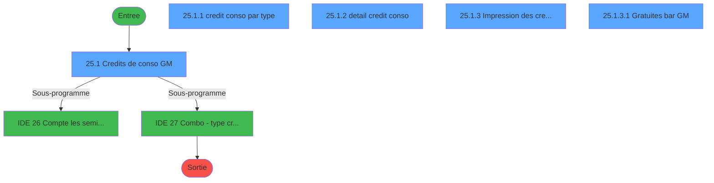
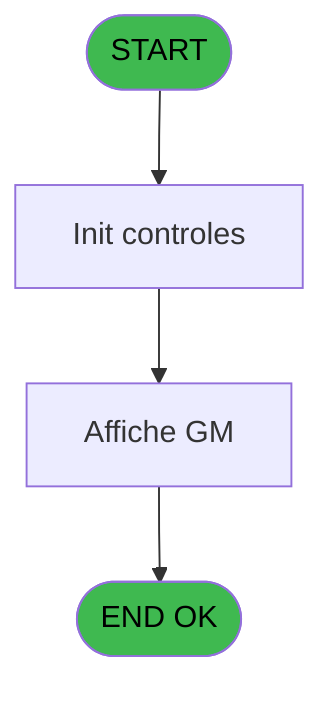
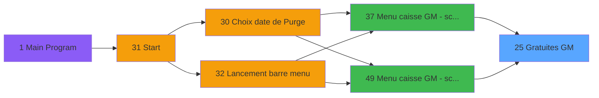
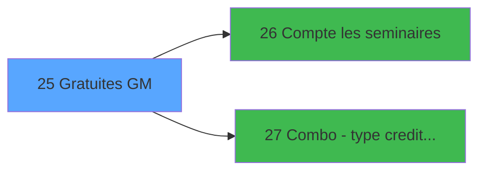

# CAP IDE 25 - Gratuites GM

> **Analyse**: Phases 1-4 2026-02-03 10:17 -> 10:17 (19s) | Assemblage 10:17
> **Pipeline**: V7.2 Enrichi
> **Structure**: 4 onglets (Resume | Ecrans | Donnees | Connexions)

<!-- TAB:Resume -->

## 1. FICHE D'IDENTITE

| Attribut | Valeur |
|----------|--------|
| Projet | CAP |
| IDE Position | 25 |
| Nom Programme | Gratuites GM |
| Fichier source | `Prg_25.xml` |
| Domaine metier | General |
| Taches | 8 (5 ecrans visibles) |
| Tables modifiees | 0 |
| Programmes appeles | 2 |

## 2. DESCRIPTION FONCTIONNELLE

**Gratuites GM** assure la gestion complete de ce processus, accessible depuis [Menu caisse GM - scroll (IDE 37)](CAP-IDE-37.md), [Menu caisse GM - scroll @ (IDE 49)](CAP-IDE-49.md).

Le flux de traitement s'organise en **1 blocs fonctionnels** :

- **Traitement** (8 taches) : traitements metier divers

Detail : phases du traitement

#### Phase 1 : Traitement (8 taches)

- **25** - Gratuites GM
- **25.1** - Credits de conso GM **[[ECRAN]](#ecran-t2)**
- **25.1.1** - credit conso par type **[[ECRAN]](#ecran-t3)**
- **25.1.2** - detail credit conso **[[ECRAN]](#ecran-t4)**
- **25.1.3** - Impression des credit de conso **[[ECRAN]](#ecran-t17)**
- **25.1.3.1** - Gratuites bar GM **[[ECRAN]](#ecran-t18)**
- **25.1.3.1.1** - Browse - CC detail
- **25.1.3.1.2** - Browse - CC par type

Delegue a : [Combo - type credit conso (IDE 27)](CAP-IDE-27.md)

## 3. BLOCS FONCTIONNELS

### 3.1 Traitement (8 taches)

Traitements internes.

---

#### 25 - Gratuites GM

**Role** : Tache d'orchestration : point d'entree du programme (8 sous-taches). Coordonne l'enchainement des traitements.

7 sous-taches directes

| Tache | Nom | Bloc |
|-------|-----|------|
| [25.1](#t2) | Credits de conso GM **[[ECRAN]](#ecran-t2)** | Traitement |
| [25.1.1](#t3) | credit conso par type **[[ECRAN]](#ecran-t3)** | Traitement |
| [25.1.2](#t4) | detail credit conso **[[ECRAN]](#ecran-t4)** | Traitement |
| [25.1.3](#t17) | Impression des credit de conso **[[ECRAN]](#ecran-t17)** | Traitement |
| [25.1.3.1](#t18) | Gratuites bar GM **[[ECRAN]](#ecran-t18)** | Traitement |
| [25.1.3.1.1](#t19) | Browse - CC detail | Traitement |
| [25.1.3.1.2](#t20) | Browse - CC par type | Traitement |

**Delegue a** : [Combo - type credit conso (IDE 27)](CAP-IDE-27.md)

---

#### 25.1 - Credits de conso GM [[ECRAN]](#ecran-t2)

**Role** : Calcul fidelite/avantage : Credits de conso GM.
**Ecran** : 1266 x 318 DLU (MDI) | [Voir mockup](#ecran-t2)
**Delegue a** : [Combo - type credit conso (IDE 27)](CAP-IDE-27.md)

---

#### 25.1.1 - credit conso par type [[ECRAN]](#ecran-t3)

**Role** : Calcul fidelite/avantage : credit conso par type.
**Ecran** : 269 x 65 DLU (Modal) | [Voir mockup](#ecran-t3)
**Variables liees** : K (v.type CS), P (v.List combo type CS)
**Delegue a** : [Combo - type credit conso (IDE 27)](CAP-IDE-27.md)

---

#### 25.1.2 - detail credit conso [[ECRAN]](#ecran-t4)

**Role** : Calcul fidelite/avantage : detail credit conso.
**Ecran** : 325 x 67 DLU (Modal) | [Voir mockup](#ecran-t4)
**Delegue a** : [Combo - type credit conso (IDE 27)](CAP-IDE-27.md)

---

#### 25.1.3 - Impression des credit de conso [[ECRAN]](#ecran-t17)

**Role** : Generation du document : Impression des credit de conso.
**Ecran** : 640 x 118 DLU (MDI) | [Voir mockup](#ecran-t17)
**Delegue a** : [Combo - type credit conso (IDE 27)](CAP-IDE-27.md)

---

#### 25.1.3.1 - Gratuites bar GM [[ECRAN]](#ecran-t18)

**Role** : Traitement : Gratuites bar GM.
**Ecran** : 427 x 59 DLU (MDI) | [Voir mockup](#ecran-t18)
**Delegue a** : [Combo - type credit conso (IDE 27)](CAP-IDE-27.md)

---

#### 25.1.3.1.1 - Browse - CC detail

**Role** : Traitement : Browse - CC detail.
**Delegue a** : [Combo - type credit conso (IDE 27)](CAP-IDE-27.md)

---

#### 25.1.3.1.2 - Browse - CC par type

**Role** : Traitement : Browse - CC par type.
**Variables liees** : K (v.type CS), P (v.List combo type CS)
**Delegue a** : [Combo - type credit conso (IDE 27)](CAP-IDE-27.md)

## 5. REGLES METIER

*(Aucune regle metier identifiee)*

## 6. CONTEXTE

- **Appele par**: [Menu caisse GM - scroll (IDE 37)](CAP-IDE-37.md), [Menu caisse GM - scroll @ (IDE 49)](CAP-IDE-49.md)
- **Appelle**: 2 programmes | **Tables**: 5 (W:0 R:4 L:3) | **Taches**: 8 | **Expressions**: 12

<!-- TAB:Ecrans -->

## 8. ECRANS

### 8.1 Forms visibles (5 / 8)

| # | Position | Tache | Nom | Type | Largeur | Hauteur | Bloc |
|---|----------|-------|-----|------|---------|---------|------|
| 1 | 25.1 | 25.1 | Credits de conso GM | MDI | 1266 | 318 | Traitement |
| 2 | 25.1.2 | 25.1.1 | credit conso par type | Modal | 269 | 65 | Traitement |
| 3 | 25.1.3 | 25.1.2 | detail credit conso | Modal | 325 | 67 | Traitement |
| 4 | 25.1.1 | 25.1.3 | Impression des credit de conso | MDI | 640 | 118 | Traitement |
| 5 | 25.1.1.1 | 25.1.3.1 | Gratuites bar GM | MDI | 427 | 59 | Traitement |

### 8.2 Mockups Ecrans

---

#### 25.1 - Credits de conso GM
**Tache** : [25.1](#t2) | **Type** : MDI | **Dimensions** : 1266 x 318 DLU
**Bloc** : Traitement | **Titre IDE** : Credits de conso GM

<!-- FORM-DATA:
{
    "width":  1266,
    "vFactor":  8,
    "type":  "MDI",
    "hFactor":  8,
    "controls":  [
                     {
                         "x":  0,
                         "type":  "label",
                         "var":  "",
                         "y":  1,
                         "w":  1261,
                         "fmt":  "",
                         "name":  "",
                         "h":  18,
                         "color":  "",
                         "text":  "",
                         "parent":  null
                     },
                     {
                         "x":  43,
                         "type":  "table",
                         "var":  "",
                         "name":  "",
                         "titleH":  15,
                         "color":  "110",
                         "w":  1212,
                         "y":  25,
                         "fmt":  "",
                         "parent":  null,
                         "text":  "",
                         "rowH":  15,
                         "h":  115,
                         "cols":  [
                                      {
                                          "title":  "Nom",
                                          "layer":  1,
                                          "w":  215
                                      },
                                      {
                                          "title":  "Prénom",
                                          "layer":  2,
                                          "w":  159
                                      },
                                      {
                                          "title":  "Séminaire",
                                          "layer":  3,
                                          "w":  266
                                      },
                                      {
                                          "title":  "Date début",
                                          "layer":  4,
                                          "w":  131
                                      },
                                      {
                                          "title":  "Date fin",
                                          "layer":  5,
                                          "w":  173
                                      },
                                      {
                                          "title":  "Crédit de conso",
                                          "layer":  6,
                                          "w":  210
                                      }
                                  ],
                         "rows":  6
                     },
                     {
                         "x":  41,
                         "type":  "label",
                         "var":  "",
                         "y":  145,
                         "w":  328,
                         "fmt":  "",
                         "name":  "",
                         "h":  57,
                         "color":  "",
                         "text":  "Filtre",
                         "parent":  null
                     },
                     {
                         "x":  842,
                         "type":  "label",
                         "var":  "",
                         "y":  145,
                         "w":  383,
                         "fmt":  "",
                         "name":  "",
                         "h":  35,
                         "color":  "",
                         "text":  "Impression",
                         "parent":  null
                     },
                     {
                         "x":  124,
                         "type":  "label",
                         "var":  "",
                         "y":  153,
                         "w":  154,
                         "fmt":  "",
                         "name":  "",
                         "h":  8,
                         "color":  "",
                         "text":  "Seminaire",
                         "parent":  19
                     },
                     {
                         "x":  76,
                         "type":  "label",
                         "var":  "",
                         "y":  210,
                         "w":  462,
                         "fmt":  "",
                         "name":  "",
                         "h":  12,
                         "color":  "142",
                         "text":  "Position par type de credit",
                         "parent":  null
                     },
                     {
                         "x":  568,
                         "type":  "label",
                         "var":  "",
                         "y":  210,
                         "w":  624,
                         "fmt":  "",
                         "name":  "",
                         "h":  12,
                         "color":  "142",
                         "text":  "Historique des credits effectues",
                         "parent":  null
                     },
                     {
                         "x":  0,
                         "type":  "label",
                         "var":  "",
                         "y":  293,
                         "w":  1261,
                         "fmt":  "",
                         "name":  "",
                         "h":  21,
                         "color":  "",
                         "text":  "",
                         "parent":  null
                     },
                     {
                         "x":  51,
                         "type":  "edit",
                         "var":  "",
                         "y":  42,
                         "w":  200,
                         "fmt":  "",
                         "name":  "",
                         "h":  11,
                         "color":  "6",
                         "text":  "",
                         "parent":  4
                     },
                     {
                         "x":  267,
                         "type":  "edit",
                         "var":  "",
                         "y":  42,
                         "w":  122,
                         "fmt":  "",
                         "name":  "",
                         "h":  11,
                         "color":  "6",
                         "text":  "",
                         "parent":  4
                     },
                     {
                         "x":  430,
                         "type":  "edit",
                         "var":  "",
                         "y":  42,
                         "w":  252,
                         "fmt":  "",
                         "name":  "",
                         "h":  11,
                         "color":  "6",
                         "text":  "",
                         "parent":  4
                     },
                     {
                         "x":  696,
                         "type":  "edit",
                         "var":  "",
                         "y":  42,
                         "w":  120,
                         "fmt":  "",
                         "name":  "",
                         "h":  11,
                         "color":  "6",
                         "text":  "",
                         "parent":  4
                     },
                     {
                         "x":  826,
                         "type":  "edit",
                         "var":  "",
                         "y":  42,
                         "w":  120,
                         "fmt":  "",
                         "name":  "",
                         "h":  11,
                         "color":  "6",
                         "text":  "",
                         "parent":  4
                     },
                     {
                         "x":  994,
                         "type":  "edit",
                         "var":  "",
                         "y":  42,
                         "w":  194,
                         "fmt":  "",
                         "name":  "",
                         "h":  11,
                         "color":  "6",
                         "text":  "",
                         "parent":  4
                     },
                     {
                         "x":  66,
                         "type":  "edit",
                         "var":  "",
                         "y":  163,
                         "w":  157,
                         "fmt":  "",
                         "name":  "v.Seminaire",
                         "h":  14,
                         "color":  "110",
                         "text":  "",
                         "parent":  19
                     },
                     {
                         "x":  229,
                         "type":  "edit",
                         "var":  "",
                         "y":  163,
                         "w":  130,
                         "fmt":  "",
                         "name":  "v.date seminaire",
                         "h":  14,
                         "color":  "110",
                         "text":  "",
                         "parent":  19
                     },
                     {
                         "x":  66,
                         "type":  "combobox",
                         "var":  "",
                         "y":  181,
                         "w":  159,
                         "fmt":  "",
                         "name":  "v.combo type CS",
                         "h":  12,
                         "color":  "110",
                         "text":  "list CS",
                         "parent":  null
                     },
                     {
                         "x":  14,
                         "type":  "edit",
                         "var":  "",
                         "y":  5,
                         "w":  396,
                         "fmt":  "30",
                         "name":  "",
                         "h":  11,
                         "color":  "",
                         "text":  "",
                         "parent":  null
                     },
                     {
                         "x":  950,
                         "type":  "edit",
                         "var":  "",
                         "y":  5,
                         "w":  298,
                         "fmt":  "WWW DD MMM YYYYT",
                         "name":  "",
                         "h":  11,
                         "color":  "",
                         "text":  "",
                         "parent":  null
                     },
                     {
                         "x":  952,
                         "type":  "button",
                         "var":  "",
                         "y":  157,
                         "w":  129,
                         "fmt":  "Individuel",
                         "name":  "HI",
                         "h":  18,
                         "color":  "",
                         "text":  "",
                         "parent":  null
                     },
                     {
                         "x":  1089,
                         "type":  "button",
                         "var":  "",
                         "y":  157,
                         "w":  129,
                         "fmt":  "Groupe",
                         "name":  "HG",
                         "h":  18,
                         "color":  "",
                         "text":  "",
                         "parent":  null
                     },
                     {
                         "x":  229,
                         "type":  "button",
                         "var":  "",
                         "y":  181,
                         "w":  130,
                         "fmt":  "Rafraichir",
                         "name":  "J",
                         "h":  18,
                         "color":  "",
                         "text":  "",
                         "parent":  null
                     },
                     {
                         "x":  1088,
                         "type":  "button",
                         "var":  "",
                         "y":  295,
                         "w":  168,
                         "fmt":  "Quitter",
                         "name":  "",
                         "h":  18,
                         "color":  "",
                         "text":  "",
                         "parent":  null
                     },
                     {
                         "x":  0,
                         "type":  "subform",
                         "var":  "",
                         "y":  222,
                         "w":  608,
                         "fmt":  "",
                         "name":  "CONSTYPE",
                         "h":  70,
                         "color":  "",
                         "text":  "",
                         "parent":  null
                     },
                     {
                         "x":  611,
                         "type":  "subform",
                         "var":  "",
                         "y":  222,
                         "w":  648,
                         "fmt":  "",
                         "name":  "CREDCONSO",
                         "h":  71,
                         "color":  "",
                         "text":  "",
                         "parent":  null
                     }
                 ],
    "taskId":  "25.1",
    "height":  318
}
-->

<strong>Champs : 11 champs</strong>

| Pos (x,y) | Nom | Variable | Type |
|-----------|-----|----------|------|
| 51,42 | (sans nom) | - | edit |
| 267,42 | (sans nom) | - | edit |
| 430,42 | (sans nom) | - | edit |
| 696,42 | (sans nom) | - | edit |
| 826,42 | (sans nom) | - | edit |
| 994,42 | (sans nom) | - | edit |
| 66,163 | v.Seminaire | - | edit |
| 229,163 | v.date seminaire | - | edit |
| 66,181 | v.combo type CS | - | combobox |
| 14,5 | 30 | - | edit |
| 950,5 | WWW DD MMM YYYYT | - | edit |

<strong>Boutons : 4 boutons</strong>

| Bouton | Pos (x,y) | Action |
|--------|-----------|--------|
| Individuel | 952,157 | Bouton fonctionnel |
| Groupe | 1089,157 | Bouton fonctionnel |
| Rafraichir | 229,181 | Bouton fonctionnel |
| Quitter | 1088,295 | Quitte le programme |

---

#### 25.1.2 - credit conso par type
**Tache** : [25.1.1](#t3) | **Type** : Modal | **Dimensions** : 269 x 65 DLU
**Bloc** : Traitement | **Titre IDE** : credit conso par type

<!-- FORM-DATA:
{
    "width":  269,
    "vFactor":  8,
    "type":  "Modal",
    "hFactor":  4,
    "controls":  [
                     {
                         "x":  4,
                         "type":  "table",
                         "var":  "",
                         "name":  "",
                         "titleH":  16,
                         "color":  "110",
                         "w":  257,
                         "y":  4,
                         "fmt":  "",
                         "parent":  null,
                         "text":  "",
                         "rowH":  12,
                         "h":  53,
                         "cols":  [
                                      {
                                          "title":  "Type de crédit",
                                          "layer":  1,
                                          "w":  125
                                      },
                                      {
                                          "title":  "Solde",
                                          "layer":  2,
                                          "w":  113
                                      }
                                  ],
                         "rows":  2
                     },
                     {
                         "x":  133,
                         "type":  "edit",
                         "var":  "",
                         "y":  22,
                         "w":  87,
                         "fmt":  "",
                         "name":  "",
                         "h":  10,
                         "color":  "110",
                         "text":  "",
                         "parent":  1
                     },
                     {
                         "x":  9,
                         "type":  "edit",
                         "var":  "",
                         "y":  22,
                         "w":  115,
                         "fmt":  "",
                         "name":  "",
                         "h":  10,
                         "color":  "110",
                         "text":  "",
                         "parent":  1
                     }
                 ],
    "taskId":  "25.1.2",
    "height":  65
}
-->

<strong>Champs : 2 champs</strong>

| Pos (x,y) | Nom | Variable | Type |
|-----------|-----|----------|------|
| 133,22 | (sans nom) | - | edit |
| 9,22 | (sans nom) | - | edit |

---

#### 25.1.3 - detail credit conso
**Tache** : [25.1.2](#t4) | **Type** : Modal | **Dimensions** : 325 x 67 DLU
**Bloc** : Traitement | **Titre IDE** : detail credit conso

<!-- FORM-DATA:
{
    "width":  325,
    "vFactor":  8,
    "type":  "Modal",
    "hFactor":  4,
    "controls":  [
                     {
                         "x":  4,
                         "type":  "table",
                         "var":  "",
                         "name":  "",
                         "titleH":  16,
                         "color":  "110",
                         "w":  320,
                         "y":  4,
                         "fmt":  "",
                         "parent":  null,
                         "text":  "",
                         "rowH":  13,
                         "h":  53,
                         "cols":  [
                                      {
                                          "title":  "Montant",
                                          "layer":  1,
                                          "w":  69
                                      },
                                      {
                                          "title":  "Type de crédit",
                                          "layer":  2,
                                          "w":  100
                                      },
                                      {
                                          "title":  "Date",
                                          "layer":  3,
                                          "w":  63
                                      },
                                      {
                                          "title":  "Utilisateur",
                                          "layer":  4,
                                          "w":  70
                                      }
                                  ],
                         "rows":  4
                     },
                     {
                         "x":  5,
                         "type":  "label",
                         "var":  "",
                         "y":  2,
                         "w":  314,
                         "fmt":  "",
                         "name":  "",
                         "h":  15,
                         "color":  "5",
                         "text":  "",
                         "parent":  null
                     },
                     {
                         "x":  8,
                         "type":  "edit",
                         "var":  "",
                         "y":  22,
                         "w":  61,
                         "fmt":  "",
                         "name":  "",
                         "h":  11,
                         "color":  "110",
                         "text":  "",
                         "parent":  1
                     },
                     {
                         "x":  177,
                         "type":  "edit",
                         "var":  "",
                         "y":  22,
                         "w":  56,
                         "fmt":  "",
                         "name":  "",
                         "h":  11,
                         "color":  "110",
                         "text":  "",
                         "parent":  1
                     },
                     {
                         "x":  239,
                         "type":  "edit",
                         "var":  "",
                         "y":  22,
                         "w":  63,
                         "fmt":  "",
                         "name":  "",
                         "h":  11,
                         "color":  "110",
                         "text":  "",
                         "parent":  1
                     },
                     {
                         "x":  77,
                         "type":  "edit",
                         "var":  "",
                         "y":  22,
                         "w":  94,
                         "fmt":  "",
                         "name":  "",
                         "h":  11,
                         "color":  "110",
                         "text":  "",
                         "parent":  1
                     }
                 ],
    "taskId":  "25.1.3",
    "height":  67
}
-->

<strong>Champs : 4 champs</strong>

| Pos (x,y) | Nom | Variable | Type |
|-----------|-----|----------|------|
| 8,22 | (sans nom) | - | edit |
| 177,22 | (sans nom) | - | edit |
| 239,22 | (sans nom) | - | edit |
| 77,22 | (sans nom) | - | edit |

---

#### 25.1.1 - Impression des credit de conso
**Tache** : [25.1.3](#t17) | **Type** : MDI | **Dimensions** : 640 x 118 DLU
**Bloc** : Traitement | **Titre IDE** : Impression des credit de conso

<!-- FORM-DATA:
{
    "width":  640,
    "vFactor":  8,
    "type":  "MDI",
    "hFactor":  8,
    "controls":  [
                     {
                         "x":  31,
                         "type":  "label",
                         "var":  "",
                         "y":  14,
                         "w":  578,
                         "fmt":  "",
                         "name":  "",
                         "h":  55,
                         "color":  "",
                         "text":  "",
                         "parent":  null
                     },
                     {
                         "x":  219,
                         "type":  "label",
                         "var":  "",
                         "y":  18,
                         "w":  353,
                         "fmt":  "",
                         "name":  "",
                         "h":  8,
                         "color":  "",
                         "text":  "Credit de conso deposes",
                         "parent":  null
                     },
                     {
                         "x":  299,
                         "type":  "label",
                         "var":  "",
                         "y":  37,
                         "w":  80,
                         "fmt":  "",
                         "name":  "",
                         "h":  8,
                         "color":  "",
                         "text":  "Du",
                         "parent":  null
                     },
                     {
                         "x":  299,
                         "type":  "label",
                         "var":  "",
                         "y":  53,
                         "w":  80,
                         "fmt":  "",
                         "name":  "",
                         "h":  8,
                         "color":  "",
                         "text":  "Au",
                         "parent":  null
                     },
                     {
                         "x":  0,
                         "type":  "label",
                         "var":  "",
                         "y":  93,
                         "w":  636,
                         "fmt":  "",
                         "name":  "",
                         "h":  23,
                         "color":  "",
                         "text":  "",
                         "parent":  null
                     },
                     {
                         "x":  405,
                         "type":  "edit",
                         "var":  "",
                         "y":  37,
                         "w":  126,
                         "fmt":  "",
                         "name":  "Date debut",
                         "h":  10,
                         "color":  "110",
                         "text":  "",
                         "parent":  null
                     },
                     {
                         "x":  405,
                         "type":  "edit",
                         "var":  "",
                         "y":  53,
                         "w":  126,
                         "fmt":  "",
                         "name":  "Date fin",
                         "h":  10,
                         "color":  "110",
                         "text":  "",
                         "parent":  null
                     },
                     {
                         "x":  314,
                         "type":  "button",
                         "var":  "",
                         "y":  96,
                         "w":  154,
                         "fmt":  "\u0026Valider",
                         "name":  "",
                         "h":  18,
                         "color":  "",
                         "text":  "",
                         "parent":  null
                     },
                     {
                         "x":  475,
                         "type":  "button",
                         "var":  "",
                         "y":  96,
                         "w":  154,
                         "fmt":  "\u0026Quitter",
                         "name":  "",
                         "h":  18,
                         "color":  "",
                         "text":  "",
                         "parent":  null
                     },
                     {
                         "x":  32,
                         "type":  "image",
                         "var":  "",
                         "y":  15,
                         "w":  157,
                         "fmt":  "",
                         "name":  "",
                         "h":  53,
                         "color":  "",
                         "text":  "",
                         "parent":  null
                     }
                 ],
    "taskId":  "25.1.1",
    "height":  118
}
-->

<strong>Champs : 2 champs</strong>

| Pos (x,y) | Nom | Variable | Type |
|-----------|-----|----------|------|
| 405,37 | Date debut | - | edit |
| 405,53 | Date fin | - | edit |

<strong>Boutons : 2 boutons</strong>

| Bouton | Pos (x,y) | Action |
|--------|-----------|--------|
| Valider | 314,96 | Valide la saisie et enregistre |
| Quitter | 475,96 | Quitte le programme |

---

#### 25.1.1.1 - Gratuites bar GM
**Tache** : [25.1.3.1](#t18) | **Type** : MDI | **Dimensions** : 427 x 59 DLU
**Bloc** : Traitement | **Titre IDE** : Gratuites bar GM

<!-- FORM-DATA:
{
    "width":  427,
    "vFactor":  8,
    "type":  "MDI",
    "hFactor":  8,
    "controls":  [
                     {
                         "x":  0,
                         "type":  "label",
                         "var":  "",
                         "y":  0,
                         "w":  423,
                         "fmt":  "",
                         "name":  "",
                         "h":  29,
                         "color":  "",
                         "text":  "",
                         "parent":  null
                     },
                     {
                         "x":  119,
                         "type":  "label",
                         "var":  "",
                         "y":  10,
                         "w":  266,
                         "fmt":  "",
                         "name":  "",
                         "h":  8,
                         "color":  "142",
                         "text":  "Impression en cours ...",
                         "parent":  null
                     },
                     {
                         "x":  0,
                         "type":  "label",
                         "var":  "",
                         "y":  29,
                         "w":  423,
                         "fmt":  "",
                         "name":  "",
                         "h":  27,
                         "color":  "",
                         "text":  "",
                         "parent":  null
                     },
                     {
                         "x":  51,
                         "type":  "label",
                         "var":  "",
                         "y":  38,
                         "w":  318,
                         "fmt":  "",
                         "name":  "",
                         "h":  8,
                         "color":  "",
                         "text":  "Impression gratuites Bar GM",
                         "parent":  null
                     },
                     {
                         "x":  3,
                         "type":  "image",
                         "var":  "",
                         "y":  2,
                         "w":  72,
                         "fmt":  "",
                         "name":  "",
                         "h":  25,
                         "color":  "",
                         "text":  "",
                         "parent":  null
                     }
                 ],
    "taskId":  "25.1.1.1",
    "height":  59
}
-->

## 9. NAVIGATION

### 9.1 Enchainement des ecrans

**Detail par enchainement :**

| Depuis | Action | Vers | Retour |
|--------|--------|------|--------|
| Credits de conso GM | Sous-programme | [Compte les seminaires (IDE 26)](CAP-IDE-26.md) | Retour ecran |
| Credits de conso GM | Sous-programme | [Combo - type credit conso (IDE 27)](CAP-IDE-27.md) | Retour ecran |

### 9.3 Structure hierarchique (8 taches)

| Position | Tache | Type | Dimensions | Bloc |
|----------|-------|------|------------|------|
| **25.1** | [**Gratuites GM** (25)](#t1) | MDI | - | Traitement |
| 25.1.1 | [Credits de conso GM (25.1)](#t2) [mockup](#ecran-t2) | MDI | 1266x318 | |
| 25.1.2 | [credit conso par type (25.1.1)](#t3) [mockup](#ecran-t3) | Modal | 269x65 | |
| 25.1.3 | [detail credit conso (25.1.2)](#t4) [mockup](#ecran-t4) | Modal | 325x67 | |
| 25.1.4 | [Impression des credit de conso (25.1.3)](#t17) [mockup](#ecran-t17) | MDI | 640x118 | |
| 25.1.5 | [Gratuites bar GM (25.1.3.1)](#t18) [mockup](#ecran-t18) | MDI | 427x59 | |
| 25.1.6 | [Browse - CC detail (25.1.3.1.1)](#t19) | MDI | - | |
| 25.1.7 | [Browse - CC par type (25.1.3.1.2)](#t20) | MDI | - | |

### 9.4 Algorigramme

> **Legende**: Vert = START/END OK | Rouge = END KO | Bleu = Decisions
> *Algorigramme auto-genere. Utiliser `/algorigramme` pour une synthese metier detaillee.*

<!-- TAB:Donnees -->

## 10. TABLES

### Tables utilisees (5)

| ID | Nom | Description | Type | R | W | L | Usages |
|----|-----|-------------|------|---|---|---|--------|
| 273 | cc_type |  | DB | R |   | L | 4 |
| 745 | pv_serv_lieu_vendeur |  | DB | R |   |   | 2 |
| 749 | password_historique | Historique / journal | DB | R |   |   | 2 |
| 750 | Table_750 |  | MEM |   |   | L | 1 |
| 751 | Table_751 |  | MEM | R |   | L | 3 |

### Colonnes par table (4 / 4 tables avec colonnes identifiees)

Table 273 - cc_type (R/L) - 4 usages

| Lettre | Variable | Acces | Type |
|--------|----------|-------|------|
| A | p.societe | R | Alpha |
| B | p.masque-mtt-compte GM | R | Alpha |
| C | p.code-devise | R | Alpha |
| D | p.nom village | R | Alpha |
| E | v.action | R | Alpha |
| F | F.qualite | R | Alpha |
| G | F.seminaire | R | Alpha |
| H | F.date du seminaire | R | Date |
| I | F.date au seminaire | R | Date |
| J | v.montant | R | Numeric |
| K | v.type CS | R | Alpha |
| L | v.code-gm | R | Numeric |
| M | v.filiation | R | Numeric |
| N | v.date operation | R | Date |
| O | v.heure operation | R | Time |
| P | v.List combo type CS | R | Alpha |

Table 745 - pv_serv_lieu_vendeur (R) - 2 usages

| Lettre | Variable | Acces | Type |
|--------|----------|-------|------|
| A | v.passage record prefix | R | Logical |
| B | v.Seminaire | R | Alpha |
| C | v.date seminaire | R | Date |
| D | v.combo type CS | R | Alpha |
| E | v.nom prenom cpt | R | Alpha |

Table 749 - password_historique (R) - 2 usages

| Lettre | Variable | Acces | Type |
|--------|----------|-------|------|
| A | P.Compte | R | Numeric |
| B | P.Filiation | R | Numeric |

Table 751 - Table_751 (R/L) - 3 usages

| Lettre | Variable | Acces | Type |
|--------|----------|-------|------|
| A | P.Compte | R | Numeric |
| B | P.Filiation | R | Numeric |

## 11. VARIABLES

### 11.1 Parametres entrants (4)

Variables recues du programme appelant ([Menu caisse GM - scroll (IDE 37)](CAP-IDE-37.md)).

| Lettre | Nom | Type | Usage dans |
|--------|-----|------|-----------|
| A | p.societe | Alpha | 1x parametre entrant |
| B | p.masque-mtt-compte GM | Alpha | - |
| C | p.code-devise | Alpha | - |
| D | p.nom village | Alpha | - |

### 11.2 Variables de session (8)

Variables persistantes pendant toute la session.

| Lettre | Nom | Type | Usage dans |
|--------|-----|------|-----------|
| E | v.action | Alpha | 1x session |
| J | v.montant | Numeric | - |
| K | v.type CS | Alpha | 1x session |
| L | v.code-gm | Numeric | - |
| M | v.filiation | Numeric | - |
| N | v.date operation | Date | - |
| O | v.heure operation | Time | - |
| P | v.List combo type CS | Alpha | - |

### 11.3 Autres (4)

Variables diverses.

| Lettre | Nom | Type | Usage dans |
|--------|-----|------|-----------|
| F | F.qualite | Alpha | - |
| G | F.seminaire | Alpha | - |
| H | F.date du seminaire | Date | - |
| I | F.date au seminaire | Date | - |

Toutes les 16 variables (liste complete)

| Cat | Lettre | Nom Variable | Type |
|-----|--------|--------------|------|
| P0 | **A** | p.societe | Alpha |
| P0 | **B** | p.masque-mtt-compte GM | Alpha |
| P0 | **C** | p.code-devise | Alpha |
| P0 | **D** | p.nom village | Alpha |
| V. | **E** | v.action | Alpha |
| V. | **J** | v.montant | Numeric |
| V. | **K** | v.type CS | Alpha |
| V. | **L** | v.code-gm | Numeric |
| V. | **M** | v.filiation | Numeric |
| V. | **N** | v.date operation | Date |
| V. | **O** | v.heure operation | Time |
| V. | **P** | v.List combo type CS | Alpha |
| Autre | **F** | F.qualite | Alpha |
| Autre | **G** | F.seminaire | Alpha |
| Autre | **H** | F.date du seminaire | Date |
| Autre | **I** | F.date au seminaire | Date |

## 12. EXPRESSIONS

**12 / 12 expressions decodees (100%)**

### 12.1 Repartition par type

| Type | Expressions | Regles |
|------|-------------|--------|
| CONSTANTE | 4 | 0 |
| DATE | 1 | 0 |
| CONDITION | 2 | 0 |
| OTHER | 2 | 0 |
| CAST_LOGIQUE | 2 | 0 |
| REFERENCE_VG | 1 | 0 |

### 12.2 Expressions cles par type

#### CONSTANTE (4 expressions)

| Type | IDE | Expression | Regle |
|------|-----|------------|-------|
| CONSTANTE | 10 | `'CONSTYPE'` | - |
| CONSTANTE | 11 | `'CREDCONSO'` | - |
| CONSTANTE | 1 | `'C'` | - |
| CONSTANTE | 3 | `'F'` | - |

#### DATE (1 expressions)

| Type | IDE | Expression | Regle |
|------|-----|------------|-------|
| DATE | 6 | `Date ()` | - |

#### CONDITION (2 expressions)

| Type | IDE | Expression | Regle |
|------|-----|------------|-------|
| CONDITION | 4 | `v.action [E]='F'` | - |
| CONDITION | 2 | `p.societe [A]=''` | - |

#### OTHER (2 expressions)

| Type | IDE | Expression | Regle |
|------|-----|------------|-------|
| OTHER | 7 | `Time ()` | - |
| OTHER | 5 | `v.type CS [K]` | - |

#### CAST_LOGIQUE (2 expressions)

| Type | IDE | Expression | Regle |
|------|-----|------------|-------|
| CAST_LOGIQUE | 9 | `'FALSE'LOG` | - |
| CAST_LOGIQUE | 8 | `'TRUE'LOG` | - |

#### REFERENCE_VG (1 expressions)

| Type | IDE | Expression | Regle |
|------|-----|------------|-------|
| REFERENCE_VG | 12 | `VG1` | - |

<!-- TAB:Connexions -->

## 13. GRAPHE D'APPELS

### 13.1 Chaine depuis Main (Callers)

Main -> ... -> [Menu caisse GM - scroll (IDE 37)](CAP-IDE-37.md) -> **Gratuites GM (IDE 25)**

Main -> ... -> [Menu caisse GM - scroll @ (IDE 49)](CAP-IDE-49.md) -> **Gratuites GM (IDE 25)**

### 13.2 Callers

| IDE | Nom Programme | Nb Appels |
|-----|---------------|-----------|
| [37](CAP-IDE-37.md) | Menu caisse GM - scroll | 1 |
| [49](CAP-IDE-49.md) | Menu caisse GM - scroll @ | 1 |

### 13.3 Callees (programmes appeles)

### 13.4 Detail Callees avec contexte

| IDE | Nom Programme | Appels | Contexte |
|-----|---------------|--------|----------|
| [26](CAP-IDE-26.md) | Compte les seminaires | 1 | Sous-programme |
| [27](CAP-IDE-27.md) | Combo - type credit conso | 1 | Sous-programme |

## 14. RECOMMANDATIONS MIGRATION

### 14.1 Profil du programme

| Metrique | Valeur | Impact migration |
|----------|--------|-----------------|
| Lignes de logique | 165 | Programme compact |
| Expressions | 12 | Peu de logique |
| Tables WRITE | 0 | Impact faible |
| Sous-programmes | 2 | Peu de dependances |
| Ecrans visibles | 5 | Quelques ecrans |
| Code desactive | 0% (0 / 165) | Code sain |
| Regles metier | 0 | Pas de regle identifiee |

### 14.2 Plan de migration par bloc

#### Traitement (8 taches: 5 ecrans, 3 traitements)

- **Strategie** : Orchestrateur avec 5 ecrans (Razor/React) et 3 traitements backend (services).
- Les ecrans deviennent des composants UI, les traitements invisibles deviennent des services injectables.
- 2 sous-programme(s) a migrer ou a reutiliser depuis les services existants.
- Decomposer les taches en services unitaires testables.

### 14.3 Dependances critiques

| Dependance | Type | Appels | Impact |
|------------|------|--------|--------|
| [Combo - type credit conso (IDE 27)](CAP-IDE-27.md) | Sous-programme | 1x | Normale - Sous-programme |
| [Compte les seminaires (IDE 26)](CAP-IDE-26.md) | Sous-programme | 1x | Normale - Sous-programme |

---
*Spec DETAILED generee par Pipeline V7.2 - 2026-02-03 10:17*
