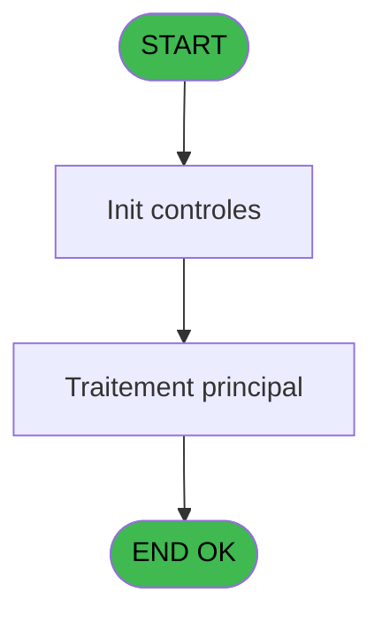
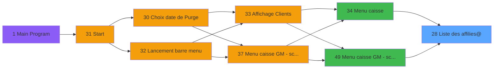
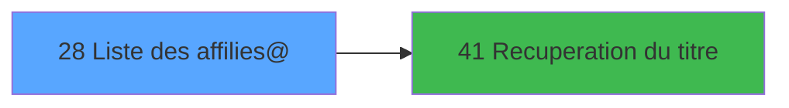

# CAP IDE 28 - Liste des affilies@

> **Analyse**: Phases 1-4 2026-02-03 10:18 -> 10:19 (17s) | Assemblage 10:19
> **Pipeline**: V7.2 Enrichi
> **Structure**: 4 onglets (Resume | Ecrans | Donnees | Connexions)

<!-- TAB:Resume -->

## 1. FICHE D'IDENTITE

| Attribut | Valeur |
|----------|--------|
| Projet | CAP |
| IDE Position | 28 |
| Nom Programme | Liste des affilies@ |
| Fichier source | `Prg_28.xml` |
| Domaine metier | General |
| Taches | 2 (1 ecrans visibles) |
| Tables modifiees | 0 |
| Programmes appeles | 1 |

## 2. DESCRIPTION FONCTIONNELLE

**Liste des affilies@** assure la gestion complete de ce processus, accessible depuis [Menu caisse (IDE 34)](CAP-IDE-34.md), [Menu caisse GM - scroll @ (IDE 49)](CAP-IDE-49.md).

Le flux de traitement s'organise en **2 blocs fonctionnels** :

- **Calcul** (1 tache) : calculs de montants, stocks ou compteurs
- **Traitement** (1 tache) : traitements metier divers

**Logique metier** : 3 regles identifiees couvrant conditions metier.

Detail : phases du traitement

#### Phase 1 : Traitement (1 tache)

- **28** - (sans nom) **[[ECRAN]](#ecran-t1)**

Delegue a : [Recuperation du titre (IDE 41)](CAP-IDE-41.md)

#### Phase 2 : Calcul (1 tache)

- **28.1** - Reaffichage infos compte

## 3. BLOCS FONCTIONNELS

### 3.1 Traitement (1 tache)

Traitements internes.

---

#### 28 - (sans nom) [[ECRAN]](#ecran-t1)

**Role** : Traitement interne.
**Ecran** : 1019 x 216 DLU (MDI) | [Voir mockup](#ecran-t1)
**Delegue a** : [Recuperation du titre (IDE 41)](CAP-IDE-41.md)

### 3.2 Calcul (1 tache)

Calculs metier : montants, stocks, compteurs.

---

#### 28.1 - Reaffichage infos compte

**Role** : Reinitialisation : Reaffichage infos compte.
**Variables liees** : D (P0 solde compte), E (P0 etat compte)

## 5. REGLES METIER

3 regles identifiees:

### Autres (3 regles)

#### [RM-001] Si [T]>=Date () AND [S]<=Date () alors 7 sinon 11)

| Element | Detail |
|---------|--------|
| **Condition** | `[T]>=Date () AND [S]<=Date ()` |
| **Si vrai** | 7 |
| **Si faux** | 11) |
| **Expression source** | Expression 9 : `IF ([T]>=Date () AND [S]<=Date (),7,11)` |
| **Exemple** | Si [T]>=Date () AND [S]<=Date () → 7. Sinon → 11) |

#### [RM-002] Traitement conditionnel si [AX] est a zero

| Element | Detail |
|---------|--------|
| **Condition** | `[AX]=0` |
| **Si vrai** | '40 ans' |
| **Si faux** | IF([AY]=0,Str([BH],'2')&' mois',Str([AY],'3')&' ans')) |
| **Expression source** | Expression 11 : `IF([AX]=0,'40 ans',IF([AY]=0,Str([BH],'2')&' mois',Str([AY],` |
| **Exemple** | Si [AX]=0 → '40 ans'. Sinon → IF([AY]=0,Str([BH],'2')&' mois',Str([AY],'3')&' ans')) |

#### [RM-003] Si [T]<Date () alors 'dernier sejour :' sinon IF ([S]>Date (),'prochain sejour :','sejour en cours'))

| Element | Detail |
|---------|--------|
| **Condition** | `[T]<Date ()` |
| **Si vrai** | 'dernier sejour :' |
| **Si faux** | IF ([S]>Date (),'prochain sejour :','sejour en cours')) |
| **Expression source** | Expression 13 : `IF ([T]<Date (),'dernier sejour :',IF ([S]>Date (),'prochain` |
| **Exemple** | Si [T]<Date () → 'dernier sejour :'. Sinon → IF ([S]>Date (),'prochain sejour :','sejour en cours')) |

## 6. CONTEXTE

- **Appele par**: [Menu caisse (IDE 34)](CAP-IDE-34.md), [Menu caisse GM - scroll @ (IDE 49)](CAP-IDE-49.md)
- **Appelle**: 1 programmes | **Tables**: 3 (W:0 R:2 L:1) | **Taches**: 2 | **Expressions**: 15

<!-- TAB:Ecrans -->

## 8. ECRANS

### 8.1 Forms visibles (1 / 2)

| # | Position | Tache | Nom | Type | Largeur | Hauteur | Bloc |
|---|----------|-------|-----|------|---------|---------|------|
| 1 | 28 | 28 | (sans nom) | MDI | 1019 | 216 | Traitement |

### 8.2 Mockups Ecrans

---

#### 28 - (sans nom)
**Tache** : [28](#t1) | **Type** : MDI | **Dimensions** : 1019 x 216 DLU
**Bloc** : Traitement | **Titre IDE** : (sans nom)

<!-- FORM-DATA:
{
    "width":  1019,
    "vFactor":  8,
    "type":  "MDI",
    "hFactor":  8,
    "controls":  [
                     {
                         "x":  3,
                         "type":  "label",
                         "var":  "",
                         "y":  1,
                         "w":  1007,
                         "fmt":  "",
                         "name":  "",
                         "h":  19,
                         "color":  "",
                         "text":  "",
                         "parent":  null
                     },
                     {
                         "x":  57,
                         "type":  "table",
                         "var":  "",
                         "name":  "",
                         "titleH":  12,
                         "color":  "110",
                         "w":  739,
                         "y":  36,
                         "fmt":  "",
                         "parent":  null,
                         "text":  "",
                         "rowH":  26,
                         "h":  131,
                         "cols":  [
                                      {
                                          "title":  "",
                                          "layer":  1,
                                          "w":  704
                                      }
                                  ],
                         "rows":  1
                     },
                     {
                         "x":  387,
                         "type":  "label",
                         "var":  "",
                         "y":  51,
                         "w":  29,
                         "fmt":  "",
                         "name":  "",
                         "h":  8,
                         "color":  "110",
                         "text":  "Du",
                         "parent":  4
                     },
                     {
                         "x":  566,
                         "type":  "label",
                         "var":  "",
                         "y":  51,
                         "w":  29,
                         "fmt":  "",
                         "name":  "",
                         "h":  8,
                         "color":  "110",
                         "text":  "au",
                         "parent":  4
                     },
                     {
                         "x":  0,
                         "type":  "label",
                         "var":  "",
                         "y":  189,
                         "w":  1013,
                         "fmt":  "",
                         "name":  "",
                         "h":  24,
                         "color":  "",
                         "text":  "",
                         "parent":  null
                     },
                     {
                         "x":  68,
                         "type":  "edit",
                         "var":  "",
                         "y":  40,
                         "w":  277,
                         "fmt":  "",
                         "name":  "",
                         "h":  8,
                         "color":  "110",
                         "text":  "",
                         "parent":  4
                     },
                     {
                         "x":  508,
                         "type":  "edit",
                         "var":  "",
                         "y":  40,
                         "w":  123,
                         "fmt":  "",
                         "name":  "",
                         "h":  8,
                         "color":  "110",
                         "text":  "",
                         "parent":  4
                     },
                     {
                         "x":  631,
                         "type":  "edit",
                         "var":  "",
                         "y":  39,
                         "w":  22,
                         "fmt":  "1",
                         "name":  "",
                         "h":  9,
                         "color":  "110",
                         "text":  "",
                         "parent":  4
                     },
                     {
                         "x":  677,
                         "type":  "edit",
                         "var":  "",
                         "y":  40,
                         "w":  45,
                         "fmt":  "",
                         "name":  "",
                         "h":  8,
                         "color":  "110",
                         "text":  "",
                         "parent":  4
                     },
                     {
                         "x":  357,
                         "type":  "edit",
                         "var":  "",
                         "y":  40,
                         "w":  19,
                         "fmt":  "",
                         "name":  "",
                         "h":  8,
                         "color":  "110",
                         "text":  "",
                         "parent":  4
                     },
                     {
                         "x":  430,
                         "type":  "edit",
                         "var":  "",
                         "y":  51,
                         "w":  120,
                         "fmt":  "",
                         "name":  "",
                         "h":  8,
                         "color":  "110",
                         "text":  "",
                         "parent":  4
                     },
                     {
                         "x":  611,
                         "type":  "edit",
                         "var":  "",
                         "y":  51,
                         "w":  120,
                         "fmt":  "",
                         "name":  "",
                         "h":  8,
                         "color":  "110",
                         "text":  "",
                         "parent":  4
                     },
                     {
                         "x":  736,
                         "type":  "edit",
                         "var":  "",
                         "y":  6,
                         "w":  267,
                         "fmt":  "WWW DD MMM YYYYT",
                         "name":  "",
                         "h":  8,
                         "color":  "",
                         "text":  "",
                         "parent":  1
                     },
                     {
                         "x":  404,
                         "type":  "edit",
                         "var":  "",
                         "y":  40,
                         "w":  90,
                         "fmt":  "8",
                         "name":  "",
                         "h":  8,
                         "color":  "110",
                         "text":  "",
                         "parent":  4
                     },
                     {
                         "x":  654,
                         "type":  "edit",
                         "var":  "",
                         "y":  40,
                         "w":  22,
                         "fmt":  "1",
                         "name":  "",
                         "h":  8,
                         "color":  "110",
                         "text":  "",
                         "parent":  4
                     },
                     {
                         "x":  859,
                         "type":  "image",
                         "var":  "",
                         "y":  42,
                         "w":  109,
                         "fmt":  "",
                         "name":  "",
                         "h":  67,
                         "color":  "",
                         "text":  "",
                         "parent":  null
                     },
                     {
                         "x":  71,
                         "type":  "edit",
                         "var":  "",
                         "y":  51,
                         "w":  198,
                         "fmt":  "17",
                         "name":  "",
                         "h":  8,
                         "color":  "110",
                         "text":  "",
                         "parent":  4
                     },
                     {
                         "x":  5,
                         "type":  "button",
                         "var":  "",
                         "y":  192,
                         "w":  144,
                         "fmt":  "\u0026Quitter",
                         "name":  "",
                         "h":  18,
                         "color":  "",
                         "text":  "",
                         "parent":  19
                     },
                     {
                         "x":  11,
                         "type":  "edit",
                         "var":  "",
                         "y":  6,
                         "w":  267,
                         "fmt":  "20",
                         "name":  "",
                         "h":  8,
                         "color":  "",
                         "text":  "",
                         "parent":  1
                     }
                 ],
    "taskId":  "28",
    "height":  216
}
-->

<strong>Champs : 12 champs</strong>

| Pos (x,y) | Nom | Variable | Type |
|-----------|-----|----------|------|
| 68,40 | (sans nom) | - | edit |
| 508,40 | (sans nom) | - | edit |
| 631,39 | 1 | - | edit |
| 677,40 | (sans nom) | - | edit |
| 357,40 | (sans nom) | - | edit |
| 430,51 | (sans nom) | - | edit |
| 611,51 | (sans nom) | - | edit |
| 736,6 | WWW DD MMM YYYYT | - | edit |
| 404,40 | 8 | - | edit |
| 654,40 | 1 | - | edit |
| 71,51 | 17 | - | edit |
| 11,6 | 20 | - | edit |

<strong>Boutons : 1 boutons</strong>

| Bouton | Pos (x,y) | Action |
|--------|-----------|--------|
| Quitter | 5,192 | Quitte le programme |

## 9. NAVIGATION

Ecran unique: ****

### 9.3 Structure hierarchique (2 taches)

| Position | Tache | Type | Dimensions | Bloc |
|----------|-------|------|------------|------|
| **28.1** | [**(sans nom)** (28)](#t1) [mockup](#ecran-t1) | MDI | 1019x216 | Traitement |
| **28.2** | [**Reaffichage infos compte** (28.1)](#t2) | MDI | - | Calcul |

### 9.4 Algorigramme

> **Legende**: Vert = START/END OK | Rouge = END KO | Bleu = Decisions
> *Algorigramme auto-genere. Utiliser `/algorigramme` pour une synthese metier detaillee.*

<!-- TAB:Donnees -->

## 10. TABLES

### Tables utilisees (3)

| ID | Nom | Description | Type | R | W | L | Usages |
|----|-----|-------------|------|---|---|---|--------|
| 31 | gm-complet_______gmc |  | DB | R |   |   | 1 |
| 744 | pv_lieux_vente | Donnees de ventes | DB |   |   | L | 1 |
| 747 | regles_securite |  | DB | R |   |   | 1 |

### Colonnes par table (1 / 2 tables avec colonnes identifiees)

Table 31 - gm-complet_______gmc (R) - 1 usages

| Lettre | Variable | Acces | Type |
|--------|----------|-------|------|
| A | P0 societe | R | Alpha |
| B | P0 code adherent | R | Numeric |
| C | P0 filiation | R | Numeric |
| D | P0 solde compte | R | Numeric |
| E | P0 etat compte | R | Alpha |
| F | P0 date solde | R | Date |
| G | P0 garanti O/N | R | Alpha |
| H | v. nom / prenom | R | Alpha |
| I | v.titre | R | Alpha |

Table 747 - regles_securite (R) - 1 usages

*Table utilisee uniquement en Link ou aucune colonne Real identifiee dans le DataView.*

## 11. VARIABLES

### 11.1 Parametres entrants (7)

Variables recues du programme appelant ([Menu caisse (IDE 34)](CAP-IDE-34.md)).

| Lettre | Nom | Type | Usage dans |
|--------|-----|------|-----------|
| A | P0 societe | Alpha | 1x parametre entrant |
| B | P0 code adherent | Numeric | 1x parametre entrant |
| C | P0 filiation | Numeric | - |
| D | P0 solde compte | Numeric | - |
| E | P0 etat compte | Alpha | - |
| F | P0 date solde | Date | - |
| G | P0 garanti O/N | Alpha | - |

### 11.2 Variables de session (2)

Variables persistantes pendant toute la session.

| Lettre | Nom | Type | Usage dans |
|--------|-----|------|-----------|
| H | v. nom / prenom | Alpha | - |
| I | v.titre | Alpha | - |

## 12. EXPRESSIONS

**15 / 15 expressions decodees (100%)**

### 12.1 Repartition par type

| Type | Expressions | Regles |
|------|-------------|--------|
| CONDITION | 3 | 3 |
| CONSTANTE | 2 | 0 |
| DATE | 2 | 0 |
| REFERENCE_VG | 2 | 0 |
| OTHER | 4 | 0 |
| STRING | 1 | 0 |
| CONCATENATION | 1 | 0 |

### 12.2 Expressions cles par type

#### CONDITION (3 expressions)

| Type | IDE | Expression | Regle |
|------|-----|------------|-------|
| CONDITION | 13 | `IF ([T]<Date (),'dernier sejour :',IF ([S]>Date (),'prochain sejour :','sejour en cours'))` | [RM-003](#rm-RM-003) |
| CONDITION | 11 | `IF([AX]=0,'40 ans',IF([AY]=0,Str([BH],'2')&' mois',Str([AY],'3')&' ans'))` | [RM-002](#rm-RM-002) |
| CONDITION | 9 | `IF ([T]>=Date () AND [S]<=Date (),7,11)` | [RM-001](#rm-RM-001) |

#### CONSTANTE (2 expressions)

| Type | IDE | Expression | Regle |
|------|-----|------------|-------|
| CONSTANTE | 12 | `'-'` | - |
| CONSTANTE | 3 | `3` | - |

#### DATE (2 expressions)

| Type | IDE | Expression | Regle |
|------|-----|------------|-------|
| DATE | 14 | `Date ()` | - |
| DATE | 4 | `Date ()` | - |

#### REFERENCE_VG (2 expressions)

| Type | IDE | Expression | Regle |
|------|-----|------------|-------|
| REFERENCE_VG | 5 | `VG3` | - |
| REFERENCE_VG | 1 | `VG1` | - |

#### OTHER (4 expressions)

| Type | IDE | Expression | Regle |
|------|-----|------------|-------|
| OTHER | 8 | `Stat (0,'C')` | - |
| OTHER | 15 | `[K]` | - |
| OTHER | 6 | `P0 societe [A]` | - |
| OTHER | 7 | `P0 code adherent [B]` | - |

#### STRING (1 expressions)

| Type | IDE | Expression | Regle |
|------|-----|------------|-------|
| STRING | 2 | `Trim ([U])` | - |

#### CONCATENATION (1 expressions)

| Type | IDE | Expression | Regle |
|------|-----|------------|-------|
| CONCATENATION | 10 | `RTrim ([O])&' '&[P]` | - |

<!-- TAB:Connexions -->

## 13. GRAPHE D'APPELS

### 13.1 Chaine depuis Main (Callers)

Main -> ... -> [Menu caisse (IDE 34)](CAP-IDE-34.md) -> **Liste des affilies@ (IDE 28)**

Main -> ... -> [Menu caisse GM - scroll @ (IDE 49)](CAP-IDE-49.md) -> **Liste des affilies@ (IDE 28)**

### 13.2 Callers

| IDE | Nom Programme | Nb Appels |
|-----|---------------|-----------|
| [34](CAP-IDE-34.md) | Menu caisse | 1 |
| [49](CAP-IDE-49.md) | Menu caisse GM - scroll @ | 1 |

### 13.3 Callees (programmes appeles)

### 13.4 Detail Callees avec contexte

| IDE | Nom Programme | Appels | Contexte |
|-----|---------------|--------|----------|
| [41](CAP-IDE-41.md) | Recuperation du titre | 1 | Recuperation donnees |

## 14. RECOMMANDATIONS MIGRATION

### 14.1 Profil du programme

| Metrique | Valeur | Impact migration |
|----------|--------|-----------------|
| Lignes de logique | 48 | Programme compact |
| Expressions | 15 | Peu de logique |
| Tables WRITE | 0 | Impact faible |
| Sous-programmes | 1 | Peu de dependances |
| Ecrans visibles | 1 | Ecran unique ou traitement batch |
| Code desactive | 0% (0 / 48) | Code sain |
| Regles metier | 3 | Quelques regles a preserver |

### 14.2 Plan de migration par bloc

#### Traitement (1 tache: 1 ecran, 0 traitement)

- **Strategie** : 1 composant(s) UI (Razor/React) avec formulaires et validation.
- 1 sous-programme(s) a migrer ou a reutiliser depuis les services existants.
- Decomposer les taches en services unitaires testables.

#### Calcul (1 tache: 0 ecran, 1 traitement)

- **Strategie** : Services de calcul purs (Domain Services).
- Migrer la logique de calcul (stock, compteurs, montants)

### 14.3 Dependances critiques

| Dependance | Type | Appels | Impact |
|------------|------|--------|--------|
| [Recuperation du titre (IDE 41)](CAP-IDE-41.md) | Sous-programme | 1x | Normale - Recuperation donnees |

---
*Spec DETAILED generee par Pipeline V7.2 - 2026-02-03 10:19*
