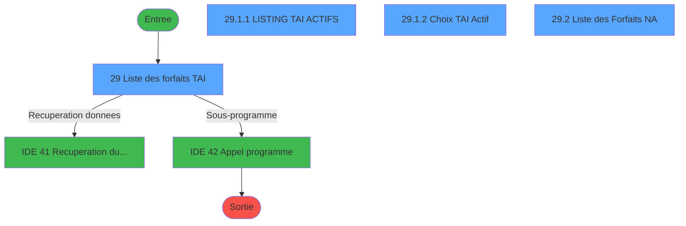
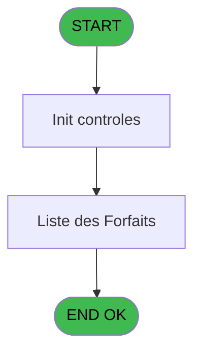
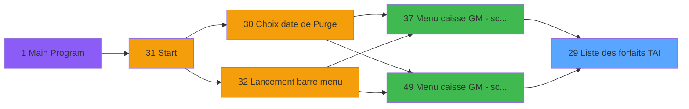
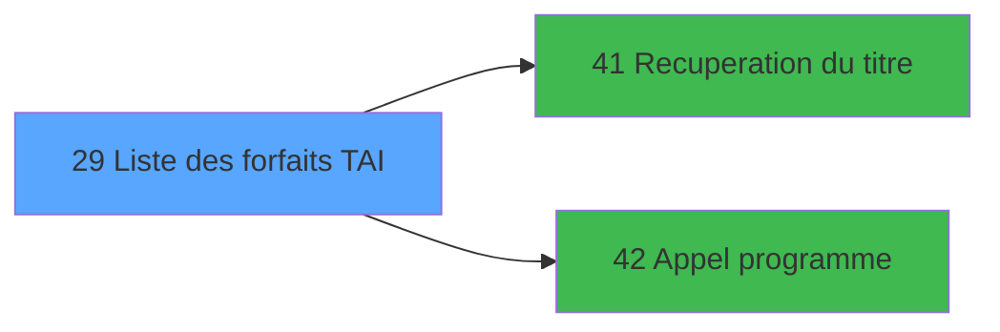

# CAP IDE 29 - Liste des forfaits TAI

> **Analyse**: Phases 1-4 2026-02-03 10:19 -> 10:19 (16s) | Assemblage 10:19
> **Pipeline**: V7.2 Enrichi
> **Structure**: 4 onglets (Resume | Ecrans | Donnees | Connexions)

<!-- TAB:Resume -->

## 1. FICHE D'IDENTITE

| Attribut | Valeur |
|----------|--------|
| Projet | CAP |
| IDE Position | 29 |
| Nom Programme | Liste des forfaits TAI |
| Fichier source | `Prg_29.xml` |
| Domaine metier | General |
| Taches | 5 (4 ecrans visibles) |
| Tables modifiees | 0 |
| Programmes appeles | 2 |

## 2. DESCRIPTION FONCTIONNELLE

**Liste des forfaits TAI** assure la gestion complete de ce processus, accessible depuis [Menu caisse GM - scroll (IDE 37)](CAP-IDE-37.md), [Menu caisse GM - scroll @ (IDE 49)](CAP-IDE-49.md).

Le flux de traitement s'organise en **2 blocs fonctionnels** :

- **Traitement** (4 taches) : traitements metier divers
- **Consultation** (1 tache) : ecrans de recherche, selection et consultation

Detail : phases du traitement

#### Phase 1 : Traitement (4 taches)

- **29** - Liste des forfaits TAI **[[ECRAN]](#ecran-t1)**
- **29.1** - CV Listing des forfaits TAI **[[ECRAN]](#ecran-t2)**
- **29.1.1** - LISTING TAI ACTIFS **[[ECRAN]](#ecran-t4)**
- **29.2** - Liste des Forfaits NA **[[ECRAN]](#ecran-t6)**

Delegue a : [Recuperation du titre (IDE 41)](CAP-IDE-41.md), [Appel programme (IDE 42)](CAP-IDE-42.md)

#### Phase 2 : Consultation (1 tache)

- **29.1.2** - Choix TAI Actif **[[ECRAN]](#ecran-t5)**

Delegue a : [Recuperation du titre (IDE 41)](CAP-IDE-41.md)

## 3. BLOCS FONCTIONNELS

### 3.1 Traitement (4 taches)

Traitements internes.

---

#### 29 - Liste des forfaits TAI [[ECRAN]](#ecran-t1)

**Role** : Traitement : Liste des forfaits TAI.
**Ecran** : 1056 x 256 DLU (MDI) | [Voir mockup](#ecran-t1)

3 sous-taches directes

| Tache | Nom | Bloc |
|-------|-----|------|
| [29.1](#t2) | CV Listing des forfaits TAI **[[ECRAN]](#ecran-t2)** | Traitement |
| [29.1.1](#t4) | LISTING TAI ACTIFS **[[ECRAN]](#ecran-t4)** | Traitement |
| [29.2](#t6) | Liste des Forfaits NA **[[ECRAN]](#ecran-t6)** | Traitement |

**Delegue a** : [Recuperation du titre (IDE 41)](CAP-IDE-41.md), [Appel programme (IDE 42)](CAP-IDE-42.md)

---

#### 29.1 - CV Listing des forfaits TAI [[ECRAN]](#ecran-t2)

**Role** : Traitement : CV Listing des forfaits TAI.
**Ecran** : 330 x 34 DLU (MDI) | [Voir mockup](#ecran-t2)
**Delegue a** : [Recuperation du titre (IDE 41)](CAP-IDE-41.md), [Appel programme (IDE 42)](CAP-IDE-42.md)

---

#### 29.1.1 - LISTING TAI ACTIFS [[ECRAN]](#ecran-t4)

**Role** : Traitement : LISTING TAI ACTIFS.
**Ecran** : 429 x 57 DLU (MDI) | [Voir mockup](#ecran-t4)
**Delegue a** : [Recuperation du titre (IDE 41)](CAP-IDE-41.md), [Appel programme (IDE 42)](CAP-IDE-42.md)

---

#### 29.2 - Liste des Forfaits NA [[ECRAN]](#ecran-t6)

**Role** : Traitement : Liste des Forfaits NA.
**Ecran** : 797 x 162 DLU (MDI) | [Voir mockup](#ecran-t6)
**Delegue a** : [Recuperation du titre (IDE 41)](CAP-IDE-41.md), [Appel programme (IDE 42)](CAP-IDE-42.md)

### 3.2 Consultation (1 tache)

Ecrans de recherche et consultation.

---

#### 29.1.2 - Choix TAI Actif [[ECRAN]](#ecran-t5)

**Role** : Selection par l'operateur : Choix TAI Actif.
**Ecran** : 572 x 50 DLU (MDI) | [Voir mockup](#ecran-t5)
**Variables liees** : I (V Choix)

## 5. REGLES METIER

*(Aucune regle metier identifiee)*

## 6. CONTEXTE

- **Appele par**: [Menu caisse GM - scroll (IDE 37)](CAP-IDE-37.md), [Menu caisse GM - scroll @ (IDE 49)](CAP-IDE-49.md)
- **Appelle**: 2 programmes | **Tables**: 3 (W:0 R:1 L:2) | **Taches**: 5 | **Expressions**: 6

<!-- TAB:Ecrans -->

## 8. ECRANS

### 8.1 Forms visibles (4 / 5)

| # | Position | Tache | Nom | Type | Largeur | Hauteur | Bloc |
|---|----------|-------|-----|------|---------|---------|------|
| 1 | 29 | 29 | Liste des forfaits TAI | MDI | 1056 | 256 | Traitement |
| 2 | 29.1.1 | 29.1.1 | LISTING TAI ACTIFS | MDI | 429 | 57 | Traitement |
| 3 | 29.1.2 | 29.1.2 | Choix TAI Actif | MDI | 572 | 50 | Consultation |
| 4 | 29.2 | 29.2 | Liste des Forfaits NA | MDI | 797 | 162 | Traitement |

### 8.2 Mockups Ecrans

---

#### 29 - Liste des forfaits TAI
**Tache** : [29](#t1) | **Type** : MDI | **Dimensions** : 1056 x 256 DLU
**Bloc** : Traitement | **Titre IDE** : Liste des forfaits TAI

<!-- FORM-DATA:
{
    "width":  1056,
    "vFactor":  8,
    "type":  "MDI",
    "hFactor":  8,
    "controls":  [
                     {
                         "x":  8,
                         "type":  "label",
                         "var":  "",
                         "y":  1,
                         "w":  1039,
                         "fmt":  "",
                         "name":  "",
                         "h":  17,
                         "color":  "",
                         "text":  "",
                         "parent":  null
                     },
                     {
                         "x":  226,
                         "type":  "label",
                         "var":  "",
                         "y":  38,
                         "w":  807,
                         "fmt":  "",
                         "name":  "",
                         "h":  178,
                         "color":  "",
                         "text":  "",
                         "parent":  null
                     },
                     {
                         "x":  774,
                         "type":  "label",
                         "var":  "",
                         "y":  117,
                         "w":  154,
                         "fmt":  "",
                         "name":  "",
                         "h":  14,
                         "color":  "",
                         "text":  "TAI",
                         "parent":  null
                     },
                     {
                         "x":  341,
                         "type":  "label",
                         "var":  "",
                         "y":  148,
                         "w":  587,
                         "fmt":  "",
                         "name":  "",
                         "h":  40,
                         "color":  "",
                         "text":  "",
                         "parent":  null
                     },
                     {
                         "x":  349,
                         "type":  "label",
                         "var":  "",
                         "y":  154,
                         "w":  574,
                         "fmt":  "",
                         "name":  "",
                         "h":  32,
                         "color":  "",
                         "text":  "",
                         "parent":  8
                     },
                     {
                         "x":  350,
                         "type":  "label",
                         "var":  "",
                         "y":  156,
                         "w":  42,
                         "fmt":  "",
                         "name":  "",
                         "h":  29,
                         "color":  "",
                         "text":  "",
                         "parent":  8
                     },
                     {
                         "x":  405,
                         "type":  "label",
                         "var":  "",
                         "y":  160,
                         "w":  290,
                         "fmt":  "",
                         "name":  "",
                         "h":  9,
                         "color":  "142",
                         "text":  "Visualisation",
                         "parent":  8
                     },
                     {
                         "x":  704,
                         "type":  "label",
                         "var":  "",
                         "y":  167,
                         "w":  120,
                         "fmt":  "",
                         "name":  "",
                         "h":  8,
                         "color":  "",
                         "text":  "Votre choix",
                         "parent":  8
                     },
                     {
                         "x":  405,
                         "type":  "label",
                         "var":  "",
                         "y":  172,
                         "w":  290,
                         "fmt":  "",
                         "name":  "",
                         "h":  9,
                         "color":  "142",
                         "text":  "Edition",
                         "parent":  8
                     },
                     {
                         "x":  0,
                         "type":  "label",
                         "var":  "",
                         "y":  219,
                         "w":  1042,
                         "fmt":  "",
                         "name":  "",
                         "h":  24,
                         "color":  "",
                         "text":  "",
                         "parent":  null
                     },
                     {
                         "x":  832,
                         "type":  "edit",
                         "var":  "",
                         "y":  166,
                         "w":  26,
                         "fmt":  "",
                         "name":  "V Choix",
                         "h":  8,
                         "color":  "110",
                         "text":  "",
                         "parent":  8
                     },
                     {
                         "x":  14,
                         "type":  "edit",
                         "var":  "",
                         "y":  5,
                         "w":  267,
                         "fmt":  "30",
                         "name":  "",
                         "h":  8,
                         "color":  "",
                         "text":  "",
                         "parent":  1
                     },
                     {
                         "x":  839,
                         "type":  "edit",
                         "var":  "",
                         "y":  5,
                         "w":  203,
                         "fmt":  "WWW DD MMM YYYYT",
                         "name":  "",
                         "h":  8,
                         "color":  "",
                         "text":  "",
                         "parent":  1
                     },
                     {
                         "x":  346,
                         "type":  "image",
                         "var":  "",
                         "y":  53,
                         "w":  205,
                         "fmt":  "",
                         "name":  "",
                         "h":  78,
                         "color":  "",
                         "text":  "",
                         "parent":  null
                     },
                     {
                         "x":  24,
                         "type":  "image",
                         "var":  "",
                         "y":  61,
                         "w":  182,
                         "fmt":  "",
                         "name":  "",
                         "h":  92,
                         "color":  "",
                         "text":  "",
                         "parent":  null
                     },
                     {
                         "x":  359,
                         "type":  "button",
                         "var":  "",
                         "y":  160,
                         "w":  27,
                         "fmt":  "A",
                         "name":  "A",
                         "h":  9,
                         "color":  "",
                         "text":  "",
                         "parent":  null
                     },
                     {
                         "x":  359,
                         "type":  "button",
                         "var":  "",
                         "y":  172,
                         "w":  27,
                         "fmt":  "B",
                         "name":  "B",
                         "h":  9,
                         "color":  "",
                         "text":  "",
                         "parent":  null
                     },
                     {
                         "x":  865,
                         "type":  "button",
                         "var":  "",
                         "y":  221,
                         "w":  168,
                         "fmt":  "\u0026Quitter",
                         "name":  "",
                         "h":  18,
                         "color":  "",
                         "text":  "",
                         "parent":  15
                     }
                 ],
    "taskId":  "29",
    "height":  256
}
-->

<strong>Champs : 3 champs</strong>

| Pos (x,y) | Nom | Variable | Type |
|-----------|-----|----------|------|
| 832,166 | V Choix | - | edit |
| 14,5 | 30 | - | edit |
| 839,5 | WWW DD MMM YYYYT | - | edit |

<strong>Boutons : 3 boutons</strong>

| Bouton | Pos (x,y) | Action |
|--------|-----------|--------|
| A | 359,160 | Bouton fonctionnel |
| B | 359,172 | Bouton fonctionnel |
| Quitter | 865,221 | Quitte le programme |

---

#### 29.1.1 - LISTING TAI ACTIFS
**Tache** : [29.1.1](#t4) | **Type** : MDI | **Dimensions** : 429 x 57 DLU
**Bloc** : Traitement | **Titre IDE** : LISTING TAI ACTIFS

<!-- FORM-DATA:
{
    "width":  429,
    "vFactor":  8,
    "type":  "MDI",
    "hFactor":  8,
    "controls":  [
                     {
                         "x":  122,
                         "type":  "label",
                         "var":  "",
                         "y":  9,
                         "w":  221,
                         "fmt":  "",
                         "name":  "",
                         "h":  8,
                         "color":  "7",
                         "text":  "Impression en cours ...",
                         "parent":  null
                     },
                     {
                         "x":  2,
                         "type":  "label",
                         "var":  "",
                         "y":  28,
                         "w":  423,
                         "fmt":  "",
                         "name":  "",
                         "h":  27,
                         "color":  "",
                         "text":  "",
                         "parent":  null
                     },
                     {
                         "x":  74,
                         "type":  "label",
                         "var":  "",
                         "y":  37,
                         "w":  280,
                         "fmt":  "",
                         "name":  "",
                         "h":  8,
                         "color":  "",
                         "text":  "LISTING TAI ACTIFS",
                         "parent":  null
                     },
                     {
                         "x":  6,
                         "type":  "image",
                         "var":  "",
                         "y":  1,
                         "w":  72,
                         "fmt":  "",
                         "name":  "",
                         "h":  25,
                         "color":  "",
                         "text":  "",
                         "parent":  null
                     }
                 ],
    "taskId":  "29.1.1",
    "height":  57
}
-->

---

#### 29.1.2 - Choix TAI Actif
**Tache** : [29.1.2](#t5) | **Type** : MDI | **Dimensions** : 572 x 50 DLU
**Bloc** : Consultation | **Titre IDE** : Choix TAI Actif

<!-- FORM-DATA:
{
    "width":  572,
    "vFactor":  8,
    "type":  "MDI",
    "hFactor":  8,
    "controls":  [
                     {
                         "x":  8,
                         "type":  "label",
                         "var":  "",
                         "y":  1,
                         "w":  557,
                         "fmt":  "",
                         "name":  "",
                         "h":  47,
                         "color":  "",
                         "text":  "",
                         "parent":  null
                     },
                     {
                         "x":  206,
                         "type":  "checkbox",
                         "var":  "",
                         "y":  7,
                         "w":  161,
                         "fmt":  "",
                         "name":  "TAI ACTIF",
                         "h":  14,
                         "color":  "",
                         "text":  "TAI Actifs",
                         "parent":  null
                     },
                     {
                         "x":  22,
                         "type":  "button",
                         "var":  "",
                         "y":  28,
                         "w":  176,
                         "fmt":  "",
                         "name":  "Abandon",
                         "h":  17,
                         "color":  "",
                         "text":  "",
                         "parent":  null
                     },
                     {
                         "x":  379,
                         "type":  "button",
                         "var":  "",
                         "y":  28,
                         "w":  176,
                         "fmt":  "",
                         "name":  "Validation",
                         "h":  17,
                         "color":  "",
                         "text":  "",
                         "parent":  null
                     }
                 ],
    "taskId":  "29.1.2",
    "height":  50
}
-->

<strong>Champs : 1 champs</strong>

| Pos (x,y) | Nom | Variable | Type |
|-----------|-----|----------|------|
| 206,7 | TAI ACTIF | - | checkbox |

<strong>Boutons : 2 boutons</strong>

| Bouton | Pos (x,y) | Action |
|--------|-----------|--------|
| Abandon | 22,28 | Annule et retour au menu |
| Validation | 379,28 | Valide la saisie et enregistre |

---

#### 29.2 - Liste des Forfaits NA
**Tache** : [29.2](#t6) | **Type** : MDI | **Dimensions** : 797 x 162 DLU
**Bloc** : Traitement | **Titre IDE** : Liste des Forfaits NA

<!-- FORM-DATA:
{
    "width":  797,
    "vFactor":  8,
    "type":  "MDI",
    "hFactor":  8,
    "controls":  [
                     {
                         "x":  8,
                         "type":  "label",
                         "var":  "",
                         "y":  4,
                         "w":  784,
                         "fmt":  "",
                         "name":  "",
                         "h":  18,
                         "color":  "",
                         "text":  "",
                         "parent":  null
                     },
                     {
                         "x":  6,
                         "type":  "table",
                         "var":  "",
                         "name":  "",
                         "titleH":  12,
                         "color":  "110",
                         "w":  789,
                         "y":  27,
                         "fmt":  "",
                         "parent":  null,
                         "text":  "",
                         "rowH":  12,
                         "h":  74,
                         "cols":  [
                                      {
                                          "title":  "Code",
                                          "layer":  1,
                                          "w":  90
                                      },
                                      {
                                          "title":  "Libellé Forfait",
                                          "layer":  2,
                                          "w":  152
                                      },
                                      {
                                          "title":  "Date Début",
                                          "layer":  3,
                                          "w":  117
                                      },
                                      {
                                          "title":  "Date Fin",
                                          "layer":  4,
                                          "w":  114
                                      },
                                      {
                                          "title":  "Nom",
                                          "layer":  5,
                                          "w":  175
                                      },
                                      {
                                          "title":  "Compte",
                                          "layer":  6,
                                          "w":  108
                                      }
                                  ],
                         "rows":  6
                     },
                     {
                         "x":  8,
                         "type":  "label",
                         "var":  "",
                         "y":  136,
                         "w":  784,
                         "fmt":  "",
                         "name":  "",
                         "h":  24,
                         "color":  "",
                         "text":  "",
                         "parent":  null
                     },
                     {
                         "x":  256,
                         "type":  "edit",
                         "var":  "",
                         "y":  41,
                         "w":  107,
                         "fmt":  "",
                         "name":  "",
                         "h":  10,
                         "color":  "110",
                         "text":  "",
                         "parent":  4
                     },
                     {
                         "x":  373,
                         "type":  "edit",
                         "var":  "",
                         "y":  41,
                         "w":  104,
                         "fmt":  "",
                         "name":  "",
                         "h":  10,
                         "color":  "110",
                         "text":  "",
                         "parent":  4
                     },
                     {
                         "x":  14,
                         "type":  "edit",
                         "var":  "",
                         "y":  41,
                         "w":  76,
                         "fmt":  "",
                         "name":  "TAI Code Forfait",
                         "h":  10,
                         "color":  "110",
                         "text":  "",
                         "parent":  4
                     },
                     {
                         "x":  10,
                         "type":  "edit",
                         "var":  "",
                         "y":  122,
                         "w":  96,
                         "fmt":  "",
                         "name":  "",
                         "h":  10,
                         "color":  "144",
                         "text":  "",
                         "parent":  null
                     },
                     {
                         "x":  113,
                         "type":  "edit",
                         "var":  "",
                         "y":  122,
                         "w":  160,
                         "fmt":  "N12.3Z",
                         "name":  "",
                         "h":  10,
                         "color":  "171",
                         "text":  "",
                         "parent":  null
                     },
                     {
                         "x":  102,
                         "type":  "edit",
                         "var":  "",
                         "y":  41,
                         "w":  137,
                         "fmt":  "",
                         "name":  "TAI Libelle article",
                         "h":  10,
                         "color":  "110",
                         "text":  "",
                         "parent":  4
                     },
                     {
                         "x":  19,
                         "type":  "edit",
                         "var":  "",
                         "y":  9,
                         "w":  232,
                         "fmt":  "30",
                         "name":  "",
                         "h":  8,
                         "color":  "",
                         "text":  "",
                         "parent":  null
                     },
                     {
                         "x":  578,
                         "type":  "edit",
                         "var":  "",
                         "y":  9,
                         "w":  203,
                         "fmt":  "WWW DD MMM YYYYT",
                         "name":  "",
                         "h":  8,
                         "color":  "",
                         "text":  "",
                         "parent":  null
                     },
                     {
                         "x":  485,
                         "type":  "edit",
                         "var":  "",
                         "y":  41,
                         "w":  165,
                         "fmt":  "30",
                         "name":  "",
                         "h":  10,
                         "color":  "110",
                         "text":  "",
                         "parent":  4
                     },
                     {
                         "x":  661,
                         "type":  "edit",
                         "var":  "",
                         "y":  41,
                         "w":  98,
                         "fmt":  "30",
                         "name":  "",
                         "h":  10,
                         "color":  "110",
                         "text":  "",
                         "parent":  4
                     },
                     {
                         "x":  10,
                         "type":  "edit",
                         "var":  "",
                         "y":  109,
                         "w":  96,
                         "fmt":  "4",
                         "name":  "",
                         "h":  10,
                         "color":  "144",
                         "text":  "",
                         "parent":  null
                     },
                     {
                         "x":  280,
                         "type":  "edit",
                         "var":  "",
                         "y":  122,
                         "w":  360,
                         "fmt":  "100",
                         "name":  "",
                         "h":  10,
                         "color":  "",
                         "text":  "",
                         "parent":  null
                     },
                     {
                         "x":  649,
                         "type":  "edit",
                         "var":  "",
                         "y":  122,
                         "w":  144,
                         "fmt":  "30",
                         "name":  "",
                         "h":  10,
                         "color":  "171",
                         "text":  "",
                         "parent":  null
                     },
                     {
                         "x":  612,
                         "type":  "button",
                         "var":  "",
                         "y":  139,
                         "w":  168,
                         "fmt":  "Exit",
                         "name":  "",
                         "h":  18,
                         "color":  "",
                         "text":  "",
                         "parent":  null
                     }
                 ],
    "taskId":  "29.2",
    "height":  162
}
-->

<strong>Champs : 13 champs</strong>

| Pos (x,y) | Nom | Variable | Type |
|-----------|-----|----------|------|
| 256,41 | (sans nom) | - | edit |
| 373,41 | (sans nom) | - | edit |
| 14,41 | TAI Code Forfait | - | edit |
| 10,122 | (sans nom) | - | edit |
| 113,122 | N12.3Z | - | edit |
| 102,41 | TAI Libelle article | - | edit |
| 19,9 | 30 | - | edit |
| 578,9 | WWW DD MMM YYYYT | - | edit |
| 485,41 | 30 | - | edit |
| 661,41 | 30 | - | edit |
| 10,109 | 4 | - | edit |
| 280,122 | 100 | - | edit |
| 649,122 | 30 | - | edit |

<strong>Boutons : 1 boutons</strong>

| Bouton | Pos (x,y) | Action |
|--------|-----------|--------|
| Exit | 612,139 | Quitte le programme |

## 9. NAVIGATION

### 9.1 Enchainement des ecrans

**Detail par enchainement :**

| Depuis | Action | Vers | Retour |
|--------|--------|------|--------|
| Liste des forfaits TAI | Recuperation donnees | [Recuperation du titre (IDE 41)](CAP-IDE-41.md) | Retour ecran |
| Liste des forfaits TAI | Sous-programme | [Appel programme (IDE 42)](CAP-IDE-42.md) | Retour ecran |

### 9.3 Structure hierarchique (5 taches)

| Position | Tache | Type | Dimensions | Bloc |
|----------|-------|------|------------|------|
| **29.1** | [**Liste des forfaits TAI** (29)](#t1) [mockup](#ecran-t1) | MDI | 1056x256 | Traitement |
| 29.1.1 | [CV Listing des forfaits TAI (29.1)](#t2) [mockup](#ecran-t2) | MDI | 330x34 | |
| 29.1.2 | [LISTING TAI ACTIFS (29.1.1)](#t4) [mockup](#ecran-t4) | MDI | 429x57 | |
| 29.1.3 | [Liste des Forfaits NA (29.2)](#t6) [mockup](#ecran-t6) | MDI | 797x162 | |
| **29.2** | [**Choix TAI Actif** (29.1.2)](#t5) [mockup](#ecran-t5) | MDI | 572x50 | Consultation |

### 9.4 Algorigramme

> **Legende**: Vert = START/END OK | Rouge = END KO | Bleu = Decisions
> *Algorigramme auto-genere. Utiliser `/algorigramme` pour une synthese metier detaillee.*

<!-- TAB:Donnees -->

## 10. TABLES

### Tables utilisees (3)

| ID | Nom | Description | Type | R | W | L | Usages |
|----|-----|-------------|------|---|---|---|--------|
| 462 | type_change___________bi |  | DB |   |   | L | 1 |
| 744 | pv_lieux_vente | Donnees de ventes | DB | R |   |   | 2 |
| 753 | checkout_log |  | DB |   |   | L | 2 |

### Colonnes par table (1 / 1 tables avec colonnes identifiees)

Table 744 - pv_lieux_vente (R) - 2 usages

| Lettre | Variable | Acces | Type |
|--------|----------|-------|------|
| A | W1 total Reglt | R | Numeric |
| B | W1 total Origine | R | Numeric |
| C | W1 total montant | R | Numeric |

## 11. VARIABLES

### 11.1 Parametres entrants (7)

Variables recues du programme appelant ([Menu caisse GM - scroll (IDE 37)](CAP-IDE-37.md)).

| Lettre | Nom | Type | Usage dans |
|--------|-----|------|-----------|
| A | P0 Societe | Alpha | - |
| B | P0 Decimale | Numeric | - |
| C | P0 Nom Village | Alpha | - |
| D | P0 Masque | Alpha | - |
| E | P0 Devise | Alpha | - |
| F | P0 Compte | Numeric | - |
| G | P0 Filiation | Numeric | - |

### 11.2 Variables de session (2)

Variables persistantes pendant toute la session.

| Lettre | Nom | Type | Usage dans |
|--------|-----|------|-----------|
| H | V Titre | Alpha | 1x session |
| I | V Choix | Alpha | [29.1.2](#t5) |

### 11.3 Variables de travail (1)

Variables internes au programme.

| Lettre | Nom | Type | Usage dans |
|--------|-----|------|-----------|
| J | W0 confirmation edition | Logical | - |

## 12. EXPRESSIONS

**6 / 6 expressions decodees (100%)**

### 12.1 Repartition par type

| Type | Expressions | Regles |
|------|-------------|--------|
| CONSTANTE | 1 | 0 |
| DATE | 1 | 0 |
| REFERENCE_VG | 1 | 0 |
| CONDITION | 2 | 0 |
| STRING | 1 | 0 |

### 12.2 Expressions cles par type

#### CONSTANTE (1 expressions)

| Type | IDE | Expression | Regle |
|------|-----|------------|-------|
| CONSTANTE | 5 | `6` | - |

#### DATE (1 expressions)

| Type | IDE | Expression | Regle |
|------|-----|------------|-------|
| DATE | 2 | `Date ()` | - |

#### REFERENCE_VG (1 expressions)

| Type | IDE | Expression | Regle |
|------|-----|------------|-------|
| REFERENCE_VG | 1 | `VG2` | - |

#### CONDITION (2 expressions)

| Type | IDE | Expression | Regle |
|------|-----|------------|-------|
| CONDITION | 4 | `V Choix [I]='B'` | - |
| CONDITION | 3 | `V Choix [I]='A'` | - |

#### STRING (1 expressions)

| Type | IDE | Expression | Regle |
|------|-----|------------|-------|
| STRING | 6 | `Trim (V Titre [H])` | - |

<!-- TAB:Connexions -->

## 13. GRAPHE D'APPELS

### 13.1 Chaine depuis Main (Callers)

Main -> ... -> [Menu caisse GM - scroll (IDE 37)](CAP-IDE-37.md) -> **Liste des forfaits TAI (IDE 29)**

Main -> ... -> [Menu caisse GM - scroll @ (IDE 49)](CAP-IDE-49.md) -> **Liste des forfaits TAI (IDE 29)**

### 13.2 Callers

| IDE | Nom Programme | Nb Appels |
|-----|---------------|-----------|
| [37](CAP-IDE-37.md) | Menu caisse GM - scroll | 1 |
| [49](CAP-IDE-49.md) | Menu caisse GM - scroll @ | 1 |

### 13.3 Callees (programmes appeles)

### 13.4 Detail Callees avec contexte

| IDE | Nom Programme | Appels | Contexte |
|-----|---------------|--------|----------|
| [41](CAP-IDE-41.md) | Recuperation du titre | 3 | Recuperation donnees |
| [42](CAP-IDE-42.md) | Appel programme | 1 | Sous-programme |

## 14. RECOMMANDATIONS MIGRATION

### 14.1 Profil du programme

| Metrique | Valeur | Impact migration |
|----------|--------|-----------------|
| Lignes de logique | 148 | Programme compact |
| Expressions | 6 | Peu de logique |
| Tables WRITE | 0 | Impact faible |
| Sous-programmes | 2 | Peu de dependances |
| Ecrans visibles | 4 | Quelques ecrans |
| Code desactive | 0% (0 / 148) | Code sain |
| Regles metier | 0 | Pas de regle identifiee |

### 14.2 Plan de migration par bloc

#### Traitement (4 taches: 4 ecrans, 0 traitement)

- **Strategie** : 4 composant(s) UI (Razor/React) avec formulaires et validation.
- 2 sous-programme(s) a migrer ou a reutiliser depuis les services existants.
- Decomposer les taches en services unitaires testables.

#### Consultation (1 tache: 1 ecran, 0 traitement)

- **Strategie** : Composants de recherche/selection en modales.
- 1 ecran : Choix TAI Actif

### 14.3 Dependances critiques

| Dependance | Type | Appels | Impact |
|------------|------|--------|--------|
| [Recuperation du titre (IDE 41)](CAP-IDE-41.md) | Sous-programme | 3x | **CRITIQUE** - Recuperation donnees |
| [Appel programme (IDE 42)](CAP-IDE-42.md) | Sous-programme | 1x | Normale - Sous-programme |

---
*Spec DETAILED generee par Pipeline V7.2 - 2026-02-03 10:19*
