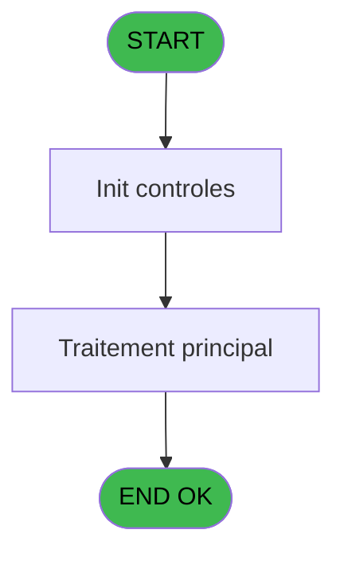
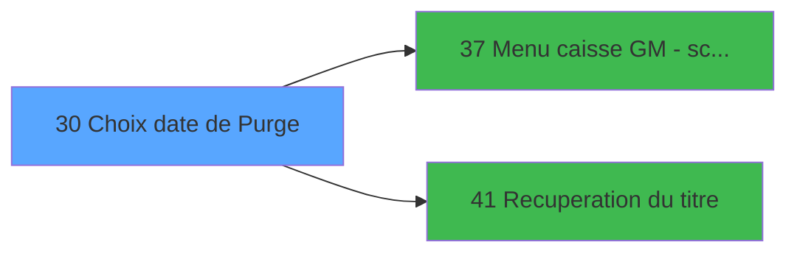

# CAP IDE 30 - Choix date de Purge

> **Analyse**: Phases 1-4 2026-02-03 10:19 -> 10:19 (17s) | Assemblage 10:19
> **Pipeline**: V7.2 Enrichi
> **Structure**: 4 onglets (Resume | Ecrans | Donnees | Connexions)

<!-- TAB:Resume -->

## 1. FICHE D'IDENTITE

| Attribut | Valeur |
|----------|--------|
| Projet | CAP |
| IDE Position | 30 |
| Nom Programme | Choix date de Purge |
| Fichier source | `Prg_30.xml` |
| Domaine metier | Navigation |
| Taches | 1 (1 ecrans visibles) |
| Tables modifiees | 0 |
| Programmes appeles | 2 |

## 2. DESCRIPTION FONCTIONNELLE

**Choix date de Purge** assure la gestion complete de ce processus, accessible depuis [Start (IDE 31)](CAP-IDE-31.md).

Le flux de traitement s'organise en **1 blocs fonctionnels** :

- **Consultation** (1 tache) : ecrans de recherche, selection et consultation

## 3. BLOCS FONCTIONNELS

### 3.1 Consultation (1 tache)

Ecrans de recherche et consultation.

---

#### 30 - Selection du fichier de sauveg [[ECRAN]](#ecran-t1)

**Role** : Selection par l'operateur : Selection du fichier de sauveg.
**Ecran** : 362 x 213 DLU (MDI) | [Voir mockup](#ecran-t1)
**Variables liees** : D (Bouton selection)

## 5. REGLES METIER

*(Aucune regle metier identifiee)*

## 6. CONTEXTE

- **Appele par**: [Start (IDE 31)](CAP-IDE-31.md)
- **Appelle**: 2 programmes | **Tables**: 0 (W:0 R:0 L:0) | **Taches**: 1 | **Expressions**: 8

<!-- TAB:Ecrans -->

## 8. ECRANS

### 8.1 Forms visibles (1 / 1)

| # | Position | Tache | Nom | Type | Largeur | Hauteur | Bloc |
|---|----------|-------|-----|------|---------|---------|------|
| 1 | 30 | 30 | Selection du fichier de sauveg | MDI | 362 | 213 | Consultation |

### 8.2 Mockups Ecrans

---

#### 30 - Selection du fichier de sauveg
**Tache** : [30](#t1) | **Type** : MDI | **Dimensions** : 362 x 213 DLU
**Bloc** : Consultation | **Titre IDE** : Selection du fichier de sauveg

<!-- FORM-DATA:
{
    "width":  362,
    "vFactor":  8,
    "type":  "MDI",
    "hFactor":  8,
    "controls":  [
                     {
                         "x":  4,
                         "type":  "label",
                         "var":  "",
                         "y":  1,
                         "w":  355,
                         "fmt":  "",
                         "name":  "",
                         "h":  12,
                         "color":  "",
                         "text":  "",
                         "parent":  null
                     },
                     {
                         "x":  13,
                         "type":  "table",
                         "var":  "",
                         "name":  "",
                         "titleH":  17,
                         "color":  "110",
                         "w":  178,
                         "y":  19,
                         "fmt":  "",
                         "parent":  null,
                         "text":  "",
                         "rowH":  9,
                         "h":  161,
                         "cols":  [
                                      {
                                          "title":  "Sauvegarde",
                                          "layer":  1,
                                          "w":  156
                                      }
                                  ],
                         "rows":  1
                     },
                     {
                         "x":  4,
                         "type":  "label",
                         "var":  "",
                         "y":  192,
                         "w":  355,
                         "fmt":  "",
                         "name":  "",
                         "h":  16,
                         "color":  "",
                         "text":  "",
                         "parent":  null
                     },
                     {
                         "x":  201,
                         "type":  "label",
                         "var":  "",
                         "y":  139,
                         "w":  154,
                         "fmt":  "",
                         "name":  "",
                         "h":  41,
                         "color":  "195",
                         "text":  "Saisie du nom du GM",
                         "parent":  null
                     },
                     {
                         "x":  20,
                         "type":  "edit",
                         "var":  "",
                         "y":  38,
                         "w":  143,
                         "fmt":  "DD MMMMMMMMMT YYYY",
                         "name":  "pur_date_purge",
                         "h":  7,
                         "color":  "110",
                         "text":  "",
                         "parent":  4
                     },
                     {
                         "x":  51,
                         "type":  "button",
                         "var":  "",
                         "y":  194,
                         "w":  105,
                         "fmt":  "\u0026Selectionner",
                         "name":  "",
                         "h":  12,
                         "color":  "",
                         "text":  "",
                         "parent":  null
                     },
                     {
                         "x":  206,
                         "type":  "button",
                         "var":  "",
                         "y":  194,
                         "w":  105,
                         "fmt":  "\u0026Quitter",
                         "name":  "",
                         "h":  12,
                         "color":  "",
                         "text":  "",
                         "parent":  null
                     },
                     {
                         "x":  211,
                         "type":  "edit",
                         "var":  "",
                         "y":  3,
                         "w":  144,
                         "fmt":  "WWW DD MMM YYYYT",
                         "name":  "",
                         "h":  5,
                         "color":  "",
                         "text":  "",
                         "parent":  1
                     },
                     {
                         "x":  201,
                         "type":  "image",
                         "var":  "",
                         "y":  81,
                         "w":  50,
                         "fmt":  "",
                         "name":  "",
                         "h":  22,
                         "color":  "",
                         "text":  "",
                         "parent":  null
                     },
                     {
                         "x":  6,
                         "type":  "edit",
                         "var":  "",
                         "y":  3,
                         "w":  167,
                         "fmt":  "30",
                         "name":  "",
                         "h":  5,
                         "color":  "",
                         "text":  "",
                         "parent":  1
                     },
                     {
                         "x":  210,
                         "type":  "edit",
                         "var":  "",
                         "y":  159,
                         "w":  137,
                         "fmt":  "",
                         "name":  "Chaine de recherche",
                         "h":  10,
                         "color":  "110",
                         "text":  "",
                         "parent":  41
                     }
                 ],
    "taskId":  "30",
    "height":  213
}
-->

<strong>Champs : 4 champs</strong>

| Pos (x,y) | Nom | Variable | Type |
|-----------|-----|----------|------|
| 20,38 | pur_date_purge | - | edit |
| 211,3 | WWW DD MMM YYYYT | - | edit |
| 6,3 | 30 | - | edit |
| 210,159 | Chaine de recherche | - | edit |

<strong>Boutons : 2 boutons</strong>

| Bouton | Pos (x,y) | Action |
|--------|-----------|--------|
| Selectionner | 51,194 | Ouvre la selection |
| Quitter | 206,194 | Quitte le programme |

## 9. NAVIGATION

Ecran unique: **Selection du fichier de sauveg**

### 9.3 Structure hierarchique (1 tache)

| Position | Tache | Type | Dimensions | Bloc |
|----------|-------|------|------------|------|
| **30.1** | [**Selection du fichier de sauveg** (30)](#t1) [mockup](#ecran-t1) | MDI | 362x213 | Consultation |

### 9.4 Algorigramme

> **Legende**: Vert = START/END OK | Rouge = END KO | Bleu = Decisions
> *Algorigramme auto-genere. Utiliser `/algorigramme` pour une synthese metier detaillee.*

<!-- TAB:Donnees -->

## 10. TABLES

### Tables utilisees (0)

| ID | Nom | Description | Type | R | W | L | Usages |
|----|-----|-------------|------|---|---|---|--------|

### Colonnes par table (0 / 0 tables avec colonnes identifiees)

## 11. VARIABLES

### 11.1 Variables de session (2)

Variables persistantes pendant toute la session.

| Lettre | Nom | Type | Usage dans |
|--------|-----|------|-----------|
| B | V.PurDatePurge | Date | - |
| C | v.titre | Alpha | - |

### 11.2 Autres (4)

Variables diverses.

| Lettre | Nom | Type | Usage dans |
|--------|-----|------|-----------|
| A | DatePurge | Alpha | - |
| D | Bouton selection | Alpha | - |
| E | Bouton quitter | Alpha | - |
| F | chaine de recherche | Alpha | - |

## 12. EXPRESSIONS

**8 / 8 expressions decodees (100%)**

### 12.1 Repartition par type

| Type | Expressions | Regles |
|------|-------------|--------|
| CONSTANTE | 2 | 0 |
| DATE | 2 | 0 |
| REFERENCE_VG | 1 | 0 |
| OTHER | 2 | 0 |
| STRING | 1 | 0 |

### 12.2 Expressions cles par type

#### CONSTANTE (2 expressions)

| Type | IDE | Expression | Regle |
|------|-----|------------|-------|
| CONSTANTE | 8 | `''` | - |
| CONSTANTE | 5 | `4` | - |

#### DATE (2 expressions)

| Type | IDE | Expression | Regle |
|------|-----|------------|-------|
| DATE | 3 | `Date ()` | - |
| DATE | 1 | `DVal([AF],'YYYYMMDD')` | - |

#### REFERENCE_VG (1 expressions)

| Type | IDE | Expression | Regle |
|------|-----|------------|-------|
| REFERENCE_VG | 2 | `VG3` | - |

#### OTHER (2 expressions)

| Type | IDE | Expression | Regle |
|------|-----|------------|-------|
| OTHER | 7 | `[AE]` | - |
| OTHER | 6 | `[AG]` | - |

#### STRING (1 expressions)

| Type | IDE | Expression | Regle |
|------|-----|------------|-------|
| STRING | 4 | `Trim ([G])` | - |

<!-- TAB:Connexions -->

## 13. GRAPHE D'APPELS

### 13.1 Chaine depuis Main (Callers)

Main -> ... -> [Start (IDE 31)](CAP-IDE-31.md) -> **Choix date de Purge (IDE 30)**

### 13.2 Callers

| IDE | Nom Programme | Nb Appels |
|-----|---------------|-----------|
| [31](CAP-IDE-31.md) | Start | 1 |

### 13.3 Callees (programmes appeles)

### 13.4 Detail Callees avec contexte

| IDE | Nom Programme | Appels | Contexte |
|-----|---------------|--------|----------|
| [37](CAP-IDE-37.md) | Menu caisse GM - scroll | 2 | Navigation menu |
| [41](CAP-IDE-41.md) | Recuperation du titre | 1 | Recuperation donnees |

## 14. RECOMMANDATIONS MIGRATION

### 14.1 Profil du programme

| Metrique | Valeur | Impact migration |
|----------|--------|-----------------|
| Lignes de logique | 16 | Programme compact |
| Expressions | 8 | Peu de logique |
| Tables WRITE | 0 | Impact faible |
| Sous-programmes | 2 | Peu de dependances |
| Ecrans visibles | 1 | Ecran unique ou traitement batch |
| Code desactive | 0% (0 / 16) | Code sain |
| Regles metier | 0 | Pas de regle identifiee |

### 14.2 Plan de migration par bloc

#### Consultation (1 tache: 1 ecran, 0 traitement)

- **Strategie** : Composants de recherche/selection en modales.
- 1 ecran : Selection du fichier de sauveg

### 14.3 Dependances critiques

| Dependance | Type | Appels | Impact |
|------------|------|--------|--------|
| [Menu caisse GM - scroll (IDE 37)](CAP-IDE-37.md) | Sous-programme | 2x | Haute - Navigation menu |
| [Recuperation du titre (IDE 41)](CAP-IDE-41.md) | Sous-programme | 1x | Normale - Recuperation donnees |

---
*Spec DETAILED generee par Pipeline V7.2 - 2026-02-03 10:19*
