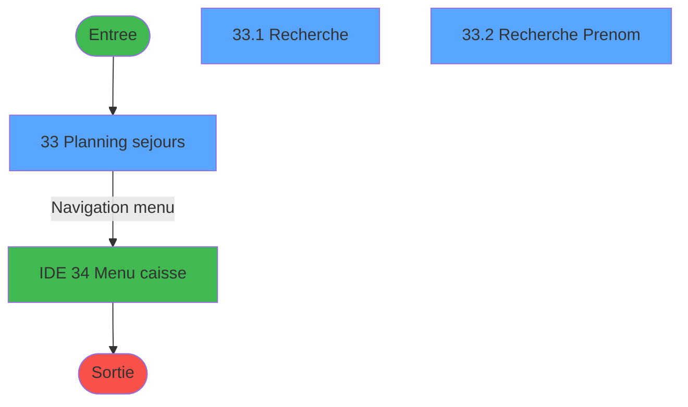
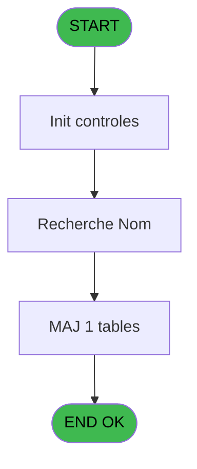
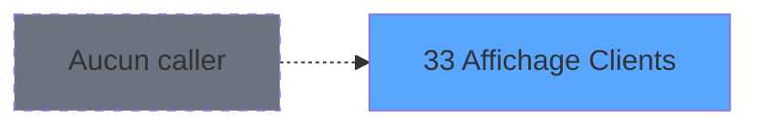
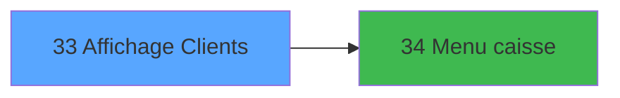

# CAP IDE 33 - Affichage Clients

> **Analyse**: Phases 1-4 2026-02-03 10:20 -> 10:21 (17s) | Assemblage 10:21
> **Pipeline**: V7.2 Enrichi
> **Structure**: 4 onglets (Resume | Ecrans | Donnees | Connexions)

<!-- TAB:Resume -->

## 1. FICHE D'IDENTITE

| Attribut | Valeur |
|----------|--------|
| Projet | CAP |
| IDE Position | 33 |
| Nom Programme | Affichage Clients |
| Fichier source | `Prg_33.xml` |
| Domaine metier | General |
| Taches | 4 (3 ecrans visibles) |
| Tables modifiees | 1 |
| Programmes appeles | 1 |
| :warning: Statut | **ORPHELIN_POTENTIEL** |

## 2. DESCRIPTION FONCTIONNELLE

**Affichage Clients** assure la gestion complete de ce processus.

Le flux de traitement s'organise en **3 blocs fonctionnels** :

- **Consultation** (2 taches) : ecrans de recherche, selection et consultation
- **Calcul** (1 tache) : calculs de montants, stocks ou compteurs
- **Traitement** (1 tache) : traitements metier divers

**Donnees modifiees** : 1 tables en ecriture (fi_complet_______gm_go).

Detail : phases du traitement

#### Phase 1 : Traitement (1 tache)

- **33** - Planning sejours **[[ECRAN]](#ecran-t1)**

Delegue a : [Menu caisse (IDE 34)](CAP-IDE-34.md)

#### Phase 2 : Consultation (2 taches)

- **33.1** - Recherche **[[ECRAN]](#ecran-t2)**
- **33.2** - Recherche Prenom **[[ECRAN]](#ecran-t6)**

#### Phase 3 : Calcul (1 tache)

- **33.3** - Calcul Date Grecques

#### Tables impactees

| Table | Operations | Role metier |
|-------|-----------|-------------|
| fi_complet_______gm_go | **W** (1 usages) |  |

## 3. BLOCS FONCTIONNELS

### 3.1 Traitement (1 tache)

Traitements internes.

---

#### 33 - Planning sejours [[ECRAN]](#ecran-t1)

**Role** : Traitement : Planning sejours.
**Ecran** : 1266 x 297 DLU (MDI) | [Voir mockup](#ecran-t1)
**Delegue a** : [Menu caisse (IDE 34)](CAP-IDE-34.md)

### 3.2 Consultation (2 taches)

Ecrans de recherche et consultation.

---

#### 33.1 - Recherche [[ECRAN]](#ecran-t2)

**Role** : Traitement : Recherche.
**Ecran** : 570 x 92 DLU (Modal) | [Voir mockup](#ecran-t2)
**Variables liees** : E (V Nom Recherche)

---

#### 33.2 - Recherche Prenom [[ECRAN]](#ecran-t6)

**Role** : Traitement : Recherche Prenom.
**Ecran** : 573 x 93 DLU (Modal) | [Voir mockup](#ecran-t6)
**Variables liees** : E (V Nom Recherche)

### 3.3 Calcul (1 tache)

Calculs metier : montants, stocks, compteurs.

---

#### 33.3 - Calcul Date Grecques

**Role** : Calcul : Calcul Date Grecques.
**Variables liees** : B (W1-Date/Heure)

## 5. REGLES METIER

*(Aucune regle metier identifiee)*

## 6. CONTEXTE

- **Appele par**: (aucun)
- **Appelle**: 1 programmes | **Tables**: 4 (W:1 R:1 L:2) | **Taches**: 4 | **Expressions**: 20

<!-- TAB:Ecrans -->

## 8. ECRANS

### 8.1 Forms visibles (3 / 4)

| # | Position | Tache | Nom | Type | Largeur | Hauteur | Bloc |
|---|----------|-------|-----|------|---------|---------|------|
| 1 | 33 | 33 | Planning sejours | MDI | 1266 | 297 | Traitement |
| 2 | 33.1 | 33.1 | Recherche | Modal | 570 | 92 | Consultation |
| 3 | 33.2 | 33.2 | Recherche Prenom | Modal | 573 | 93 | Consultation |

### 8.2 Mockups Ecrans

---

#### 33 - Planning sejours
**Tache** : [33](#t1) | **Type** : MDI | **Dimensions** : 1266 x 297 DLU
**Bloc** : Traitement | **Titre IDE** : Planning sejours

<!-- FORM-DATA:
{
    "width":  1266,
    "vFactor":  8,
    "type":  "MDI",
    "hFactor":  8,
    "controls":  [
                     {
                         "x":  4,
                         "type":  "label",
                         "var":  "",
                         "y":  2,
                         "w":  1251,
                         "fmt":  "",
                         "name":  "",
                         "h":  19,
                         "color":  "",
                         "text":  "",
                         "parent":  null
                     },
                     {
                         "x":  1,
                         "type":  "label",
                         "var":  "",
                         "y":  270,
                         "w":  1260,
                         "fmt":  "",
                         "name":  "",
                         "h":  24,
                         "color":  "",
                         "text":  "",
                         "parent":  null
                     },
                     {
                         "x":  4,
                         "type":  "table",
                         "var":  "",
                         "name":  "",
                         "titleH":  12,
                         "color":  "110",
                         "w":  880,
                         "y":  30,
                         "fmt":  "",
                         "parent":  null,
                         "text":  "",
                         "rowH":  13,
                         "h":  232,
                         "cols":  [
                                      {
                                          "title":  "N°Adhérent",
                                          "layer":  1,
                                          "w":  178
                                      },
                                      {
                                          "title":  "Chambre",
                                          "layer":  2,
                                          "w":  85
                                      },
                                      {
                                          "title":  "Nom",
                                          "layer":  3,
                                          "w":  320
                                      },
                                      {
                                          "title":  "Date début",
                                          "layer":  4,
                                          "w":  123
                                      },
                                      {
                                          "title":  "Date fin",
                                          "layer":  5,
                                          "w":  129
                                      }
                                  ],
                         "rows":  5
                     },
                     {
                         "x":  892,
                         "type":  "label",
                         "var":  "",
                         "y":  92,
                         "w":  345,
                         "fmt":  "",
                         "name":  "",
                         "h":  172,
                         "color":  "195",
                         "text":  "Séjour",
                         "parent":  null
                     },
                     {
                         "x":  904,
                         "type":  "label",
                         "var":  "",
                         "y":  104,
                         "w":  56,
                         "fmt":  "",
                         "name":  "",
                         "h":  10,
                         "color":  "",
                         "text":  "Arrivée",
                         "parent":  23
                     },
                     {
                         "x":  904,
                         "type":  "label",
                         "var":  "",
                         "y":  120,
                         "w":  54,
                         "fmt":  "",
                         "name":  "",
                         "h":  10,
                         "color":  "",
                         "text":  "Départ",
                         "parent":  23
                     },
                     {
                         "x":  901,
                         "type":  "label",
                         "var":  "",
                         "y":  151,
                         "w":  91,
                         "fmt":  "",
                         "name":  "",
                         "h":  10,
                         "color":  "",
                         "text":  "Lieu séjour",
                         "parent":  23
                     },
                     {
                         "x":  904,
                         "type":  "label",
                         "var":  "",
                         "y":  136,
                         "w":  80,
                         "fmt":  "",
                         "name":  "",
                         "h":  10,
                         "color":  "",
                         "text":  "Qualité",
                         "parent":  23
                     },
                     {
                         "x":  903,
                         "type":  "label",
                         "var":  "",
                         "y":  32,
                         "w":  330,
                         "fmt":  "",
                         "name":  "",
                         "h":  52,
                         "color":  "195",
                         "text":  "Nom Recherche",
                         "parent":  null
                     },
                     {
                         "x":  901,
                         "type":  "label",
                         "var":  "",
                         "y":  165,
                         "w":  91,
                         "fmt":  "",
                         "name":  "",
                         "h":  10,
                         "color":  "",
                         "text":  "Age",
                         "parent":  23
                     },
                     {
                         "x":  901,
                         "type":  "label",
                         "var":  "",
                         "y":  180,
                         "w":  91,
                         "fmt":  "",
                         "name":  "",
                         "h":  10,
                         "color":  "",
                         "text":  "Nationalité",
                         "parent":  23
                     },
                     {
                         "x":  901,
                         "type":  "label",
                         "var":  "",
                         "y":  195,
                         "w":  91,
                         "fmt":  "",
                         "name":  "",
                         "h":  10,
                         "color":  "",
                         "text":  "Sexe",
                         "parent":  23
                     },
                     {
                         "x":  1036,
                         "type":  "label",
                         "var":  "",
                         "y":  151,
                         "w":  90,
                         "fmt":  "",
                         "name":  "",
                         "h":  10,
                         "color":  "",
                         "text":  "Logement",
                         "parent":  23
                     },
                     {
                         "x":  273,
                         "type":  "edit",
                         "var":  "",
                         "y":  46,
                         "w":  312,
                         "fmt":  "",
                         "name":  "gm_nom",
                         "h":  8,
                         "color":  "110",
                         "text":  "",
                         "parent":  15
                     },
                     {
                         "x":  11,
                         "type":  "edit",
                         "var":  "",
                         "y":  46,
                         "w":  104,
                         "fmt":  "#10P0",
                         "name":  "arc_heb_num_compte",
                         "h":  8,
                         "color":  "110",
                         "text":  "",
                         "parent":  15
                     },
                     {
                         "x":  140,
                         "type":  "edit",
                         "var":  "",
                         "y":  46,
                         "w":  29,
                         "fmt":  "",
                         "name":  "arc_heb_filiation",
                         "h":  8,
                         "color":  "110",
                         "text":  "",
                         "parent":  15
                     },
                     {
                         "x":  1005,
                         "type":  "edit",
                         "var":  "",
                         "y":  104,
                         "w":  122,
                         "fmt":  "",
                         "name":  "",
                         "h":  10,
                         "color":  "",
                         "text":  "",
                         "parent":  23
                     },
                     {
                         "x":  1174,
                         "type":  "edit",
                         "var":  "",
                         "y":  104,
                         "w":  42,
                         "fmt":  "UUh",
                         "name":  "",
                         "h":  10,
                         "color":  "",
                         "text":  "",
                         "parent":  23
                     },
                     {
                         "x":  1005,
                         "type":  "edit",
                         "var":  "",
                         "y":  120,
                         "w":  122,
                         "fmt":  "",
                         "name":  "",
                         "h":  10,
                         "color":  "",
                         "text":  "",
                         "parent":  23
                     },
                     {
                         "x":  912,
                         "type":  "button",
                         "var":  "",
                         "y":  63,
                         "w":  152,
                         "fmt":  "\u0026Rechercher",
                         "name":  "bouton rech Nom",
                         "h":  18,
                         "color":  "",
                         "text":  "",
                         "parent":  4
                     },
                     {
                         "x":  10,
                         "type":  "edit",
                         "var":  "",
                         "y":  6,
                         "w":  454,
                         "fmt":  "20",
                         "name":  "",
                         "h":  8,
                         "color":  "",
                         "text":  "",
                         "parent":  null
                     },
                     {
                         "x":  1045,
                         "type":  "edit",
                         "var":  "",
                         "y":  7,
                         "w":  203,
                         "fmt":  "WWW DD MMM YYYYT",
                         "name":  "",
                         "h":  8,
                         "color":  "",
                         "text":  "",
                         "parent":  null
                     },
                     {
                         "x":  8,
                         "type":  "button",
                         "var":  "",
                         "y":  273,
                         "w":  152,
                         "fmt":  "\u0026Quitter",
                         "name":  "",
                         "h":  18,
                         "color":  "",
                         "text":  "",
                         "parent":  4
                     },
                     {
                         "x":  593,
                         "type":  "edit",
                         "var":  "",
                         "y":  46,
                         "w":  115,
                         "fmt":  "",
                         "name":  "Date début",
                         "h":  8,
                         "color":  "110",
                         "text":  "",
                         "parent":  15
                     },
                     {
                         "x":  716,
                         "type":  "edit",
                         "var":  "",
                         "y":  46,
                         "w":  125,
                         "fmt":  "",
                         "name":  "arc_heb_date_fin",
                         "h":  8,
                         "color":  "110",
                         "text":  "",
                         "parent":  15
                     },
                     {
                         "x":  1174,
                         "type":  "edit",
                         "var":  "",
                         "y":  120,
                         "w":  42,
                         "fmt":  "UUh",
                         "name":  "arc_heb_heure_debut_A",
                         "h":  10,
                         "color":  "",
                         "text":  "",
                         "parent":  23
                     },
                     {
                         "x":  188,
                         "type":  "edit",
                         "var":  "",
                         "y":  45,
                         "w":  74,
                         "fmt":  "",
                         "name":  "arc_heb_code_logement",
                         "h":  10,
                         "color":  "110",
                         "text":  "",
                         "parent":  15
                     },
                     {
                         "x":  1005,
                         "type":  "edit",
                         "var":  "",
                         "y":  151,
                         "w":  18,
                         "fmt":  "",
                         "name":  "arc_heb_lieu_de_sejour",
                         "h":  10,
                         "color":  "",
                         "text":  "",
                         "parent":  23
                     },
                     {
                         "x":  1005,
                         "type":  "edit",
                         "var":  "",
                         "y":  136,
                         "w":  74,
                         "fmt":  "",
                         "name":  "arc_heb_type_hebergement",
                         "h":  10,
                         "color":  "",
                         "text":  "",
                         "parent":  23
                     },
                     {
                         "x":  1139,
                         "type":  "edit",
                         "var":  "",
                         "y":  136,
                         "w":  74,
                         "fmt":  "",
                         "name":  "arc_heb_complement_type_0001",
                         "h":  10,
                         "color":  "",
                         "text":  "",
                         "parent":  23
                     },
                     {
                         "x":  912,
                         "type":  "edit",
                         "var":  "",
                         "y":  45,
                         "w":  299,
                         "fmt":  "",
                         "name":  "V Nom Recherche",
                         "h":  10,
                         "color":  "",
                         "text":  "",
                         "parent":  56
                     },
                     {
                         "x":  1071,
                         "type":  "button",
                         "var":  "",
                         "y":  63,
                         "w":  152,
                         "fmt":  "\u0026Suivant",
                         "name":  "bouton rech Nom",
                         "h":  18,
                         "color":  "",
                         "text":  "",
                         "parent":  null
                     },
                     {
                         "x":  176,
                         "type":  "button",
                         "var":  "",
                         "y":  273,
                         "w":  152,
                         "fmt":  "Menu \u0026Caisse",
                         "name":  "",
                         "h":  18,
                         "color":  "",
                         "text":  "",
                         "parent":  null
                     },
                     {
                         "x":  1005,
                         "type":  "edit",
                         "var":  "",
                         "y":  165,
                         "w":  31,
                         "fmt":  "",
                         "name":  "arc_heb_age",
                         "h":  10,
                         "color":  "",
                         "text":  "",
                         "parent":  23
                     },
                     {
                         "x":  1005,
                         "type":  "edit",
                         "var":  "",
                         "y":  180,
                         "w":  29,
                         "fmt":  "",
                         "name":  "arc_heb_nationalite",
                         "h":  10,
                         "color":  "",
                         "text":  "",
                         "parent":  23
                     },
                     {
                         "x":  1005,
                         "type":  "edit",
                         "var":  "",
                         "y":  195,
                         "w":  18,
                         "fmt":  "",
                         "name":  "arc_heb_code_sexe",
                         "h":  10,
                         "color":  "",
                         "text":  "",
                         "parent":  23
                     },
                     {
                         "x":  1139,
                         "type":  "edit",
                         "var":  "",
                         "y":  151,
                         "w":  74,
                         "fmt":  "",
                         "name":  "arc_heb_code_logement_0001",
                         "h":  10,
                         "color":  "",
                         "text":  "",
                         "parent":  23
                     }
                 ],
    "taskId":  "33",
    "height":  297
}
-->

<strong>Champs : 20 champs</strong>

| Pos (x,y) | Nom | Variable | Type |
|-----------|-----|----------|------|
| 273,46 | gm_nom | - | edit |
| 11,46 | arc_heb_num_compte | - | edit |
| 140,46 | arc_heb_filiation | - | edit |
| 1005,104 | (sans nom) | - | edit |
| 1174,104 | UUh | - | edit |
| 1005,120 | (sans nom) | - | edit |
| 10,6 | 20 | - | edit |
| 1045,7 | WWW DD MMM YYYYT | - | edit |
| 593,46 | Date début | - | edit |
| 716,46 | arc_heb_date_fin | - | edit |
| 1174,120 | arc_heb_heure_debut_A | - | edit |
| 188,45 | arc_heb_code_logement | - | edit |
| 1005,151 | arc_heb_lieu_de_sejour | - | edit |
| 1005,136 | arc_heb_type_hebergement | - | edit |
| 1139,136 | arc_heb_complement_type_0001 | - | edit |
| 912,45 | V Nom Recherche | - | edit |
| 1005,165 | arc_heb_age | - | edit |
| 1005,180 | arc_heb_nationalite | - | edit |
| 1005,195 | arc_heb_code_sexe | - | edit |
| 1139,151 | arc_heb_code_logement_0001 | - | edit |

<strong>Boutons : 4 boutons</strong>

| Bouton | Pos (x,y) | Action |
|--------|-----------|--------|
| Rechercher | 912,63 | Ouvre la selection |
| Quitter | 8,273 | Quitte le programme |
| Suivant | 1071,63 | Bouton fonctionnel |
| Menu Caisse | 176,273 | Appel [Menu caisse (IDE 34)](CAP-IDE-34.md) |

---

#### 33.1 - Recherche
**Tache** : [33.1](#t2) | **Type** : Modal | **Dimensions** : 570 x 92 DLU
**Bloc** : Consultation | **Titre IDE** : Recherche

<!-- FORM-DATA:
{
    "width":  570,
    "vFactor":  8,
    "type":  "Modal",
    "hFactor":  8,
    "controls":  [
                     {
                         "x":  0,
                         "type":  "label",
                         "var":  "",
                         "y":  65,
                         "w":  566,
                         "fmt":  "",
                         "name":  "",
                         "h":  24,
                         "color":  "",
                         "text":  "",
                         "parent":  null
                     },
                     {
                         "x":  154,
                         "type":  "label",
                         "var":  "",
                         "y":  5,
                         "w":  407,
                         "fmt":  "",
                         "name":  "",
                         "h":  55,
                         "color":  "1",
                         "text":  "",
                         "parent":  null
                     },
                     {
                         "x":  163,
                         "type":  "label",
                         "var":  "",
                         "y":  18,
                         "w":  125,
                         "fmt":  "",
                         "name":  "",
                         "h":  8,
                         "color":  "",
                         "text":  "Nom recherché",
                         "parent":  3
                     },
                     {
                         "x":  163,
                         "type":  "label",
                         "var":  "",
                         "y":  44,
                         "w":  151,
                         "fmt":  "",
                         "name":  "",
                         "h":  8,
                         "color":  "",
                         "text":  "Prénom recherché",
                         "parent":  3
                     },
                     {
                         "x":  317,
                         "type":  "edit",
                         "var":  "",
                         "y":  17,
                         "w":  238,
                         "fmt":  "",
                         "name":  "",
                         "h":  10,
                         "color":  "110",
                         "text":  "",
                         "parent":  3
                     },
                     {
                         "x":  8,
                         "type":  "button",
                         "var":  "",
                         "y":  68,
                         "w":  154,
                         "fmt":  "\u0026Ok",
                         "name":  "",
                         "h":  18,
                         "color":  "",
                         "text":  "",
                         "parent":  null
                     },
                     {
                         "x":  170,
                         "type":  "button",
                         "var":  "",
                         "y":  68,
                         "w":  154,
                         "fmt":  "A\u0026bandonner",
                         "name":  "",
                         "h":  18,
                         "color":  "",
                         "text":  "",
                         "parent":  null
                     },
                     {
                         "x":  5,
                         "type":  "image",
                         "var":  "",
                         "y":  1,
                         "w":  138,
                         "fmt":  "",
                         "name":  "",
                         "h":  61,
                         "color":  "",
                         "text":  "",
                         "parent":  null
                     },
                     {
                         "x":  317,
                         "type":  "edit",
                         "var":  "",
                         "y":  43,
                         "w":  238,
                         "fmt":  "",
                         "name":  "W2-Recherche Prenom",
                         "h":  10,
                         "color":  "110",
                         "text":  "",
                         "parent":  3
                     }
                 ],
    "taskId":  "33.1",
    "height":  92
}
-->

<strong>Champs : 2 champs</strong>

| Pos (x,y) | Nom | Variable | Type |
|-----------|-----|----------|------|
| 317,17 | (sans nom) | - | edit |
| 317,43 | W2-Recherche Prenom | - | edit |

<strong>Boutons : 2 boutons</strong>

| Bouton | Pos (x,y) | Action |
|--------|-----------|--------|
| Ok | 8,68 | Valide la saisie et enregistre |
| Abandonner | 170,68 | Annule et retour au menu |

---

#### 33.2 - Recherche Prenom
**Tache** : [33.2](#t6) | **Type** : Modal | **Dimensions** : 573 x 93 DLU
**Bloc** : Consultation | **Titre IDE** : Recherche Prenom

<!-- FORM-DATA:
{
    "width":  573,
    "vFactor":  8,
    "type":  "Modal",
    "hFactor":  8,
    "controls":  [
                     {
                         "x":  0,
                         "type":  "label",
                         "var":  "",
                         "y":  65,
                         "w":  566,
                         "fmt":  "",
                         "name":  "",
                         "h":  24,
                         "color":  "",
                         "text":  "",
                         "parent":  null
                     },
                     {
                         "x":  154,
                         "type":  "label",
                         "var":  "",
                         "y":  23,
                         "w":  407,
                         "fmt":  "",
                         "name":  "",
                         "h":  27,
                         "color":  "1",
                         "text":  "",
                         "parent":  null
                     },
                     {
                         "x":  163,
                         "type":  "label",
                         "var":  "",
                         "y":  34,
                         "w":  125,
                         "fmt":  "",
                         "name":  "",
                         "h":  8,
                         "color":  "",
                         "text":  "Prénom",
                         "parent":  3
                     },
                     {
                         "x":  300,
                         "type":  "edit",
                         "var":  "",
                         "y":  33,
                         "w":  238,
                         "fmt":  "UX15",
                         "name":  "",
                         "h":  10,
                         "color":  "110",
                         "text":  "",
                         "parent":  3
                     },
                     {
                         "x":  8,
                         "type":  "button",
                         "var":  "",
                         "y":  68,
                         "w":  154,
                         "fmt":  "\u0026Ok",
                         "name":  "",
                         "h":  18,
                         "color":  "",
                         "text":  "",
                         "parent":  null
                     },
                     {
                         "x":  170,
                         "type":  "button",
                         "var":  "",
                         "y":  68,
                         "w":  154,
                         "fmt":  "A\u0026bandonner",
                         "name":  "",
                         "h":  18,
                         "color":  "",
                         "text":  "",
                         "parent":  null
                     },
                     {
                         "x":  5,
                         "type":  "image",
                         "var":  "",
                         "y":  1,
                         "w":  138,
                         "fmt":  "",
                         "name":  "",
                         "h":  61,
                         "color":  "",
                         "text":  "",
                         "parent":  null
                     }
                 ],
    "taskId":  "33.2",
    "height":  93
}
-->

<strong>Champs : 1 champs</strong>

| Pos (x,y) | Nom | Variable | Type |
|-----------|-----|----------|------|
| 300,33 | UX15 | - | edit |

<strong>Boutons : 2 boutons</strong>

| Bouton | Pos (x,y) | Action |
|--------|-----------|--------|
| Ok | 8,68 | Valide la saisie et enregistre |
| Abandonner | 170,68 | Annule et retour au menu |

## 9. NAVIGATION

### 9.1 Enchainement des ecrans

**Detail par enchainement :**

| Depuis | Action | Vers | Retour |
|--------|--------|------|--------|
| Planning sejours | Navigation menu | [Menu caisse (IDE 34)](CAP-IDE-34.md) | Retour ecran |

### 9.3 Structure hierarchique (4 taches)

| Position | Tache | Type | Dimensions | Bloc |
|----------|-------|------|------------|------|
| **33.1** | [**Planning sejours** (33)](#t1) [mockup](#ecran-t1) | MDI | 1266x297 | Traitement |
| **33.2** | [**Recherche** (33.1)](#t2) [mockup](#ecran-t2) | Modal | 570x92 | Consultation |
| 33.2.1 | [Recherche Prenom (33.2)](#t6) [mockup](#ecran-t6) | Modal | 573x93 | |
| **33.3** | [**Calcul Date Grecques** (33.3)](#t7) | MDI | - | Calcul |

### 9.4 Algorigramme

> **Legende**: Vert = START/END OK | Rouge = END KO | Bleu = Decisions
> *Algorigramme auto-genere. Utiliser `/algorigramme` pour une synthese metier detaillee.*

<!-- TAB:Donnees -->

## 10. TABLES

### Tables utilisees (4)

| ID | Nom | Description | Type | R | W | L | Usages |
|----|-----|-------------|------|---|---|---|--------|
| 171 | commentaire______com |  | DB |   |   | L | 1 |
| 315 | fi_complet_______gm_go |  | DB |   | **W** |   | 1 |
| 744 | pv_lieux_vente | Donnees de ventes | DB | R |   |   | 1 |
| 895 | Boo_Praticiens |  | DB |   |   | L | 1 |

### Colonnes par table (1 / 2 tables avec colonnes identifiees)

Table 315 - fi_complet_______gm_go (**W**) - 1 usages

*Table utilisee uniquement en Link ou aucune colonne Real identifiee dans le DataView.*

Table 744 - pv_lieux_vente (R) - 1 usages

| Lettre | Variable | Acces | Type |
|--------|----------|-------|------|
| A | W1-Fin de Tache | R | Logical |
| B | W1-Date/Heure | R | Numeric |
| C | W1-Type Client | R | Alpha |
| D | W1-N° Adherent | R | Numeric |
| E | V Nom Recherche | R | Alpha |
| F | bouton rech Nom | R | Alpha |
| G | v.titre | R | Alpha |

## 11. VARIABLES

### 11.1 Variables de session (2)

Variables persistantes pendant toute la session.

| Lettre | Nom | Type | Usage dans |
|--------|-----|------|-----------|
| E | V Nom Recherche | Alpha | - |
| G | v.titre | Alpha | - |

### 11.2 Autres (5)

Variables diverses.

| Lettre | Nom | Type | Usage dans |
|--------|-----|------|-----------|
| A | W1-Fin de Tache | Logical | - |
| B | W1-Date/Heure | Numeric | - |
| C | W1-Type Client | Alpha | - |
| D | W1-N° Adherent | Numeric | - |
| F | bouton rech Nom | Alpha | - |

## 12. EXPRESSIONS

**20 / 20 expressions decodees (100%)**

### 12.1 Repartition par type

| Type | Expressions | Regles |
|------|-------------|--------|
| CONSTANTE | 4 | 0 |
| DATE | 2 | 0 |
| REFERENCE_VG | 3 | 0 |
| OTHER | 7 | 0 |
| CONDITION | 2 | 0 |
| STRING | 2 | 0 |

### 12.2 Expressions cles par type

#### CONSTANTE (4 expressions)

| Type | IDE | Expression | Regle |
|------|-----|------------|-------|
| CONSTANTE | 13 | `'H'` | - |
| CONSTANTE | 14 | `'C'` | - |
| CONSTANTE | 9 | `'A'` | - |
| CONSTANTE | 10 | `'Z'` | - |

#### DATE (2 expressions)

| Type | IDE | Expression | Regle |
|------|-----|------------|-------|
| DATE | 3 | `Date ()` | - |
| DATE | 2 | `Date ()*100+Hour (Time ())` | - |

#### REFERENCE_VG (3 expressions)

| Type | IDE | Expression | Regle |
|------|-----|------------|-------|
| REFERENCE_VG | 12 | `VG1` | - |
| REFERENCE_VG | 4 | `VG3` | - |
| REFERENCE_VG | 1 | `VG1` | - |

#### OTHER (7 expressions)

| Type | IDE | Expression | Regle |
|------|-----|------------|-------|
| OTHER | 16 | `[CX]` | - |
| OTHER | 17 | `[CZ]` | - |
| OTHER | 18 | `LocateReset(0)` | - |
| OTHER | 15 | `[DA]` | - |
| OTHER | 6 | `[DA]` | - |
| ... | | *+2 autres* | |

#### CONDITION (2 expressions)

| Type | IDE | Expression | Regle |
|------|-----|------------|-------|
| CONDITION | 11 | `Trim (GetParam ('FISCALITEGREC'))='O'` | - |
| CONDITION | 20 | `[EE]<>''` | - |

#### STRING (2 expressions)

| Type | IDE | Expression | Regle |
|------|-----|------------|-------|
| STRING | 19 | `LocateAdd('[DI]'VAR,Trim([EE]))` | - |
| STRING | 5 | `Trim ([BW])` | - |

<!-- TAB:Connexions -->

## 13. GRAPHE D'APPELS

### 13.1 Chaine depuis Main (Callers)

**Chemin**: (pas de callers directs)

### 13.2 Callers

| IDE | Nom Programme | Nb Appels |
|-----|---------------|-----------|
| - | (aucun) | - |

### 13.3 Callees (programmes appeles)

### 13.4 Detail Callees avec contexte

| IDE | Nom Programme | Appels | Contexte |
|-----|---------------|--------|----------|
| [34](CAP-IDE-34.md) | Menu caisse | 1 | Navigation menu |

## 14. RECOMMANDATIONS MIGRATION

### 14.1 Profil du programme

| Metrique | Valeur | Impact migration |
|----------|--------|-----------------|
| Lignes de logique | 126 | Programme compact |
| Expressions | 20 | Peu de logique |
| Tables WRITE | 1 | Impact faible |
| Sous-programmes | 1 | Peu de dependances |
| Ecrans visibles | 3 | Quelques ecrans |
| Code desactive | 0% (0 / 126) | Code sain |
| Regles metier | 0 | Pas de regle identifiee |

### 14.2 Plan de migration par bloc

#### Traitement (1 tache: 1 ecran, 0 traitement)

- **Strategie** : 1 composant(s) UI (Razor/React) avec formulaires et validation.
- 1 sous-programme(s) a migrer ou a reutiliser depuis les services existants.
- Decomposer les taches en services unitaires testables.

#### Consultation (2 taches: 2 ecrans, 0 traitement)

- **Strategie** : Composants de recherche/selection en modales.
- 2 ecrans : Recherche, Recherche Prenom

#### Calcul (1 tache: 0 ecran, 1 traitement)

- **Strategie** : Services de calcul purs (Domain Services).
- Migrer la logique de calcul (stock, compteurs, montants)

### 14.3 Dependances critiques

| Dependance | Type | Appels | Impact |
|------------|------|--------|--------|
| fi_complet_______gm_go | Table WRITE (Database) | 1x | Schema + repository |
| [Menu caisse (IDE 34)](CAP-IDE-34.md) | Sous-programme | 1x | Normale - Navigation menu |

---
*Spec DETAILED generee par Pipeline V7.2 - 2026-02-03 10:21*
