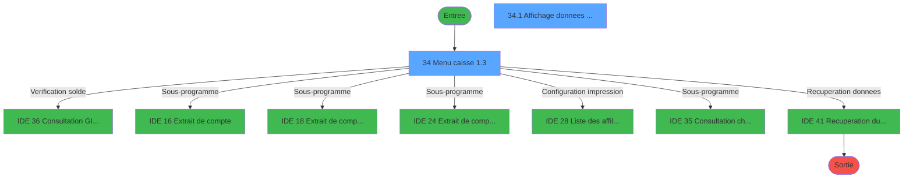
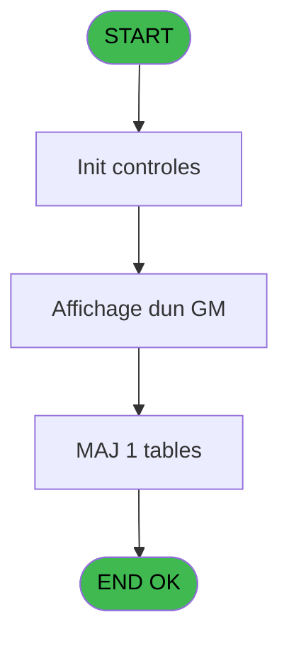
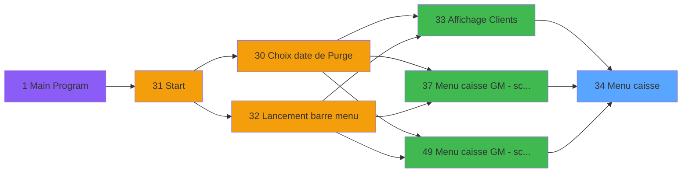
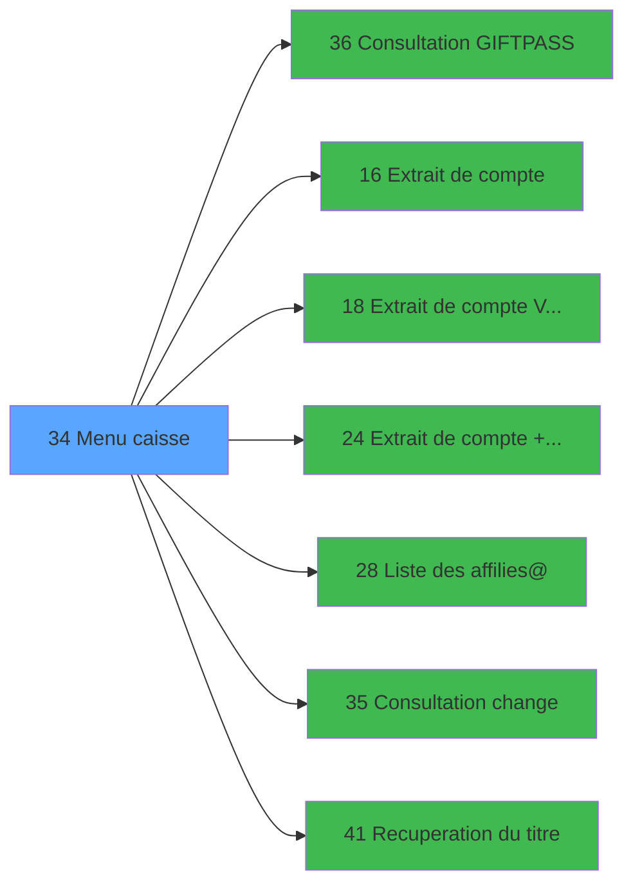

# CAP IDE 34 - Menu caisse

> **Analyse**: Phases 1-4 2026-02-03 10:21 -> 10:21 (15s) | Assemblage 10:21
> **Pipeline**: V7.2 Enrichi
> **Structure**: 4 onglets (Resume | Ecrans | Donnees | Connexions)

<!-- TAB:Resume -->

## 1. FICHE D'IDENTITE

| Attribut | Valeur |
|----------|--------|
| Projet | CAP |
| IDE Position | 34 |
| Nom Programme | Menu caisse |
| Fichier source | `Prg_34.xml` |
| Domaine metier | Caisse |
| Taches | 4 (2 ecrans visibles) |
| Tables modifiees | 1 |
| Programmes appeles | 7 |

## 2. DESCRIPTION FONCTIONNELLE

**Menu caisse** assure la gestion complete de ce processus, accessible depuis [Menu caisse GM - scroll @ (IDE 49)](CAP-IDE-49.md), [Affichage Clients (IDE 33)](CAP-IDE-33.md), [Menu caisse GM - scroll (IDE 37)](CAP-IDE-37.md).

Le flux de traitement s'organise en **3 blocs fonctionnels** :

- **Traitement** (2 taches) : traitements metier divers
- **Saisie** (1 tache) : ecrans de saisie utilisateur (formulaires, champs, donnees)
- **Consultation** (1 tache) : ecrans de recherche, selection et consultation

**Donnees modifiees** : 1 tables en ecriture (Table_948).

**Logique metier** : 3 regles identifiees couvrant conditions metier.

Detail : phases du traitement

#### Phase 1 : Traitement (2 taches)

- **34** - Menu caisse                1.3 **[[ECRAN]](#ecran-t2)**
- **34.3** - Existence change

Delegue a : [Consultation  GIFTPASS (IDE 36)](CAP-IDE-36.md), [Liste des affilies@ (IDE 28)](CAP-IDE-28.md), [Consultation change (IDE 35)](CAP-IDE-35.md), [Recuperation du titre (IDE 41)](CAP-IDE-41.md)

#### Phase 2 : Consultation (1 tache)

- **34.1** - Affichage donnees adherent **[[ECRAN]](#ecran-t11)**

Delegue a : [Recuperation du titre (IDE 41)](CAP-IDE-41.md)

#### Phase 3 : Saisie (1 tache)

- **34.2** - Saisie nbre decimales **[[ECRAN]](#ecran-t25)**

Delegue a : [Extrait de compte  Vente (IDE 18)](CAP-IDE-18.md), [Extrait de compte + ventes (IDE 24)](CAP-IDE-24.md)

#### Tables impactees

| Table | Operations | Role metier |
|-------|-----------|-------------|
| Table_948 | **W** (1 usages) |  |

## 3. BLOCS FONCTIONNELS

### 3.1 Traitement (2 taches)

Traitements internes.

---

#### 34 - Menu caisse                1.3 [[ECRAN]](#ecran-t2)

**Role** : Traitement : Menu caisse                1.3.
**Ecran** : 1291 x 302 DLU (MDI) | [Voir mockup](#ecran-t2)
**Variables liees** : Q (WP1 position-menu)
**Delegue a** : [Consultation  GIFTPASS (IDE 36)](CAP-IDE-36.md), [Liste des affilies@ (IDE 28)](CAP-IDE-28.md), [Consultation change (IDE 35)](CAP-IDE-35.md)

---

#### 34.3 - Existence change

**Role** : Traitement : Existence change.
**Variables liees** : BD (v.existence_change)
**Delegue a** : [Consultation  GIFTPASS (IDE 36)](CAP-IDE-36.md), [Liste des affilies@ (IDE 28)](CAP-IDE-28.md), [Consultation change (IDE 35)](CAP-IDE-35.md)

### 3.2 Consultation (1 tache)

Ecrans de recherche et consultation.

---

#### 34.1 - Affichage donnees adherent [[ECRAN]](#ecran-t11)

**Role** : Reinitialisation : Affichage donnees adherent.
**Ecran** : 797 x 53 DLU (Modal) | [Voir mockup](#ecran-t11)

### 3.3 Saisie (1 tache)

L'operateur saisit les donnees de la transaction via 1 ecran (Saisie nbre decimales).

---

#### 34.2 - Saisie nbre decimales [[ECRAN]](#ecran-t25)

**Role** : Saisie des donnees : Saisie nbre decimales.
**Ecran** : 640 x 184 DLU (Modal) | [Voir mockup](#ecran-t25)
**Delegue a** : [Extrait de compte  Vente (IDE 18)](CAP-IDE-18.md), [Extrait de compte + ventes (IDE 24)](CAP-IDE-24.md)

## 5. REGLES METIER

3 regles identifiees:

### Autres (3 regles)

#### [RM-001] Si P.Masque Montant [E]='O' alors 1 sinon 21)

| Element | Detail |
|---------|--------|
| **Condition** | `P.Masque Montant [E]='O'` |
| **Si vrai** | 1 |
| **Si faux** | 21) |
| **Variables** | E (P.Masque Montant), V (A), Z (E), BC (I) |
| **Expression source** | Expression 5 : `IF (P.Masque Montant [E]='O',1,21)` |
| **Exemple** | Si P.Masque Montant [E]='O' → 1. Sinon → 21) |

#### [RM-002] Traitement conditionnel si P Action [D] est a zero

| Element | Detail |
|---------|--------|
| **Condition** | `P Action [D]=0` |
| **Si vrai** | '' |
| **Si faux** | IF (P.Filial. [C]='S','Solde le','A solder le')) |
| **Variables** | C (P.Filial.), D (P Action), V (A), X (C), Y (D), Z (E), BC (I) |
| **Expression source** | Expression 6 : `IF (P Action [D]=0,'',IF (P.Filial. [C]='S','Solde le','A so` |
| **Exemple** | Si P Action [D]=0 → ''. Sinon → IF (P.Filial. [C]='S','Solde le','A solder le')) |

#### [RM-003] Traitement si P.societé [A] est renseigne

| Element | Detail |
|---------|--------|
| **Condition** | `P.societé [A]<>'' AND P.Nom Village [I]<>''` |
| **Si vrai** | 7 |
| **Si faux** | 1) |
| **Variables** | A (P.societé), I (P.Nom Village), V (A), X (C), Y (D), Z (E), BA (G), BC (I) |
| **Expression source** | Expression 10 : `IF (P.societé [A]<>'' AND P.Nom Village [I]<>'',7,1)` |
| **Exemple** | Si P.societé [A]<>'' AND P.Nom Village [I]<>'' → 7. Sinon → 1) |

## 6. CONTEXTE

- **Appele par**: [Menu caisse GM - scroll @ (IDE 49)](CAP-IDE-49.md), [Affichage Clients (IDE 33)](CAP-IDE-33.md), [Menu caisse GM - scroll (IDE 37)](CAP-IDE-37.md)
- **Appelle**: 7 programmes | **Tables**: 7 (W:1 R:3 L:3) | **Taches**: 4 | **Expressions**: 34

<!-- TAB:Ecrans -->

## 8. ECRANS

### 8.1 Forms visibles (2 / 4)

| # | Position | Tache | Nom | Type | Largeur | Hauteur | Bloc |
|---|----------|-------|-----|------|---------|---------|------|
| 1 | 34.1 | 34 | Menu caisse                1.3 | MDI | 1291 | 302 | Traitement |
| 2 | 34.1.1 | 34.1 | Affichage donnees adherent | Modal | 797 | 53 | Consultation |

### 8.2 Mockups Ecrans

---

#### 34.1 - Menu caisse                1.3
**Tache** : [34](#t2) | **Type** : MDI | **Dimensions** : 1291 x 302 DLU
**Bloc** : Traitement | **Titre IDE** : Menu caisse                1.3

<!-- FORM-DATA:
{
    "width":  1291,
    "vFactor":  8,
    "type":  "MDI",
    "hFactor":  8,
    "controls":  [
                     {
                         "x":  0,
                         "type":  "label",
                         "var":  "",
                         "y":  0,
                         "w":  1287,
                         "fmt":  "",
                         "name":  "",
                         "h":  20,
                         "color":  "",
                         "text":  "",
                         "parent":  null
                     },
                     {
                         "x":  859,
                         "type":  "label",
                         "var":  "",
                         "y":  22,
                         "w":  421,
                         "fmt":  "",
                         "name":  "",
                         "h":  63,
                         "color":  "",
                         "text":  "",
                         "parent":  null
                     },
                     {
                         "x":  859,
                         "type":  "label",
                         "var":  "",
                         "y":  22,
                         "w":  421,
                         "fmt":  "",
                         "name":  "",
                         "h":  45,
                         "color":  "",
                         "text":  "",
                         "parent":  null
                     },
                     {
                         "x":  876,
                         "type":  "label",
                         "var":  "",
                         "y":  28,
                         "w":  127,
                         "fmt":  "",
                         "name":  "",
                         "h":  10,
                         "color":  "142",
                         "text":  " compte",
                         "parent":  null
                     },
                     {
                         "x":  859,
                         "type":  "label",
                         "var":  "",
                         "y":  67,
                         "w":  421,
                         "fmt":  "",
                         "name":  "",
                         "h":  18,
                         "color":  "",
                         "text":  "",
                         "parent":  null
                     },
                     {
                         "x":  373,
                         "type":  "label",
                         "var":  "",
                         "y":  94,
                         "w":  731,
                         "fmt":  "",
                         "name":  "",
                         "h":  161,
                         "color":  "",
                         "text":  "",
                         "parent":  null
                     },
                     {
                         "x":  430,
                         "type":  "label",
                         "var":  "",
                         "y":  118,
                         "w":  268,
                         "fmt":  "",
                         "name":  "",
                         "h":  104,
                         "color":  "",
                         "text":  "",
                         "parent":  15
                     },
                     {
                         "x":  478,
                         "type":  "label",
                         "var":  "",
                         "y":  118,
                         "w":  372,
                         "fmt":  "",
                         "name":  "",
                         "h":  112,
                         "color":  "6",
                         "text":  "",
                         "parent":  15
                     },
                     {
                         "x":  432,
                         "type":  "label",
                         "var":  "",
                         "y":  118,
                         "w":  47,
                         "fmt":  "",
                         "name":  "",
                         "h":  112,
                         "color":  "",
                         "text":  "",
                         "parent":  15
                     },
                     {
                         "x":  490,
                         "type":  "label",
                         "var":  "",
                         "y":  123,
                         "w":  179,
                         "fmt":  "",
                         "name":  "",
                         "h":  10,
                         "color":  "146",
                         "text":  "Extrait de compte",
                         "parent":  19
                     },
                     {
                         "x":  490,
                         "type":  "label",
                         "var":  "",
                         "y":  137,
                         "w":  179,
                         "fmt":  "",
                         "name":  "",
                         "h":  10,
                         "color":  "146",
                         "text":  "Filiation",
                         "parent":  19
                     },
                     {
                         "x":  490,
                         "type":  "label",
                         "var":  "",
                         "y":  151,
                         "w":  179,
                         "fmt":  "",
                         "name":  "",
                         "h":  8,
                         "color":  "146",
                         "text":  "Changer de GM",
                         "parent":  19
                     },
                     {
                         "x":  467,
                         "type":  "label",
                         "var":  "",
                         "y":  238,
                         "w":  120,
                         "fmt":  "",
                         "name":  "",
                         "h":  10,
                         "color":  "",
                         "text":  "Votre choix",
                         "parent":  15
                     },
                     {
                         "x":  0,
                         "type":  "label",
                         "var":  "",
                         "y":  275,
                         "w":  1287,
                         "fmt":  "",
                         "name":  "",
                         "h":  24,
                         "color":  "",
                         "text":  "",
                         "parent":  null
                     },
                     {
                         "x":  490,
                         "type":  "label",
                         "var":  "",
                         "y":  165,
                         "w":  179,
                         "fmt":  "",
                         "name":  "",
                         "h":  8,
                         "color":  "146",
                         "text":  "Facture TVA",
                         "parent":  19
                     },
                     {
                         "x":  490,
                         "type":  "label",
                         "var":  "",
                         "y":  177,
                         "w":  179,
                         "fmt":  "",
                         "name":  "",
                         "h":  10,
                         "color":  "146",
                         "text":  "Ventes",
                         "parent":  19
                     },
                     {
                         "x":  490,
                         "type":  "label",
                         "var":  "",
                         "y":  191,
                         "w":  179,
                         "fmt":  "",
                         "name":  "",
                         "h":  10,
                         "color":  "146",
                         "text":  "Change",
                         "parent":  19
                     },
                     {
                         "x":  490,
                         "type":  "label",
                         "var":  "",
                         "y":  205,
                         "w":  299,
                         "fmt":  "",
                         "name":  "",
                         "h":  10,
                         "color":  "146",
                         "text":  "Gift Pass / Purchase potential",
                         "parent":  19
                     },
                     {
                         "x":  876,
                         "type":  "label",
                         "var":  "",
                         "y":  55,
                         "w":  167,
                         "fmt":  "",
                         "name":  "",
                         "h":  10,
                         "color":  "142",
                         "text":  "Solde Gift Pass",
                         "parent":  null
                     },
                     {
                         "x":  490,
                         "type":  "label",
                         "var":  "",
                         "y":  218,
                         "w":  299,
                         "fmt":  "",
                         "name":  "",
                         "h":  10,
                         "color":  "146",
                         "text":  "Historique des transactions",
                         "parent":  19
                     },
                     {
                         "x":  1062,
                         "type":  "edit",
                         "var":  "",
                         "y":  43,
                         "w":  203,
                         "fmt":  "15",
                         "name":  "",
                         "h":  8,
                         "color":  "142",
                         "text":  "",
                         "parent":  null
                     },
                     {
                         "x":  1156,
                         "type":  "edit",
                         "var":  "",
                         "y":  28,
                         "w":  58,
                         "fmt":  "",
                         "name":  "",
                         "h":  10,
                         "color":  "142",
                         "text":  "",
                         "parent":  null
                     },
                     {
                         "x":  1062,
                         "type":  "edit",
                         "var":  "",
                         "y":  73,
                         "w":  203,
                         "fmt":  "##/##/####",
                         "name":  "",
                         "h":  8,
                         "color":  "142",
                         "text":  "",
                         "parent":  12
                     },
                     {
                         "x":  148,
                         "type":  "edit",
                         "var":  "",
                         "y":  259,
                         "w":  994,
                         "fmt":  "",
                         "name":  "",
                         "h":  10,
                         "color":  "2",
                         "text":  "",
                         "parent":  null
                     },
                     {
                         "x":  611,
                         "type":  "edit",
                         "var":  "",
                         "y":  238,
                         "w":  26,
                         "fmt":  "",
                         "name":  "Choix",
                         "h":  10,
                         "color":  "110",
                         "text":  "",
                         "parent":  15
                     },
                     {
                         "x":  6,
                         "type":  "image",
                         "var":  "",
                         "y":  1,
                         "w":  59,
                         "fmt":  "",
                         "name":  "",
                         "h":  18,
                         "color":  "",
                         "text":  "",
                         "parent":  null
                     },
                     {
                         "x":  75,
                         "type":  "edit",
                         "var":  "",
                         "y":  6,
                         "w":  267,
                         "fmt":  "20",
                         "name":  "",
                         "h":  8,
                         "color":  "",
                         "text":  "",
                         "parent":  null
                     },
                     {
                         "x":  983,
                         "type":  "edit",
                         "var":  "",
                         "y":  6,
                         "w":  304,
                         "fmt":  "WWW DD MMM YYYYT",
                         "name":  "",
                         "h":  8,
                         "color":  "",
                         "text":  "",
                         "parent":  null
                     },
                     {
                         "x":  0,
                         "type":  "image",
                         "var":  "",
                         "y":  23,
                         "w":  86,
                         "fmt":  "",
                         "name":  "",
                         "h":  34,
                         "color":  "",
                         "text":  "",
                         "parent":  null
                     },
                     {
                         "x":  1014,
                         "type":  "edit",
                         "var":  "",
                         "y":  28,
                         "w":  141,
                         "fmt":  "",
                         "name":  "P.Compte",
                         "h":  10,
                         "color":  "142",
                         "text":  "",
                         "parent":  null
                     },
                     {
                         "x":  876,
                         "type":  "edit",
                         "var":  "",
                         "y":  73,
                         "w":  152,
                         "fmt":  "11",
                         "name":  "",
                         "h":  8,
                         "color":  "142",
                         "text":  "",
                         "parent":  12
                     },
                     {
                         "x":  48,
                         "type":  "image",
                         "var":  "",
                         "y":  111,
                         "w":  251,
                         "fmt":  "",
                         "name":  "",
                         "h":  78,
                         "color":  "",
                         "text":  "",
                         "parent":  null
                     },
                     {
                         "x":  881,
                         "type":  "image",
                         "var":  "",
                         "y":  102,
                         "w":  211,
                         "fmt":  "",
                         "name":  "",
                         "h":  92,
                         "color":  "",
                         "text":  "",
                         "parent":  null
                     },
                     {
                         "x":  6,
                         "type":  "button",
                         "var":  "",
                         "y":  278,
                         "w":  168,
                         "fmt":  "\u0026Quitter",
                         "name":  "",
                         "h":  18,
                         "color":  "",
                         "text":  "",
                         "parent":  null
                     },
                     {
                         "x":  438,
                         "type":  "button",
                         "var":  "",
                         "y":  123,
                         "w":  32,
                         "fmt":  "U",
                         "name":  "A",
                         "h":  10,
                         "color":  "",
                         "text":  "",
                         "parent":  null
                     },
                     {
                         "x":  438,
                         "type":  "button",
                         "var":  "",
                         "y":  137,
                         "w":  32,
                         "fmt":  "U",
                         "name":  "B",
                         "h":  10,
                         "color":  "",
                         "text":  "",
                         "parent":  null
                     },
                     {
                         "x":  438,
                         "type":  "button",
                         "var":  "",
                         "y":  151,
                         "w":  32,
                         "fmt":  "U",
                         "name":  "C",
                         "h":  8,
                         "color":  "",
                         "text":  "",
                         "parent":  null
                     },
                     {
                         "x":  438,
                         "type":  "button",
                         "var":  "",
                         "y":  165,
                         "w":  32,
                         "fmt":  "U",
                         "name":  "D",
                         "h":  8,
                         "color":  "",
                         "text":  "",
                         "parent":  null
                     },
                     {
                         "x":  438,
                         "type":  "button",
                         "var":  "",
                         "y":  177,
                         "w":  32,
                         "fmt":  "U",
                         "name":  "E",
                         "h":  10,
                         "color":  "",
                         "text":  "",
                         "parent":  null
                     },
                     {
                         "x":  438,
                         "type":  "button",
                         "var":  "",
                         "y":  191,
                         "w":  32,
                         "fmt":  "U",
                         "name":  "G",
                         "h":  10,
                         "color":  "",
                         "text":  "",
                         "parent":  null
                     },
                     {
                         "x":  438,
                         "type":  "button",
                         "var":  "",
                         "y":  205,
                         "w":  32,
                         "fmt":  "U",
                         "name":  "H",
                         "h":  10,
                         "color":  "",
                         "text":  "",
                         "parent":  20
                     },
                     {
                         "x":  1062,
                         "type":  "edit",
                         "var":  "",
                         "y":  55,
                         "w":  203,
                         "fmt":  "15",
                         "name":  "arc_solde_credit_conso",
                         "h":  10,
                         "color":  "142",
                         "text":  "",
                         "parent":  null
                     },
                     {
                         "x":  438,
                         "type":  "button",
                         "var":  "",
                         "y":  219,
                         "w":  32,
                         "fmt":  "U",
                         "name":  "I",
                         "h":  10,
                         "color":  "",
                         "text":  "",
                         "parent":  20
                     }
                 ],
    "taskId":  "34.1",
    "height":  302
}
-->

<strong>Champs : 10 champs</strong>

| Pos (x,y) | Nom | Variable | Type |
|-----------|-----|----------|------|
| 1062,43 | 15 | - | edit |
| 1156,28 | (sans nom) | - | edit |
| 1062,73 | ##/##/#### | - | edit |
| 148,259 | (sans nom) | - | edit |
| 611,238 | Choix | - | edit |
| 75,6 | 20 | - | edit |
| 983,6 | WWW DD MMM YYYYT | - | edit |
| 1014,28 | P.Compte | - | edit |
| 876,73 | 11 | - | edit |
| 1062,55 | arc_solde_credit_conso | - | edit |

<strong>Boutons : 9 boutons</strong>

| Bouton | Pos (x,y) | Action |
|--------|-----------|--------|
| Quitter | 6,278 | Quitte le programme |
| U | 438,123 | Bouton fonctionnel |
| U | 438,137 | Bouton fonctionnel |
| U | 438,151 | Bouton fonctionnel |
| U | 438,165 | Bouton fonctionnel |
| U | 438,177 | Bouton fonctionnel |
| U | 438,191 | Bouton fonctionnel |
| U | 438,205 | Bouton fonctionnel |
| U | 438,219 | Bouton fonctionnel |

---

#### 34.1.1 - Affichage donnees adherent
**Tache** : [34.1](#t11) | **Type** : Modal | **Dimensions** : 797 x 53 DLU
**Bloc** : Consultation | **Titre IDE** : Affichage donnees adherent

<!-- FORM-DATA:
{
    "width":  797,
    "vFactor":  8,
    "type":  "Modal",
    "hFactor":  8,
    "controls":  [
                     {
                         "x":  0,
                         "type":  "label",
                         "var":  "",
                         "y":  0,
                         "w":  793,
                         "fmt":  "",
                         "name":  "",
                         "h":  52,
                         "color":  "",
                         "text":  "",
                         "parent":  null
                     },
                     {
                         "x":  1,
                         "type":  "label",
                         "var":  "",
                         "y":  1,
                         "w":  789,
                         "fmt":  "",
                         "name":  "",
                         "h":  50,
                         "color":  "",
                         "text":  "",
                         "parent":  null
                     },
                     {
                         "x":  477,
                         "type":  "label",
                         "var":  "",
                         "y":  14,
                         "w":  282,
                         "fmt":  "",
                         "name":  "",
                         "h":  20,
                         "color":  "",
                         "text":  "",
                         "parent":  null
                     },
                     {
                         "x":  479,
                         "type":  "label",
                         "var":  "",
                         "y":  15,
                         "w":  277,
                         "fmt":  "",
                         "name":  "",
                         "h":  18,
                         "color":  "",
                         "text":  "",
                         "parent":  null
                     },
                     {
                         "x":  10,
                         "type":  "label",
                         "var":  "",
                         "y":  27,
                         "w":  62,
                         "fmt":  "",
                         "name":  "",
                         "h":  8,
                         "color":  "2",
                         "text":  "Sejour :",
                         "parent":  null
                     },
                     {
                         "x":  10,
                         "type":  "label",
                         "var":  "",
                         "y":  39,
                         "w":  36,
                         "fmt":  "",
                         "name":  "",
                         "h":  9,
                         "color":  "142",
                         "text":  "Du",
                         "parent":  null
                     },
                     {
                         "x":  243,
                         "type":  "label",
                         "var":  "",
                         "y":  39,
                         "w":  23,
                         "fmt":  "",
                         "name":  "",
                         "h":  9,
                         "color":  "142",
                         "text":  "au",
                         "parent":  null
                     },
                     {
                         "x":  10,
                         "type":  "edit",
                         "var":  "",
                         "y":  3,
                         "w":  752,
                         "fmt":  "42",
                         "name":  "",
                         "h":  10,
                         "color":  "",
                         "text":  "",
                         "parent":  null
                     },
                     {
                         "x":  10,
                         "type":  "edit",
                         "var":  "",
                         "y":  16,
                         "w":  459,
                         "fmt":  "30",
                         "name":  "",
                         "h":  8,
                         "color":  "",
                         "text":  "",
                         "parent":  null
                     },
                     {
                         "x":  489,
                         "type":  "edit",
                         "var":  "",
                         "y":  19,
                         "w":  158,
                         "fmt":  "",
                         "name":  "",
                         "h":  10,
                         "color":  "",
                         "text":  "",
                         "parent":  null
                     },
                     {
                         "x":  658,
                         "type":  "edit",
                         "var":  "",
                         "y":  19,
                         "w":  29,
                         "fmt":  "1",
                         "name":  "",
                         "h":  10,
                         "color":  "",
                         "text":  "",
                         "parent":  null
                     },
                     {
                         "x":  681,
                         "type":  "edit",
                         "var":  "",
                         "y":  19,
                         "w":  58,
                         "fmt":  "",
                         "name":  "",
                         "h":  10,
                         "color":  "",
                         "text":  "",
                         "parent":  null
                     },
                     {
                         "x":  76,
                         "type":  "edit",
                         "var":  "",
                         "y":  27,
                         "w":  98,
                         "fmt":  "8",
                         "name":  "",
                         "h":  8,
                         "color":  "142",
                         "text":  "",
                         "parent":  null
                     },
                     {
                         "x":  50,
                         "type":  "edit",
                         "var":  "",
                         "y":  40,
                         "w":  176,
                         "fmt":  "WWW  ##/##/####Z",
                         "name":  "",
                         "h":  8,
                         "color":  "142",
                         "text":  "",
                         "parent":  null
                     },
                     {
                         "x":  287,
                         "type":  "edit",
                         "var":  "",
                         "y":  40,
                         "w":  176,
                         "fmt":  "WWW  ##/##/####Z",
                         "name":  "",
                         "h":  8,
                         "color":  "142",
                         "text":  "",
                         "parent":  null
                     }
                 ],
    "taskId":  "34.1.1",
    "height":  53
}
-->

<strong>Champs : 8 champs</strong>

| Pos (x,y) | Nom | Variable | Type |
|-----------|-----|----------|------|
| 10,3 | 42 | - | edit |
| 10,16 | 30 | - | edit |
| 489,19 | (sans nom) | - | edit |
| 658,19 | 1 | - | edit |
| 681,19 | (sans nom) | - | edit |
| 76,27 | 8 | - | edit |
| 50,40 | WWW  ##/##/####Z | - | edit |
| 287,40 | WWW  ##/##/####Z | - | edit |

## 9. NAVIGATION

### 9.1 Enchainement des ecrans

**Detail par enchainement :**

| Depuis | Action | Vers | Retour |
|--------|--------|------|--------|
| Menu caisse                1.3 | Verification solde | [Consultation  GIFTPASS (IDE 36)](CAP-IDE-36.md) | Retour ecran |
| Menu caisse                1.3 | Sous-programme | [Extrait de compte (IDE 16)](CAP-IDE-16.md) | Retour ecran |
| Menu caisse                1.3 | Sous-programme | [Extrait de compte  Vente (IDE 18)](CAP-IDE-18.md) | Retour ecran |
| Menu caisse                1.3 | Sous-programme | [Extrait de compte + ventes (IDE 24)](CAP-IDE-24.md) | Retour ecran |
| Menu caisse                1.3 | Configuration impression | [Liste des affilies@ (IDE 28)](CAP-IDE-28.md) | Retour ecran |
| Menu caisse                1.3 | Sous-programme | [Consultation change (IDE 35)](CAP-IDE-35.md) | Retour ecran |
| Menu caisse                1.3 | Recuperation donnees | [Recuperation du titre (IDE 41)](CAP-IDE-41.md) | Retour ecran |

### 9.3 Structure hierarchique (4 taches)

| Position | Tache | Type | Dimensions | Bloc |
|----------|-------|------|------------|------|
| **34.1** | [**Menu caisse                1.3** (34)](#t2) [mockup](#ecran-t2) | MDI | 1291x302 | Traitement |
| 34.1.1 | [Existence change (34.3)](#t26) | - | - | |
| **34.2** | [**Affichage donnees adherent** (34.1)](#t11) [mockup](#ecran-t11) | Modal | 797x53 | Consultation |
| **34.3** | [**Saisie nbre decimales** (34.2)](#t25) [mockup](#ecran-t25) | Modal | 640x184 | Saisie |

### 9.4 Algorigramme

> **Legende**: Vert = START/END OK | Rouge = END KO | Bleu = Decisions
> *Algorigramme auto-genere. Utiliser `/algorigramme` pour une synthese metier detaillee.*

<!-- TAB:Donnees -->

## 10. TABLES

### Tables utilisees (7)

| ID | Nom | Description | Type | R | W | L | Usages |
|----|-----|-------------|------|---|---|---|--------|
| 31 | gm-complet_______gmc |  | DB | R |   |   | 1 |
| 69 | initialisation___ini |  | DB | R |   |   | 1 |
| 130 | fichier_langue |  | DB |   |   | L | 1 |
| 744 | pv_lieux_vente | Donnees de ventes | DB |   |   | L | 1 |
| 747 | regles_securite |  | DB |   |   | L | 1 |
| 749 | password_historique | Historique / journal | DB | R |   |   | 1 |
| 948 | Table_948 |  | MEM |   | **W** |   | 1 |

### Colonnes par table (1 / 4 tables avec colonnes identifiees)

Table 31 - gm-complet_______gmc (R) - 1 usages

*Table utilisee uniquement en Link ou aucune colonne Real identifiee dans le DataView.*

Table 69 - initialisation___ini (R) - 1 usages

*Table utilisee uniquement en Link ou aucune colonne Real identifiee dans le DataView.*

Table 749 - password_historique (R) - 1 usages

| Lettre | Variable | Acces | Type |
|--------|----------|-------|------|
| A | P.societé | R | Alpha |
| B | P.Compte | R | Numeric |
| C | P.Filial. | R | Numeric |
| D | P Action | R | Alpha |
| E | P.Masque Montant | R | Alpha |
| F | P.Masque Cumul | R | Alpha |
| G | P.Nb Décimale | R | Numeric |
| H | P.Code Vilage | R | Alpha |
| I | P.Nom Village | R | Alpha |
| J | P.Devise | R | Alpha |
| K | WP1 code_retour | R | Alpha |
| L | WP1 solde_compte | R | Numeric |
| M | WP1 etat compte | R | Alpha |
| N | WP1 date du solde | R | Date |
| O | WP1 garanti O/N | R | Alpha |
| P | WP1 date fin sejour | R | Date |
| Q | WP1 position-menu | R | Numeric |
| R | WP1 nom-prog | R | Alpha |
| S | W1 message | R | Alpha |
| T | W1 choix action | R | Alpha |
| U | v. titre | R | Alpha |
| V | A | R | Alpha |
| W | B | R | Alpha |
| X | C | R | Alpha |
| Y | D | R | Alpha |
| Z | E | R | Alpha |
| BA | G | R | Alpha |
| BB | H | R | Alpha |
| BC | I | R | Alpha |
| BD | v.existence_change | R | Logical |
| BE | Retour GP | R | Logical |

Table 948 - Table_948 (**W**) - 1 usages

*Table utilisee uniquement en Link ou aucune colonne Real identifiee dans le DataView.*

## 11. VARIABLES

### 11.1 Parametres entrants (10)

Variables recues du programme appelant ([Menu caisse GM - scroll @ (IDE 49)](CAP-IDE-49.md)).

| Lettre | Nom | Type | Usage dans |
|--------|-----|------|-----------|
| A | P.societé | Alpha | 1x parametre entrant |
| B | P.Compte | Numeric | - |
| C | P.Filial. | Numeric | 1x parametre entrant |
| D | P Action | Alpha | 1x parametre entrant |
| E | P.Masque Montant | Alpha | 1x parametre entrant |
| F | P.Masque Cumul | Alpha | - |
| G | P.Nb Décimale | Numeric | - |
| H | P.Code Vilage | Alpha | - |
| I | P.Nom Village | Alpha | 1x parametre entrant |
| J | P.Devise | Alpha | 7x parametre entrant |

### 11.2 Variables de session (2)

Variables persistantes pendant toute la session.

| Lettre | Nom | Type | Usage dans |
|--------|-----|------|-----------|
| U | v. titre | Alpha | - |
| BD | v.existence_change | Logical | - |

### 11.3 Autres (19)

Variables diverses.

| Lettre | Nom | Type | Usage dans |
|--------|-----|------|-----------|
| K | WP1 code_retour | Alpha | 1x refs |
| L | WP1 solde_compte | Numeric | - |
| M | WP1 etat compte | Alpha | - |
| N | WP1 date du solde | Date | - |
| O | WP1 garanti O/N | Alpha | - |
| P | WP1 date fin sejour | Date | - |
| Q | WP1 position-menu | Numeric | - |
| R | WP1 nom-prog | Alpha | - |
| S | W1 message | Alpha | - |
| T | W1 choix action | Alpha | - |
| V | A | Alpha | 8x refs |
| W | B | Alpha | 4x refs |
| X | C | Alpha | 7x refs |
| Y | D | Alpha | 12x refs |
| Z | E | Alpha | 15x refs |
| BA | G | Alpha | 9x refs |
| BB | H | Alpha | 3x refs |
| BC | I | Alpha | 13x refs |
| BE | Retour GP | Logical | - |

Toutes les 31 variables (liste complete)

| Cat | Lettre | Nom Variable | Type |
|-----|--------|--------------|------|
| P0 | **A** | P.societé | Alpha |
| P0 | **B** | P.Compte | Numeric |
| P0 | **C** | P.Filial. | Numeric |
| P0 | **D** | P Action | Alpha |
| P0 | **E** | P.Masque Montant | Alpha |
| P0 | **F** | P.Masque Cumul | Alpha |
| P0 | **G** | P.Nb Décimale | Numeric |
| P0 | **H** | P.Code Vilage | Alpha |
| P0 | **I** | P.Nom Village | Alpha |
| P0 | **J** | P.Devise | Alpha |
| V. | **U** | v. titre | Alpha |
| V. | **BD** | v.existence_change | Logical |
| Autre | **K** | WP1 code_retour | Alpha |
| Autre | **L** | WP1 solde_compte | Numeric |
| Autre | **M** | WP1 etat compte | Alpha |
| Autre | **N** | WP1 date du solde | Date |
| Autre | **O** | WP1 garanti O/N | Alpha |
| Autre | **P** | WP1 date fin sejour | Date |
| Autre | **Q** | WP1 position-menu | Numeric |
| Autre | **R** | WP1 nom-prog | Alpha |
| Autre | **S** | W1 message | Alpha |
| Autre | **T** | W1 choix action | Alpha |
| Autre | **V** | A | Alpha |
| Autre | **W** | B | Alpha |
| Autre | **X** | C | Alpha |
| Autre | **Y** | D | Alpha |
| Autre | **Z** | E | Alpha |
| Autre | **BA** | G | Alpha |
| Autre | **BB** | H | Alpha |
| Autre | **BC** | I | Alpha |
| Autre | **BE** | Retour GP | Logical |

## 12. EXPRESSIONS

**34 / 34 expressions decodees (100%)**

### 12.1 Repartition par type

| Type | Expressions | Regles |
|------|-------------|--------|
| CONDITION | 10 | 3 |
| CONSTANTE | 12 | 0 |
| DATE | 1 | 0 |
| REFERENCE_VG | 3 | 0 |
| OTHER | 6 | 0 |
| CAST_LOGIQUE | 1 | 0 |
| STRING | 1 | 0 |

### 12.2 Expressions cles par type

#### CONDITION (10 expressions)

| Type | IDE | Expression | Regle |
|------|-----|------------|-------|
| CONDITION | 10 | `IF (P.societé [A]<>'' AND P.Nom Village [I]<>'',7,1)` | [RM-003](#rm-RM-003) |
| CONDITION | 6 | `IF (P Action [D]=0,'',IF (P.Filial. [C]='S','Solde le','A solder le'))` | [RM-002](#rm-RM-002) |
| CONDITION | 5 | `IF (P.Masque Montant [E]='O',1,21)` | [RM-001](#rm-RM-001) |
| CONDITION | 16 | `P.Devise [J]='G'` | - |
| CONDITION | 17 | `P.Devise [J]='H'` | - |
| ... | | *+5 autres* | |

#### CONSTANTE (12 expressions)

| Type | IDE | Expression | Regle |
|------|-----|------------|-------|
| CONSTANTE | 25 | `'H'` | - |
| CONSTANTE | 24 | `'G'` | - |
| CONSTANTE | 23 | `'E'` | - |
| CONSTANTE | 34 | `'I'` | - |
| CONSTANTE | 31 | `'99'` | - |
| ... | | *+7 autres* | |

#### DATE (1 expressions)

| Type | IDE | Expression | Regle |
|------|-----|------------|-------|
| DATE | 3 | `Date ()` | - |

#### REFERENCE_VG (3 expressions)

| Type | IDE | Expression | Regle |
|------|-----|------------|-------|
| REFERENCE_VG | 33 | `VG1` | - |
| REFERENCE_VG | 14 | `VG5` | - |
| REFERENCE_VG | 4 | `VG3` | - |

#### OTHER (6 expressions)

| Type | IDE | Expression | Regle |
|------|-----|------------|-------|
| OTHER | 29 | `B [W]` | - |
| OTHER | 30 | `C [X]` | - |
| OTHER | 32 | `G [BA]` | - |
| OTHER | 7 | `Left (E [Z],15)` | - |
| OTHER | 26 | `CtrlGoto ('Choix',0,0)` | - |
| ... | | *+1 autres* | |

#### CAST_LOGIQUE (1 expressions)

| Type | IDE | Expression | Regle |
|------|-----|------------|-------|
| CAST_LOGIQUE | 13 | `'TRUE'LOG` | - |

#### STRING (1 expressions)

| Type | IDE | Expression | Regle |
|------|-----|------------|-------|
| STRING | 1 | `Trim (WP1 code_retour [K])` | - |

### 12.3 Toutes les expressions (34)

Voir les 34 expressions

#### CONDITION (10)

| IDE | Expression Decodee |
|-----|-------------------|
| 5 | `IF (P.Masque Montant [E]='O',1,21)` |
| 6 | `IF (P Action [D]=0,'',IF (P.Filial. [C]='S','Solde le','A solder le'))` |
| 10 | `IF (P.societé [A]<>'' AND P.Nom Village [I]<>'',7,1)` |
| 8 | `P.Devise [J]='B'` |
| 9 | `P.Devise [J]='A'` |
| 12 | `P.Devise [J]='D'` |
| 15 | `P.Devise [J]='C'` |
| 16 | `P.Devise [J]='G'` |
| 17 | `P.Devise [J]='H'` |
| 18 | `P.Devise [J]='E'` |

#### CONSTANTE (12)

| IDE | Expression Decodee |
|-----|-------------------|
| 2 | `5` |
| 11 | `''` |
| 19 | `'A'` |
| 20 | `'B'` |
| 21 | `'C'` |
| 22 | `'D'` |
| 23 | `'E'` |
| 24 | `'G'` |
| 25 | `'H'` |
| 27 | `'S'` |
| 31 | `'99'` |
| 34 | `'I'` |

#### DATE (1)

| IDE | Expression Decodee |
|-----|-------------------|
| 3 | `Date ()` |

#### REFERENCE_VG (3)

| IDE | Expression Decodee |
|-----|-------------------|
| 4 | `VG3` |
| 14 | `VG5` |
| 33 | `VG1` |

#### OTHER (6)

| IDE | Expression Decodee |
|-----|-------------------|
| 7 | `Left (E [Z],15)` |
| 26 | `CtrlGoto ('Choix',0,0)` |
| 28 | `[AU]` |
| 29 | `B [W]` |
| 30 | `C [X]` |
| 32 | `G [BA]` |

#### CAST_LOGIQUE (1)

| IDE | Expression Decodee |
|-----|-------------------|
| 13 | `'TRUE'LOG` |

#### STRING (1)

| IDE | Expression Decodee |
|-----|-------------------|
| 1 | `Trim (WP1 code_retour [K])` |

<!-- TAB:Connexions -->

## 13. GRAPHE D'APPELS

### 13.1 Chaine depuis Main (Callers)

Main -> ... -> [Menu caisse GM - scroll @ (IDE 49)](CAP-IDE-49.md) -> **Menu caisse (IDE 34)**

Main -> ... -> [Affichage Clients (IDE 33)](CAP-IDE-33.md) -> **Menu caisse (IDE 34)**

Main -> ... -> [Menu caisse GM - scroll (IDE 37)](CAP-IDE-37.md) -> **Menu caisse (IDE 34)**

### 13.2 Callers

| IDE | Nom Programme | Nb Appels |
|-----|---------------|-----------|
| [49](CAP-IDE-49.md) | Menu caisse GM - scroll @ | 2 |
| [33](CAP-IDE-33.md) | Affichage Clients | 1 |
| [37](CAP-IDE-37.md) | Menu caisse GM - scroll | 1 |

### 13.3 Callees (programmes appeles)

### 13.4 Detail Callees avec contexte

| IDE | Nom Programme | Appels | Contexte |
|-----|---------------|--------|----------|
| [36](CAP-IDE-36.md) | Consultation  GIFTPASS | 2 | Verification solde |
| [16](CAP-IDE-16.md) | Extrait de compte | 1 | Sous-programme |
| [18](CAP-IDE-18.md) | Extrait de compte  Vente | 1 | Sous-programme |
| [24](CAP-IDE-24.md) | Extrait de compte + ventes | 1 | Sous-programme |
| [28](CAP-IDE-28.md) | Liste des affilies@ | 1 | Configuration impression |
| [35](CAP-IDE-35.md) | Consultation change | 1 | Sous-programme |
| [41](CAP-IDE-41.md) | Recuperation du titre | 1 | Recuperation donnees |

## 14. RECOMMANDATIONS MIGRATION

### 14.1 Profil du programme

| Metrique | Valeur | Impact migration |
|----------|--------|-----------------|
| Lignes de logique | 144 | Programme compact |
| Expressions | 34 | Peu de logique |
| Tables WRITE | 1 | Impact faible |
| Sous-programmes | 7 | Dependances moderees |
| Ecrans visibles | 2 | Quelques ecrans |
| Code desactive | 0.7% (1 / 144) | Code sain |
| Regles metier | 3 | Quelques regles a preserver |

### 14.2 Plan de migration par bloc

#### Traitement (2 taches: 1 ecran, 1 traitement)

- **Strategie** : Orchestrateur avec 1 ecrans (Razor/React) et 1 traitements backend (services).
- Les ecrans deviennent des composants UI, les traitements invisibles deviennent des services injectables.
- 7 sous-programme(s) a migrer ou a reutiliser depuis les services existants.
- Decomposer les taches en services unitaires testables.

#### Consultation (1 tache: 1 ecran, 0 traitement)

- **Strategie** : Composants de recherche/selection en modales.
- 1 ecran : Affichage donnees adherent

#### Saisie (1 tache: 1 ecran, 0 traitement)

- **Strategie** : Formulaire React/Blazor avec validation Zod/FluentValidation.
- Reproduire 1 ecran : Saisie nbre decimales
- Validation temps reel cote client + serveur

### 14.3 Dependances critiques

| Dependance | Type | Appels | Impact |
|------------|------|--------|--------|
| Table_948 | Table WRITE (Memory) | 1x | Schema + repository |
| [Consultation  GIFTPASS (IDE 36)](CAP-IDE-36.md) | Sous-programme | 2x | Haute - Verification solde |
| [Liste des affilies@ (IDE 28)](CAP-IDE-28.md) | Sous-programme | 1x | Normale - Configuration impression |
| [Consultation change (IDE 35)](CAP-IDE-35.md) | Sous-programme | 1x | Normale - Sous-programme |
| [Recuperation du titre (IDE 41)](CAP-IDE-41.md) | Sous-programme | 1x | Normale - Recuperation donnees |
| [Extrait de compte (IDE 16)](CAP-IDE-16.md) | Sous-programme | 1x | Normale - Sous-programme |
| [Extrait de compte  Vente (IDE 18)](CAP-IDE-18.md) | Sous-programme | 1x | Normale - Sous-programme |
| [Extrait de compte + ventes (IDE 24)](CAP-IDE-24.md) | Sous-programme | 1x | Normale - Sous-programme |

---
*Spec DETAILED generee par Pipeline V7.2 - 2026-02-03 10:21*
