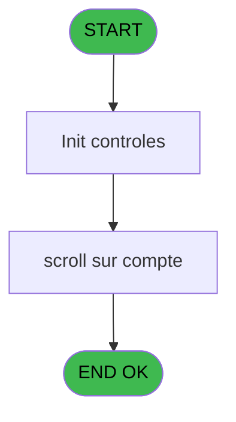
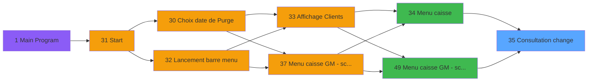

# CAP IDE 35 - Consultation change

> **Analyse**: Phases 1-4 2026-02-03 10:21 -> 10:21 (15s) | Assemblage 10:21
> **Pipeline**: V7.2 Enrichi
> **Structure**: 4 onglets (Resume | Ecrans | Donnees | Connexions)

<!-- TAB:Resume -->

## 1. FICHE D'IDENTITE

| Attribut | Valeur |
|----------|--------|
| Projet | CAP |
| IDE Position | 35 |
| Nom Programme | Consultation change |
| Fichier source | `Prg_35.xml` |
| Domaine metier | Change |
| Taches | 3 (1 ecrans visibles) |
| Tables modifiees | 0 |
| Programmes appeles | 0 |

## 2. DESCRIPTION FONCTIONNELLE

**Consultation change** assure la gestion complete de ce processus, accessible depuis [Menu caisse (IDE 34)](CAP-IDE-34.md), [Menu caisse GM - scroll @ (IDE 49)](CAP-IDE-49.md).

Le flux de traitement s'organise en **2 blocs fonctionnels** :

- **Traitement** (2 taches) : traitements metier divers
- **Calcul** (1 tache) : calculs de montants, stocks ou compteurs

**Logique metier** : 2 regles identifiees couvrant conditions metier.

Detail : phases du traitement

#### Phase 1 : Traitement (2 taches)

- **35** - Consultations change **[[ECRAN]](#ecran-t1)**
- **35.1** - Consultation change **[[ECRAN]](#ecran-t2)**

#### Phase 2 : Calcul (1 tache)

- **35.2** - Reaffichage infos compte

## 3. BLOCS FONCTIONNELS

### 3.1 Traitement (2 taches)

Traitements internes.

---

#### 35 - Consultations change [[ECRAN]](#ecran-t1)

**Role** : Consultation/chargement : Consultations change.
**Ecran** : 640 x 128 DLU (MDI) | [Voir mockup](#ecran-t1)

---

#### 35.1 - Consultation change [[ECRAN]](#ecran-t2)

**Role** : Consultation/chargement : Consultation change.
**Ecran** : 1448 x 242 DLU (MDI) | [Voir mockup](#ecran-t2)

### 3.2 Calcul (1 tache)

Calculs metier : montants, stocks, compteurs.

---

#### 35.2 - Reaffichage infos compte

**Role** : Reinitialisation : Reaffichage infos compte.
**Variables liees** : G (P0 solde compte), H (P0 etat compte)

## 5. REGLES METIER

2 regles identifiees:

### Autres (2 regles)

#### [RM-001] Si Stat (0 alors 'C'MODE) sinon 'T','')

| Element | Detail |
|---------|--------|
| **Condition** | `Stat (0` |
| **Si vrai** | 'C'MODE) |
| **Si faux** | 'T','') |
| **Expression source** | Expression 8 : `IF (Stat (0,'C'MODE),'T','')` |
| **Exemple** | Si Stat (0 → 'C'MODE). Sinon → 'T','') |

#### [RM-002] Si P0 masque mtt [E]='X' alors MlsTrans ('annulee') sinon IF (P0 masque mtt [E]='A',' annulation',IF ([N]='O',MlsTrans ('depuis depôt'),IF ([O]='O',MlsTrans ('lie versement'),''))))

| Element | Detail |
|---------|--------|
| **Condition** | `P0 masque mtt [E]='X'` |
| **Si vrai** | MlsTrans ('annulee') |
| **Si faux** | IF (P0 masque mtt [E]='A',' annulation',IF ([N]='O',MlsTrans ('depuis depôt'),IF ([O]='O',MlsTrans ('lie versement'),'')))) |
| **Variables** | E (P0 masque mtt) |
| **Expression source** | Expression 12 : `IF (P0 masque mtt [E]='X',MlsTrans ('annulee'),IF (P0 masque` |
| **Exemple** | Si P0 masque mtt [E]='X' → MlsTrans ('annulee') |

## 6. CONTEXTE

- **Appele par**: [Menu caisse (IDE 34)](CAP-IDE-34.md), [Menu caisse GM - scroll @ (IDE 49)](CAP-IDE-49.md)
- **Appelle**: 0 programmes | **Tables**: 3 (W:0 R:2 L:1) | **Taches**: 3 | **Expressions**: 16

<!-- TAB:Ecrans -->

## 8. ECRANS

### 8.1 Forms visibles (1 / 3)

| # | Position | Tache | Nom | Type | Largeur | Hauteur | Bloc |
|---|----------|-------|-----|------|---------|---------|------|
| 1 | 35.1 | 35.1 | Consultation change | MDI | 1448 | 242 | Traitement |

### 8.2 Mockups Ecrans

---

#### 35.1 - Consultation change
**Tache** : [35.1](#t2) | **Type** : MDI | **Dimensions** : 1448 x 242 DLU
**Bloc** : Traitement | **Titre IDE** : Consultation change

<!-- FORM-DATA:
{
    "width":  1448,
    "vFactor":  8,
    "type":  "MDI",
    "hFactor":  8,
    "controls":  [
                     {
                         "x":  0,
                         "type":  "label",
                         "var":  "",
                         "y":  0,
                         "w":  1437,
                         "fmt":  "",
                         "name":  "",
                         "h":  24,
                         "color":  "",
                         "text":  "",
                         "parent":  null
                     },
                     {
                         "x":  10,
                         "type":  "table",
                         "var":  "",
                         "name":  "",
                         "titleH":  12,
                         "color":  "110",
                         "w":  1429,
                         "y":  29,
                         "fmt":  "",
                         "parent":  null,
                         "text":  "",
                         "rowH":  13,
                         "h":  156,
                         "cols":  [
                                      {
                                          "title":  "Nom",
                                          "layer":  1,
                                          "w":  280
                                      },
                                      {
                                          "title":  "Date",
                                          "layer":  2,
                                          "w":  144
                                      },
                                      {
                                          "title":  "Heure",
                                          "layer":  3,
                                          "w":  120
                                      },
                                      {
                                          "title":  "Montant",
                                          "layer":  4,
                                          "w":  154
                                      },
                                      {
                                          "title":  "Devise",
                                          "layer":  5,
                                          "w":  147
                                      },
                                      {
                                          "title":  "Mode de Paiement",
                                          "layer":  6,
                                          "w":  160
                                      },
                                      {
                                          "title":  "Taux Change",
                                          "layer":  7,
                                          "w":  185
                                      },
                                      {
                                          "title":  "Etat",
                                          "layer":  8,
                                          "w":  201
                                      }
                                  ],
                         "rows":  8
                     },
                     {
                         "x":  58,
                         "type":  "label",
                         "var":  "",
                         "y":  187,
                         "w":  596,
                         "fmt":  "",
                         "name":  "",
                         "h":  19,
                         "color":  "",
                         "text":  "",
                         "parent":  null
                     },
                     {
                         "x":  777,
                         "type":  "label",
                         "var":  "",
                         "y":  187,
                         "w":  596,
                         "fmt":  "",
                         "name":  "",
                         "h":  19,
                         "color":  "",
                         "text":  "",
                         "parent":  null
                     },
                     {
                         "x":  786,
                         "type":  "label",
                         "var":  "",
                         "y":  194,
                         "w":  83,
                         "fmt":  "",
                         "name":  "",
                         "h":  10,
                         "color":  "42",
                         "text":  "Operateur",
                         "parent":  126
                     },
                     {
                         "x":  0,
                         "type":  "label",
                         "var":  "",
                         "y":  211,
                         "w":  1437,
                         "fmt":  "",
                         "name":  "",
                         "h":  24,
                         "color":  "",
                         "text":  "",
                         "parent":  null
                     },
                     {
                         "x":  10,
                         "type":  "edit",
                         "var":  "",
                         "y":  9,
                         "w":  398,
                         "fmt":  "30",
                         "name":  "",
                         "h":  8,
                         "color":  "",
                         "text":  "",
                         "parent":  null
                     },
                     {
                         "x":  1221,
                         "type":  "edit",
                         "var":  "",
                         "y":  9,
                         "w":  203,
                         "fmt":  "WWW DD MMM YYYYT",
                         "name":  "",
                         "h":  8,
                         "color":  "",
                         "text":  "",
                         "parent":  null
                     },
                     {
                         "x":  22,
                         "type":  "edit",
                         "var":  "",
                         "y":  44,
                         "w":  261,
                         "fmt":  "U40X",
                         "name":  "cd",
                         "h":  8,
                         "color":  "110",
                         "text":  "",
                         "parent":  108
                     },
                     {
                         "x":  296,
                         "type":  "edit",
                         "var":  "",
                         "y":  44,
                         "w":  133,
                         "fmt":  "##/##/####",
                         "name":  "arc_chg_date_operation",
                         "h":  8,
                         "color":  "110",
                         "text":  "",
                         "parent":  108
                     },
                     {
                         "x":  438,
                         "type":  "edit",
                         "var":  "",
                         "y":  44,
                         "w":  111,
                         "fmt":  "HH:MM",
                         "name":  "heure_op",
                         "h":  8,
                         "color":  "110",
                         "text":  "",
                         "parent":  108
                     },
                     {
                         "x":  562,
                         "type":  "edit",
                         "var":  "",
                         "y":  44,
                         "w":  136,
                         "fmt":  "15",
                         "name":  "montant",
                         "h":  8,
                         "color":  "110",
                         "text":  "",
                         "parent":  108
                     },
                     {
                         "x":  869,
                         "type":  "edit",
                         "var":  "",
                         "y":  44,
                         "w":  136,
                         "fmt":  "",
                         "name":  "paiement",
                         "h":  8,
                         "color":  "110",
                         "text":  "",
                         "parent":  108
                     },
                     {
                         "x":  1207,
                         "type":  "edit",
                         "var":  "",
                         "y":  44,
                         "w":  194,
                         "fmt":  "15",
                         "name":  "",
                         "h":  8,
                         "color":  "110",
                         "text":  "",
                         "parent":  108
                     },
                     {
                         "x":  64,
                         "type":  "edit",
                         "var":  "",
                         "y":  194,
                         "w":  578,
                         "fmt":  "40",
                         "name":  "",
                         "h":  8,
                         "color":  "42",
                         "text":  "",
                         "parent":  125
                     },
                     {
                         "x":  922,
                         "type":  "edit",
                         "var":  "",
                         "y":  194,
                         "w":  101,
                         "fmt":  "",
                         "name":  "operateur",
                         "h":  10,
                         "color":  "42",
                         "text":  "",
                         "parent":  126
                     },
                     {
                         "x":  9,
                         "type":  "button",
                         "var":  "",
                         "y":  214,
                         "w":  168,
                         "fmt":  "\u0026Quitter",
                         "name":  "",
                         "h":  18,
                         "color":  "",
                         "text":  "",
                         "parent":  130
                     },
                     {
                         "x":  714,
                         "type":  "edit",
                         "var":  "",
                         "y":  44,
                         "w":  134,
                         "fmt":  "",
                         "name":  "arc_chg_code_devise",
                         "h":  8,
                         "color":  "110",
                         "text":  "",
                         "parent":  108
                     },
                     {
                         "x":  1021,
                         "type":  "edit",
                         "var":  "",
                         "y":  44,
                         "w":  176,
                         "fmt":  "",
                         "name":  "arc_chg_taux_change",
                         "h":  8,
                         "color":  "110",
                         "text":  "",
                         "parent":  108
                     }
                 ],
    "taskId":  "35.1",
    "height":  242
}
-->

<strong>Champs : 12 champs</strong>

| Pos (x,y) | Nom | Variable | Type |
|-----------|-----|----------|------|
| 10,9 | 30 | - | edit |
| 1221,9 | WWW DD MMM YYYYT | - | edit |
| 22,44 | cd | - | edit |
| 296,44 | arc_chg_date_operation | - | edit |
| 438,44 | heure_op | - | edit |
| 562,44 | montant | - | edit |
| 869,44 | paiement | - | edit |
| 1207,44 | 15 | - | edit |
| 64,194 | 40 | - | edit |
| 922,194 | operateur | - | edit |
| 714,44 | arc_chg_code_devise | - | edit |
| 1021,44 | arc_chg_taux_change | - | edit |

<strong>Boutons : 1 boutons</strong>

| Bouton | Pos (x,y) | Action |
|--------|-----------|--------|
| Quitter | 9,214 | Quitte le programme |

## 9. NAVIGATION

Ecran unique: **Consultation change**

### 9.3 Structure hierarchique (3 taches)

| Position | Tache | Type | Dimensions | Bloc |
|----------|-------|------|------------|------|
| **35.1** | [**Consultations change** (35)](#t1) [mockup](#ecran-t1) | MDI | 640x128 | Traitement |
| 35.1.1 | [Consultation change (35.1)](#t2) [mockup](#ecran-t2) | MDI | 1448x242 | |
| **35.2** | [**Reaffichage infos compte** (35.2)](#t4) | MDI | - | Calcul |

### 9.4 Algorigramme

> **Legende**: Vert = START/END OK | Rouge = END KO | Bleu = Decisions
> *Algorigramme auto-genere. Utiliser `/algorigramme` pour une synthese metier detaillee.*

<!-- TAB:Donnees -->

## 10. TABLES

### Tables utilisees (3)

| ID | Nom | Description | Type | R | W | L | Usages |
|----|-----|-------------|------|---|---|---|--------|
| 744 | pv_lieux_vente | Donnees de ventes | DB | R |   |   | 1 |
| 747 | regles_securite |  | DB | R |   |   | 1 |
| 948 | Table_948 |  | MEM |   |   | L | 1 |

### Colonnes par table (0 / 2 tables avec colonnes identifiees)

Table 744 - pv_lieux_vente (R) - 1 usages

*Table utilisee uniquement en Link ou aucune colonne Real identifiee dans le DataView.*

Table 747 - regles_securite (R) - 1 usages

*Table utilisee uniquement en Link ou aucune colonne Real identifiee dans le DataView.*

## 11. VARIABLES

### 11.1 Parametres entrants (10)

Variables recues du programme appelant ([Menu caisse (IDE 34)](CAP-IDE-34.md)).

| Lettre | Nom | Type | Usage dans |
|--------|-----|------|-----------|
| A | P0 societe | Alpha | - |
| B | P0 code_retour | Alpha | - |
| C | P0 code_adherent | Numeric | - |
| D | P0 filiation | Numeric | - |
| E | P0 masque mtt | Alpha | 1x parametre entrant |
| F | P0 nom village | Alpha | 1x parametre entrant |
| G | P0 solde compte | Numeric | - |
| H | P0 etat compte | Alpha | - |
| I | P0 date solde | Date | - |
| J | P0 garanti O/N | Alpha | - |

## 12. EXPRESSIONS

**16 / 16 expressions decodees (100%)**

### 12.1 Repartition par type

| Type | Expressions | Regles |
|------|-------------|--------|
| CONDITION | 2 | 2 |
| DATE | 1 | 0 |
| REFERENCE_VG | 3 | 0 |
| OTHER | 7 | 0 |
| CAST_LOGIQUE | 1 | 0 |
| CONCATENATION | 2 | 0 |

### 12.2 Expressions cles par type

#### CONDITION (2 expressions)

| Type | IDE | Expression | Regle |
|------|-----|------------|-------|
| CONDITION | 12 | `IF (P0 masque mtt [E]='X',MlsTrans ('annulee'),IF (P0 masque mtt [E]='A',' annulation',IF ([N]='O',MlsTrans ('depuis depôt'),IF ([O]='O',MlsTrans ('lie versement'),''))))` | [RM-002](#rm-RM-002) |
| CONDITION | 8 | `IF (Stat (0,'C'MODE),'T','')` | [RM-001](#rm-RM-001) |

#### DATE (1 expressions)

| Type | IDE | Expression | Regle |
|------|-----|------------|-------|
| DATE | 2 | `Date ()` | - |

#### REFERENCE_VG (3 expressions)

| Type | IDE | Expression | Regle |
|------|-----|------------|-------|
| REFERENCE_VG | 14 | `VG1` | - |
| REFERENCE_VG | 3 | `VG3` | - |
| REFERENCE_VG | 1 | `VG1` | - |

#### OTHER (7 expressions)

| Type | IDE | Expression | Regle |
|------|-----|------------|-------|
| OTHER | 10 | `Stat (0,'C'MODE)` | - |
| OTHER | 15 | `{1,1}` | - |
| OTHER | 16 | `{1,3}` | - |
| OTHER | 7 | `P0 nom village [F]` | - |
| OTHER | 4 | `{1,1}` | - |
| ... | | *+2 autres* | |

#### CAST_LOGIQUE (1 expressions)

| Type | IDE | Expression | Regle |
|------|-----|------------|-------|
| CAST_LOGIQUE | 9 | `'TRUE'LOG` | - |

#### CONCATENATION (2 expressions)

| Type | IDE | Expression | Regle |
|------|-----|------------|-------|
| CONCATENATION | 13 | `Trim([S])&'  '&Trim([T])` | - |
| CONCATENATION | 11 | `RTrim ([S])&' '&[T]` | - |

<!-- TAB:Connexions -->

## 13. GRAPHE D'APPELS

### 13.1 Chaine depuis Main (Callers)

Main -> ... -> [Menu caisse (IDE 34)](CAP-IDE-34.md) -> **Consultation change (IDE 35)**

Main -> ... -> [Menu caisse GM - scroll @ (IDE 49)](CAP-IDE-49.md) -> **Consultation change (IDE 35)**

### 13.2 Callers

| IDE | Nom Programme | Nb Appels |
|-----|---------------|-----------|
| [34](CAP-IDE-34.md) | Menu caisse | 1 |
| [49](CAP-IDE-49.md) | Menu caisse GM - scroll @ | 1 |

### 13.3 Callees (programmes appeles)

### 13.4 Detail Callees avec contexte

| IDE | Nom Programme | Appels | Contexte |
|-----|---------------|--------|----------|
| - | (aucun) | - | - |

## 14. RECOMMANDATIONS MIGRATION

### 14.1 Profil du programme

| Metrique | Valeur | Impact migration |
|----------|--------|-----------------|
| Lignes de logique | 66 | Programme compact |
| Expressions | 16 | Peu de logique |
| Tables WRITE | 0 | Impact faible |
| Sous-programmes | 0 | Peu de dependances |
| Ecrans visibles | 1 | Ecran unique ou traitement batch |
| Code desactive | 0% (0 / 66) | Code sain |
| Regles metier | 2 | Quelques regles a preserver |

### 14.2 Plan de migration par bloc

#### Traitement (2 taches: 2 ecrans, 0 traitement)

- **Strategie** : 2 composant(s) UI (Razor/React) avec formulaires et validation.
- Decomposer les taches en services unitaires testables.

#### Calcul (1 tache: 0 ecran, 1 traitement)

- **Strategie** : Services de calcul purs (Domain Services).
- Migrer la logique de calcul (stock, compteurs, montants)

### 14.3 Dependances critiques

| Dependance | Type | Appels | Impact |
|------------|------|--------|--------|

---
*Spec DETAILED generee par Pipeline V7.2 - 2026-02-03 10:21*
