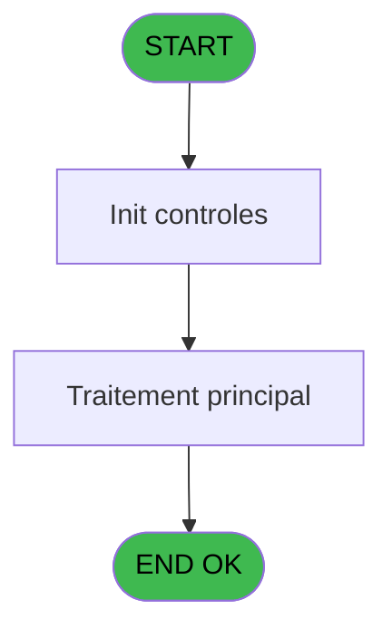
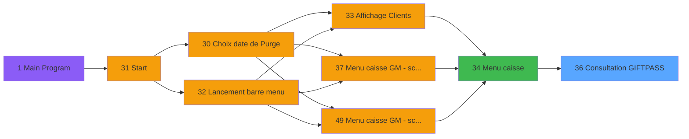

# CAP IDE 36 - Consultation  GIFTPASS

> **Analyse**: Phases 1-4 2026-02-03 10:21 -> 10:22 (16s) | Assemblage 10:22
> **Pipeline**: V7.2 Enrichi
> **Structure**: 4 onglets (Resume | Ecrans | Donnees | Connexions)

<!-- TAB:Resume -->

## 1. FICHE D'IDENTITE

| Attribut | Valeur |
|----------|--------|
| Projet | CAP |
| IDE Position | 36 |
| Nom Programme | Consultation  GIFTPASS |
| Fichier source | `Prg_36.xml` |
| Domaine metier | General |
| Taches | 1 (1 ecrans visibles) |
| Tables modifiees | 0 |
| Programmes appeles | 0 |

## 2. DESCRIPTION FONCTIONNELLE

**Consultation  GIFTPASS** assure la gestion complete de ce processus, accessible depuis [Menu caisse (IDE 34)](CAP-IDE-34.md).

Le flux de traitement s'organise en **1 blocs fonctionnels** :

- **Traitement** (1 tache) : traitements metier divers

## 3. BLOCS FONCTIONNELS

### 3.1 Traitement (1 tache)

Traitements internes.

---

#### 36 - Consultation GIFT PASS [[ECRAN]](#ecran-t1)

**Role** : Consultation/chargement : Consultation GIFT PASS.
**Ecran** : 1448 x 242 DLU | [Voir mockup](#ecran-t1)

## 5. REGLES METIER

*(Aucune regle metier identifiee)*

## 6. CONTEXTE

- **Appele par**: [Menu caisse (IDE 34)](CAP-IDE-34.md)
- **Appelle**: 0 programmes | **Tables**: 0 (W:0 R:0 L:0) | **Taches**: 1 | **Expressions**: 7

<!-- TAB:Ecrans -->

## 8. ECRANS

### 8.1 Forms visibles (1 / 1)

| # | Position | Tache | Nom | Type | Largeur | Hauteur | Bloc |
|---|----------|-------|-----|------|---------|---------|------|
| 1 | 36 | 36 | Consultation GIFT PASS | Type0 | 1448 | 242 | Traitement |

### 8.2 Mockups Ecrans

---

#### 36 - Consultation GIFT PASS
**Tache** : [36](#t1) | **Type** : Type0 | **Dimensions** : 1448 x 242 DLU
**Bloc** : Traitement | **Titre IDE** : Consultation GIFT PASS

<!-- FORM-DATA:
{
    "width":  1448,
    "vFactor":  8,
    "type":  "Type0",
    "hFactor":  8,
    "controls":  [
                     {
                         "x":  8,
                         "type":  "label",
                         "var":  "",
                         "y":  1,
                         "w":  1437,
                         "fmt":  "",
                         "name":  "",
                         "h":  24,
                         "color":  "",
                         "text":  "",
                         "parent":  null
                     },
                     {
                         "x":  8,
                         "type":  "label",
                         "var":  "",
                         "y":  212,
                         "w":  1437,
                         "fmt":  "",
                         "name":  "",
                         "h":  24,
                         "color":  "",
                         "text":  "",
                         "parent":  null
                     },
                     {
                         "x":  66,
                         "type":  "table",
                         "var":  "",
                         "name":  "",
                         "titleH":  12,
                         "color":  "110",
                         "w":  1315,
                         "y":  30,
                         "fmt":  "",
                         "parent":  null,
                         "text":  "",
                         "rowH":  13,
                         "h":  156,
                         "cols":  [
                                      {
                                          "title":  "Crédit/Débit",
                                          "layer":  1,
                                          "w":  122
                                      },
                                      {
                                          "title":  "Date",
                                          "layer":  2,
                                          "w":  124
                                      },
                                      {
                                          "title":  "Heure",
                                          "layer":  3,
                                          "w":  86
                                      },
                                      {
                                          "title":  "Libellé",
                                          "layer":  4,
                                          "w":  247
                                      },
                                      {
                                          "title":  "Libellé Supplementaire",
                                          "layer":  5,
                                          "w":  210
                                      },
                                      {
                                          "title":  "Montant",
                                          "layer":  6,
                                          "w":  192
                                      },
                                      {
                                          "title":  "Paiement",
                                          "layer":  7,
                                          "w":  101
                                      },
                                      {
                                          "title":  "Gift Pass",
                                          "layer":  8,
                                          "w":  201
                                      }
                                  ],
                         "rows":  8
                     },
                     {
                         "x":  66,
                         "type":  "label",
                         "var":  "",
                         "y":  188,
                         "w":  596,
                         "fmt":  "",
                         "name":  "",
                         "h":  19,
                         "color":  "",
                         "text":  "",
                         "parent":  null
                     },
                     {
                         "x":  785,
                         "type":  "label",
                         "var":  "",
                         "y":  188,
                         "w":  596,
                         "fmt":  "",
                         "name":  "",
                         "h":  19,
                         "color":  "",
                         "text":  "",
                         "parent":  null
                     },
                     {
                         "x":  794,
                         "type":  "label",
                         "var":  "",
                         "y":  195,
                         "w":  83,
                         "fmt":  "",
                         "name":  "",
                         "h":  10,
                         "color":  "42",
                         "text":  "Operateur",
                         "parent":  24
                     },
                     {
                         "x":  18,
                         "type":  "edit",
                         "var":  "",
                         "y":  10,
                         "w":  398,
                         "fmt":  "30",
                         "name":  "",
                         "h":  8,
                         "color":  "",
                         "text":  "",
                         "parent":  null
                     },
                     {
                         "x":  1229,
                         "type":  "edit",
                         "var":  "",
                         "y":  10,
                         "w":  203,
                         "fmt":  "WWW DD MMM YYYYT",
                         "name":  "",
                         "h":  8,
                         "color":  "",
                         "text":  "",
                         "parent":  null
                     },
                     {
                         "x":  78,
                         "type":  "edit",
                         "var":  "",
                         "y":  46,
                         "w":  30,
                         "fmt":  "UX",
                         "name":  "cd",
                         "h":  8,
                         "color":  "110",
                         "text":  "",
                         "parent":  5
                     },
                     {
                         "x":  194,
                         "type":  "edit",
                         "var":  "",
                         "y":  46,
                         "w":  112,
                         "fmt":  "##/##/####",
                         "name":  "",
                         "h":  8,
                         "color":  "110",
                         "text":  "",
                         "parent":  5
                     },
                     {
                         "x":  317,
                         "type":  "edit",
                         "var":  "",
                         "y":  46,
                         "w":  74,
                         "fmt":  "HH:MM",
                         "name":  "heure_op",
                         "h":  8,
                         "color":  "110",
                         "text":  "",
                         "parent":  5
                     },
                     {
                         "x":  438,
                         "type":  "edit",
                         "var":  "",
                         "y":  46,
                         "w":  176,
                         "fmt":  "",
                         "name":  "label",
                         "h":  8,
                         "color":  "110",
                         "text":  "",
                         "parent":  5
                     },
                     {
                         "x":  659,
                         "type":  "edit",
                         "var":  "",
                         "y":  46,
                         "w":  176,
                         "fmt":  "U15",
                         "name":  "CTE libelle Supplem.",
                         "h":  8,
                         "color":  "110",
                         "text":  "",
                         "parent":  5
                     },
                     {
                         "x":  862,
                         "type":  "edit",
                         "var":  "",
                         "y":  46,
                         "w":  176,
                         "fmt":  "15",
                         "name":  "montant",
                         "h":  8,
                         "color":  "110",
                         "text":  "",
                         "parent":  5
                     },
                     {
                         "x":  1058,
                         "type":  "edit",
                         "var":  "",
                         "y":  46,
                         "w":  77,
                         "fmt":  "",
                         "name":  "paiement",
                         "h":  8,
                         "color":  "110",
                         "text":  "",
                         "parent":  5
                     },
                     {
                         "x":  1154,
                         "type":  "edit",
                         "var":  "",
                         "y":  46,
                         "w":  176,
                         "fmt":  "15",
                         "name":  "cte_montant_free_extra",
                         "h":  8,
                         "color":  "110",
                         "text":  "",
                         "parent":  5
                     },
                     {
                         "x":  72,
                         "type":  "edit",
                         "var":  "",
                         "y":  195,
                         "w":  578,
                         "fmt":  "40",
                         "name":  "",
                         "h":  8,
                         "color":  "42",
                         "text":  "",
                         "parent":  22
                     },
                     {
                         "x":  930,
                         "type":  "edit",
                         "var":  "",
                         "y":  195,
                         "w":  101,
                         "fmt":  "",
                         "name":  "operateur",
                         "h":  10,
                         "color":  "42",
                         "text":  "",
                         "parent":  24
                     },
                     {
                         "x":  17,
                         "type":  "button",
                         "var":  "",
                         "y":  215,
                         "w":  168,
                         "fmt":  "\u0026Quitter",
                         "name":  "",
                         "h":  18,
                         "color":  "",
                         "text":  "",
                         "parent":  4
                     }
                 ],
    "taskId":  "36",
    "height":  242
}
-->

<strong>Champs : 12 champs</strong>

| Pos (x,y) | Nom | Variable | Type |
|-----------|-----|----------|------|
| 18,10 | 30 | - | edit |
| 1229,10 | WWW DD MMM YYYYT | - | edit |
| 78,46 | cd | - | edit |
| 194,46 | ##/##/#### | - | edit |
| 317,46 | heure_op | - | edit |
| 438,46 | label | - | edit |
| 659,46 | CTE libelle Supplem. | - | edit |
| 862,46 | montant | - | edit |
| 1058,46 | paiement | - | edit |
| 1154,46 | cte_montant_free_extra | - | edit |
| 72,195 | 40 | - | edit |
| 930,195 | operateur | - | edit |

<strong>Boutons : 1 boutons</strong>

| Bouton | Pos (x,y) | Action |
|--------|-----------|--------|
| Quitter | 17,215 | Quitte le programme |

## 9. NAVIGATION

Ecran unique: **Consultation GIFT PASS**

### 9.3 Structure hierarchique (1 tache)

| Position | Tache | Type | Dimensions | Bloc |
|----------|-------|------|------------|------|
| **36.1** | [**Consultation GIFT PASS** (36)](#t1) [mockup](#ecran-t1) | - | 1448x242 | Traitement |

### 9.4 Algorigramme

> **Legende**: Vert = START/END OK | Rouge = END KO | Bleu = Decisions
> *Algorigramme auto-genere. Utiliser `/algorigramme` pour une synthese metier detaillee.*

<!-- TAB:Donnees -->

## 10. TABLES

### Tables utilisees (0)

| ID | Nom | Description | Type | R | W | L | Usages |
|----|-----|-------------|------|---|---|---|--------|

### Colonnes par table (0 / 0 tables avec colonnes identifiees)

## 11. VARIABLES

### 11.1 Parametres entrants (6)

Variables recues du programme appelant ([Menu caisse (IDE 34)](CAP-IDE-34.md)).

| Lettre | Nom | Type | Usage dans |
|--------|-----|------|-----------|
| A | P.Societe | Alpha | - |
| B | P0 code_retour | Alpha | - |
| C | P.Compte | Numeric | 1x parametre entrant |
| D | P.Filiation | Numeric | - |
| E | P.Masque | Alpha | - |
| F | P.Village | Alpha | - |

### 11.2 Autres (18)

Variables diverses.

| Lettre | Nom | Type | Usage dans |
|--------|-----|------|-----------|
| G | cte_montant_free_extra | Numeric | - |
| H | imputation | Numeric | - |
| I | sousimp | Numeric | - |
| J | CPTE | Numeric | - |
| K | FIL | Numeric | - |
| L | DEB | Alpha | 1x refs |
| M | FIN | Alpha | 1x refs |
| N | nom | Unicode | - |
| O | prenom | Unicode | - |
| P | cd | Unicode | 1x refs |
| Q | comptable | Alpha | 1x refs |
| R | date_op | Alpha | - |
| S | heure_op | Alpha | - |
| T | operateur | Unicode | - |
| U | paiement | Unicode | - |
| V | montant | Numeric | - |
| W | label | Unicode | - |
| X | label2 | Unicode | - |

Toutes les 24 variables (liste complete)

| Cat | Lettre | Nom Variable | Type |
|-----|--------|--------------|------|
| P0 | **A** | P.Societe | Alpha |
| P0 | **B** | P0 code_retour | Alpha |
| P0 | **C** | P.Compte | Numeric |
| P0 | **D** | P.Filiation | Numeric |
| P0 | **E** | P.Masque | Alpha |
| P0 | **F** | P.Village | Alpha |
| Autre | **G** | cte_montant_free_extra | Numeric |
| Autre | **H** | imputation | Numeric |
| Autre | **I** | sousimp | Numeric |
| Autre | **J** | CPTE | Numeric |
| Autre | **K** | FIL | Numeric |
| Autre | **L** | DEB | Alpha |
| Autre | **M** | FIN | Alpha |
| Autre | **N** | nom | Unicode |
| Autre | **O** | prenom | Unicode |
| Autre | **P** | cd | Unicode |
| Autre | **Q** | comptable | Alpha |
| Autre | **R** | date_op | Alpha |
| Autre | **S** | heure_op | Alpha |
| Autre | **T** | operateur | Unicode |
| Autre | **U** | paiement | Unicode |
| Autre | **V** | montant | Numeric |
| Autre | **W** | label | Unicode |
| Autre | **X** | label2 | Unicode |

## 12. EXPRESSIONS

**7 / 7 expressions decodees (100%)**

### 12.1 Repartition par type

| Type | Expressions | Regles |
|------|-------------|--------|
| DATE | 2 | 0 |
| FORMAT | 1 | 0 |
| STRING | 2 | 0 |
| CONCATENATION | 2 | 0 |

### 12.2 Expressions cles par type

#### DATE (2 expressions)

| Type | IDE | Expression | Regle |
|------|-----|------------|-------|
| DATE | 4 | `Date()` | - |
| DATE | 1 | `DVal(cd [P],'YYYYMMDD')` | - |

#### FORMAT (1 expressions)

| Type | IDE | Expression | Regle |
|------|-----|------------|-------|
| FORMAT | 7 | `DStr(VG1,'YYYYMMDD')` | - |

#### STRING (2 expressions)

| Type | IDE | Expression | Regle |
|------|-----|------------|-------|
| STRING | 3 | `Trim(P.Compte [C])` | - |
| STRING | 2 | `TVal(comptable [Q],'HHMMSS')` | - |

#### CONCATENATION (2 expressions)

| Type | IDE | Expression | Regle |
|------|-----|------------|-------|
| CONCATENATION | 6 | `Trim(FIN [M])&' '&Trim(DEB [L])` | - |
| CONCATENATION | 5 | `VG3&' '&'('&Trim (Str (VG10,'3'))&') '` | - |

<!-- TAB:Connexions -->

## 13. GRAPHE D'APPELS

### 13.1 Chaine depuis Main (Callers)

Main -> ... -> [Menu caisse (IDE 34)](CAP-IDE-34.md) -> **Consultation  GIFTPASS (IDE 36)**

### 13.2 Callers

| IDE | Nom Programme | Nb Appels |
|-----|---------------|-----------|
| [34](CAP-IDE-34.md) | Menu caisse | 2 |

### 13.3 Callees (programmes appeles)

### 13.4 Detail Callees avec contexte

| IDE | Nom Programme | Appels | Contexte |
|-----|---------------|--------|----------|
| - | (aucun) | - | - |

## 14. RECOMMANDATIONS MIGRATION

### 14.1 Profil du programme

| Metrique | Valeur | Impact migration |
|----------|--------|-----------------|
| Lignes de logique | 26 | Programme compact |
| Expressions | 7 | Peu de logique |
| Tables WRITE | 0 | Impact faible |
| Sous-programmes | 0 | Peu de dependances |
| Ecrans visibles | 1 | Ecran unique ou traitement batch |
| Code desactive | 0% (0 / 26) | Code sain |
| Regles metier | 0 | Pas de regle identifiee |

### 14.2 Plan de migration par bloc

#### Traitement (1 tache: 1 ecran, 0 traitement)

- **Strategie** : 1 composant(s) UI (Razor/React) avec formulaires et validation.
- Decomposer les taches en services unitaires testables.

### 14.3 Dependances critiques

| Dependance | Type | Appels | Impact |
|------------|------|--------|--------|

---
*Spec DETAILED generee par Pipeline V7.2 - 2026-02-03 10:22*
