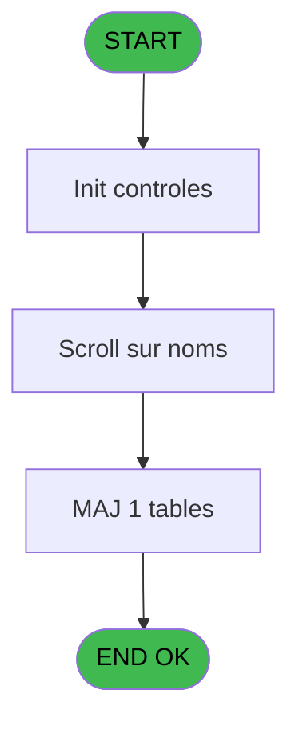
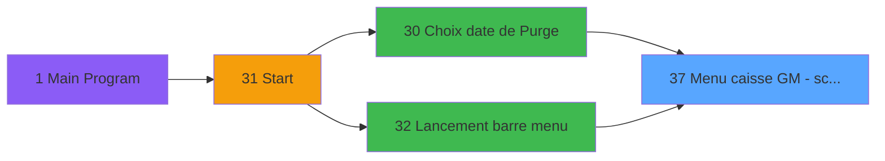
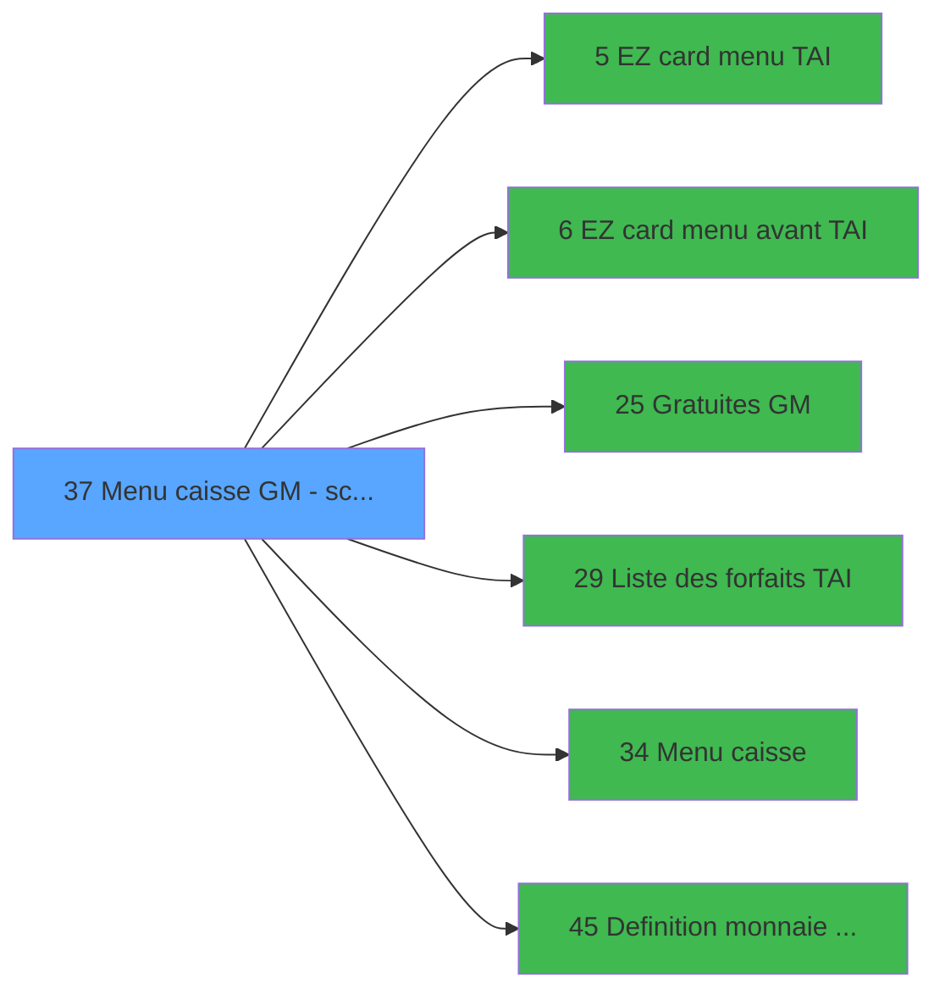

# CAP IDE 37 - Menu caisse GM - scroll

> **Analyse**: Phases 1-4 2026-02-03 10:22 -> 10:22 (14s) | Assemblage 10:22
> **Pipeline**: V7.2 Enrichi
> **Structure**: 4 onglets (Resume | Ecrans | Donnees | Connexions)

<!-- TAB:Resume -->

## 1. FICHE D'IDENTITE

| Attribut | Valeur |
|----------|--------|
| Projet | CAP |
| IDE Position | 37 |
| Nom Programme | Menu caisse GM - scroll |
| Fichier source | `Prg_37.xml` |
| Domaine metier | Caisse |
| Taches | 8 (1 ecrans visibles) |
| Tables modifiees | 1 |
| Programmes appeles | 6 |

## 2. DESCRIPTION FONCTIONNELLE

**Menu caisse GM - scroll** assure la gestion complete de ce processus, accessible depuis [Choix date de Purge (IDE 30)](CAP-IDE-30.md), [Lancement barre menu (IDE 32)](CAP-IDE-32.md).

Le flux de traitement s'organise en **2 blocs fonctionnels** :

- **Traitement** (7 taches) : traitements metier divers
- **Saisie** (1 tache) : ecrans de saisie utilisateur (formulaires, champs, donnees)

**Donnees modifiees** : 1 tables en ecriture (reseau_cloture___rec).

**Logique metier** : 1 regles identifiees couvrant valeurs par defaut.

Detail : phases du traitement

#### Phase 1 : Traitement (7 taches)

- **37** - (sans nom) **[[ECRAN]](#ecran-t1)**
- **37.1** - Station eteinte erreur v1
- **37.2** - Scroll sur noms **[[ECRAN]](#ecran-t3)**
- **37.4** - Lecture paramètres par     1.6
- **37.5** - (sans nom) **[[ECRAN]](#ecran-t9)**
- **37.6** - TAI installe ?
- **37.7** - Station eteinte erreur v1

Delegue a : [EZ card menu TAI (IDE 5)](CAP-IDE-5.md), [EZ card menu avant TAI (IDE 6)](CAP-IDE-6.md), [Gratuites GM (IDE 25)](CAP-IDE-25.md), [Liste des forfaits TAI (IDE 29)](CAP-IDE-29.md), [Menu caisse (IDE 34)](CAP-IDE-34.md)

#### Phase 2 : Saisie (1 tache)

- **37.3** - Saisie nbre decimales **[[ECRAN]](#ecran-t6)**

#### Tables impactees

| Table | Operations | Role metier |
|-------|-----------|-------------|
| reseau_cloture___rec | **W** (2 usages) | Donnees reseau/cloture |

## 3. BLOCS FONCTIONNELS

### 3.1 Traitement (7 taches)

Traitements internes.

---

#### 37 - (sans nom) [[ECRAN]](#ecran-t1)

**Role** : Tache d'orchestration : point d'entree du programme (7 sous-taches). Coordonne l'enchainement des traitements.
**Ecran** : 640 x 184 DLU (MDI) | [Voir mockup](#ecran-t1)

6 sous-taches directes

| Tache | Nom | Bloc |
|-------|-----|------|
| [37.1](#t2) | Station eteinte erreur v1 | Traitement |
| [37.2](#t3) | Scroll sur noms **[[ECRAN]](#ecran-t3)** | Traitement |
| [37.4](#t7) | Lecture paramètres par     1.6 | Traitement |
| [37.5](#t9) | (sans nom) **[[ECRAN]](#ecran-t9)** | Traitement |
| [37.6](#t10) | TAI installe ? | Traitement |
| [37.7](#t13) | Station eteinte erreur v1 | Traitement |

**Delegue a** : [EZ card menu TAI (IDE 5)](CAP-IDE-5.md), [EZ card menu avant TAI (IDE 6)](CAP-IDE-6.md), [Gratuites GM (IDE 25)](CAP-IDE-25.md)

---

#### 37.1 - Station eteinte erreur v1

**Role** : Traitement : Station eteinte erreur v1.
**Delegue a** : [EZ card menu TAI (IDE 5)](CAP-IDE-5.md), [EZ card menu avant TAI (IDE 6)](CAP-IDE-6.md), [Gratuites GM (IDE 25)](CAP-IDE-25.md)

---

#### 37.2 - Scroll sur noms [[ECRAN]](#ecran-t3)

**Role** : Traitement : Scroll sur noms.
**Ecran** : 1198 x 226 DLU (MDI) | [Voir mockup](#ecran-t3)
**Delegue a** : [EZ card menu TAI (IDE 5)](CAP-IDE-5.md), [EZ card menu avant TAI (IDE 6)](CAP-IDE-6.md), [Gratuites GM (IDE 25)](CAP-IDE-25.md)

---

#### 37.4 - Lecture paramètres par     1.6

**Role** : Traitement : Lecture paramètres par     1.6.
**Delegue a** : [EZ card menu TAI (IDE 5)](CAP-IDE-5.md), [EZ card menu avant TAI (IDE 6)](CAP-IDE-6.md), [Gratuites GM (IDE 25)](CAP-IDE-25.md)

---

#### 37.5 - (sans nom) [[ECRAN]](#ecran-t9)

**Role** : Traitement interne.
**Ecran** : 96 x 24 DLU (MDI) | [Voir mockup](#ecran-t9)
**Delegue a** : [EZ card menu TAI (IDE 5)](CAP-IDE-5.md), [EZ card menu avant TAI (IDE 6)](CAP-IDE-6.md), [Gratuites GM (IDE 25)](CAP-IDE-25.md)

---

#### 37.6 - TAI installe ?

**Role** : Traitement : TAI installe ?.
**Delegue a** : [EZ card menu TAI (IDE 5)](CAP-IDE-5.md), [EZ card menu avant TAI (IDE 6)](CAP-IDE-6.md), [Gratuites GM (IDE 25)](CAP-IDE-25.md)

---

#### 37.7 - Station eteinte erreur v1

**Role** : Traitement : Station eteinte erreur v1.
**Delegue a** : [EZ card menu TAI (IDE 5)](CAP-IDE-5.md), [EZ card menu avant TAI (IDE 6)](CAP-IDE-6.md), [Gratuites GM (IDE 25)](CAP-IDE-25.md)

### 3.2 Saisie (1 tache)

L'operateur saisit les donnees de la transaction via 1 ecran (Saisie nbre decimales).

---

#### 37.3 - Saisie nbre decimales [[ECRAN]](#ecran-t6)

**Role** : Saisie des donnees : Saisie nbre decimales.
**Ecran** : 640 x 184 DLU (Modal) | [Voir mockup](#ecran-t6)
**Variables liees** : F (W0 nbre_de_decimales)

## 5. REGLES METIER

1 regles identifiees:

### Saisie (1 regles)

#### [RM-001] Valeur par defaut si Trim([AR])<>'' AND Trim(W0 Date de purge [N]) est vide

| Element | Detail |
|---------|--------|
| **Condition** | `Trim([AR])<>'' AND Trim(W0 Date de purge [N])=''` |
| **Si vrai** | '%'&Trim([AR])&'%' |
| **Si faux** | Trim(W0 Date de purge [N])) |
| **Variables** | N (W0 Date de purge) |
| **Expression source** | Expression 15 : `IF(Trim([AR])<>'' AND Trim(W0 Date de purge [N])='','%'&Trim` |
| **Exemple** | Si Trim([AR])<>'' AND Trim(W0 Date de purge [N])='' → '%'&Trim([AR])&'%'. Sinon → Trim(W0 Date de purge [N])) |
| **Impact** | Bloc Saisie |

## 6. CONTEXTE

- **Appele par**: [Choix date de Purge (IDE 30)](CAP-IDE-30.md), [Lancement barre menu (IDE 32)](CAP-IDE-32.md)
- **Appelle**: 6 programmes | **Tables**: 8 (W:1 R:4 L:3) | **Taches**: 8 | **Expressions**: 18

<!-- TAB:Ecrans -->

## 8. ECRANS

### 8.1 Forms visibles (1 / 8)

| # | Position | Tache | Nom | Type | Largeur | Hauteur | Bloc |
|---|----------|-------|-----|------|---------|---------|------|
| 1 | 37.3 | 37.2 | Scroll sur noms | MDI | 1198 | 226 | Traitement |

### 8.2 Mockups Ecrans

---

#### 37.3 - Scroll sur noms
**Tache** : [37.2](#t3) | **Type** : MDI | **Dimensions** : 1198 x 226 DLU
**Bloc** : Traitement | **Titre IDE** : Scroll sur noms

<!-- FORM-DATA:
{
    "width":  1198,
    "vFactor":  8,
    "type":  "MDI",
    "hFactor":  8,
    "controls":  [
                     {
                         "x":  2,
                         "type":  "label",
                         "var":  "",
                         "y":  0,
                         "w":  1196,
                         "fmt":  "",
                         "name":  "",
                         "h":  21,
                         "color":  "",
                         "text":  "",
                         "parent":  null
                     },
                     {
                         "x":  304,
                         "type":  "table",
                         "var":  "",
                         "name":  "",
                         "titleH":  12,
                         "color":  "110",
                         "w":  829,
                         "y":  32,
                         "fmt":  "",
                         "parent":  null,
                         "text":  "",
                         "rowH":  14,
                         "h":  164,
                         "cols":  [
                                      {
                                          "title":  "TAI",
                                          "layer":  1,
                                          "w":  38
                                      },
                                      {
                                          "title":  "Nom",
                                          "layer":  2,
                                          "w":  330
                                      },
                                      {
                                          "title":  "Prénom",
                                          "layer":  3,
                                          "w":  122
                                      },
                                      {
                                          "title":  "Logement",
                                          "layer":  4,
                                          "w":  93
                                      },
                                      {
                                          "title":  "Sexe",
                                          "layer":  5,
                                          "w":  77
                                      },
                                      {
                                          "title":  "Date Purge",
                                          "layer":  6,
                                          "w":  134
                                      }
                                  ],
                         "rows":  6
                     },
                     {
                         "x":  936,
                         "type":  "label",
                         "var":  "",
                         "y":  49,
                         "w":  18,
                         "fmt":  "",
                         "name":  "",
                         "h":  8,
                         "color":  "145",
                         "text":  "m",
                         "parent":  6
                     },
                     {
                         "x":  350,
                         "type":  "label",
                         "var":  "",
                         "y":  47,
                         "w":  21,
                         "fmt":  "",
                         "name":  "",
                         "h":  8,
                         "color":  "146",
                         "text":  "è",
                         "parent":  6
                     },
                     {
                         "x":  20,
                         "type":  "label",
                         "var":  "",
                         "y":  77,
                         "w":  248,
                         "fmt":  "",
                         "name":  "",
                         "h":  101,
                         "color":  "195",
                         "text":  "Saisie du nom du GM",
                         "parent":  null
                     },
                     {
                         "x":  0,
                         "type":  "label",
                         "var":  "",
                         "y":  199,
                         "w":  1196,
                         "fmt":  "",
                         "name":  "",
                         "h":  24,
                         "color":  "",
                         "text":  "",
                         "parent":  null
                     },
                     {
                         "x":  381,
                         "type":  "edit",
                         "var":  "",
                         "y":  49,
                         "w":  281,
                         "fmt":  "U30",
                         "name":  "",
                         "h":  8,
                         "color":  "110",
                         "text":  "",
                         "parent":  6
                     },
                     {
                         "x":  685,
                         "type":  "edit",
                         "var":  "",
                         "y":  49,
                         "w":  98,
                         "fmt":  "",
                         "name":  "",
                         "h":  8,
                         "color":  "110",
                         "text":  "",
                         "parent":  6
                     },
                     {
                         "x":  67,
                         "type":  "edit",
                         "var":  "",
                         "y":  98,
                         "w":  154,
                         "fmt":  "",
                         "name":  "W1 chaîne_recherchee",
                         "h":  10,
                         "color":  "110",
                         "text":  "",
                         "parent":  20
                     },
                     {
                         "x":  6,
                         "type":  "image",
                         "var":  "",
                         "y":  2,
                         "w":  59,
                         "fmt":  "",
                         "name":  "",
                         "h":  18,
                         "color":  "",
                         "text":  "",
                         "parent":  null
                     },
                     {
                         "x":  75,
                         "type":  "edit",
                         "var":  "",
                         "y":  6,
                         "w":  456,
                         "fmt":  "40",
                         "name":  "",
                         "h":  8,
                         "color":  "",
                         "text":  "",
                         "parent":  null
                     },
                     {
                         "x":  990,
                         "type":  "edit",
                         "var":  "",
                         "y":  7,
                         "w":  203,
                         "fmt":  "WWW DD MMM YYYYT",
                         "name":  "",
                         "h":  8,
                         "color":  "",
                         "text":  "",
                         "parent":  null
                     },
                     {
                         "x":  2,
                         "type":  "image",
                         "var":  "",
                         "y":  23,
                         "w":  83,
                         "fmt":  "",
                         "name":  "",
                         "h":  36,
                         "color":  "",
                         "text":  "",
                         "parent":  null
                     },
                     {
                         "x":  306,
                         "type":  "image",
                         "var":  "",
                         "y":  45,
                         "w":  34,
                         "fmt":  "",
                         "name":  "",
                         "h":  12,
                         "color":  "",
                         "text":  "",
                         "parent":  6
                     },
                     {
                         "x":  306,
                         "type":  "image",
                         "var":  "",
                         "y":  45,
                         "w":  34,
                         "fmt":  "",
                         "name":  "",
                         "h":  12,
                         "color":  "",
                         "text":  "",
                         "parent":  6
                     },
                     {
                         "x":  898,
                         "type":  "edit",
                         "var":  "",
                         "y":  49,
                         "w":  30,
                         "fmt":  "1",
                         "name":  "arc_gmr_sexe",
                         "h":  8,
                         "color":  "110",
                         "text":  "",
                         "parent":  6
                     },
                     {
                         "x":  64,
                         "type":  "image",
                         "var":  "",
                         "y":  129,
                         "w":  160,
                         "fmt":  "",
                         "name":  "",
                         "h":  46,
                         "color":  "",
                         "text":  "",
                         "parent":  null
                     },
                     {
                         "x":  5,
                         "type":  "button",
                         "var":  "",
                         "y":  202,
                         "w":  154,
                         "fmt":  "\u0026Quitter",
                         "name":  "v b Quitter",
                         "h":  18,
                         "color":  "",
                         "text":  "",
                         "parent":  23
                     },
                     {
                         "x":  459,
                         "type":  "button",
                         "var":  "",
                         "y":  202,
                         "w":  162,
                         "fmt":  "U15",
                         "name":  "v b Forfait TAI",
                         "h":  18,
                         "color":  "",
                         "text":  "",
                         "parent":  null
                     },
                     {
                         "x":  690,
                         "type":  "button",
                         "var":  "",
                         "y":  202,
                         "w":  162,
                         "fmt":  "20",
                         "name":  "v b Ezcard",
                         "h":  18,
                         "color":  "",
                         "text":  "",
                         "parent":  null
                     },
                     {
                         "x":  922,
                         "type":  "button",
                         "var":  "",
                         "y":  202,
                         "w":  271,
                         "fmt":  "30",
                         "name":  "v Avance Seminaire",
                         "h":  18,
                         "color":  "",
                         "text":  "",
                         "parent":  null
                     },
                     {
                         "x":  800,
                         "type":  "edit",
                         "var":  "",
                         "y":  49,
                         "w":  67,
                         "fmt":  "",
                         "name":  "arc_heb_nom_logement",
                         "h":  8,
                         "color":  "110",
                         "text":  "",
                         "parent":  6
                     },
                     {
                         "x":  228,
                         "type":  "button",
                         "var":  "",
                         "y":  202,
                         "w":  162,
                         "fmt":  "",
                         "name":  "v b Lance Menu caisse",
                         "h":  18,
                         "color":  "",
                         "text":  "",
                         "parent":  null
                     },
                     {
                         "x":  970,
                         "type":  "edit",
                         "var":  "",
                         "y":  49,
                         "w":  122,
                         "fmt":  "",
                         "name":  "arc_date_purge",
                         "h":  8,
                         "color":  "110",
                         "text":  "",
                         "parent":  6
                     }
                 ],
    "taskId":  "37.3",
    "height":  226
}
-->

<strong>Champs : 8 champs</strong>

| Pos (x,y) | Nom | Variable | Type |
|-----------|-----|----------|------|
| 381,49 | U30 | - | edit |
| 685,49 | (sans nom) | - | edit |
| 67,98 | W1 chaîne_recherchee | - | edit |
| 75,6 | 40 | - | edit |
| 990,7 | WWW DD MMM YYYYT | - | edit |
| 898,49 | arc_gmr_sexe | - | edit |
| 800,49 | arc_heb_nom_logement | - | edit |
| 970,49 | arc_date_purge | - | edit |

<strong>Boutons : 5 boutons</strong>

| Bouton | Pos (x,y) | Action |
|--------|-----------|--------|
| Quitter | 5,202 | Quitte le programme |
| U15 | 459,202 | Bouton fonctionnel |
| 20 | 690,202 | Bouton fonctionnel |
| 30 | 922,202 | Bouton fonctionnel |
| v b Lance Menu caisse | 228,202 | Bouton fonctionnel |

## 9. NAVIGATION

Ecran unique: **Scroll sur noms**

### 9.3 Structure hierarchique (8 taches)

| Position | Tache | Type | Dimensions | Bloc |
|----------|-------|------|------------|------|
| **37.1** | [**(sans nom)** (37)](#t1) [mockup](#ecran-t1) | MDI | 640x184 | Traitement |
| 37.1.1 | [Station eteinte erreur v1 (37.1)](#t2) | MDI | - | |
| 37.1.2 | [Scroll sur noms (37.2)](#t3) [mockup](#ecran-t3) | MDI | 1198x226 | |
| 37.1.3 | [Lecture paramètres par     1.6 (37.4)](#t7) | MDI | - | |
| 37.1.4 | [(sans nom) (37.5)](#t9) [mockup](#ecran-t9) | MDI | 96x24 | |
| 37.1.5 | [TAI installe ? (37.6)](#t10) | MDI | - | |
| 37.1.6 | [Station eteinte erreur v1 (37.7)](#t13) | MDI | - | |
| **37.2** | [**Saisie nbre decimales** (37.3)](#t6) [mockup](#ecran-t6) | Modal | 640x184 | Saisie |

### 9.4 Algorigramme

> **Legende**: Vert = START/END OK | Rouge = END KO | Bleu = Decisions
> *Algorigramme auto-genere. Utiliser `/algorigramme` pour une synthese metier detaillee.*

<!-- TAB:Donnees -->

## 10. TABLES

### Tables utilisees (8)

| ID | Nom | Description | Type | R | W | L | Usages |
|----|-----|-------------|------|---|---|---|--------|
| 23 | reseau_cloture___rec | Donnees reseau/cloture | DB |   | **W** |   | 2 |
| 63 | parametres___par |  | DB | R |   |   | 1 |
| 69 | initialisation___ini |  | DB | R |   |   | 1 |
| 466 | zipbed_code |  | DB | R |   |   | 1 |
| 744 | pv_lieux_vente | Donnees de ventes | DB |   |   | L | 1 |
| 753 | checkout_log |  | DB |   |   | L | 1 |
| 861 | param_gen_mail |  | DB |   |   | L | 1 |
| 895 | Boo_Praticiens |  | DB | R |   |   | 1 |

### Colonnes par table (3 / 5 tables avec colonnes identifiees)

Table 23 - reseau_cloture___rec (**W**) - 2 usages

*Table utilisee uniquement en Link ou aucune colonne Real identifiee dans le DataView.*

Table 63 - parametres___par (R) - 1 usages

*Table utilisee uniquement en Link ou aucune colonne Real identifiee dans le DataView.*

Table 69 - initialisation___ini (R) - 1 usages

*Table utilisee uniquement en Link ou aucune colonne Real identifiee dans le DataView.*

Table 466 - zipbed_code (R) - 1 usages

| Lettre | Variable | Acces | Type |
|--------|----------|-------|------|
| K | W0 code village | R | Alpha |
| Q | WP0 code GM | R | Numeric |
| W | W0 code retour | R | Alpha |

Table 895 - Boo_Praticiens (R) - 1 usages

| Lettre | Variable | Acces | Type |
|--------|----------|-------|------|
| A | v. nom & prenom | R | Alpha |
| B | W1 control_fin | R | Alpha |
| C | W1 chaîne_recherchee | R | Alpha |
| D | Existe Forfait TAI | R | Logical |
| E | W1 Nb enreg client GM | R | Numeric |
| F | V.Select | R | Logical |
| G | V Lien Vente | R | Logical |
| H | v b Forfait TAI | R | Alpha |
| I | v b Ezcard | R | Alpha |
| J | v b Avance Seminaire | R | Alpha |
| K | v b Quitter | R | Alpha |
| L | v b Lance Menu caisse | R | Alpha |

## 11. VARIABLES

### 11.1 Parametres entrants (1)

Variables recues du programme appelant ([Choix date de Purge (IDE 30)](CAP-IDE-30.md)).

| Lettre | Nom | Type | Usage dans |
|--------|-----|------|-----------|
| A | P0 Chaine_de_recherche | Alpha | - |

### 11.2 Variables de travail (18)

Variables internes au programme.

| Lettre | Nom | Type | Usage dans |
|--------|-----|------|-----------|
| B | W0 societe | Alpha | - |
| C | W0 village_à_CAM ? | Alpha | - |
| D | W0 village à tel ? | Alpha | - |
| E | W0 parking ? | Alpha | - |
| F | W0 nbre_de_decimales | Numeric | - |
| G | W0 masque montant | Alpha | - |
| H | W0 masque cumul | Alpha | - |
| I | W0 devise locale | Alpha | - |
| J | W0 tel cam | Alpha | - |
| K | W0 code village | Alpha | - |
| L | W0 nom village | Alpha | - |
| M | W0 Village TAI | Alpha | 4x calcul interne |
| N | W0 Date de purge | Date | 1x calcul interne |
| O | W0 choix action | Alpha | - |
| U | W0 Nom&Prenom | Alpha | - |
| V | W0 utilisation caiss | Alpha | - |
| W | W0 code retour | Alpha | - |
| X | W0 date start TAI | Date | - |

### 11.3 Autres (5)

Variables diverses.

| Lettre | Nom | Type | Usage dans |
|--------|-----|------|-----------|
| P | WP0chaînerecherche | Alpha | - |
| Q | WP0 code GM | Numeric | - |
| R | WP0 filiation | Numeric | - |
| S | WP0 prog d'appel | Alpha | 2x refs |
| T | WP0 fonction-call | Alpha | - |

Toutes les 24 variables (liste complete)

| Cat | Lettre | Nom Variable | Type |
|-----|--------|--------------|------|
| P0 | **A** | P0 Chaine_de_recherche | Alpha |
| W0 | **B** | W0 societe | Alpha |
| W0 | **C** | W0 village_à_CAM ? | Alpha |
| W0 | **D** | W0 village à tel ? | Alpha |
| W0 | **E** | W0 parking ? | Alpha |
| W0 | **F** | W0 nbre_de_decimales | Numeric |
| W0 | **G** | W0 masque montant | Alpha |
| W0 | **H** | W0 masque cumul | Alpha |
| W0 | **I** | W0 devise locale | Alpha |
| W0 | **J** | W0 tel cam | Alpha |
| W0 | **K** | W0 code village | Alpha |
| W0 | **L** | W0 nom village | Alpha |
| W0 | **M** | W0 Village TAI | Alpha |
| W0 | **N** | W0 Date de purge | Date |
| W0 | **O** | W0 choix action | Alpha |
| W0 | **U** | W0 Nom&Prenom | Alpha |
| W0 | **V** | W0 utilisation caiss | Alpha |
| W0 | **W** | W0 code retour | Alpha |
| W0 | **X** | W0 date start TAI | Date |
| Autre | **P** | WP0chaînerecherche | Alpha |
| Autre | **Q** | WP0 code GM | Numeric |
| Autre | **R** | WP0 filiation | Numeric |
| Autre | **S** | WP0 prog d'appel | Alpha |
| Autre | **T** | WP0 fonction-call | Alpha |

## 12. EXPRESSIONS

**18 / 18 expressions decodees (100%)**

### 12.1 Repartition par type

| Type | Expressions | Regles |
|------|-------------|--------|
| CONDITION | 8 | 5 |
| CONSTANTE | 6 | 0 |
| NEGATION | 2 | 0 |
| OTHER | 1 | 0 |
| REFERENCE_VG | 1 | 0 |

### 12.2 Expressions cles par type

#### CONDITION (8 expressions)

| Type | IDE | Expression | Regle |
|------|-----|------------|-------|
| CONDITION | 15 | `IF(Trim([AR])<>'' AND Trim(W0 Date de purge [N])='','%'&Trim([AR])&'%',Trim(W0 Date de purge [N]))` | [RM-001](#rm-RM-001) |
| CONDITION | 5 | `W0 Village TAI [M]='C'` | - |
| CONDITION | 9 | `WP0 prog d'appel [S]='O'` | - |
| CONDITION | 10 | `WP0 prog d'appel [S]<>'O'` | - |
| CONDITION | 4 | `W0 Village TAI [M]='F' AND GetParam ('CHANGEAPPLICATION')='N'` | - |
| ... | | *+3 autres* | |

#### CONSTANTE (6 expressions)

| Type | IDE | Expression | Regle |
|------|-----|------------|-------|
| CONSTANTE | 8 | `'S'` | - |
| CONSTANTE | 11 | `'F'` | - |
| CONSTANTE | 12 | `'00'` | - |
| CONSTANTE | 1 | `'C'` | - |
| CONSTANTE | 6 | `'M'` | - |
| ... | | *+1 autres* | |

#### NEGATION (2 expressions)

| Type | IDE | Expression | Regle |
|------|-----|------------|-------|
| NEGATION | 17 | `NOT VG8` | - |
| NEGATION | 13 | `NOT (VG4)` | - |

#### OTHER (1 expressions)

| Type | IDE | Expression | Regle |
|------|-----|------------|-------|
| OTHER | 16 | `[AS]` | - |

#### REFERENCE_VG (1 expressions)

| Type | IDE | Expression | Regle |
|------|-----|------------|-------|
| REFERENCE_VG | 18 | `VG8` | - |

<!-- TAB:Connexions -->

## 13. GRAPHE D'APPELS

### 13.1 Chaine depuis Main (Callers)

Main -> ... -> [Choix date de Purge (IDE 30)](CAP-IDE-30.md) -> **Menu caisse GM - scroll (IDE 37)**

Main -> ... -> [Lancement barre menu (IDE 32)](CAP-IDE-32.md) -> **Menu caisse GM - scroll (IDE 37)**

### 13.2 Callers

| IDE | Nom Programme | Nb Appels |
|-----|---------------|-----------|
| [30](CAP-IDE-30.md) | Choix date de Purge | 2 |
| [32](CAP-IDE-32.md) | Lancement barre menu | 1 |

### 13.3 Callees (programmes appeles)

### 13.4 Detail Callees avec contexte

| IDE | Nom Programme | Appels | Contexte |
|-----|---------------|--------|----------|
| [5](CAP-IDE-5.md) | EZ card menu TAI | 1 | Navigation menu |
| [6](CAP-IDE-6.md) | EZ card menu avant TAI | 1 | Navigation menu |
| [25](CAP-IDE-25.md) | Gratuites GM | 1 | Sous-programme |
| [29](CAP-IDE-29.md) | Liste des forfaits TAI | 1 | Configuration impression |
| [34](CAP-IDE-34.md) | Menu caisse | 1 | Navigation menu |
| [45](CAP-IDE-45.md) | Definition monnaie d'enregist | 1 | Reinitialisation |

## 14. RECOMMANDATIONS MIGRATION

### 14.1 Profil du programme

| Metrique | Valeur | Impact migration |
|----------|--------|-----------------|
| Lignes de logique | 204 | Taille moyenne |
| Expressions | 18 | Peu de logique |
| Tables WRITE | 1 | Impact faible |
| Sous-programmes | 6 | Dependances moderees |
| Ecrans visibles | 1 | Ecran unique ou traitement batch |
| Code desactive | 1.5% (3 / 204) | Code sain |
| Regles metier | 1 | Quelques regles a preserver |

### 14.2 Plan de migration par bloc

#### Traitement (7 taches: 3 ecrans, 4 traitements)

- **Strategie** : Orchestrateur avec 3 ecrans (Razor/React) et 4 traitements backend (services).
- Les ecrans deviennent des composants UI, les traitements invisibles deviennent des services injectables.
- 6 sous-programme(s) a migrer ou a reutiliser depuis les services existants.
- Decomposer les taches en services unitaires testables.

#### Saisie (1 tache: 1 ecran, 0 traitement)

- **Strategie** : Formulaire React/Blazor avec validation Zod/FluentValidation.
- Reproduire 1 ecran : Saisie nbre decimales
- Validation temps reel cote client + serveur

### 14.3 Dependances critiques

| Dependance | Type | Appels | Impact |
|------------|------|--------|--------|
| reseau_cloture___rec | Table WRITE (Database) | 2x | Schema + repository |
| [Liste des forfaits TAI (IDE 29)](CAP-IDE-29.md) | Sous-programme | 1x | Normale - Configuration impression |
| [Menu caisse (IDE 34)](CAP-IDE-34.md) | Sous-programme | 1x | Normale - Navigation menu |
| [Definition monnaie d'enregist (IDE 45)](CAP-IDE-45.md) | Sous-programme | 1x | Normale - Reinitialisation |
| [EZ card menu TAI (IDE 5)](CAP-IDE-5.md) | Sous-programme | 1x | Normale - Navigation menu |
| [EZ card menu avant TAI (IDE 6)](CAP-IDE-6.md) | Sous-programme | 1x | Normale - Navigation menu |
| [Gratuites GM (IDE 25)](CAP-IDE-25.md) | Sous-programme | 1x | Normale - Sous-programme |

---
*Spec DETAILED generee par Pipeline V7.2 - 2026-02-03 10:22*
