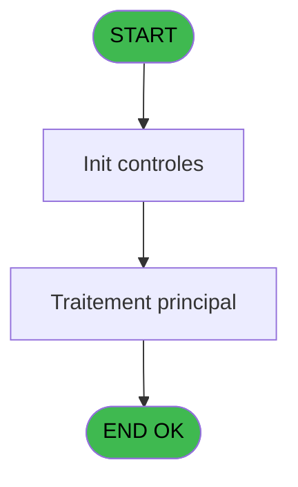
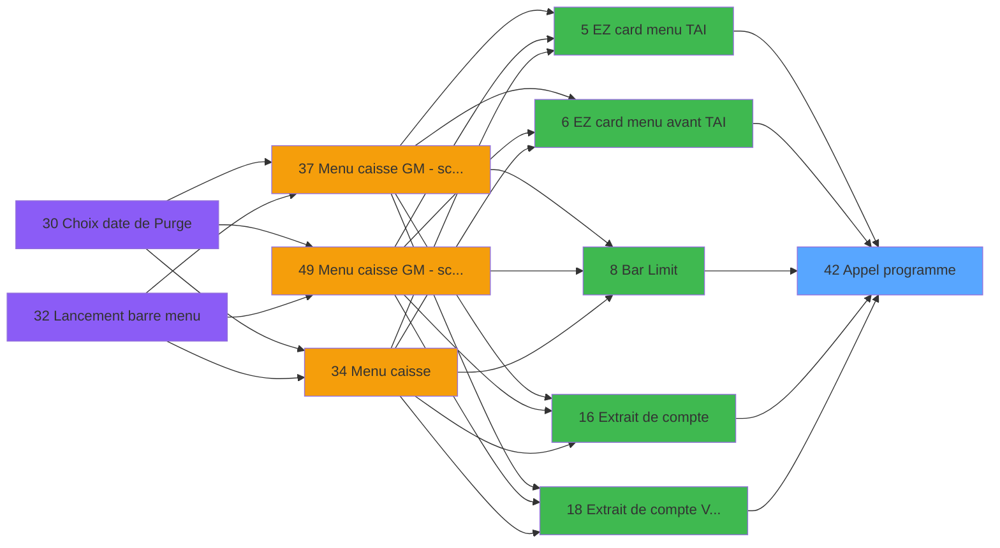

# CAP IDE 42 - Appel programme

> **Analyse**: Phases 1-4 2026-02-03 10:24 -> 10:24 (18s) | Assemblage 10:24
> **Pipeline**: V7.2 Enrichi
> **Structure**: 4 onglets (Resume | Ecrans | Donnees | Connexions)

<!-- TAB:Resume -->

## 1. FICHE D'IDENTITE

| Attribut | Valeur |
|----------|--------|
| Projet | CAP |
| IDE Position | 42 |
| Nom Programme | Appel programme |
| Fichier source | `Prg_42.xml` |
| Domaine metier | General |
| Taches | 1 (0 ecrans visibles) |
| Tables modifiees | 0 |
| Programmes appeles | 0 |

## 2. DESCRIPTION FONCTIONNELLE

**Appel programme** assure la gestion complete de ce processus, accessible depuis [EZ card menu TAI (IDE 5)](CAP-IDE-5.md), [EZ card menu avant TAI (IDE 6)](CAP-IDE-6.md), [Bar Limit (IDE 8)](CAP-IDE-8.md), [Extrait de compte (IDE 16)](CAP-IDE-16.md), [Extrait de compte  Vente (IDE 18)](CAP-IDE-18.md), [Extrait de compte + ventes (IDE 24)](CAP-IDE-24.md), [Liste des forfaits TAI (IDE 29)](CAP-IDE-29.md), [Menu caisse GM - scroll @ (IDE 49)](CAP-IDE-49.md).

Le flux de traitement s'organise en **1 blocs fonctionnels** :

- **Traitement** (1 tache) : traitements metier divers

## 3. BLOCS FONCTIONNELS

### 3.1 Traitement (1 tache)

Traitements internes.

---

#### 42 - Appel programme

**Role** : Traitement : Appel programme.

## 5. REGLES METIER

*(Aucune regle metier identifiee)*

## 6. CONTEXTE

- **Appele par**: [EZ card menu TAI (IDE 5)](CAP-IDE-5.md), [EZ card menu avant TAI (IDE 6)](CAP-IDE-6.md), [Bar Limit (IDE 8)](CAP-IDE-8.md), [Extrait de compte (IDE 16)](CAP-IDE-16.md), [Extrait de compte  Vente (IDE 18)](CAP-IDE-18.md), [Extrait de compte + ventes (IDE 24)](CAP-IDE-24.md), [Liste des forfaits TAI (IDE 29)](CAP-IDE-29.md), [Menu caisse GM - scroll @ (IDE 49)](CAP-IDE-49.md)
- **Appelle**: 0 programmes | **Tables**: 0 (W:0 R:0 L:0) | **Taches**: 1 | **Expressions**: 1

<!-- TAB:Ecrans -->

## 8. ECRANS

*(Programme sans ecran visible)*

## 9. NAVIGATION

### 9.3 Structure hierarchique (1 tache)

| Position | Tache | Type | Dimensions | Bloc |
|----------|-------|------|------------|------|
| **42.1** | [**Appel programme** (42)](#t1) | MDI | - | Traitement |

### 9.4 Algorigramme

> **Legende**: Vert = START/END OK | Rouge = END KO | Bleu = Decisions
> *Algorigramme auto-genere. Utiliser `/algorigramme` pour une synthese metier detaillee.*

<!-- TAB:Donnees -->

## 10. TABLES

### Tables utilisees (0)

| ID | Nom | Description | Type | R | W | L | Usages |
|----|-----|-------------|------|---|---|---|--------|

### Colonnes par table (0 / 0 tables avec colonnes identifiees)

## 11. VARIABLES

*(Programme sans variables locales mappees)*

## 12. EXPRESSIONS

**1 / 1 expressions decodees (100%)**

### 12.1 Repartition par type

| Type | Expressions | Regles |
|------|-------------|--------|
| OTHER | 1 | 0 |

### 12.2 Expressions cles par type

#### OTHER (1 expressions)

| Type | IDE | Expression | Regle |
|------|-----|------------|-------|
| OTHER | 1 | `LastClicked ()` | - |

<!-- TAB:Connexions -->

## 13. GRAPHE D'APPELS

### 13.1 Chaine depuis Main (Callers)

Main -> ... -> [EZ card menu TAI (IDE 5)](CAP-IDE-5.md) -> **Appel programme (IDE 42)**

Main -> ... -> [EZ card menu avant TAI (IDE 6)](CAP-IDE-6.md) -> **Appel programme (IDE 42)**

Main -> ... -> [Bar Limit (IDE 8)](CAP-IDE-8.md) -> **Appel programme (IDE 42)**

Main -> ... -> [Extrait de compte (IDE 16)](CAP-IDE-16.md) -> **Appel programme (IDE 42)**

Main -> ... -> [Extrait de compte  Vente (IDE 18)](CAP-IDE-18.md) -> **Appel programme (IDE 42)**

Main -> ... -> [Extrait de compte + ventes (IDE 24)](CAP-IDE-24.md) -> **Appel programme (IDE 42)**

Main -> ... -> [Liste des forfaits TAI (IDE 29)](CAP-IDE-29.md) -> **Appel programme (IDE 42)**

Main -> ... -> [Menu caisse GM - scroll @ (IDE 49)](CAP-IDE-49.md) -> **Appel programme (IDE 42)**

### 13.2 Callers

| IDE | Nom Programme | Nb Appels |
|-----|---------------|-----------|
| [5](CAP-IDE-5.md) | EZ card menu TAI | 1 |
| [6](CAP-IDE-6.md) | EZ card menu avant TAI | 1 |
| [8](CAP-IDE-8.md) | Bar Limit | 1 |
| [16](CAP-IDE-16.md) | Extrait de compte | 1 |
| [18](CAP-IDE-18.md) | Extrait de compte  Vente | 1 |
| [24](CAP-IDE-24.md) | Extrait de compte + ventes | 1 |
| [29](CAP-IDE-29.md) | Liste des forfaits TAI | 1 |
| [49](CAP-IDE-49.md) | Menu caisse GM - scroll @ | 1 |

### 13.3 Callees (programmes appeles)

### 13.4 Detail Callees avec contexte

| IDE | Nom Programme | Appels | Contexte |
|-----|---------------|--------|----------|
| - | (aucun) | - | - |

## 14. RECOMMANDATIONS MIGRATION

### 14.1 Profil du programme

| Metrique | Valeur | Impact migration |
|----------|--------|-----------------|
| Lignes de logique | 4 | Programme compact |
| Expressions | 1 | Peu de logique |
| Tables WRITE | 0 | Impact faible |
| Sous-programmes | 0 | Peu de dependances |
| Ecrans visibles | 0 | Ecran unique ou traitement batch |
| Code desactive | 0% (0 / 4) | Code sain |
| Regles metier | 0 | Pas de regle identifiee |

### 14.2 Plan de migration par bloc

#### Traitement (1 tache: 0 ecran, 1 traitement)

- **Strategie** : 1 service(s) backend injectable(s) (Domain Services).
- Decomposer les taches en services unitaires testables.

### 14.3 Dependances critiques

| Dependance | Type | Appels | Impact |
|------------|------|--------|--------|

---
*Spec DETAILED generee par Pipeline V7.2 - 2026-02-03 10:24*
