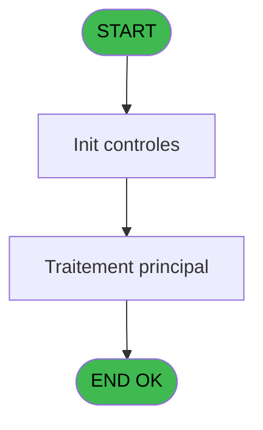
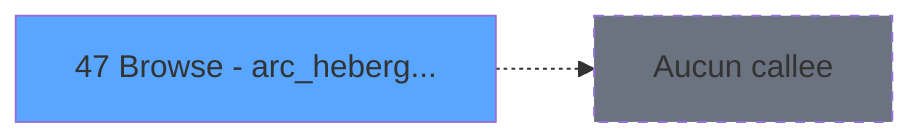

# CAP IDE 47 - Browse - arc_hebergement______

> **Analyse**: Phases 1-4 2026-02-03 10:26 -> 10:26 (20s) | Assemblage 10:26
> **Pipeline**: V7.2 Enrichi
> **Structure**: 4 onglets (Resume | Ecrans | Donnees | Connexions)

<!-- TAB:Resume -->

## 1. FICHE D'IDENTITE

| Attribut | Valeur |
|----------|--------|
| Projet | CAP |
| IDE Position | 47 |
| Nom Programme | Browse - arc_hebergement______ |
| Fichier source | `Prg_47.xml` |
| Domaine metier | General |
| Taches | 1 (1 ecrans visibles) |
| Tables modifiees | 0 |
| Programmes appeles | 0 |
| :warning: Statut | **ORPHELIN_POTENTIEL** |

## 2. DESCRIPTION FONCTIONNELLE

**Browse - arc_hebergement______** assure la gestion complete de ce processus.

Le flux de traitement s'organise en **1 blocs fonctionnels** :

- **Traitement** (1 tache) : traitements metier divers

## 3. BLOCS FONCTIONNELS

### 3.1 Traitement (1 tache)

Traitements internes.

---

#### 47 - Browse - arc_hebergement______ [[ECRAN]](#ecran-t1)

**Role** : Traitement : Browse - arc_hebergement______.
**Ecran** : 3494 x 537 DLU | [Voir mockup](#ecran-t1)

## 5. REGLES METIER

*(Aucune regle metier identifiee)*

## 6. CONTEXTE

- **Appele par**: (aucun)
- **Appelle**: 0 programmes | **Tables**: 2 (W:0 R:1 L:1) | **Taches**: 1 | **Expressions**: 4

<!-- TAB:Ecrans -->

## 8. ECRANS

### 8.1 Forms visibles (1 / 1)

| # | Position | Tache | Nom | Type | Largeur | Hauteur | Bloc |
|---|----------|-------|-----|------|---------|---------|------|
| 1 | 47 | 47 | Browse - arc_hebergement______ | Type0 | 3494 | 537 | Traitement |

### 8.2 Mockups Ecrans

---

#### 47 - Browse - arc_hebergement______
**Tache** : [47](#t1) | **Type** : Type0 | **Dimensions** : 3494 x 537 DLU
**Bloc** : Traitement | **Titre IDE** : Browse - arc_hebergement______

<!-- FORM-DATA:
{
    "width":  3494,
    "vFactor":  8,
    "type":  "Type0",
    "hFactor":  4,
    "controls":  [
                     {
                         "x":  4,
                         "type":  "table",
                         "var":  "",
                         "name":  "",
                         "titleH":  14,
                         "color":  "",
                         "w":  936,
                         "y":  8,
                         "fmt":  "",
                         "parent":  null,
                         "text":  "",
                         "rowH":  13,
                         "h":  528,
                         "cols":  [
                                      {
                                          "title":  "arc_heb_societe",
                                          "layer":  1,
                                          "w":  66
                                      },
                                      {
                                          "title":  "arc_heb_num_compte",
                                          "layer":  2,
                                          "w":  88
                                      },
                                      {
                                          "title":  "arc_heb_libelle",
                                          "layer":  3,
                                          "w":  296
                                      },
                                      {
                                          "title":  "arc_heb_filiation",
                                          "layer":  4,
                                          "w":  65
                                      },
                                      {
                                          "title":  "arc_heb_code_package",
                                          "layer":  5,
                                          "w":  97
                                      },
                                      {
                                          "title":  "arc_gmr_nom__30_",
                                          "layer":  6,
                                          "w":  178
                                      },
                                      {
                                          "title":  "arc_gmr_prenom__8_",
                                          "layer":  7,
                                          "w":  86
                                      }
                                  ],
                         "rows":  7
                     },
                     {
                         "x":  8,
                         "type":  "edit",
                         "var":  "",
                         "y":  25,
                         "w":  9,
                         "fmt":  "",
                         "name":  "arc_heb_societe",
                         "h":  10,
                         "color":  "",
                         "text":  "",
                         "parent":  54
                     },
                     {
                         "x":  74,
                         "type":  "edit",
                         "var":  "",
                         "y":  25,
                         "w":  42,
                         "fmt":  "",
                         "name":  "arc_heb_num_compte",
                         "h":  10,
                         "color":  "",
                         "text":  "",
                         "parent":  54
                     },
                     {
                         "x":  162,
                         "type":  "edit",
                         "var":  "",
                         "y":  25,
                         "w":  289,
                         "fmt":  "",
                         "name":  "arc_heb_libelle",
                         "h":  10,
                         "color":  "",
                         "text":  "",
                         "parent":  54
                     },
                     {
                         "x":  458,
                         "type":  "edit",
                         "var":  "",
                         "y":  25,
                         "w":  18,
                         "fmt":  "",
                         "name":  "arc_heb_filiation",
                         "h":  10,
                         "color":  "",
                         "text":  "",
                         "parent":  54
                     },
                     {
                         "x":  523,
                         "type":  "edit",
                         "var":  "",
                         "y":  25,
                         "w":  9,
                         "fmt":  "",
                         "name":  "arc_heb_code_package",
                         "h":  10,
                         "color":  "",
                         "text":  "",
                         "parent":  54
                     },
                     {
                         "x":  620,
                         "type":  "edit",
                         "var":  "",
                         "y":  25,
                         "w":  171,
                         "fmt":  "",
                         "name":  "arc_gmr_nom__30_",
                         "h":  10,
                         "color":  "",
                         "text":  "",
                         "parent":  54
                     },
                     {
                         "x":  798,
                         "type":  "edit",
                         "var":  "",
                         "y":  25,
                         "w":  59,
                         "fmt":  "",
                         "name":  "arc_gmr_prenom__8_",
                         "h":  10,
                         "color":  "",
                         "text":  "",
                         "parent":  54
                     }
                 ],
    "taskId":  "47",
    "height":  537
}
-->

<strong>Champs : 7 champs</strong>

| Pos (x,y) | Nom | Variable | Type |
|-----------|-----|----------|------|
| 8,25 | arc_heb_societe | - | edit |
| 74,25 | arc_heb_num_compte | - | edit |
| 162,25 | arc_heb_libelle | - | edit |
| 458,25 | arc_heb_filiation | - | edit |
| 523,25 | arc_heb_code_package | - | edit |
| 620,25 | arc_gmr_nom__30_ | - | edit |
| 798,25 | arc_gmr_prenom__8_ | - | edit |

## 9. NAVIGATION

Ecran unique: **Browse - arc_hebergement______**

### 9.3 Structure hierarchique (1 tache)

| Position | Tache | Type | Dimensions | Bloc |
|----------|-------|------|------------|------|
| **47.1** | [**Browse - arc_hebergement______** (47)](#t1) [mockup](#ecran-t1) | - | 3494x537 | Traitement |

### 9.4 Algorigramme

> **Legende**: Vert = START/END OK | Rouge = END KO | Bleu = Decisions
> *Algorigramme auto-genere. Utiliser `/algorigramme` pour une synthese metier detaillee.*

<!-- TAB:Donnees -->

## 10. TABLES

### Tables utilisees (2)

| ID | Nom | Description | Type | R | W | L | Usages |
|----|-----|-------------|------|---|---|---|--------|
| 744 | pv_lieux_vente | Donnees de ventes | DB | R |   |   | 1 |
| 895 | Boo_Praticiens |  | DB |   |   | L | 1 |

### Colonnes par table (0 / 1 tables avec colonnes identifiees)

Table 744 - pv_lieux_vente (R) - 1 usages

*Table utilisee uniquement en Link ou aucune colonne Real identifiee dans le DataView.*

## 11. VARIABLES

*(Programme sans variables locales mappees)*

## 12. EXPRESSIONS

**4 / 4 expressions decodees (100%)**

### 12.1 Repartition par type

| Type | Expressions | Regles |
|------|-------------|--------|
| CONSTANTE | 1 | 0 |
| OTHER | 3 | 0 |

### 12.2 Expressions cles par type

#### CONSTANTE (1 expressions)

| Type | IDE | Expression | Regle |
|------|-----|------------|-------|
| CONSTANTE | 4 | `'H'` | - |

#### OTHER (3 expressions)

| Type | IDE | Expression | Regle |
|------|-----|------------|-------|
| OTHER | 3 | `[C]` | - |
| OTHER | 2 | `[B]` | - |
| OTHER | 1 | `[A]` | - |

<!-- TAB:Connexions -->

## 13. GRAPHE D'APPELS

### 13.1 Chaine depuis Main (Callers)

**Chemin**: (pas de callers directs)

### 13.2 Callers

| IDE | Nom Programme | Nb Appels |
|-----|---------------|-----------|
| - | (aucun) | - |

### 13.3 Callees (programmes appeles)

### 13.4 Detail Callees avec contexte

| IDE | Nom Programme | Appels | Contexte |
|-----|---------------|--------|----------|
| - | (aucun) | - | - |

## 14. RECOMMANDATIONS MIGRATION

### 14.1 Profil du programme

| Metrique | Valeur | Impact migration |
|----------|--------|-----------------|
| Lignes de logique | 36 | Programme compact |
| Expressions | 4 | Peu de logique |
| Tables WRITE | 0 | Impact faible |
| Sous-programmes | 0 | Peu de dependances |
| Ecrans visibles | 1 | Ecran unique ou traitement batch |
| Code desactive | 0% (0 / 36) | Code sain |
| Regles metier | 0 | Pas de regle identifiee |

### 14.2 Plan de migration par bloc

#### Traitement (1 tache: 1 ecran, 0 traitement)

- **Strategie** : 1 composant(s) UI (Razor/React) avec formulaires et validation.
- Decomposer les taches en services unitaires testables.

### 14.3 Dependances critiques

| Dependance | Type | Appels | Impact |
|------------|------|--------|--------|

---
*Spec DETAILED generee par Pipeline V7.2 - 2026-02-03 10:26*
