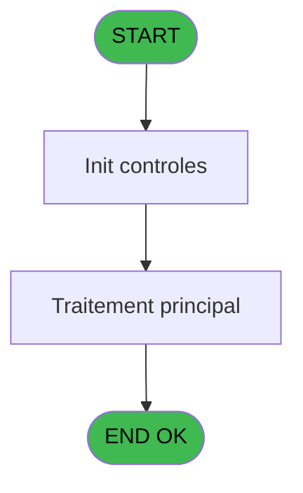

# CAP IDE 48 - Browse - arc_vente

> **Analyse**: Phases 1-4 2026-02-03 10:26 -> 10:27 (20s) | Assemblage 10:27
> **Pipeline**: V7.2 Enrichi
> **Structure**: 4 onglets (Resume | Ecrans | Donnees | Connexions)

<!-- TAB:Resume -->

## 1. FICHE D'IDENTITE

| Attribut | Valeur |
|----------|--------|
| Projet | CAP |
| IDE Position | 48 |
| Nom Programme | Browse - arc_vente |
| Fichier source | `Prg_48.xml` |
| Domaine metier | Ventes |
| Taches | 1 (1 ecrans visibles) |
| Tables modifiees | 0 |
| Programmes appeles | 0 |
| :warning: Statut | **ORPHELIN_POTENTIEL** |

## 2. DESCRIPTION FONCTIONNELLE

**Browse - arc_vente** assure la gestion complete de ce processus.

Le flux de traitement s'organise en **1 blocs fonctionnels** :

- **Saisie** (1 tache) : ecrans de saisie utilisateur (formulaires, champs, donnees)

## 3. BLOCS FONCTIONNELS

### 3.1 Saisie (1 tache)

L'operateur saisit les donnees de la transaction via 1 ecran (Browse - arc_vente).

---

#### 48 - Browse - arc_vente [[ECRAN]](#ecran-t1)

**Role** : Saisie des donnees : Browse - arc_vente.
**Ecran** : 2427 x 363 DLU | [Voir mockup](#ecran-t1)

## 5. REGLES METIER

*(Aucune regle metier identifiee)*

## 6. CONTEXTE

- **Appele par**: (aucun)
- **Appelle**: 0 programmes | **Tables**: 2 (W:0 R:1 L:1) | **Taches**: 1 | **Expressions**: 4

<!-- TAB:Ecrans -->

## 8. ECRANS

### 8.1 Forms visibles (1 / 1)

| # | Position | Tache | Nom | Type | Largeur | Hauteur | Bloc |
|---|----------|-------|-----|------|---------|---------|------|
| 1 | 48 | 48 | Browse - arc_vente | Type0 | 2427 | 363 | Saisie |

### 8.2 Mockups Ecrans

---

#### 48 - Browse - arc_vente
**Tache** : [48](#t1) | **Type** : Type0 | **Dimensions** : 2427 x 363 DLU
**Bloc** : Saisie | **Titre IDE** : Browse - arc_vente

<!-- FORM-DATA:
{
    "width":  2427,
    "vFactor":  8,
    "type":  "Type0",
    "hFactor":  4,
    "controls":  [
                     {
                         "x":  8,
                         "type":  "table",
                         "var":  "",
                         "name":  "",
                         "titleH":  12,
                         "color":  "",
                         "w":  2405,
                         "y":  8,
                         "fmt":  "",
                         "parent":  null,
                         "text":  "",
                         "rowH":  13,
                         "h":  182,
                         "cols":  [
                                      {
                                          "title":  "arc_societe",
                                          "layer":  1,
                                          "w":  47
                                      },
                                      {
                                          "title":  "arc_compte_gm",
                                          "layer":  2,
                                          "w":  64
                                      },
                                      {
                                          "title":  "arc_filiation",
                                          "layer":  3,
                                          "w":  46
                                      },
                                      {
                                          "title":  "arc_imputation",
                                          "layer":  4,
                                          "w":  58
                                      },
                                      {
                                          "title":  "arc_sous_imputation",
                                          "layer":  5,
                                          "w":  81
                                      },
                                      {
                                          "title":  "arc_libelle",
                                          "layer":  6,
                                          "w":  94
                                      },
                                      {
                                          "title":  "arc_libelle_supplem_",
                                          "layer":  7,
                                          "w":  94
                                      },
                                      {
                                          "title":  "arc_credit_debit",
                                          "layer":  8,
                                          "w":  64
                                      },
                                      {
                                          "title":  "arc_flag_annulation",
                                          "layer":  9,
                                          "w":  78
                                      },
                                      {
                                          "title":  "arc_code_type",
                                          "layer":  10,
                                          "w":  60
                                      },
                                      {
                                          "title":  "arc_numero_chrono",
                                          "layer":  11,
                                          "w":  79
                                      },
                                      {
                                          "title":  "arc_avec_change",
                                          "layer":  12,
                                          "w":  73
                                      },
                                      {
                                          "title":  "arc_mode_de_paiement",
                                          "layer":  13,
                                          "w":  94
                                      },
                                      {
                                          "title":  "arc_montant",
                                          "layer":  14,
                                          "w":  101
                                      },
                                      {
                                          "title":  "arc_date_comptable",
                                          "layer":  15,
                                          "w":  81
                                      },
                                      {
                                          "title":  "arc_date_d_operation",
                                          "layer":  16,
                                          "w":  86
                                      },
                                      {
                                          "title":  "arc_heure_operation",
                                          "layer":  17,
                                          "w":  82
                                      },
                                      {
                                          "title":  "arc_nbre_d_articles",
                                          "layer":  18,
                                          "w":  78
                                      },
                                      {
                                          "title":  "arc_flag_application",
                                          "layer":  19,
                                          "w":  79
                                      },
                                      {
                                          "title":  "arc_type_transaction",
                                          "layer":  20,
                                          "w":  82
                                      },
                                      {
                                          "title":  "arc_operateur",
                                          "layer":  21,
                                          "w":  56
                                      },
                                      {
                                          "title":  "arc_RowId_263",
                                          "layer":  22,
                                          "w":  64
                                      },
                                      {
                                          "title":  "arc_ref_article",
                                          "layer":  23,
                                          "w":  58
                                      },
                                      {
                                          "title":  "arc_taux_tva",
                                          "layer":  24,
                                          "w":  53
                                      },
                                      {
                                          "title":  "arc_no_facture",
                                          "layer":  25,
                                          "w":  61
                                      },
                                      {
                                          "title":  "arc_service",
                                          "layer":  26,
                                          "w":  47
                                      },
                                      {
                                          "title":  "arc_montant_remise",
                                          "layer":  27,
                                          "w":  82
                                      },
                                      {
                                          "title":  "arc_date_purge",
                                          "layer":  28,
                                          "w":  68
                                      },
                                      {
                                          "title":  "arc_id_transaction",
                                          "layer":  29,
                                          "w":  189
                                      },
                                      {
                                          "title":  "arc_id_acceptation",
                                          "layer":  30,
                                          "w":  189
                                      }
                                  ],
                         "rows":  30
                     },
                     {
                         "x":  16,
                         "type":  "label",
                         "var":  "",
                         "y":  200,
                         "w":  77,
                         "fmt":  "",
                         "name":  "",
                         "h":  9,
                         "color":  "",
                         "text":  "arc_gmr_nom__30_",
                         "parent":  null
                     },
                     {
                         "x":  16,
                         "type":  "label",
                         "var":  "",
                         "y":  216,
                         "w":  84,
                         "fmt":  "",
                         "name":  "",
                         "h":  9,
                         "color":  "",
                         "text":  "arc_gmr_prenom__8_",
                         "parent":  null
                     },
                     {
                         "x":  12,
                         "type":  "edit",
                         "var":  "",
                         "y":  23,
                         "w":  9,
                         "fmt":  "",
                         "name":  "arc_societe",
                         "h":  10,
                         "color":  "",
                         "text":  "",
                         "parent":  1
                     },
                     {
                         "x":  59,
                         "type":  "edit",
                         "var":  "",
                         "y":  23,
                         "w":  42,
                         "fmt":  "",
                         "name":  "arc_compte_gm",
                         "h":  10,
                         "color":  "",
                         "text":  "",
                         "parent":  1
                     },
                     {
                         "x":  123,
                         "type":  "edit",
                         "var":  "",
                         "y":  23,
                         "w":  18,
                         "fmt":  "",
                         "name":  "arc_filiation",
                         "h":  10,
                         "color":  "",
                         "text":  "",
                         "parent":  1
                     },
                     {
                         "x":  169,
                         "type":  "edit",
                         "var":  "",
                         "y":  23,
                         "w":  51,
                         "fmt":  "",
                         "name":  "arc_imputation",
                         "h":  10,
                         "color":  "",
                         "text":  "",
                         "parent":  1
                     },
                     {
                         "x":  227,
                         "type":  "edit",
                         "var":  "",
                         "y":  23,
                         "w":  18,
                         "fmt":  "",
                         "name":  "arc_sous_imputation",
                         "h":  10,
                         "color":  "",
                         "text":  "",
                         "parent":  1
                     },
                     {
                         "x":  308,
                         "type":  "edit",
                         "var":  "",
                         "y":  23,
                         "w":  87,
                         "fmt":  "",
                         "name":  "arc_libelle",
                         "h":  10,
                         "color":  "",
                         "text":  "",
                         "parent":  1
                     },
                     {
                         "x":  402,
                         "type":  "edit",
                         "var":  "",
                         "y":  23,
                         "w":  87,
                         "fmt":  "",
                         "name":  "arc_libelle_supplem_",
                         "h":  10,
                         "color":  "",
                         "text":  "",
                         "parent":  1
                     },
                     {
                         "x":  496,
                         "type":  "edit",
                         "var":  "",
                         "y":  23,
                         "w":  9,
                         "fmt":  "",
                         "name":  "arc_credit_debit",
                         "h":  10,
                         "color":  "",
                         "text":  "",
                         "parent":  1
                     },
                     {
                         "x":  560,
                         "type":  "edit",
                         "var":  "",
                         "y":  23,
                         "w":  9,
                         "fmt":  "",
                         "name":  "arc_flag_annulation",
                         "h":  10,
                         "color":  "",
                         "text":  "",
                         "parent":  1
                     },
                     {
                         "x":  638,
                         "type":  "edit",
                         "var":  "",
                         "y":  23,
                         "w":  9,
                         "fmt":  "",
                         "name":  "arc_code_type",
                         "h":  10,
                         "color":  "",
                         "text":  "",
                         "parent":  1
                     },
                     {
                         "x":  698,
                         "type":  "edit",
                         "var":  "",
                         "y":  23,
                         "w":  42,
                         "fmt":  "",
                         "name":  "arc_numero_chrono",
                         "h":  10,
                         "color":  "",
                         "text":  "",
                         "parent":  1
                     },
                     {
                         "x":  777,
                         "type":  "edit",
                         "var":  "",
                         "y":  23,
                         "w":  9,
                         "fmt":  "",
                         "name":  "arc_avec_change",
                         "h":  10,
                         "color":  "",
                         "text":  "",
                         "parent":  1
                     },
                     {
                         "x":  850,
                         "type":  "edit",
                         "var":  "",
                         "y":  23,
                         "w":  26,
                         "fmt":  "",
                         "name":  "arc_mode_de_paiement",
                         "h":  10,
                         "color":  "",
                         "text":  "",
                         "parent":  1
                     },
                     {
                         "x":  944,
                         "type":  "edit",
                         "var":  "",
                         "y":  23,
                         "w":  94,
                         "fmt":  "",
                         "name":  "arc_montant",
                         "h":  10,
                         "color":  "",
                         "text":  "",
                         "parent":  1
                     },
                     {
                         "x":  1045,
                         "type":  "edit",
                         "var":  "",
                         "y":  23,
                         "w":  61,
                         "fmt":  "",
                         "name":  "arc_date_comptable",
                         "h":  10,
                         "color":  "",
                         "text":  "",
                         "parent":  1
                     },
                     {
                         "x":  1126,
                         "type":  "edit",
                         "var":  "",
                         "y":  23,
                         "w":  61,
                         "fmt":  "",
                         "name":  "arc_date_d_operation",
                         "h":  10,
                         "color":  "",
                         "text":  "",
                         "parent":  1
                     },
                     {
                         "x":  1212,
                         "type":  "edit",
                         "var":  "",
                         "y":  23,
                         "w":  46,
                         "fmt":  "",
                         "name":  "arc_heure_operation",
                         "h":  10,
                         "color":  "",
                         "text":  "",
                         "parent":  1
                     },
                     {
                         "x":  1294,
                         "type":  "edit",
                         "var":  "",
                         "y":  23,
                         "w":  18,
                         "fmt":  "",
                         "name":  "arc_nbre_d_articles",
                         "h":  10,
                         "color":  "",
                         "text":  "",
                         "parent":  1
                     },
                     {
                         "x":  1372,
                         "type":  "edit",
                         "var":  "",
                         "y":  23,
                         "w":  9,
                         "fmt":  "",
                         "name":  "arc_flag_application",
                         "h":  10,
                         "color":  "",
                         "text":  "",
                         "parent":  1
                     },
                     {
                         "x":  1451,
                         "type":  "edit",
                         "var":  "",
                         "y":  23,
                         "w":  9,
                         "fmt":  "",
                         "name":  "arc_type_transaction",
                         "h":  10,
                         "color":  "",
                         "text":  "",
                         "parent":  1
                     },
                     {
                         "x":  1533,
                         "type":  "edit",
                         "var":  "",
                         "y":  23,
                         "w":  48,
                         "fmt":  "",
                         "name":  "arc_operateur",
                         "h":  10,
                         "color":  "",
                         "text":  "",
                         "parent":  1
                     },
                     {
                         "x":  1589,
                         "type":  "edit",
                         "var":  "",
                         "y":  23,
                         "w":  51,
                         "fmt":  "",
                         "name":  "arc_RowId_263",
                         "h":  10,
                         "color":  "",
                         "text":  "",
                         "parent":  1
                     },
                     {
                         "x":  1653,
                         "type":  "edit",
                         "var":  "",
                         "y":  23,
                         "w":  51,
                         "fmt":  "",
                         "name":  "arc_ref_article",
                         "h":  10,
                         "color":  "",
                         "text":  "",
                         "parent":  1
                     },
                     {
                         "x":  1711,
                         "type":  "edit",
                         "var":  "",
                         "y":  23,
                         "w":  37,
                         "fmt":  "",
                         "name":  "arc_taux_tva",
                         "h":  10,
                         "color":  "",
                         "text":  "",
                         "parent":  1
                     },
                     {
                         "x":  1764,
                         "type":  "edit",
                         "var":  "",
                         "y":  23,
                         "w":  51,
                         "fmt":  "",
                         "name":  "arc_no_facture",
                         "h":  10,
                         "color":  "",
                         "text":  "",
                         "parent":  1
                     },
                     {
                         "x":  1825,
                         "type":  "edit",
                         "var":  "",
                         "y":  23,
                         "w":  26,
                         "fmt":  "",
                         "name":  "arc_service",
                         "h":  10,
                         "color":  "",
                         "text":  "",
                         "parent":  1
                     },
                     {
                         "x":  1872,
                         "type":  "edit",
                         "var":  "",
                         "y":  23,
                         "w":  75,
                         "fmt":  "",
                         "name":  "arc_montant_remise",
                         "h":  10,
                         "color":  "",
                         "text":  "",
                         "parent":  1
                     },
                     {
                         "x":  1954,
                         "type":  "edit",
                         "var":  "",
                         "y":  23,
                         "w":  61,
                         "fmt":  "",
                         "name":  "arc_date_purge",
                         "h":  10,
                         "color":  "",
                         "text":  "",
                         "parent":  1
                     },
                     {
                         "x":  2022,
                         "type":  "edit",
                         "var":  "",
                         "y":  23,
                         "w":  182,
                         "fmt":  "",
                         "name":  "arc_id_transaction",
                         "h":  10,
                         "color":  "",
                         "text":  "",
                         "parent":  1
                     },
                     {
                         "x":  2211,
                         "type":  "edit",
                         "var":  "",
                         "y":  23,
                         "w":  182,
                         "fmt":  "",
                         "name":  "arc_id_acceptation",
                         "h":  10,
                         "color":  "",
                         "text":  "",
                         "parent":  1
                     },
                     {
                         "x":  97,
                         "type":  "edit",
                         "var":  "",
                         "y":  200,
                         "w":  171,
                         "fmt":  "",
                         "name":  "arc_gmr_nom__30_",
                         "h":  10,
                         "color":  "",
                         "text":  "",
                         "parent":  null
                     },
                     {
                         "x":  104,
                         "type":  "edit",
                         "var":  "",
                         "y":  216,
                         "w":  59,
                         "fmt":  "",
                         "name":  "arc_gmr_prenom__8_",
                         "h":  10,
                         "color":  "",
                         "text":  "",
                         "parent":  null
                     }
                 ],
    "taskId":  "48",
    "height":  363
}
-->

<strong>Champs : 32 champs</strong>

| Pos (x,y) | Nom | Variable | Type |
|-----------|-----|----------|------|
| 12,23 | arc_societe | - | edit |
| 59,23 | arc_compte_gm | - | edit |
| 123,23 | arc_filiation | - | edit |
| 169,23 | arc_imputation | - | edit |
| 227,23 | arc_sous_imputation | - | edit |
| 308,23 | arc_libelle | - | edit |
| 402,23 | arc_libelle_supplem_ | - | edit |
| 496,23 | arc_credit_debit | - | edit |
| 560,23 | arc_flag_annulation | - | edit |
| 638,23 | arc_code_type | - | edit |
| 698,23 | arc_numero_chrono | - | edit |
| 777,23 | arc_avec_change | - | edit |
| 850,23 | arc_mode_de_paiement | - | edit |
| 944,23 | arc_montant | - | edit |
| 1045,23 | arc_date_comptable | - | edit |
| 1126,23 | arc_date_d_operation | - | edit |
| 1212,23 | arc_heure_operation | - | edit |
| 1294,23 | arc_nbre_d_articles | - | edit |
| 1372,23 | arc_flag_application | - | edit |
| 1451,23 | arc_type_transaction | - | edit |
| 1533,23 | arc_operateur | - | edit |
| 1589,23 | arc_RowId_263 | - | edit |
| 1653,23 | arc_ref_article | - | edit |
| 1711,23 | arc_taux_tva | - | edit |
| 1764,23 | arc_no_facture | - | edit |
| 1825,23 | arc_service | - | edit |
| 1872,23 | arc_montant_remise | - | edit |
| 1954,23 | arc_date_purge | - | edit |
| 2022,23 | arc_id_transaction | - | edit |
| 2211,23 | arc_id_acceptation | - | edit |
| 97,200 | arc_gmr_nom__30_ | - | edit |
| 104,216 | arc_gmr_prenom__8_ | - | edit |

## 9. NAVIGATION

Ecran unique: **Browse - arc_vente**

### 9.3 Structure hierarchique (1 tache)

| Position | Tache | Type | Dimensions | Bloc |
|----------|-------|------|------------|------|
| **48.1** | [**Browse - arc_vente** (48)](#t1) [mockup](#ecran-t1) | - | 2427x363 | Saisie |

### 9.4 Algorigramme

> **Legende**: Vert = START/END OK | Rouge = END KO | Bleu = Decisions
> *Algorigramme auto-genere. Utiliser `/algorigramme` pour une synthese metier detaillee.*

<!-- TAB:Donnees -->

## 10. TABLES

### Tables utilisees (2)

| ID | Nom | Description | Type | R | W | L | Usages |
|----|-----|-------------|------|---|---|---|--------|
| 744 | pv_lieux_vente | Donnees de ventes | DB | R |   |   | 1 |
| 861 | param_gen_mail |  | DB |   |   | L | 1 |

### Colonnes par table (0 / 1 tables avec colonnes identifiees)

Table 744 - pv_lieux_vente (R) - 1 usages

*Table utilisee uniquement en Link ou aucune colonne Real identifiee dans le DataView.*

## 11. VARIABLES

*(Programme sans variables locales mappees)*

## 12. EXPRESSIONS

**4 / 4 expressions decodees (100%)**

### 12.1 Repartition par type

| Type | Expressions | Regles |
|------|-------------|--------|
| OTHER | 4 | 0 |

### 12.2 Expressions cles par type

#### OTHER (4 expressions)

| Type | IDE | Expression | Regle |
|------|-----|------------|-------|
| OTHER | 3 | `[C]` | - |
| OTHER | 4 | `[AB]` | - |
| OTHER | 1 | `[A]` | - |
| OTHER | 2 | `[B]` | - |

<!-- TAB:Connexions -->

## 13. GRAPHE D'APPELS

### 13.1 Chaine depuis Main (Callers)

**Chemin**: (pas de callers directs)

### 13.2 Callers

| IDE | Nom Programme | Nb Appels |
|-----|---------------|-----------|
| - | (aucun) | - |

### 13.3 Callees (programmes appeles)

### 13.4 Detail Callees avec contexte

| IDE | Nom Programme | Appels | Contexte |
|-----|---------------|--------|----------|
| - | (aucun) | - | - |

## 14. RECOMMANDATIONS MIGRATION

### 14.1 Profil du programme

| Metrique | Valeur | Impact migration |
|----------|--------|-----------------|
| Lignes de logique | 39 | Programme compact |
| Expressions | 4 | Peu de logique |
| Tables WRITE | 0 | Impact faible |
| Sous-programmes | 0 | Peu de dependances |
| Ecrans visibles | 1 | Ecran unique ou traitement batch |
| Code desactive | 0% (0 / 39) | Code sain |
| Regles metier | 0 | Pas de regle identifiee |

### 14.2 Plan de migration par bloc

#### Saisie (1 tache: 1 ecran, 0 traitement)

- **Strategie** : Formulaire React/Blazor avec validation Zod/FluentValidation.
- Reproduire 1 ecran : Browse - arc_vente
- Validation temps reel cote client + serveur

### 14.3 Dependances critiques

| Dependance | Type | Appels | Impact |
|------------|------|--------|--------|

---
*Spec DETAILED generee par Pipeline V7.2 - 2026-02-03 10:27*
