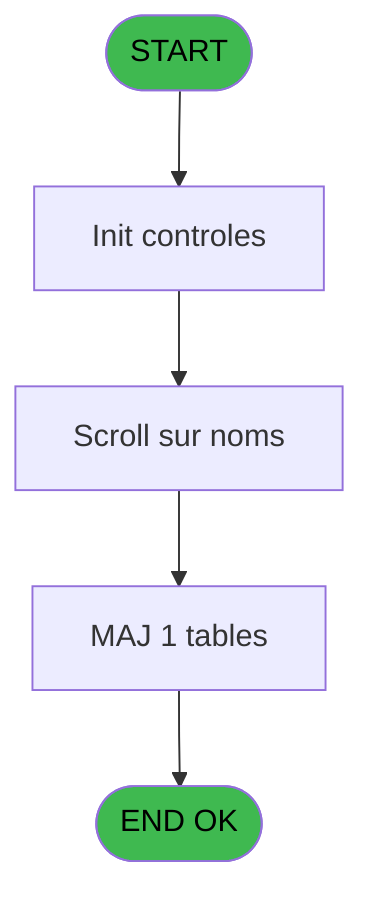
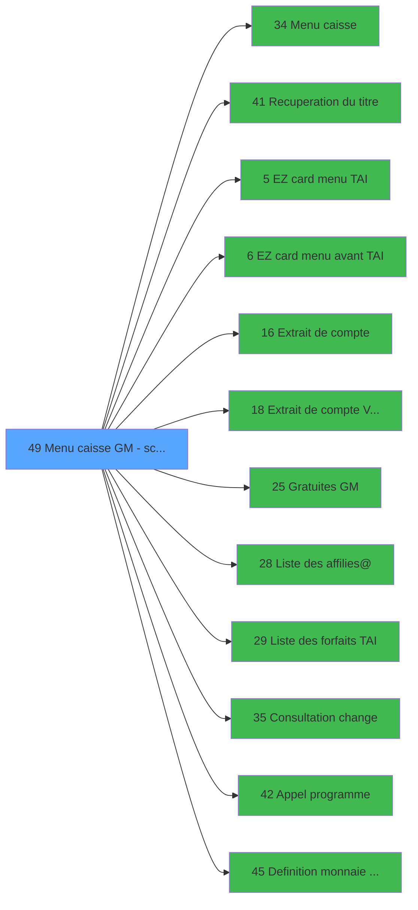

# CAP IDE 49 - Menu caisse GM - scroll @

> **Analyse**: Phases 1-4 2026-02-03 10:27 -> 10:27 (20s) | Assemblage 10:27
> **Pipeline**: V7.2 Enrichi
> **Structure**: 4 onglets (Resume | Ecrans | Donnees | Connexions)

<!-- TAB:Resume -->

## 1. FICHE D'IDENTITE

| Attribut | Valeur |
|----------|--------|
| Projet | CAP |
| IDE Position | 49 |
| Nom Programme | Menu caisse GM - scroll @ |
| Fichier source | `Prg_49.xml` |
| Domaine metier | Caisse |
| Taches | 9 (3 ecrans visibles) |
| Tables modifiees | 1 |
| Programmes appeles | 12 |
| :warning: Statut | **ORPHELIN_POTENTIEL** |

## 2. DESCRIPTION FONCTIONNELLE

**Menu caisse GM - scroll @** assure la gestion complete de ce processus.

Le flux de traitement s'organise en **3 blocs fonctionnels** :

- **Traitement** (7 taches) : traitements metier divers
- **Saisie** (1 tache) : ecrans de saisie utilisateur (formulaires, champs, donnees)
- **Consultation** (1 tache) : ecrans de recherche, selection et consultation

**Donnees modifiees** : 1 tables en ecriture (reseau_cloture___rec).

Detail : phases du traitement

#### Phase 1 : Traitement (7 taches)

- **49** - (sans nom) **[[ECRAN]](#ecran-t1)**
- **49.1** - Station eteinte anormalement
- **49.2** - Scroll sur noms **[[ECRAN]](#ecran-t3)**
- **49.3** - Menu caisse                1.3 **[[ECRAN]](#ecran-t4)**
- **49.5** - Lecture paramètres par     1.6
- **49.6** - (sans nom) **[[ECRAN]](#ecran-t9)**
- **49.7** - TAI installe ?

Delegue a : [Menu caisse (IDE 34)](CAP-IDE-34.md), [Recuperation du titre (IDE 41)](CAP-IDE-41.md), [EZ card menu TAI (IDE 5)](CAP-IDE-5.md), [EZ card menu avant TAI (IDE 6)](CAP-IDE-6.md), [Gratuites GM (IDE 25)](CAP-IDE-25.md), [Liste des affilies@ (IDE 28)](CAP-IDE-28.md), [Liste des forfaits TAI (IDE 29)](CAP-IDE-29.md), [Consultation change (IDE 35)](CAP-IDE-35.md), [Appel programme (IDE 42)](CAP-IDE-42.md)

#### Phase 2 : Consultation (1 tache)

- **49.3.1** - Affichage donnees adherent **[[ECRAN]](#ecran-t5)**

Delegue a : [Recuperation du titre (IDE 41)](CAP-IDE-41.md)

#### Phase 3 : Saisie (1 tache)

- **49.4** - Saisie nbre decimales **[[ECRAN]](#ecran-t6)**

Delegue a : [Extrait de compte  Vente (IDE 18)](CAP-IDE-18.md)

#### Tables impactees

| Table | Operations | Role metier |
|-------|-----------|-------------|
| reseau_cloture___rec | **W** (1 usages) | Donnees reseau/cloture |

## 3. BLOCS FONCTIONNELS

### 3.1 Traitement (7 taches)

Traitements internes.

---

#### 49 - (sans nom) [[ECRAN]](#ecran-t1)

**Role** : Tache d'orchestration : point d'entree du programme (7 sous-taches). Coordonne l'enchainement des traitements.
**Ecran** : 640 x 184 DLU (MDI) | [Voir mockup](#ecran-t1)

6 sous-taches directes

| Tache | Nom | Bloc |
|-------|-----|------|
| [49.1](#t2) | Station eteinte anormalement | Traitement |
| [49.2](#t3) | Scroll sur noms **[[ECRAN]](#ecran-t3)** | Traitement |
| [49.3](#t4) | Menu caisse                1.3 **[[ECRAN]](#ecran-t4)** | Traitement |
| [49.5](#t7) | Lecture paramètres par     1.6 | Traitement |
| [49.6](#t9) | (sans nom) **[[ECRAN]](#ecran-t9)** | Traitement |
| [49.7](#t10) | TAI installe ? | Traitement |

**Delegue a** : [Menu caisse (IDE 34)](CAP-IDE-34.md), [Recuperation du titre (IDE 41)](CAP-IDE-41.md), [EZ card menu TAI (IDE 5)](CAP-IDE-5.md)

---

#### 49.1 - Station eteinte anormalement

**Role** : Traitement : Station eteinte anormalement.
**Delegue a** : [Menu caisse (IDE 34)](CAP-IDE-34.md), [Recuperation du titre (IDE 41)](CAP-IDE-41.md), [EZ card menu TAI (IDE 5)](CAP-IDE-5.md)

---

#### 49.2 - Scroll sur noms [[ECRAN]](#ecran-t3)

**Role** : Traitement : Scroll sur noms.
**Ecran** : 1029 x 226 DLU (MDI) | [Voir mockup](#ecran-t3)
**Delegue a** : [Menu caisse (IDE 34)](CAP-IDE-34.md), [Recuperation du titre (IDE 41)](CAP-IDE-41.md), [EZ card menu TAI (IDE 5)](CAP-IDE-5.md)

---

#### 49.3 - Menu caisse                1.3 [[ECRAN]](#ecran-t4)

**Role** : Traitement : Menu caisse                1.3.
**Ecran** : 1131 x 262 DLU (MDI) | [Voir mockup](#ecran-t4)
**Delegue a** : [Menu caisse (IDE 34)](CAP-IDE-34.md), [Recuperation du titre (IDE 41)](CAP-IDE-41.md), [EZ card menu TAI (IDE 5)](CAP-IDE-5.md)

---

#### 49.5 - Lecture paramètres par     1.6

**Role** : Traitement : Lecture paramètres par     1.6.
**Delegue a** : [Menu caisse (IDE 34)](CAP-IDE-34.md), [Recuperation du titre (IDE 41)](CAP-IDE-41.md), [EZ card menu TAI (IDE 5)](CAP-IDE-5.md)

---

#### 49.6 - (sans nom) [[ECRAN]](#ecran-t9)

**Role** : Traitement interne.
**Ecran** : 96 x 24 DLU (MDI) | [Voir mockup](#ecran-t9)
**Delegue a** : [Menu caisse (IDE 34)](CAP-IDE-34.md), [Recuperation du titre (IDE 41)](CAP-IDE-41.md), [EZ card menu TAI (IDE 5)](CAP-IDE-5.md)

---

#### 49.7 - TAI installe ?

**Role** : Traitement : TAI installe ?.
**Delegue a** : [Menu caisse (IDE 34)](CAP-IDE-34.md), [Recuperation du titre (IDE 41)](CAP-IDE-41.md), [EZ card menu TAI (IDE 5)](CAP-IDE-5.md)

### 3.2 Consultation (1 tache)

Ecrans de recherche et consultation.

---

#### 49.3.1 - Affichage donnees adherent [[ECRAN]](#ecran-t5)

**Role** : Reinitialisation : Affichage donnees adherent.
**Ecran** : 797 x 53 DLU (Modal) | [Voir mockup](#ecran-t5)

### 3.3 Saisie (1 tache)

L'operateur saisit les donnees de la transaction via 1 ecran (Saisie nbre decimales).

---

#### 49.4 - Saisie nbre decimales [[ECRAN]](#ecran-t6)

**Role** : Saisie des donnees : Saisie nbre decimales.
**Ecran** : 640 x 184 DLU (Modal) | [Voir mockup](#ecran-t6)
**Variables liees** : E (W0 nbre_de_decimales)
**Delegue a** : [Extrait de compte  Vente (IDE 18)](CAP-IDE-18.md)

## 5. REGLES METIER

*(Aucune regle metier identifiee)*

## 6. CONTEXTE

- **Appele par**: (aucun)
- **Appelle**: 12 programmes | **Tables**: 11 (W:1 R:5 L:5) | **Taches**: 9 | **Expressions**: 15

<!-- TAB:Ecrans -->

## 8. ECRANS

### 8.1 Forms visibles (3 / 9)

| # | Position | Tache | Nom | Type | Largeur | Hauteur | Bloc |
|---|----------|-------|-----|------|---------|---------|------|
| 1 | 49.2 | 49.2 | Scroll sur noms | MDI | 1029 | 226 | Traitement |
| 2 | 49.3 | 49.3 | Menu caisse                1.3 | MDI | 1131 | 262 | Traitement |
| 3 | 49.3.1 | 49.3.1 | Affichage donnees adherent | Modal | 797 | 53 | Consultation |

### 8.2 Mockups Ecrans

---

#### 49.2 - Scroll sur noms
**Tache** : [49.2](#t3) | **Type** : MDI | **Dimensions** : 1029 x 226 DLU
**Bloc** : Traitement | **Titre IDE** : Scroll sur noms

<!-- FORM-DATA:
{
    "width":  1029,
    "vFactor":  8,
    "type":  "MDI",
    "hFactor":  8,
    "controls":  [
                     {
                         "x":  2,
                         "type":  "label",
                         "var":  "",
                         "y":  0,
                         "w":  1022,
                         "fmt":  "",
                         "name":  "",
                         "h":  21,
                         "color":  "",
                         "text":  "",
                         "parent":  null
                     },
                     {
                         "x":  304,
                         "type":  "table",
                         "var":  "",
                         "name":  "",
                         "titleH":  12,
                         "color":  "110",
                         "w":  717,
                         "y":  32,
                         "fmt":  "",
                         "parent":  null,
                         "text":  "",
                         "rowH":  14,
                         "h":  164,
                         "cols":  [
                                      {
                                          "title":  "TAI",
                                          "layer":  1,
                                          "w":  38
                                      },
                                      {
                                          "title":  "Nom",
                                          "layer":  2,
                                          "w":  330
                                      },
                                      {
                                          "title":  "Prénom",
                                          "layer":  3,
                                          "w":  122
                                      },
                                      {
                                          "title":  "Logement",
                                          "layer":  4,
                                          "w":  93
                                      },
                                      {
                                          "title":  "Sexe",
                                          "layer":  5,
                                          "w":  77
                                      }
                                  ],
                         "rows":  5
                     },
                     {
                         "x":  936,
                         "type":  "label",
                         "var":  "",
                         "y":  49,
                         "w":  18,
                         "fmt":  "",
                         "name":  "",
                         "h":  8,
                         "color":  "145",
                         "text":  "m",
                         "parent":  6
                     },
                     {
                         "x":  350,
                         "type":  "label",
                         "var":  "",
                         "y":  47,
                         "w":  21,
                         "fmt":  "",
                         "name":  "",
                         "h":  8,
                         "color":  "146",
                         "text":  "è",
                         "parent":  6
                     },
                     {
                         "x":  20,
                         "type":  "label",
                         "var":  "",
                         "y":  77,
                         "w":  248,
                         "fmt":  "",
                         "name":  "",
                         "h":  101,
                         "color":  "195",
                         "text":  "Saisie du nom du GM",
                         "parent":  null
                     },
                     {
                         "x":  0,
                         "type":  "label",
                         "var":  "",
                         "y":  199,
                         "w":  1022,
                         "fmt":  "",
                         "name":  "",
                         "h":  24,
                         "color":  "",
                         "text":  "",
                         "parent":  null
                     },
                     {
                         "x":  381,
                         "type":  "edit",
                         "var":  "",
                         "y":  49,
                         "w":  281,
                         "fmt":  "U30",
                         "name":  "",
                         "h":  8,
                         "color":  "110",
                         "text":  "",
                         "parent":  6
                     },
                     {
                         "x":  685,
                         "type":  "edit",
                         "var":  "",
                         "y":  49,
                         "w":  98,
                         "fmt":  "",
                         "name":  "",
                         "h":  8,
                         "color":  "110",
                         "text":  "",
                         "parent":  6
                     },
                     {
                         "x":  67,
                         "type":  "edit",
                         "var":  "",
                         "y":  98,
                         "w":  154,
                         "fmt":  "",
                         "name":  "W1 chaîne_recherchee",
                         "h":  10,
                         "color":  "110",
                         "text":  "",
                         "parent":  20
                     },
                     {
                         "x":  6,
                         "type":  "image",
                         "var":  "",
                         "y":  2,
                         "w":  59,
                         "fmt":  "",
                         "name":  "",
                         "h":  18,
                         "color":  "",
                         "text":  "",
                         "parent":  null
                     },
                     {
                         "x":  75,
                         "type":  "edit",
                         "var":  "",
                         "y":  6,
                         "w":  456,
                         "fmt":  "40",
                         "name":  "",
                         "h":  8,
                         "color":  "",
                         "text":  "",
                         "parent":  null
                     },
                     {
                         "x":  794,
                         "type":  "edit",
                         "var":  "",
                         "y":  7,
                         "w":  203,
                         "fmt":  "WWW DD MMM YYYYT",
                         "name":  "",
                         "h":  8,
                         "color":  "",
                         "text":  "",
                         "parent":  null
                     },
                     {
                         "x":  2,
                         "type":  "image",
                         "var":  "",
                         "y":  23,
                         "w":  83,
                         "fmt":  "",
                         "name":  "",
                         "h":  36,
                         "color":  "",
                         "text":  "",
                         "parent":  null
                     },
                     {
                         "x":  306,
                         "type":  "image",
                         "var":  "",
                         "y":  45,
                         "w":  34,
                         "fmt":  "",
                         "name":  "",
                         "h":  12,
                         "color":  "",
                         "text":  "",
                         "parent":  6
                     },
                     {
                         "x":  306,
                         "type":  "image",
                         "var":  "",
                         "y":  45,
                         "w":  34,
                         "fmt":  "",
                         "name":  "",
                         "h":  12,
                         "color":  "",
                         "text":  "",
                         "parent":  6
                     },
                     {
                         "x":  898,
                         "type":  "edit",
                         "var":  "",
                         "y":  49,
                         "w":  30,
                         "fmt":  "1",
                         "name":  "arc_gmr_sexe",
                         "h":  8,
                         "color":  "110",
                         "text":  "",
                         "parent":  6
                     },
                     {
                         "x":  64,
                         "type":  "image",
                         "var":  "",
                         "y":  129,
                         "w":  160,
                         "fmt":  "",
                         "name":  "",
                         "h":  46,
                         "color":  "",
                         "text":  "",
                         "parent":  null
                     },
                     {
                         "x":  5,
                         "type":  "button",
                         "var":  "",
                         "y":  202,
                         "w":  154,
                         "fmt":  "\u0026Quitter",
                         "name":  "v b Quitter",
                         "h":  18,
                         "color":  "",
                         "text":  "",
                         "parent":  23
                     },
                     {
                         "x":  394,
                         "type":  "button",
                         "var":  "",
                         "y":  202,
                         "w":  162,
                         "fmt":  "U15",
                         "name":  "v b Forfait TAI",
                         "h":  18,
                         "color":  "",
                         "text":  "",
                         "parent":  null
                     },
                     {
                         "x":  567,
                         "type":  "button",
                         "var":  "",
                         "y":  202,
                         "w":  162,
                         "fmt":  "20",
                         "name":  "v b Ezcard",
                         "h":  18,
                         "color":  "",
                         "text":  "",
                         "parent":  null
                     },
                     {
                         "x":  741,
                         "type":  "button",
                         "var":  "",
                         "y":  202,
                         "w":  271,
                         "fmt":  "30",
                         "name":  "v Avance Seminaire",
                         "h":  18,
                         "color":  "",
                         "text":  "",
                         "parent":  null
                     },
                     {
                         "x":  800,
                         "type":  "edit",
                         "var":  "",
                         "y":  49,
                         "w":  67,
                         "fmt":  "",
                         "name":  "arc_heb_nom_logement",
                         "h":  8,
                         "color":  "110",
                         "text":  "",
                         "parent":  6
                     },
                     {
                         "x":  214,
                         "type":  "button",
                         "var":  "",
                         "y":  202,
                         "w":  162,
                         "fmt":  "",
                         "name":  "v b Lance Menu caisse",
                         "h":  18,
                         "color":  "",
                         "text":  "",
                         "parent":  null
                     }
                 ],
    "taskId":  "49.2",
    "height":  226
}
-->

<strong>Champs : 7 champs</strong>

| Pos (x,y) | Nom | Variable | Type |
|-----------|-----|----------|------|
| 381,49 | U30 | - | edit |
| 685,49 | (sans nom) | - | edit |
| 67,98 | W1 chaîne_recherchee | - | edit |
| 75,6 | 40 | - | edit |
| 794,7 | WWW DD MMM YYYYT | - | edit |
| 898,49 | arc_gmr_sexe | - | edit |
| 800,49 | arc_heb_nom_logement | - | edit |

<strong>Boutons : 5 boutons</strong>

| Bouton | Pos (x,y) | Action |
|--------|-----------|--------|
| Quitter | 5,202 | Quitte le programme |
| U15 | 394,202 | Bouton fonctionnel |
| 20 | 567,202 | Bouton fonctionnel |
| 30 | 741,202 | Bouton fonctionnel |
| v b Lance Menu caisse | 214,202 | Bouton fonctionnel |

---

#### 49.3 - Menu caisse                1.3
**Tache** : [49.3](#t4) | **Type** : MDI | **Dimensions** : 1131 x 262 DLU
**Bloc** : Traitement | **Titre IDE** : Menu caisse                1.3

<!-- FORM-DATA:
{
    "width":  1131,
    "vFactor":  8,
    "type":  "MDI",
    "hFactor":  8,
    "controls":  [
                     {
                         "x":  0,
                         "type":  "label",
                         "var":  "",
                         "y":  0,
                         "w":  1125,
                         "fmt":  "",
                         "name":  "",
                         "h":  20,
                         "color":  "",
                         "text":  "",
                         "parent":  null
                     },
                     {
                         "x":  804,
                         "type":  "label",
                         "var":  "",
                         "y":  22,
                         "w":  322,
                         "fmt":  "",
                         "name":  "",
                         "h":  52,
                         "color":  "",
                         "text":  "",
                         "parent":  null
                     },
                     {
                         "x":  806,
                         "type":  "label",
                         "var":  "",
                         "y":  23,
                         "w":  319,
                         "fmt":  "",
                         "name":  "",
                         "h":  32,
                         "color":  "",
                         "text":  "",
                         "parent":  null
                     },
                     {
                         "x":  812,
                         "type":  "label",
                         "var":  "",
                         "y":  28,
                         "w":  114,
                         "fmt":  "",
                         "name":  "",
                         "h":  10,
                         "color":  "142",
                         "text":  " compte",
                         "parent":  null
                     },
                     {
                         "x":  806,
                         "type":  "label",
                         "var":  "",
                         "y":  55,
                         "w":  319,
                         "fmt":  "",
                         "name":  "",
                         "h":  18,
                         "color":  "",
                         "text":  "",
                         "parent":  null
                     },
                     {
                         "x":  373,
                         "type":  "label",
                         "var":  "",
                         "y":  87,
                         "w":  611,
                         "fmt":  "",
                         "name":  "",
                         "h":  126,
                         "color":  "",
                         "text":  "",
                         "parent":  null
                     },
                     {
                         "x":  431,
                         "type":  "label",
                         "var":  "",
                         "y":  98,
                         "w":  268,
                         "fmt":  "",
                         "name":  "",
                         "h":  95,
                         "color":  "",
                         "text":  "",
                         "parent":  15
                     },
                     {
                         "x":  478,
                         "type":  "label",
                         "var":  "",
                         "y":  98,
                         "w":  220,
                         "fmt":  "",
                         "name":  "",
                         "h":  94,
                         "color":  "6",
                         "text":  "",
                         "parent":  15
                     },
                     {
                         "x":  433,
                         "type":  "label",
                         "var":  "",
                         "y":  99,
                         "w":  44,
                         "fmt":  "",
                         "name":  "",
                         "h":  93,
                         "color":  "",
                         "text":  "",
                         "parent":  15
                     },
                     {
                         "x":  490,
                         "type":  "label",
                         "var":  "",
                         "y":  103,
                         "w":  179,
                         "fmt":  "",
                         "name":  "",
                         "h":  8,
                         "color":  "146",
                         "text":  "Extrait de compte",
                         "parent":  15
                     },
                     {
                         "x":  490,
                         "type":  "label",
                         "var":  "",
                         "y":  117,
                         "w":  179,
                         "fmt":  "",
                         "name":  "",
                         "h":  8,
                         "color":  "146",
                         "text":  "Filiation",
                         "parent":  15
                     },
                     {
                         "x":  490,
                         "type":  "label",
                         "var":  "",
                         "y":  131,
                         "w":  179,
                         "fmt":  "",
                         "name":  "",
                         "h":  8,
                         "color":  "146",
                         "text":  "Changer de GM",
                         "parent":  15
                     },
                     {
                         "x":  467,
                         "type":  "label",
                         "var":  "",
                         "y":  198,
                         "w":  120,
                         "fmt":  "",
                         "name":  "",
                         "h":  10,
                         "color":  "",
                         "text":  "Votre choix",
                         "parent":  15
                     },
                     {
                         "x":  0,
                         "type":  "label",
                         "var":  "",
                         "y":  237,
                         "w":  1127,
                         "fmt":  "",
                         "name":  "",
                         "h":  24,
                         "color":  "",
                         "text":  "",
                         "parent":  null
                     },
                     {
                         "x":  490,
                         "type":  "label",
                         "var":  "",
                         "y":  145,
                         "w":  179,
                         "fmt":  "",
                         "name":  "",
                         "h":  8,
                         "color":  "146",
                         "text":  "Facture TVA",
                         "parent":  19
                     },
                     {
                         "x":  490,
                         "type":  "label",
                         "var":  "",
                         "y":  159,
                         "w":  179,
                         "fmt":  "",
                         "name":  "",
                         "h":  8,
                         "color":  "146",
                         "text":  "Listing des ventes",
                         "parent":  19
                     },
                     {
                         "x":  490,
                         "type":  "label",
                         "var":  "",
                         "y":  173,
                         "w":  179,
                         "fmt":  "",
                         "name":  "",
                         "h":  8,
                         "color":  "146",
                         "text":  "Change",
                         "parent":  19
                     },
                     {
                         "x":  908,
                         "type":  "edit",
                         "var":  "",
                         "y":  43,
                         "w":  203,
                         "fmt":  "15",
                         "name":  "",
                         "h":  8,
                         "color":  "142",
                         "text":  "",
                         "parent":  null
                     },
                     {
                         "x":  1076,
                         "type":  "edit",
                         "var":  "",
                         "y":  27,
                         "w":  40,
                         "fmt":  "",
                         "name":  "",
                         "h":  10,
                         "color":  "142",
                         "text":  "",
                         "parent":  null
                     },
                     {
                         "x":  983,
                         "type":  "edit",
                         "var":  "",
                         "y":  60,
                         "w":  139,
                         "fmt":  "##/##/####",
                         "name":  "",
                         "h":  8,
                         "color":  "142",
                         "text":  "",
                         "parent":  null
                     },
                     {
                         "x":  66,
                         "type":  "edit",
                         "var":  "",
                         "y":  221,
                         "w":  994,
                         "fmt":  "",
                         "name":  "",
                         "h":  10,
                         "color":  "142",
                         "text":  "",
                         "parent":  null
                     },
                     {
                         "x":  611,
                         "type":  "edit",
                         "var":  "",
                         "y":  198,
                         "w":  26,
                         "fmt":  "",
                         "name":  "",
                         "h":  10,
                         "color":  "110",
                         "text":  "",
                         "parent":  15
                     },
                     {
                         "x":  6,
                         "type":  "image",
                         "var":  "",
                         "y":  1,
                         "w":  59,
                         "fmt":  "",
                         "name":  "",
                         "h":  18,
                         "color":  "",
                         "text":  "",
                         "parent":  null
                     },
                     {
                         "x":  75,
                         "type":  "edit",
                         "var":  "",
                         "y":  6,
                         "w":  267,
                         "fmt":  "20",
                         "name":  "",
                         "h":  8,
                         "color":  "",
                         "text":  "",
                         "parent":  null
                     },
                     {
                         "x":  813,
                         "type":  "edit",
                         "var":  "",
                         "y":  6,
                         "w":  304,
                         "fmt":  "WWW DD MMM YYYYT",
                         "name":  "",
                         "h":  8,
                         "color":  "",
                         "text":  "",
                         "parent":  null
                     },
                     {
                         "x":  0,
                         "type":  "image",
                         "var":  "",
                         "y":  23,
                         "w":  86,
                         "fmt":  "",
                         "name":  "",
                         "h":  34,
                         "color":  "",
                         "text":  "",
                         "parent":  null
                     },
                     {
                         "x":  926,
                         "type":  "edit",
                         "var":  "",
                         "y":  28,
                         "w":  141,
                         "fmt":  "",
                         "name":  "",
                         "h":  10,
                         "color":  "142",
                         "text":  "",
                         "parent":  null
                     },
                     {
                         "x":  812,
                         "type":  "edit",
                         "var":  "",
                         "y":  60,
                         "w":  152,
                         "fmt":  "11",
                         "name":  "",
                         "h":  8,
                         "color":  "142",
                         "text":  "",
                         "parent":  null
                     },
                     {
                         "x":  48,
                         "type":  "image",
                         "var":  "",
                         "y":  95,
                         "w":  251,
                         "fmt":  "",
                         "name":  "",
                         "h":  78,
                         "color":  "",
                         "text":  "",
                         "parent":  null
                     },
                     {
                         "x":  751,
                         "type":  "image",
                         "var":  "",
                         "y":  95,
                         "w":  211,
                         "fmt":  "",
                         "name":  "",
                         "h":  92,
                         "color":  "",
                         "text":  "",
                         "parent":  null
                     },
                     {
                         "x":  440,
                         "type":  "button",
                         "var":  "",
                         "y":  103,
                         "w":  26,
                         "fmt":  "A",
                         "name":  "A",
                         "h":  9,
                         "color":  "",
                         "text":  "",
                         "parent":  null
                     },
                     {
                         "x":  440,
                         "type":  "button",
                         "var":  "",
                         "y":  117,
                         "w":  26,
                         "fmt":  "B",
                         "name":  "B",
                         "h":  9,
                         "color":  "",
                         "text":  "",
                         "parent":  null
                     },
                     {
                         "x":  440,
                         "type":  "button",
                         "var":  "",
                         "y":  131,
                         "w":  26,
                         "fmt":  "C",
                         "name":  "C",
                         "h":  9,
                         "color":  "",
                         "text":  "",
                         "parent":  null
                     },
                     {
                         "x":  6,
                         "type":  "button",
                         "var":  "",
                         "y":  240,
                         "w":  168,
                         "fmt":  "\u0026Quitter",
                         "name":  "",
                         "h":  18,
                         "color":  "",
                         "text":  "",
                         "parent":  null
                     },
                     {
                         "x":  440,
                         "type":  "button",
                         "var":  "",
                         "y":  145,
                         "w":  26,
                         "fmt":  "D",
                         "name":  "D",
                         "h":  9,
                         "color":  "",
                         "text":  "",
                         "parent":  null
                     },
                     {
                         "x":  440,
                         "type":  "button",
                         "var":  "",
                         "y":  159,
                         "w":  26,
                         "fmt":  "E",
                         "name":  "E",
                         "h":  9,
                         "color":  "",
                         "text":  "",
                         "parent":  20
                     },
                     {
                         "x":  440,
                         "type":  "button",
                         "var":  "",
                         "y":  173,
                         "w":  26,
                         "fmt":  "G",
                         "name":  "G",
                         "h":  9,
                         "color":  "",
                         "text":  "",
                         "parent":  null
                     }
                 ],
    "taskId":  "49.3",
    "height":  262
}
-->

<strong>Champs : 9 champs</strong>

| Pos (x,y) | Nom | Variable | Type |
|-----------|-----|----------|------|
| 908,43 | 15 | - | edit |
| 1076,27 | (sans nom) | - | edit |
| 983,60 | ##/##/#### | - | edit |
| 66,221 | (sans nom) | - | edit |
| 611,198 | (sans nom) | - | edit |
| 75,6 | 20 | - | edit |
| 813,6 | WWW DD MMM YYYYT | - | edit |
| 926,28 | (sans nom) | - | edit |
| 812,60 | 11 | - | edit |

<strong>Boutons : 7 boutons</strong>

| Bouton | Pos (x,y) | Action |
|--------|-----------|--------|
| A | 440,103 | Bouton fonctionnel |
| B | 440,117 | Bouton fonctionnel |
| C | 440,131 | Bouton fonctionnel |
| Quitter | 6,240 | Quitte le programme |
| D | 440,145 | Bouton fonctionnel |
| E | 440,159 | Bouton fonctionnel |
| G | 440,173 | Bouton fonctionnel |

---

#### 49.3.1 - Affichage donnees adherent
**Tache** : [49.3.1](#t5) | **Type** : Modal | **Dimensions** : 797 x 53 DLU
**Bloc** : Consultation | **Titre IDE** : Affichage donnees adherent

<!-- FORM-DATA:
{
    "width":  797,
    "vFactor":  8,
    "type":  "Modal",
    "hFactor":  8,
    "controls":  [
                     {
                         "x":  0,
                         "type":  "label",
                         "var":  "",
                         "y":  0,
                         "w":  793,
                         "fmt":  "",
                         "name":  "",
                         "h":  52,
                         "color":  "",
                         "text":  "",
                         "parent":  null
                     },
                     {
                         "x":  1,
                         "type":  "label",
                         "var":  "",
                         "y":  1,
                         "w":  789,
                         "fmt":  "",
                         "name":  "",
                         "h":  50,
                         "color":  "",
                         "text":  "",
                         "parent":  null
                     },
                     {
                         "x":  477,
                         "type":  "label",
                         "var":  "",
                         "y":  14,
                         "w":  282,
                         "fmt":  "",
                         "name":  "",
                         "h":  20,
                         "color":  "",
                         "text":  "",
                         "parent":  null
                     },
                     {
                         "x":  479,
                         "type":  "label",
                         "var":  "",
                         "y":  15,
                         "w":  277,
                         "fmt":  "",
                         "name":  "",
                         "h":  18,
                         "color":  "",
                         "text":  "",
                         "parent":  null
                     },
                     {
                         "x":  10,
                         "type":  "label",
                         "var":  "",
                         "y":  27,
                         "w":  62,
                         "fmt":  "",
                         "name":  "",
                         "h":  8,
                         "color":  "2",
                         "text":  "Sejour :",
                         "parent":  null
                     },
                     {
                         "x":  10,
                         "type":  "label",
                         "var":  "",
                         "y":  39,
                         "w":  36,
                         "fmt":  "",
                         "name":  "",
                         "h":  9,
                         "color":  "142",
                         "text":  "Du",
                         "parent":  null
                     },
                     {
                         "x":  243,
                         "type":  "label",
                         "var":  "",
                         "y":  39,
                         "w":  23,
                         "fmt":  "",
                         "name":  "",
                         "h":  9,
                         "color":  "142",
                         "text":  "au",
                         "parent":  null
                     },
                     {
                         "x":  10,
                         "type":  "edit",
                         "var":  "",
                         "y":  3,
                         "w":  752,
                         "fmt":  "42",
                         "name":  "",
                         "h":  10,
                         "color":  "",
                         "text":  "",
                         "parent":  null
                     },
                     {
                         "x":  10,
                         "type":  "edit",
                         "var":  "",
                         "y":  16,
                         "w":  459,
                         "fmt":  "30",
                         "name":  "",
                         "h":  8,
                         "color":  "",
                         "text":  "",
                         "parent":  null
                     },
                     {
                         "x":  489,
                         "type":  "edit",
                         "var":  "",
                         "y":  19,
                         "w":  158,
                         "fmt":  "",
                         "name":  "",
                         "h":  10,
                         "color":  "",
                         "text":  "",
                         "parent":  null
                     },
                     {
                         "x":  658,
                         "type":  "edit",
                         "var":  "",
                         "y":  19,
                         "w":  29,
                         "fmt":  "1",
                         "name":  "",
                         "h":  10,
                         "color":  "",
                         "text":  "",
                         "parent":  null
                     },
                     {
                         "x":  681,
                         "type":  "edit",
                         "var":  "",
                         "y":  19,
                         "w":  58,
                         "fmt":  "",
                         "name":  "",
                         "h":  10,
                         "color":  "",
                         "text":  "",
                         "parent":  null
                     },
                     {
                         "x":  76,
                         "type":  "edit",
                         "var":  "",
                         "y":  27,
                         "w":  98,
                         "fmt":  "8",
                         "name":  "",
                         "h":  8,
                         "color":  "142",
                         "text":  "",
                         "parent":  null
                     },
                     {
                         "x":  50,
                         "type":  "edit",
                         "var":  "",
                         "y":  40,
                         "w":  176,
                         "fmt":  "WWW  ##/##/####Z",
                         "name":  "",
                         "h":  8,
                         "color":  "142",
                         "text":  "",
                         "parent":  null
                     },
                     {
                         "x":  287,
                         "type":  "edit",
                         "var":  "",
                         "y":  40,
                         "w":  176,
                         "fmt":  "WWW  ##/##/####Z",
                         "name":  "",
                         "h":  8,
                         "color":  "142",
                         "text":  "",
                         "parent":  null
                     }
                 ],
    "taskId":  "49.3.1",
    "height":  53
}
-->

<strong>Champs : 8 champs</strong>

| Pos (x,y) | Nom | Variable | Type |
|-----------|-----|----------|------|
| 10,3 | 42 | - | edit |
| 10,16 | 30 | - | edit |
| 489,19 | (sans nom) | - | edit |
| 658,19 | 1 | - | edit |
| 681,19 | (sans nom) | - | edit |
| 76,27 | 8 | - | edit |
| 50,40 | WWW  ##/##/####Z | - | edit |
| 287,40 | WWW  ##/##/####Z | - | edit |

## 9. NAVIGATION

### 9.1 Enchainement des ecrans

```mermaid
flowchart TD
    START([Entree])
    style START fill:#3fb950
    VF3[49.2 Scroll sur noms]
    style VF3 fill:#58a6ff
    VF4[49.3 Menu caisse 1.3]
    style VF4 fill:#58a6ff
    VF5[49.3.1 Affichage donnees a...]
    style VF5 fill:#58a6ff
    EXT34[IDE 34 Menu caisse]
    style EXT34 fill:#3fb950
    EXT41[IDE 41 Recuperation du...]
    style EXT41 fill:#3fb950
    EXT5[IDE 5 EZ card menu TAI]
    style EXT5 fill:#3fb950
    EXT6[IDE 6 EZ card menu ava...]
    style EXT6 fill:#3fb950
    EXT16[IDE 16 Extrait de compte]
    style EXT16 fill:#3fb950
    EXT18[IDE 18 Extrait de comp...]
    style EXT18 fill:#3fb950
    EXT25[IDE 25 Gratuites GM]
    style EXT25 fill:#3fb950
    EXT28[IDE 28 Liste des affil...]
    style EXT28 fill:#3fb950
    EXT29[IDE 29 Liste des forfa...]
    style EXT29 fill:#3fb950
    EXT35[IDE 35 Consultation ch...]
    style EXT35 fill:#3fb950
    EXT42[IDE 42 Appel programme]
    style EXT42 fill:#3fb950
    EXT45[IDE 45 Definition monn...]
    style EXT45 fill:#3fb950
    FIN([Sortie])
    style FIN fill:#f85149
    START --> VF3
    VF3 -->|Navigation menu| EXT34
    VF3 -->|Recuperation donnees| EXT41
    VF3 -->|Navigation menu| EXT5
    VF3 -->|Navigation menu| EXT6
    VF3 -->|Sous-programme| EXT16
    VF3 -->|Sous-programme| EXT18
    VF3 -->|Sous-programme| EXT25
    VF3 -->|Configuration impression| EXT28
    EXT45 --> FIN
```

**Detail par enchainement :**

| Depuis | Action | Vers | Retour |
|--------|--------|------|--------|
| Scroll sur noms | Navigation menu | [Menu caisse (IDE 34)](CAP-IDE-34.md) | Retour ecran |
| Scroll sur noms | Recuperation donnees | [Recuperation du titre (IDE 41)](CAP-IDE-41.md) | Retour ecran |
| Scroll sur noms | Navigation menu | [EZ card menu TAI (IDE 5)](CAP-IDE-5.md) | Retour ecran |
| Scroll sur noms | Navigation menu | [EZ card menu avant TAI (IDE 6)](CAP-IDE-6.md) | Retour ecran |
| Scroll sur noms | Sous-programme | [Extrait de compte (IDE 16)](CAP-IDE-16.md) | Retour ecran |
| Scroll sur noms | Sous-programme | [Extrait de compte  Vente (IDE 18)](CAP-IDE-18.md) | Retour ecran |
| Scroll sur noms | Sous-programme | [Gratuites GM (IDE 25)](CAP-IDE-25.md) | Retour ecran |
| Scroll sur noms | Configuration impression | [Liste des affilies@ (IDE 28)](CAP-IDE-28.md) | Retour ecran |
| Scroll sur noms | Configuration impression | [Liste des forfaits TAI (IDE 29)](CAP-IDE-29.md) | Retour ecran |
| Scroll sur noms | Sous-programme | [Consultation change (IDE 35)](CAP-IDE-35.md) | Retour ecran |
| Scroll sur noms | Sous-programme | [Appel programme (IDE 42)](CAP-IDE-42.md) | Retour ecran |
| Scroll sur noms | Reinitialisation | [Definition monnaie d'enregist (IDE 45)](CAP-IDE-45.md) | Retour ecran |

### 9.3 Structure hierarchique (9 taches)

| Position | Tache | Type | Dimensions | Bloc |
|----------|-------|------|------------|------|
| **49.1** | [**(sans nom)** (49)](#t1) [mockup](#ecran-t1) | MDI | 640x184 | Traitement |
| 49.1.1 | [Station eteinte anormalement (49.1)](#t2) | MDI | - | |
| 49.1.2 | [Scroll sur noms (49.2)](#t3) [mockup](#ecran-t3) | MDI | 1029x226 | |
| 49.1.3 | [Menu caisse                1.3 (49.3)](#t4) [mockup](#ecran-t4) | MDI | 1131x262 | |
| 49.1.4 | [Lecture paramètres par     1.6 (49.5)](#t7) | MDI | - | |
| 49.1.5 | [(sans nom) (49.6)](#t9) [mockup](#ecran-t9) | MDI | 96x24 | |
| 49.1.6 | [TAI installe ? (49.7)](#t10) | MDI | - | |
| **49.2** | [**Affichage donnees adherent** (49.3.1)](#t5) [mockup](#ecran-t5) | Modal | 797x53 | Consultation |
| **49.3** | [**Saisie nbre decimales** (49.4)](#t6) [mockup](#ecran-t6) | Modal | 640x184 | Saisie |

### 9.4 Algorigramme

> **Legende**: Vert = START/END OK | Rouge = END KO | Bleu = Decisions
> *Algorigramme auto-genere. Utiliser `/algorigramme` pour une synthese metier detaillee.*

<!-- TAB:Donnees -->

## 10. TABLES

### Tables utilisees (11)

| ID | Nom | Description | Type | R | W | L | Usages |
|----|-----|-------------|------|---|---|---|--------|
| 23 | reseau_cloture___rec | Donnees reseau/cloture | DB |   | **W** |   | 1 |
| 31 | gm-complet_______gmc |  | DB | R |   |   | 1 |
| 63 | parametres___par |  | DB | R |   |   | 1 |
| 69 | initialisation___ini |  | DB | R |   |   | 1 |
| 130 | fichier_langue |  | DB |   |   | L | 1 |
| 466 | zipbed_code |  | DB | R |   |   | 1 |
| 744 | pv_lieux_vente | Donnees de ventes | DB |   |   | L | 2 |
| 747 | regles_securite |  | DB |   |   | L | 1 |
| 753 | checkout_log |  | DB |   |   | L | 1 |
| 861 | param_gen_mail |  | DB |   |   | L | 1 |
| 895 | Boo_Praticiens |  | DB | R |   |   | 1 |

### Colonnes par table (3 / 6 tables avec colonnes identifiees)

Table 23 - reseau_cloture___rec (**W**) - 1 usages

*Table utilisee uniquement en Link ou aucune colonne Real identifiee dans le DataView.*

Table 31 - gm-complet_______gmc (R) - 1 usages

*Table utilisee uniquement en Link ou aucune colonne Real identifiee dans le DataView.*

Table 63 - parametres___par (R) - 1 usages

*Table utilisee uniquement en Link ou aucune colonne Real identifiee dans le DataView.*

Table 69 - initialisation___ini (R) - 1 usages

*Table utilisee uniquement en Link ou aucune colonne Real identifiee dans le DataView.*

Table 466 - zipbed_code (R) - 1 usages

| Lettre | Variable | Acces | Type |
|--------|----------|-------|------|
| A | WP1 code_retour | R | Alpha |
| J | W0 code village | R | Alpha |
| O | WP0 code GM | R | Numeric |
| U | W0 code retour | R | Alpha |

Table 895 - Boo_Praticiens (R) - 1 usages

| Lettre | Variable | Acces | Type |
|--------|----------|-------|------|
| A | v. nom & prenom | R | Alpha |
| B | W1 control_fin | R | Alpha |
| C | W1 chaîne_recherchee | R | Alpha |
| D | v.titre | R | Alpha |
| E | Existe Forfait TAI | R | Logical |
| F | W1 Nb enreg client GM | R | Numeric |
| G | V.Select | R | Logical |
| H | V Lien Vente | R | Logical |
| I | v b Forfait TAI | R | Alpha |
| J | v b Ezcard | R | Alpha |
| K | v b Avance Seminaire | R | Alpha |
| L | v b Quitter | R | Alpha |
| M | v b Lance Menu caisse | R | Alpha |

## 11. VARIABLES

### 11.1 Variables de travail (17)

Variables internes au programme.

| Lettre | Nom | Type | Usage dans |
|--------|-----|------|-----------|
| A | W0 societe | Alpha | - |
| B | W0 village_à_CAM ? | Alpha | - |
| C | W0 village à tel ? | Alpha | - |
| D | W0 parking ? | Alpha | - |
| E | W0 nbre_de_decimales | Numeric | - |
| F | W0 masque montant | Alpha | - |
| G | W0 masque cumul | Alpha | - |
| H | W0 devise locale | Alpha | - |
| I | W0 tel cam | Alpha | - |
| J | W0 code village | Alpha | - |
| K | W0 nom village | Alpha | - |
| L | W0 Village TAI | Alpha | - |
| M | W0 choix action | Alpha | 5x calcul interne |
| S | W0 Nom&Prenom | Alpha | 2x calcul interne |
| T | W0 utilisation caiss | Alpha | - |
| U | W0 code retour | Alpha | - |
| V | W0 date start TAI | Date | - |

### 11.2 Autres (5)

Variables diverses.

| Lettre | Nom | Type | Usage dans |
|--------|-----|------|-----------|
| N | WP0chaînerecherche | Alpha | - |
| O | WP0 code GM | Numeric | - |
| P | WP0 filiation | Numeric | - |
| Q | WP0 prog d'appel | Alpha | - |
| R | WP0 fonction-call | Alpha | - |

Toutes les 22 variables (liste complete)

| Cat | Lettre | Nom Variable | Type |
|-----|--------|--------------|------|
| W0 | **A** | W0 societe | Alpha |
| W0 | **B** | W0 village_à_CAM ? | Alpha |
| W0 | **C** | W0 village à tel ? | Alpha |
| W0 | **D** | W0 parking ? | Alpha |
| W0 | **E** | W0 nbre_de_decimales | Numeric |
| W0 | **F** | W0 masque montant | Alpha |
| W0 | **G** | W0 masque cumul | Alpha |
| W0 | **H** | W0 devise locale | Alpha |
| W0 | **I** | W0 tel cam | Alpha |
| W0 | **J** | W0 code village | Alpha |
| W0 | **K** | W0 nom village | Alpha |
| W0 | **L** | W0 Village TAI | Alpha |
| W0 | **M** | W0 choix action | Alpha |
| W0 | **S** | W0 Nom&Prenom | Alpha |
| W0 | **T** | W0 utilisation caiss | Alpha |
| W0 | **U** | W0 code retour | Alpha |
| W0 | **V** | W0 date start TAI | Date |
| Autre | **N** | WP0chaînerecherche | Alpha |
| Autre | **O** | WP0 code GM | Numeric |
| Autre | **P** | WP0 filiation | Numeric |
| Autre | **Q** | WP0 prog d'appel | Alpha |
| Autre | **R** | WP0 fonction-call | Alpha |

## 12. EXPRESSIONS

**15 / 15 expressions decodees (100%)**

### 12.1 Repartition par type

| Type | Expressions | Regles |
|------|-------------|--------|
| CONDITION | 8 | 0 |
| CONSTANTE | 6 | 0 |
| NEGATION | 1 | 0 |

### 12.2 Expressions cles par type

#### CONDITION (8 expressions)

| Type | IDE | Expression | Regle |
|------|-----|------------|-------|
| CONDITION | 9 | `W0 Nom&Prenom [S]='O'` | - |
| CONDITION | 5 | `W0 choix action [M]='C'` | - |
| CONDITION | 15 | `W0 choix action [M]='M'` | - |
| CONDITION | 10 | `W0 Nom&Prenom [S]<>'O'` | - |
| CONDITION | 2 | `W0 choix action [M]='S'` | - |
| ... | | *+3 autres* | |

#### CONSTANTE (6 expressions)

| Type | IDE | Expression | Regle |
|------|-----|------------|-------|
| CONSTANTE | 8 | `'S'` | - |
| CONSTANTE | 11 | `'F'` | - |
| CONSTANTE | 12 | `'00'` | - |
| CONSTANTE | 1 | `'C'` | - |
| CONSTANTE | 6 | `'M'` | - |
| ... | | *+1 autres* | |

#### NEGATION (1 expressions)

| Type | IDE | Expression | Regle |
|------|-----|------------|-------|
| NEGATION | 13 | `NOT (VG4)` | - |

<!-- TAB:Connexions -->

## 13. GRAPHE D'APPELS

### 13.1 Chaine depuis Main (Callers)

**Chemin**: (pas de callers directs)

### 13.2 Callers

| IDE | Nom Programme | Nb Appels |
|-----|---------------|-----------|
| - | (aucun) | - |

### 13.3 Callees (programmes appeles)

### 13.4 Detail Callees avec contexte

| IDE | Nom Programme | Appels | Contexte |
|-----|---------------|--------|----------|
| [34](CAP-IDE-34.md) | Menu caisse | 2 | Navigation menu |
| [41](CAP-IDE-41.md) | Recuperation du titre | 2 | Recuperation donnees |
| [5](CAP-IDE-5.md) | EZ card menu TAI | 1 | Navigation menu |
| [6](CAP-IDE-6.md) | EZ card menu avant TAI | 1 | Navigation menu |
| [16](CAP-IDE-16.md) | Extrait de compte | 1 | Sous-programme |
| [18](CAP-IDE-18.md) | Extrait de compte  Vente | 1 | Sous-programme |
| [25](CAP-IDE-25.md) | Gratuites GM | 1 | Sous-programme |
| [28](CAP-IDE-28.md) | Liste des affilies@ | 1 | Configuration impression |
| [29](CAP-IDE-29.md) | Liste des forfaits TAI | 1 | Configuration impression |
| [35](CAP-IDE-35.md) | Consultation change | 1 | Sous-programme |
| [42](CAP-IDE-42.md) | Appel programme | 1 | Sous-programme |
| [45](CAP-IDE-45.md) | Definition monnaie d'enregist | 1 | Reinitialisation |

## 14. RECOMMANDATIONS MIGRATION

### 14.1 Profil du programme

| Metrique | Valeur | Impact migration |
|----------|--------|-----------------|
| Lignes de logique | 275 | Taille moyenne |
| Expressions | 15 | Peu de logique |
| Tables WRITE | 1 | Impact faible |
| Sous-programmes | 12 | Forte dependance |
| Ecrans visibles | 3 | Quelques ecrans |
| Code desactive | 0.4% (1 / 275) | Code sain |
| Regles metier | 0 | Pas de regle identifiee |

### 14.2 Plan de migration par bloc

#### Traitement (7 taches: 4 ecrans, 3 traitements)

- **Strategie** : Orchestrateur avec 4 ecrans (Razor/React) et 3 traitements backend (services).
- Les ecrans deviennent des composants UI, les traitements invisibles deviennent des services injectables.
- 12 sous-programme(s) a migrer ou a reutiliser depuis les services existants.
- Decomposer les taches en services unitaires testables.

#### Consultation (1 tache: 1 ecran, 0 traitement)

- **Strategie** : Composants de recherche/selection en modales.
- 1 ecran : Affichage donnees adherent

#### Saisie (1 tache: 1 ecran, 0 traitement)

- **Strategie** : Formulaire React/Blazor avec validation Zod/FluentValidation.
- Reproduire 1 ecran : Saisie nbre decimales
- Validation temps reel cote client + serveur

### 14.3 Dependances critiques

| Dependance | Type | Appels | Impact |
|------------|------|--------|--------|
| reseau_cloture___rec | Table WRITE (Database) | 1x | Schema + repository |
| [Recuperation du titre (IDE 41)](CAP-IDE-41.md) | Sous-programme | 2x | Haute - Recuperation donnees |
| [Menu caisse (IDE 34)](CAP-IDE-34.md) | Sous-programme | 2x | Haute - Navigation menu |
| [Liste des forfaits TAI (IDE 29)](CAP-IDE-29.md) | Sous-programme | 1x | Normale - Configuration impression |
| [Liste des affilies@ (IDE 28)](CAP-IDE-28.md) | Sous-programme | 1x | Normale - Configuration impression |
| [Consultation change (IDE 35)](CAP-IDE-35.md) | Sous-programme | 1x | Normale - Sous-programme |
| [Definition monnaie d'enregist (IDE 45)](CAP-IDE-45.md) | Sous-programme | 1x | Normale - Reinitialisation |
| [Appel programme (IDE 42)](CAP-IDE-42.md) | Sous-programme | 1x | Normale - Sous-programme |
| [EZ card menu avant TAI (IDE 6)](CAP-IDE-6.md) | Sous-programme | 1x | Normale - Navigation menu |
| [EZ card menu TAI (IDE 5)](CAP-IDE-5.md) | Sous-programme | 1x | Normale - Navigation menu |
| [Extrait de compte (IDE 16)](CAP-IDE-16.md) | Sous-programme | 1x | Normale - Sous-programme |

---
*Spec DETAILED generee par Pipeline V7.2 - 2026-02-03 10:27*
