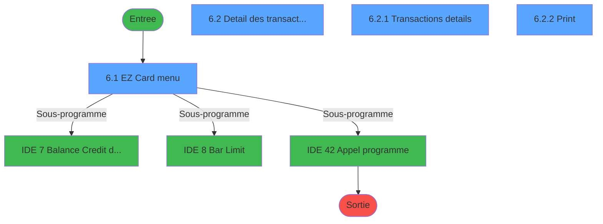
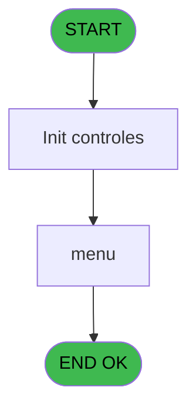
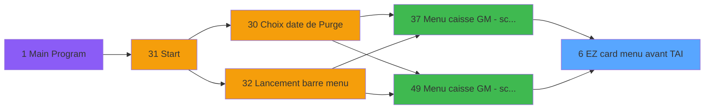
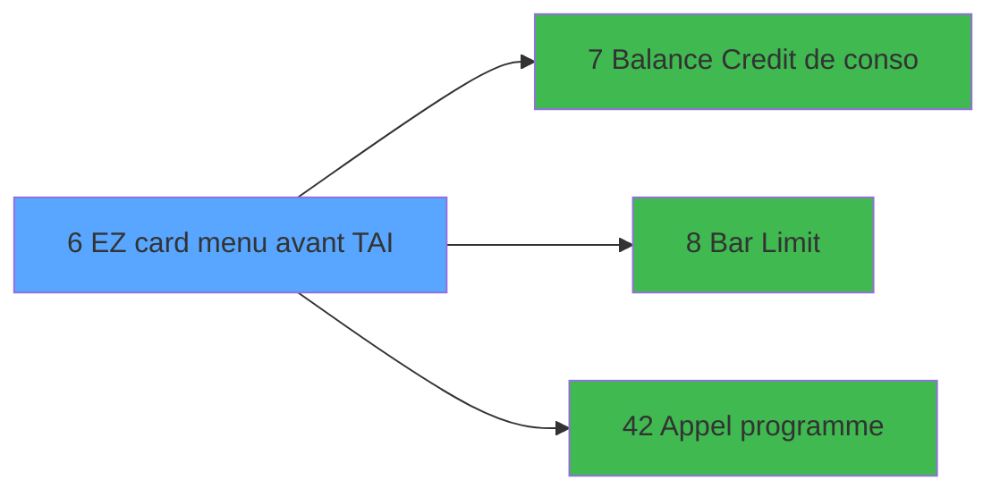

# CAP IDE 6 - EZ card menu avant TAI

> **Analyse**: Phases 1-4 2026-02-03 10:11 -> 10:11 (15s) | Assemblage 10:11
> **Pipeline**: V7.2 Enrichi
> **Structure**: 4 onglets (Resume | Ecrans | Donnees | Connexions)

<!-- TAB:Resume -->

## 1. FICHE D'IDENTITE

| Attribut | Valeur |
|----------|--------|
| Projet | CAP |
| IDE Position | 6 |
| Nom Programme | EZ card menu avant TAI |
| Fichier source | `Prg_6.xml` |
| Domaine metier | Navigation |
| Taches | 10 (4 ecrans visibles) |
| Tables modifiees | 0 |
| Programmes appeles | 3 |

## 2. DESCRIPTION FONCTIONNELLE

**EZ card menu avant TAI** assure la gestion complete de ce processus, accessible depuis [Menu caisse GM - scroll (IDE 37)](CAP-IDE-37.md), [Menu caisse GM - scroll @ (IDE 49)](CAP-IDE-49.md).

Le flux de traitement s'organise en **4 blocs fonctionnels** :

- **Saisie** (4 taches) : ecrans de saisie utilisateur (formulaires, champs, donnees)
- **Traitement** (3 taches) : traitements metier divers
- **Impression** (2 taches) : generation de tickets et documents
- **Initialisation** (1 tache) : reinitialisation d'etats et de variables de travail

Detail : phases du traitement

#### Phase 1 : Traitement (3 taches)

- **6** - EZ card menu **[[ECRAN]](#ecran-t1)**
- **6.1** - EZ Card menu **[[ECRAN]](#ecran-t2)**
- **6.3** - paramètre

Delegue a : [Balance Credit de conso (IDE 7)](CAP-IDE-7.md), [Bar Limit (IDE 8)](CAP-IDE-8.md), [Appel programme (IDE 42)](CAP-IDE-42.md)

#### Phase 2 : Saisie (4 taches)

- **6.2** - Detail des transactions EZCard **[[ECRAN]](#ecran-t3)**
- **6.2.1** - Transactions details **[[ECRAN]](#ecran-t4)**
- **6.2.2.3** - Transactions details **[[ECRAN]](#ecran-t8)**
- **6.2.2.4** - Transactions details **[[ECRAN]](#ecran-t9)**

#### Phase 3 : Impression (2 taches)

- **6.2.2** - Print **[[ECRAN]](#ecran-t5)**
- **6.2.2.1** - Choix imprimante v1

#### Phase 4 : Initialisation (1 tache)

- **6.2.2.2** - Init village **[[ECRAN]](#ecran-t7)**

## 3. BLOCS FONCTIONNELS

### 3.1 Traitement (3 taches)

Traitements internes.

---

#### 6 - EZ card menu [[ECRAN]](#ecran-t1)

**Role** : Traitement : EZ card menu.
**Ecran** : 130 x 65 DLU (MDI) | [Voir mockup](#ecran-t1)
**Variables liees** : H (v.EZ card ID)
**Delegue a** : [Balance Credit de conso (IDE 7)](CAP-IDE-7.md), [Bar Limit (IDE 8)](CAP-IDE-8.md), [Appel programme (IDE 42)](CAP-IDE-42.md)

---

#### 6.1 - EZ Card menu [[ECRAN]](#ecran-t2)

**Role** : Traitement : EZ Card menu.
**Ecran** : 1064 x 252 DLU (MDI) | [Voir mockup](#ecran-t2)
**Variables liees** : H (v.EZ card ID)
**Delegue a** : [Balance Credit de conso (IDE 7)](CAP-IDE-7.md), [Bar Limit (IDE 8)](CAP-IDE-8.md), [Appel programme (IDE 42)](CAP-IDE-42.md)

---

#### 6.3 - paramètre

**Role** : Traitement : paramètre.
**Delegue a** : [Balance Credit de conso (IDE 7)](CAP-IDE-7.md), [Bar Limit (IDE 8)](CAP-IDE-8.md), [Appel programme (IDE 42)](CAP-IDE-42.md)

### 3.2 Saisie (4 taches)

L'operateur saisit les donnees de la transaction via 4 ecrans (Detail des transactions EZCard, Transactions details, Transactions details, Transactions details).

---

#### 6.2 - Detail des transactions EZCard [[ECRAN]](#ecran-t3)

**Role** : Saisie des donnees : Detail des transactions EZCard.
**Ecran** : 1203 x 285 DLU (MDI) | [Voir mockup](#ecran-t3)
**Variables liees** : J (v.ez detail empty)

---

#### 6.2.1 - Transactions details [[ECRAN]](#ecran-t4)

**Role** : Saisie des donnees : Transactions details.
**Ecran** : 594 x 87 DLU (Modal) | [Voir mockup](#ecran-t4)

---

#### 6.2.2.3 - Transactions details [[ECRAN]](#ecran-t8)

**Role** : Saisie des donnees : Transactions details.
**Ecran** : 434 x 62 DLU (MDI) | [Voir mockup](#ecran-t8)

---

#### 6.2.2.4 - Transactions details [[ECRAN]](#ecran-t9)

**Role** : Saisie des donnees : Transactions details.
**Ecran** : 434 x 62 DLU (MDI) | [Voir mockup](#ecran-t9)

### 3.3 Impression (2 taches)

Generation des documents et tickets.

---

#### 6.2.2 - Print [[ECRAN]](#ecran-t5)

**Role** : Generation du document : Print.
**Ecran** : 430 x 59 DLU (MDI) | [Voir mockup](#ecran-t5)

---

#### 6.2.2.1 - Choix imprimante v1

**Role** : Selection par l'operateur : Choix imprimante v1.

### 3.4 Initialisation (1 tache)

Reinitialisation d'etats et variables de travail.

---

#### 6.2.2.2 - Init village [[ECRAN]](#ecran-t7)

**Role** : Reinitialisation : Init village.
**Ecran** : 274 x 204 DLU (MDI) | [Voir mockup](#ecran-t7)

## 5. REGLES METIER

*(Aucune regle metier identifiee)*

## 6. CONTEXTE

- **Appele par**: [Menu caisse GM - scroll (IDE 37)](CAP-IDE-37.md), [Menu caisse GM - scroll @ (IDE 49)](CAP-IDE-49.md)
- **Appelle**: 3 programmes | **Tables**: 8 (W:0 R:5 L:3) | **Taches**: 10 | **Expressions**: 14

<!-- TAB:Ecrans -->

## 8. ECRANS

### 8.1 Forms visibles (4 / 10)

| # | Position | Tache | Nom | Type | Largeur | Hauteur | Bloc |
|---|----------|-------|-----|------|---------|---------|------|
| 1 | 6.1 | 6.1 | EZ Card menu | MDI | 1064 | 252 | Traitement |
| 2 | 6.2 | 6.2 | Detail des transactions EZCard | MDI | 1203 | 285 | Saisie |
| 3 | 6.2.1 | 6.2.1 | Transactions details | Modal | 594 | 87 | Saisie |
| 4 | 6.2.2 | 6.2.2 | Print | MDI | 430 | 59 | Impression |

### 8.2 Mockups Ecrans

---

#### 6.1 - EZ Card menu
**Tache** : [6.1](#t2) | **Type** : MDI | **Dimensions** : 1064 x 252 DLU
**Bloc** : Traitement | **Titre IDE** : EZ Card menu

<!-- FORM-DATA:
{
    "width":  1064,
    "vFactor":  8,
    "type":  "MDI",
    "hFactor":  8,
    "controls":  [
                     {
                         "x":  0,
                         "type":  "label",
                         "var":  "",
                         "y":  1,
                         "w":  1060,
                         "fmt":  "",
                         "name":  "",
                         "h":  21,
                         "color":  "",
                         "text":  "",
                         "parent":  null
                     },
                     {
                         "x":  34,
                         "type":  "label",
                         "var":  "",
                         "y":  31,
                         "w":  98,
                         "fmt":  "",
                         "name":  "",
                         "h":  10,
                         "color":  "",
                         "text":  "Account # :",
                         "parent":  null
                     },
                     {
                         "x":  34,
                         "type":  "table",
                         "var":  "",
                         "name":  "",
                         "titleH":  12,
                         "color":  "110",
                         "w":  1005,
                         "y":  72,
                         "fmt":  "",
                         "parent":  null,
                         "text":  "",
                         "rowH":  14,
                         "h":  50,
                         "cols":  [
                                      {
                                          "title":  "Filiation",
                                          "layer":  1,
                                          "w":  112
                                      },
                                      {
                                          "title":  "Prénom",
                                          "layer":  2,
                                          "w":  141
                                      },
                                      {
                                          "title":  "Nom",
                                          "layer":  3,
                                          "w":  317
                                      },
                                      {
                                          "title":  "Opération",
                                          "layer":  4,
                                          "w":  400
                                      }
                                  ],
                         "rows":  4
                     },
                     {
                         "x":  33,
                         "type":  "label",
                         "var":  "",
                         "y":  126,
                         "w":  997,
                         "fmt":  "",
                         "name":  "",
                         "h":  92,
                         "color":  "",
                         "text":  "",
                         "parent":  null
                     },
                     {
                         "x":  37,
                         "type":  "label",
                         "var":  "",
                         "y":  128,
                         "w":  306,
                         "fmt":  "",
                         "name":  "",
                         "h":  53,
                         "color":  "",
                         "text":  "",
                         "parent":  18
                     },
                     {
                         "x":  341,
                         "type":  "label",
                         "var":  "",
                         "y":  128,
                         "w":  344,
                         "fmt":  "",
                         "name":  "",
                         "h":  53,
                         "color":  "",
                         "text":  "",
                         "parent":  18
                     },
                     {
                         "x":  690,
                         "type":  "label",
                         "var":  "",
                         "y":  128,
                         "w":  336,
                         "fmt":  "",
                         "name":  "",
                         "h":  53,
                         "color":  "",
                         "text":  "",
                         "parent":  18
                     },
                     {
                         "x":  40,
                         "type":  "label",
                         "var":  "",
                         "y":  130,
                         "w":  42,
                         "fmt":  "",
                         "name":  "",
                         "h":  50,
                         "color":  "",
                         "text":  "",
                         "parent":  18
                     },
                     {
                         "x":  345,
                         "type":  "label",
                         "var":  "",
                         "y":  130,
                         "w":  42,
                         "fmt":  "",
                         "name":  "",
                         "h":  50,
                         "color":  "",
                         "text":  "",
                         "parent":  18
                     },
                     {
                         "x":  692,
                         "type":  "label",
                         "var":  "",
                         "y":  130,
                         "w":  42,
                         "fmt":  "",
                         "name":  "",
                         "h":  50,
                         "color":  "",
                         "text":  "",
                         "parent":  18
                     },
                     {
                         "x":  104,
                         "type":  "label",
                         "var":  "",
                         "y":  131,
                         "w":  223,
                         "fmt":  "",
                         "name":  "",
                         "h":  10,
                         "color":  "142",
                         "text":  "Sur le compte",
                         "parent":  18
                     },
                     {
                         "x":  390,
                         "type":  "label",
                         "var":  "",
                         "y":  131,
                         "w":  274,
                         "fmt":  "",
                         "name":  "",
                         "h":  10,
                         "color":  "142",
                         "text":  "Sur la filiation",
                         "parent":  18
                     },
                     {
                         "x":  739,
                         "type":  "label",
                         "var":  "",
                         "y":  131,
                         "w":  274,
                         "fmt":  "",
                         "name":  "",
                         "h":  10,
                         "color":  "142",
                         "text":  "Sur la carte",
                         "parent":  18
                     },
                     {
                         "x":  104,
                         "type":  "line",
                         "var":  "",
                         "y":  142,
                         "w":  223,
                         "fmt":  "",
                         "name":  "",
                         "h":  0,
                         "color":  "",
                         "text":  "",
                         "parent":  25
                     },
                     {
                         "x":  398,
                         "type":  "line",
                         "var":  "",
                         "y":  142,
                         "w":  274,
                         "fmt":  "",
                         "name":  "",
                         "h":  0,
                         "color":  "",
                         "text":  "",
                         "parent":  20
                     },
                     {
                         "x":  747,
                         "type":  "line",
                         "var":  "",
                         "y":  142,
                         "w":  274,
                         "fmt":  "",
                         "name":  "",
                         "h":  0,
                         "color":  "",
                         "text":  "",
                         "parent":  21
                     },
                     {
                         "x":  91,
                         "type":  "label",
                         "var":  "",
                         "y":  146,
                         "w":  222,
                         "fmt":  "",
                         "name":  "",
                         "h":  9,
                         "color":  "142",
                         "text":  "Creation",
                         "parent":  18
                     },
                     {
                         "x":  395,
                         "type":  "label",
                         "var":  "",
                         "y":  146,
                         "w":  278,
                         "fmt":  "",
                         "name":  "",
                         "h":  9,
                         "color":  "142",
                         "text":  "Detail",
                         "parent":  18
                     },
                     {
                         "x":  742,
                         "type":  "label",
                         "var":  "",
                         "y":  146,
                         "w":  269,
                         "fmt":  "",
                         "name":  "",
                         "h":  9,
                         "color":  "142",
                         "text":  "Opposition",
                         "parent":  18
                     },
                     {
                         "x":  91,
                         "type":  "label",
                         "var":  "",
                         "y":  157,
                         "w":  222,
                         "fmt":  "",
                         "name":  "",
                         "h":  9,
                         "color":  "142",
                         "text":  "Detail",
                         "parent":  18
                     },
                     {
                         "x":  395,
                         "type":  "label",
                         "var":  "",
                         "y":  157,
                         "w":  278,
                         "fmt":  "",
                         "name":  "",
                         "h":  9,
                         "color":  "142",
                         "text":  "Balance credit de conso",
                         "parent":  18
                     },
                     {
                         "x":  742,
                         "type":  "label",
                         "var":  "",
                         "y":  157,
                         "w":  269,
                         "fmt":  "",
                         "name":  "",
                         "h":  9,
                         "color":  "142",
                         "text":  "Annulation d\u0027opposition",
                         "parent":  18
                     },
                     {
                         "x":  396,
                         "type":  "label",
                         "var":  "",
                         "y":  167,
                         "w":  278,
                         "fmt":  "",
                         "name":  "",
                         "h":  9,
                         "color":  "142",
                         "text":  "Reprise de tickets bar",
                         "parent":  18
                     },
                     {
                         "x":  742,
                         "type":  "label",
                         "var":  "",
                         "y":  169,
                         "w":  222,
                         "fmt":  "",
                         "name":  "",
                         "h":  9,
                         "color":  "142",
                         "text":  "Bar Limit",
                         "parent":  18
                     },
                     {
                         "x":  455,
                         "type":  "label",
                         "var":  "",
                         "y":  193,
                         "w":  120,
                         "fmt":  "",
                         "name":  "",
                         "h":  9,
                         "color":  "",
                         "text":  "Votre choix",
                         "parent":  18
                     },
                     {
                         "x":  0,
                         "type":  "label",
                         "var":  "",
                         "y":  225,
                         "w":  1060,
                         "fmt":  "",
                         "name":  "",
                         "h":  24,
                         "color":  "",
                         "text":  "",
                         "parent":  null
                     },
                     {
                         "x":  40,
                         "type":  "edit",
                         "var":  "",
                         "y":  88,
                         "w":  42,
                         "fmt":  "",
                         "name":  "",
                         "h":  10,
                         "color":  "110",
                         "text":  "",
                         "parent":  7
                     },
                     {
                         "x":  621,
                         "type":  "edit",
                         "var":  "",
                         "y":  88,
                         "w":  126,
                         "fmt":  "##/##/####Z",
                         "name":  "",
                         "h":  10,
                         "color":  "110",
                         "text":  "",
                         "parent":  7
                     },
                     {
                         "x":  771,
                         "type":  "edit",
                         "var":  "",
                         "y":  88,
                         "w":  91,
                         "fmt":  "HH:MMZ",
                         "name":  "",
                         "h":  10,
                         "color":  "110",
                         "text":  "",
                         "parent":  7
                     },
                     {
                         "x":  894,
                         "type":  "edit",
                         "var":  "",
                         "y":  88,
                         "w":  104,
                         "fmt":  "",
                         "name":  "",
                         "h":  10,
                         "color":  "110",
                         "text":  "",
                         "parent":  7
                     },
                     {
                         "x":  152,
                         "type":  "edit",
                         "var":  "",
                         "y":  88,
                         "w":  104,
                         "fmt":  "8",
                         "name":  "",
                         "h":  10,
                         "color":  "110",
                         "text":  "",
                         "parent":  7
                     },
                     {
                         "x":  296,
                         "type":  "edit",
                         "var":  "",
                         "y":  88,
                         "w":  299,
                         "fmt":  "U30",
                         "name":  "",
                         "h":  10,
                         "color":  "110",
                         "text":  "",
                         "parent":  7
                     },
                     {
                         "x":  579,
                         "type":  "edit",
                         "var":  "",
                         "y":  192,
                         "w":  26,
                         "fmt":  "UA",
                         "name":  "v.choix action",
                         "h":  10,
                         "color":  "110",
                         "text":  "",
                         "parent":  18
                     },
                     {
                         "x":  5,
                         "type":  "image",
                         "var":  "",
                         "y":  3,
                         "w":  59,
                         "fmt":  "",
                         "name":  "",
                         "h":  18,
                         "color":  "",
                         "text":  "",
                         "parent":  null
                     },
                     {
                         "x":  77,
                         "type":  "edit",
                         "var":  "",
                         "y":  7,
                         "w":  267,
                         "fmt":  "30",
                         "name":  "",
                         "h":  8,
                         "color":  "",
                         "text":  "",
                         "parent":  null
                     },
                     {
                         "x":  787,
                         "type":  "edit",
                         "var":  "",
                         "y":  7,
                         "w":  259,
                         "fmt":  "WWW DD MMM YYYYT",
                         "name":  "",
                         "h":  10,
                         "color":  "",
                         "text":  "",
                         "parent":  null
                     },
                     {
                         "x":  138,
                         "type":  "edit",
                         "var":  "",
                         "y":  31,
                         "w":  98,
                         "fmt":  "",
                         "name":  "",
                         "h":  10,
                         "color":  "",
                         "text":  "",
                         "parent":  null
                     },
                     {
                         "x":  48,
                         "type":  "button",
                         "var":  "",
                         "y":  146,
                         "w":  27,
                         "fmt":  "A",
                         "name":  "A",
                         "h":  9,
                         "color":  "",
                         "text":  "",
                         "parent":  null
                     },
                     {
                         "x":  350,
                         "type":  "button",
                         "var":  "",
                         "y":  146,
                         "w":  29,
                         "fmt":  "E",
                         "name":  "E",
                         "h":  9,
                         "color":  "",
                         "text":  "",
                         "parent":  null
                     },
                     {
                         "x":  698,
                         "type":  "button",
                         "var":  "",
                         "y":  146,
                         "w":  27,
                         "fmt":  "C",
                         "name":  "C",
                         "h":  9,
                         "color":  "",
                         "text":  "",
                         "parent":  null
                     },
                     {
                         "x":  48,
                         "type":  "button",
                         "var":  "",
                         "y":  157,
                         "w":  29,
                         "fmt":  "B",
                         "name":  "B",
                         "h":  9,
                         "color":  "",
                         "text":  "",
                         "parent":  null
                     },
                     {
                         "x":  350,
                         "type":  "button",
                         "var":  "",
                         "y":  157,
                         "w":  29,
                         "fmt":  "F",
                         "name":  "F",
                         "h":  9,
                         "color":  "",
                         "text":  "",
                         "parent":  null
                     },
                     {
                         "x":  697,
                         "type":  "button",
                         "var":  "",
                         "y":  157,
                         "w":  29,
                         "fmt":  "D",
                         "name":  "D",
                         "h":  9,
                         "color":  "",
                         "text":  "",
                         "parent":  null
                     },
                     {
                         "x":  350,
                         "type":  "button",
                         "var":  "",
                         "y":  167,
                         "w":  29,
                         "fmt":  "G",
                         "name":  "G",
                         "h":  9,
                         "color":  "",
                         "text":  "",
                         "parent":  null
                     },
                     {
                         "x":  697,
                         "type":  "button",
                         "var":  "",
                         "y":  169,
                         "w":  29,
                         "fmt":  "P",
                         "name":  "P",
                         "h":  9,
                         "color":  "",
                         "text":  "",
                         "parent":  null
                     },
                     {
                         "x":  929,
                         "type":  "image",
                         "var":  "",
                         "y":  184,
                         "w":  94,
                         "fmt":  "",
                         "name":  "",
                         "h":  31,
                         "color":  "",
                         "text":  "",
                         "parent":  null
                     },
                     {
                         "x":  8,
                         "type":  "button",
                         "var":  "",
                         "y":  228,
                         "w":  154,
                         "fmt":  "\u0026Quitter",
                         "name":  "",
                         "h":  18,
                         "color":  "",
                         "text":  "",
                         "parent":  42
                     },
                     {
                         "x":  899,
                         "type":  "button",
                         "var":  "",
                         "y":  228,
                         "w":  154,
                         "fmt":  "\u0026Scan EZCard",
                         "name":  "Z",
                         "h":  18,
                         "color":  "",
                         "text":  "",
                         "parent":  42
                     }
                 ],
    "taskId":  "6.1",
    "height":  252
}
-->

<strong>Champs : 10 champs</strong>

| Pos (x,y) | Nom | Variable | Type |
|-----------|-----|----------|------|
| 40,88 | (sans nom) | - | edit |
| 621,88 | ##/##/####Z | - | edit |
| 771,88 | HH:MMZ | - | edit |
| 894,88 | (sans nom) | - | edit |
| 152,88 | 8 | - | edit |
| 296,88 | U30 | - | edit |
| 579,192 | v.choix action | - | edit |
| 77,7 | 30 | - | edit |
| 787,7 | WWW DD MMM YYYYT | - | edit |
| 138,31 | (sans nom) | - | edit |

<strong>Boutons : 10 boutons</strong>

| Bouton | Pos (x,y) | Action |
|--------|-----------|--------|
| A | 48,146 | Bouton fonctionnel |
| E | 350,146 | Bouton fonctionnel |
| C | 698,146 | Bouton fonctionnel |
| B | 48,157 | Bouton fonctionnel |
| F | 350,157 | Bouton fonctionnel |
| D | 697,157 | Bouton fonctionnel |
| G | 350,167 | Bouton fonctionnel |
| P | 697,169 | Bouton fonctionnel |
| Quitter | 8,228 | Quitte le programme |
| Scan EZCard | 899,228 | Bouton fonctionnel |

---

#### 6.2 - Detail des transactions EZCard
**Tache** : [6.2](#t3) | **Type** : MDI | **Dimensions** : 1203 x 285 DLU
**Bloc** : Saisie | **Titre IDE** : Detail des transactions EZCard

<!-- FORM-DATA:
{
    "width":  1203,
    "vFactor":  8,
    "type":  "MDI",
    "hFactor":  8,
    "controls":  [
                     {
                         "x":  0,
                         "type":  "label",
                         "var":  "",
                         "y":  0,
                         "w":  1190,
                         "fmt":  "",
                         "name":  "",
                         "h":  21,
                         "color":  "",
                         "text":  "",
                         "parent":  null
                     },
                     {
                         "x":  8,
                         "type":  "table",
                         "var":  "",
                         "name":  "",
                         "titleH":  14,
                         "color":  "110",
                         "w":  1189,
                         "y":  42,
                         "fmt":  "",
                         "parent":  null,
                         "text":  "",
                         "rowH":  12,
                         "h":  111,
                         "cols":  [
                                      {
                                          "title":  "Bar",
                                          "layer":  1,
                                          "w":  160
                                      },
                                      {
                                          "title":  "Ticket #",
                                          "layer":  2,
                                          "w":  211
                                      },
                                      {
                                          "title":  "Vente",
                                          "layer":  3,
                                          "w":  183
                                      },
                                      {
                                          "title":  "Payant",
                                          "layer":  4,
                                          "w":  171
                                      },
                                      {
                                          "title":  "Crédit conso",
                                          "layer":  5,
                                          "w":  173
                                      },
                                      {
                                          "title":  "Date",
                                          "layer":  6,
                                          "w":  147
                                      },
                                      {
                                          "title":  "Heure",
                                          "layer":  7,
                                          "w":  101
                                      }
                                  ],
                         "rows":  7
                     },
                     {
                         "x":  211,
                         "type":  "label",
                         "var":  "",
                         "y":  159,
                         "w":  544,
                         "fmt":  "",
                         "name":  "",
                         "h":  14,
                         "color":  "120",
                         "text":  "Il n\u0027y a pas de transaction sur cette carte",
                         "parent":  null
                     },
                     {
                         "x":  8,
                         "type":  "edit",
                         "var":  "",
                         "y":  27,
                         "w":  296,
                         "fmt":  "",
                         "name":  "",
                         "h":  12,
                         "color":  "",
                         "text":  "",
                         "parent":  null
                     },
                     {
                         "x":  228,
                         "type":  "edit",
                         "var":  "",
                         "y":  28,
                         "w":  42,
                         "fmt":  "",
                         "name":  "",
                         "h":  10,
                         "color":  "",
                         "text":  "",
                         "parent":  null
                     },
                     {
                         "x":  394,
                         "type":  "edit",
                         "var":  "",
                         "y":  60,
                         "w":  151,
                         "fmt":  "",
                         "name":  "",
                         "h":  8,
                         "color":  "6",
                         "text":  "",
                         "parent":  8
                     },
                     {
                         "x":  573,
                         "type":  "edit",
                         "var":  "",
                         "y":  60,
                         "w":  151,
                         "fmt":  "",
                         "name":  "",
                         "h":  8,
                         "color":  "6",
                         "text":  "",
                         "parent":  8
                     },
                     {
                         "x":  744,
                         "type":  "edit",
                         "var":  "",
                         "y":  60,
                         "w":  151,
                         "fmt":  "",
                         "name":  "",
                         "h":  8,
                         "color":  "6",
                         "text":  "",
                         "parent":  8
                     },
                     {
                         "x":  923,
                         "type":  "edit",
                         "var":  "",
                         "y":  60,
                         "w":  124,
                         "fmt":  "",
                         "name":  "",
                         "h":  8,
                         "color":  "6",
                         "text":  "",
                         "parent":  8
                     },
                     {
                         "x":  1062,
                         "type":  "edit",
                         "var":  "",
                         "y":  60,
                         "w":  76,
                         "fmt":  "HH:MMZ",
                         "name":  "",
                         "h":  8,
                         "color":  "6",
                         "text":  "",
                         "parent":  8
                     },
                     {
                         "x":  980,
                         "type":  "button",
                         "var":  "",
                         "y":  157,
                         "w":  198,
                         "fmt":  "\u0026Détail",
                         "name":  "bt view details",
                         "h":  18,
                         "color":  "",
                         "text":  "",
                         "parent":  null
                     },
                     {
                         "x":  5,
                         "type":  "image",
                         "var":  "",
                         "y":  2,
                         "w":  59,
                         "fmt":  "",
                         "name":  "",
                         "h":  18,
                         "color":  "",
                         "text":  "",
                         "parent":  null
                     },
                     {
                         "x":  77,
                         "type":  "edit",
                         "var":  "",
                         "y":  6,
                         "w":  267,
                         "fmt":  "30",
                         "name":  "",
                         "h":  8,
                         "color":  "",
                         "text":  "",
                         "parent":  null
                     },
                     {
                         "x":  905,
                         "type":  "edit",
                         "var":  "",
                         "y":  7,
                         "w":  259,
                         "fmt":  "WWW DD MMM YYYYT",
                         "name":  "",
                         "h":  8,
                         "color":  "",
                         "text":  "",
                         "parent":  null
                     },
                     {
                         "x":  322,
                         "type":  "edit",
                         "var":  "",
                         "y":  27,
                         "w":  314,
                         "fmt":  "60",
                         "name":  "",
                         "h":  12,
                         "color":  "",
                         "text":  "",
                         "parent":  null
                     },
                     {
                         "x":  16,
                         "type":  "edit",
                         "var":  "",
                         "y":  60,
                         "w":  150,
                         "fmt":  "30",
                         "name":  "",
                         "h":  8,
                         "color":  "6",
                         "text":  "",
                         "parent":  8
                     },
                     {
                         "x":  171,
                         "type":  "edit",
                         "var":  "",
                         "y":  60,
                         "w":  200,
                         "fmt":  "14",
                         "name":  "",
                         "h":  8,
                         "color":  "6",
                         "text":  "",
                         "parent":  8
                     },
                     {
                         "x":  779,
                         "type":  "button",
                         "var":  "",
                         "y":  157,
                         "w":  198,
                         "fmt":  "\u0026Imprimer",
                         "name":  "Print",
                         "h":  18,
                         "color":  "",
                         "text":  "",
                         "parent":  null
                     },
                     {
                         "x":  976,
                         "type":  "button",
                         "var":  "",
                         "y":  264,
                         "w":  198,
                         "fmt":  "Exit",
                         "name":  "",
                         "h":  18,
                         "color":  "",
                         "text":  "",
                         "parent":  null
                     }
                 ],
    "taskId":  "6.2",
    "height":  285
}
-->

<strong>Champs : 12 champs</strong>

| Pos (x,y) | Nom | Variable | Type |
|-----------|-----|----------|------|
| 8,27 | (sans nom) | - | edit |
| 228,28 | (sans nom) | - | edit |
| 394,60 | (sans nom) | - | edit |
| 573,60 | (sans nom) | - | edit |
| 744,60 | (sans nom) | - | edit |
| 923,60 | (sans nom) | - | edit |
| 1062,60 | HH:MMZ | - | edit |
| 77,6 | 30 | - | edit |
| 905,7 | WWW DD MMM YYYYT | - | edit |
| 322,27 | 60 | - | edit |
| 16,60 | 30 | - | edit |
| 171,60 | 14 | - | edit |

<strong>Boutons : 3 boutons</strong>

| Bouton | Pos (x,y) | Action |
|--------|-----------|--------|
| Détail | 980,157 | Bouton fonctionnel |
| Imprimer | 779,157 | Lance l'impression |
| Exit | 976,264 | Quitte le programme |

---

#### 6.2.1 - Transactions details
**Tache** : [6.2.1](#t4) | **Type** : Modal | **Dimensions** : 594 x 87 DLU
**Bloc** : Saisie | **Titre IDE** : Transactions details

<!-- FORM-DATA:
{
    "width":  594,
    "vFactor":  8,
    "type":  "Modal",
    "hFactor":  4,
    "controls":  [
                     {
                         "x":  6,
                         "type":  "table",
                         "var":  "",
                         "name":  "",
                         "titleH":  14,
                         "color":  "110",
                         "w":  538,
                         "y":  2,
                         "fmt":  "",
                         "parent":  null,
                         "text":  "",
                         "rowH":  14,
                         "h":  83,
                         "cols":  [
                                      {
                                          "title":  "Ticket #",
                                          "layer":  1,
                                          "w":  127
                                      },
                                      {
                                          "title":  "Article",
                                          "layer":  2,
                                          "w":  124
                                      },
                                      {
                                          "title":  "Qté",
                                          "layer":  3,
                                          "w":  38
                                      },
                                      {
                                          "title":  "Montant",
                                          "layer":  4,
                                          "w":  100
                                      },
                                      {
                                          "title":  "Happy hour",
                                          "layer":  5,
                                          "w":  133
                                      }
                                  ],
                         "rows":  5
                     },
                     {
                         "x":  137,
                         "type":  "edit",
                         "var":  "",
                         "y":  18,
                         "w":  116,
                         "fmt":  "",
                         "name":  "",
                         "h":  12,
                         "color":  "110",
                         "text":  "",
                         "parent":  1
                     },
                     {
                         "x":  261,
                         "type":  "edit",
                         "var":  "",
                         "y":  18,
                         "w":  21,
                         "fmt":  "",
                         "name":  "",
                         "h":  12,
                         "color":  "110",
                         "text":  "",
                         "parent":  1
                     },
                     {
                         "x":  303,
                         "type":  "edit",
                         "var":  "",
                         "y":  18,
                         "w":  83,
                         "fmt":  "",
                         "name":  "",
                         "h":  12,
                         "color":  "110",
                         "text":  "",
                         "parent":  1
                     },
                     {
                         "x":  413,
                         "type":  "combobox",
                         "var":  "",
                         "y":  18,
                         "w":  55,
                         "fmt":  "",
                         "name":  "",
                         "h":  12,
                         "color":  "110",
                         "text":  "Oui,Non",
                         "parent":  1
                     },
                     {
                         "x":  10,
                         "type":  "edit",
                         "var":  "",
                         "y":  18,
                         "w":  120,
                         "fmt":  "14",
                         "name":  "",
                         "h":  12,
                         "color":  "110",
                         "text":  "",
                         "parent":  1
                     }
                 ],
    "taskId":  "6.2.1",
    "height":  87
}
-->

<strong>Champs : 5 champs</strong>

| Pos (x,y) | Nom | Variable | Type |
|-----------|-----|----------|------|
| 137,18 | (sans nom) | - | edit |
| 261,18 | (sans nom) | - | edit |
| 303,18 | (sans nom) | - | edit |
| 413,18 | Oui,Non | - | combobox |
| 10,18 | 14 | - | edit |

---

#### 6.2.2 - Print
**Tache** : [6.2.2](#t5) | **Type** : MDI | **Dimensions** : 430 x 59 DLU
**Bloc** : Impression | **Titre IDE** : Print

<!-- FORM-DATA:
{
    "width":  430,
    "vFactor":  8,
    "type":  "MDI",
    "hFactor":  8,
    "controls":  [
                     {
                         "x":  2,
                         "type":  "label",
                         "var":  "",
                         "y":  0,
                         "w":  423,
                         "fmt":  "",
                         "name":  "",
                         "h":  29,
                         "color":  "",
                         "text":  "",
                         "parent":  null
                     },
                     {
                         "x":  122,
                         "type":  "label",
                         "var":  "",
                         "y":  10,
                         "w":  256,
                         "fmt":  "",
                         "name":  "",
                         "h":  8,
                         "color":  "142",
                         "text":  "Impression en cours ...",
                         "parent":  null
                     },
                     {
                         "x":  2,
                         "type":  "label",
                         "var":  "",
                         "y":  29,
                         "w":  423,
                         "fmt":  "",
                         "name":  "",
                         "h":  27,
                         "color":  "",
                         "text":  "",
                         "parent":  null
                     },
                     {
                         "x":  29,
                         "type":  "label",
                         "var":  "",
                         "y":  38,
                         "w":  375,
                         "fmt":  "",
                         "name":  "",
                         "h":  8,
                         "color":  "",
                         "text":  "Transactions EZCard",
                         "parent":  null
                     },
                     {
                         "x":  6,
                         "type":  "image",
                         "var":  "",
                         "y":  2,
                         "w":  72,
                         "fmt":  "",
                         "name":  "",
                         "h":  25,
                         "color":  "",
                         "text":  "",
                         "parent":  null
                     }
                 ],
    "taskId":  "6.2.2",
    "height":  59
}
-->

## 9. NAVIGATION

### 9.1 Enchainement des ecrans

**Detail par enchainement :**

| Depuis | Action | Vers | Retour |
|--------|--------|------|--------|
| EZ Card menu | Sous-programme | [Balance Credit de conso (IDE 7)](CAP-IDE-7.md) | Retour ecran |
| EZ Card menu | Sous-programme | [Bar Limit (IDE 8)](CAP-IDE-8.md) | Retour ecran |
| EZ Card menu | Sous-programme | [Appel programme (IDE 42)](CAP-IDE-42.md) | Retour ecran |

### 9.3 Structure hierarchique (10 taches)

| Position | Tache | Type | Dimensions | Bloc |
|----------|-------|------|------------|------|
| **6.1** | [**EZ card menu** (6)](#t1) [mockup](#ecran-t1) | MDI | 130x65 | Traitement |
| 6.1.1 | [EZ Card menu (6.1)](#t2) [mockup](#ecran-t2) | MDI | 1064x252 | |
| 6.1.2 | [paramètre (6.3)](#t10) | MDI | - | |
| **6.2** | [**Detail des transactions EZCard** (6.2)](#t3) [mockup](#ecran-t3) | MDI | 1203x285 | Saisie |
| 6.2.1 | [Transactions details (6.2.1)](#t4) [mockup](#ecran-t4) | Modal | 594x87 | |
| 6.2.2 | [Transactions details (6.2.2.3)](#t8) [mockup](#ecran-t8) | MDI | 434x62 | |
| 6.2.3 | [Transactions details (6.2.2.4)](#t9) [mockup](#ecran-t9) | MDI | 434x62 | |
| **6.3** | [**Print** (6.2.2)](#t5) [mockup](#ecran-t5) | MDI | 430x59 | Impression |
| 6.3.1 | [Choix imprimante v1 (6.2.2.1)](#t6) | MDI | - | |
| **6.4** | [**Init village** (6.2.2.2)](#t7) [mockup](#ecran-t7) | MDI | 274x204 | Initialisation |

### 9.4 Algorigramme

> **Legende**: Vert = START/END OK | Rouge = END KO | Bleu = Decisions
> *Algorigramme auto-genere. Utiliser `/algorigramme` pour une synthese metier detaillee.*

<!-- TAB:Donnees -->

## 10. TABLES

### Tables utilisees (8)

| ID | Nom | Description | Type | R | W | L | Usages |
|----|-----|-------------|------|---|---|---|--------|
| 24 | imprimante_______prn |  | DB | R |   |   | 1 |
| 69 | initialisation___ini |  | DB | R |   |   | 1 |
| 728 | arc_cc_total |  | DB | R |   |   | 1 |
| 741 | Table_741 |  | MEM | R |   |   | 1 |
| 742 | BarCreditConso |  | DB |   |   | L | 3 |
| 744 | pv_lieux_vente | Donnees de ventes | DB | R |   |   | 4 |
| 750 | Table_750 |  | MEM |   |   | L | 2 |
| 752 | system |  | DB |   |   | L | 1 |

### Colonnes par table (3 / 5 tables avec colonnes identifiees)

Table 24 - imprimante_______prn (R) - 1 usages

| Lettre | Variable | Acces | Type |
|--------|----------|-------|------|
| A | v.imprimante | R | Numeric |

Table 69 - initialisation___ini (R) - 1 usages

*Table utilisee uniquement en Link ou aucune colonne Real identifiee dans le DataView.*

Table 728 - arc_cc_total (R) - 1 usages

| Lettre | Variable | Acces | Type |
|--------|----------|-------|------|
| A | v.total ticket | R | Numeric |
| B | v.total payant | R | Numeric |
| C | v.total credit conso | R | Numeric |

Table 741 - Table_741 (R) - 1 usages

*Table utilisee uniquement en Link ou aucune colonne Real identifiee dans le DataView.*

Table 744 - pv_lieux_vente (R) - 4 usages

| Lettre | Variable | Acces | Type |
|--------|----------|-------|------|
| A | r.other card valid | R | Logical |
| B | v.choix action | R | Alpha |
| C | v.age | R | Numeric |

## 11. VARIABLES

### 11.1 Parametres entrants (5)

Variables recues du programme appelant ([Menu caisse GM - scroll (IDE 37)](CAP-IDE-37.md)).

| Lettre | Nom | Type | Usage dans |
|--------|-----|------|-----------|
| A | p.societe | Alpha | - |
| B | p.code-8chiffres | Numeric | - |
| C | p.filiation | Numeric | - |
| D | p.masque montant | Alpha | - |
| E | p.masque cumul | Alpha | - |

### 11.2 Variables de session (8)

Variables persistantes pendant toute la session.

| Lettre | Nom | Type | Usage dans |
|--------|-----|------|-----------|
| F | v.nom-complet | Alpha | - |
| G | v.prenom-complet | Alpha | - |
| H | v.EZ card ID | Alpha | - |
| I | v.delete confirmation | Logical | - |
| J | v.ez detail empty | Logical | - |
| K | v.ok to create | Logical | - |
| L | v.action | Alpha | 9x session |
| M | v. Age mineur | Numeric | - |

## 12. EXPRESSIONS

**14 / 14 expressions decodees (100%)**

### 12.1 Repartition par type

| Type | Expressions | Regles |
|------|-------------|--------|
| CONSTANTE | 3 | 0 |
| CONDITION | 9 | 0 |
| CAST_LOGIQUE | 1 | 0 |
| REFERENCE_VG | 1 | 0 |

### 12.2 Expressions cles par type

#### CONSTANTE (3 expressions)

| Type | IDE | Expression | Regle |
|------|-----|------------|-------|
| CONSTANTE | 5 | `'S'` | - |
| CONSTANTE | 3 | `''` | - |
| CONSTANTE | 1 | `''` | - |

#### CONDITION (9 expressions)

| Type | IDE | Expression | Regle |
|------|-----|------------|-------|
| CONDITION | 11 | `v.action [L]='F'` | - |
| CONDITION | 10 | `v.action [L]='Z'` | - |
| CONDITION | 13 | `v.action [L]='P'` | - |
| CONDITION | 12 | `v.action [L]='G'` | - |
| CONDITION | 9 | `v.action [L]='E' OR v.action [L]='B'` | - |
| ... | | *+4 autres* | |

#### CAST_LOGIQUE (1 expressions)

| Type | IDE | Expression | Regle |
|------|-----|------------|-------|
| CAST_LOGIQUE | 4 | `'FALSE'LOG` | - |

#### REFERENCE_VG (1 expressions)

| Type | IDE | Expression | Regle |
|------|-----|------------|-------|
| REFERENCE_VG | 14 | `VG1` | - |

<!-- TAB:Connexions -->

## 13. GRAPHE D'APPELS

### 13.1 Chaine depuis Main (Callers)

Main -> ... -> [Menu caisse GM - scroll (IDE 37)](CAP-IDE-37.md) -> **EZ card menu avant TAI (IDE 6)**

Main -> ... -> [Menu caisse GM - scroll @ (IDE 49)](CAP-IDE-49.md) -> **EZ card menu avant TAI (IDE 6)**

### 13.2 Callers

| IDE | Nom Programme | Nb Appels |
|-----|---------------|-----------|
| [37](CAP-IDE-37.md) | Menu caisse GM - scroll | 1 |
| [49](CAP-IDE-49.md) | Menu caisse GM - scroll @ | 1 |

### 13.3 Callees (programmes appeles)

### 13.4 Detail Callees avec contexte

| IDE | Nom Programme | Appels | Contexte |
|-----|---------------|--------|----------|
| [7](CAP-IDE-7.md) | Balance Credit de conso | 1 | Sous-programme |
| [8](CAP-IDE-8.md) | Bar Limit | 1 | Sous-programme |
| [42](CAP-IDE-42.md) | Appel programme | 1 | Sous-programme |

## 14. RECOMMANDATIONS MIGRATION

### 14.1 Profil du programme

| Metrique | Valeur | Impact migration |
|----------|--------|-----------------|
| Lignes de logique | 258 | Taille moyenne |
| Expressions | 14 | Peu de logique |
| Tables WRITE | 0 | Impact faible |
| Sous-programmes | 3 | Peu de dependances |
| Ecrans visibles | 4 | Quelques ecrans |
| Code desactive | 0% (0 / 258) | Code sain |
| Regles metier | 0 | Pas de regle identifiee |

### 14.2 Plan de migration par bloc

#### Traitement (3 taches: 2 ecrans, 1 traitement)

- **Strategie** : Orchestrateur avec 2 ecrans (Razor/React) et 1 traitements backend (services).
- Les ecrans deviennent des composants UI, les traitements invisibles deviennent des services injectables.
- 3 sous-programme(s) a migrer ou a reutiliser depuis les services existants.
- Decomposer les taches en services unitaires testables.

#### Saisie (4 taches: 4 ecrans, 0 traitement)

- **Strategie** : Formulaire React/Blazor avec validation Zod/FluentValidation.
- Reproduire 4 ecrans : Detail des transactions EZCard, Transactions details, Transactions details, Transactions details
- Validation temps reel cote client + serveur

#### Impression (2 taches: 1 ecran, 1 traitement)

- **Strategie** : Templates HTML -> PDF via wkhtmltopdf ou Puppeteer.
- `PrintService` injectable avec choix imprimante

#### Initialisation (1 tache: 1 ecran, 0 traitement)

- **Strategie** : Constructeur/methode `InitAsync()` dans l'orchestrateur.

### 14.3 Dependances critiques

| Dependance | Type | Appels | Impact |
|------------|------|--------|--------|
| [Appel programme (IDE 42)](CAP-IDE-42.md) | Sous-programme | 1x | Normale - Sous-programme |
| [Bar Limit (IDE 8)](CAP-IDE-8.md) | Sous-programme | 1x | Normale - Sous-programme |
| [Balance Credit de conso (IDE 7)](CAP-IDE-7.md) | Sous-programme | 1x | Normale - Sous-programme |

---
*Spec DETAILED generee par Pipeline V7.2 - 2026-02-03 10:11*
