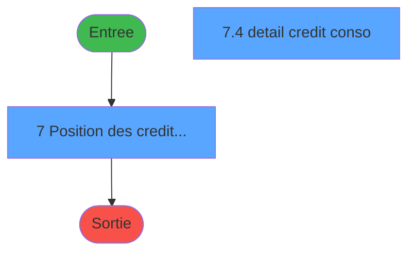
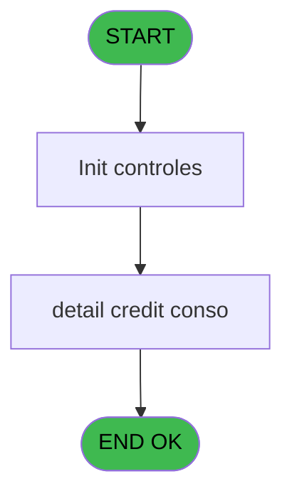
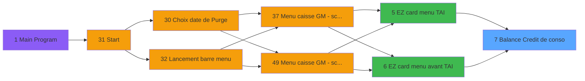

# CAP IDE 7 - Balance Credit de conso

> **Analyse**: Phases 1-4 2026-02-03 10:11 -> 10:11 (14s) | Assemblage 10:11
> **Pipeline**: V7.2 Enrichi
> **Structure**: 4 onglets (Resume | Ecrans | Donnees | Connexions)

<!-- TAB:Resume -->

## 1. FICHE D'IDENTITE

| Attribut | Valeur |
|----------|--------|
| Projet | CAP |
| IDE Position | 7 |
| Nom Programme | Balance Credit de conso |
| Fichier source | `Prg_7.xml` |
| Domaine metier | General |
| Taches | 6 (2 ecrans visibles) |
| Tables modifiees | 0 |
| Programmes appeles | 0 |

## 2. DESCRIPTION FONCTIONNELLE

**Balance Credit de conso** assure la gestion complete de ce processus, accessible depuis [EZ card menu TAI (IDE 5)](CAP-IDE-5.md), [EZ card menu avant TAI (IDE 6)](CAP-IDE-6.md).

Le flux de traitement s'organise en **3 blocs fonctionnels** :

- **Saisie** (3 taches) : ecrans de saisie utilisateur (formulaires, champs, donnees)
- **Traitement** (2 taches) : traitements metier divers
- **Initialisation** (1 tache) : reinitialisation d'etats et de variables de travail

**Logique metier** : 1 regles identifiees couvrant conditions metier.

Detail : phases du traitement

#### Phase 1 : Traitement (2 taches)

- **7** - Position des credits bar **[[ECRAN]](#ecran-t1)**
- **7.4** - detail credit conso **[[ECRAN]](#ecran-t5)**

#### Phase 2 : Initialisation (1 tache)

- **7.1** - Init village **[[ECRAN]](#ecran-t2)**

#### Phase 3 : Saisie (3 taches)

- **7.2** - Transactions details **[[ECRAN]](#ecran-t3)**
- **7.3** - Transactions details **[[ECRAN]](#ecran-t4)**
- **7.5** - Transactions details **[[ECRAN]](#ecran-t6)**

## 3. BLOCS FONCTIONNELS

### 3.1 Traitement (2 taches)

Traitements internes.

---

#### 7 - Position des credits bar [[ECRAN]](#ecran-t1)

**Role** : Calcul fidelite/avantage : Position des credits bar.
**Ecran** : 728 x 258 DLU (MDI) | [Voir mockup](#ecran-t1)

---

#### 7.4 - detail credit conso [[ECRAN]](#ecran-t5)

**Role** : Calcul fidelite/avantage : detail credit conso.
**Ecran** : 348 x 70 DLU (Modal) | [Voir mockup](#ecran-t5)
**Variables liees** : G (v.detail), H (bt.detail)

### 3.2 Initialisation (1 tache)

Reinitialisation d'etats et variables de travail.

---

#### 7.1 - Init village [[ECRAN]](#ecran-t2)

**Role** : Reinitialisation : Init village.
**Ecran** : 274 x 204 DLU (MDI) | [Voir mockup](#ecran-t2)
**Variables liees** : D (v.nom village)

### 3.3 Saisie (3 taches)

L'operateur saisit les donnees de la transaction via 3 ecrans (Transactions details, Transactions details, Transactions details).

---

#### 7.2 - Transactions details [[ECRAN]](#ecran-t3)

**Role** : Saisie des donnees : Transactions details.
**Ecran** : 213 x 45 DLU (MDI) | [Voir mockup](#ecran-t3)

---

#### 7.3 - Transactions details [[ECRAN]](#ecran-t4)

**Role** : Saisie des donnees : Transactions details.
**Ecran** : 213 x 45 DLU (MDI) | [Voir mockup](#ecran-t4)

---

#### 7.5 - Transactions details [[ECRAN]](#ecran-t6)

**Role** : Saisie des donnees : Transactions details.
**Ecran** : 213 x 45 DLU (MDI) | [Voir mockup](#ecran-t6)

## 5. REGLES METIER

1 regles identifiees:

### Autres (1 regles)

#### [RM-001] Si [X] alors 'Quit Detail' sinon 'Detail')

| Element | Detail |
|---------|--------|
| **Condition** | `[X]` |
| **Si vrai** | 'Quit Detail' |
| **Si faux** | 'Detail') |
| **Expression source** | Expression 13 : `IF ([X],'Quit Detail','Detail')` |
| **Exemple** | Si [X] → 'Quit Detail'. Sinon → 'Detail') |
| **Impact** | [7.4 - detail credit conso](#t5) |

## 6. CONTEXTE

- **Appele par**: [EZ card menu TAI (IDE 5)](CAP-IDE-5.md), [EZ card menu avant TAI (IDE 6)](CAP-IDE-6.md)
- **Appelle**: 0 programmes | **Tables**: 6 (W:0 R:3 L:4) | **Taches**: 6 | **Expressions**: 19

<!-- TAB:Ecrans -->

## 8. ECRANS

### 8.1 Forms visibles (2 / 6)

| # | Position | Tache | Nom | Type | Largeur | Hauteur | Bloc |
|---|----------|-------|-----|------|---------|---------|------|
| 1 | 7 | 7 | Position des credits bar | MDI | 728 | 258 | Traitement |
| 2 | 7.4 | 7.4 | detail credit conso | Modal | 348 | 70 | Traitement |

### 8.2 Mockups Ecrans

---

#### 7 - Position des credits bar
**Tache** : [7](#t1) | **Type** : MDI | **Dimensions** : 728 x 258 DLU
**Bloc** : Traitement | **Titre IDE** : Position des credits bar

<!-- FORM-DATA:
{
    "width":  728,
    "vFactor":  8,
    "type":  "MDI",
    "hFactor":  8,
    "controls":  [
                     {
                         "x":  15,
                         "type":  "label",
                         "var":  "",
                         "y":  0,
                         "w":  699,
                         "fmt":  "",
                         "name":  "",
                         "h":  21,
                         "color":  "",
                         "text":  "",
                         "parent":  null
                     },
                     {
                         "x":  48,
                         "type":  "table",
                         "var":  "",
                         "name":  "",
                         "titleH":  14,
                         "color":  "110",
                         "w":  643,
                         "y":  43,
                         "fmt":  "",
                         "parent":  null,
                         "text":  "",
                         "rowH":  12,
                         "h":  90,
                         "cols":  [
                                      {
                                          "title":  "Type de crédit",
                                          "layer":  1,
                                          "w":  357
                                      },
                                      {
                                          "title":  "Total",
                                          "layer":  2,
                                          "w":  244
                                      }
                                  ],
                         "rows":  2
                     },
                     {
                         "x":  271,
                         "type":  "label",
                         "var":  "",
                         "y":  137,
                         "w":  151,
                         "fmt":  "",
                         "name":  "",
                         "h":  13,
                         "color":  "",
                         "text":  "Total",
                         "parent":  null
                     },
                     {
                         "x":  15,
                         "type":  "label",
                         "var":  "",
                         "y":  155,
                         "w":  699,
                         "fmt":  "",
                         "name":  "",
                         "h":  21,
                         "color":  "",
                         "text":  "",
                         "parent":  null
                     },
                     {
                         "x":  50,
                         "type":  "edit",
                         "var":  "",
                         "y":  27,
                         "w":  296,
                         "fmt":  "",
                         "name":  "",
                         "h":  12,
                         "color":  "",
                         "text":  "",
                         "parent":  null
                     },
                     {
                         "x":  270,
                         "type":  "edit",
                         "var":  "",
                         "y":  28,
                         "w":  42,
                         "fmt":  "",
                         "name":  "",
                         "h":  10,
                         "color":  "",
                         "text":  "",
                         "parent":  null
                     },
                     {
                         "x":  430,
                         "type":  "edit",
                         "var":  "",
                         "y":  59,
                         "w":  150,
                         "fmt":  "",
                         "name":  "",
                         "h":  8,
                         "color":  "6",
                         "text":  "",
                         "parent":  8
                     },
                     {
                         "x":  83,
                         "type":  "edit",
                         "var":  "",
                         "y":  59,
                         "w":  150,
                         "fmt":  "",
                         "name":  "libelle credit",
                         "h":  8,
                         "color":  "6",
                         "text":  "",
                         "parent":  8
                     },
                     {
                         "x":  430,
                         "type":  "edit",
                         "var":  "",
                         "y":  137,
                         "w":  225,
                         "fmt":  "",
                         "name":  "",
                         "h":  13,
                         "color":  "110",
                         "text":  "",
                         "parent":  null
                     },
                     {
                         "x":  195,
                         "type":  "button",
                         "var":  "",
                         "y":  157,
                         "w":  160,
                         "fmt":  "",
                         "name":  "DETAIL",
                         "h":  18,
                         "color":  "",
                         "text":  "",
                         "parent":  null
                     },
                     {
                         "x":  20,
                         "type":  "image",
                         "var":  "",
                         "y":  2,
                         "w":  59,
                         "fmt":  "",
                         "name":  "",
                         "h":  18,
                         "color":  "",
                         "text":  "",
                         "parent":  null
                     },
                     {
                         "x":  92,
                         "type":  "edit",
                         "var":  "",
                         "y":  6,
                         "w":  267,
                         "fmt":  "30",
                         "name":  "",
                         "h":  8,
                         "color":  "",
                         "text":  "",
                         "parent":  null
                     },
                     {
                         "x":  438,
                         "type":  "edit",
                         "var":  "",
                         "y":  7,
                         "w":  259,
                         "fmt":  "WWW DD MMM YYYYT",
                         "name":  "",
                         "h":  8,
                         "color":  "",
                         "text":  "",
                         "parent":  null
                     },
                     {
                         "x":  364,
                         "type":  "edit",
                         "var":  "",
                         "y":  27,
                         "w":  314,
                         "fmt":  "60",
                         "name":  "",
                         "h":  12,
                         "color":  "",
                         "text":  "",
                         "parent":  null
                     },
                     {
                         "x":  545,
                         "type":  "button",
                         "var":  "",
                         "y":  156,
                         "w":  160,
                         "fmt":  "\u0026Imprimer",
                         "name":  "PRINT",
                         "h":  18,
                         "color":  "",
                         "text":  "",
                         "parent":  null
                     },
                     {
                         "x":  20,
                         "type":  "button",
                         "var":  "",
                         "y":  157,
                         "w":  160,
                         "fmt":  "Exit",
                         "name":  "",
                         "h":  18,
                         "color":  "",
                         "text":  "",
                         "parent":  null
                     },
                     {
                         "x":  370,
                         "type":  "button",
                         "var":  "",
                         "y":  157,
                         "w":  160,
                         "fmt":  "Print detail",
                         "name":  "PRINTDETAIL",
                         "h":  18,
                         "color":  "",
                         "text":  "",
                         "parent":  null
                     }
                 ],
    "taskId":  "7",
    "height":  258
}
-->

<strong>Champs : 8 champs</strong>

| Pos (x,y) | Nom | Variable | Type |
|-----------|-----|----------|------|
| 50,27 | (sans nom) | - | edit |
| 270,28 | (sans nom) | - | edit |
| 430,59 | (sans nom) | - | edit |
| 83,59 | libelle credit | - | edit |
| 430,137 | (sans nom) | - | edit |
| 92,6 | 30 | - | edit |
| 438,7 | WWW DD MMM YYYYT | - | edit |
| 364,27 | 60 | - | edit |

<strong>Boutons : 4 boutons</strong>

| Bouton | Pos (x,y) | Action |
|--------|-----------|--------|
| DETAIL | 195,157 | Affiche les details |
| Imprimer | 545,156 | Lance l'impression |
| Exit | 20,157 | Quitte le programme |
| Print detail | 370,157 | Lance l'impression Affiche les details |

---

#### 7.4 - detail credit conso
**Tache** : [7.4](#t5) | **Type** : Modal | **Dimensions** : 348 x 70 DLU
**Bloc** : Traitement | **Titre IDE** : detail credit conso

<!-- FORM-DATA:
{
    "width":  348,
    "vFactor":  8,
    "type":  "Modal",
    "hFactor":  4,
    "controls":  [
                     {
                         "x":  15,
                         "type":  "table",
                         "var":  "",
                         "name":  "",
                         "titleH":  16,
                         "color":  "110",
                         "w":  318,
                         "y":  2,
                         "fmt":  "",
                         "parent":  null,
                         "text":  "",
                         "rowH":  12,
                         "h":  65,
                         "cols":  [
                                      {
                                          "title":  "Montant",
                                          "layer":  1,
                                          "w":  69
                                      },
                                      {
                                          "title":  "Type de crédit",
                                          "layer":  2,
                                          "w":  102
                                      },
                                      {
                                          "title":  "Date",
                                          "layer":  3,
                                          "w":  63
                                      },
                                      {
                                          "title":  "User",
                                          "layer":  4,
                                          "w":  68
                                      }
                                  ],
                         "rows":  4
                     },
                     {
                         "x":  5,
                         "type":  "label",
                         "var":  "",
                         "y":  2,
                         "w":  314,
                         "fmt":  "",
                         "name":  "",
                         "h":  15,
                         "color":  "5",
                         "text":  "",
                         "parent":  null
                     },
                     {
                         "x":  19,
                         "type":  "edit",
                         "var":  "",
                         "y":  18,
                         "w":  61,
                         "fmt":  "",
                         "name":  "Montant",
                         "h":  11,
                         "color":  "110",
                         "text":  "",
                         "parent":  1
                     },
                     {
                         "x":  190,
                         "type":  "edit",
                         "var":  "",
                         "y":  18,
                         "w":  56,
                         "fmt":  "",
                         "name":  "Date operation",
                         "h":  11,
                         "color":  "110",
                         "text":  "",
                         "parent":  1
                     },
                     {
                         "x":  253,
                         "type":  "edit",
                         "var":  "",
                         "y":  18,
                         "w":  63,
                         "fmt":  "",
                         "name":  "user",
                         "h":  11,
                         "color":  "110",
                         "text":  "",
                         "parent":  1
                     },
                     {
                         "x":  89,
                         "type":  "edit",
                         "var":  "",
                         "y":  18,
                         "w":  94,
                         "fmt":  "",
                         "name":  "",
                         "h":  11,
                         "color":  "110",
                         "text":  "",
                         "parent":  1
                     }
                 ],
    "taskId":  "7.4",
    "height":  70
}
-->

<strong>Champs : 4 champs</strong>

| Pos (x,y) | Nom | Variable | Type |
|-----------|-----|----------|------|
| 19,18 | Montant | - | edit |
| 190,18 | Date operation | - | edit |
| 253,18 | user | - | edit |
| 89,18 | (sans nom) | - | edit |

## 9. NAVIGATION

### 9.1 Enchainement des ecrans

**Detail par enchainement :**

| Depuis | Action | Vers | Retour |
|--------|--------|------|--------|

### 9.3 Structure hierarchique (6 taches)

| Position | Tache | Type | Dimensions | Bloc |
|----------|-------|------|------------|------|
| **7.1** | [**Position des credits bar** (7)](#t1) [mockup](#ecran-t1) | MDI | 728x258 | Traitement |
| 7.1.1 | [detail credit conso (7.4)](#t5) [mockup](#ecran-t5) | Modal | 348x70 | |
| **7.2** | [**Init village** (7.1)](#t2) [mockup](#ecran-t2) | MDI | 274x204 | Initialisation |
| **7.3** | [**Transactions details** (7.2)](#t3) [mockup](#ecran-t3) | MDI | 213x45 | Saisie |
| 7.3.1 | [Transactions details (7.3)](#t4) [mockup](#ecran-t4) | MDI | 213x45 | |
| 7.3.2 | [Transactions details (7.5)](#t6) [mockup](#ecran-t6) | MDI | 213x45 | |

### 9.4 Algorigramme

> **Legende**: Vert = START/END OK | Rouge = END KO | Bleu = Decisions
> *Algorigramme auto-genere. Utiliser `/algorigramme` pour une synthese metier detaillee.*

<!-- TAB:Donnees -->

## 10. TABLES

### Tables utilisees (6)

| ID | Nom | Description | Type | R | W | L | Usages |
|----|-----|-------------|------|---|---|---|--------|
| 69 | initialisation___ini |  | DB | R |   |   | 1 |
| 273 | cc_type |  | DB |   |   | L | 5 |
| 744 | pv_lieux_vente | Donnees de ventes | DB | R |   |   | 4 |
| 749 | password_historique | Historique / journal | DB |   |   | L | 4 |
| 750 | Table_750 |  | MEM |   |   | L | 4 |
| 751 | Table_751 |  | MEM | R |   | L | 2 |

### Colonnes par table (1 / 3 tables avec colonnes identifiees)

Table 69 - initialisation___ini (R) - 1 usages

*Table utilisee uniquement en Link ou aucune colonne Real identifiee dans le DataView.*

Table 744 - pv_lieux_vente (R) - 4 usages

| Lettre | Variable | Acces | Type |
|--------|----------|-------|------|
| A | p.societe | R | Alpha |
| B | p.code-8chiffres | R | Numeric |
| C | p.filiation | R | Numeric |
| D | v.nom village | R | Alpha |
| E | v.masque-mtt | R | Alpha |
| F | v.code-devise | R | Alpha |
| G | v.detail | R | Logical |
| H | bt.detail | R | Alpha |

Table 751 - Table_751 (R/L) - 2 usages

*Table utilisee uniquement en Link ou aucune colonne Real identifiee dans le DataView.*

## 11. VARIABLES

### 11.1 Parametres entrants (3)

Variables recues du programme appelant ([EZ card menu TAI (IDE 5)](CAP-IDE-5.md)).

| Lettre | Nom | Type | Usage dans |
|--------|-----|------|-----------|
| A | p.societe | Alpha | 1x parametre entrant |
| B | p.code-8chiffres | Numeric | 2x parametre entrant |
| C | p.filiation | Numeric | 2x parametre entrant |

### 11.2 Variables de session (4)

Variables persistantes pendant toute la session.

| Lettre | Nom | Type | Usage dans |
|--------|-----|------|-----------|
| D | v.nom village | Alpha | [7.1](#t2) |
| E | v.masque-mtt | Alpha | 1x session |
| F | v.code-devise | Alpha | 1x session |
| G | v.detail | Logical | 1x session |

### 11.3 Autres (1)

Variables diverses.

| Lettre | Nom | Type | Usage dans |
|--------|-----|------|-----------|
| H | bt.detail | Alpha | - |

## 12. EXPRESSIONS

**19 / 19 expressions decodees (100%)**

### 12.1 Repartition par type

| Type | Expressions | Regles |
|------|-------------|--------|
| CONDITION | 1 | 5 |
| DATE | 1 | 0 |
| REFERENCE_VG | 3 | 0 |
| OTHER | 10 | 0 |
| NEGATION | 1 | 0 |
| CAST_LOGIQUE | 1 | 0 |
| CONCATENATION | 1 | 0 |
| STRING | 1 | 0 |

### 12.2 Expressions cles par type

#### CONDITION (1 expressions)

| Type | IDE | Expression | Regle |
|------|-----|------------|-------|
| CONDITION | 13 | `IF ([X],'Quit Detail','Detail')` | [RM-001](#rm-RM-001) |

#### DATE (1 expressions)

| Type | IDE | Expression | Regle |
|------|-----|------------|-------|
| DATE | 8 | `Date ()` | - |

#### REFERENCE_VG (3 expressions)

| Type | IDE | Expression | Regle |
|------|-----|------------|-------|
| REFERENCE_VG | 19 | `VG1` | - |
| REFERENCE_VG | 7 | `VG2` | - |
| REFERENCE_VG | 1 | `VG1` | - |

#### OTHER (10 expressions)

| Type | IDE | Expression | Regle |
|------|-----|------------|-------|
| OTHER | 11 | `p.code-8chiffres [B]` | - |
| OTHER | 10 | `p.societe [A]` | - |
| OTHER | 12 | `p.filiation [C]` | - |
| OTHER | 18 | `p.filiation [C]` | - |
| OTHER | 16 | `p.code-8chiffres [B]` | - |
| ... | | *+5 autres* | |

#### NEGATION (1 expressions)

| Type | IDE | Expression | Regle |
|------|-----|------------|-------|
| NEGATION | 14 | `NOT ([X])` | - |

#### CAST_LOGIQUE (1 expressions)

| Type | IDE | Expression | Regle |
|------|-----|------------|-------|
| CAST_LOGIQUE | 15 | `'FALSE'LOG` | - |

#### CONCATENATION (1 expressions)

| Type | IDE | Expression | Regle |
|------|-----|------------|-------|
| CONCATENATION | 17 | `'N'&Right ('## ### ### ###'&Left ('.',v.nom village [D])&Fill ('#',v.nom village [D]),14)&'Z'` | - |

#### STRING (1 expressions)

| Type | IDE | Expression | Regle |
|------|-----|------------|-------|
| STRING | 9 | `Trim ([O])` | - |

<!-- TAB:Connexions -->

## 13. GRAPHE D'APPELS

### 13.1 Chaine depuis Main (Callers)

Main -> ... -> [EZ card menu TAI (IDE 5)](CAP-IDE-5.md) -> **Balance Credit de conso (IDE 7)**

Main -> ... -> [EZ card menu avant TAI (IDE 6)](CAP-IDE-6.md) -> **Balance Credit de conso (IDE 7)**

### 13.2 Callers

| IDE | Nom Programme | Nb Appels |
|-----|---------------|-----------|
| [5](CAP-IDE-5.md) | EZ card menu TAI | 1 |
| [6](CAP-IDE-6.md) | EZ card menu avant TAI | 1 |

### 13.3 Callees (programmes appeles)

### 13.4 Detail Callees avec contexte

| IDE | Nom Programme | Appels | Contexte |
|-----|---------------|--------|----------|
| - | (aucun) | - | - |

## 14. RECOMMANDATIONS MIGRATION

### 14.1 Profil du programme

| Metrique | Valeur | Impact migration |
|----------|--------|-----------------|
| Lignes de logique | 180 | Programme compact |
| Expressions | 19 | Peu de logique |
| Tables WRITE | 0 | Impact faible |
| Sous-programmes | 0 | Peu de dependances |
| Ecrans visibles | 2 | Quelques ecrans |
| Code desactive | 0% (0 / 180) | Code sain |
| Regles metier | 1 | Quelques regles a preserver |

### 14.2 Plan de migration par bloc

#### Traitement (2 taches: 2 ecrans, 0 traitement)

- **Strategie** : 2 composant(s) UI (Razor/React) avec formulaires et validation.
- Decomposer les taches en services unitaires testables.

#### Initialisation (1 tache: 1 ecran, 0 traitement)

- **Strategie** : Constructeur/methode `InitAsync()` dans l'orchestrateur.

#### Saisie (3 taches: 3 ecrans, 0 traitement)

- **Strategie** : Formulaire React/Blazor avec validation Zod/FluentValidation.
- Reproduire 3 ecrans : Transactions details, Transactions details, Transactions details
- Validation temps reel cote client + serveur

### 14.3 Dependances critiques

| Dependance | Type | Appels | Impact |
|------------|------|--------|--------|

---
*Spec DETAILED generee par Pipeline V7.2 - 2026-02-03 10:12*
