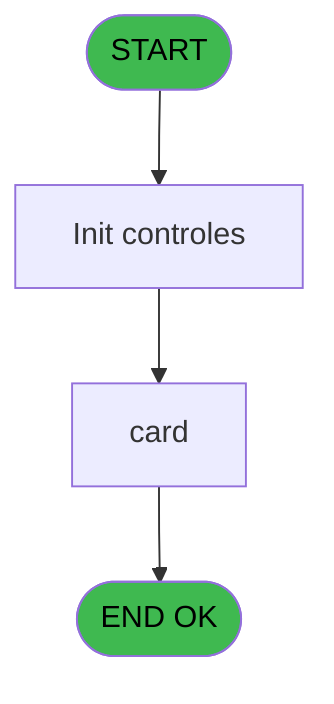
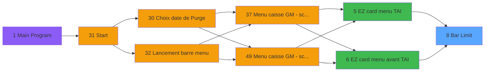
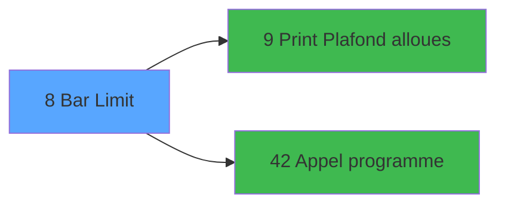

# CAP IDE 8 - Bar Limit

> **Analyse**: Phases 1-4 2026-02-03 10:12 -> 10:12 (14s) | Assemblage 10:12
> **Pipeline**: V7.2 Enrichi
> **Structure**: 4 onglets (Resume | Ecrans | Donnees | Connexions)

<!-- TAB:Resume -->

## 1. FICHE D'IDENTITE

| Attribut | Valeur |
|----------|--------|
| Projet | CAP |
| IDE Position | 8 |
| Nom Programme | Bar Limit |
| Fichier source | `Prg_8.xml` |
| Domaine metier | General |
| Taches | 5 (1 ecrans visibles) |
| Tables modifiees | 0 |
| Programmes appeles | 2 |

## 2. DESCRIPTION FONCTIONNELLE

**Bar Limit** assure la gestion complete de ce processus, accessible depuis [EZ card menu TAI (IDE 5)](CAP-IDE-5.md), [EZ card menu avant TAI (IDE 6)](CAP-IDE-6.md).

Le flux de traitement s'organise en **1 blocs fonctionnels** :

- **Traitement** (5 taches) : traitements metier divers

Detail : phases du traitement

#### Phase 1 : Traitement (5 taches)

- **8** - Reprise Carnet bar **[[ECRAN]](#ecran-t1)**
- **8.1** - Bar Limit **[[ECRAN]](#ecran-t2)**
- **8.1.1** - Plafond actuel
- **8.1.2** - derniere annulation
- **8.1.3** - plafond reste

Delegue a : [Appel programme (IDE 42)](CAP-IDE-42.md)

## 3. BLOCS FONCTIONNELS

### 3.1 Traitement (5 taches)

Traitements internes.

---

#### 8 - Reprise Carnet bar [[ECRAN]](#ecran-t1)

**Role** : Traitement : Reprise Carnet bar.
**Ecran** : 130 x 65 DLU (MDI) | [Voir mockup](#ecran-t1)

4 sous-taches directes

| Tache | Nom | Bloc |
|-------|-----|------|
| [8.1](#t2) | Bar Limit **[[ECRAN]](#ecran-t2)** | Traitement |
| [8.1.1](#t3) | Plafond actuel | Traitement |
| [8.1.2](#t4) | derniere annulation | Traitement |
| [8.1.3](#t5) | plafond reste | Traitement |

**Delegue a** : [Appel programme (IDE 42)](CAP-IDE-42.md)

---

#### 8.1 - Bar Limit [[ECRAN]](#ecran-t2)

**Role** : Traitement : Bar Limit.
**Ecran** : 808 x 237 DLU (MDI) | [Voir mockup](#ecran-t2)
**Delegue a** : [Appel programme (IDE 42)](CAP-IDE-42.md)

---

#### 8.1.1 - Plafond actuel

**Role** : Traitement : Plafond actuel.
**Delegue a** : [Print Plafond alloues (IDE 9)](CAP-IDE-9.md), [Appel programme (IDE 42)](CAP-IDE-42.md)

---

#### 8.1.2 - derniere annulation

**Role** : Traitement : derniere annulation.
**Variables liees** : M (v.date derniere annulation), N (v.time dermiere annulation)
**Delegue a** : [Appel programme (IDE 42)](CAP-IDE-42.md)

---

#### 8.1.3 - plafond reste

**Role** : Traitement : plafond reste.
**Delegue a** : [Print Plafond alloues (IDE 9)](CAP-IDE-9.md), [Appel programme (IDE 42)](CAP-IDE-42.md)

## 5. REGLES METIER

*(Aucune regle metier identifiee)*

## 6. CONTEXTE

- **Appele par**: [EZ card menu TAI (IDE 5)](CAP-IDE-5.md), [EZ card menu avant TAI (IDE 6)](CAP-IDE-6.md)
- **Appelle**: 2 programmes | **Tables**: 3 (W:0 R:3 L:1) | **Taches**: 5 | **Expressions**: 7

<!-- TAB:Ecrans -->

## 8. ECRANS

### 8.1 Forms visibles (1 / 5)

| # | Position | Tache | Nom | Type | Largeur | Hauteur | Bloc |
|---|----------|-------|-----|------|---------|---------|------|
| 1 | 8.1 | 8.1 | Bar Limit | MDI | 808 | 237 | Traitement |

### 8.2 Mockups Ecrans

---

#### 8.1 - Bar Limit
**Tache** : [8.1](#t2) | **Type** : MDI | **Dimensions** : 808 x 237 DLU
**Bloc** : Traitement | **Titre IDE** : Bar Limit

<!-- FORM-DATA:
{
    "width":  808,
    "vFactor":  8,
    "type":  "MDI",
    "hFactor":  8,
    "controls":  [
                     {
                         "x":  0,
                         "type":  "label",
                         "var":  "",
                         "y":  1,
                         "w":  806,
                         "fmt":  "",
                         "name":  "",
                         "h":  21,
                         "color":  "",
                         "text":  "",
                         "parent":  null
                     },
                     {
                         "x":  53,
                         "type":  "label",
                         "var":  "",
                         "y":  26,
                         "w":  101,
                         "fmt":  "",
                         "name":  "",
                         "h":  10,
                         "color":  "",
                         "text":  "Account # :",
                         "parent":  null
                     },
                     {
                         "x":  53,
                         "type":  "table",
                         "var":  "",
                         "name":  "",
                         "titleH":  12,
                         "color":  "110",
                         "w":  732,
                         "y":  66,
                         "fmt":  "",
                         "parent":  null,
                         "text":  "",
                         "rowH":  14,
                         "h":  58,
                         "cols":  [
                                      {
                                          "title":  "Montant",
                                          "layer":  1,
                                          "w":  304
                                      },
                                      {
                                          "title":  "Opération",
                                          "layer":  2,
                                          "w":  401
                                      }
                                  ],
                         "rows":  2
                     },
                     {
                         "x":  53,
                         "type":  "label",
                         "var":  "",
                         "y":  127,
                         "w":  192,
                         "fmt":  "",
                         "name":  "",
                         "h":  14,
                         "color":  "6",
                         "text":  "Last Bar Limit",
                         "parent":  null
                     },
                     {
                         "x":  428,
                         "type":  "label",
                         "var":  "",
                         "y":  127,
                         "w":  192,
                         "fmt":  "",
                         "name":  "",
                         "h":  14,
                         "color":  "6",
                         "text":  "Balance",
                         "parent":  null
                     },
                     {
                         "x":  52,
                         "type":  "label",
                         "var":  "",
                         "y":  150,
                         "w":  459,
                         "fmt":  "",
                         "name":  "",
                         "h":  56,
                         "color":  "",
                         "text":  "",
                         "parent":  null
                     },
                     {
                         "x":  56,
                         "type":  "label",
                         "var":  "",
                         "y":  152,
                         "w":  449,
                         "fmt":  "",
                         "name":  "",
                         "h":  53,
                         "color":  "",
                         "text":  "",
                         "parent":  20
                     },
                     {
                         "x":  59,
                         "type":  "label",
                         "var":  "",
                         "y":  154,
                         "w":  42,
                         "fmt":  "",
                         "name":  "",
                         "h":  50,
                         "color":  "",
                         "text":  "",
                         "parent":  20
                     },
                     {
                         "x":  112,
                         "type":  "label",
                         "var":  "",
                         "y":  158,
                         "w":  170,
                         "fmt":  "",
                         "name":  "",
                         "h":  9,
                         "color":  "142",
                         "text":  "Creation",
                         "parent":  20
                     },
                     {
                         "x":  112,
                         "type":  "label",
                         "var":  "",
                         "y":  174,
                         "w":  170,
                         "fmt":  "",
                         "name":  "",
                         "h":  9,
                         "color":  "142",
                         "text":  "Annulation",
                         "parent":  20
                     },
                     {
                         "x":  112,
                         "type":  "label",
                         "var":  "",
                         "y":  190,
                         "w":  170,
                         "fmt":  "",
                         "name":  "",
                         "h":  9,
                         "color":  "142",
                         "text":  "Edition",
                         "parent":  20
                     },
                     {
                         "x":  305,
                         "type":  "label",
                         "var":  "",
                         "y":  190,
                         "w":  120,
                         "fmt":  "",
                         "name":  "",
                         "h":  9,
                         "color":  "",
                         "text":  "Votre choix",
                         "parent":  20
                     },
                     {
                         "x":  0,
                         "type":  "label",
                         "var":  "",
                         "y":  211,
                         "w":  806,
                         "fmt":  "",
                         "name":  "",
                         "h":  24,
                         "color":  "",
                         "text":  "",
                         "parent":  null
                     },
                     {
                         "x":  242,
                         "type":  "edit",
                         "var":  "",
                         "y":  127,
                         "w":  169,
                         "fmt":  "N## ### ### ###.###Z",
                         "name":  "",
                         "h":  14,
                         "color":  "110",
                         "text":  "",
                         "parent":  null
                     },
                     {
                         "x":  617,
                         "type":  "edit",
                         "var":  "",
                         "y":  127,
                         "w":  169,
                         "fmt":  "N## ### ### ###.###Z",
                         "name":  "",
                         "h":  14,
                         "color":  "110",
                         "text":  "",
                         "parent":  null
                     },
                     {
                         "x":  266,
                         "type":  "edit",
                         "var":  "",
                         "y":  26,
                         "w":  42,
                         "fmt":  "",
                         "name":  "",
                         "h":  10,
                         "color":  "",
                         "text":  "",
                         "parent":  null
                     },
                     {
                         "x":  374,
                         "type":  "edit",
                         "var":  "",
                         "y":  80,
                         "w":  126,
                         "fmt":  "##/##/####Z",
                         "name":  "",
                         "h":  10,
                         "color":  "6",
                         "text":  "",
                         "parent":  9
                     },
                     {
                         "x":  517,
                         "type":  "edit",
                         "var":  "",
                         "y":  80,
                         "w":  80,
                         "fmt":  "HH:MMZ",
                         "name":  "",
                         "h":  10,
                         "color":  "6",
                         "text":  "",
                         "parent":  9
                     },
                     {
                         "x":  616,
                         "type":  "edit",
                         "var":  "",
                         "y":  80,
                         "w":  126,
                         "fmt":  "",
                         "name":  "",
                         "h":  10,
                         "color":  "6",
                         "text":  "",
                         "parent":  9
                     },
                     {
                         "x":  433,
                         "type":  "edit",
                         "var":  "",
                         "y":  190,
                         "w":  26,
                         "fmt":  "UA",
                         "name":  "v.choix action",
                         "h":  9,
                         "color":  "110",
                         "text":  "",
                         "parent":  20
                     },
                     {
                         "x":  5,
                         "type":  "image",
                         "var":  "",
                         "y":  3,
                         "w":  59,
                         "fmt":  "",
                         "name":  "",
                         "h":  18,
                         "color":  "",
                         "text":  "",
                         "parent":  null
                     },
                     {
                         "x":  77,
                         "type":  "edit",
                         "var":  "",
                         "y":  7,
                         "w":  267,
                         "fmt":  "30",
                         "name":  "",
                         "h":  8,
                         "color":  "",
                         "text":  "",
                         "parent":  null
                     },
                     {
                         "x":  514,
                         "type":  "edit",
                         "var":  "",
                         "y":  7,
                         "w":  259,
                         "fmt":  "WWW DD MMM YYYYT",
                         "name":  "",
                         "h":  8,
                         "color":  "",
                         "text":  "",
                         "parent":  null
                     },
                     {
                         "x":  156,
                         "type":  "edit",
                         "var":  "",
                         "y":  26,
                         "w":  98,
                         "fmt":  "",
                         "name":  "",
                         "h":  10,
                         "color":  "",
                         "text":  "",
                         "parent":  null
                     },
                     {
                         "x":  328,
                         "type":  "edit",
                         "var":  "",
                         "y":  26,
                         "w":  299,
                         "fmt":  "60",
                         "name":  "",
                         "h":  10,
                         "color":  "",
                         "text":  "",
                         "parent":  null
                     },
                     {
                         "x":  86,
                         "type":  "edit",
                         "var":  "",
                         "y":  80,
                         "w":  194,
                         "fmt":  "30",
                         "name":  "",
                         "h":  10,
                         "color":  "6",
                         "text":  "",
                         "parent":  9
                     },
                     {
                         "x":  594,
                         "type":  "image",
                         "var":  "",
                         "y":  152,
                         "w":  159,
                         "fmt":  "",
                         "name":  "",
                         "h":  53,
                         "color":  "",
                         "text":  "",
                         "parent":  null
                     },
                     {
                         "x":  67,
                         "type":  "button",
                         "var":  "",
                         "y":  158,
                         "w":  27,
                         "fmt":  "A",
                         "name":  "A",
                         "h":  9,
                         "color":  "",
                         "text":  "",
                         "parent":  null
                     },
                     {
                         "x":  67,
                         "type":  "button",
                         "var":  "",
                         "y":  174,
                         "w":  27,
                         "fmt":  "B",
                         "name":  "B",
                         "h":  9,
                         "color":  "",
                         "text":  "",
                         "parent":  null
                     },
                     {
                         "x":  67,
                         "type":  "button",
                         "var":  "",
                         "y":  190,
                         "w":  27,
                         "fmt":  "C",
                         "name":  "C",
                         "h":  9,
                         "color":  "",
                         "text":  "",
                         "parent":  null
                     },
                     {
                         "x":  8,
                         "type":  "button",
                         "var":  "",
                         "y":  214,
                         "w":  154,
                         "fmt":  "\u0026Quitter",
                         "name":  "",
                         "h":  18,
                         "color":  "",
                         "text":  "",
                         "parent":  29
                     }
                 ],
    "taskId":  "8.1",
    "height":  237
}
-->

<strong>Champs : 12 champs</strong>

| Pos (x,y) | Nom | Variable | Type |
|-----------|-----|----------|------|
| 242,127 | N## ### ### ###.###Z | - | edit |
| 617,127 | N## ### ### ###.###Z | - | edit |
| 266,26 | (sans nom) | - | edit |
| 374,80 | ##/##/####Z | - | edit |
| 517,80 | HH:MMZ | - | edit |
| 616,80 | (sans nom) | - | edit |
| 433,190 | v.choix action | - | edit |
| 77,7 | 30 | - | edit |
| 514,7 | WWW DD MMM YYYYT | - | edit |
| 156,26 | (sans nom) | - | edit |
| 328,26 | 60 | - | edit |
| 86,80 | 30 | - | edit |

<strong>Boutons : 4 boutons</strong>

| Bouton | Pos (x,y) | Action |
|--------|-----------|--------|
| A | 67,158 | Bouton fonctionnel |
| B | 67,174 | Bouton fonctionnel |
| C | 67,190 | Bouton fonctionnel |
| Quitter | 8,214 | Quitte le programme |

## 9. NAVIGATION

Ecran unique: **Bar Limit**

### 9.3 Structure hierarchique (5 taches)

| Position | Tache | Type | Dimensions | Bloc |
|----------|-------|------|------------|------|
| **8.1** | [**Reprise Carnet bar** (8)](#t1) [mockup](#ecran-t1) | MDI | 130x65 | Traitement |
| 8.1.1 | [Bar Limit (8.1)](#t2) [mockup](#ecran-t2) | MDI | 808x237 | |
| 8.1.2 | [Plafond actuel (8.1.1)](#t3) | MDI | - | |
| 8.1.3 | [derniere annulation (8.1.2)](#t4) | MDI | - | |
| 8.1.4 | [plafond reste (8.1.3)](#t5) | MDI | - | |

### 9.4 Algorigramme

> **Legende**: Vert = START/END OK | Rouge = END KO | Bleu = Decisions
> *Algorigramme auto-genere. Utiliser `/algorigramme` pour une synthese metier detaillee.*

<!-- TAB:Donnees -->

## 10. TABLES

### Tables utilisees (3)

| ID | Nom | Description | Type | R | W | L | Usages |
|----|-----|-------------|------|---|---|---|--------|
| 743 | pv_vendeurs |  | DB | R |   | L | 3 |
| 744 | pv_lieux_vente | Donnees de ventes | DB | R |   |   | 1 |
| 752 | system |  | DB | R |   |   | 1 |

### Colonnes par table (1 / 3 tables avec colonnes identifiees)

Table 743 - pv_vendeurs (R/L) - 3 usages

*Table utilisee uniquement en Link ou aucune colonne Real identifiee dans le DataView.*

Table 744 - pv_lieux_vente (R) - 1 usages

| Lettre | Variable | Acces | Type |
|--------|----------|-------|------|
| A | v.plafond actuel | R | Numeric |
| B | v.plafond reste | R | Numeric |
| C | v.choix action | R | Alpha |

Table 752 - system (R) - 1 usages

*Table utilisee uniquement en Link ou aucune colonne Real identifiee dans le DataView.*

## 11. VARIABLES

### 11.1 Parametres entrants (6)

Variables recues du programme appelant ([EZ card menu TAI (IDE 5)](CAP-IDE-5.md)).

| Lettre | Nom | Type | Usage dans |
|--------|-----|------|-----------|
| A | p.societe | Alpha | - |
| B | p.code-8chiffres | Numeric | - |
| C | p.filiation | Numeric | - |
| D | p.masque montant | Alpha | - |
| E | p.masque cumul | Alpha | - |
| F | p.card code | Alpha | - |

### 11.2 Variables de session (8)

Variables persistantes pendant toute la session.

| Lettre | Nom | Type | Usage dans |
|--------|-----|------|-----------|
| G | v.nom-complet | Alpha | - |
| H | v.prenom-complet | Alpha | - |
| I | v.EZ card ID | Alpha | - |
| J | v.delete confirmation | Logical | - |
| K | v.ok to create | Logical | - |
| L | v.action | Alpha | 2x session |
| M | v.date derniere annulation | Date | - |
| N | v.time dermiere annulation | Time | - |

## 12. EXPRESSIONS

**7 / 7 expressions decodees (100%)**

### 12.1 Repartition par type

| Type | Expressions | Regles |
|------|-------------|--------|
| CONSTANTE | 1 | 0 |
| CAST_LOGIQUE | 3 | 0 |
| CONDITION | 2 | 0 |
| REFERENCE_VG | 1 | 0 |

### 12.2 Expressions cles par type

#### CONSTANTE (1 expressions)

| Type | IDE | Expression | Regle |
|------|-----|------------|-------|
| CONSTANTE | 4 | `'F'` | - |

#### CAST_LOGIQUE (3 expressions)

| Type | IDE | Expression | Regle |
|------|-----|------------|-------|
| CAST_LOGIQUE | 3 | `'FALSE'LOG` | - |
| CAST_LOGIQUE | 2 | `INIPut ('AllowCreateInModify  = Y','FALSE'LOG)` | - |
| CAST_LOGIQUE | 1 | `INIPut ('AllowCreateInModify  = N','FALSE'LOG)` | - |

#### CONDITION (2 expressions)

| Type | IDE | Expression | Regle |
|------|-----|------------|-------|
| CONDITION | 6 | `v.action [L]='C'` | - |
| CONDITION | 5 | `v.action [L]='F'` | - |

#### REFERENCE_VG (1 expressions)

| Type | IDE | Expression | Regle |
|------|-----|------------|-------|
| REFERENCE_VG | 7 | `VG1` | - |

<!-- TAB:Connexions -->

## 13. GRAPHE D'APPELS

### 13.1 Chaine depuis Main (Callers)

Main -> ... -> [EZ card menu TAI (IDE 5)](CAP-IDE-5.md) -> **Bar Limit (IDE 8)**

Main -> ... -> [EZ card menu avant TAI (IDE 6)](CAP-IDE-6.md) -> **Bar Limit (IDE 8)**

### 13.2 Callers

| IDE | Nom Programme | Nb Appels |
|-----|---------------|-----------|
| [5](CAP-IDE-5.md) | EZ card menu TAI | 1 |
| [6](CAP-IDE-6.md) | EZ card menu avant TAI | 1 |

### 13.3 Callees (programmes appeles)

### 13.4 Detail Callees avec contexte

| IDE | Nom Programme | Appels | Contexte |
|-----|---------------|--------|----------|
| [9](CAP-IDE-9.md) | Print Plafond alloues | 1 | Impression ticket/document |
| [42](CAP-IDE-42.md) | Appel programme | 1 | Sous-programme |

## 14. RECOMMANDATIONS MIGRATION

### 14.1 Profil du programme

| Metrique | Valeur | Impact migration |
|----------|--------|-----------------|
| Lignes de logique | 93 | Programme compact |
| Expressions | 7 | Peu de logique |
| Tables WRITE | 0 | Impact faible |
| Sous-programmes | 2 | Peu de dependances |
| Ecrans visibles | 1 | Ecran unique ou traitement batch |
| Code desactive | 0% (0 / 93) | Code sain |
| Regles metier | 0 | Pas de regle identifiee |

### 14.2 Plan de migration par bloc

#### Traitement (5 taches: 2 ecrans, 3 traitements)

- **Strategie** : Orchestrateur avec 2 ecrans (Razor/React) et 3 traitements backend (services).
- Les ecrans deviennent des composants UI, les traitements invisibles deviennent des services injectables.
- 2 sous-programme(s) a migrer ou a reutiliser depuis les services existants.
- Decomposer les taches en services unitaires testables.

### 14.3 Dependances critiques

| Dependance | Type | Appels | Impact |
|------------|------|--------|--------|
| [Appel programme (IDE 42)](CAP-IDE-42.md) | Sous-programme | 1x | Normale - Sous-programme |
| [Print Plafond alloues (IDE 9)](CAP-IDE-9.md) | Sous-programme | 1x | Normale - Impression ticket/document |

---
*Spec DETAILED generee par Pipeline V7.2 - 2026-02-03 10:12*
