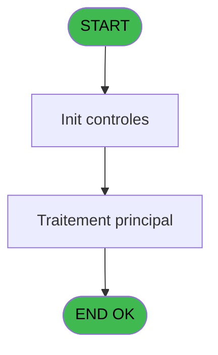
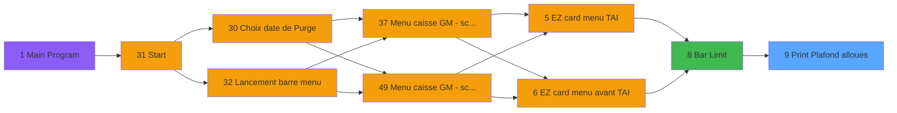

# CAP IDE 9 - Print Plafond alloues

> **Analyse**: Phases 1-4 2026-02-03 10:12 -> 10:12 (14s) | Assemblage 10:12
> **Pipeline**: V7.2 Enrichi
> **Structure**: 4 onglets (Resume | Ecrans | Donnees | Connexions)

<!-- TAB:Resume -->

## 1. FICHE D'IDENTITE

| Attribut | Valeur |
|----------|--------|
| Projet | CAP |
| IDE Position | 9 |
| Nom Programme | Print Plafond alloues |
| Fichier source | `Prg_9.xml` |
| Domaine metier | Impression |
| Taches | 5 (1 ecrans visibles) |
| Tables modifiees | 0 |
| Programmes appeles | 1 |

## 2. DESCRIPTION FONCTIONNELLE

**Print Plafond alloues** assure la gestion complete de ce processus, accessible depuis [Bar Limit (IDE 8)](CAP-IDE-8.md).

Le flux de traitement s'organise en **3 blocs fonctionnels** :

- **Impression** (3 taches) : generation de tickets et documents
- **Initialisation** (1 tache) : reinitialisation d'etats et de variables de travail
- **Traitement** (1 tache) : traitements metier divers

Detail : phases du traitement

#### Phase 1 : Traitement (1 tache)

- **9** - Veuillez patienter... **[[ECRAN]](#ecran-t1)**

Delegue a : [Recupere devise local (IDE 10)](CAP-IDE-10.md)

#### Phase 2 : Impression (3 taches)

- **9.1** - Choix imprimante
- **9.2** - edition extrait compte **[[ECRAN]](#ecran-t3)**
- **9.3** - edition extrait compte **[[ECRAN]](#ecran-t4)**

#### Phase 3 : Initialisation (1 tache)

- **9.4** - Init village **[[ECRAN]](#ecran-t5)**

## 3. BLOCS FONCTIONNELS

### 3.1 Traitement (1 tache)

Traitements internes.

---

#### 9 - Veuillez patienter... [[ECRAN]](#ecran-t1)

**Role** : Traitement : Veuillez patienter....
**Ecran** : 426 x 58 DLU (MDI) | [Voir mockup](#ecran-t1)
**Delegue a** : [Recupere devise local (IDE 10)](CAP-IDE-10.md)

### 3.2 Impression (3 taches)

Generation des documents et tickets.

---

#### 9.1 - Choix imprimante

**Role** : Selection par l'operateur : Choix imprimante.
**Variables liees** : N (W0 imprimante)

---

#### 9.2 - edition extrait compte [[ECRAN]](#ecran-t3)

**Role** : Generation du document : edition extrait compte.
**Ecran** : 1058 x 791 DLU (MDI) | [Voir mockup](#ecran-t3)

---

#### 9.3 - edition extrait compte [[ECRAN]](#ecran-t4)

**Role** : Generation du document : edition extrait compte.
**Ecran** : 1058 x 791 DLU (MDI) | [Voir mockup](#ecran-t4)

### 3.3 Initialisation (1 tache)

Reinitialisation d'etats et variables de travail.

---

#### 9.4 - Init village [[ECRAN]](#ecran-t5)

**Role** : Reinitialisation : Init village.
**Ecran** : 274 x 204 DLU (MDI) | [Voir mockup](#ecran-t5)
**Variables liees** : F (W0 nom village)

## 5. REGLES METIER

*(Aucune regle metier identifiee)*

## 6. CONTEXTE

- **Appele par**: [Bar Limit (IDE 8)](CAP-IDE-8.md)
- **Appelle**: 1 programmes | **Tables**: 5 (W:0 R:3 L:2) | **Taches**: 5 | **Expressions**: 9

<!-- TAB:Ecrans -->

## 8. ECRANS

### 8.1 Forms visibles (1 / 5)

| # | Position | Tache | Nom | Type | Largeur | Hauteur | Bloc |
|---|----------|-------|-----|------|---------|---------|------|
| 1 | 9 | 9 | Veuillez patienter... | MDI | 426 | 58 | Traitement |

### 8.2 Mockups Ecrans

---

#### 9 - Veuillez patienter...
**Tache** : [9](#t1) | **Type** : MDI | **Dimensions** : 426 x 58 DLU
**Bloc** : Traitement | **Titre IDE** : Veuillez patienter...

<!-- FORM-DATA:
{
    "width":  426,
    "vFactor":  8,
    "type":  "MDI",
    "hFactor":  8,
    "controls":  [
                     {
                         "x":  0,
                         "type":  "label",
                         "var":  "",
                         "y":  0,
                         "w":  423,
                         "fmt":  "",
                         "name":  "",
                         "h":  29,
                         "color":  "",
                         "text":  "",
                         "parent":  null
                     },
                     {
                         "x":  120,
                         "type":  "label",
                         "var":  "",
                         "y":  10,
                         "w":  221,
                         "fmt":  "",
                         "name":  "",
                         "h":  8,
                         "color":  "7",
                         "text":  "Impression en cours ...",
                         "parent":  null
                     },
                     {
                         "x":  0,
                         "type":  "label",
                         "var":  "",
                         "y":  29,
                         "w":  423,
                         "fmt":  "",
                         "name":  "",
                         "h":  27,
                         "color":  "",
                         "text":  "",
                         "parent":  null
                     },
                     {
                         "x":  27,
                         "type":  "label",
                         "var":  "",
                         "y":  38,
                         "w":  375,
                         "fmt":  "",
                         "name":  "",
                         "h":  8,
                         "color":  "",
                         "text":  "Edition du reçu",
                         "parent":  null
                     },
                     {
                         "x":  4,
                         "type":  "image",
                         "var":  "",
                         "y":  2,
                         "w":  72,
                         "fmt":  "",
                         "name":  "",
                         "h":  25,
                         "color":  "",
                         "text":  "",
                         "parent":  null
                     }
                 ],
    "taskId":  "9",
    "height":  58
}
-->

## 9. NAVIGATION

Ecran unique: **Veuillez patienter...**

### 9.3 Structure hierarchique (5 taches)

| Position | Tache | Type | Dimensions | Bloc |
|----------|-------|------|------------|------|
| **9.1** | [**Veuillez patienter...** (9)](#t1) [mockup](#ecran-t1) | MDI | 426x58 | Traitement |
| **9.2** | [**Choix imprimante** (9.1)](#t2) | MDI | - | Impression |
| 9.2.1 | [edition extrait compte (9.2)](#t3) [mockup](#ecran-t3) | MDI | 1058x791 | |
| 9.2.2 | [edition extrait compte (9.3)](#t4) [mockup](#ecran-t4) | MDI | 1058x791 | |
| **9.3** | [**Init village** (9.4)](#t5) [mockup](#ecran-t5) | MDI | 274x204 | Initialisation |

### 9.4 Algorigramme

> **Legende**: Vert = START/END OK | Rouge = END KO | Bleu = Decisions
> *Algorigramme auto-genere. Utiliser `/algorigramme` pour une synthese metier detaillee.*

<!-- TAB:Donnees -->

## 10. TABLES

### Tables utilisees (5)

| ID | Nom | Description | Type | R | W | L | Usages |
|----|-----|-------------|------|---|---|---|--------|
| 24 | imprimante_______prn |  | DB | R |   |   | 1 |
| 69 | initialisation___ini |  | DB | R |   |   | 1 |
| 743 | pv_vendeurs |  | DB |   |   | L | 2 |
| 744 | pv_lieux_vente | Donnees de ventes | DB | R |   |   | 2 |
| 752 | system |  | DB |   |   | L | 2 |

### Colonnes par table (1 / 3 tables avec colonnes identifiees)

Table 24 - imprimante_______prn (R) - 1 usages

| Lettre | Variable | Acces | Type |
|--------|----------|-------|------|
| N | W0 imprimante | R | Numeric |

Table 69 - initialisation___ini (R) - 1 usages

*Table utilisee uniquement en Link ou aucune colonne Real identifiee dans le DataView.*

Table 744 - pv_lieux_vente (R) - 2 usages

*Table utilisee uniquement en Link ou aucune colonne Real identifiee dans le DataView.*

## 11. VARIABLES

### 11.1 Parametres entrants (5)

Variables recues du programme appelant ([Bar Limit (IDE 8)](CAP-IDE-8.md)).

| Lettre | Nom | Type | Usage dans |
|--------|-----|------|-----------|
| A | P0 societe | Alpha | - |
| B | P0 code adherent | Numeric | - |
| C | P0 filiation | Numeric | - |
| D | P0 masque montant | Alpha | - |
| E | P0 masque cumul | Alpha | - |

### 11.2 Variables de travail (10)

Variables internes au programme.

| Lettre | Nom | Type | Usage dans |
|--------|-----|------|-----------|
| F | W0 nom village | Alpha | - |
| G | W0 nom | Alpha | - |
| H | W0 prenom | Alpha | - |
| I | W0 titre | Alpha | - |
| J | W0 n° adherent | Numeric | - |
| K | W0 lettre contrôle | Alpha | - |
| L | W0 filiation | Numeric | - |
| M | W0 langue parlee | Alpha | - |
| N | W0 imprimante | Numeric | [9.1](#t2) |
| O | W0 devise locale | Alpha | - |

## 12. EXPRESSIONS

**9 / 9 expressions decodees (100%)**

### 12.1 Repartition par type

| Type | Expressions | Regles |
|------|-------------|--------|
| CONSTANTE | 2 | 0 |
| OTHER | 2 | 0 |
| CONDITION | 2 | 0 |
| CAST_LOGIQUE | 1 | 0 |
| NEGATION | 1 | 0 |
| REFERENCE_VG | 1 | 0 |

### 12.2 Expressions cles par type

#### CONSTANTE (2 expressions)

| Type | IDE | Expression | Regle |
|------|-----|------------|-------|
| CONSTANTE | 6 | `602` | - |
| CONSTANTE | 5 | `'CAP'` | - |

#### OTHER (2 expressions)

| Type | IDE | Expression | Regle |
|------|-----|------------|-------|
| OTHER | 2 | `SetCrsr (2)` | - |
| OTHER | 1 | `SetCrsr (1)` | - |

#### CONDITION (2 expressions)

| Type | IDE | Expression | Regle |
|------|-----|------------|-------|
| CONDITION | 4 | `W0 imprimante [N]>4 AND INIGet ('[MAGIC_LOGICAL_NAMES]club_pays')<>'turquie'` | - |
| CONDITION | 3 | `W0 imprimante [N]<5` | - |

#### CAST_LOGIQUE (1 expressions)

| Type | IDE | Expression | Regle |
|------|-----|------------|-------|
| CAST_LOGIQUE | 7 | `'TRUE'LOG` | - |

#### NEGATION (1 expressions)

| Type | IDE | Expression | Regle |
|------|-----|------------|-------|
| NEGATION | 8 | `NOT VG8` | - |

#### REFERENCE_VG (1 expressions)

| Type | IDE | Expression | Regle |
|------|-----|------------|-------|
| REFERENCE_VG | 9 | `VG8` | - |

<!-- TAB:Connexions -->

## 13. GRAPHE D'APPELS

### 13.1 Chaine depuis Main (Callers)

Main -> ... -> [Bar Limit (IDE 8)](CAP-IDE-8.md) -> **Print Plafond alloues (IDE 9)**

### 13.2 Callers

| IDE | Nom Programme | Nb Appels |
|-----|---------------|-----------|
| [8](CAP-IDE-8.md) | Bar Limit | 1 |

### 13.3 Callees (programmes appeles)

### 13.4 Detail Callees avec contexte

| IDE | Nom Programme | Appels | Contexte |
|-----|---------------|--------|----------|
| [10](CAP-IDE-10.md) | Recupere devise local | 1 | Recuperation donnees |

## 14. RECOMMANDATIONS MIGRATION

### 14.1 Profil du programme

| Metrique | Valeur | Impact migration |
|----------|--------|-----------------|
| Lignes de logique | 108 | Programme compact |
| Expressions | 9 | Peu de logique |
| Tables WRITE | 0 | Impact faible |
| Sous-programmes | 1 | Peu de dependances |
| Ecrans visibles | 1 | Ecran unique ou traitement batch |
| Code desactive | 0% (0 / 108) | Code sain |
| Regles metier | 0 | Pas de regle identifiee |

### 14.2 Plan de migration par bloc

#### Traitement (1 tache: 1 ecran, 0 traitement)

- **Strategie** : 1 composant(s) UI (Razor/React) avec formulaires et validation.
- 1 sous-programme(s) a migrer ou a reutiliser depuis les services existants.
- Decomposer les taches en services unitaires testables.

#### Impression (3 taches: 2 ecrans, 1 traitement)

- **Strategie** : Templates HTML -> PDF via wkhtmltopdf ou Puppeteer.
- `PrintService` injectable avec choix imprimante

#### Initialisation (1 tache: 1 ecran, 0 traitement)

- **Strategie** : Constructeur/methode `InitAsync()` dans l'orchestrateur.

### 14.3 Dependances critiques

| Dependance | Type | Appels | Impact |
|------------|------|--------|--------|
| [Recupere devise local (IDE 10)](CAP-IDE-10.md) | Sous-programme | 1x | Normale - Recuperation donnees |

---
*Spec DETAILED generee par Pipeline V7.2 - 2026-02-03 10:12*
