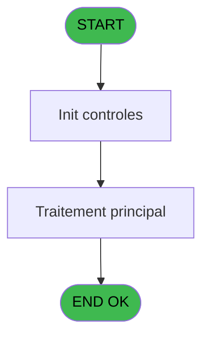

# EXB IDE 10 - Ventes par excursion et date

> **Analyse**: Phases 1-4 2026-02-03 10:32 -> 10:33 (23s) | Assemblage 10:33
> **Pipeline**: V7.2 Enrichi
> **Structure**: 4 onglets (Resume | Ecrans | Donnees | Connexions)

<!-- TAB:Resume -->

## 1. FICHE D'IDENTITE

| Attribut | Valeur |
|----------|--------|
| Projet | EXB |
| IDE Position | 10 |
| Nom Programme | Ventes par excursion et date |
| Fichier source | `Prg_10.xml` |
| Domaine metier | Ventes |
| Taches | 4 (0 ecrans visibles) |
| Tables modifiees | 0 |
| Programmes appeles | 0 |

## 2. DESCRIPTION FONCTIONNELLE

**Ventes par excursion et date** assure la gestion complete de ce processus, accessible depuis [Ventes du jour (IDE 9)](EXB-IDE-9.md).

Le flux de traitement s'organise en **3 blocs fonctionnels** :

- **Traitement** (2 taches) : traitements metier divers
- **Impression** (1 tache) : generation de tickets et documents
- **Saisie** (1 tache) : ecrans de saisie utilisateur (formulaires, champs, donnees)

Detail : phases du traitement

#### Phase 1 : Saisie (1 tache)

- **10** - Ventes par excursion et date

#### Phase 2 : Traitement (2 taches)

- **10.1** - (sans nom)
- **10.2.1** - Recup Nom

#### Phase 3 : Impression (1 tache)

- **10.2** - Edition

## 3. BLOCS FONCTIONNELS

### 3.1 Saisie (1 tache)

Ce bloc traite la saisie des donnees de la transaction.

---

#### 10 - Ventes par excursion et date

**Role** : Saisie des donnees : Ventes par excursion et date.
**Variables liees** : A (P_Date Comptable), G (Montant Date Plein  Tarif), H (Montant Date Tarif Reduit), M (Nom Excursion)

### 3.2 Traitement (2 taches)

Traitements internes.

---

#### 10.1 - (sans nom)

**Role** : Traitement interne.

---

#### 10.2.1 - Recup Nom

**Role** : Consultation/chargement : Recup Nom.

### 3.3 Impression (1 tache)

Generation des documents et tickets.

---

#### 10.2 - Edition

**Role** : Generation du document : Edition.

## 5. REGLES METIER

*(Aucune regle metier identifiee)*

## 6. CONTEXTE

- **Appele par**: [Ventes du jour (IDE 9)](EXB-IDE-9.md)
- **Appelle**: 0 programmes | **Tables**: 3 (W:0 R:3 L:2) | **Taches**: 4 | **Expressions**: 1

<!-- TAB:Ecrans -->

## 8. ECRANS

*(Programme sans ecran visible)*

## 9. NAVIGATION

### 9.3 Structure hierarchique (4 taches)

| Position | Tache | Type | Dimensions | Bloc |
|----------|-------|------|------------|------|
| **10.1** | [**Ventes par excursion et date** (10)](#t1) | MDI | - | Saisie |
| **10.2** | [**(sans nom)** (10.1)](#t2) | MDI | - | Traitement |
| 10.2.1 | [Recup Nom (10.2.1)](#t4) | MDI | - | |
| **10.3** | [**Edition** (10.2)](#t3) | MDI | - | Impression |

### 9.4 Algorigramme

> **Legende**: Vert = START/END OK | Rouge = END KO | Bleu = Decisions
> *Algorigramme auto-genere. Utiliser `/algorigramme` pour une synthese metier detaillee.*

<!-- TAB:Donnees -->

## 10. TABLES

### Tables utilisees (3)

| ID | Nom | Description | Type | R | W | L | Usages |
|----|-----|-------------|------|---|---|---|--------|
| 300 | excursions_______exc |  | DB | R |   | L | 2 |
| 309 | vente____________vep | Donnees de ventes | DB | R |   |   | 1 |
| 648 | tempo_hebergement | Hebergement (chambres) | DB | R |   | L | 2 |

### Colonnes par table (1 / 3 tables avec colonnes identifiees)

Table 300 - excursions_______exc (R/L) - 2 usages

*Table utilisee uniquement en Link ou aucune colonne Real identifiee dans le DataView.*

Table 309 - vente____________vep (R) - 1 usages

*Table utilisee uniquement en Link ou aucune colonne Real identifiee dans le DataView.*

Table 648 - tempo_hebergement (R/L) - 2 usages

| Lettre | Variable | Acces | Type |
|--------|----------|-------|------|
| A | Quantite Date Plein  Tarif | R | Numeric |
| B | Quantite Date Tarif Reduit | R | Numeric |
| C | Quantite Exc Plein  Tarif | R | Numeric |
| D | Quantite Exc Tarif Reduit | R | Numeric |
| E | Quantite Total Plein  Tarif | R | Numeric |
| F | Quantite Total Tarif Reduit | R | Numeric |
| G | Montant Date Plein  Tarif | R | Numeric |
| H | Montant Date Tarif Reduit | R | Numeric |
| I | Montant Exc Plein  Tarif | R | Numeric |
| J | Montant Exc Tarif Reduit | R | Numeric |
| K | Montant Total Plein  Tarif | R | Numeric |
| L | Montant Total Tarif Reduit | R | Numeric |
| M | Nom Excursion | R | Alpha |

## 11. VARIABLES

### 11.1 Autres (13)

Variables diverses.

| Lettre | Nom | Type | Usage dans |
|--------|-----|------|-----------|
| A | P_Date Comptable | Date | - |
| B | P_Nom Village | Alpha | - |
| C | P_Masque | Alpha | - |
| D | Quantite Exc Tarif Reduit | Numeric | - |
| E | Quantite Total Plein  Tarif | Numeric | - |
| F | Quantite Total Tarif Reduit | Numeric | - |
| G | Montant Date Plein  Tarif | Numeric | - |
| H | Montant Date Tarif Reduit | Numeric | - |
| I | Montant Exc Plein  Tarif | Numeric | - |
| J | Montant Exc Tarif Reduit | Numeric | - |
| K | Montant Total Plein  Tarif | Numeric | - |
| L | Montant Total Tarif Reduit | Numeric | - |
| M | Nom Excursion | Alpha | - |

## 12. EXPRESSIONS

**1 / 1 expressions decodees (100%)**

### 12.1 Repartition par type

| Type | Expressions | Regles |
|------|-------------|--------|
| CALCULATION | 1 | 0 |

### 12.2 Expressions cles par type

#### CALCULATION (1 expressions)

| Type | IDE | Expression | Regle |
|------|-----|------------|-------|
| CALCULATION | 1 | `CallProg('{123,-1}'PROG,DbName('{648,2}'DSOURCE))` | - |

<!-- TAB:Connexions -->

## 13. GRAPHE D'APPELS

### 13.1 Chaine depuis Main (Callers)

Main -> ... -> [Ventes du jour (IDE 9)](EXB-IDE-9.md) -> **Ventes par excursion et date (IDE 10)**

### 13.2 Callers

| IDE | Nom Programme | Nb Appels |
|-----|---------------|-----------|
| [9](EXB-IDE-9.md) | Ventes du jour | 1 |

### 13.3 Callees (programmes appeles)

### 13.4 Detail Callees avec contexte

| IDE | Nom Programme | Appels | Contexte |
|-----|---------------|--------|----------|
| - | (aucun) | - | - |

## 14. RECOMMANDATIONS MIGRATION

### 14.1 Profil du programme

| Metrique | Valeur | Impact migration |
|----------|--------|-----------------|
| Lignes de logique | 109 | Programme compact |
| Expressions | 1 | Peu de logique |
| Tables WRITE | 0 | Impact faible |
| Sous-programmes | 0 | Peu de dependances |
| Ecrans visibles | 0 | Ecran unique ou traitement batch |
| Code desactive | 0% (0 / 109) | Code sain |
| Regles metier | 0 | Pas de regle identifiee |

### 14.2 Plan de migration par bloc

#### Saisie (1 tache: 0 ecran, 1 traitement)

- **Strategie** : Formulaire React/Blazor avec validation Zod/FluentValidation.
- Validation temps reel cote client + serveur

#### Traitement (2 taches: 0 ecran, 2 traitements)

- **Strategie** : 2 service(s) backend injectable(s) (Domain Services).
- Decomposer les taches en services unitaires testables.

#### Impression (1 tache: 0 ecran, 1 traitement)

- **Strategie** : Templates HTML -> PDF via wkhtmltopdf ou Puppeteer.
- `PrintService` injectable avec choix imprimante

### 14.3 Dependances critiques

| Dependance | Type | Appels | Impact |
|------------|------|--------|--------|

---
*Spec DETAILED generee par Pipeline V7.2 - 2026-02-03 10:33*
