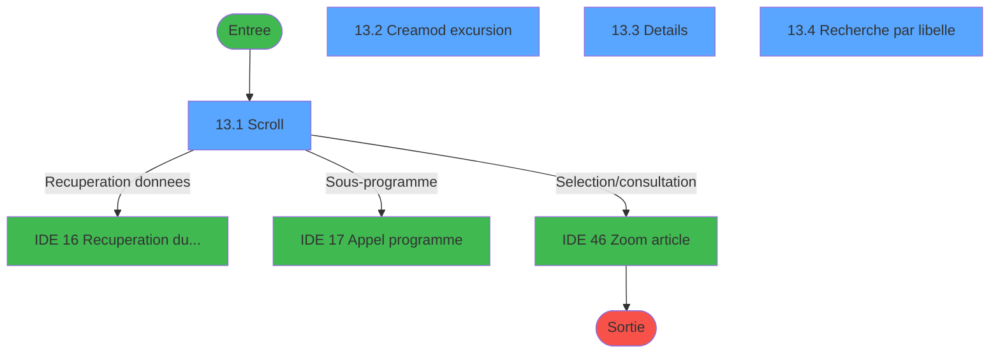
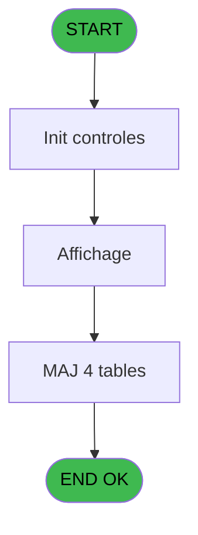
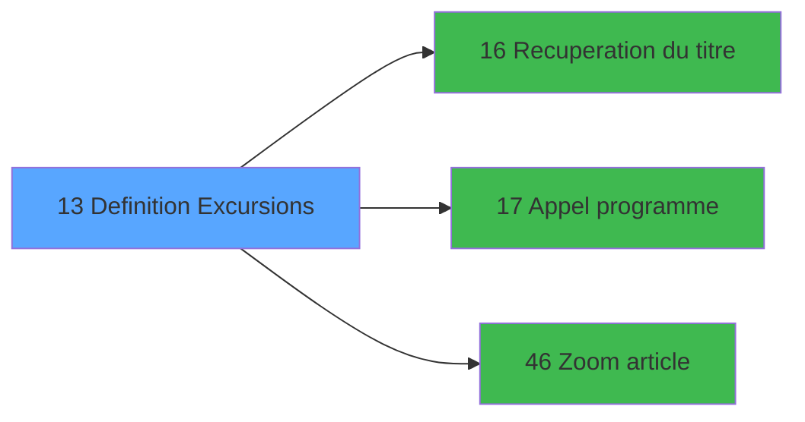

# EXB IDE 13 - Definition Excursions

> **Analyse**: Phases 1-4 2026-02-03 10:34 -> 10:34 (22s) | Assemblage 10:34
> **Pipeline**: V7.2 Enrichi
> **Structure**: 4 onglets (Resume | Ecrans | Donnees | Connexions)

<!-- TAB:Resume -->

## 1. FICHE D'IDENTITE

| Attribut | Valeur |
|----------|--------|
| Projet | EXB |
| IDE Position | 13 |
| Nom Programme | Definition Excursions |
| Fichier source | `Prg_13.xml` |
| Domaine metier | General |
| Taches | 12 (4 ecrans visibles) |
| Tables modifiees | 4 |
| Programmes appeles | 3 |

## 2. DESCRIPTION FONCTIONNELLE

**Definition Excursions** assure la gestion complete de ce processus, accessible depuis [Menu general (IDE 31)](EXB-IDE-31.md).

Le flux de traitement s'organise en **4 blocs fonctionnels** :

- **Traitement** (7 taches) : traitements metier divers
- **Consultation** (3 taches) : ecrans de recherche, selection et consultation
- **Calcul** (1 tache) : calculs de montants, stocks ou compteurs
- **Creation** (1 tache) : insertion d'enregistrements en base (mouvements, prestations)

**Donnees modifiees** : 4 tables en ecriture (excurs_annexes___ean, compteur_excurs__cte, divers_excursion_die, excursions_______exc).

**Logique metier** : 1 regles identifiees couvrant valeurs par defaut.

Detail : phases du traitement

#### Phase 1 : Traitement (7 taches)

- **13** - Excursions **[[ECRAN]](#ecran-t1)**
- **13.1** - Scroll **[[ECRAN]](#ecran-t2)**
- **13.2** - Creamod excursion **[[ECRAN]](#ecran-t3)**
- **13.2.4** - Suppression
- **13.2.4.1** - Suppression annexes
- **13.2.4.2** - Suppression annexes
- **13.3** - Details **[[ECRAN]](#ecran-t12)**

Delegue a : [Recuperation du titre (IDE 16)](EXB-IDE-16.md), [Appel programme (IDE 17)](EXB-IDE-17.md)

#### Phase 2 : Calcul (1 tache)

- **13.2.1** - Compteur

#### Phase 3 : Creation (1 tache)

- **13.2.2** - Creation

#### Phase 4 : Consultation (3 taches)

- **13.2.3** - Affichage
- **13.3.1** - Affichage
- **13.4** - Recherche par libelle **[[ECRAN]](#ecran-t14)**

Delegue a : [Recuperation du titre (IDE 16)](EXB-IDE-16.md), [Zoom article (IDE 46)](EXB-IDE-46.md)

#### Tables impactees

| Table | Operations | Role metier |
|-------|-----------|-------------|
| excursions_______exc | **W**/L (5 usages) |  |
| divers_excursion_die | **W** (1 usages) |  |
| compteur_excurs__cte | **W** (1 usages) | Comptes GM (generaux) |
| excurs_annexes___ean | **W** (1 usages) |  |

## 3. BLOCS FONCTIONNELS

### 3.1 Traitement (7 taches)

Traitements internes.

---

#### 13 - Excursions [[ECRAN]](#ecran-t1)

**Role** : Tache d'orchestration : point d'entree du programme (7 sous-taches). Coordonne l'enchainement des traitements.
**Ecran** : 182 x 8 DLU (MDI) | [Voir mockup](#ecran-t1)

6 sous-taches directes

| Tache | Nom | Bloc |
|-------|-----|------|
| [13.1](#t2) | Scroll **[[ECRAN]](#ecran-t2)** | Traitement |
| [13.2](#t3) | Creamod excursion **[[ECRAN]](#ecran-t3)** | Traitement |
| [13.2.4](#t9) | Suppression | Traitement |
| [13.2.4.1](#t10) | Suppression annexes | Traitement |
| [13.2.4.2](#t11) | Suppression annexes | Traitement |
| [13.3](#t12) | Details **[[ECRAN]](#ecran-t12)** | Traitement |

**Delegue a** : [Recuperation du titre (IDE 16)](EXB-IDE-16.md), [Appel programme (IDE 17)](EXB-IDE-17.md)

---

#### 13.1 - Scroll [[ECRAN]](#ecran-t2)

**Role** : Traitement : Scroll.
**Ecran** : 1067 x 268 DLU (MDI) | [Voir mockup](#ecran-t2)
**Delegue a** : [Recuperation du titre (IDE 16)](EXB-IDE-16.md), [Appel programme (IDE 17)](EXB-IDE-17.md)

---

#### 13.2 - Creamod excursion [[ECRAN]](#ecran-t3)

**Role** : Traitement : Creamod excursion.
**Ecran** : 789 x 295 DLU (MDI) | [Voir mockup](#ecran-t3)
**Variables liees** : BA (v. titre creamod)
**Delegue a** : [Recuperation du titre (IDE 16)](EXB-IDE-16.md), [Appel programme (IDE 17)](EXB-IDE-17.md)

---

#### 13.2.4 - Suppression

**Role** : Traitement : Suppression.
**Delegue a** : [Recuperation du titre (IDE 16)](EXB-IDE-16.md), [Appel programme (IDE 17)](EXB-IDE-17.md)

---

#### 13.2.4.1 - Suppression annexes

**Role** : Traitement : Suppression annexes.
**Delegue a** : [Recuperation du titre (IDE 16)](EXB-IDE-16.md), [Appel programme (IDE 17)](EXB-IDE-17.md)

---

#### 13.2.4.2 - Suppression annexes

**Role** : Traitement : Suppression annexes.
**Delegue a** : [Recuperation du titre (IDE 16)](EXB-IDE-16.md), [Appel programme (IDE 17)](EXB-IDE-17.md)

---

#### 13.3 - Details [[ECRAN]](#ecran-t12)

**Role** : Traitement : Details.
**Ecran** : 790 x 297 DLU (MDI) | [Voir mockup](#ecran-t12)
**Delegue a** : [Recuperation du titre (IDE 16)](EXB-IDE-16.md), [Appel programme (IDE 17)](EXB-IDE-17.md)

### 3.2 Calcul (1 tache)

Calculs metier : montants, stocks, compteurs.

---

#### 13.2.1 - Compteur

**Role** : Calcul : Compteur.

### 3.3 Creation (1 tache)

Insertion de nouveaux enregistrements en base.

---

#### 13.2.2 - Creation

**Role** : Creation d'enregistrement : Creation.

### 3.4 Consultation (3 taches)

Ecrans de recherche et consultation.

---

#### 13.2.3 - Affichage

**Role** : Reinitialisation : Affichage.
**Delegue a** : [Zoom article (IDE 46)](EXB-IDE-46.md)

---

#### 13.3.1 - Affichage

**Role** : Reinitialisation : Affichage.
**Delegue a** : [Zoom article (IDE 46)](EXB-IDE-46.md)

---

#### 13.4 - Recherche par libelle [[ECRAN]](#ecran-t14)

**Role** : Traitement : Recherche par libelle.
**Ecran** : 571 x 132 DLU (MDI) | [Voir mockup](#ecran-t14)
**Variables liees** : F (W0 libelle)
**Delegue a** : [Zoom article (IDE 46)](EXB-IDE-46.md)

## 5. REGLES METIER

1 regles identifiees:

### Autres (1 regles)

#### [RM-001] Valeur par defaut si P0 masque montant [C] est vide

| Element | Detail |
|---------|--------|
| **Condition** | `P0 masque montant [C]=''` |
| **Si vrai** | '15.2' |
| **Si faux** | P0 masque montant [C]) |
| **Variables** | C (P0 masque montant) |
| **Expression source** | Expression 5 : `IF (P0 masque montant [C]='','15.2',P0 masque montant [C])` |
| **Exemple** | Si P0 masque montant [C]='' → '15.2'. Sinon → P0 masque montant [C]) |

## 6. CONTEXTE

- **Appele par**: [Menu general (IDE 31)](EXB-IDE-31.md)
- **Appelle**: 3 programmes | **Tables**: 7 (W:4 R:1 L:3) | **Taches**: 12 | **Expressions**: 6

<!-- TAB:Ecrans -->

## 8. ECRANS

### 8.1 Forms visibles (4 / 12)

| # | Position | Tache | Nom | Type | Largeur | Hauteur | Bloc |
|---|----------|-------|-----|------|---------|---------|------|
| 1 | 13.1 | 13.1 | Scroll | MDI | 1067 | 268 | Traitement |
| 2 | 13.2 | 13.2 | Creamod excursion | MDI | 789 | 295 | Traitement |
| 3 | 13.3 | 13.3 | Details | MDI | 790 | 297 | Traitement |
| 4 | 13.4 | 13.4 | Recherche par libelle | MDI | 571 | 132 | Consultation |

### 8.2 Mockups Ecrans

---

#### 13.1 - Scroll
**Tache** : [13.1](#t2) | **Type** : MDI | **Dimensions** : 1067 x 268 DLU
**Bloc** : Traitement | **Titre IDE** : Scroll

<!-- FORM-DATA:
{
    "width":  1067,
    "vFactor":  8,
    "type":  "MDI",
    "hFactor":  8,
    "controls":  [
                     {
                         "x":  2,
                         "type":  "label",
                         "var":  "",
                         "y":  1,
                         "w":  1057,
                         "fmt":  "",
                         "name":  "",
                         "h":  17,
                         "color":  "",
                         "text":  "",
                         "parent":  null
                     },
                     {
                         "x":  44,
                         "type":  "table",
                         "var":  "",
                         "name":  "",
                         "titleH":  12,
                         "color":  "110",
                         "w":  986,
                         "y":  22,
                         "fmt":  "",
                         "parent":  null,
                         "text":  "",
                         "rowH":  14,
                         "h":  111,
                         "cols":  [
                                      {
                                          "title":  "Excursion",
                                          "layer":  1,
                                          "w":  263
                                      },
                                      {
                                          "title":  "Article",
                                          "layer":  2,
                                          "w":  128
                                      },
                                      {
                                          "title":  "Prix de vente",
                                          "layer":  3,
                                          "w":  225
                                      },
                                      {
                                          "title":  "Quantité",
                                          "layer":  4,
                                          "w":  134
                                      },
                                      {
                                          "title":  "Montant",
                                          "layer":  5,
                                          "w":  199
                                      }
                                  ],
                         "rows":  5
                     },
                     {
                         "x":  46,
                         "type":  "label",
                         "var":  "",
                         "y":  132,
                         "w":  289,
                         "fmt":  "",
                         "name":  "",
                         "h":  102,
                         "color":  "155",
                         "text":  "",
                         "parent":  null
                     },
                     {
                         "x":  71,
                         "type":  "label",
                         "var":  "",
                         "y":  139,
                         "w":  239,
                         "fmt":  "",
                         "name":  "",
                         "h":  74,
                         "color":  "155",
                         "text":  "",
                         "parent":  null
                     },
                     {
                         "x":  72,
                         "type":  "label",
                         "var":  "",
                         "y":  140,
                         "w":  47,
                         "fmt":  "",
                         "name":  "",
                         "h":  72,
                         "color":  "",
                         "text":  "",
                         "parent":  17
                     },
                     {
                         "x":  127,
                         "type":  "label",
                         "var":  "",
                         "y":  145,
                         "w":  165,
                         "fmt":  "",
                         "name":  "",
                         "h":  9,
                         "color":  "142",
                         "text":  "Recherche",
                         "parent":  17
                     },
                     {
                         "x":  127,
                         "type":  "label",
                         "var":  "",
                         "y":  158,
                         "w":  146,
                         "fmt":  "",
                         "name":  "",
                         "h":  9,
                         "color":  "142",
                         "text":  "Creation",
                         "parent":  17
                     },
                     {
                         "x":  127,
                         "type":  "label",
                         "var":  "",
                         "y":  171,
                         "w":  176,
                         "fmt":  "",
                         "name":  "",
                         "h":  9,
                         "color":  "142",
                         "text":  "Modification",
                         "parent":  17
                     },
                     {
                         "x":  127,
                         "type":  "label",
                         "var":  "",
                         "y":  185,
                         "w":  176,
                         "fmt":  "",
                         "name":  "",
                         "h":  9,
                         "color":  "142",
                         "text":  "Suppression",
                         "parent":  17
                     },
                     {
                         "x":  127,
                         "type":  "label",
                         "var":  "",
                         "y":  198,
                         "w":  176,
                         "fmt":  "",
                         "name":  "",
                         "h":  9,
                         "color":  "142",
                         "text":  "Details",
                         "parent":  17
                     },
                     {
                         "x":  101,
                         "type":  "label",
                         "var":  "",
                         "y":  219,
                         "w":  120,
                         "fmt":  "",
                         "name":  "",
                         "h":  9,
                         "color":  "",
                         "text":  "Votre choix",
                         "parent":  16
                     },
                     {
                         "x":  0,
                         "type":  "label",
                         "var":  "",
                         "y":  243,
                         "w":  1062,
                         "fmt":  "",
                         "name":  "",
                         "h":  23,
                         "color":  "",
                         "text":  "",
                         "parent":  null
                     },
                     {
                         "x":  50,
                         "type":  "edit",
                         "var":  "",
                         "y":  38,
                         "w":  238,
                         "fmt":  "",
                         "name":  "",
                         "h":  10,
                         "color":  "6",
                         "text":  "",
                         "parent":  4
                     },
                     {
                         "x":  314,
                         "type":  "edit",
                         "var":  "",
                         "y":  38,
                         "w":  82,
                         "fmt":  "",
                         "name":  "",
                         "h":  10,
                         "color":  "6",
                         "text":  "",
                         "parent":  4
                     },
                     {
                         "x":  669,
                         "type":  "edit",
                         "var":  "",
                         "y":  38,
                         "w":  109,
                         "fmt":  "",
                         "name":  "",
                         "h":  10,
                         "color":  "6",
                         "text":  "",
                         "parent":  4
                     },
                     {
                         "x":  806,
                         "type":  "edit",
                         "var":  "",
                         "y":  38,
                         "w":  176,
                         "fmt":  "",
                         "name":  "",
                         "h":  10,
                         "color":  "6",
                         "text":  "",
                         "parent":  4
                     },
                     {
                         "x":  443,
                         "type":  "edit",
                         "var":  "",
                         "y":  38,
                         "w":  210,
                         "fmt":  "",
                         "name":  "",
                         "h":  10,
                         "color":  "6",
                         "text":  "",
                         "parent":  4
                     },
                     {
                         "x":  237,
                         "type":  "edit",
                         "var":  "",
                         "y":  219,
                         "w":  26,
                         "fmt":  "",
                         "name":  "W1 choix action",
                         "h":  10,
                         "color":  "6",
                         "text":  "",
                         "parent":  16
                     },
                     {
                         "x":  5,
                         "type":  "edit",
                         "var":  "",
                         "y":  5,
                         "w":  267,
                         "fmt":  "20",
                         "name":  "",
                         "h":  8,
                         "color":  "",
                         "text":  "",
                         "parent":  null
                     },
                     {
                         "x":  850,
                         "type":  "edit",
                         "var":  "",
                         "y":  5,
                         "w":  203,
                         "fmt":  "WWW DD MMM YYYYT",
                         "name":  "",
                         "h":  8,
                         "color":  "",
                         "text":  "",
                         "parent":  null
                     },
                     {
                         "x":  575,
                         "type":  "image",
                         "var":  "",
                         "y":  127,
                         "w":  227,
                         "fmt":  "",
                         "name":  "",
                         "h":  111,
                         "color":  "155",
                         "text":  "",
                         "parent":  null
                     },
                     {
                         "x":  83,
                         "type":  "button",
                         "var":  "",
                         "y":  145,
                         "w":  24,
                         "fmt":  "R",
                         "name":  "R",
                         "h":  9,
                         "color":  "",
                         "text":  "",
                         "parent":  null
                     },
                     {
                         "x":  83,
                         "type":  "button",
                         "var":  "",
                         "y":  158,
                         "w":  24,
                         "fmt":  "C",
                         "name":  "C",
                         "h":  9,
                         "color":  "",
                         "text":  "",
                         "parent":  null
                     },
                     {
                         "x":  83,
                         "type":  "button",
                         "var":  "",
                         "y":  171,
                         "w":  24,
                         "fmt":  "M",
                         "name":  "M",
                         "h":  9,
                         "color":  "",
                         "text":  "",
                         "parent":  null
                     },
                     {
                         "x":  83,
                         "type":  "button",
                         "var":  "",
                         "y":  185,
                         "w":  24,
                         "fmt":  "S",
                         "name":  "S",
                         "h":  9,
                         "color":  "",
                         "text":  "",
                         "parent":  null
                     },
                     {
                         "x":  83,
                         "type":  "button",
                         "var":  "",
                         "y":  198,
                         "w":  24,
                         "fmt":  "D",
                         "name":  "D",
                         "h":  9,
                         "color":  "",
                         "text":  "",
                         "parent":  null
                     },
                     {
                         "x":  6,
                         "type":  "button",
                         "var":  "",
                         "y":  246,
                         "w":  154,
                         "fmt":  "\u0026Quitter",
                         "name":  "",
                         "h":  18,
                         "color":  "",
                         "text":  "",
                         "parent":  26
                     }
                 ],
    "taskId":  "13.1",
    "height":  268
}
-->

<strong>Champs : 8 champs</strong>

| Pos (x,y) | Nom | Variable | Type |
|-----------|-----|----------|------|
| 50,38 | (sans nom) | - | edit |
| 314,38 | (sans nom) | - | edit |
| 669,38 | (sans nom) | - | edit |
| 806,38 | (sans nom) | - | edit |
| 443,38 | (sans nom) | - | edit |
| 237,219 | W1 choix action | - | edit |
| 5,5 | 20 | - | edit |
| 850,5 | WWW DD MMM YYYYT | - | edit |

<strong>Boutons : 6 boutons</strong>

| Bouton | Pos (x,y) | Action |
|--------|-----------|--------|
| R | 83,145 | Bouton fonctionnel |
| C | 83,158 | Bouton fonctionnel |
| M | 83,171 | Bouton fonctionnel |
| S | 83,185 | Bouton fonctionnel |
| D | 83,198 | Bouton fonctionnel |
| Quitter | 6,246 | Quitte le programme |

---

#### 13.2 - Creamod excursion
**Tache** : [13.2](#t3) | **Type** : MDI | **Dimensions** : 789 x 295 DLU
**Bloc** : Traitement | **Titre IDE** : Creamod excursion

<!-- FORM-DATA:
{
    "width":  789,
    "vFactor":  8,
    "type":  "MDI",
    "hFactor":  8,
    "controls":  [
                     {
                         "x":  0,
                         "type":  "label",
                         "var":  "",
                         "y":  2,
                         "w":  785,
                         "fmt":  "",
                         "name":  "",
                         "h":  17,
                         "color":  "",
                         "text":  "",
                         "parent":  null
                     },
                     {
                         "x":  39,
                         "type":  "label",
                         "var":  "",
                         "y":  31,
                         "w":  93,
                         "fmt":  "",
                         "name":  "",
                         "h":  10,
                         "color":  "",
                         "text":  "Libelle",
                         "parent":  null
                     },
                     {
                         "x":  39,
                         "type":  "label",
                         "var":  "",
                         "y":  46,
                         "w":  82,
                         "fmt":  "",
                         "name":  "",
                         "h":  10,
                         "color":  "",
                         "text":  "Article",
                         "parent":  null
                     },
                     {
                         "x":  39,
                         "type":  "label",
                         "var":  "",
                         "y":  64,
                         "w":  104,
                         "fmt":  "",
                         "name":  "",
                         "h":  10,
                         "color":  "",
                         "text":  "Prix de vente",
                         "parent":  null
                     },
                     {
                         "x":  24,
                         "type":  "label",
                         "var":  "",
                         "y":  84,
                         "w":  458,
                         "fmt":  "",
                         "name":  "",
                         "h":  118,
                         "color":  "195",
                         "text":  "Horaires",
                         "parent":  null
                     },
                     {
                         "x":  496,
                         "type":  "label",
                         "var":  "",
                         "y":  84,
                         "w":  266,
                         "fmt":  "",
                         "name":  "",
                         "h":  47,
                         "color":  "195",
                         "text":  "Accompagnant",
                         "parent":  null
                     },
                     {
                         "x":  45,
                         "type":  "label",
                         "var":  "",
                         "y":  98,
                         "w":  83,
                         "fmt":  "",
                         "name":  "",
                         "h":  10,
                         "color":  "",
                         "text":  "Reveil",
                         "parent":  12
                     },
                     {
                         "x":  516,
                         "type":  "label",
                         "var":  "",
                         "y":  100,
                         "w":  153,
                         "fmt":  "",
                         "name":  "",
                         "h":  10,
                         "color":  "",
                         "text":  "GO accompagnant",
                         "parent":  13
                     },
                     {
                         "x":  45,
                         "type":  "label",
                         "var":  "",
                         "y":  112,
                         "w":  120,
                         "fmt":  "",
                         "name":  "",
                         "h":  10,
                         "color":  "",
                         "text":  "Petit Dejeuner",
                         "parent":  12
                     },
                     {
                         "x":  516,
                         "type":  "label",
                         "var":  "",
                         "y":  114,
                         "w":  72,
                         "fmt":  "",
                         "name":  "",
                         "h":  10,
                         "color":  "",
                         "text":  "Guide",
                         "parent":  13
                     },
                     {
                         "x":  45,
                         "type":  "label",
                         "var":  "",
                         "y":  132,
                         "w":  101,
                         "fmt":  "",
                         "name":  "",
                         "h":  10,
                         "color":  "",
                         "text":  "Depart",
                         "parent":  12
                     },
                     {
                         "x":  496,
                         "type":  "label",
                         "var":  "",
                         "y":  139,
                         "w":  266,
                         "fmt":  "",
                         "name":  "",
                         "h":  124,
                         "color":  "195",
                         "text":  "Jours de la semaine",
                         "parent":  null
                     },
                     {
                         "x":  45,
                         "type":  "label",
                         "var":  "",
                         "y":  147,
                         "w":  56,
                         "fmt":  "",
                         "name":  "",
                         "h":  10,
                         "color":  "",
                         "text":  "Retour",
                         "parent":  12
                     },
                     {
                         "x":  516,
                         "type":  "label",
                         "var":  "",
                         "y":  159,
                         "w":  101,
                         "fmt":  "",
                         "name":  "",
                         "h":  10,
                         "color":  "",
                         "text":  "Lundi",
                         "parent":  22
                     },
                     {
                         "x":  45,
                         "type":  "label",
                         "var":  "",
                         "y":  168,
                         "w":  86,
                         "fmt":  "",
                         "name":  "",
                         "h":  10,
                         "color":  "",
                         "text":  "Duree",
                         "parent":  12
                     },
                     {
                         "x":  269,
                         "type":  "label",
                         "var":  "",
                         "y":  168,
                         "w":  48,
                         "fmt":  "",
                         "name":  "",
                         "h":  10,
                         "color":  "",
                         "text":  "Jours",
                         "parent":  12
                     },
                     {
                         "x":  516,
                         "type":  "label",
                         "var":  "",
                         "y":  174,
                         "w":  101,
                         "fmt":  "",
                         "name":  "",
                         "h":  8,
                         "color":  "",
                         "text":  "Mardi",
                         "parent":  22
                     },
                     {
                         "x":  45,
                         "type":  "label",
                         "var":  "",
                         "y":  182,
                         "w":  128,
                         "fmt":  "",
                         "name":  "",
                         "h":  10,
                         "color":  "",
                         "text":  "Lieu de Depart",
                         "parent":  12
                     },
                     {
                         "x":  516,
                         "type":  "label",
                         "var":  "",
                         "y":  188,
                         "w":  101,
                         "fmt":  "",
                         "name":  "",
                         "h":  8,
                         "color":  "",
                         "text":  "Mercredi",
                         "parent":  22
                     },
                     {
                         "x":  516,
                         "type":  "label",
                         "var":  "",
                         "y":  201,
                         "w":  101,
                         "fmt":  "",
                         "name":  "",
                         "h":  10,
                         "color":  "",
                         "text":  "Jeudi",
                         "parent":  22
                     },
                     {
                         "x":  24,
                         "type":  "label",
                         "var":  "",
                         "y":  207,
                         "w":  458,
                         "fmt":  "",
                         "name":  "",
                         "h":  57,
                         "color":  "195",
                         "text":  "Mini-Club",
                         "parent":  null
                     },
                     {
                         "x":  516,
                         "type":  "label",
                         "var":  "",
                         "y":  216,
                         "w":  101,
                         "fmt":  "",
                         "name":  "",
                         "h":  8,
                         "color":  "",
                         "text":  "Vendredi",
                         "parent":  22
                     },
                     {
                         "x":  41,
                         "type":  "label",
                         "var":  "",
                         "y":  218,
                         "w":  87,
                         "fmt":  "",
                         "name":  "",
                         "h":  10,
                         "color":  "",
                         "text":  "A partir de",
                         "parent":  34
                     },
                     {
                         "x":  278,
                         "type":  "label",
                         "var":  "",
                         "y":  218,
                         "w":  37,
                         "fmt":  "",
                         "name":  "",
                         "h":  10,
                         "color":  "",
                         "text":  "Ans",
                         "parent":  34
                     },
                     {
                         "x":  516,
                         "type":  "label",
                         "var":  "",
                         "y":  230,
                         "w":  101,
                         "fmt":  "",
                         "name":  "",
                         "h":  8,
                         "color":  "",
                         "text":  "Samedi",
                         "parent":  22
                     },
                     {
                         "x":  41,
                         "type":  "label",
                         "var":  "",
                         "y":  232,
                         "w":  72,
                         "fmt":  "",
                         "name":  "",
                         "h":  10,
                         "color":  "",
                         "text":  "Jusqu\u0027à",
                         "parent":  34
                     },
                     {
                         "x":  278,
                         "type":  "label",
                         "var":  "",
                         "y":  232,
                         "w":  37,
                         "fmt":  "",
                         "name":  "",
                         "h":  10,
                         "color":  "",
                         "text":  "Ans",
                         "parent":  34
                     },
                     {
                         "x":  516,
                         "type":  "label",
                         "var":  "",
                         "y":  244,
                         "w":  101,
                         "fmt":  "",
                         "name":  "",
                         "h":  8,
                         "color":  "",
                         "text":  "Dimanche",
                         "parent":  22
                     },
                     {
                         "x":  41,
                         "type":  "label",
                         "var":  "",
                         "y":  249,
                         "w":  162,
                         "fmt":  "",
                         "name":  "",
                         "h":  10,
                         "color":  "",
                         "text":  "Lieu prise en charge",
                         "parent":  34
                     },
                     {
                         "x":  0,
                         "type":  "label",
                         "var":  "",
                         "y":  271,
                         "w":  786,
                         "fmt":  "",
                         "name":  "",
                         "h":  21,
                         "color":  "",
                         "text":  "",
                         "parent":  null
                     },
                     {
                         "x":  215,
                         "type":  "edit",
                         "var":  "",
                         "y":  31,
                         "w":  238,
                         "fmt":  "",
                         "name":  "W1 libelle",
                         "h":  10,
                         "color":  "6",
                         "text":  "",
                         "parent":  null
                     },
                     {
                         "x":  215,
                         "type":  "edit",
                         "var":  "",
                         "y":  46,
                         "w":  82,
                         "fmt":  "6P0A",
                         "name":  "W1 article",
                         "h":  10,
                         "color":  "6",
                         "text":  "",
                         "parent":  null
                     },
                     {
                         "x":  215,
                         "type":  "edit",
                         "var":  "",
                         "y":  64,
                         "w":  182,
                         "fmt":  "15",
                         "name":  "",
                         "h":  10,
                         "color":  "6",
                         "text":  "",
                         "parent":  null
                     },
                     {
                         "x":  309,
                         "type":  "edit",
                         "var":  "",
                         "y":  47,
                         "w":  142,
                         "fmt":  "",
                         "name":  "",
                         "h":  8,
                         "color":  "7",
                         "text":  "",
                         "parent":  null
                     },
                     {
                         "x":  221,
                         "type":  "edit",
                         "var":  "",
                         "y":  98,
                         "w":  70,
                         "fmt":  "HH:MM",
                         "name":  "W1 horaire reveil",
                         "h":  10,
                         "color":  "6",
                         "text":  "",
                         "parent":  12
                     },
                     {
                         "x":  221,
                         "type":  "edit",
                         "var":  "",
                         "y":  112,
                         "w":  70,
                         "fmt":  "HH:MM",
                         "name":  "W1 horaire ptidej",
                         "h":  10,
                         "color":  "6",
                         "text":  "",
                         "parent":  12
                     },
                     {
                         "x":  221,
                         "type":  "edit",
                         "var":  "",
                         "y":  132,
                         "w":  70,
                         "fmt":  "HH:MM",
                         "name":  "W1 horaire depart",
                         "h":  10,
                         "color":  "6",
                         "text":  "",
                         "parent":  12
                     },
                     {
                         "x":  221,
                         "type":  "edit",
                         "var":  "",
                         "y":  147,
                         "w":  70,
                         "fmt":  "HH:MM",
                         "name":  "W1 horaire retour",
                         "h":  10,
                         "color":  "6",
                         "text":  "",
                         "parent":  12
                     },
                     {
                         "x":  221,
                         "type":  "edit",
                         "var":  "",
                         "y":  168,
                         "w":  37,
                         "fmt":  "",
                         "name":  "W1 duree (jour)",
                         "h":  10,
                         "color":  "6",
                         "text":  "",
                         "parent":  12
                     },
                     {
                         "x":  221,
                         "type":  "edit",
                         "var":  "",
                         "y":  182,
                         "w":  238,
                         "fmt":  "",
                         "name":  "W1 lieu depart",
                         "h":  10,
                         "color":  "6",
                         "text":  "",
                         "parent":  12
                     },
                     {
                         "x":  221,
                         "type":  "edit",
                         "var":  "",
                         "y":  218,
                         "w":  37,
                         "fmt":  "",
                         "name":  "W1 mini club de",
                         "h":  10,
                         "color":  "6",
                         "text":  "",
                         "parent":  34
                     },
                     {
                         "x":  221,
                         "type":  "edit",
                         "var":  "",
                         "y":  232,
                         "w":  37,
                         "fmt":  "",
                         "name":  "W1 mini club à",
                         "h":  10,
                         "color":  "6",
                         "text":  "",
                         "parent":  34
                     },
                     {
                         "x":  221,
                         "type":  "edit",
                         "var":  "",
                         "y":  249,
                         "w":  238,
                         "fmt":  "",
                         "name":  "W1 mini club pech",
                         "h":  10,
                         "color":  "6",
                         "text":  "",
                         "parent":  34
                     },
                     {
                         "x":  676,
                         "type":  "combobox",
                         "var":  "",
                         "y":  98,
                         "w":  70,
                         "fmt":  "",
                         "name":  "W1 GO accompagne",
                         "h":  12,
                         "color":  "",
                         "text":  "",
                         "parent":  null
                     },
                     {
                         "x":  676,
                         "type":  "combobox",
                         "var":  "",
                         "y":  112,
                         "w":  70,
                         "fmt":  "",
                         "name":  "W1 Guide",
                         "h":  12,
                         "color":  "",
                         "text":  "",
                         "parent":  null
                     },
                     {
                         "x":  676,
                         "type":  "combobox",
                         "var":  "",
                         "y":  158,
                         "w":  70,
                         "fmt":  "",
                         "name":  "W1 Lundi",
                         "h":  12,
                         "color":  "",
                         "text":  "",
                         "parent":  null
                     },
                     {
                         "x":  676,
                         "type":  "combobox",
                         "var":  "",
                         "y":  172,
                         "w":  70,
                         "fmt":  "",
                         "name":  "W1 Mardi",
                         "h":  12,
                         "color":  "",
                         "text":  "",
                         "parent":  null
                     },
                     {
                         "x":  676,
                         "type":  "combobox",
                         "var":  "",
                         "y":  186,
                         "w":  70,
                         "fmt":  "",
                         "name":  "W1 Mercredi",
                         "h":  12,
                         "color":  "",
                         "text":  "",
                         "parent":  null
                     },
                     {
                         "x":  676,
                         "type":  "combobox",
                         "var":  "",
                         "y":  200,
                         "w":  70,
                         "fmt":  "",
                         "name":  "W1 Jeudi",
                         "h":  12,
                         "color":  "",
                         "text":  "",
                         "parent":  null
                     },
                     {
                         "x":  676,
                         "type":  "combobox",
                         "var":  "",
                         "y":  214,
                         "w":  70,
                         "fmt":  "",
                         "name":  "W1 Vendredi",
                         "h":  12,
                         "color":  "",
                         "text":  "",
                         "parent":  null
                     },
                     {
                         "x":  676,
                         "type":  "combobox",
                         "var":  "",
                         "y":  228,
                         "w":  70,
                         "fmt":  "",
                         "name":  "W1 Samedi",
                         "h":  12,
                         "color":  "",
                         "text":  "",
                         "parent":  null
                     },
                     {
                         "x":  676,
                         "type":  "combobox",
                         "var":  "",
                         "y":  242,
                         "w":  70,
                         "fmt":  "",
                         "name":  "W1 Dimanche",
                         "h":  12,
                         "color":  "",
                         "text":  "",
                         "parent":  null
                     },
                     {
                         "x":  4,
                         "type":  "button",
                         "var":  "",
                         "y":  273,
                         "w":  154,
                         "fmt":  "\u0026Ok",
                         "name":  "btn ok",
                         "h":  18,
                         "color":  "",
                         "text":  "",
                         "parent":  46
                     },
                     {
                         "x":  3,
                         "type":  "edit",
                         "var":  "",
                         "y":  6,
                         "w":  267,
                         "fmt":  "20",
                         "name":  "",
                         "h":  8,
                         "color":  "",
                         "text":  "",
                         "parent":  1
                     },
                     {
                         "x":  573,
                         "type":  "edit",
                         "var":  "",
                         "y":  6,
                         "w":  203,
                         "fmt":  "WWW DD MMM YYYYT",
                         "name":  "",
                         "h":  8,
                         "color":  "",
                         "text":  "",
                         "parent":  1
                     },
                     {
                         "x":  585,
                         "type":  "image",
                         "var":  "",
                         "y":  28,
                         "w":  112,
                         "fmt":  "",
                         "name":  "",
                         "h":  50,
                         "color":  "",
                         "text":  "",
                         "parent":  null
                     },
                     {
                         "x":  171,
                         "type":  "button",
                         "var":  "",
                         "y":  273,
                         "w":  154,
                         "fmt":  "A\u0026bandonner",
                         "name":  "",
                         "h":  18,
                         "color":  "",
                         "text":  "",
                         "parent":  null
                     }
                 ],
    "taskId":  "13.2",
    "height":  295
}
-->

<strong>Champs : 24 champs</strong>

| Pos (x,y) | Nom | Variable | Type |
|-----------|-----|----------|------|
| 215,31 | W1 libelle | - | edit |
| 215,46 | W1 article | - | edit |
| 215,64 | 15 | - | edit |
| 309,47 | (sans nom) | - | edit |
| 221,98 | W1 horaire reveil | - | edit |
| 221,112 | W1 horaire ptidej | - | edit |
| 221,132 | W1 horaire depart | - | edit |
| 221,147 | W1 horaire retour | - | edit |
| 221,168 | W1 duree (jour) | - | edit |
| 221,182 | W1 lieu depart | - | edit |
| 221,218 | W1 mini club de | - | edit |
| 221,232 | W1 mini club à | - | edit |
| 221,249 | W1 mini club pech | - | edit |
| 676,98 | W1 GO accompagne | - | combobox |
| 676,112 | W1 Guide | - | combobox |
| 676,158 | W1 Lundi | - | combobox |
| 676,172 | W1 Mardi | - | combobox |
| 676,186 | W1 Mercredi | - | combobox |
| 676,200 | W1 Jeudi | - | combobox |
| 676,214 | W1 Vendredi | - | combobox |
| 676,228 | W1 Samedi | - | combobox |
| 676,242 | W1 Dimanche | - | combobox |
| 3,6 | 20 | - | edit |
| 573,6 | WWW DD MMM YYYYT | - | edit |

<strong>Boutons : 2 boutons</strong>

| Bouton | Pos (x,y) | Action |
|--------|-----------|--------|
| Ok | 4,273 | Valide la saisie et enregistre |
| Abandonner | 171,273 | Annule et retour au menu |

---

#### 13.3 - Details
**Tache** : [13.3](#t12) | **Type** : MDI | **Dimensions** : 790 x 297 DLU
**Bloc** : Traitement | **Titre IDE** : Details

<!-- FORM-DATA:
{
    "width":  790,
    "vFactor":  8,
    "type":  "MDI",
    "hFactor":  8,
    "controls":  [
                     {
                         "x":  0,
                         "type":  "label",
                         "var":  "",
                         "y":  2,
                         "w":  785,
                         "fmt":  "",
                         "name":  "",
                         "h":  17,
                         "color":  "",
                         "text":  "",
                         "parent":  null
                     },
                     {
                         "x":  39,
                         "type":  "label",
                         "var":  "",
                         "y":  31,
                         "w":  85,
                         "fmt":  "",
                         "name":  "",
                         "h":  10,
                         "color":  "",
                         "text":  "Libelle",
                         "parent":  null
                     },
                     {
                         "x":  39,
                         "type":  "label",
                         "var":  "",
                         "y":  46,
                         "w":  88,
                         "fmt":  "",
                         "name":  "",
                         "h":  10,
                         "color":  "",
                         "text":  "Article",
                         "parent":  null
                     },
                     {
                         "x":  39,
                         "type":  "label",
                         "var":  "",
                         "y":  64,
                         "w":  104,
                         "fmt":  "",
                         "name":  "",
                         "h":  10,
                         "color":  "",
                         "text":  "Prix de vente",
                         "parent":  null
                     },
                     {
                         "x":  24,
                         "type":  "label",
                         "var":  "",
                         "y":  84,
                         "w":  458,
                         "fmt":  "",
                         "name":  "",
                         "h":  118,
                         "color":  "195",
                         "text":  "Horaires",
                         "parent":  null
                     },
                     {
                         "x":  496,
                         "type":  "label",
                         "var":  "",
                         "y":  84,
                         "w":  266,
                         "fmt":  "",
                         "name":  "",
                         "h":  41,
                         "color":  "195",
                         "text":  "Accompagnant",
                         "parent":  null
                     },
                     {
                         "x":  522,
                         "type":  "label",
                         "var":  "",
                         "y":  95,
                         "w":  153,
                         "fmt":  "",
                         "name":  "",
                         "h":  10,
                         "color":  "",
                         "text":  "GO accompagnant",
                         "parent":  12
                     },
                     {
                         "x":  45,
                         "type":  "label",
                         "var":  "",
                         "y":  98,
                         "w":  74,
                         "fmt":  "",
                         "name":  "",
                         "h":  10,
                         "color":  "",
                         "text":  "Reveil",
                         "parent":  11
                     },
                     {
                         "x":  522,
                         "type":  "label",
                         "var":  "",
                         "y":  109,
                         "w":  72,
                         "fmt":  "",
                         "name":  "",
                         "h":  10,
                         "color":  "",
                         "text":  "Guide",
                         "parent":  12
                     },
                     {
                         "x":  45,
                         "type":  "label",
                         "var":  "",
                         "y":  112,
                         "w":  120,
                         "fmt":  "",
                         "name":  "",
                         "h":  10,
                         "color":  "",
                         "text":  "Petit Dejeuner",
                         "parent":  11
                     },
                     {
                         "x":  496,
                         "type":  "label",
                         "var":  "",
                         "y":  129,
                         "w":  266,
                         "fmt":  "",
                         "name":  "",
                         "h":  134,
                         "color":  "195",
                         "text":  "Jours de la semaine",
                         "parent":  null
                     },
                     {
                         "x":  45,
                         "type":  "label",
                         "var":  "",
                         "y":  132,
                         "w":  83,
                         "fmt":  "",
                         "name":  "",
                         "h":  10,
                         "color":  "",
                         "text":  "Depart",
                         "parent":  11
                     },
                     {
                         "x":  522,
                         "type":  "label",
                         "var":  "",
                         "y":  143,
                         "w":  91,
                         "fmt":  "",
                         "name":  "",
                         "h":  10,
                         "color":  "",
                         "text":  "Lundi",
                         "parent":  21
                     },
                     {
                         "x":  45,
                         "type":  "label",
                         "var":  "",
                         "y":  147,
                         "w":  56,
                         "fmt":  "",
                         "name":  "",
                         "h":  10,
                         "color":  "",
                         "text":  "Retour",
                         "parent":  11
                     },
                     {
                         "x":  522,
                         "type":  "label",
                         "var":  "",
                         "y":  161,
                         "w":  91,
                         "fmt":  "",
                         "name":  "",
                         "h":  8,
                         "color":  "",
                         "text":  "Mardi",
                         "parent":  21
                     },
                     {
                         "x":  45,
                         "type":  "label",
                         "var":  "",
                         "y":  168,
                         "w":  82,
                         "fmt":  "",
                         "name":  "",
                         "h":  10,
                         "color":  "",
                         "text":  "Duree",
                         "parent":  11
                     },
                     {
                         "x":  269,
                         "type":  "label",
                         "var":  "",
                         "y":  168,
                         "w":  48,
                         "fmt":  "",
                         "name":  "",
                         "h":  10,
                         "color":  "",
                         "text":  "Jours",
                         "parent":  11
                     },
                     {
                         "x":  522,
                         "type":  "label",
                         "var":  "",
                         "y":  177,
                         "w":  91,
                         "fmt":  "",
                         "name":  "",
                         "h":  8,
                         "color":  "",
                         "text":  "Mercredi",
                         "parent":  21
                     },
                     {
                         "x":  45,
                         "type":  "label",
                         "var":  "",
                         "y":  182,
                         "w":  128,
                         "fmt":  "",
                         "name":  "",
                         "h":  10,
                         "color":  "",
                         "text":  "Lieu de Depart",
                         "parent":  11
                     },
                     {
                         "x":  522,
                         "type":  "label",
                         "var":  "",
                         "y":  193,
                         "w":  91,
                         "fmt":  "",
                         "name":  "",
                         "h":  10,
                         "color":  "",
                         "text":  "Jeudi",
                         "parent":  21
                     },
                     {
                         "x":  24,
                         "type":  "label",
                         "var":  "",
                         "y":  207,
                         "w":  458,
                         "fmt":  "",
                         "name":  "",
                         "h":  57,
                         "color":  "195",
                         "text":  "Mini-Club",
                         "parent":  null
                     },
                     {
                         "x":  522,
                         "type":  "label",
                         "var":  "",
                         "y":  211,
                         "w":  91,
                         "fmt":  "",
                         "name":  "",
                         "h":  8,
                         "color":  "",
                         "text":  "Vendredi",
                         "parent":  21
                     },
                     {
                         "x":  41,
                         "type":  "label",
                         "var":  "",
                         "y":  218,
                         "w":  87,
                         "fmt":  "",
                         "name":  "",
                         "h":  10,
                         "color":  "",
                         "text":  "A partir de",
                         "parent":  39
                     },
                     {
                         "x":  278,
                         "type":  "label",
                         "var":  "",
                         "y":  218,
                         "w":  37,
                         "fmt":  "",
                         "name":  "",
                         "h":  10,
                         "color":  "",
                         "text":  "Ans",
                         "parent":  39
                     },
                     {
                         "x":  522,
                         "type":  "label",
                         "var":  "",
                         "y":  227,
                         "w":  91,
                         "fmt":  "",
                         "name":  "",
                         "h":  8,
                         "color":  "",
                         "text":  "Samedi",
                         "parent":  21
                     },
                     {
                         "x":  41,
                         "type":  "label",
                         "var":  "",
                         "y":  232,
                         "w":  72,
                         "fmt":  "",
                         "name":  "",
                         "h":  10,
                         "color":  "",
                         "text":  "Jusqu\u0027à",
                         "parent":  39
                     },
                     {
                         "x":  278,
                         "type":  "label",
                         "var":  "",
                         "y":  232,
                         "w":  37,
                         "fmt":  "",
                         "name":  "",
                         "h":  10,
                         "color":  "",
                         "text":  "Ans",
                         "parent":  39
                     },
                     {
                         "x":  522,
                         "type":  "label",
                         "var":  "",
                         "y":  243,
                         "w":  91,
                         "fmt":  "",
                         "name":  "",
                         "h":  8,
                         "color":  "",
                         "text":  "Dimanche",
                         "parent":  21
                     },
                     {
                         "x":  41,
                         "type":  "label",
                         "var":  "",
                         "y":  249,
                         "w":  162,
                         "fmt":  "",
                         "name":  "",
                         "h":  10,
                         "color":  "",
                         "text":  "Lieu prise en charge",
                         "parent":  39
                     },
                     {
                         "x":  0,
                         "type":  "label",
                         "var":  "",
                         "y":  271,
                         "w":  786,
                         "fmt":  "",
                         "name":  "",
                         "h":  21,
                         "color":  "",
                         "text":  "",
                         "parent":  null
                     },
                     {
                         "x":  215,
                         "type":  "edit",
                         "var":  "",
                         "y":  31,
                         "w":  238,
                         "fmt":  "",
                         "name":  "W1 libelle",
                         "h":  10,
                         "color":  "",
                         "text":  "",
                         "parent":  null
                     },
                     {
                         "x":  215,
                         "type":  "edit",
                         "var":  "",
                         "y":  46,
                         "w":  82,
                         "fmt":  "",
                         "name":  "W1 article",
                         "h":  10,
                         "color":  "",
                         "text":  "",
                         "parent":  null
                     },
                     {
                         "x":  215,
                         "type":  "edit",
                         "var":  "",
                         "y":  64,
                         "w":  182,
                         "fmt":  "15",
                         "name":  "",
                         "h":  10,
                         "color":  "",
                         "text":  "",
                         "parent":  null
                     },
                     {
                         "x":  221,
                         "type":  "edit",
                         "var":  "",
                         "y":  98,
                         "w":  70,
                         "fmt":  "HH:MM",
                         "name":  "W1 horaire reveil",
                         "h":  10,
                         "color":  "",
                         "text":  "",
                         "parent":  11
                     },
                     {
                         "x":  221,
                         "type":  "edit",
                         "var":  "",
                         "y":  112,
                         "w":  70,
                         "fmt":  "HH:MM",
                         "name":  "W1 horaire ptidej",
                         "h":  10,
                         "color":  "",
                         "text":  "",
                         "parent":  11
                     },
                     {
                         "x":  221,
                         "type":  "edit",
                         "var":  "",
                         "y":  132,
                         "w":  70,
                         "fmt":  "HH:MM",
                         "name":  "W1 horaire depart",
                         "h":  10,
                         "color":  "",
                         "text":  "",
                         "parent":  11
                     },
                     {
                         "x":  221,
                         "type":  "edit",
                         "var":  "",
                         "y":  147,
                         "w":  70,
                         "fmt":  "HH:MM",
                         "name":  "W1 horaire retour",
                         "h":  10,
                         "color":  "",
                         "text":  "",
                         "parent":  11
                     },
                     {
                         "x":  221,
                         "type":  "edit",
                         "var":  "",
                         "y":  168,
                         "w":  37,
                         "fmt":  "",
                         "name":  "W1 duree (Jour)",
                         "h":  10,
                         "color":  "",
                         "text":  "",
                         "parent":  11
                     },
                     {
                         "x":  221,
                         "type":  "edit",
                         "var":  "",
                         "y":  182,
                         "w":  238,
                         "fmt":  "",
                         "name":  "W1 lieu depart",
                         "h":  10,
                         "color":  "",
                         "text":  "",
                         "parent":  11
                     },
                     {
                         "x":  221,
                         "type":  "edit",
                         "var":  "",
                         "y":  218,
                         "w":  37,
                         "fmt":  "",
                         "name":  "W1 mini club de",
                         "h":  10,
                         "color":  "",
                         "text":  "",
                         "parent":  39
                     },
                     {
                         "x":  221,
                         "type":  "edit",
                         "var":  "",
                         "y":  232,
                         "w":  37,
                         "fmt":  "",
                         "name":  "W1 mini club à",
                         "h":  10,
                         "color":  "",
                         "text":  "",
                         "parent":  39
                     },
                     {
                         "x":  221,
                         "type":  "edit",
                         "var":  "",
                         "y":  249,
                         "w":  238,
                         "fmt":  "",
                         "name":  "W1 mini club pech",
                         "h":  10,
                         "color":  "",
                         "text":  "",
                         "parent":  39
                     },
                     {
                         "x":  693,
                         "type":  "edit",
                         "var":  "",
                         "y":  95,
                         "w":  48,
                         "fmt":  "UXXA",
                         "name":  "W1 GO accompagne",
                         "h":  10,
                         "color":  "",
                         "text":  "",
                         "parent":  12
                     },
                     {
                         "x":  693,
                         "type":  "edit",
                         "var":  "",
                         "y":  109,
                         "w":  48,
                         "fmt":  "UXX",
                         "name":  "W1 Guide",
                         "h":  10,
                         "color":  "",
                         "text":  "",
                         "parent":  12
                     },
                     {
                         "x":  693,
                         "type":  "edit",
                         "var":  "",
                         "y":  143,
                         "w":  42,
                         "fmt":  "UXX",
                         "name":  "W1 Lundi",
                         "h":  8,
                         "color":  "",
                         "text":  "",
                         "parent":  21
                     },
                     {
                         "x":  693,
                         "type":  "edit",
                         "var":  "",
                         "y":  160,
                         "w":  42,
                         "fmt":  "UXX",
                         "name":  "W1 Mardi",
                         "h":  8,
                         "color":  "",
                         "text":  "",
                         "parent":  21
                     },
                     {
                         "x":  693,
                         "type":  "edit",
                         "var":  "",
                         "y":  177,
                         "w":  42,
                         "fmt":  "UXX",
                         "name":  "W1 Mercredi",
                         "h":  8,
                         "color":  "",
                         "text":  "",
                         "parent":  21
                     },
                     {
                         "x":  693,
                         "type":  "edit",
                         "var":  "",
                         "y":  194,
                         "w":  42,
                         "fmt":  "UXX",
                         "name":  "W1 Jeudi",
                         "h":  8,
                         "color":  "",
                         "text":  "",
                         "parent":  21
                     },
                     {
                         "x":  693,
                         "type":  "edit",
                         "var":  "",
                         "y":  211,
                         "w":  42,
                         "fmt":  "UXX",
                         "name":  "W1 Vendredi",
                         "h":  8,
                         "color":  "",
                         "text":  "",
                         "parent":  21
                     },
                     {
                         "x":  693,
                         "type":  "edit",
                         "var":  "",
                         "y":  228,
                         "w":  42,
                         "fmt":  "UXX",
                         "name":  "W1 Samedi",
                         "h":  8,
                         "color":  "",
                         "text":  "",
                         "parent":  21
                     },
                     {
                         "x":  693,
                         "type":  "edit",
                         "var":  "",
                         "y":  245,
                         "w":  42,
                         "fmt":  "UXX",
                         "name":  "W1 Dimanche",
                         "h":  8,
                         "color":  "",
                         "text":  "",
                         "parent":  21
                     },
                     {
                         "x":  4,
                         "type":  "button",
                         "var":  "",
                         "y":  273,
                         "w":  154,
                         "fmt":  "\u0026Quitter",
                         "name":  "btn quitter",
                         "h":  18,
                         "color":  "",
                         "text":  "",
                         "parent":  54
                     },
                     {
                         "x":  3,
                         "type":  "edit",
                         "var":  "",
                         "y":  6,
                         "w":  267,
                         "fmt":  "20",
                         "name":  "",
                         "h":  8,
                         "color":  "",
                         "text":  "",
                         "parent":  1
                     },
                     {
                         "x":  573,
                         "type":  "edit",
                         "var":  "",
                         "y":  6,
                         "w":  203,
                         "fmt":  "WWW DD MMM YYYYT",
                         "name":  "",
                         "h":  8,
                         "color":  "",
                         "text":  "",
                         "parent":  1
                     },
                     {
                         "x":  585,
                         "type":  "image",
                         "var":  "",
                         "y":  28,
                         "w":  112,
                         "fmt":  "",
                         "name":  "",
                         "h":  50,
                         "color":  "",
                         "text":  "",
                         "parent":  null
                     }
                 ],
    "taskId":  "13.3",
    "height":  297
}
-->

<strong>Champs : 23 champs</strong>

| Pos (x,y) | Nom | Variable | Type |
|-----------|-----|----------|------|
| 215,31 | W1 libelle | - | edit |
| 215,46 | W1 article | - | edit |
| 215,64 | 15 | - | edit |
| 221,98 | W1 horaire reveil | - | edit |
| 221,112 | W1 horaire ptidej | - | edit |
| 221,132 | W1 horaire depart | - | edit |
| 221,147 | W1 horaire retour | - | edit |
| 221,168 | W1 duree (Jour) | - | edit |
| 221,182 | W1 lieu depart | - | edit |
| 221,218 | W1 mini club de | - | edit |
| 221,232 | W1 mini club à | - | edit |
| 221,249 | W1 mini club pech | - | edit |
| 693,95 | W1 GO accompagne | - | edit |
| 693,109 | W1 Guide | - | edit |
| 693,143 | W1 Lundi | - | edit |
| 693,160 | W1 Mardi | - | edit |
| 693,177 | W1 Mercredi | - | edit |
| 693,194 | W1 Jeudi | - | edit |
| 693,211 | W1 Vendredi | - | edit |
| 693,228 | W1 Samedi | - | edit |
| 693,245 | W1 Dimanche | - | edit |
| 3,6 | 20 | - | edit |
| 573,6 | WWW DD MMM YYYYT | - | edit |

<strong>Boutons : 1 boutons</strong>

| Bouton | Pos (x,y) | Action |
|--------|-----------|--------|
| Quitter | 4,273 | Quitte le programme |

---

#### 13.4 - Recherche par libelle
**Tache** : [13.4](#t14) | **Type** : MDI | **Dimensions** : 571 x 132 DLU
**Bloc** : Consultation | **Titre IDE** : Recherche par libelle

<!-- FORM-DATA:
{
    "width":  571,
    "vFactor":  8,
    "type":  "MDI",
    "hFactor":  8,
    "controls":  [
                     {
                         "x":  3,
                         "type":  "label",
                         "var":  "",
                         "y":  2,
                         "w":  565,
                         "fmt":  "",
                         "name":  "",
                         "h":  17,
                         "color":  "",
                         "text":  "",
                         "parent":  null
                     },
                     {
                         "x":  299,
                         "type":  "label",
                         "var":  "",
                         "y":  37,
                         "w":  180,
                         "fmt":  "",
                         "name":  "",
                         "h":  9,
                         "color":  "",
                         "text":  "Entrez le libelle :",
                         "parent":  null
                     },
                     {
                         "x":  0,
                         "type":  "label",
                         "var":  "",
                         "y":  108,
                         "w":  567,
                         "fmt":  "",
                         "name":  "",
                         "h":  21,
                         "color":  "",
                         "text":  "",
                         "parent":  null
                     },
                     {
                         "x":  267,
                         "type":  "edit",
                         "var":  "",
                         "y":  64,
                         "w":  238,
                         "fmt":  "",
                         "name":  "",
                         "h":  10,
                         "color":  "6",
                         "text":  "",
                         "parent":  null
                     },
                     {
                         "x":  357,
                         "type":  "edit",
                         "var":  "",
                         "y":  6,
                         "w":  203,
                         "fmt":  "WWW DD MMM YYYYT",
                         "name":  "",
                         "h":  8,
                         "color":  "",
                         "text":  "",
                         "parent":  1
                     },
                     {
                         "x":  41,
                         "type":  "image",
                         "var":  "",
                         "y":  38,
                         "w":  163,
                         "fmt":  "",
                         "name":  "",
                         "h":  59,
                         "color":  "",
                         "text":  "",
                         "parent":  null
                     },
                     {
                         "x":  3,
                         "type":  "button",
                         "var":  "",
                         "y":  110,
                         "w":  168,
                         "fmt":  "\u0026Quitter",
                         "name":  "",
                         "h":  18,
                         "color":  "",
                         "text":  "",
                         "parent":  7
                     },
                     {
                         "x":  6,
                         "type":  "edit",
                         "var":  "",
                         "y":  6,
                         "w":  267,
                         "fmt":  "20",
                         "name":  "",
                         "h":  8,
                         "color":  "",
                         "text":  "",
                         "parent":  1
                     }
                 ],
    "taskId":  "13.4",
    "height":  132
}
-->

<strong>Champs : 3 champs</strong>

| Pos (x,y) | Nom | Variable | Type |
|-----------|-----|----------|------|
| 267,64 | (sans nom) | - | edit |
| 357,6 | WWW DD MMM YYYYT | - | edit |
| 6,6 | 20 | - | edit |

<strong>Boutons : 1 boutons</strong>

| Bouton | Pos (x,y) | Action |
|--------|-----------|--------|
| Quitter | 3,110 | Quitte le programme |

## 9. NAVIGATION

### 9.1 Enchainement des ecrans

**Detail par enchainement :**

| Depuis | Action | Vers | Retour |
|--------|--------|------|--------|
| Scroll | Recuperation donnees | [Recuperation du titre (IDE 16)](EXB-IDE-16.md) | Retour ecran |
| Scroll | Sous-programme | [Appel programme (IDE 17)](EXB-IDE-17.md) | Retour ecran |
| Scroll | Selection/consultation | [Zoom article (IDE 46)](EXB-IDE-46.md) | Retour ecran |

### 9.3 Structure hierarchique (12 taches)

| Position | Tache | Type | Dimensions | Bloc |
|----------|-------|------|------------|------|
| **13.1** | [**Excursions** (13)](#t1) [mockup](#ecran-t1) | MDI | 182x8 | Traitement |
| 13.1.1 | [Scroll (13.1)](#t2) [mockup](#ecran-t2) | MDI | 1067x268 | |
| 13.1.2 | [Creamod excursion (13.2)](#t3) [mockup](#ecran-t3) | MDI | 789x295 | |
| 13.1.3 | [Suppression (13.2.4)](#t9) | MDI | - | |
| 13.1.4 | [Suppression annexes (13.2.4.1)](#t10) | MDI | - | |
| 13.1.5 | [Suppression annexes (13.2.4.2)](#t11) | MDI | - | |
| 13.1.6 | [Details (13.3)](#t12) [mockup](#ecran-t12) | MDI | 790x297 | |
| **13.2** | [**Compteur** (13.2.1)](#t6) | MDI | - | Calcul |
| **13.3** | [**Creation** (13.2.2)](#t7) | MDI | - | Creation |
| **13.4** | [**Affichage** (13.2.3)](#t8) | MDI | - | Consultation |
| 13.4.1 | [Affichage (13.3.1)](#t13) | MDI | - | |
| 13.4.2 | [Recherche par libelle (13.4)](#t14) [mockup](#ecran-t14) | MDI | 571x132 | |

### 9.4 Algorigramme

> **Legende**: Vert = START/END OK | Rouge = END KO | Bleu = Decisions
> *Algorigramme auto-genere. Utiliser `/algorigramme` pour une synthese metier detaillee.*

<!-- TAB:Donnees -->

## 10. TABLES

### Tables utilisees (7)

| ID | Nom | Description | Type | R | W | L | Usages |
|----|-----|-------------|------|---|---|---|--------|
| 77 | articles_________art | Articles et stock | DB | R |   |   | 4 |
| 290 | excurs_annexes___ean |  | DB |   | **W** |   | 1 |
| 292 | compteur_excurs__cte | Comptes GM (generaux) | DB |   | **W** |   | 1 |
| 294 | divers_excursion_die |  | DB |   | **W** |   | 1 |
| 299 | excurs_planning__epl |  | DB |   |   | L | 1 |
| 300 | excursions_______exc |  | DB |   | **W** | L | 5 |
| 309 | vente____________vep | Donnees de ventes | DB |   |   | L | 1 |

### Colonnes par table (4 / 5 tables avec colonnes identifiees)

Table 77 - articles_________art (R) - 4 usages

| Lettre | Variable | Acces | Type |
|--------|----------|-------|------|
| A | W1 passage prefixe | R | Logical |
| B | W1 choix action | R | Alpha |
| C | W1 fin tâche | R | Alpha |
| D | W1 ret.lien ventes | R | Logical |
| E | T_Annexes | R | Numeric |
| F | T_Planning | R | Logical |
| G | v. titre scroll | R | Alpha |
| H | W1 horaire retour | R | Time |
| I | W1 duree (jour) | R | Numeric |
| J | W1 lieu depart | R | Alpha |
| K | W1 mini club de | R | Numeric |
| L | W1 mini club à | R | Numeric |
| M | W1 mini club pech | R | Alpha |
| N | W1 GO accompagne | R | Alpha |
| O | W1 Guide | R | Alpha |
| P | W1 Lundi | R | Alpha |
| Q | W1 Mardi | R | Alpha |
| R | W1 Mercredi | R | Alpha |
| S | W1 Jeudi | R | Alpha |
| T | W1 Vendredi | R | Alpha |
| U | W1 Samedi | R | Alpha |
| V | W1 Dimanche | R | Alpha |
| W | W1 ret.lien article | R | Numeric |
| X | W1 confirmation | R | Numeric |
| Y | W1 fin tâche | R | Alpha |
| Z | btn ok | R | Alpha |
| BA | v. titre creamod | R | Alpha |

Table 290 - excurs_annexes___ean (**W**) - 1 usages

| Lettre | Variable | Acces | Type |
|--------|----------|-------|------|
| E | T_Annexes | W | Numeric |

Table 292 - compteur_excurs__cte (**W**) - 1 usages

*Table utilisee uniquement en Link ou aucune colonne Real identifiee dans le DataView.*

Table 294 - divers_excursion_die (**W**) - 1 usages

*Table utilisee uniquement en Link ou aucune colonne Real identifiee dans le DataView.*

Table 300 - excursions_______exc (**W**/L) - 5 usages

*Table utilisee uniquement en Link ou aucune colonne Real identifiee dans le DataView.*

## 11. VARIABLES

### 11.1 Parametres entrants (3)

Variables recues du programme appelant ([Menu general (IDE 31)](EXB-IDE-31.md)).

| Lettre | Nom | Type | Usage dans |
|--------|-----|------|-----------|
| A | P0 nbre decimales | Numeric | - |
| B | P0 devise | Alpha | - |
| C | P0 masque montant | Alpha | 1x parametre entrant |

### 11.2 Variables de session (1)

Variables persistantes pendant toute la session.

| Lettre | Nom | Type | Usage dans |
|--------|-----|------|-----------|
| BA | v. titre creamod | Alpha | - |

### 11.3 Variables de travail (4)

Variables internes au programme.

| Lettre | Nom | Type | Usage dans |
|--------|-----|------|-----------|
| D | W0 choix action | Alpha | 5x calcul interne |
| E | W0 code | Numeric | - |
| F | W0 libelle | Alpha | - |
| I | W0 pas enreg | Alpha | - |

### 11.4 Autres (19)

Variables diverses.

| Lettre | Nom | Type | Usage dans |
|--------|-----|------|-----------|
| G | W0_Qte | Numeric | - |
| H | W0_Montant | Numeric | - |
| J | W1 lieu depart | Alpha | - |
| K | W1 mini club de | Numeric | - |
| L | W1 mini club à | Numeric | - |
| M | W1 mini club pech | Alpha | - |
| N | W1 GO accompagne | Alpha | - |
| O | W1 Guide | Alpha | - |
| P | W1 Lundi | Alpha | - |
| Q | W1 Mardi | Alpha | - |
| R | W1 Mercredi | Alpha | - |
| S | W1 Jeudi | Alpha | - |
| T | W1 Vendredi | Alpha | - |
| U | W1 Samedi | Alpha | - |
| V | W1 Dimanche | Alpha | - |
| W | W1 ret.lien article | Numeric | - |
| X | W1 confirmation | Numeric | - |
| Y | W1 fin tâche | Alpha | - |
| Z | btn ok | Alpha | - |

Toutes les 27 variables (liste complete)

| Cat | Lettre | Nom Variable | Type |
|-----|--------|--------------|------|
| P0 | **A** | P0 nbre decimales | Numeric |
| P0 | **B** | P0 devise | Alpha |
| P0 | **C** | P0 masque montant | Alpha |
| W0 | **D** | W0 choix action | Alpha |
| W0 | **E** | W0 code | Numeric |
| W0 | **F** | W0 libelle | Alpha |
| W0 | **I** | W0 pas enreg | Alpha |
| V. | **BA** | v. titre creamod | Alpha |
| Autre | **G** | W0_Qte | Numeric |
| Autre | **H** | W0_Montant | Numeric |
| Autre | **J** | W1 lieu depart | Alpha |
| Autre | **K** | W1 mini club de | Numeric |
| Autre | **L** | W1 mini club à | Numeric |
| Autre | **M** | W1 mini club pech | Alpha |
| Autre | **N** | W1 GO accompagne | Alpha |
| Autre | **O** | W1 Guide | Alpha |
| Autre | **P** | W1 Lundi | Alpha |
| Autre | **Q** | W1 Mardi | Alpha |
| Autre | **R** | W1 Mercredi | Alpha |
| Autre | **S** | W1 Jeudi | Alpha |
| Autre | **T** | W1 Vendredi | Alpha |
| Autre | **U** | W1 Samedi | Alpha |
| Autre | **V** | W1 Dimanche | Alpha |
| Autre | **W** | W1 ret.lien article | Numeric |
| Autre | **X** | W1 confirmation | Numeric |
| Autre | **Y** | W1 fin tâche | Alpha |
| Autre | **Z** | btn ok | Alpha |

## 12. EXPRESSIONS

**6 / 6 expressions decodees (100%)**

### 12.1 Repartition par type

| Type | Expressions | Regles |
|------|-------------|--------|
| CONDITION | 6 | 5 |

### 12.2 Expressions cles par type

#### CONDITION (6 expressions)

| Type | IDE | Expression | Regle |
|------|-----|------------|-------|
| CONDITION | 5 | `IF (P0 masque montant [C]='','15.2',P0 masque montant [C])` | [RM-001](#rm-RM-001) |
| CONDITION | 4 | `W0 choix action [D]='R'` | - |
| CONDITION | 6 | `W0 choix action [D]<>'F'` | - |
| CONDITION | 3 | `W0 choix action [D]='D'` | - |
| CONDITION | 1 | `W0 choix action [D]='F'` | - |
| ... | | *+1 autres* | |

<!-- TAB:Connexions -->

## 13. GRAPHE D'APPELS

### 13.1 Chaine depuis Main (Callers)

Main -> ... -> [Menu general (IDE 31)](EXB-IDE-31.md) -> **Definition Excursions (IDE 13)**

### 13.2 Callers

| IDE | Nom Programme | Nb Appels |
|-----|---------------|-----------|
| [31](EXB-IDE-31.md) | Menu general | 1 |

### 13.3 Callees (programmes appeles)

### 13.4 Detail Callees avec contexte

| IDE | Nom Programme | Appels | Contexte |
|-----|---------------|--------|----------|
| [16](EXB-IDE-16.md) | Recuperation du titre | 3 | Recuperation donnees |
| [17](EXB-IDE-17.md) | Appel programme | 1 | Sous-programme |
| [46](EXB-IDE-46.md) | Zoom article | 1 | Selection/consultation |

## 14. RECOMMANDATIONS MIGRATION

### 14.1 Profil du programme

| Metrique | Valeur | Impact migration |
|----------|--------|-----------------|
| Lignes de logique | 363 | Taille moyenne |
| Expressions | 6 | Peu de logique |
| Tables WRITE | 4 | Impact modere |
| Sous-programmes | 3 | Peu de dependances |
| Ecrans visibles | 4 | Quelques ecrans |
| Code desactive | 0% (0 / 363) | Code sain |
| Regles metier | 1 | Quelques regles a preserver |

### 14.2 Plan de migration par bloc

#### Traitement (7 taches: 4 ecrans, 3 traitements)

- **Strategie** : Orchestrateur avec 4 ecrans (Razor/React) et 3 traitements backend (services).
- Les ecrans deviennent des composants UI, les traitements invisibles deviennent des services injectables.
- 3 sous-programme(s) a migrer ou a reutiliser depuis les services existants.
- Decomposer les taches en services unitaires testables.

#### Calcul (1 tache: 0 ecran, 1 traitement)

- **Strategie** : Services de calcul purs (Domain Services).
- Migrer la logique de calcul (stock, compteurs, montants)

#### Creation (1 tache: 0 ecran, 1 traitement)

- **Strategie** : Repository pattern avec Entity Framework Core.
- Insertion via `IRepository<T>.CreateAsync()`

#### Consultation (3 taches: 1 ecran, 2 traitements)

- **Strategie** : Composants de recherche/selection en modales.
- 1 ecran : Recherche par libelle

### 14.3 Dependances critiques

| Dependance | Type | Appels | Impact |
|------------|------|--------|--------|
| excurs_annexes___ean | Table WRITE (Database) | 1x | Schema + repository |
| compteur_excurs__cte | Table WRITE (Database) | 1x | Schema + repository |
| divers_excursion_die | Table WRITE (Database) | 1x | Schema + repository |
| excursions_______exc | Table WRITE (Database) | 2x | Schema + repository |
| [Recuperation du titre (IDE 16)](EXB-IDE-16.md) | Sous-programme | 3x | **CRITIQUE** - Recuperation donnees |
| [Zoom article (IDE 46)](EXB-IDE-46.md) | Sous-programme | 1x | Normale - Selection/consultation |
| [Appel programme (IDE 17)](EXB-IDE-17.md) | Sous-programme | 1x | Normale - Sous-programme |

---
*Spec DETAILED generee par Pipeline V7.2 - 2026-02-03 10:34*
