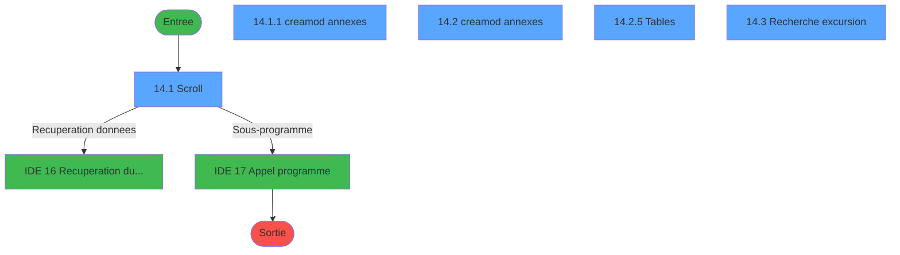
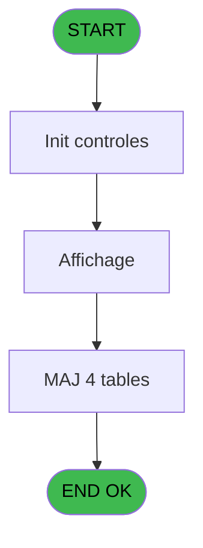
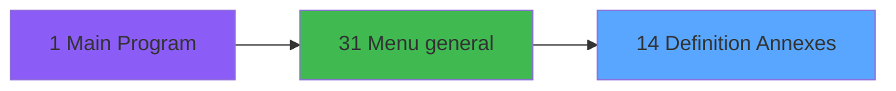
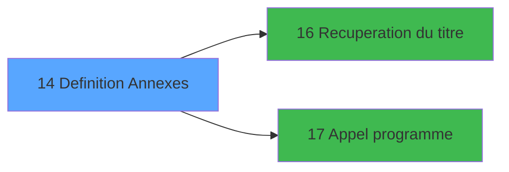

# EXB IDE 14 - Definition Annexes

> **Analyse**: Phases 1-4 2026-02-03 10:35 -> 10:35 (22s) | Assemblage 10:35
> **Pipeline**: V7.2 Enrichi
> **Structure**: 4 onglets (Resume | Ecrans | Donnees | Connexions)

<!-- TAB:Resume -->

## 1. FICHE D'IDENTITE

| Attribut | Valeur |
|----------|--------|
| Projet | EXB |
| IDE Position | 14 |
| Nom Programme | Definition Annexes |
| Fichier source | `Prg_14.xml` |
| Domaine metier | General |
| Taches | 11 (5 ecrans visibles) |
| Tables modifiees | 4 |
| Programmes appeles | 2 |

## 2. DESCRIPTION FONCTIONNELLE

**Definition Annexes** assure la gestion complete de ce processus, accessible depuis [Menu general (IDE 31)](EXB-IDE-31.md).

Le flux de traitement s'organise en **5 blocs fonctionnels** :

- **Traitement** (5 taches) : traitements metier divers
- **Consultation** (3 taches) : ecrans de recherche, selection et consultation
- **Creation** (1 tache) : insertion d'enregistrements en base (mouvements, prestations)
- **Calcul** (1 tache) : calculs de montants, stocks ou compteurs
- **Initialisation** (1 tache) : reinitialisation d'etats et de variables de travail

**Donnees modifiees** : 4 tables en ecriture (excurs_annexes___ean, compteur_excurs__cte, excursions_______exc, tables_divers____tad).

Detail : phases du traitement

#### Phase 1 : Initialisation (1 tache)

- **14** - Definition Annexes **[[ECRAN]](#ecran-t1)**

#### Phase 2 : Traitement (5 taches)

- **14.1** - Scroll **[[ECRAN]](#ecran-t2)**
- **14.1.1** - creamod annexes **[[ECRAN]](#ecran-t3)**
- **14.2** - creamod annexes **[[ECRAN]](#ecran-t5)**
- **14.2.4** - Suppression
- **14.2.5** - Tables **[[ECRAN]](#ecran-t12)**

Delegue a : [Recuperation du titre (IDE 16)](EXB-IDE-16.md), [Appel programme (IDE 17)](EXB-IDE-17.md)

#### Phase 3 : Consultation (3 taches)

- **14.1.1.1** - Affichage fournisseur
- **14.2.3** - Affichage fournisseur
- **14.3** - Recherche excursion **[[ECRAN]](#ecran-t13)**

Delegue a : [Recuperation du titre (IDE 16)](EXB-IDE-16.md)

#### Phase 4 : Calcul (1 tache)

- **14.2.1** - Compteur

#### Phase 5 : Creation (1 tache)

- **14.2.2** - Creation

#### Tables impactees

| Table | Operations | Role metier |
|-------|-----------|-------------|
| excurs_annexes___ean | **W**/L (7 usages) |  |
| excursions_______exc | R/**W** (4 usages) |  |
| compteur_excurs__cte | **W** (1 usages) | Comptes GM (generaux) |
| tables_divers____tad | **W** (1 usages) |  |

## 3. BLOCS FONCTIONNELS

### 3.1 Initialisation (1 tache)

Reinitialisation d'etats et variables de travail.

---

#### 14 - Definition Annexes [[ECRAN]](#ecran-t1)

**Role** : Reinitialisation : Definition Annexes.
**Ecran** : 1261 x 295 DLU (MDI) | [Voir mockup](#ecran-t1)
**Variables liees** : L (T_Annexes)

### 3.2 Traitement (5 taches)

Traitements internes.

---

#### 14.1 - Scroll [[ECRAN]](#ecran-t2)

**Role** : Traitement : Scroll.
**Ecran** : 1267 x 297 DLU (MDI) | [Voir mockup](#ecran-t2)
**Delegue a** : [Recuperation du titre (IDE 16)](EXB-IDE-16.md), [Appel programme (IDE 17)](EXB-IDE-17.md)

---

#### 14.1.1 - creamod annexes [[ECRAN]](#ecran-t3)

**Role** : Traitement : creamod annexes.
**Ecran** : 888 x 152 DLU (Modal) | [Voir mockup](#ecran-t3)
**Variables liees** : L (T_Annexes)
**Delegue a** : [Recuperation du titre (IDE 16)](EXB-IDE-16.md), [Appel programme (IDE 17)](EXB-IDE-17.md)

---

#### 14.2 - creamod annexes [[ECRAN]](#ecran-t5)

**Role** : Traitement : creamod annexes.
**Ecran** : 888 x 152 DLU (MDI) | [Voir mockup](#ecran-t5)
**Variables liees** : L (T_Annexes)
**Delegue a** : [Recuperation du titre (IDE 16)](EXB-IDE-16.md), [Appel programme (IDE 17)](EXB-IDE-17.md)

---

#### 14.2.4 - Suppression

**Role** : Traitement : Suppression.
**Delegue a** : [Recuperation du titre (IDE 16)](EXB-IDE-16.md), [Appel programme (IDE 17)](EXB-IDE-17.md)

---

#### 14.2.5 - Tables [[ECRAN]](#ecran-t12)

**Role** : Traitement : Tables.
**Ecran** : 502 x 213 DLU (MDI) | [Voir mockup](#ecran-t12)
**Delegue a** : [Recuperation du titre (IDE 16)](EXB-IDE-16.md), [Appel programme (IDE 17)](EXB-IDE-17.md)

### 3.3 Consultation (3 taches)

Ecrans de recherche et consultation.

---

#### 14.1.1.1 - Affichage fournisseur

**Role** : Reinitialisation : Affichage fournisseur.

---

#### 14.2.3 - Affichage fournisseur

**Role** : Reinitialisation : Affichage fournisseur.

---

#### 14.3 - Recherche excursion [[ECRAN]](#ecran-t13)

**Role** : Traitement : Recherche excursion.
**Ecran** : 578 x 138 DLU (MDI) | [Voir mockup](#ecran-t13)
**Variables liees** : K (T_Excursion)

### 3.4 Calcul (1 tache)

Calculs metier : montants, stocks, compteurs.

---

#### 14.2.1 - Compteur

**Role** : Calcul : Compteur.

### 3.5 Creation (1 tache)

Insertion de nouveaux enregistrements en base.

---

#### 14.2.2 - Creation

**Role** : Creation d'enregistrement : Creation.

## 5. REGLES METIER

*(Aucune regle metier identifiee)*

## 6. CONTEXTE

- **Appele par**: [Menu general (IDE 31)](EXB-IDE-31.md)
- **Appelle**: 2 programmes | **Tables**: 5 (W:4 R:1 L:2) | **Taches**: 11 | **Expressions**: 5

<!-- TAB:Ecrans -->

## 8. ECRANS

### 8.1 Forms visibles (5 / 11)

| # | Position | Tache | Nom | Type | Largeur | Hauteur | Bloc |
|---|----------|-------|-----|------|---------|---------|------|
| 1 | 14.1 | 14.1 | Scroll | MDI | 1267 | 297 | Traitement |
| 2 | 14.1.1 | 14.1.1 | creamod annexes | Modal | 888 | 152 | Traitement |
| 3 | 14.2 | 14.2 | creamod annexes | MDI | 888 | 152 | Traitement |
| 4 | 14.2.5 | 14.2.5 | Tables | MDI | 502 | 213 | Traitement |
| 5 | 14.3 | 14.3 | Recherche excursion | MDI | 578 | 138 | Consultation |

### 8.2 Mockups Ecrans

---

#### 14.1 - Scroll
**Tache** : [14.1](#t2) | **Type** : MDI | **Dimensions** : 1267 x 297 DLU
**Bloc** : Traitement | **Titre IDE** : Scroll

<!-- FORM-DATA:
{
    "width":  1267,
    "vFactor":  8,
    "type":  "MDI",
    "hFactor":  8,
    "controls":  [
                     {
                         "x":  3,
                         "type":  "label",
                         "var":  "",
                         "y":  2,
                         "w":  1254,
                         "fmt":  "",
                         "name":  "",
                         "h":  19,
                         "color":  "",
                         "text":  "",
                         "parent":  null
                     },
                     {
                         "x":  328,
                         "type":  "label",
                         "var":  "",
                         "y":  23,
                         "w":  917,
                         "fmt":  "",
                         "name":  "",
                         "h":  162,
                         "color":  "195",
                         "text":  "Annexes",
                         "parent":  null
                     },
                     {
                         "x":  21,
                         "type":  "table",
                         "var":  "",
                         "name":  "",
                         "titleH":  12,
                         "color":  "110",
                         "w":  288,
                         "y":  26,
                         "fmt":  "",
                         "parent":  null,
                         "text":  "",
                         "rowH":  14,
                         "h":  238,
                         "cols":  [
                                      {
                                          "title":  "Excursion",
                                          "layer":  1,
                                          "w":  249
                                      }
                                  ],
                         "rows":  1
                     },
                     {
                         "x":  539,
                         "type":  "label",
                         "var":  "",
                         "y":  191,
                         "w":  251,
                         "fmt":  "",
                         "name":  "",
                         "h":  75,
                         "color":  "",
                         "text":  "",
                         "parent":  null
                     },
                     {
                         "x":  566,
                         "type":  "label",
                         "var":  "",
                         "y":  201,
                         "w":  196,
                         "fmt":  "",
                         "name":  "",
                         "h":  39,
                         "color":  "195",
                         "text":  "",
                         "parent":  8
                     },
                     {
                         "x":  568,
                         "type":  "label",
                         "var":  "",
                         "y":  202,
                         "w":  44,
                         "fmt":  "",
                         "name":  "",
                         "h":  37,
                         "color":  "",
                         "text":  "",
                         "parent":  10
                     },
                     {
                         "x":  619,
                         "type":  "label",
                         "var":  "",
                         "y":  209,
                         "w":  135,
                         "fmt":  "",
                         "name":  "",
                         "h":  9,
                         "color":  "142",
                         "text":  "Recherche",
                         "parent":  10
                     },
                     {
                         "x":  619,
                         "type":  "label",
                         "var":  "",
                         "y":  224,
                         "w":  135,
                         "fmt":  "",
                         "name":  "",
                         "h":  9,
                         "color":  "142",
                         "text":  "Modification",
                         "parent":  10
                     },
                     {
                         "x":  585,
                         "type":  "label",
                         "var":  "",
                         "y":  248,
                         "w":  120,
                         "fmt":  "",
                         "name":  "",
                         "h":  9,
                         "color":  "",
                         "text":  "Votre choix",
                         "parent":  8
                     },
                     {
                         "x":  0,
                         "type":  "label",
                         "var":  "",
                         "y":  273,
                         "w":  1260,
                         "fmt":  "",
                         "name":  "",
                         "h":  22,
                         "color":  "",
                         "text":  "",
                         "parent":  null
                     },
                     {
                         "x":  27,
                         "type":  "edit",
                         "var":  "",
                         "y":  40,
                         "w":  238,
                         "fmt":  "",
                         "name":  "",
                         "h":  10,
                         "color":  "110",
                         "text":  "",
                         "parent":  5
                     },
                     {
                         "x":  721,
                         "type":  "edit",
                         "var":  "",
                         "y":  248,
                         "w":  28,
                         "fmt":  "",
                         "name":  "W1 choix action",
                         "h":  10,
                         "color":  "6",
                         "text":  "",
                         "parent":  8
                     },
                     {
                         "x":  6,
                         "type":  "edit",
                         "var":  "",
                         "y":  7,
                         "w":  267,
                         "fmt":  "20",
                         "name":  "",
                         "h":  8,
                         "color":  "",
                         "text":  "",
                         "parent":  1
                     },
                     {
                         "x":  1046,
                         "type":  "edit",
                         "var":  "",
                         "y":  7,
                         "w":  203,
                         "fmt":  "WWW DD MMM YYYYT",
                         "name":  "",
                         "h":  8,
                         "color":  "",
                         "text":  "",
                         "parent":  1
                     },
                     {
                         "x":  907,
                         "type":  "image",
                         "var":  "",
                         "y":  197,
                         "w":  192,
                         "fmt":  "",
                         "name":  "",
                         "h":  70,
                         "color":  "",
                         "text":  "",
                         "parent":  null
                     },
                     {
                         "x":  574,
                         "type":  "button",
                         "var":  "",
                         "y":  209,
                         "w":  29,
                         "fmt":  "R",
                         "name":  "R",
                         "h":  9,
                         "color":  "",
                         "text":  "",
                         "parent":  10
                     },
                     {
                         "x":  574,
                         "type":  "button",
                         "var":  "",
                         "y":  224,
                         "w":  29,
                         "fmt":  "M",
                         "name":  "M",
                         "h":  9,
                         "color":  "",
                         "text":  "",
                         "parent":  10
                     },
                     {
                         "x":  4,
                         "type":  "button",
                         "var":  "",
                         "y":  275,
                         "w":  154,
                         "fmt":  "\u0026Quitter",
                         "name":  "",
                         "h":  18,
                         "color":  "",
                         "text":  "",
                         "parent":  16
                     }
                 ],
    "taskId":  "14.1",
    "height":  297
}
-->

<strong>Champs : 4 champs</strong>

| Pos (x,y) | Nom | Variable | Type |
|-----------|-----|----------|------|
| 27,40 | (sans nom) | - | edit |
| 721,248 | W1 choix action | - | edit |
| 6,7 | 20 | - | edit |
| 1046,7 | WWW DD MMM YYYYT | - | edit |

<strong>Boutons : 3 boutons</strong>

| Bouton | Pos (x,y) | Action |
|--------|-----------|--------|
| R | 574,209 | Bouton fonctionnel |
| M | 574,224 | Bouton fonctionnel |
| Quitter | 4,275 | Quitte le programme |

---

#### 14.1.1 - creamod annexes
**Tache** : [14.1.1](#t3) | **Type** : Modal | **Dimensions** : 888 x 152 DLU
**Bloc** : Traitement | **Titre IDE** : creamod annexes

<!-- FORM-DATA:
{
    "width":  888,
    "vFactor":  8,
    "type":  "Modal",
    "hFactor":  8,
    "controls":  [
                     {
                         "x":  18,
                         "type":  "label",
                         "var":  "",
                         "y":  4,
                         "w":  72,
                         "fmt":  "",
                         "name":  "",
                         "h":  8,
                         "color":  "",
                         "text":  "Transport",
                         "parent":  null
                     },
                     {
                         "x":  18,
                         "type":  "label",
                         "var":  "",
                         "y":  28,
                         "w":  96,
                         "fmt":  "",
                         "name":  "",
                         "h":  8,
                         "color":  "",
                         "text":  "Programme",
                         "parent":  null
                     },
                     {
                         "x":  18,
                         "type":  "label",
                         "var":  "",
                         "y":  76,
                         "w":  115,
                         "fmt":  "",
                         "name":  "",
                         "h":  12,
                         "color":  "",
                         "text":  "Ne pas oublier",
                         "parent":  null
                     },
                     {
                         "x":  18,
                         "type":  "label",
                         "var":  "",
                         "y":  92,
                         "w":  64,
                         "fmt":  "",
                         "name":  "",
                         "h":  12,
                         "color":  "",
                         "text":  "Materiel",
                         "parent":  null
                     },
                     {
                         "x":  18,
                         "type":  "label",
                         "var":  "",
                         "y":  108,
                         "w":  72,
                         "fmt":  "",
                         "name":  "",
                         "h":  11,
                         "color":  "",
                         "text":  "Aptitudes",
                         "parent":  null
                     },
                     {
                         "x":  18,
                         "type":  "label",
                         "var":  "",
                         "y":  124,
                         "w":  80,
                         "fmt":  "",
                         "name":  "",
                         "h":  10,
                         "color":  "",
                         "text":  "Annulation",
                         "parent":  null
                     },
                     {
                         "x":  18,
                         "type":  "label",
                         "var":  "",
                         "y":  138,
                         "w":  85,
                         "fmt":  "",
                         "name":  "",
                         "h":  10,
                         "color":  "",
                         "text":  "Langues",
                         "parent":  null
                     },
                     {
                         "x":  463,
                         "type":  "label",
                         "var":  "",
                         "y":  138,
                         "w":  96,
                         "fmt":  "",
                         "name":  "",
                         "h":  10,
                         "color":  "",
                         "text":  "Autres (O/N)",
                         "parent":  null
                     },
                     {
                         "x":  175,
                         "type":  "edit",
                         "var":  "",
                         "y":  4,
                         "w":  701,
                         "fmt":  "",
                         "name":  "",
                         "h":  19,
                         "color":  "",
                         "text":  "",
                         "parent":  null
                     },
                     {
                         "x":  175,
                         "type":  "edit",
                         "var":  "",
                         "y":  28,
                         "w":  701,
                         "fmt":  "",
                         "name":  "",
                         "h":  41,
                         "color":  "",
                         "text":  "",
                         "parent":  null
                     },
                     {
                         "x":  175,
                         "type":  "edit",
                         "var":  "",
                         "y":  76,
                         "w":  701,
                         "fmt":  "",
                         "name":  "",
                         "h":  12,
                         "color":  "",
                         "text":  "",
                         "parent":  null
                     },
                     {
                         "x":  175,
                         "type":  "edit",
                         "var":  "",
                         "y":  92,
                         "w":  701,
                         "fmt":  "",
                         "name":  "",
                         "h":  12,
                         "color":  "",
                         "text":  "",
                         "parent":  null
                     },
                     {
                         "x":  175,
                         "type":  "edit",
                         "var":  "",
                         "y":  108,
                         "w":  701,
                         "fmt":  "",
                         "name":  "",
                         "h":  11,
                         "color":  "",
                         "text":  "",
                         "parent":  null
                     },
                     {
                         "x":  175,
                         "type":  "edit",
                         "var":  "",
                         "y":  124,
                         "w":  462,
                         "fmt":  "",
                         "name":  "",
                         "h":  10,
                         "color":  "",
                         "text":  "",
                         "parent":  null
                     },
                     {
                         "x":  175,
                         "type":  "edit",
                         "var":  "",
                         "y":  138,
                         "w":  238,
                         "fmt":  "",
                         "name":  "",
                         "h":  10,
                         "color":  "",
                         "text":  "",
                         "parent":  null
                     },
                     {
                         "x":  577,
                         "type":  "combobox",
                         "var":  "",
                         "y":  138,
                         "w":  78,
                         "fmt":  "",
                         "name":  "",
                         "h":  12,
                         "color":  "",
                         "text":  "Oui,Non",
                         "parent":  null
                     }
                 ],
    "taskId":  "14.1.1",
    "height":  152
}
-->

<strong>Champs : 8 champs</strong>

| Pos (x,y) | Nom | Variable | Type |
|-----------|-----|----------|------|
| 175,4 | (sans nom) | - | edit |
| 175,28 | (sans nom) | - | edit |
| 175,76 | (sans nom) | - | edit |
| 175,92 | (sans nom) | - | edit |
| 175,108 | (sans nom) | - | edit |
| 175,124 | (sans nom) | - | edit |
| 175,138 | (sans nom) | - | edit |
| 577,138 | Oui,Non | - | combobox |

---

#### 14.2 - creamod annexes
**Tache** : [14.2](#t5) | **Type** : MDI | **Dimensions** : 888 x 152 DLU
**Bloc** : Traitement | **Titre IDE** : creamod annexes

<!-- FORM-DATA:
{
    "width":  888,
    "vFactor":  8,
    "type":  "MDI",
    "hFactor":  8,
    "controls":  [
                     {
                         "x":  18,
                         "type":  "label",
                         "var":  "",
                         "y":  4,
                         "w":  72,
                         "fmt":  "",
                         "name":  "",
                         "h":  8,
                         "color":  "",
                         "text":  "Transport",
                         "parent":  null
                     },
                     {
                         "x":  18,
                         "type":  "label",
                         "var":  "",
                         "y":  28,
                         "w":  96,
                         "fmt":  "",
                         "name":  "",
                         "h":  8,
                         "color":  "",
                         "text":  "Programme",
                         "parent":  null
                     },
                     {
                         "x":  18,
                         "type":  "label",
                         "var":  "",
                         "y":  76,
                         "w":  115,
                         "fmt":  "",
                         "name":  "",
                         "h":  12,
                         "color":  "",
                         "text":  "Ne pas oublier",
                         "parent":  null
                     },
                     {
                         "x":  18,
                         "type":  "label",
                         "var":  "",
                         "y":  92,
                         "w":  64,
                         "fmt":  "",
                         "name":  "",
                         "h":  12,
                         "color":  "",
                         "text":  "Materiel",
                         "parent":  null
                     },
                     {
                         "x":  18,
                         "type":  "label",
                         "var":  "",
                         "y":  108,
                         "w":  72,
                         "fmt":  "",
                         "name":  "",
                         "h":  11,
                         "color":  "",
                         "text":  "Aptitudes",
                         "parent":  null
                     },
                     {
                         "x":  18,
                         "type":  "label",
                         "var":  "",
                         "y":  124,
                         "w":  80,
                         "fmt":  "",
                         "name":  "",
                         "h":  10,
                         "color":  "",
                         "text":  "Annulation",
                         "parent":  null
                     },
                     {
                         "x":  18,
                         "type":  "label",
                         "var":  "",
                         "y":  138,
                         "w":  85,
                         "fmt":  "",
                         "name":  "",
                         "h":  10,
                         "color":  "",
                         "text":  "Langues",
                         "parent":  null
                     },
                     {
                         "x":  463,
                         "type":  "label",
                         "var":  "",
                         "y":  138,
                         "w":  96,
                         "fmt":  "",
                         "name":  "",
                         "h":  10,
                         "color":  "",
                         "text":  "Autres (O/N)",
                         "parent":  null
                     },
                     {
                         "x":  175,
                         "type":  "edit",
                         "var":  "",
                         "y":  4,
                         "w":  701,
                         "fmt":  "",
                         "name":  "W1 transport",
                         "h":  19,
                         "color":  "148",
                         "text":  "",
                         "parent":  null
                     },
                     {
                         "x":  175,
                         "type":  "edit",
                         "var":  "",
                         "y":  28,
                         "w":  701,
                         "fmt":  "",
                         "name":  "W1 Programme",
                         "h":  41,
                         "color":  "148",
                         "text":  "",
                         "parent":  null
                     },
                     {
                         "x":  175,
                         "type":  "edit",
                         "var":  "",
                         "y":  76,
                         "w":  701,
                         "fmt":  "",
                         "name":  "W1 Ne pas oublier",
                         "h":  12,
                         "color":  "148",
                         "text":  "",
                         "parent":  null
                     },
                     {
                         "x":  175,
                         "type":  "edit",
                         "var":  "",
                         "y":  92,
                         "w":  701,
                         "fmt":  "",
                         "name":  "W1 Materiel fourni",
                         "h":  12,
                         "color":  "148",
                         "text":  "",
                         "parent":  null
                     },
                     {
                         "x":  175,
                         "type":  "edit",
                         "var":  "",
                         "y":  108,
                         "w":  701,
                         "fmt":  "",
                         "name":  "W1 Aptitudes",
                         "h":  11,
                         "color":  "148",
                         "text":  "",
                         "parent":  null
                     },
                     {
                         "x":  175,
                         "type":  "edit",
                         "var":  "",
                         "y":  124,
                         "w":  462,
                         "fmt":  "",
                         "name":  "W1 Annulation",
                         "h":  10,
                         "color":  "6",
                         "text":  "",
                         "parent":  null
                     },
                     {
                         "x":  175,
                         "type":  "edit",
                         "var":  "",
                         "y":  138,
                         "w":  238,
                         "fmt":  "",
                         "name":  "W1 Langues",
                         "h":  10,
                         "color":  "6",
                         "text":  "",
                         "parent":  null
                     },
                     {
                         "x":  572,
                         "type":  "combobox",
                         "var":  "",
                         "y":  138,
                         "w":  106,
                         "fmt":  "",
                         "name":  "W1_Autres",
                         "h":  12,
                         "color":  "",
                         "text":  "Oui,Non",
                         "parent":  null
                     },
                     {
                         "x":  682,
                         "type":  "button",
                         "var":  "",
                         "y":  138,
                         "w":  29,
                         "fmt":  "...",
                         "name":  "",
                         "h":  11,
                         "color":  "",
                         "text":  "",
                         "parent":  null
                     }
                 ],
    "taskId":  "14.2",
    "height":  152
}
-->

<strong>Champs : 8 champs</strong>

| Pos (x,y) | Nom | Variable | Type |
|-----------|-----|----------|------|
| 175,4 | W1 transport | - | edit |
| 175,28 | W1 Programme | - | edit |
| 175,76 | W1 Ne pas oublier | - | edit |
| 175,92 | W1 Materiel fourni | - | edit |
| 175,108 | W1 Aptitudes | - | edit |
| 175,124 | W1 Annulation | - | edit |
| 175,138 | W1 Langues | - | edit |
| 572,138 | W1_Autres | - | combobox |

<strong>Boutons : 1 boutons</strong>

| Bouton | Pos (x,y) | Action |
|--------|-----------|--------|
| ... | 682,138 | Bouton fonctionnel |

---

#### 14.2.5 - Tables
**Tache** : [14.2.5](#t12) | **Type** : MDI | **Dimensions** : 502 x 213 DLU
**Bloc** : Traitement | **Titre IDE** : Tables

<!-- FORM-DATA:
{
    "width":  502,
    "vFactor":  8,
    "type":  "MDI",
    "hFactor":  8,
    "controls":  [
                     {
                         "x":  3,
                         "type":  "label",
                         "var":  "",
                         "y":  3,
                         "w":  492,
                         "fmt":  "",
                         "name":  "",
                         "h":  19,
                         "color":  "",
                         "text":  "",
                         "parent":  null
                     },
                     {
                         "x":  17,
                         "type":  "table",
                         "var":  "",
                         "name":  "",
                         "titleH":  12,
                         "color":  "110",
                         "w":  469,
                         "y":  27,
                         "fmt":  "",
                         "parent":  null,
                         "text":  "",
                         "rowH":  14,
                         "h":  153,
                         "cols":  [
                                      {
                                          "title":  "Les Tables",
                                          "layer":  1,
                                          "w":  349
                                      },
                                      {
                                          "title":  "Oui / Non",
                                          "layer":  2,
                                          "w":  82
                                      }
                                  ],
                         "rows":  2
                     },
                     {
                         "x":  1,
                         "type":  "label",
                         "var":  "",
                         "y":  187,
                         "w":  492,
                         "fmt":  "",
                         "name":  "",
                         "h":  23,
                         "color":  "",
                         "text":  "",
                         "parent":  null
                     },
                     {
                         "x":  24,
                         "type":  "edit",
                         "var":  "",
                         "y":  41,
                         "w":  344,
                         "fmt":  "",
                         "name":  "",
                         "h":  8,
                         "color":  "110",
                         "text":  "",
                         "parent":  4
                     },
                     {
                         "x":  374,
                         "type":  "combobox",
                         "var":  "",
                         "y":  41,
                         "w":  70,
                         "fmt":  "",
                         "name":  "",
                         "h":  12,
                         "color":  "110",
                         "text":  "Oui,Non",
                         "parent":  4
                     },
                     {
                         "x":  284,
                         "type":  "edit",
                         "var":  "",
                         "y":  8,
                         "w":  203,
                         "fmt":  "WWW DD MMM YYYYT",
                         "name":  "",
                         "h":  8,
                         "color":  "",
                         "text":  "",
                         "parent":  1
                     },
                     {
                         "x":  8,
                         "type":  "button",
                         "var":  "",
                         "y":  190,
                         "w":  154,
                         "fmt":  "\u0026Quitter",
                         "name":  "",
                         "h":  18,
                         "color":  "",
                         "text":  "",
                         "parent":  null
                     },
                     {
                         "x":  6,
                         "type":  "edit",
                         "var":  "",
                         "y":  8,
                         "w":  267,
                         "fmt":  "20",
                         "name":  "",
                         "h":  8,
                         "color":  "",
                         "text":  "",
                         "parent":  1
                     }
                 ],
    "taskId":  "14.2.5",
    "height":  213
}
-->

<strong>Champs : 4 champs</strong>

| Pos (x,y) | Nom | Variable | Type |
|-----------|-----|----------|------|
| 24,41 | (sans nom) | - | edit |
| 374,41 | Oui,Non | - | combobox |
| 284,8 | WWW DD MMM YYYYT | - | edit |
| 6,8 | 20 | - | edit |

<strong>Boutons : 1 boutons</strong>

| Bouton | Pos (x,y) | Action |
|--------|-----------|--------|
| Quitter | 8,190 | Quitte le programme |

---

#### 14.3 - Recherche excursion
**Tache** : [14.3](#t13) | **Type** : MDI | **Dimensions** : 578 x 138 DLU
**Bloc** : Consultation | **Titre IDE** : Recherche excursion

<!-- FORM-DATA:
{
    "width":  578,
    "vFactor":  8,
    "type":  "MDI",
    "hFactor":  8,
    "controls":  [
                     {
                         "x":  5,
                         "type":  "label",
                         "var":  "",
                         "y":  2,
                         "w":  565,
                         "fmt":  "",
                         "name":  "",
                         "h":  17,
                         "color":  "",
                         "text":  "",
                         "parent":  null
                     },
                     {
                         "x":  299,
                         "type":  "label",
                         "var":  "",
                         "y":  37,
                         "w":  180,
                         "fmt":  "",
                         "name":  "",
                         "h":  9,
                         "color":  "",
                         "text":  "Entrez le libelle :",
                         "parent":  null
                     },
                     {
                         "x":  3,
                         "type":  "label",
                         "var":  "",
                         "y":  113,
                         "w":  567,
                         "fmt":  "",
                         "name":  "",
                         "h":  21,
                         "color":  "",
                         "text":  "",
                         "parent":  null
                     },
                     {
                         "x":  265,
                         "type":  "edit",
                         "var":  "",
                         "y":  64,
                         "w":  238,
                         "fmt":  "",
                         "name":  "",
                         "h":  10,
                         "color":  "6",
                         "text":  "",
                         "parent":  null
                     },
                     {
                         "x":  359,
                         "type":  "edit",
                         "var":  "",
                         "y":  6,
                         "w":  203,
                         "fmt":  "WWW DD MMM YYYYT",
                         "name":  "",
                         "h":  8,
                         "color":  "",
                         "text":  "",
                         "parent":  1
                     },
                     {
                         "x":  41,
                         "type":  "image",
                         "var":  "",
                         "y":  38,
                         "w":  163,
                         "fmt":  "",
                         "name":  "",
                         "h":  59,
                         "color":  "",
                         "text":  "",
                         "parent":  null
                     },
                     {
                         "x":  6,
                         "type":  "button",
                         "var":  "",
                         "y":  115,
                         "w":  168,
                         "fmt":  "\u0026Quitter",
                         "name":  "",
                         "h":  18,
                         "color":  "",
                         "text":  "",
                         "parent":  7
                     },
                     {
                         "x":  8,
                         "type":  "edit",
                         "var":  "",
                         "y":  6,
                         "w":  267,
                         "fmt":  "20",
                         "name":  "",
                         "h":  8,
                         "color":  "",
                         "text":  "",
                         "parent":  1
                     }
                 ],
    "taskId":  "14.3",
    "height":  138
}
-->

<strong>Champs : 3 champs</strong>

| Pos (x,y) | Nom | Variable | Type |
|-----------|-----|----------|------|
| 265,64 | (sans nom) | - | edit |
| 359,6 | WWW DD MMM YYYYT | - | edit |
| 8,6 | 20 | - | edit |

<strong>Boutons : 1 boutons</strong>

| Bouton | Pos (x,y) | Action |
|--------|-----------|--------|
| Quitter | 6,115 | Quitte le programme |

## 9. NAVIGATION

### 9.1 Enchainement des ecrans

**Detail par enchainement :**

| Depuis | Action | Vers | Retour |
|--------|--------|------|--------|
| Scroll | Recuperation donnees | [Recuperation du titre (IDE 16)](EXB-IDE-16.md) | Retour ecran |
| Scroll | Sous-programme | [Appel programme (IDE 17)](EXB-IDE-17.md) | Retour ecran |

### 9.3 Structure hierarchique (11 taches)

| Position | Tache | Type | Dimensions | Bloc |
|----------|-------|------|------------|------|
| **14.1** | [**Definition Annexes** (14)](#t1) [mockup](#ecran-t1) | MDI | 1261x295 | Initialisation |
| **14.2** | [**Scroll** (14.1)](#t2) [mockup](#ecran-t2) | MDI | 1267x297 | Traitement |
| 14.2.1 | [creamod annexes (14.1.1)](#t3) [mockup](#ecran-t3) | Modal | 888x152 | |
| 14.2.2 | [creamod annexes (14.2)](#t5) [mockup](#ecran-t5) | MDI | 888x152 | |
| 14.2.3 | [Suppression (14.2.4)](#t11) | MDI | - | |
| 14.2.4 | [Tables (14.2.5)](#t12) [mockup](#ecran-t12) | MDI | 502x213 | |
| **14.3** | [**Affichage fournisseur** (14.1.1.1)](#t4) | MDI | - | Consultation |
| 14.3.1 | [Affichage fournisseur (14.2.3)](#t10) | MDI | - | |
| 14.3.2 | [Recherche excursion (14.3)](#t13) [mockup](#ecran-t13) | MDI | 578x138 | |
| **14.4** | [**Compteur** (14.2.1)](#t8) | MDI | - | Calcul |
| **14.5** | [**Creation** (14.2.2)](#t9) | MDI | - | Creation |

### 9.4 Algorigramme

> **Legende**: Vert = START/END OK | Rouge = END KO | Bleu = Decisions
> *Algorigramme auto-genere. Utiliser `/algorigramme` pour une synthese metier detaillee.*

<!-- TAB:Donnees -->

## 10. TABLES

### Tables utilisees (5)

| ID | Nom | Description | Type | R | W | L | Usages |
|----|-----|-------------|------|---|---|---|--------|
| 290 | excurs_annexes___ean |  | DB |   | **W** | L | 7 |
| 292 | compteur_excurs__cte | Comptes GM (generaux) | DB |   | **W** |   | 1 |
| 294 | divers_excursion_die |  | DB |   |   | L | 4 |
| 300 | excursions_______exc |  | DB | R | **W** |   | 4 |
| 304 | tables_divers____tad |  | DB |   | **W** |   | 1 |

### Colonnes par table (5 / 4 tables avec colonnes identifiees)

Table 290 - excurs_annexes___ean (**W**/L) - 7 usages

| Lettre | Variable | Acces | Type |
|--------|----------|-------|------|
| K | T_Excursion | W | Numeric |
| L | T_Annexes | W | Numeric |

Table 292 - compteur_excurs__cte (**W**) - 1 usages

| Lettre | Variable | Acces | Type |
|--------|----------|-------|------|
| K | T_Excursion | W | Numeric |

Table 300 - excursions_______exc (R/**W**) - 4 usages

| Lettre | Variable | Acces | Type |
|--------|----------|-------|------|
| A | W1 choix action | W | Alpha |
| B | W1 fin tâche | W | Alpha |
| C | W1 ret.lien ventes | W | Numeric |
| D | W1 ret lien autre | W | Numeric |
| E | v. titre scroll | W | Alpha |
| F | W1 Materiel fourni | W | Alpha |
| G | W1 Aptitudes | W | Alpha |
| H | W1 Annulation | W | Alpha |
| I | W1 Langues | W | Alpha |
| J | W1_Autres | W | Alpha |
| K | T_Excursion | W | Numeric |
| L | T_Annexes | W | Numeric |
| M | W1 confirmation | W | Alpha |
| N | W1 fin tâche | W | Alpha |

Table 304 - tables_divers____tad (**W**) - 1 usages

| Lettre | Variable | Acces | Type |
|--------|----------|-------|------|
| A | W2 fin tâche | W | Alpha |
| B | v. titre | W | Alpha |

## 11. VARIABLES

### 11.1 Parametres entrants (3)

Variables recues du programme appelant ([Menu general (IDE 31)](EXB-IDE-31.md)).

| Lettre | Nom | Type | Usage dans |
|--------|-----|------|-----------|
| A | P0 nbre decimales | Numeric | - |
| B | P0 devise | Alpha | - |
| C | P0 masque montant | Alpha | - |

### 11.2 Variables de session (1)

Variables persistantes pendant toute la session.

| Lettre | Nom | Type | Usage dans |
|--------|-----|------|-----------|
| H | v. titre | Alpha | 1x session |

### 11.3 Variables de travail (4)

Variables internes au programme.

| Lettre | Nom | Type | Usage dans |
|--------|-----|------|-----------|
| D | W0 choix action | Alpha | 3x calcul interne |
| E | W0 code | Numeric | - |
| F | W0 libelle | Alpha | - |
| G | W0 pas enreg | Alpha | - |

### 11.4 Autres (6)

Variables diverses.

| Lettre | Nom | Type | Usage dans |
|--------|-----|------|-----------|
| I | W1 Langues | Alpha | - |
| J | W1_Autres | Alpha | - |
| K | T_Excursion | Numeric | - |
| L | T_Annexes | Numeric | - |
| M | W1 confirmation | Alpha | - |
| N | W1 fin tâche | Alpha | - |

## 12. EXPRESSIONS

**5 / 5 expressions decodees (100%)**

### 12.1 Repartition par type

| Type | Expressions | Regles |
|------|-------------|--------|
| CONSTANTE | 1 | 0 |
| CONDITION | 3 | 0 |
| STRING | 1 | 0 |

### 12.2 Expressions cles par type

#### CONSTANTE (1 expressions)

| Type | IDE | Expression | Regle |
|------|-----|------------|-------|
| CONSTANTE | 4 | `6` | - |

#### CONDITION (3 expressions)

| Type | IDE | Expression | Regle |
|------|-----|------------|-------|
| CONDITION | 3 | `W0 choix action [D]='R'` | - |
| CONDITION | 2 | `W0 choix action [D]='M'` | - |
| CONDITION | 1 | `W0 choix action [D]='F'` | - |

#### STRING (1 expressions)

| Type | IDE | Expression | Regle |
|------|-----|------------|-------|
| STRING | 5 | `Trim (v. titre [H])` | - |

<!-- TAB:Connexions -->

## 13. GRAPHE D'APPELS

### 13.1 Chaine depuis Main (Callers)

Main -> ... -> [Menu general (IDE 31)](EXB-IDE-31.md) -> **Definition Annexes (IDE 14)**

### 13.2 Callers

| IDE | Nom Programme | Nb Appels |
|-----|---------------|-----------|
| [31](EXB-IDE-31.md) | Menu general | 1 |

### 13.3 Callees (programmes appeles)

### 13.4 Detail Callees avec contexte

| IDE | Nom Programme | Appels | Contexte |
|-----|---------------|--------|----------|
| [16](EXB-IDE-16.md) | Recuperation du titre | 4 | Recuperation donnees |
| [17](EXB-IDE-17.md) | Appel programme | 1 | Sous-programme |

## 14. RECOMMANDATIONS MIGRATION

### 14.1 Profil du programme

| Metrique | Valeur | Impact migration |
|----------|--------|-----------------|
| Lignes de logique | 261 | Taille moyenne |
| Expressions | 5 | Peu de logique |
| Tables WRITE | 4 | Impact modere |
| Sous-programmes | 2 | Peu de dependances |
| Ecrans visibles | 5 | Quelques ecrans |
| Code desactive | 0% (0 / 261) | Code sain |
| Regles metier | 0 | Pas de regle identifiee |

### 14.2 Plan de migration par bloc

#### Initialisation (1 tache: 1 ecran, 0 traitement)

- **Strategie** : Constructeur/methode `InitAsync()` dans l'orchestrateur.

#### Traitement (5 taches: 4 ecrans, 1 traitement)

- **Strategie** : Orchestrateur avec 4 ecrans (Razor/React) et 1 traitements backend (services).
- Les ecrans deviennent des composants UI, les traitements invisibles deviennent des services injectables.
- 2 sous-programme(s) a migrer ou a reutiliser depuis les services existants.
- Decomposer les taches en services unitaires testables.

#### Consultation (3 taches: 1 ecran, 2 traitements)

- **Strategie** : Composants de recherche/selection en modales.
- 1 ecran : Recherche excursion

#### Calcul (1 tache: 0 ecran, 1 traitement)

- **Strategie** : Services de calcul purs (Domain Services).
- Migrer la logique de calcul (stock, compteurs, montants)

#### Creation (1 tache: 0 ecran, 1 traitement)

- **Strategie** : Repository pattern avec Entity Framework Core.
- Insertion via `IRepository<T>.CreateAsync()`

### 14.3 Dependances critiques

| Dependance | Type | Appels | Impact |
|------------|------|--------|--------|
| excurs_annexes___ean | Table WRITE (Database) | 4x | Schema + repository |
| compteur_excurs__cte | Table WRITE (Database) | 1x | Schema + repository |
| excursions_______exc | Table WRITE (Database) | 3x | Schema + repository |
| tables_divers____tad | Table WRITE (Database) | 1x | Schema + repository |
| [Recuperation du titre (IDE 16)](EXB-IDE-16.md) | Sous-programme | 4x | **CRITIQUE** - Recuperation donnees |
| [Appel programme (IDE 17)](EXB-IDE-17.md) | Sous-programme | 1x | Normale - Sous-programme |

---
*Spec DETAILED generee par Pipeline V7.2 - 2026-02-03 10:35*
