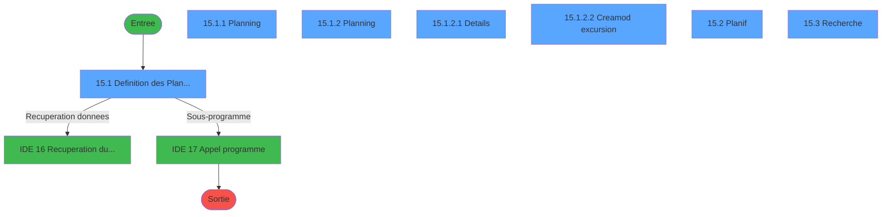
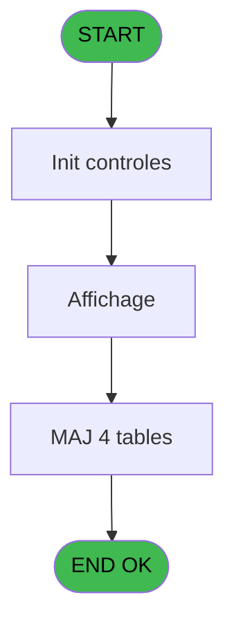
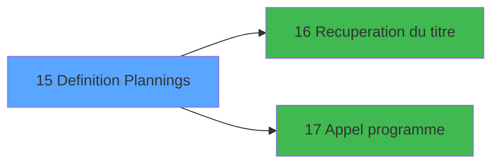

# EXB IDE 15 - Definition Plannings

> **Analyse**: Phases 1-4 2026-02-03 10:35 -> 10:35 (21s) | Assemblage 10:35
> **Pipeline**: V7.2 Enrichi
> **Structure**: 4 onglets (Resume | Ecrans | Donnees | Connexions)

<!-- TAB:Resume -->

## 1. FICHE D'IDENTITE

| Attribut | Valeur |
|----------|--------|
| Projet | EXB |
| IDE Position | 15 |
| Nom Programme | Definition Plannings |
| Fichier source | `Prg_15.xml` |
| Domaine metier | General |
| Taches | 16 (7 ecrans visibles) |
| Tables modifiees | 4 |
| Programmes appeles | 2 |

## 2. DESCRIPTION FONCTIONNELLE

**Definition Plannings** assure la gestion complete de ce processus, accessible depuis [Menu general (IDE 31)](EXB-IDE-31.md).

Le flux de traitement s'organise en **5 blocs fonctionnels** :

- **Traitement** (9 taches) : traitements metier divers
- **Creation** (2 taches) : insertion d'enregistrements en base (mouvements, prestations)
- **Consultation** (2 taches) : ecrans de recherche, selection et consultation
- **Calcul** (2 taches) : calculs de montants, stocks ou compteurs
- **Initialisation** (1 tache) : reinitialisation d'etats et de variables de travail

**Donnees modifiees** : 4 tables en ecriture (excurs_annexes___ean, compteur_excurs__cte, excurs_planning__epl, excursions_______exc).

Detail : phases du traitement

#### Phase 1 : Traitement (9 taches)

- **15** - Plannings **[[ECRAN]](#ecran-t1)**
- **15.1.1** - Planning **[[ECRAN]](#ecran-t3)**
- **15.1.2** - Planning **[[ECRAN]](#ecran-t4)**
- **15.1.2.1** - Details **[[ECRAN]](#ecran-t5)**
- **15.1.2.2** - Creamod excursion **[[ECRAN]](#ecran-t6)**
- **15.1.2.2.4** - Suppression
- **15.2** - Planif **[[ECRAN]](#ecran-t12)**
- **15.2.3** - Suppression
- **15.2.4** - Contrôle dates

Delegue a : [Recuperation du titre (IDE 16)](EXB-IDE-16.md), [Appel programme (IDE 17)](EXB-IDE-17.md)

#### Phase 2 : Initialisation (1 tache)

- **15.1** - Definition des Plannings **[[ECRAN]](#ecran-t2)**

#### Phase 3 : Calcul (2 taches)

- **15.1.2.2.1** - Compteur
- **15.2.1** - Compteur

#### Phase 4 : Creation (2 taches)

- **15.1.2.2.2** - Creation
- **15.2.2** - Creation

#### Phase 5 : Consultation (2 taches)

- **15.1.2.2.3** - Affichage
- **15.3** - Recherche **[[ECRAN]](#ecran-t19)**

Delegue a : [Recuperation du titre (IDE 16)](EXB-IDE-16.md)

#### Tables impactees

| Table | Operations | Role metier |
|-------|-----------|-------------|
| excurs_planning__epl | R/**W**/L (8 usages) |  |
| excursions_______exc | R/**W** (3 usages) |  |
| compteur_excurs__cte | **W** (2 usages) | Comptes GM (generaux) |
| excurs_annexes___ean | **W** (1 usages) |  |

## 3. BLOCS FONCTIONNELS

### 3.1 Traitement (9 taches)

Traitements internes.

---

#### 15 - Plannings [[ECRAN]](#ecran-t1)

**Role** : Tache d'orchestration : point d'entree du programme (9 sous-taches). Coordonne l'enchainement des traitements.
**Ecran** : 166 x 1 DLU (MDI) | [Voir mockup](#ecran-t1)

8 sous-taches directes

| Tache | Nom | Bloc |
|-------|-----|------|
| [15.1.1](#t3) | Planning **[[ECRAN]](#ecran-t3)** | Traitement |
| [15.1.2](#t4) | Planning **[[ECRAN]](#ecran-t4)** | Traitement |
| [15.1.2.1](#t5) | Details **[[ECRAN]](#ecran-t5)** | Traitement |
| [15.1.2.2](#t6) | Creamod excursion **[[ECRAN]](#ecran-t6)** | Traitement |
| [15.1.2.2.4](#t11) | Suppression | Traitement |
| [15.2](#t12) | Planif **[[ECRAN]](#ecran-t12)** | Traitement |
| [15.2.3](#t17) | Suppression | Traitement |
| [15.2.4](#t18) | Contrôle dates | Traitement |

**Delegue a** : [Recuperation du titre (IDE 16)](EXB-IDE-16.md), [Appel programme (IDE 17)](EXB-IDE-17.md)

---

#### 15.1.1 - Planning [[ECRAN]](#ecran-t3)

**Role** : Traitement : Planning.
**Ecran** : 544 x 121 DLU (Modal) | [Voir mockup](#ecran-t3)
**Delegue a** : [Recuperation du titre (IDE 16)](EXB-IDE-16.md), [Appel programme (IDE 17)](EXB-IDE-17.md)

---

#### 15.1.2 - Planning [[ECRAN]](#ecran-t4)

**Role** : Traitement : Planning.
**Ecran** : 898 x 234 DLU (MDI) | [Voir mockup](#ecran-t4)
**Delegue a** : [Recuperation du titre (IDE 16)](EXB-IDE-16.md), [Appel programme (IDE 17)](EXB-IDE-17.md)

---

#### 15.1.2.1 - Details [[ECRAN]](#ecran-t5)

**Role** : Traitement : Details.
**Ecran** : 762 x 237 DLU (MDI) | [Voir mockup](#ecran-t5)
**Delegue a** : [Recuperation du titre (IDE 16)](EXB-IDE-16.md), [Appel programme (IDE 17)](EXB-IDE-17.md)

---

#### 15.1.2.2 - Creamod excursion [[ECRAN]](#ecran-t6)

**Role** : Traitement : Creamod excursion.
**Ecran** : 762 x 225 DLU (MDI) | [Voir mockup](#ecran-t6)
**Delegue a** : [Recuperation du titre (IDE 16)](EXB-IDE-16.md), [Appel programme (IDE 17)](EXB-IDE-17.md)

---

#### 15.1.2.2.4 - Suppression

**Role** : Traitement : Suppression.
**Delegue a** : [Recuperation du titre (IDE 16)](EXB-IDE-16.md), [Appel programme (IDE 17)](EXB-IDE-17.md)

---

#### 15.2 - Planif [[ECRAN]](#ecran-t12)

**Role** : Traitement : Planif.
**Ecran** : 762 x 254 DLU (MDI) | [Voir mockup](#ecran-t12)
**Delegue a** : [Recuperation du titre (IDE 16)](EXB-IDE-16.md), [Appel programme (IDE 17)](EXB-IDE-17.md)

---

#### 15.2.3 - Suppression

**Role** : Traitement : Suppression.
**Delegue a** : [Recuperation du titre (IDE 16)](EXB-IDE-16.md), [Appel programme (IDE 17)](EXB-IDE-17.md)

---

#### 15.2.4 - Contrôle dates

**Role** : Traitement : Contrôle dates.
**Delegue a** : [Recuperation du titre (IDE 16)](EXB-IDE-16.md), [Appel programme (IDE 17)](EXB-IDE-17.md)

### 3.2 Initialisation (1 tache)

Reinitialisation d'etats et variables de travail.

---

#### 15.1 - Definition des Plannings [[ECRAN]](#ecran-t2)

**Role** : Reinitialisation : Definition des Plannings.
**Ecran** : 920 x 295 DLU (MDI) | [Voir mockup](#ecran-t2)

### 3.3 Calcul (2 taches)

Calculs metier : montants, stocks, compteurs.

---

#### 15.1.2.2.1 - Compteur

**Role** : Calcul : Compteur.

---

#### 15.2.1 - Compteur

**Role** : Calcul : Compteur.

### 3.4 Creation (2 taches)

Insertion de nouveaux enregistrements en base.

---

#### 15.1.2.2.2 - Creation

**Role** : Creation d'enregistrement : Creation.

---

#### 15.2.2 - Creation

**Role** : Creation d'enregistrement : Creation.

### 3.5 Consultation (2 taches)

Ecrans de recherche et consultation.

---

#### 15.1.2.2.3 - Affichage

**Role** : Reinitialisation : Affichage.

---

#### 15.3 - Recherche [[ECRAN]](#ecran-t19)

**Role** : Traitement : Recherche.
**Ecran** : 579 x 138 DLU (MDI) | [Voir mockup](#ecran-t19)

## 5. REGLES METIER

*(Aucune regle metier identifiee)*

## 6. CONTEXTE

- **Appele par**: [Menu general (IDE 31)](EXB-IDE-31.md)
- **Appelle**: 2 programmes | **Tables**: 5 (W:4 R:2 L:2) | **Taches**: 16 | **Expressions**: 3

<!-- TAB:Ecrans -->

## 8. ECRANS

### 8.1 Forms visibles (7 / 16)

| # | Position | Tache | Nom | Type | Largeur | Hauteur | Bloc |
|---|----------|-------|-----|------|---------|---------|------|
| 1 | 15.1 | 15.1 | Definition des Plannings | MDI | 920 | 295 | Initialisation |
| 2 | 15.1.1 | 15.1.1 | Planning | Modal | 544 | 121 | Traitement |
| 3 | 15.1.2 | 15.1.2 | Planning | MDI | 898 | 234 | Traitement |
| 4 | 15.1.2.1 | 15.1.2.1 | Details | MDI | 762 | 237 | Traitement |
| 5 | 15.1.2.2 | 15.1.2.2 | Creamod excursion | MDI | 762 | 225 | Traitement |
| 6 | 15.2 | 15.2 | Planif | MDI | 762 | 254 | Traitement |
| 7 | 15.3 | 15.3 | Recherche | MDI | 579 | 138 | Consultation |

### 8.2 Mockups Ecrans

---

#### 15.1 - Definition des Plannings
**Tache** : [15.1](#t2) | **Type** : MDI | **Dimensions** : 920 x 295 DLU
**Bloc** : Initialisation | **Titre IDE** : Definition des Plannings

<!-- FORM-DATA:
{
    "width":  920,
    "vFactor":  8,
    "type":  "MDI",
    "hFactor":  8,
    "controls":  [
                     {
                         "x":  0,
                         "type":  "label",
                         "var":  "",
                         "y":  2,
                         "w":  911,
                         "fmt":  "",
                         "name":  "",
                         "h":  19,
                         "color":  "",
                         "text":  "",
                         "parent":  null
                     },
                     {
                         "x":  323,
                         "type":  "label",
                         "var":  "",
                         "y":  29,
                         "w":  563,
                         "fmt":  "",
                         "name":  "",
                         "h":  132,
                         "color":  "195",
                         "text":  "Planning",
                         "parent":  null
                     },
                     {
                         "x":  15,
                         "type":  "table",
                         "var":  "",
                         "name":  "",
                         "titleH":  12,
                         "color":  "110",
                         "w":  306,
                         "y":  28,
                         "fmt":  "",
                         "parent":  null,
                         "text":  "",
                         "rowH":  12,
                         "h":  234,
                         "cols":  [
                                      {
                                          "title":  "Excursion",
                                          "layer":  1,
                                          "w":  270
                                      }
                                  ],
                         "rows":  1
                     },
                     {
                         "x":  366,
                         "type":  "label",
                         "var":  "",
                         "y":  173,
                         "w":  251,
                         "fmt":  "",
                         "name":  "",
                         "h":  84,
                         "color":  "",
                         "text":  "",
                         "parent":  null
                     },
                     {
                         "x":  393,
                         "type":  "label",
                         "var":  "",
                         "y":  183,
                         "w":  196,
                         "fmt":  "",
                         "name":  "",
                         "h":  52,
                         "color":  "195",
                         "text":  "",
                         "parent":  8
                     },
                     {
                         "x":  395,
                         "type":  "label",
                         "var":  "",
                         "y":  184,
                         "w":  42,
                         "fmt":  "",
                         "name":  "",
                         "h":  50,
                         "color":  "",
                         "text":  "",
                         "parent":  8
                     },
                     {
                         "x":  441,
                         "type":  "label",
                         "var":  "",
                         "y":  189,
                         "w":  125,
                         "fmt":  "",
                         "name":  "",
                         "h":  9,
                         "color":  "142",
                         "text":  "Recherche",
                         "parent":  10
                     },
                     {
                         "x":  441,
                         "type":  "label",
                         "var":  "",
                         "y":  204,
                         "w":  127,
                         "fmt":  "",
                         "name":  "",
                         "h":  9,
                         "color":  "142",
                         "text":  "Planification",
                         "parent":  10
                     },
                     {
                         "x":  441,
                         "type":  "label",
                         "var":  "",
                         "y":  220,
                         "w":  141,
                         "fmt":  "",
                         "name":  "",
                         "h":  9,
                         "color":  "142",
                         "text":  "Detail",
                         "parent":  10
                     },
                     {
                         "x":  409,
                         "type":  "label",
                         "var":  "",
                         "y":  241,
                         "w":  120,
                         "fmt":  "",
                         "name":  "",
                         "h":  9,
                         "color":  "",
                         "text":  "Votre choix",
                         "parent":  8
                     },
                     {
                         "x":  0,
                         "type":  "label",
                         "var":  "",
                         "y":  269,
                         "w":  911,
                         "fmt":  "",
                         "name":  "",
                         "h":  21,
                         "color":  "",
                         "text":  "",
                         "parent":  null
                     },
                     {
                         "x":  18,
                         "type":  "edit",
                         "var":  "",
                         "y":  43,
                         "w":  232,
                         "fmt":  "",
                         "name":  "",
                         "h":  8,
                         "color":  "110",
                         "text":  "",
                         "parent":  5
                     },
                     {
                         "x":  545,
                         "type":  "edit",
                         "var":  "",
                         "y":  241,
                         "w":  26,
                         "fmt":  "",
                         "name":  "W1 choix action",
                         "h":  10,
                         "color":  "6",
                         "text":  "",
                         "parent":  8
                     },
                     {
                         "x":  3,
                         "type":  "edit",
                         "var":  "",
                         "y":  7,
                         "w":  267,
                         "fmt":  "20",
                         "name":  "",
                         "h":  8,
                         "color":  "",
                         "text":  "",
                         "parent":  1
                     },
                     {
                         "x":  698,
                         "type":  "edit",
                         "var":  "",
                         "y":  7,
                         "w":  203,
                         "fmt":  "WWW DD MMM YYYYT",
                         "name":  "",
                         "h":  8,
                         "color":  "",
                         "text":  "",
                         "parent":  1
                     },
                     {
                         "x":  256,
                         "type":  "button",
                         "var":  "",
                         "y":  42,
                         "w":  32,
                         "fmt":  "...",
                         "name":  "",
                         "h":  10,
                         "color":  "",
                         "text":  "",
                         "parent":  5
                     },
                     {
                         "x":  658,
                         "type":  "image",
                         "var":  "",
                         "y":  181,
                         "w":  192,
                         "fmt":  "",
                         "name":  "",
                         "h":  70,
                         "color":  "",
                         "text":  "",
                         "parent":  null
                     },
                     {
                         "x":  400,
                         "type":  "button",
                         "var":  "",
                         "y":  189,
                         "w":  29,
                         "fmt":  "R",
                         "name":  "R",
                         "h":  9,
                         "color":  "",
                         "text":  "",
                         "parent":  8
                     },
                     {
                         "x":  400,
                         "type":  "button",
                         "var":  "",
                         "y":  204,
                         "w":  27,
                         "fmt":  "P",
                         "name":  "P",
                         "h":  9,
                         "color":  "",
                         "text":  "",
                         "parent":  8
                     },
                     {
                         "x":  402,
                         "type":  "button",
                         "var":  "",
                         "y":  219,
                         "w":  29,
                         "fmt":  "D",
                         "name":  "D",
                         "h":  9,
                         "color":  "",
                         "text":  "",
                         "parent":  null
                     },
                     {
                         "x":  4,
                         "type":  "button",
                         "var":  "",
                         "y":  271,
                         "w":  154,
                         "fmt":  "\u0026Quitter",
                         "name":  "",
                         "h":  18,
                         "color":  "",
                         "text":  "",
                         "parent":  17
                     }
                 ],
    "taskId":  "15.1",
    "height":  295
}
-->

<strong>Champs : 4 champs</strong>

| Pos (x,y) | Nom | Variable | Type |
|-----------|-----|----------|------|
| 18,43 | (sans nom) | - | edit |
| 545,241 | W1 choix action | - | edit |
| 3,7 | 20 | - | edit |
| 698,7 | WWW DD MMM YYYYT | - | edit |

<strong>Boutons : 5 boutons</strong>

| Bouton | Pos (x,y) | Action |
|--------|-----------|--------|
| ... | 256,42 | Bouton fonctionnel |
| R | 400,189 | Bouton fonctionnel |
| P | 400,204 | Bouton fonctionnel |
| D | 402,219 | Bouton fonctionnel |
| Quitter | 4,271 | Quitte le programme |

---

#### 15.1.1 - Planning
**Tache** : [15.1.1](#t3) | **Type** : Modal | **Dimensions** : 544 x 121 DLU
**Bloc** : Traitement | **Titre IDE** : Planning

<!-- FORM-DATA:
{
    "width":  544,
    "vFactor":  8,
    "type":  "Modal",
    "hFactor":  8,
    "controls":  [
                     {
                         "x":  10,
                         "type":  "table",
                         "var":  "",
                         "name":  "",
                         "titleH":  12,
                         "color":  "110",
                         "w":  534,
                         "y":  2,
                         "fmt":  "",
                         "parent":  null,
                         "text":  "",
                         "rowH":  14,
                         "h":  116,
                         "cols":  [
                                      {
                                          "title":  "Date",
                                          "layer":  1,
                                          "w":  126
                                      },
                                      {
                                          "title":  "Clôture le",
                                          "layer":  2,
                                          "w":  136
                                      },
                                      {
                                          "title":  "A",
                                          "layer":  3,
                                          "w":  81
                                      },
                                      {
                                          "title":  "Vendues",
                                          "layer":  4,
                                          "w":  83
                                      },
                                      {
                                          "title":  "Disponibles",
                                          "layer":  5,
                                          "w":  73
                                      }
                                  ],
                         "rows":  5
                     },
                     {
                         "x":  16,
                         "type":  "edit",
                         "var":  "",
                         "y":  19,
                         "w":  120,
                         "fmt":  "",
                         "name":  "",
                         "h":  8,
                         "color":  "110",
                         "text":  "",
                         "parent":  1
                     },
                     {
                         "x":  146,
                         "type":  "edit",
                         "var":  "",
                         "y":  19,
                         "w":  120,
                         "fmt":  "",
                         "name":  "",
                         "h":  8,
                         "color":  "110",
                         "text":  "",
                         "parent":  1
                     },
                     {
                         "x":  282,
                         "type":  "edit",
                         "var":  "",
                         "y":  19,
                         "w":  64,
                         "fmt":  "HH:MM",
                         "name":  "",
                         "h":  8,
                         "color":  "110",
                         "text":  "",
                         "parent":  1
                     },
                     {
                         "x":  368,
                         "type":  "edit",
                         "var":  "",
                         "y":  19,
                         "w":  53,
                         "fmt":  "",
                         "name":  "",
                         "h":  8,
                         "color":  "110",
                         "text":  "",
                         "parent":  1
                     },
                     {
                         "x":  445,
                         "type":  "edit",
                         "var":  "",
                         "y":  19,
                         "w":  53,
                         "fmt":  "",
                         "name":  "",
                         "h":  8,
                         "color":  "110",
                         "text":  "",
                         "parent":  1
                     }
                 ],
    "taskId":  "15.1.1",
    "height":  121
}
-->

<strong>Champs : 5 champs</strong>

| Pos (x,y) | Nom | Variable | Type |
|-----------|-----|----------|------|
| 16,19 | (sans nom) | - | edit |
| 146,19 | (sans nom) | - | edit |
| 282,19 | HH:MM | - | edit |
| 368,19 | (sans nom) | - | edit |
| 445,19 | (sans nom) | - | edit |

---

#### 15.1.2 - Planning
**Tache** : [15.1.2](#t4) | **Type** : MDI | **Dimensions** : 898 x 234 DLU
**Bloc** : Traitement | **Titre IDE** : Planning

<!-- FORM-DATA:
{
    "width":  898,
    "vFactor":  8,
    "type":  "MDI",
    "hFactor":  8,
    "controls":  [
                     {
                         "x":  2,
                         "type":  "label",
                         "var":  "",
                         "y":  1,
                         "w":  892,
                         "fmt":  "",
                         "name":  "",
                         "h":  19,
                         "color":  "",
                         "text":  "",
                         "parent":  null
                     },
                     {
                         "x":  21,
                         "type":  "table",
                         "var":  "",
                         "name":  "",
                         "titleH":  12,
                         "color":  "110",
                         "w":  570,
                         "y":  46,
                         "fmt":  "",
                         "parent":  null,
                         "text":  "",
                         "rowH":  13,
                         "h":  154,
                         "cols":  [
                                      {
                                          "title":  "Date",
                                          "layer":  1,
                                          "w":  126
                                      },
                                      {
                                          "title":  "Clôture le",
                                          "layer":  2,
                                          "w":  128
                                      },
                                      {
                                          "title":  "A",
                                          "layer":  3,
                                          "w":  90
                                      },
                                      {
                                          "title":  "Vendues",
                                          "layer":  4,
                                          "w":  74
                                      },
                                      {
                                          "title":  "Disponibles",
                                          "layer":  5,
                                          "w":  116
                                      }
                                  ],
                         "rows":  5
                     },
                     {
                         "x":  617,
                         "type":  "label",
                         "var":  "",
                         "y":  116,
                         "w":  251,
                         "fmt":  "",
                         "name":  "",
                         "h":  82,
                         "color":  "",
                         "text":  "",
                         "parent":  null
                     },
                     {
                         "x":  644,
                         "type":  "label",
                         "var":  "",
                         "y":  126,
                         "w":  196,
                         "fmt":  "",
                         "name":  "",
                         "h":  52,
                         "color":  "155",
                         "text":  "",
                         "parent":  17
                     },
                     {
                         "x":  646,
                         "type":  "label",
                         "var":  "",
                         "y":  127,
                         "w":  44,
                         "fmt":  "",
                         "name":  "",
                         "h":  50,
                         "color":  "",
                         "text":  "",
                         "parent":  18
                     },
                     {
                         "x":  692,
                         "type":  "label",
                         "var":  "",
                         "y":  132,
                         "w":  125,
                         "fmt":  "",
                         "name":  "",
                         "h":  9,
                         "color":  "142",
                         "text":  "Creation",
                         "parent":  18
                     },
                     {
                         "x":  692,
                         "type":  "label",
                         "var":  "",
                         "y":  147,
                         "w":  127,
                         "fmt":  "",
                         "name":  "",
                         "h":  9,
                         "color":  "142",
                         "text":  "Modification",
                         "parent":  18
                     },
                     {
                         "x":  692,
                         "type":  "label",
                         "var":  "",
                         "y":  162,
                         "w":  128,
                         "fmt":  "",
                         "name":  "",
                         "h":  9,
                         "color":  "142",
                         "text":  "Suppression",
                         "parent":  18
                     },
                     {
                         "x":  659,
                         "type":  "label",
                         "var":  "",
                         "y":  183,
                         "w":  120,
                         "fmt":  "",
                         "name":  "",
                         "h":  9,
                         "color":  "",
                         "text":  "Votre choix",
                         "parent":  17
                     },
                     {
                         "x":  0,
                         "type":  "label",
                         "var":  "",
                         "y":  207,
                         "w":  892,
                         "fmt":  "",
                         "name":  "",
                         "h":  23,
                         "color":  "",
                         "text":  "",
                         "parent":  null
                     },
                     {
                         "x":  27,
                         "type":  "edit",
                         "var":  "",
                         "y":  61,
                         "w":  120,
                         "fmt":  "",
                         "name":  "",
                         "h":  8,
                         "color":  "110",
                         "text":  "",
                         "parent":  6
                     },
                     {
                         "x":  157,
                         "type":  "edit",
                         "var":  "",
                         "y":  61,
                         "w":  120,
                         "fmt":  "",
                         "name":  "",
                         "h":  8,
                         "color":  "110",
                         "text":  "",
                         "parent":  6
                     },
                     {
                         "x":  293,
                         "type":  "edit",
                         "var":  "",
                         "y":  61,
                         "w":  64,
                         "fmt":  "HH:MM",
                         "name":  "",
                         "h":  8,
                         "color":  "110",
                         "text":  "",
                         "parent":  6
                     },
                     {
                         "x":  379,
                         "type":  "edit",
                         "var":  "",
                         "y":  61,
                         "w":  53,
                         "fmt":  "",
                         "name":  "",
                         "h":  8,
                         "color":  "110",
                         "text":  "",
                         "parent":  6
                     },
                     {
                         "x":  456,
                         "type":  "edit",
                         "var":  "",
                         "y":  61,
                         "w":  53,
                         "fmt":  "",
                         "name":  "",
                         "h":  8,
                         "color":  "110",
                         "text":  "",
                         "parent":  6
                     },
                     {
                         "x":  795,
                         "type":  "edit",
                         "var":  "",
                         "y":  183,
                         "w":  26,
                         "fmt":  "",
                         "name":  "W2 Action",
                         "h":  10,
                         "color":  "6",
                         "text":  "",
                         "parent":  17
                     },
                     {
                         "x":  5,
                         "type":  "edit",
                         "var":  "",
                         "y":  7,
                         "w":  267,
                         "fmt":  "20",
                         "name":  "",
                         "h":  8,
                         "color":  "",
                         "text":  "",
                         "parent":  1
                     },
                     {
                         "x":  684,
                         "type":  "edit",
                         "var":  "",
                         "y":  7,
                         "w":  203,
                         "fmt":  "WWW DD MMM YYYYT",
                         "name":  "",
                         "h":  8,
                         "color":  "",
                         "text":  "",
                         "parent":  1
                     },
                     {
                         "x":  21,
                         "type":  "edit",
                         "var":  "",
                         "y":  30,
                         "w":  571,
                         "fmt":  "",
                         "name":  "",
                         "h":  14,
                         "color":  "1",
                         "text":  "",
                         "parent":  null
                     },
                     {
                         "x":  659,
                         "type":  "image",
                         "var":  "",
                         "y":  30,
                         "w":  154,
                         "fmt":  "",
                         "name":  "",
                         "h":  79,
                         "color":  "",
                         "text":  "",
                         "parent":  null
                     },
                     {
                         "x":  525,
                         "type":  "button",
                         "var":  "",
                         "y":  59,
                         "w":  35,
                         "fmt":  "...",
                         "name":  "",
                         "h":  12,
                         "color":  "",
                         "text":  "",
                         "parent":  6
                     },
                     {
                         "x":  651,
                         "type":  "button",
                         "var":  "",
                         "y":  132,
                         "w":  30,
                         "fmt":  "C",
                         "name":  "C",
                         "h":  9,
                         "color":  "",
                         "text":  "",
                         "parent":  18
                     },
                     {
                         "x":  651,
                         "type":  "button",
                         "var":  "",
                         "y":  147,
                         "w":  30,
                         "fmt":  "M",
                         "name":  "M",
                         "h":  9,
                         "color":  "",
                         "text":  "",
                         "parent":  18
                     },
                     {
                         "x":  651,
                         "type":  "button",
                         "var":  "",
                         "y":  162,
                         "w":  30,
                         "fmt":  "S",
                         "name":  "S",
                         "h":  9,
                         "color":  "",
                         "text":  "",
                         "parent":  18
                     },
                     {
                         "x":  4,
                         "type":  "button",
                         "var":  "",
                         "y":  210,
                         "w":  154,
                         "fmt":  "\u0026Quitter",
                         "name":  "",
                         "h":  18,
                         "color":  "",
                         "text":  "",
                         "parent":  25
                     }
                 ],
    "taskId":  "15.1.2",
    "height":  234
}
-->

<strong>Champs : 9 champs</strong>

| Pos (x,y) | Nom | Variable | Type |
|-----------|-----|----------|------|
| 27,61 | (sans nom) | - | edit |
| 157,61 | (sans nom) | - | edit |
| 293,61 | HH:MM | - | edit |
| 379,61 | (sans nom) | - | edit |
| 456,61 | (sans nom) | - | edit |
| 795,183 | W2 Action | - | edit |
| 5,7 | 20 | - | edit |
| 684,7 | WWW DD MMM YYYYT | - | edit |
| 21,30 | (sans nom) | - | edit |

<strong>Boutons : 5 boutons</strong>

| Bouton | Pos (x,y) | Action |
|--------|-----------|--------|
| ... | 525,59 | Bouton fonctionnel |
| C | 651,132 | Bouton fonctionnel |
| M | 651,147 | Bouton fonctionnel |
| S | 651,162 | Bouton fonctionnel |
| Quitter | 4,210 | Quitte le programme |

---

#### 15.1.2.1 - Details
**Tache** : [15.1.2.1](#t5) | **Type** : MDI | **Dimensions** : 762 x 237 DLU
**Bloc** : Traitement | **Titre IDE** : Details

<!-- FORM-DATA:
{
    "width":  762,
    "vFactor":  8,
    "type":  "MDI",
    "hFactor":  8,
    "controls":  [
                     {
                         "x":  0,
                         "type":  "label",
                         "var":  "",
                         "y":  2,
                         "w":  756,
                         "fmt":  "",
                         "name":  "",
                         "h":  17,
                         "color":  "",
                         "text":  "",
                         "parent":  null
                     },
                     {
                         "x":  6,
                         "type":  "label",
                         "var":  "",
                         "y":  23,
                         "w":  583,
                         "fmt":  "",
                         "name":  "",
                         "h":  62,
                         "color":  "",
                         "text":  "",
                         "parent":  null
                     },
                     {
                         "x":  28,
                         "type":  "label",
                         "var":  "",
                         "y":  32,
                         "w":  136,
                         "fmt":  "",
                         "name":  "",
                         "h":  10,
                         "color":  "",
                         "text":  "Date Excursion",
                         "parent":  4
                     },
                     {
                         "x":  28,
                         "type":  "label",
                         "var":  "",
                         "y":  63,
                         "w":  158,
                         "fmt":  "",
                         "name":  "",
                         "h":  10,
                         "color":  "",
                         "text":  "Clôture inscription le",
                         "parent":  4
                     },
                     {
                         "x":  360,
                         "type":  "label",
                         "var":  "",
                         "y":  63,
                         "w":  18,
                         "fmt":  "",
                         "name":  "",
                         "h":  10,
                         "color":  "",
                         "text":  "à",
                         "parent":  4
                     },
                     {
                         "x":  6,
                         "type":  "label",
                         "var":  "",
                         "y":  90,
                         "w":  583,
                         "fmt":  "",
                         "name":  "",
                         "h":  62,
                         "color":  "",
                         "text":  "",
                         "parent":  null
                     },
                     {
                         "x":  323,
                         "type":  "label",
                         "var":  "",
                         "y":  98,
                         "w":  142,
                         "fmt":  "",
                         "name":  "",
                         "h":  10,
                         "color":  "",
                         "text":  "Maxi par vehicule",
                         "parent":  12
                     },
                     {
                         "x":  28,
                         "type":  "label",
                         "var":  "",
                         "y":  100,
                         "w":  154,
                         "fmt":  "",
                         "name":  "",
                         "h":  10,
                         "color":  "",
                         "text":  "Capacite mini",
                         "parent":  12
                     },
                     {
                         "x":  28,
                         "type":  "label",
                         "var":  "",
                         "y":  117,
                         "w":  170,
                         "fmt":  "",
                         "name":  "",
                         "h":  10,
                         "color":  "",
                         "text":  "Nombre de vehicules",
                         "parent":  12
                     },
                     {
                         "x":  323,
                         "type":  "label",
                         "var":  "",
                         "y":  133,
                         "w":  144,
                         "fmt":  "",
                         "name":  "",
                         "h":  10,
                         "color":  "",
                         "text":  "Places disponibles",
                         "parent":  12
                     },
                     {
                         "x":  28,
                         "type":  "label",
                         "var":  "",
                         "y":  134,
                         "w":  158,
                         "fmt":  "",
                         "name":  "",
                         "h":  10,
                         "color":  "",
                         "text":  "Places vendues",
                         "parent":  12
                     },
                     {
                         "x":  6,
                         "type":  "label",
                         "var":  "",
                         "y":  159,
                         "w":  583,
                         "fmt":  "",
                         "name":  "",
                         "h":  50,
                         "color":  "",
                         "text":  "",
                         "parent":  null
                     },
                     {
                         "x":  28,
                         "type":  "label",
                         "var":  "",
                         "y":  167,
                         "w":  154,
                         "fmt":  "",
                         "name":  "",
                         "h":  10,
                         "color":  "",
                         "text":  "GO mini-club",
                         "parent":  24
                     },
                     {
                         "x":  28,
                         "type":  "label",
                         "var":  "",
                         "y":  182,
                         "w":  176,
                         "fmt":  "",
                         "name":  "",
                         "h":  10,
                         "color":  "",
                         "text":  "Langues demandees",
                         "parent":  24
                     },
                     {
                         "x":  0,
                         "type":  "label",
                         "var":  "",
                         "y":  213,
                         "w":  756,
                         "fmt":  "",
                         "name":  "",
                         "h":  21,
                         "color":  "",
                         "text":  "",
                         "parent":  null
                     },
                     {
                         "x":  4,
                         "type":  "button",
                         "var":  "",
                         "y":  215,
                         "w":  154,
                         "fmt":  "\u0026Quitter",
                         "name":  "",
                         "h":  18,
                         "color":  "",
                         "text":  "",
                         "parent":  29
                     },
                     {
                         "x":  3,
                         "type":  "edit",
                         "var":  "",
                         "y":  6,
                         "w":  267,
                         "fmt":  "20",
                         "name":  "",
                         "h":  8,
                         "color":  "",
                         "text":  "",
                         "parent":  1
                     },
                     {
                         "x":  544,
                         "type":  "edit",
                         "var":  "",
                         "y":  6,
                         "w":  203,
                         "fmt":  "WWW DD MMM YYYYT",
                         "name":  "",
                         "h":  8,
                         "color":  "",
                         "text":  "",
                         "parent":  1
                     },
                     {
                         "x":  209,
                         "type":  "edit",
                         "var":  "",
                         "y":  32,
                         "w":  126,
                         "fmt":  "",
                         "name":  "",
                         "h":  10,
                         "color":  "",
                         "text":  "",
                         "parent":  4
                     },
                     {
                         "x":  28,
                         "type":  "edit",
                         "var":  "",
                         "y":  48,
                         "w":  400,
                         "fmt":  "30",
                         "name":  "",
                         "h":  8,
                         "color":  "",
                         "text":  "",
                         "parent":  4
                     },
                     {
                         "x":  209,
                         "type":  "edit",
                         "var":  "",
                         "y":  63,
                         "w":  126,
                         "fmt":  "",
                         "name":  "",
                         "h":  10,
                         "color":  "",
                         "text":  "",
                         "parent":  4
                     },
                     {
                         "x":  393,
                         "type":  "edit",
                         "var":  "",
                         "y":  63,
                         "w":  70,
                         "fmt":  "HH:MM",
                         "name":  "",
                         "h":  10,
                         "color":  "",
                         "text":  "",
                         "parent":  4
                     },
                     {
                         "x":  476,
                         "type":  "edit",
                         "var":  "",
                         "y":  97,
                         "w":  59,
                         "fmt":  "",
                         "name":  "",
                         "h":  10,
                         "color":  "",
                         "text":  "",
                         "parent":  12
                     },
                     {
                         "x":  209,
                         "type":  "edit",
                         "var":  "",
                         "y":  99,
                         "w":  59,
                         "fmt":  "",
                         "name":  "",
                         "h":  10,
                         "color":  "",
                         "text":  "",
                         "parent":  12
                     },
                     {
                         "x":  611,
                         "type":  "image",
                         "var":  "",
                         "y":  112,
                         "w":  121,
                         "fmt":  "",
                         "name":  "",
                         "h":  95,
                         "color":  "",
                         "text":  "",
                         "parent":  null
                     },
                     {
                         "x":  209,
                         "type":  "edit",
                         "var":  "",
                         "y":  116,
                         "w":  59,
                         "fmt":  "",
                         "name":  "",
                         "h":  10,
                         "color":  "",
                         "text":  "",
                         "parent":  12
                     },
                     {
                         "x":  209,
                         "type":  "edit",
                         "var":  "",
                         "y":  133,
                         "w":  59,
                         "fmt":  "",
                         "name":  "",
                         "h":  10,
                         "color":  "",
                         "text":  "",
                         "parent":  12
                     },
                     {
                         "x":  476,
                         "type":  "edit",
                         "var":  "",
                         "y":  133,
                         "w":  59,
                         "fmt":  "",
                         "name":  "",
                         "h":  10,
                         "color":  "",
                         "text":  "",
                         "parent":  12
                     },
                     {
                         "x":  209,
                         "type":  "edit",
                         "var":  "",
                         "y":  167,
                         "w":  59,
                         "fmt":  "",
                         "name":  "",
                         "h":  10,
                         "color":  "",
                         "text":  "",
                         "parent":  24
                     },
                     {
                         "x":  209,
                         "type":  "edit",
                         "var":  "",
                         "y":  183,
                         "w":  277,
                         "fmt":  "",
                         "name":  "",
                         "h":  19,
                         "color":  "",
                         "text":  "",
                         "parent":  24
                     }
                 ],
    "taskId":  "15.1.2.1",
    "height":  237
}
-->

<strong>Champs : 13 champs</strong>

| Pos (x,y) | Nom | Variable | Type |
|-----------|-----|----------|------|
| 3,6 | 20 | - | edit |
| 544,6 | WWW DD MMM YYYYT | - | edit |
| 209,32 | (sans nom) | - | edit |
| 28,48 | 30 | - | edit |
| 209,63 | (sans nom) | - | edit |
| 393,63 | HH:MM | - | edit |
| 476,97 | (sans nom) | - | edit |
| 209,99 | (sans nom) | - | edit |
| 209,116 | (sans nom) | - | edit |
| 209,133 | (sans nom) | - | edit |
| 476,133 | (sans nom) | - | edit |
| 209,167 | (sans nom) | - | edit |
| 209,183 | (sans nom) | - | edit |

<strong>Boutons : 1 boutons</strong>

| Bouton | Pos (x,y) | Action |
|--------|-----------|--------|
| Quitter | 4,215 | Quitte le programme |

---

#### 15.1.2.2 - Creamod excursion
**Tache** : [15.1.2.2](#t6) | **Type** : MDI | **Dimensions** : 762 x 225 DLU
**Bloc** : Traitement | **Titre IDE** : Creamod excursion

<!-- FORM-DATA:
{
    "width":  762,
    "vFactor":  8,
    "type":  "MDI",
    "hFactor":  8,
    "controls":  [
                     {
                         "x":  0,
                         "type":  "label",
                         "var":  "",
                         "y":  2,
                         "w":  756,
                         "fmt":  "",
                         "name":  "",
                         "h":  17,
                         "color":  "",
                         "text":  "",
                         "parent":  null
                     },
                     {
                         "x":  6,
                         "type":  "label",
                         "var":  "",
                         "y":  23,
                         "w":  583,
                         "fmt":  "",
                         "name":  "",
                         "h":  46,
                         "color":  "",
                         "text":  "",
                         "parent":  null
                     },
                     {
                         "x":  28,
                         "type":  "label",
                         "var":  "",
                         "y":  32,
                         "w":  136,
                         "fmt":  "",
                         "name":  "",
                         "h":  10,
                         "color":  "",
                         "text":  "Date Excursion",
                         "parent":  4
                     },
                     {
                         "x":  28,
                         "type":  "label",
                         "var":  "",
                         "y":  49,
                         "w":  158,
                         "fmt":  "",
                         "name":  "",
                         "h":  10,
                         "color":  "",
                         "text":  "Clôture inscription le",
                         "parent":  4
                     },
                     {
                         "x":  402,
                         "type":  "label",
                         "var":  "",
                         "y":  49,
                         "w":  18,
                         "fmt":  "",
                         "name":  "",
                         "h":  10,
                         "color":  "",
                         "text":  "à",
                         "parent":  4
                     },
                     {
                         "x":  6,
                         "type":  "label",
                         "var":  "",
                         "y":  76,
                         "w":  583,
                         "fmt":  "",
                         "name":  "",
                         "h":  44,
                         "color":  "",
                         "text":  "",
                         "parent":  null
                     },
                     {
                         "x":  323,
                         "type":  "label",
                         "var":  "",
                         "y":  84,
                         "w":  142,
                         "fmt":  "",
                         "name":  "",
                         "h":  10,
                         "color":  "",
                         "text":  "Maxi par vehicule",
                         "parent":  11
                     },
                     {
                         "x":  28,
                         "type":  "label",
                         "var":  "",
                         "y":  86,
                         "w":  154,
                         "fmt":  "",
                         "name":  "",
                         "h":  10,
                         "color":  "",
                         "text":  "Capacite mini",
                         "parent":  11
                     },
                     {
                         "x":  28,
                         "type":  "label",
                         "var":  "",
                         "y":  103,
                         "w":  170,
                         "fmt":  "",
                         "name":  "",
                         "h":  10,
                         "color":  "",
                         "text":  "Nombre de vehicules",
                         "parent":  11
                     },
                     {
                         "x":  323,
                         "type":  "label",
                         "var":  "",
                         "y":  103,
                         "w":  142,
                         "fmt":  "",
                         "name":  "",
                         "h":  10,
                         "color":  "",
                         "text":  "Capacite maximale",
                         "parent":  11
                     },
                     {
                         "x":  8,
                         "type":  "label",
                         "var":  "",
                         "y":  127,
                         "w":  583,
                         "fmt":  "",
                         "name":  "",
                         "h":  50,
                         "color":  "",
                         "text":  "",
                         "parent":  null
                     },
                     {
                         "x":  30,
                         "type":  "label",
                         "var":  "",
                         "y":  135,
                         "w":  154,
                         "fmt":  "",
                         "name":  "",
                         "h":  10,
                         "color":  "",
                         "text":  "GO mini-club",
                         "parent":  21
                     },
                     {
                         "x":  30,
                         "type":  "label",
                         "var":  "",
                         "y":  151,
                         "w":  176,
                         "fmt":  "",
                         "name":  "",
                         "h":  10,
                         "color":  "",
                         "text":  "Langues demandees",
                         "parent":  21
                     },
                     {
                         "x":  323,
                         "type":  "label",
                         "var":  "",
                         "y":  184,
                         "w":  144,
                         "fmt":  "",
                         "name":  "",
                         "h":  10,
                         "color":  "",
                         "text":  "Places disponibles",
                         "parent":  null
                     },
                     {
                         "x":  28,
                         "type":  "label",
                         "var":  "",
                         "y":  185,
                         "w":  158,
                         "fmt":  "",
                         "name":  "",
                         "h":  10,
                         "color":  "",
                         "text":  "Places vendues",
                         "parent":  null
                     },
                     {
                         "x":  2,
                         "type":  "label",
                         "var":  "",
                         "y":  199,
                         "w":  756,
                         "fmt":  "",
                         "name":  "",
                         "h":  22,
                         "color":  "",
                         "text":  "",
                         "parent":  null
                     },
                     {
                         "x":  209,
                         "type":  "edit",
                         "var":  "",
                         "y":  32,
                         "w":  126,
                         "fmt":  "",
                         "name":  "W1 date",
                         "h":  10,
                         "color":  "6",
                         "text":  "",
                         "parent":  4
                     },
                     {
                         "x":  334,
                         "type":  "button",
                         "var":  "",
                         "y":  31,
                         "w":  27,
                         "fmt":  "...",
                         "name":  "b_zoom_Date",
                         "h":  11,
                         "color":  "",
                         "text":  "",
                         "parent":  4
                     },
                     {
                         "x":  209,
                         "type":  "edit",
                         "var":  "",
                         "y":  49,
                         "w":  126,
                         "fmt":  "",
                         "name":  "W1 cloture_date",
                         "h":  10,
                         "color":  "6",
                         "text":  "",
                         "parent":  4
                     },
                     {
                         "x":  334,
                         "type":  "button",
                         "var":  "",
                         "y":  48,
                         "w":  27,
                         "fmt":  "...",
                         "name":  "b_zoom_DateClot",
                         "h":  11,
                         "color":  "",
                         "text":  "",
                         "parent":  null
                     },
                     {
                         "x":  435,
                         "type":  "edit",
                         "var":  "",
                         "y":  49,
                         "w":  70,
                         "fmt":  "HH:MM",
                         "name":  "W1 cloture_heure",
                         "h":  10,
                         "color":  "6",
                         "text":  "",
                         "parent":  4
                     },
                     {
                         "x":  209,
                         "type":  "edit",
                         "var":  "",
                         "y":  85,
                         "w":  59,
                         "fmt":  "",
                         "name":  "W1 capacite_mini",
                         "h":  10,
                         "color":  "6",
                         "text":  "",
                         "parent":  11
                     },
                     {
                         "x":  476,
                         "type":  "edit",
                         "var":  "",
                         "y":  83,
                         "w":  59,
                         "fmt":  "",
                         "name":  "W1 MAXI/Vehicule",
                         "h":  10,
                         "color":  "6",
                         "text":  "",
                         "parent":  11
                     },
                     {
                         "x":  209,
                         "type":  "edit",
                         "var":  "",
                         "y":  102,
                         "w":  59,
                         "fmt":  "",
                         "name":  "W1 Nbre_vehicules",
                         "h":  10,
                         "color":  "6",
                         "text":  "",
                         "parent":  11
                     },
                     {
                         "x":  209,
                         "type":  "edit",
                         "var":  "",
                         "y":  184,
                         "w":  59,
                         "fmt":  "",
                         "name":  "",
                         "h":  10,
                         "color":  "6",
                         "text":  "",
                         "parent":  null
                     },
                     {
                         "x":  476,
                         "type":  "edit",
                         "var":  "",
                         "y":  184,
                         "w":  59,
                         "fmt":  "",
                         "name":  "",
                         "h":  10,
                         "color":  "6",
                         "text":  "",
                         "parent":  null
                     },
                     {
                         "x":  211,
                         "type":  "edit",
                         "var":  "",
                         "y":  135,
                         "w":  59,
                         "fmt":  "",
                         "name":  "W1 GO_mini_club",
                         "h":  10,
                         "color":  "6",
                         "text":  "",
                         "parent":  21
                     },
                     {
                         "x":  211,
                         "type":  "edit",
                         "var":  "",
                         "y":  151,
                         "w":  277,
                         "fmt":  "",
                         "name":  "W1 Langues",
                         "h":  19,
                         "color":  "6",
                         "text":  "",
                         "parent":  21
                     },
                     {
                         "x":  6,
                         "type":  "button",
                         "var":  "",
                         "y":  201,
                         "w":  154,
                         "fmt":  "\u0026Ok",
                         "name":  "btn Ok",
                         "h":  18,
                         "color":  "",
                         "text":  "",
                         "parent":  null
                     },
                     {
                         "x":  3,
                         "type":  "edit",
                         "var":  "",
                         "y":  6,
                         "w":  267,
                         "fmt":  "20",
                         "name":  "",
                         "h":  8,
                         "color":  "",
                         "text":  "",
                         "parent":  1
                     },
                     {
                         "x":  544,
                         "type":  "edit",
                         "var":  "",
                         "y":  6,
                         "w":  203,
                         "fmt":  "WWW DD MMM YYYYT",
                         "name":  "",
                         "h":  8,
                         "color":  "",
                         "text":  "",
                         "parent":  1
                     },
                     {
                         "x":  476,
                         "type":  "edit",
                         "var":  "",
                         "y":  102,
                         "w":  59,
                         "fmt":  "4",
                         "name":  "",
                         "h":  10,
                         "color":  "6",
                         "text":  "",
                         "parent":  11
                     },
                     {
                         "x":  611,
                         "type":  "image",
                         "var":  "",
                         "y":  103,
                         "w":  121,
                         "fmt":  "",
                         "name":  "",
                         "h":  95,
                         "color":  "",
                         "text":  "",
                         "parent":  null
                     },
                     {
                         "x":  166,
                         "type":  "button",
                         "var":  "",
                         "y":  201,
                         "w":  154,
                         "fmt":  "A\u0026bandonner",
                         "name":  "",
                         "h":  18,
                         "color":  "",
                         "text":  "",
                         "parent":  null
                     }
                 ],
    "taskId":  "15.1.2.2",
    "height":  225
}
-->

<strong>Champs : 13 champs</strong>

| Pos (x,y) | Nom | Variable | Type |
|-----------|-----|----------|------|
| 209,32 | W1 date | - | edit |
| 209,49 | W1 cloture_date | - | edit |
| 435,49 | W1 cloture_heure | - | edit |
| 209,85 | W1 capacite_mini | - | edit |
| 476,83 | W1 MAXI/Vehicule | - | edit |
| 209,102 | W1 Nbre_vehicules | - | edit |
| 209,184 | (sans nom) | - | edit |
| 476,184 | (sans nom) | - | edit |
| 211,135 | W1 GO_mini_club | - | edit |
| 211,151 | W1 Langues | - | edit |
| 3,6 | 20 | - | edit |
| 544,6 | WWW DD MMM YYYYT | - | edit |
| 476,102 | 4 | - | edit |

<strong>Boutons : 4 boutons</strong>

| Bouton | Pos (x,y) | Action |
|--------|-----------|--------|
| ... | 334,31 | Bouton fonctionnel |
| ... | 334,48 | Bouton fonctionnel |
| Ok | 6,201 | Valide la saisie et enregistre |
| Abandonner | 166,201 | Annule et retour au menu |

---

#### 15.2 - Planif
**Tache** : [15.2](#t12) | **Type** : MDI | **Dimensions** : 762 x 254 DLU
**Bloc** : Traitement | **Titre IDE** : Planif

<!-- FORM-DATA:
{
    "width":  762,
    "vFactor":  8,
    "type":  "MDI",
    "hFactor":  8,
    "controls":  [
                     {
                         "x":  0,
                         "type":  "label",
                         "var":  "",
                         "y":  2,
                         "w":  756,
                         "fmt":  "",
                         "name":  "",
                         "h":  17,
                         "color":  "",
                         "text":  "",
                         "parent":  null
                     },
                     {
                         "x":  6,
                         "type":  "label",
                         "var":  "",
                         "y":  23,
                         "w":  583,
                         "fmt":  "",
                         "name":  "",
                         "h":  78,
                         "color":  "",
                         "text":  "",
                         "parent":  null
                     },
                     {
                         "x":  28,
                         "type":  "label",
                         "var":  "",
                         "y":  32,
                         "w":  101,
                         "fmt":  "",
                         "name":  "",
                         "h":  10,
                         "color":  "",
                         "text":  "Semaine du",
                         "parent":  4
                     },
                     {
                         "x":  316,
                         "type":  "label",
                         "var":  "",
                         "y":  32,
                         "w":  29,
                         "fmt":  "",
                         "name":  "",
                         "h":  10,
                         "color":  "",
                         "text":  "Au",
                         "parent":  4
                     },
                     {
                         "x":  28,
                         "type":  "label",
                         "var":  "",
                         "y":  63,
                         "w":  61,
                         "fmt":  "",
                         "name":  "",
                         "h":  10,
                         "color":  "",
                         "text":  "Clôture",
                         "parent":  4
                     },
                     {
                         "x":  136,
                         "type":  "label",
                         "var":  "",
                         "y":  63,
                         "w":  170,
                         "fmt":  "",
                         "name":  "",
                         "h":  10,
                         "color":  "",
                         "text":  "jours avant le depart",
                         "parent":  4
                     },
                     {
                         "x":  28,
                         "type":  "label",
                         "var":  "",
                         "y":  82,
                         "w":  134,
                         "fmt":  "",
                         "name":  "",
                         "h":  10,
                         "color":  "",
                         "text":  "Heure de clôture",
                         "parent":  4
                     },
                     {
                         "x":  6,
                         "type":  "label",
                         "var":  "",
                         "y":  107,
                         "w":  583,
                         "fmt":  "",
                         "name":  "",
                         "h":  45,
                         "color":  "",
                         "text":  "",
                         "parent":  null
                     },
                     {
                         "x":  323,
                         "type":  "label",
                         "var":  "",
                         "y":  115,
                         "w":  142,
                         "fmt":  "",
                         "name":  "",
                         "h":  10,
                         "color":  "",
                         "text":  "Maxi par vehicule",
                         "parent":  21
                     },
                     {
                         "x":  28,
                         "type":  "label",
                         "var":  "",
                         "y":  117,
                         "w":  154,
                         "fmt":  "",
                         "name":  "",
                         "h":  10,
                         "color":  "",
                         "text":  "Capacite mini",
                         "parent":  21
                     },
                     {
                         "x":  323,
                         "type":  "label",
                         "var":  "",
                         "y":  132,
                         "w":  142,
                         "fmt":  "",
                         "name":  "",
                         "h":  10,
                         "color":  "",
                         "text":  "Capacite maximale",
                         "parent":  21
                     },
                     {
                         "x":  28,
                         "type":  "label",
                         "var":  "",
                         "y":  134,
                         "w":  170,
                         "fmt":  "",
                         "name":  "",
                         "h":  10,
                         "color":  "",
                         "text":  "Nombre de vehicules",
                         "parent":  21
                     },
                     {
                         "x":  8,
                         "type":  "label",
                         "var":  "",
                         "y":  158,
                         "w":  583,
                         "fmt":  "",
                         "name":  "",
                         "h":  50,
                         "color":  "",
                         "text":  "",
                         "parent":  null
                     },
                     {
                         "x":  30,
                         "type":  "label",
                         "var":  "",
                         "y":  166,
                         "w":  154,
                         "fmt":  "",
                         "name":  "",
                         "h":  10,
                         "color":  "",
                         "text":  "GO mini-club",
                         "parent":  31
                     },
                     {
                         "x":  30,
                         "type":  "label",
                         "var":  "",
                         "y":  182,
                         "w":  176,
                         "fmt":  "",
                         "name":  "",
                         "h":  10,
                         "color":  "",
                         "text":  "Langues demandees",
                         "parent":  31
                     },
                     {
                         "x":  30,
                         "type":  "label",
                         "var":  "",
                         "y":  214,
                         "w":  144,
                         "fmt":  "",
                         "name":  "",
                         "h":  10,
                         "color":  "",
                         "text":  "Places disponibles",
                         "parent":  null
                     },
                     {
                         "x":  0,
                         "type":  "label",
                         "var":  "",
                         "y":  230,
                         "w":  756,
                         "fmt":  "",
                         "name":  "",
                         "h":  21,
                         "color":  "",
                         "text":  "",
                         "parent":  null
                     },
                     {
                         "x":  143,
                         "type":  "edit",
                         "var":  "",
                         "y":  32,
                         "w":  126,
                         "fmt":  "",
                         "name":  "W1_Date_debut",
                         "h":  10,
                         "color":  "6",
                         "text":  "",
                         "parent":  4
                     },
                     {
                         "x":  270,
                         "type":  "button",
                         "var":  "",
                         "y":  32,
                         "w":  27,
                         "fmt":  "...",
                         "name":  "b_zoom_Datedebut",
                         "h":  10,
                         "color":  "",
                         "text":  "",
                         "parent":  4
                     },
                     {
                         "x":  356,
                         "type":  "edit",
                         "var":  "",
                         "y":  32,
                         "w":  126,
                         "fmt":  "",
                         "name":  "W1_Date_fin",
                         "h":  10,
                         "color":  "6",
                         "text":  "",
                         "parent":  4
                     },
                     {
                         "x":  485,
                         "type":  "button",
                         "var":  "",
                         "y":  32,
                         "w":  27,
                         "fmt":  "...",
                         "name":  "b_zoom_Datefin",
                         "h":  10,
                         "color":  "",
                         "text":  "",
                         "parent":  null
                     },
                     {
                         "x":  100,
                         "type":  "edit",
                         "var":  "",
                         "y":  63,
                         "w":  26,
                         "fmt":  "1A",
                         "name":  "W1 Cloture_jours",
                         "h":  10,
                         "color":  "6",
                         "text":  "",
                         "parent":  4
                     },
                     {
                         "x":  184,
                         "type":  "edit",
                         "var":  "",
                         "y":  82,
                         "w":  69,
                         "fmt":  "HH:MM",
                         "name":  "W1 Cloture_heure",
                         "h":  10,
                         "color":  "6",
                         "text":  "",
                         "parent":  4
                     },
                     {
                         "x":  209,
                         "type":  "edit",
                         "var":  "",
                         "y":  116,
                         "w":  59,
                         "fmt":  "",
                         "name":  "W1 Capacite_minir",
                         "h":  10,
                         "color":  "6",
                         "text":  "",
                         "parent":  21
                     },
                     {
                         "x":  476,
                         "type":  "edit",
                         "var":  "",
                         "y":  114,
                         "w":  59,
                         "fmt":  "",
                         "name":  "W1 MAXI_vehicules",
                         "h":  10,
                         "color":  "6",
                         "text":  "",
                         "parent":  21
                     },
                     {
                         "x":  209,
                         "type":  "edit",
                         "var":  "",
                         "y":  133,
                         "w":  59,
                         "fmt":  "",
                         "name":  "W1 Nbre_vheicules",
                         "h":  10,
                         "color":  "6",
                         "text":  "",
                         "parent":  21
                     },
                     {
                         "x":  211,
                         "type":  "edit",
                         "var":  "",
                         "y":  166,
                         "w":  59,
                         "fmt":  "",
                         "name":  "W1 Mini_club_GO",
                         "h":  10,
                         "color":  "6",
                         "text":  "",
                         "parent":  31
                     },
                     {
                         "x":  211,
                         "type":  "edit",
                         "var":  "",
                         "y":  182,
                         "w":  277,
                         "fmt":  "",
                         "name":  "W1 Langues",
                         "h":  19,
                         "color":  "6",
                         "text":  "",
                         "parent":  31
                     },
                     {
                         "x":  211,
                         "type":  "edit",
                         "var":  "",
                         "y":  214,
                         "w":  59,
                         "fmt":  "",
                         "name":  "",
                         "h":  10,
                         "color":  "6",
                         "text":  "",
                         "parent":  null
                     },
                     {
                         "x":  4,
                         "type":  "button",
                         "var":  "",
                         "y":  232,
                         "w":  154,
                         "fmt":  "\u0026Ok",
                         "name":  "btn ok",
                         "h":  18,
                         "color":  "",
                         "text":  "",
                         "parent":  38
                     },
                     {
                         "x":  3,
                         "type":  "edit",
                         "var":  "",
                         "y":  6,
                         "w":  267,
                         "fmt":  "20",
                         "name":  "",
                         "h":  8,
                         "color":  "",
                         "text":  "",
                         "parent":  1
                     },
                     {
                         "x":  547,
                         "type":  "edit",
                         "var":  "",
                         "y":  6,
                         "w":  203,
                         "fmt":  "WWW DD MMM YYYYT",
                         "name":  "",
                         "h":  8,
                         "color":  "",
                         "text":  "",
                         "parent":  1
                     },
                     {
                         "x":  28,
                         "type":  "edit",
                         "var":  "",
                         "y":  49,
                         "w":  30,
                         "fmt":  "2",
                         "name":  "",
                         "h":  8,
                         "color":  "",
                         "text":  "",
                         "parent":  4
                     },
                     {
                         "x":  72,
                         "type":  "edit",
                         "var":  "",
                         "y":  49,
                         "w":  30,
                         "fmt":  "2",
                         "name":  "",
                         "h":  8,
                         "color":  "",
                         "text":  "",
                         "parent":  4
                     },
                     {
                         "x":  116,
                         "type":  "edit",
                         "var":  "",
                         "y":  49,
                         "w":  30,
                         "fmt":  "2",
                         "name":  "",
                         "h":  8,
                         "color":  "",
                         "text":  "",
                         "parent":  4
                     },
                     {
                         "x":  160,
                         "type":  "edit",
                         "var":  "",
                         "y":  49,
                         "w":  30,
                         "fmt":  "2",
                         "name":  "",
                         "h":  8,
                         "color":  "",
                         "text":  "",
                         "parent":  4
                     },
                     {
                         "x":  204,
                         "type":  "edit",
                         "var":  "",
                         "y":  49,
                         "w":  30,
                         "fmt":  "2",
                         "name":  "",
                         "h":  8,
                         "color":  "",
                         "text":  "",
                         "parent":  4
                     },
                     {
                         "x":  248,
                         "type":  "edit",
                         "var":  "",
                         "y":  49,
                         "w":  30,
                         "fmt":  "2",
                         "name":  "",
                         "h":  8,
                         "color":  "",
                         "text":  "",
                         "parent":  4
                     },
                     {
                         "x":  295,
                         "type":  "edit",
                         "var":  "",
                         "y":  49,
                         "w":  30,
                         "fmt":  "2",
                         "name":  "",
                         "h":  8,
                         "color":  "",
                         "text":  "",
                         "parent":  4
                     },
                     {
                         "x":  619,
                         "type":  "image",
                         "var":  "",
                         "y":  109,
                         "w":  121,
                         "fmt":  "",
                         "name":  "",
                         "h":  95,
                         "color":  "",
                         "text":  "",
                         "parent":  null
                     },
                     {
                         "x":  476,
                         "type":  "edit",
                         "var":  "",
                         "y":  131,
                         "w":  59,
                         "fmt":  "4",
                         "name":  "",
                         "h":  10,
                         "color":  "6",
                         "text":  "",
                         "parent":  21
                     },
                     {
                         "x":  163,
                         "type":  "button",
                         "var":  "",
                         "y":  232,
                         "w":  154,
                         "fmt":  "A\u0026bandonner",
                         "name":  "",
                         "h":  18,
                         "color":  "",
                         "text":  "",
                         "parent":  null
                     }
                 ],
    "taskId":  "15.2",
    "height":  254
}
-->

<strong>Champs : 20 champs</strong>

| Pos (x,y) | Nom | Variable | Type |
|-----------|-----|----------|------|
| 143,32 | W1_Date_debut | - | edit |
| 356,32 | W1_Date_fin | - | edit |
| 100,63 | W1 Cloture_jours | - | edit |
| 184,82 | W1 Cloture_heure | - | edit |
| 209,116 | W1 Capacite_minir | - | edit |
| 476,114 | W1 MAXI_vehicules | - | edit |
| 209,133 | W1 Nbre_vheicules | - | edit |
| 211,166 | W1 Mini_club_GO | - | edit |
| 211,182 | W1 Langues | - | edit |
| 211,214 | (sans nom) | - | edit |
| 3,6 | 20 | - | edit |
| 547,6 | WWW DD MMM YYYYT | - | edit |
| 28,49 | 2 | - | edit |
| 72,49 | 2 | - | edit |
| 116,49 | 2 | - | edit |
| 160,49 | 2 | - | edit |
| 204,49 | 2 | - | edit |
| 248,49 | 2 | - | edit |
| 295,49 | 2 | - | edit |
| 476,131 | 4 | - | edit |

<strong>Boutons : 4 boutons</strong>

| Bouton | Pos (x,y) | Action |
|--------|-----------|--------|
| ... | 270,32 | Bouton fonctionnel |
| ... | 485,32 | Bouton fonctionnel |
| Ok | 4,232 | Valide la saisie et enregistre |
| Abandonner | 163,232 | Annule et retour au menu |

---

#### 15.3 - Recherche
**Tache** : [15.3](#t19) | **Type** : MDI | **Dimensions** : 579 x 138 DLU
**Bloc** : Consultation | **Titre IDE** : Recherche

<!-- FORM-DATA:
{
    "width":  579,
    "vFactor":  8,
    "type":  "MDI",
    "hFactor":  8,
    "controls":  [
                     {
                         "x":  5,
                         "type":  "label",
                         "var":  "",
                         "y":  2,
                         "w":  565,
                         "fmt":  "",
                         "name":  "",
                         "h":  17,
                         "color":  "",
                         "text":  "",
                         "parent":  null
                     },
                     {
                         "x":  299,
                         "type":  "label",
                         "var":  "",
                         "y":  37,
                         "w":  180,
                         "fmt":  "",
                         "name":  "",
                         "h":  9,
                         "color":  "",
                         "text":  "Entrez le libelle :",
                         "parent":  null
                     },
                     {
                         "x":  0,
                         "type":  "label",
                         "var":  "",
                         "y":  111,
                         "w":  573,
                         "fmt":  "",
                         "name":  "",
                         "h":  23,
                         "color":  "",
                         "text":  "",
                         "parent":  null
                     },
                     {
                         "x":  267,
                         "type":  "edit",
                         "var":  "",
                         "y":  65,
                         "w":  238,
                         "fmt":  "",
                         "name":  "",
                         "h":  10,
                         "color":  "6",
                         "text":  "",
                         "parent":  null
                     },
                     {
                         "x":  359,
                         "type":  "edit",
                         "var":  "",
                         "y":  6,
                         "w":  203,
                         "fmt":  "WWW DD MMM YYYYT",
                         "name":  "",
                         "h":  8,
                         "color":  "",
                         "text":  "",
                         "parent":  1
                     },
                     {
                         "x":  41,
                         "type":  "image",
                         "var":  "",
                         "y":  38,
                         "w":  163,
                         "fmt":  "",
                         "name":  "",
                         "h":  59,
                         "color":  "",
                         "text":  "",
                         "parent":  null
                     },
                     {
                         "x":  8,
                         "type":  "button",
                         "var":  "",
                         "y":  114,
                         "w":  168,
                         "fmt":  "\u0026Quitter",
                         "name":  "",
                         "h":  18,
                         "color":  "",
                         "text":  "",
                         "parent":  7
                     },
                     {
                         "x":  8,
                         "type":  "edit",
                         "var":  "",
                         "y":  6,
                         "w":  267,
                         "fmt":  "20",
                         "name":  "",
                         "h":  8,
                         "color":  "",
                         "text":  "",
                         "parent":  1
                     }
                 ],
    "taskId":  "15.3",
    "height":  138
}
-->

<strong>Champs : 3 champs</strong>

| Pos (x,y) | Nom | Variable | Type |
|-----------|-----|----------|------|
| 267,65 | (sans nom) | - | edit |
| 359,6 | WWW DD MMM YYYYT | - | edit |
| 8,6 | 20 | - | edit |

<strong>Boutons : 1 boutons</strong>

| Bouton | Pos (x,y) | Action |
|--------|-----------|--------|
| Quitter | 8,114 | Quitte le programme |

## 9. NAVIGATION

### 9.1 Enchainement des ecrans

**Detail par enchainement :**

| Depuis | Action | Vers | Retour |
|--------|--------|------|--------|
| Definition des Plannings | Recuperation donnees | [Recuperation du titre (IDE 16)](EXB-IDE-16.md) | Retour ecran |
| Definition des Plannings | Sous-programme | [Appel programme (IDE 17)](EXB-IDE-17.md) | Retour ecran |

### 9.3 Structure hierarchique (16 taches)

| Position | Tache | Type | Dimensions | Bloc |
|----------|-------|------|------------|------|
| **15.1** | [**Plannings** (15)](#t1) [mockup](#ecran-t1) | MDI | 166x1 | Traitement |
| 15.1.1 | [Planning (15.1.1)](#t3) [mockup](#ecran-t3) | Modal | 544x121 | |
| 15.1.2 | [Planning (15.1.2)](#t4) [mockup](#ecran-t4) | MDI | 898x234 | |
| 15.1.3 | [Details (15.1.2.1)](#t5) [mockup](#ecran-t5) | MDI | 762x237 | |
| 15.1.4 | [Creamod excursion (15.1.2.2)](#t6) [mockup](#ecran-t6) | MDI | 762x225 | |
| 15.1.5 | [Suppression (15.1.2.2.4)](#t11) | MDI | - | |
| 15.1.6 | [Planif (15.2)](#t12) [mockup](#ecran-t12) | MDI | 762x254 | |
| 15.1.7 | [Suppression (15.2.3)](#t17) | MDI | - | |
| 15.1.8 | [Contrôle dates (15.2.4)](#t18) | MDI | - | |
| **15.2** | [**Definition des Plannings** (15.1)](#t2) [mockup](#ecran-t2) | MDI | 920x295 | Initialisation |
| **15.3** | [**Compteur** (15.1.2.2.1)](#t8) | MDI | - | Calcul |
| 15.3.1 | [Compteur (15.2.1)](#t15) | MDI | - | |
| **15.4** | [**Creation** (15.1.2.2.2)](#t9) | MDI | - | Creation |
| 15.4.1 | [Creation (15.2.2)](#t16) | MDI | - | |
| **15.5** | [**Affichage** (15.1.2.2.3)](#t10) | MDI | - | Consultation |
| 15.5.1 | [Recherche (15.3)](#t19) [mockup](#ecran-t19) | MDI | 579x138 | |

### 9.4 Algorigramme

> **Legende**: Vert = START/END OK | Rouge = END KO | Bleu = Decisions
> *Algorigramme auto-genere. Utiliser `/algorigramme` pour une synthese metier detaillee.*

<!-- TAB:Donnees -->

## 10. TABLES

### Tables utilisees (5)

| ID | Nom | Description | Type | R | W | L | Usages |
|----|-----|-------------|------|---|---|---|--------|
| 290 | excurs_annexes___ean |  | DB |   | **W** |   | 1 |
| 292 | compteur_excurs__cte | Comptes GM (generaux) | DB |   | **W** |   | 2 |
| 299 | excurs_planning__epl |  | DB | R | **W** | L | 8 |
| 300 | excursions_______exc |  | DB | R | **W** |   | 3 |
| 309 | vente____________vep | Donnees de ventes | DB |   |   | L | 1 |

### Colonnes par table (5 / 4 tables avec colonnes identifiees)

Table 290 - excurs_annexes___ean (**W**) - 1 usages

| Lettre | Variable | Acces | Type |
|--------|----------|-------|------|
| O | T_Excursion | W | Numeric |
| P | T_Annexes | W | Numeric |

Table 292 - compteur_excurs__cte (**W**) - 2 usages

| Lettre | Variable | Acces | Type |
|--------|----------|-------|------|
| B | W2_Compteur | W | Numeric |
| O | T_Excursion | W | Numeric |

Table 299 - excurs_planning__epl (R/**W**/L) - 8 usages

| Lettre | Variable | Acces | Type |
|--------|----------|-------|------|
| A | W2 Action | W | Alpha |
| B | T_Ventes | W | Numeric |
| C | v. titre plann | W | Alpha |
| D | W2 fin tâche | W | Alpha |

Table 300 - excursions_______exc (R/**W**) - 3 usages

| Lettre | Variable | Acces | Type |
|--------|----------|-------|------|
| A | W1 choix action | W | Alpha |
| B | W1 fin tâche | W | Alpha |
| C | W1 ret.lien ventes | W | Numeric |
| D | v. titre scroll | W | Alpha |
| E | W1 cloture_date | W | Date |
| F | b_zoom_DateClot | W | Alpha |
| G | W1 cloture_heure | W | Time |
| H | W1 capacite_mini | W | Numeric |
| I | W1 MAXI/Vehicule | W | Numeric |
| J | W1 Nbre_vehicules | W | Numeric |
| K | W1 Vendues | W | Numeric |
| L | W1 Dispos | W | Numeric |
| M | W1 GO_mini_club | W | Numeric |
| N | W1 Langues | W | Alpha |
| O | T_Excursion | W | Numeric |
| P | T_Annexes | W | Numeric |
| Q | W1 confirmation | W | Numeric |
| R | btn Ok | W | Alpha |
| S | v. titre plan | W | Alpha |

## 11. VARIABLES

### 11.1 Parametres entrants (3)

Variables recues du programme appelant ([Menu general (IDE 31)](EXB-IDE-31.md)).

| Lettre | Nom | Type | Usage dans |
|--------|-----|------|-----------|
| A | P0 nbre decimales | Numeric | - |
| B | P0 devise | Alpha | - |
| C | P0 masque montant | Alpha | - |

### 11.2 Variables de session (2)

Variables persistantes pendant toute la session.

| Lettre | Nom | Type | Usage dans |
|--------|-----|------|-----------|
| S | v. titre plan | Alpha | - |
| T | v. titre plan | Alpha | - |

### 11.3 Variables de travail (12)

Variables internes au programme.

| Lettre | Nom | Type | Usage dans |
|--------|-----|------|-----------|
| D | W0 choix action | Alpha | 3x calcul interne |
| E | W0 code | Numeric | - |
| F | W0 libelle | Alpha | - |
| G | W0 date | Date | - |
| H | W0 Lundi | Alpha | - |
| I | W0 Mardi | Alpha | - |
| J | W0 Mercredi | Alpha | - |
| K | W0 Jeudi | Alpha | - |
| L | W0 Vendredi | Alpha | - |
| M | W0 Samedi | Alpha | - |
| N | W0 Dimanche | Alpha | - |
| O | W0 pas enreg | Alpha | - |

### 11.4 Autres (3)

Variables diverses.

| Lettre | Nom | Type | Usage dans |
|--------|-----|------|-----------|
| P | T_Annexes | Numeric | - |
| Q | W1 confirmation | Numeric | - |
| R | btn Ok | Alpha | - |

Toutes les 20 variables (liste complete)

| Cat | Lettre | Nom Variable | Type |
|-----|--------|--------------|------|
| P0 | **A** | P0 nbre decimales | Numeric |
| P0 | **B** | P0 devise | Alpha |
| P0 | **C** | P0 masque montant | Alpha |
| W0 | **D** | W0 choix action | Alpha |
| W0 | **E** | W0 code | Numeric |
| W0 | **F** | W0 libelle | Alpha |
| W0 | **G** | W0 date | Date |
| W0 | **H** | W0 Lundi | Alpha |
| W0 | **I** | W0 Mardi | Alpha |
| W0 | **J** | W0 Mercredi | Alpha |
| W0 | **K** | W0 Jeudi | Alpha |
| W0 | **L** | W0 Vendredi | Alpha |
| W0 | **M** | W0 Samedi | Alpha |
| W0 | **N** | W0 Dimanche | Alpha |
| W0 | **O** | W0 pas enreg | Alpha |
| V. | **S** | v. titre plan | Alpha |
| V. | **T** | v. titre plan | Alpha |
| Autre | **P** | T_Annexes | Numeric |
| Autre | **Q** | W1 confirmation | Numeric |
| Autre | **R** | btn Ok | Alpha |

## 12. EXPRESSIONS

**3 / 3 expressions decodees (100%)**

### 12.1 Repartition par type

| Type | Expressions | Regles |
|------|-------------|--------|
| CONDITION | 3 | 0 |

### 12.2 Expressions cles par type

#### CONDITION (3 expressions)

| Type | IDE | Expression | Regle |
|------|-----|------------|-------|
| CONDITION | 3 | `W0 choix action [D]='R'` | - |
| CONDITION | 2 | `W0 choix action [D]='P'` | - |
| CONDITION | 1 | `W0 choix action [D]='F'` | - |

<!-- TAB:Connexions -->

## 13. GRAPHE D'APPELS

### 13.1 Chaine depuis Main (Callers)

Main -> ... -> [Menu general (IDE 31)](EXB-IDE-31.md) -> **Definition Plannings (IDE 15)**

### 13.2 Callers

| IDE | Nom Programme | Nb Appels |
|-----|---------------|-----------|
| [31](EXB-IDE-31.md) | Menu general | 1 |

### 13.3 Callees (programmes appeles)

### 13.4 Detail Callees avec contexte

| IDE | Nom Programme | Appels | Contexte |
|-----|---------------|--------|----------|
| [16](EXB-IDE-16.md) | Recuperation du titre | 6 | Recuperation donnees |
| [17](EXB-IDE-17.md) | Appel programme | 2 | Sous-programme |

## 14. RECOMMANDATIONS MIGRATION

### 14.1 Profil du programme

| Metrique | Valeur | Impact migration |
|----------|--------|-----------------|
| Lignes de logique | 388 | Taille moyenne |
| Expressions | 3 | Peu de logique |
| Tables WRITE | 4 | Impact modere |
| Sous-programmes | 2 | Peu de dependances |
| Ecrans visibles | 7 | Interface complexe multi-ecrans |
| Code desactive | 0% (0 / 388) | Code sain |
| Regles metier | 0 | Pas de regle identifiee |

### 14.2 Plan de migration par bloc

#### Traitement (9 taches: 6 ecrans, 3 traitements)

- **Strategie** : Orchestrateur avec 6 ecrans (Razor/React) et 3 traitements backend (services).
- Les ecrans deviennent des composants UI, les traitements invisibles deviennent des services injectables.
- 2 sous-programme(s) a migrer ou a reutiliser depuis les services existants.
- Decomposer les taches en services unitaires testables.

#### Initialisation (1 tache: 1 ecran, 0 traitement)

- **Strategie** : Constructeur/methode `InitAsync()` dans l'orchestrateur.

#### Calcul (2 taches: 0 ecran, 2 traitements)

- **Strategie** : Services de calcul purs (Domain Services).
- Migrer la logique de calcul (stock, compteurs, montants)

#### Creation (2 taches: 0 ecran, 2 traitements)

- **Strategie** : Repository pattern avec Entity Framework Core.
- Insertion via `IRepository<T>.CreateAsync()`

#### Consultation (2 taches: 1 ecran, 1 traitement)

- **Strategie** : Composants de recherche/selection en modales.
- 1 ecran : Recherche

### 14.3 Dependances critiques

| Dependance | Type | Appels | Impact |
|------------|------|--------|--------|
| excurs_annexes___ean | Table WRITE (Database) | 1x | Schema + repository |
| compteur_excurs__cte | Table WRITE (Database) | 2x | Schema + repository |
| excurs_planning__epl | Table WRITE (Database) | 6x | Schema + repository |
| excursions_______exc | Table WRITE (Database) | 2x | Schema + repository |
| [Recuperation du titre (IDE 16)](EXB-IDE-16.md) | Sous-programme | 6x | **CRITIQUE** - Recuperation donnees |
| [Appel programme (IDE 17)](EXB-IDE-17.md) | Sous-programme | 2x | Haute - Sous-programme |

---
*Spec DETAILED generee par Pipeline V7.2 - 2026-02-03 10:36*
