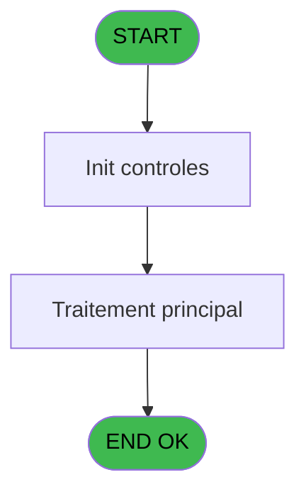
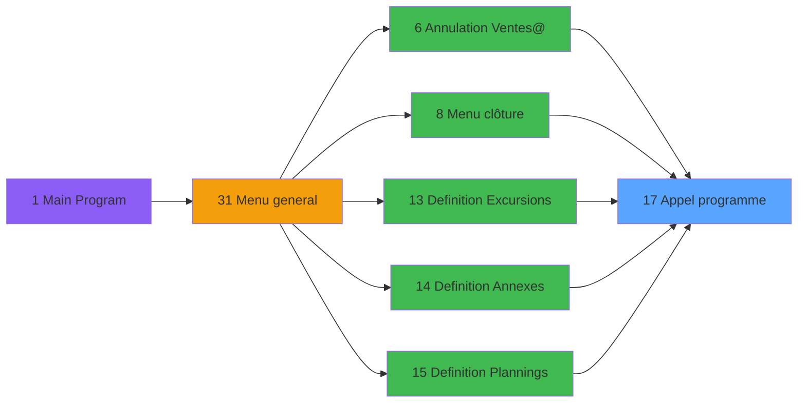

# EXB IDE 17 - Appel programme

> **Analyse**: Phases 1-4 2026-02-03 10:36 -> 10:36 (19s) | Assemblage 10:36
> **Pipeline**: V7.2 Enrichi
> **Structure**: 4 onglets (Resume | Ecrans | Donnees | Connexions)

<!-- TAB:Resume -->

## 1. FICHE D'IDENTITE

| Attribut | Valeur |
|----------|--------|
| Projet | EXB |
| IDE Position | 17 |
| Nom Programme | Appel programme |
| Fichier source | `Prg_17.xml` |
| Domaine metier | General |
| Taches | 1 (0 ecrans visibles) |
| Tables modifiees | 0 |
| Programmes appeles | 0 |

## 2. DESCRIPTION FONCTIONNELLE

**Appel programme** assure la gestion complete de ce processus, accessible depuis [Ventes_Excursions (IDE 40)](EXB-IDE-40.md), [Menu clôture (IDE 8)](EXB-IDE-8.md), [Definition Plannings (IDE 15)](EXB-IDE-15.md), [ Annulation Ventes@ (IDE 6)](EXB-IDE-6.md), [Definition Excursions (IDE 13)](EXB-IDE-13.md), [Definition Annexes (IDE 14)](EXB-IDE-14.md), [Menu editions (IDE 19)](EXB-IDE-19.md), [Liste ventes/N°vente (IDE 20)](EXB-IDE-20.md), [Liste Participant (IDE 23)](EXB-IDE-23.md), [Detail Excursion (IDE 26)](EXB-IDE-26.md), [Menu general (IDE 31)](EXB-IDE-31.md).

Le flux de traitement s'organise en **1 blocs fonctionnels** :

- **Traitement** (1 tache) : traitements metier divers

## 3. BLOCS FONCTIONNELS

### 3.1 Traitement (1 tache)

Traitements internes.

---

#### 17 - Appel programme

**Role** : Traitement : Appel programme.

## 5. REGLES METIER

*(Aucune regle metier identifiee)*

## 6. CONTEXTE

- **Appele par**: [Ventes_Excursions (IDE 40)](EXB-IDE-40.md), [Menu clôture (IDE 8)](EXB-IDE-8.md), [Definition Plannings (IDE 15)](EXB-IDE-15.md), [ Annulation Ventes@ (IDE 6)](EXB-IDE-6.md), [Definition Excursions (IDE 13)](EXB-IDE-13.md), [Definition Annexes (IDE 14)](EXB-IDE-14.md), [Menu editions (IDE 19)](EXB-IDE-19.md), [Liste ventes/N°vente (IDE 20)](EXB-IDE-20.md), [Liste Participant (IDE 23)](EXB-IDE-23.md), [Detail Excursion (IDE 26)](EXB-IDE-26.md), [Menu general (IDE 31)](EXB-IDE-31.md)
- **Appelle**: 0 programmes | **Tables**: 0 (W:0 R:0 L:0) | **Taches**: 1 | **Expressions**: 1

<!-- TAB:Ecrans -->

## 8. ECRANS

*(Programme sans ecran visible)*

## 9. NAVIGATION

### 9.3 Structure hierarchique (1 tache)

| Position | Tache | Type | Dimensions | Bloc |
|----------|-------|------|------------|------|
| **17.1** | [**Appel programme** (17)](#t1) | MDI | - | Traitement |

### 9.4 Algorigramme

> **Legende**: Vert = START/END OK | Rouge = END KO | Bleu = Decisions
> *Algorigramme auto-genere. Utiliser `/algorigramme` pour une synthese metier detaillee.*

<!-- TAB:Donnees -->

## 10. TABLES

### Tables utilisees (0)

| ID | Nom | Description | Type | R | W | L | Usages |
|----|-----|-------------|------|---|---|---|--------|

### Colonnes par table (0 / 0 tables avec colonnes identifiees)

## 11. VARIABLES

*(Programme sans variables locales mappees)*

## 12. EXPRESSIONS

**1 / 1 expressions decodees (100%)**

### 12.1 Repartition par type

| Type | Expressions | Regles |
|------|-------------|--------|
| OTHER | 1 | 0 |

### 12.2 Expressions cles par type

#### OTHER (1 expressions)

| Type | IDE | Expression | Regle |
|------|-----|------------|-------|
| OTHER | 1 | `LastClicked ()` | - |

<!-- TAB:Connexions -->

## 13. GRAPHE D'APPELS

### 13.1 Chaine depuis Main (Callers)

Main -> ... -> [Ventes_Excursions (IDE 40)](EXB-IDE-40.md) -> **Appel programme (IDE 17)**

Main -> ... -> [Menu clôture (IDE 8)](EXB-IDE-8.md) -> **Appel programme (IDE 17)**

Main -> ... -> [Definition Plannings (IDE 15)](EXB-IDE-15.md) -> **Appel programme (IDE 17)**

Main -> ... -> [ Annulation Ventes@ (IDE 6)](EXB-IDE-6.md) -> **Appel programme (IDE 17)**

Main -> ... -> [Definition Excursions (IDE 13)](EXB-IDE-13.md) -> **Appel programme (IDE 17)**

Main -> ... -> [Definition Annexes (IDE 14)](EXB-IDE-14.md) -> **Appel programme (IDE 17)**

Main -> ... -> [Menu editions (IDE 19)](EXB-IDE-19.md) -> **Appel programme (IDE 17)**

Main -> ... -> [Liste ventes/N°vente (IDE 20)](EXB-IDE-20.md) -> **Appel programme (IDE 17)**

Main -> ... -> [Liste Participant (IDE 23)](EXB-IDE-23.md) -> **Appel programme (IDE 17)**

Main -> ... -> [Detail Excursion (IDE 26)](EXB-IDE-26.md) -> **Appel programme (IDE 17)**

Main -> ... -> [Menu general (IDE 31)](EXB-IDE-31.md) -> **Appel programme (IDE 17)**

### 13.2 Callers

| IDE | Nom Programme | Nb Appels |
|-----|---------------|-----------|
| [40](EXB-IDE-40.md) | Ventes_Excursions | 4 |
| [8](EXB-IDE-8.md) | Menu clôture | 2 |
| [15](EXB-IDE-15.md) | Definition Plannings | 2 |
| [6](EXB-IDE-6.md) |  Annulation Ventes@ | 1 |
| [13](EXB-IDE-13.md) | Definition Excursions | 1 |
| [14](EXB-IDE-14.md) | Definition Annexes | 1 |
| [19](EXB-IDE-19.md) | Menu editions | 1 |
| [20](EXB-IDE-20.md) | Liste ventes/N°vente | 1 |
| [23](EXB-IDE-23.md) | Liste Participant | 1 |
| [26](EXB-IDE-26.md) | Detail Excursion | 1 |
| [31](EXB-IDE-31.md) | Menu general | 1 |

### 13.3 Callees (programmes appeles)

### 13.4 Detail Callees avec contexte

| IDE | Nom Programme | Appels | Contexte |
|-----|---------------|--------|----------|
| - | (aucun) | - | - |

## 14. RECOMMANDATIONS MIGRATION

### 14.1 Profil du programme

| Metrique | Valeur | Impact migration |
|----------|--------|-----------------|
| Lignes de logique | 4 | Programme compact |
| Expressions | 1 | Peu de logique |
| Tables WRITE | 0 | Impact faible |
| Sous-programmes | 0 | Peu de dependances |
| Ecrans visibles | 0 | Ecran unique ou traitement batch |
| Code desactive | 0% (0 / 4) | Code sain |
| Regles metier | 0 | Pas de regle identifiee |

### 14.2 Plan de migration par bloc

#### Traitement (1 tache: 0 ecran, 1 traitement)

- **Strategie** : 1 service(s) backend injectable(s) (Domain Services).
- Decomposer les taches en services unitaires testables.

### 14.3 Dependances critiques

| Dependance | Type | Appels | Impact |
|------------|------|--------|--------|

---
*Spec DETAILED generee par Pipeline V7.2 - 2026-02-03 10:36*
