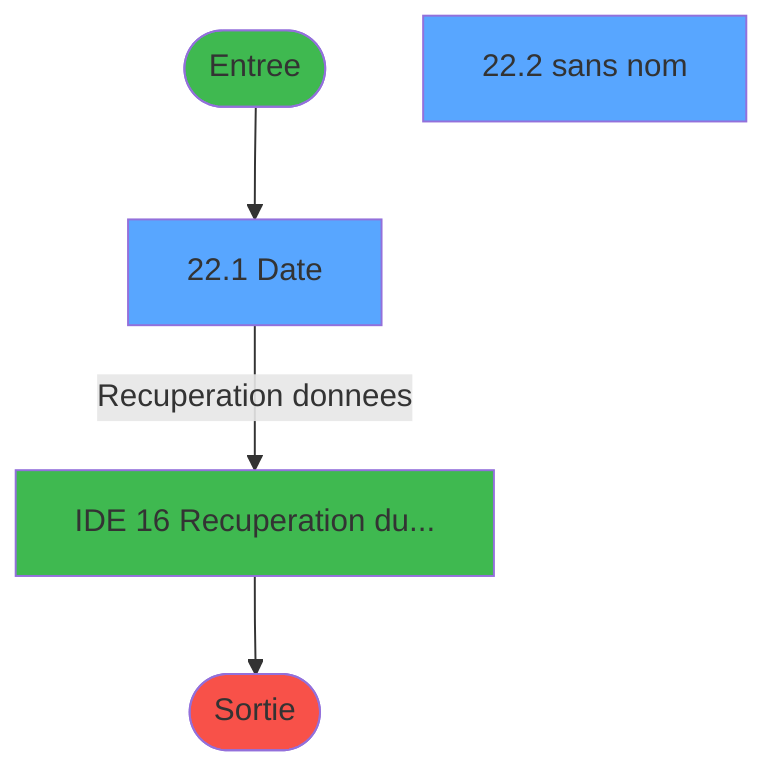
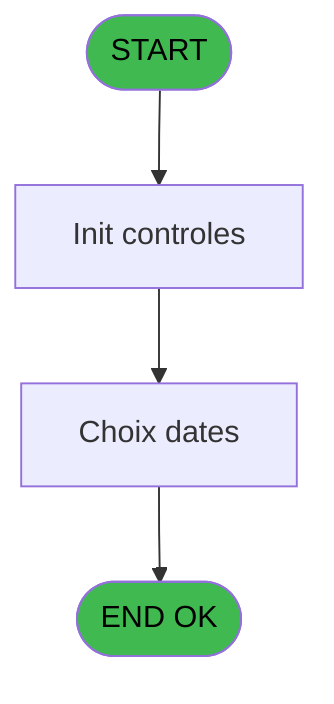
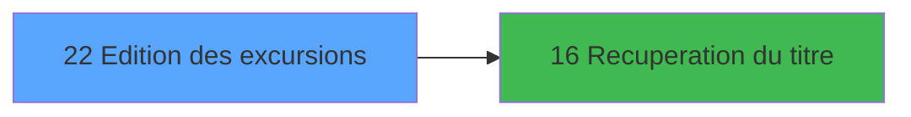

# EXB IDE 22 - Edition des excursions

> **Analyse**: Phases 1-4 2026-02-03 10:38 -> 10:39 (17s) | Assemblage 10:39
> **Pipeline**: V7.2 Enrichi
> **Structure**: 4 onglets (Resume | Ecrans | Donnees | Connexions)

<!-- TAB:Resume -->

## 1. FICHE D'IDENTITE

| Attribut | Valeur |
|----------|--------|
| Projet | EXB |
| IDE Position | 22 |
| Nom Programme | Edition des excursions |
| Fichier source | `Prg_22.xml` |
| Domaine metier | Impression |
| Taches | 3 (2 ecrans visibles) |
| Tables modifiees | 0 |
| Programmes appeles | 1 |

## 2. DESCRIPTION FONCTIONNELLE

**Edition des excursions** assure la gestion complete de ce processus, accessible depuis [Menu editions (IDE 19)](EXB-IDE-19.md).

Le flux de traitement s'organise en **2 blocs fonctionnels** :

- **Traitement** (2 taches) : traitements metier divers
- **Impression** (1 tache) : generation de tickets et documents

Detail : phases du traitement

#### Phase 1 : Impression (1 tache)

- **22** - Edition des excursions **[[ECRAN]](#ecran-t1)**

#### Phase 2 : Traitement (2 taches)

- **22.1** - Date **[[ECRAN]](#ecran-t2)**
- **22.2** - (sans nom) **[[ECRAN]](#ecran-t3)**

Delegue a : [Recuperation du titre (IDE 16)](EXB-IDE-16.md)

## 3. BLOCS FONCTIONNELS

### 3.1 Impression (1 tache)

Generation des documents et tickets.

---

#### 22 - Edition des excursions [[ECRAN]](#ecran-t1)

**Role** : Generation du document : Edition des excursions.
**Ecran** : 709 x 273 DLU (MDI) | [Voir mockup](#ecran-t1)

### 3.2 Traitement (2 taches)

Traitements internes.

---

#### 22.1 - Date [[ECRAN]](#ecran-t2)

**Role** : Traitement : Date.
**Ecran** : 595 x 145 DLU (MDI) | [Voir mockup](#ecran-t2)
**Variables liees** : C (W0 date debut), D (W0 date fin), E (W0 type de date), F (W1 type de date)
**Delegue a** : [Recuperation du titre (IDE 16)](EXB-IDE-16.md)

---

#### 22.2 - (sans nom) [[ECRAN]](#ecran-t3)

**Role** : Traitement interne.
**Ecran** : 426 x 57 DLU (MDI) | [Voir mockup](#ecran-t3)
**Delegue a** : [Recuperation du titre (IDE 16)](EXB-IDE-16.md)

## 5. REGLES METIER

*(Aucune regle metier identifiee)*

## 6. CONTEXTE

- **Appele par**: [Menu editions (IDE 19)](EXB-IDE-19.md)
- **Appelle**: 1 programmes | **Tables**: 2 (W:0 R:1 L:1) | **Taches**: 3 | **Expressions**: 1

<!-- TAB:Ecrans -->

## 8. ECRANS

### 8.1 Forms visibles (2 / 3)

| # | Position | Tache | Nom | Type | Largeur | Hauteur | Bloc |
|---|----------|-------|-----|------|---------|---------|------|
| 1 | 22.1 | 22.1 | Date | MDI | 595 | 145 | Traitement |
| 2 | 22.2 | 22.2 | (sans nom) | MDI | 426 | 57 | Traitement |

### 8.2 Mockups Ecrans

---

#### 22.1 - Date
**Tache** : [22.1](#t2) | **Type** : MDI | **Dimensions** : 595 x 145 DLU
**Bloc** : Traitement | **Titre IDE** : Date

<!-- FORM-DATA:
{
    "width":  595,
    "vFactor":  8,
    "type":  "MDI",
    "hFactor":  8,
    "controls":  [
                     {
                         "x":  0,
                         "type":  "label",
                         "var":  "",
                         "y":  2,
                         "w":  586,
                         "fmt":  "",
                         "name":  "",
                         "h":  17,
                         "color":  "",
                         "text":  "",
                         "parent":  null
                     },
                     {
                         "x":  186,
                         "type":  "label",
                         "var":  "",
                         "y":  28,
                         "w":  345,
                         "fmt":  "",
                         "name":  "",
                         "h":  83,
                         "color":  "",
                         "text":  "",
                         "parent":  null
                     },
                     {
                         "x":  210,
                         "type":  "label",
                         "var":  "",
                         "y":  46,
                         "w":  136,
                         "fmt":  "",
                         "name":  "",
                         "h":  10,
                         "color":  "",
                         "text":  "Date debut",
                         "parent":  4
                     },
                     {
                         "x":  210,
                         "type":  "label",
                         "var":  "",
                         "y":  66,
                         "w":  136,
                         "fmt":  "",
                         "name":  "",
                         "h":  10,
                         "color":  "",
                         "text":  "Date fin",
                         "parent":  4
                     },
                     {
                         "x":  210,
                         "type":  "label",
                         "var":  "",
                         "y":  90,
                         "w":  136,
                         "fmt":  "",
                         "name":  "",
                         "h":  10,
                         "color":  "",
                         "text":  "Type Date",
                         "parent":  4
                     },
                     {
                         "x":  2,
                         "type":  "label",
                         "var":  "",
                         "y":  123,
                         "w":  588,
                         "fmt":  "",
                         "name":  "",
                         "h":  20,
                         "color":  "",
                         "text":  "",
                         "parent":  null
                     },
                     {
                         "x":  349,
                         "type":  "edit",
                         "var":  "",
                         "y":  46,
                         "w":  126,
                         "fmt":  "DD/MM/YYYYA",
                         "name":  "W1 date debut",
                         "h":  10,
                         "color":  "6",
                         "text":  "",
                         "parent":  4
                     },
                     {
                         "x":  478,
                         "type":  "button",
                         "var":  "",
                         "y":  46,
                         "w":  27,
                         "fmt":  "...",
                         "name":  "b_zoom_Datedebut",
                         "h":  10,
                         "color":  "",
                         "text":  "",
                         "parent":  null
                     },
                     {
                         "x":  349,
                         "type":  "edit",
                         "var":  "",
                         "y":  66,
                         "w":  126,
                         "fmt":  "DD/MM/YYYYA",
                         "name":  "W1 date fin",
                         "h":  10,
                         "color":  "6",
                         "text":  "",
                         "parent":  4
                     },
                     {
                         "x":  478,
                         "type":  "button",
                         "var":  "",
                         "y":  66,
                         "w":  27,
                         "fmt":  "...",
                         "name":  "b_zoom_Datefin",
                         "h":  10,
                         "color":  "",
                         "text":  "",
                         "parent":  null
                     },
                     {
                         "x":  349,
                         "type":  "combobox",
                         "var":  "",
                         "y":  88,
                         "w":  126,
                         "fmt":  "",
                         "name":  "W1 type de date",
                         "h":  12,
                         "color":  "",
                         "text":  "",
                         "parent":  4
                     },
                     {
                         "x":  7,
                         "type":  "button",
                         "var":  "",
                         "y":  124,
                         "w":  154,
                         "fmt":  "\u0026Ok",
                         "name":  "btn ok",
                         "h":  18,
                         "color":  "",
                         "text":  "",
                         "parent":  null
                     },
                     {
                         "x":  3,
                         "type":  "edit",
                         "var":  "",
                         "y":  6,
                         "w":  267,
                         "fmt":  "20",
                         "name":  "",
                         "h":  8,
                         "color":  "",
                         "text":  "",
                         "parent":  null
                     },
                     {
                         "x":  372,
                         "type":  "edit",
                         "var":  "",
                         "y":  6,
                         "w":  203,
                         "fmt":  "WWW DD MMM YYYYT",
                         "name":  "",
                         "h":  8,
                         "color":  "",
                         "text":  "",
                         "parent":  null
                     },
                     {
                         "x":  38,
                         "type":  "image",
                         "var":  "",
                         "y":  39,
                         "w":  144,
                         "fmt":  "",
                         "name":  "",
                         "h":  53,
                         "color":  "",
                         "text":  "",
                         "parent":  null
                     },
                     {
                         "x":  166,
                         "type":  "button",
                         "var":  "",
                         "y":  124,
                         "w":  154,
                         "fmt":  "A\u0026bandonner",
                         "name":  "",
                         "h":  18,
                         "color":  "",
                         "text":  "",
                         "parent":  null
                     }
                 ],
    "taskId":  "22.1",
    "height":  145
}
-->

<strong>Champs : 5 champs</strong>

| Pos (x,y) | Nom | Variable | Type |
|-----------|-----|----------|------|
| 349,46 | W1 date debut | - | edit |
| 349,66 | W1 date fin | - | edit |
| 349,88 | W1 type de date | - | combobox |
| 3,6 | 20 | - | edit |
| 372,6 | WWW DD MMM YYYYT | - | edit |

<strong>Boutons : 4 boutons</strong>

| Bouton | Pos (x,y) | Action |
|--------|-----------|--------|
| ... | 478,46 | Bouton fonctionnel |
| ... | 478,66 | Bouton fonctionnel |
| Ok | 7,124 | Valide la saisie et enregistre |
| Abandonner | 166,124 | Annule et retour au menu |

---

#### 22.2 - (sans nom)
**Tache** : [22.2](#t3) | **Type** : MDI | **Dimensions** : 426 x 57 DLU
**Bloc** : Traitement | **Titre IDE** : (sans nom)

<!-- FORM-DATA:
{
    "width":  426,
    "vFactor":  8,
    "type":  "MDI",
    "hFactor":  8,
    "controls":  [
                     {
                         "x":  0,
                         "type":  "label",
                         "var":  "",
                         "y":  0,
                         "w":  423,
                         "fmt":  "",
                         "name":  "",
                         "h":  29,
                         "color":  "",
                         "text":  "",
                         "parent":  null
                     },
                     {
                         "x":  120,
                         "type":  "label",
                         "var":  "",
                         "y":  10,
                         "w":  221,
                         "fmt":  "",
                         "name":  "",
                         "h":  8,
                         "color":  "7",
                         "text":  "Impression en cours ...",
                         "parent":  null
                     },
                     {
                         "x":  0,
                         "type":  "label",
                         "var":  "",
                         "y":  29,
                         "w":  423,
                         "fmt":  "",
                         "name":  "",
                         "h":  27,
                         "color":  "",
                         "text":  "",
                         "parent":  null
                     },
                     {
                         "x":  72,
                         "type":  "label",
                         "var":  "",
                         "y":  38,
                         "w":  280,
                         "fmt":  "",
                         "name":  "",
                         "h":  8,
                         "color":  "",
                         "text":  "Edition des Excursions",
                         "parent":  null
                     },
                     {
                         "x":  4,
                         "type":  "image",
                         "var":  "",
                         "y":  2,
                         "w":  72,
                         "fmt":  "",
                         "name":  "",
                         "h":  25,
                         "color":  "",
                         "text":  "",
                         "parent":  null
                     }
                 ],
    "taskId":  "22.2",
    "height":  57
}
-->

## 9. NAVIGATION

### 9.1 Enchainement des ecrans

**Detail par enchainement :**

| Depuis | Action | Vers | Retour |
|--------|--------|------|--------|
| Date | Recuperation donnees | [Recuperation du titre (IDE 16)](EXB-IDE-16.md) | Retour ecran |

### 9.3 Structure hierarchique (3 taches)

| Position | Tache | Type | Dimensions | Bloc |
|----------|-------|------|------------|------|
| **22.1** | [**Edition des excursions** (22)](#t1) [mockup](#ecran-t1) | MDI | 709x273 | Impression |
| **22.2** | [**Date** (22.1)](#t2) [mockup](#ecran-t2) | MDI | 595x145 | Traitement |
| 22.2.1 | [(sans nom) (22.2)](#t3) [mockup](#ecran-t3) | MDI | 426x57 | |

### 9.4 Algorigramme

> **Legende**: Vert = START/END OK | Rouge = END KO | Bleu = Decisions
> *Algorigramme auto-genere. Utiliser `/algorigramme` pour une synthese metier detaillee.*

<!-- TAB:Donnees -->

## 10. TABLES

### Tables utilisees (2)

| ID | Nom | Description | Type | R | W | L | Usages |
|----|-----|-------------|------|---|---|---|--------|
| 300 | excursions_______exc |  | DB | R |   |   | 1 |
| 309 | vente____________vep | Donnees de ventes | DB |   |   | L | 1 |

### Colonnes par table (1 / 1 tables avec colonnes identifiees)

Table 300 - excursions_______exc (R) - 1 usages

| Lettre | Variable | Acces | Type |
|--------|----------|-------|------|
| A | W1 total | R | Numeric |
| B | W1 total parcours | R | Numeric |
| C | Total Excursion | R | Numeric |
| D | Total Periode | R | Numeric |

## 11. VARIABLES

### 11.1 Parametres entrants (2)

Variables recues du programme appelant ([Menu editions (IDE 19)](EXB-IDE-19.md)).

| Lettre | Nom | Type | Usage dans |
|--------|-----|------|-----------|
| A | P0 nom village | Alpha | - |
| B | P0 masque montant | Alpha | - |

### 11.2 Variables de session (1)

Variables persistantes pendant toute la session.

| Lettre | Nom | Type | Usage dans |
|--------|-----|------|-----------|
| H | v. titre rech | Alpha | - |

### 11.3 Variables de travail (3)

Variables internes au programme.

| Lettre | Nom | Type | Usage dans |
|--------|-----|------|-----------|
| C | W0 date debut | Date | [22.1](#t2) |
| D | W0 date fin | Date | - |
| E | W0 type de date | Alpha | - |

### 11.4 Autres (2)

Variables diverses.

| Lettre | Nom | Type | Usage dans |
|--------|-----|------|-----------|
| F | W1 type de date | Alpha | - |
| G | btn ok | Alpha | - |

## 12. EXPRESSIONS

**1 / 1 expressions decodees (100%)**

### 12.1 Repartition par type

| Type | Expressions | Regles |
|------|-------------|--------|
| CONDITION | 1 | 0 |

### 12.2 Expressions cles par type

#### CONDITION (1 expressions)

| Type | IDE | Expression | Regle |
|------|-----|------------|-------|
| CONDITION | 1 | `W0 date debut [C]<>0` | - |

<!-- TAB:Connexions -->

## 13. GRAPHE D'APPELS

### 13.1 Chaine depuis Main (Callers)

Main -> ... -> [Menu editions (IDE 19)](EXB-IDE-19.md) -> **Edition des excursions (IDE 22)**

### 13.2 Callers

| IDE | Nom Programme | Nb Appels |
|-----|---------------|-----------|
| [19](EXB-IDE-19.md) | Menu editions | 1 |

### 13.3 Callees (programmes appeles)

### 13.4 Detail Callees avec contexte

| IDE | Nom Programme | Appels | Contexte |
|-----|---------------|--------|----------|
| [16](EXB-IDE-16.md) | Recuperation du titre | 1 | Recuperation donnees |

## 14. RECOMMANDATIONS MIGRATION

### 14.1 Profil du programme

| Metrique | Valeur | Impact migration |
|----------|--------|-----------------|
| Lignes de logique | 74 | Programme compact |
| Expressions | 1 | Peu de logique |
| Tables WRITE | 0 | Impact faible |
| Sous-programmes | 1 | Peu de dependances |
| Ecrans visibles | 2 | Quelques ecrans |
| Code desactive | 0% (0 / 74) | Code sain |
| Regles metier | 0 | Pas de regle identifiee |

### 14.2 Plan de migration par bloc

#### Impression (1 tache: 1 ecran, 0 traitement)

- **Strategie** : Templates HTML -> PDF via wkhtmltopdf ou Puppeteer.
- `PrintService` injectable avec choix imprimante

#### Traitement (2 taches: 2 ecrans, 0 traitement)

- **Strategie** : 2 composant(s) UI (Razor/React) avec formulaires et validation.
- 1 sous-programme(s) a migrer ou a reutiliser depuis les services existants.
- Decomposer les taches en services unitaires testables.

### 14.3 Dependances critiques

| Dependance | Type | Appels | Impact |
|------------|------|--------|--------|
| [Recuperation du titre (IDE 16)](EXB-IDE-16.md) | Sous-programme | 1x | Normale - Recuperation donnees |

---
*Spec DETAILED generee par Pipeline V7.2 - 2026-02-03 10:39*
