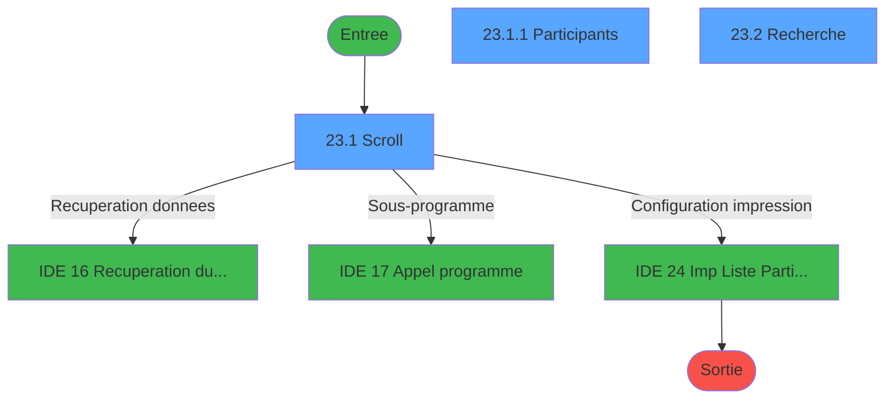
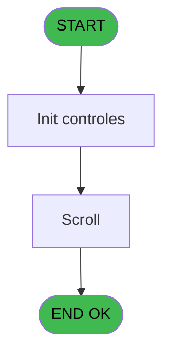
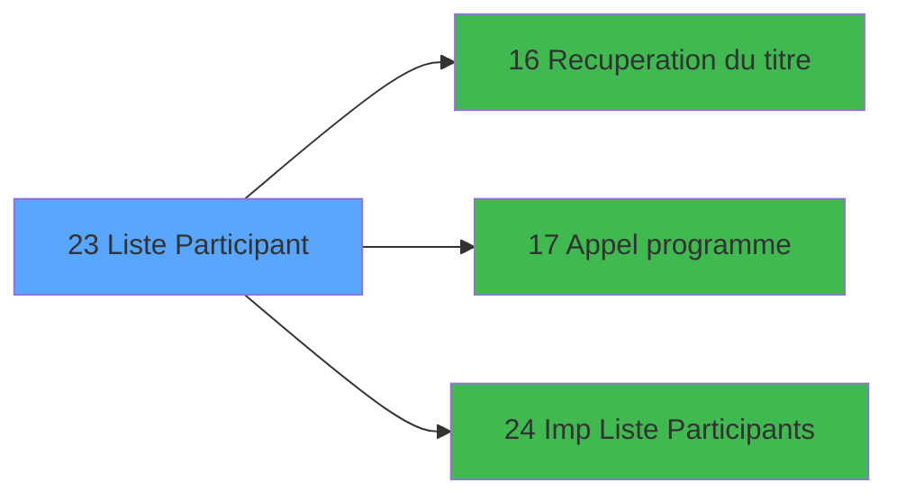

# EXB IDE 23 - Liste Participant

> **Analyse**: Phases 1-4 2026-02-03 10:39 -> 10:39 (16s) | Assemblage 10:39
> **Pipeline**: V7.2 Enrichi
> **Structure**: 4 onglets (Resume | Ecrans | Donnees | Connexions)

<!-- TAB:Resume -->

## 1. FICHE D'IDENTITE

| Attribut | Valeur |
|----------|--------|
| Projet | EXB |
| IDE Position | 23 |
| Nom Programme | Liste Participant |
| Fichier source | `Prg_23.xml` |
| Domaine metier | General |
| Taches | 5 (3 ecrans visibles) |
| Tables modifiees | 0 |
| Programmes appeles | 3 |

## 2. DESCRIPTION FONCTIONNELLE

**Liste Participant** assure la gestion complete de ce processus, accessible depuis [Menu editions (IDE 19)](EXB-IDE-19.md).

Le flux de traitement s'organise en **3 blocs fonctionnels** :

- **Traitement** (3 taches) : traitements metier divers
- **Consultation** (1 tache) : ecrans de recherche, selection et consultation
- **Saisie** (1 tache) : ecrans de saisie utilisateur (formulaires, champs, donnees)

Detail : phases du traitement

#### Phase 1 : Saisie (1 tache)

- **23** - Ventes **[[ECRAN]](#ecran-t1)**

#### Phase 2 : Traitement (3 taches)

- **23.1** - Scroll **[[ECRAN]](#ecran-t2)**
- **23.1.1** - Participants **[[ECRAN]](#ecran-t3)**
- **23.3** - (sans nom) **[[ECRAN]](#ecran-t5)**

Delegue a : [Recuperation du titre (IDE 16)](EXB-IDE-16.md), [Appel programme (IDE 17)](EXB-IDE-17.md), [   Imp Liste Participants (IDE 24)](EXB-IDE-24.md)

#### Phase 3 : Consultation (1 tache)

- **23.2** - Recherche **[[ECRAN]](#ecran-t4)**

Delegue a : [Recuperation du titre (IDE 16)](EXB-IDE-16.md)

## 3. BLOCS FONCTIONNELS

### 3.1 Saisie (1 tache)

L'operateur saisit les donnees de la transaction via 1 ecran (Ventes).

---

#### 23 - Ventes [[ECRAN]](#ecran-t1)

**Role** : Saisie des donnees : Ventes.
**Ecran** : 166 x 18 DLU (MDI) | [Voir mockup](#ecran-t1)

### 3.2 Traitement (3 taches)

Traitements internes.

---

#### 23.1 - Scroll [[ECRAN]](#ecran-t2)

**Role** : Traitement : Scroll.
**Ecran** : 1126 x 239 DLU (MDI) | [Voir mockup](#ecran-t2)
**Delegue a** : [Recuperation du titre (IDE 16)](EXB-IDE-16.md), [Appel programme (IDE 17)](EXB-IDE-17.md), [   Imp Liste Participants (IDE 24)](EXB-IDE-24.md)

---

#### 23.1.1 - Participants [[ECRAN]](#ecran-t3)

**Role** : Traitement : Participants.
**Ecran** : 566 x 231 DLU (MDI) | [Voir mockup](#ecran-t3)
**Delegue a** : [Recuperation du titre (IDE 16)](EXB-IDE-16.md), [Appel programme (IDE 17)](EXB-IDE-17.md), [   Imp Liste Participants (IDE 24)](EXB-IDE-24.md)

---

#### 23.3 - (sans nom) [[ECRAN]](#ecran-t5)

**Role** : Traitement interne.
**Ecran** : 100 x 24 DLU (MDI) | [Voir mockup](#ecran-t5)
**Delegue a** : [Recuperation du titre (IDE 16)](EXB-IDE-16.md), [Appel programme (IDE 17)](EXB-IDE-17.md), [   Imp Liste Participants (IDE 24)](EXB-IDE-24.md)

### 3.3 Consultation (1 tache)

Ecrans de recherche et consultation.

---

#### 23.2 - Recherche [[ECRAN]](#ecran-t4)

**Role** : Traitement : Recherche.
**Ecran** : 574 x 137 DLU (MDI) | [Voir mockup](#ecran-t4)

## 5. REGLES METIER

*(Aucune regle metier identifiee)*

## 6. CONTEXTE

- **Appele par**: [Menu editions (IDE 19)](EXB-IDE-19.md)
- **Appelle**: 3 programmes | **Tables**: 3 (W:0 R:2 L:1) | **Taches**: 5 | **Expressions**: 4

<!-- TAB:Ecrans -->

## 8. ECRANS

### 8.1 Forms visibles (3 / 5)

| # | Position | Tache | Nom | Type | Largeur | Hauteur | Bloc |
|---|----------|-------|-----|------|---------|---------|------|
| 1 | 23.1 | 23.1 | Scroll | MDI | 1126 | 239 | Traitement |
| 2 | 23.1.1 | 23.1.1 | Participants | MDI | 566 | 231 | Traitement |
| 3 | 23.2 | 23.2 | Recherche | MDI | 574 | 137 | Consultation |

### 8.2 Mockups Ecrans

---

#### 23.1 - Scroll
**Tache** : [23.1](#t2) | **Type** : MDI | **Dimensions** : 1126 x 239 DLU
**Bloc** : Traitement | **Titre IDE** : Scroll

<!-- FORM-DATA:
{
    "width":  1126,
    "vFactor":  8,
    "type":  "MDI",
    "hFactor":  8,
    "controls":  [
                     {
                         "x":  2,
                         "type":  "label",
                         "var":  "",
                         "y":  1,
                         "w":  1118,
                         "fmt":  "",
                         "name":  "",
                         "h":  17,
                         "color":  "",
                         "text":  "",
                         "parent":  null
                     },
                     {
                         "x":  16,
                         "type":  "table",
                         "var":  "",
                         "name":  "",
                         "titleH":  12,
                         "color":  "110",
                         "w":  1078,
                         "y":  24,
                         "fmt":  "",
                         "parent":  null,
                         "text":  "",
                         "rowH":  14,
                         "h":  98,
                         "cols":  [
                                      {
                                          "title":  "Excursion du",
                                          "layer":  1,
                                          "w":  138
                                      },
                                      {
                                          "title":  "Clôture inscription le",
                                          "layer":  2,
                                          "w":  166
                                      },
                                      {
                                          "title":  "A",
                                          "layer":  3,
                                          "w":  85
                                      },
                                      {
                                          "title":  "Description",
                                          "layer":  4,
                                          "w":  251
                                      },
                                      {
                                          "title":  "Vendues",
                                          "layer":  5,
                                          "w":  120
                                      },
                                      {
                                          "title":  "Disponibles",
                                          "layer":  6,
                                          "w":  120
                                      },
                                      {
                                          "title":  "",
                                          "layer":  7,
                                          "w":  167
                                      }
                                  ],
                         "rows":  7
                     },
                     {
                         "x":  212,
                         "type":  "label",
                         "var":  "",
                         "y":  129,
                         "w":  289,
                         "fmt":  "",
                         "name":  "",
                         "h":  76,
                         "color":  "155",
                         "text":  "",
                         "parent":  null
                     },
                     {
                         "x":  237,
                         "type":  "label",
                         "var":  "",
                         "y":  138,
                         "w":  239,
                         "fmt":  "",
                         "name":  "",
                         "h":  41,
                         "color":  "155",
                         "text":  "",
                         "parent":  null
                     },
                     {
                         "x":  240,
                         "type":  "label",
                         "var":  "",
                         "y":  139,
                         "w":  39,
                         "fmt":  "",
                         "name":  "",
                         "h":  39,
                         "color":  "",
                         "text":  "",
                         "parent":  20
                     },
                     {
                         "x":  291,
                         "type":  "label",
                         "var":  "",
                         "y":  145,
                         "w":  165,
                         "fmt":  "",
                         "name":  "",
                         "h":  9,
                         "color":  "142",
                         "text":  "Recherche",
                         "parent":  20
                     },
                     {
                         "x":  291,
                         "type":  "label",
                         "var":  "",
                         "y":  163,
                         "w":  176,
                         "fmt":  "",
                         "name":  "",
                         "h":  9,
                         "color":  "142",
                         "text":  "Editions",
                         "parent":  20
                     },
                     {
                         "x":  270,
                         "type":  "label",
                         "var":  "",
                         "y":  186,
                         "w":  120,
                         "fmt":  "",
                         "name":  "",
                         "h":  9,
                         "color":  "",
                         "text":  "Votre choix",
                         "parent":  19
                     },
                     {
                         "x":  0,
                         "type":  "label",
                         "var":  "",
                         "y":  214,
                         "w":  1121,
                         "fmt":  "",
                         "name":  "",
                         "h":  22,
                         "color":  "",
                         "text":  "",
                         "parent":  null
                     },
                     {
                         "x":  22,
                         "type":  "edit",
                         "var":  "",
                         "y":  41,
                         "w":  120,
                         "fmt":  "",
                         "name":  "",
                         "h":  8,
                         "color":  "110",
                         "text":  "",
                         "parent":  4
                     },
                     {
                         "x":  170,
                         "type":  "edit",
                         "var":  "",
                         "y":  41,
                         "w":  120,
                         "fmt":  "",
                         "name":  "",
                         "h":  8,
                         "color":  "110",
                         "text":  "",
                         "parent":  4
                     },
                     {
                         "x":  330,
                         "type":  "edit",
                         "var":  "",
                         "y":  41,
                         "w":  64,
                         "fmt":  "HH:MM",
                         "name":  "",
                         "h":  8,
                         "color":  "110",
                         "text":  "",
                         "parent":  4
                     },
                     {
                         "x":  669,
                         "type":  "edit",
                         "var":  "",
                         "y":  41,
                         "w":  53,
                         "fmt":  "",
                         "name":  "",
                         "h":  8,
                         "color":  "110",
                         "text":  "",
                         "parent":  4
                     },
                     {
                         "x":  789,
                         "type":  "edit",
                         "var":  "",
                         "y":  41,
                         "w":  53,
                         "fmt":  "",
                         "name":  "",
                         "h":  8,
                         "color":  "110",
                         "text":  "",
                         "parent":  4
                     },
                     {
                         "x":  416,
                         "type":  "edit",
                         "var":  "",
                         "y":  41,
                         "w":  232,
                         "fmt":  "",
                         "name":  "",
                         "h":  8,
                         "color":  "110",
                         "text":  "",
                         "parent":  4
                     },
                     {
                         "x":  406,
                         "type":  "edit",
                         "var":  "",
                         "y":  186,
                         "w":  26,
                         "fmt":  "",
                         "name":  "",
                         "h":  10,
                         "color":  "6",
                         "text":  "",
                         "parent":  19
                     },
                     {
                         "x":  854,
                         "type":  "edit",
                         "var":  "",
                         "y":  6,
                         "w":  259,
                         "fmt":  "WWW DD MMM YYYYT",
                         "name":  "",
                         "h":  8,
                         "color":  "",
                         "text":  "",
                         "parent":  null
                     },
                     {
                         "x":  899,
                         "type":  "edit",
                         "var":  "",
                         "y":  41,
                         "w":  120,
                         "fmt":  "10",
                         "name":  "",
                         "h":  8,
                         "color":  "110",
                         "text":  "",
                         "parent":  4
                     },
                     {
                         "x":  635,
                         "type":  "image",
                         "var":  "",
                         "y":  140,
                         "w":  187,
                         "fmt":  "",
                         "name":  "",
                         "h":  57,
                         "color":  "155",
                         "text":  "",
                         "parent":  null
                     },
                     {
                         "x":  1027,
                         "type":  "button",
                         "var":  "",
                         "y":  37,
                         "w":  29,
                         "fmt":  "...",
                         "name":  "",
                         "h":  13,
                         "color":  "",
                         "text":  "",
                         "parent":  4
                     },
                     {
                         "x":  247,
                         "type":  "button",
                         "var":  "",
                         "y":  145,
                         "w":  24,
                         "fmt":  "R",
                         "name":  "R",
                         "h":  9,
                         "color":  "",
                         "text":  "",
                         "parent":  null
                     },
                     {
                         "x":  247,
                         "type":  "button",
                         "var":  "",
                         "y":  163,
                         "w":  24,
                         "fmt":  "E",
                         "name":  "E",
                         "h":  9,
                         "color":  "",
                         "text":  "",
                         "parent":  null
                     },
                     {
                         "x":  4,
                         "type":  "button",
                         "var":  "",
                         "y":  216,
                         "w":  154,
                         "fmt":  "\u0026Quitter",
                         "name":  "",
                         "h":  18,
                         "color":  "",
                         "text":  "",
                         "parent":  null
                     },
                     {
                         "x":  5,
                         "type":  "edit",
                         "var":  "",
                         "y":  5,
                         "w":  267,
                         "fmt":  "20",
                         "name":  "",
                         "h":  8,
                         "color":  "",
                         "text":  "",
                         "parent":  null
                     }
                 ],
    "taskId":  "23.1",
    "height":  239
}
-->

<strong>Champs : 10 champs</strong>

| Pos (x,y) | Nom | Variable | Type |
|-----------|-----|----------|------|
| 22,41 | (sans nom) | - | edit |
| 170,41 | (sans nom) | - | edit |
| 330,41 | HH:MM | - | edit |
| 669,41 | (sans nom) | - | edit |
| 789,41 | (sans nom) | - | edit |
| 416,41 | (sans nom) | - | edit |
| 406,186 | (sans nom) | - | edit |
| 854,6 | WWW DD MMM YYYYT | - | edit |
| 899,41 | 10 | - | edit |
| 5,5 | 20 | - | edit |

<strong>Boutons : 4 boutons</strong>

| Bouton | Pos (x,y) | Action |
|--------|-----------|--------|
| ... | 1027,37 | Bouton fonctionnel |
| R | 247,145 | Bouton fonctionnel |
| E | 247,163 | Bouton fonctionnel |
| Quitter | 4,216 | Quitte le programme |

---

#### 23.1.1 - Participants
**Tache** : [23.1.1](#t3) | **Type** : MDI | **Dimensions** : 566 x 231 DLU
**Bloc** : Traitement | **Titre IDE** : Participants

<!-- FORM-DATA:
{
    "width":  566,
    "vFactor":  8,
    "type":  "MDI",
    "hFactor":  8,
    "controls":  [
                     {
                         "x":  0,
                         "type":  "label",
                         "var":  "",
                         "y":  2,
                         "w":  559,
                         "fmt":  "",
                         "name":  "",
                         "h":  19,
                         "color":  "",
                         "text":  "",
                         "parent":  null
                     },
                     {
                         "x":  29,
                         "type":  "label",
                         "var":  "",
                         "y":  28,
                         "w":  82,
                         "fmt":  "",
                         "name":  "",
                         "h":  10,
                         "color":  "",
                         "text":  "Excursion",
                         "parent":  null
                     },
                     {
                         "x":  372,
                         "type":  "label",
                         "var":  "",
                         "y":  28,
                         "w":  27,
                         "fmt":  "",
                         "name":  "",
                         "h":  10,
                         "color":  "",
                         "text":  "du",
                         "parent":  null
                     },
                     {
                         "x":  102,
                         "type":  "table",
                         "var":  "",
                         "name":  "",
                         "titleH":  12,
                         "color":  "110",
                         "w":  362,
                         "y":  44,
                         "fmt":  "",
                         "parent":  null,
                         "text":  "",
                         "rowH":  14,
                         "h":  157,
                         "cols":  [
                                      {
                                          "title":  "Participants",
                                          "layer":  1,
                                          "w":  329
                                      }
                                  ],
                         "rows":  1
                     },
                     {
                         "x":  1,
                         "type":  "label",
                         "var":  "",
                         "y":  206,
                         "w":  559,
                         "fmt":  "",
                         "name":  "",
                         "h":  21,
                         "color":  "",
                         "text":  "",
                         "parent":  null
                     },
                     {
                         "x":  411,
                         "type":  "edit",
                         "var":  "",
                         "y":  28,
                         "w":  126,
                         "fmt":  "",
                         "name":  "",
                         "h":  10,
                         "color":  "",
                         "text":  "",
                         "parent":  null
                     },
                     {
                         "x":  109,
                         "type":  "edit",
                         "var":  "",
                         "y":  58,
                         "w":  176,
                         "fmt":  "",
                         "name":  "",
                         "h":  11,
                         "color":  "110",
                         "text":  "",
                         "parent":  8
                     },
                     {
                         "x":  302,
                         "type":  "edit",
                         "var":  "",
                         "y":  58,
                         "w":  98,
                         "fmt":  "",
                         "name":  "",
                         "h":  11,
                         "color":  "110",
                         "text":  "",
                         "parent":  8
                     },
                     {
                         "x":  340,
                         "type":  "edit",
                         "var":  "",
                         "y":  7,
                         "w":  203,
                         "fmt":  "WWW DD MMM YYYYT",
                         "name":  "",
                         "h":  8,
                         "color":  "",
                         "text":  "",
                         "parent":  1
                     },
                     {
                         "x":  123,
                         "type":  "edit",
                         "var":  "",
                         "y":  28,
                         "w":  238,
                         "fmt":  "",
                         "name":  "",
                         "h":  10,
                         "color":  "",
                         "text":  "",
                         "parent":  null
                     },
                     {
                         "x":  6,
                         "type":  "button",
                         "var":  "",
                         "y":  208,
                         "w":  154,
                         "fmt":  "\u0026Quitter",
                         "name":  "",
                         "h":  18,
                         "color":  "",
                         "text":  "",
                         "parent":  12
                     },
                     {
                         "x":  3,
                         "type":  "edit",
                         "var":  "",
                         "y":  7,
                         "w":  267,
                         "fmt":  "20",
                         "name":  "",
                         "h":  8,
                         "color":  "",
                         "text":  "",
                         "parent":  1
                     }
                 ],
    "taskId":  "23.1.1",
    "height":  231
}
-->

<strong>Champs : 6 champs</strong>

| Pos (x,y) | Nom | Variable | Type |
|-----------|-----|----------|------|
| 411,28 | (sans nom) | - | edit |
| 109,58 | (sans nom) | - | edit |
| 302,58 | (sans nom) | - | edit |
| 340,7 | WWW DD MMM YYYYT | - | edit |
| 123,28 | (sans nom) | - | edit |
| 3,7 | 20 | - | edit |

<strong>Boutons : 1 boutons</strong>

| Bouton | Pos (x,y) | Action |
|--------|-----------|--------|
| Quitter | 6,208 | Quitte le programme |

---

#### 23.2 - Recherche
**Tache** : [23.2](#t4) | **Type** : MDI | **Dimensions** : 574 x 137 DLU
**Bloc** : Consultation | **Titre IDE** : Recherche

<!-- FORM-DATA:
{
    "width":  574,
    "vFactor":  8,
    "type":  "MDI",
    "hFactor":  8,
    "controls":  [
                     {
                         "x":  5,
                         "type":  "label",
                         "var":  "",
                         "y":  2,
                         "w":  565,
                         "fmt":  "",
                         "name":  "",
                         "h":  17,
                         "color":  "",
                         "text":  "",
                         "parent":  null
                     },
                     {
                         "x":  302,
                         "type":  "label",
                         "var":  "",
                         "y":  37,
                         "w":  153,
                         "fmt":  "",
                         "name":  "",
                         "h":  9,
                         "color":  "",
                         "text":  "Entrez la date :",
                         "parent":  null
                     },
                     {
                         "x":  1,
                         "type":  "label",
                         "var":  "",
                         "y":  113,
                         "w":  567,
                         "fmt":  "",
                         "name":  "",
                         "h":  21,
                         "color":  "",
                         "text":  "",
                         "parent":  null
                     },
                     {
                         "x":  306,
                         "type":  "edit",
                         "var":  "",
                         "y":  66,
                         "w":  126,
                         "fmt":  "##/##/####",
                         "name":  "W1 date",
                         "h":  10,
                         "color":  "6",
                         "text":  "",
                         "parent":  null
                     },
                     {
                         "x":  434,
                         "type":  "button",
                         "var":  "",
                         "y":  66,
                         "w":  26,
                         "fmt":  "...",
                         "name":  "b_zoom_Date",
                         "h":  10,
                         "color":  "",
                         "text":  "",
                         "parent":  null
                     },
                     {
                         "x":  7,
                         "type":  "button",
                         "var":  "",
                         "y":  115,
                         "w":  168,
                         "fmt":  "\u0026Ok",
                         "name":  "btn quitter",
                         "h":  18,
                         "color":  "",
                         "text":  "",
                         "parent":  7
                     },
                     {
                         "x":  8,
                         "type":  "edit",
                         "var":  "",
                         "y":  6,
                         "w":  267,
                         "fmt":  "20",
                         "name":  "",
                         "h":  8,
                         "color":  "",
                         "text":  "",
                         "parent":  1
                     },
                     {
                         "x":  359,
                         "type":  "edit",
                         "var":  "",
                         "y":  6,
                         "w":  203,
                         "fmt":  "WWW DD MMM YYYYT",
                         "name":  "",
                         "h":  8,
                         "color":  "",
                         "text":  "",
                         "parent":  1
                     },
                     {
                         "x":  41,
                         "type":  "image",
                         "var":  "",
                         "y":  38,
                         "w":  163,
                         "fmt":  "",
                         "name":  "",
                         "h":  59,
                         "color":  "",
                         "text":  "",
                         "parent":  null
                     }
                 ],
    "taskId":  "23.2",
    "height":  137
}
-->

<strong>Champs : 3 champs</strong>

| Pos (x,y) | Nom | Variable | Type |
|-----------|-----|----------|------|
| 306,66 | W1 date | - | edit |
| 8,6 | 20 | - | edit |
| 359,6 | WWW DD MMM YYYYT | - | edit |

<strong>Boutons : 2 boutons</strong>

| Bouton | Pos (x,y) | Action |
|--------|-----------|--------|
| ... | 434,66 | Bouton fonctionnel |
| Ok | 7,115 | Valide la saisie et enregistre |

## 9. NAVIGATION

### 9.1 Enchainement des ecrans

**Detail par enchainement :**

| Depuis | Action | Vers | Retour |
|--------|--------|------|--------|
| Scroll | Recuperation donnees | [Recuperation du titre (IDE 16)](EXB-IDE-16.md) | Retour ecran |
| Scroll | Sous-programme | [Appel programme (IDE 17)](EXB-IDE-17.md) | Retour ecran |
| Scroll | Configuration impression | [   Imp Liste Participants (IDE 24)](EXB-IDE-24.md) | Retour ecran |

### 9.3 Structure hierarchique (5 taches)

| Position | Tache | Type | Dimensions | Bloc |
|----------|-------|------|------------|------|
| **23.1** | [**Ventes** (23)](#t1) [mockup](#ecran-t1) | MDI | 166x18 | Saisie |
| **23.2** | [**Scroll** (23.1)](#t2) [mockup](#ecran-t2) | MDI | 1126x239 | Traitement |
| 23.2.1 | [Participants (23.1.1)](#t3) [mockup](#ecran-t3) | MDI | 566x231 | |
| 23.2.2 | [(sans nom) (23.3)](#t5) [mockup](#ecran-t5) | MDI | 100x24 | |
| **23.3** | [**Recherche** (23.2)](#t4) [mockup](#ecran-t4) | MDI | 574x137 | Consultation |

### 9.4 Algorigramme

> **Legende**: Vert = START/END OK | Rouge = END KO | Bleu = Decisions
> *Algorigramme auto-genere. Utiliser `/algorigramme` pour une synthese metier detaillee.*

<!-- TAB:Donnees -->

## 10. TABLES

### Tables utilisees (3)

| ID | Nom | Description | Type | R | W | L | Usages |
|----|-----|-------------|------|---|---|---|--------|
| 298 | participants_____par |  | DB | R |   |   | 1 |
| 299 | excurs_planning__epl |  | DB |   |   | L | 1 |
| 300 | excursions_______exc |  | DB | R |   |   | 1 |

### Colonnes par table (3 / 2 tables avec colonnes identifiees)

Table 298 - participants_____par (R) - 1 usages

| Lettre | Variable | Acces | Type |
|--------|----------|-------|------|
| A | W creation | R | Logical |
| B | v. titre | R | Alpha |

Table 300 - excursions_______exc (R) - 1 usages

| Lettre | Variable | Acces | Type |
|--------|----------|-------|------|
| A | W1 choix action | R | Alpha |
| B | v. titre scroll | R | Alpha |
| C | W1 passage | R | Logical |

## 11. VARIABLES

### 11.1 Parametres entrants (2)

Variables recues du programme appelant ([Menu editions (IDE 19)](EXB-IDE-19.md)).

| Lettre | Nom | Type | Usage dans |
|--------|-----|------|-----------|
| A | P0 nom village | Alpha | - |
| B | P0 masque montant | Alpha | - |

### 11.2 Variables de travail (4)

Variables internes au programme.

| Lettre | Nom | Type | Usage dans |
|--------|-----|------|-----------|
| C | W0 choix action | Alpha | 3x calcul interne |
| F | W0 date | Date | - |
| H | W0 voucher ? | Alpha | - |
| I | W0 Option (O/N) | Alpha | - |

### 11.3 Autres (3)

Variables diverses.

| Lettre | Nom | Type | Usage dans |
|--------|-----|------|-----------|
| D | W0_Type | Alpha | - |
| E | W0_Code | Numeric | - |
| G | W0_Excursion | Alpha | - |

## 12. EXPRESSIONS

**4 / 4 expressions decodees (100%)**

### 12.1 Repartition par type

| Type | Expressions | Regles |
|------|-------------|--------|
| DATE | 1 | 0 |
| CONDITION | 3 | 0 |

### 12.2 Expressions cles par type

#### DATE (1 expressions)

| Type | IDE | Expression | Regle |
|------|-----|------------|-------|
| DATE | 1 | `Date ()` | - |

#### CONDITION (3 expressions)

| Type | IDE | Expression | Regle |
|------|-----|------------|-------|
| CONDITION | 4 | `W0 choix action [C]='E'` | - |
| CONDITION | 3 | `W0 choix action [C]='R'` | - |
| CONDITION | 2 | `W0 choix action [C]='F'` | - |

<!-- TAB:Connexions -->

## 13. GRAPHE D'APPELS

### 13.1 Chaine depuis Main (Callers)

Main -> ... -> [Menu editions (IDE 19)](EXB-IDE-19.md) -> **Liste Participant (IDE 23)**

### 13.2 Callers

| IDE | Nom Programme | Nb Appels |
|-----|---------------|-----------|
| [19](EXB-IDE-19.md) | Menu editions | 1 |

### 13.3 Callees (programmes appeles)

### 13.4 Detail Callees avec contexte

| IDE | Nom Programme | Appels | Contexte |
|-----|---------------|--------|----------|
| [16](EXB-IDE-16.md) | Recuperation du titre | 3 | Recuperation donnees |
| [17](EXB-IDE-17.md) | Appel programme | 1 | Sous-programme |
| [24](EXB-IDE-24.md) |    Imp Liste Participants | 1 | Configuration impression |

## 14. RECOMMANDATIONS MIGRATION

### 14.1 Profil du programme

| Metrique | Valeur | Impact migration |
|----------|--------|-----------------|
| Lignes de logique | 99 | Programme compact |
| Expressions | 4 | Peu de logique |
| Tables WRITE | 0 | Impact faible |
| Sous-programmes | 3 | Peu de dependances |
| Ecrans visibles | 3 | Quelques ecrans |
| Code desactive | 0% (0 / 99) | Code sain |
| Regles metier | 0 | Pas de regle identifiee |

### 14.2 Plan de migration par bloc

#### Saisie (1 tache: 1 ecran, 0 traitement)

- **Strategie** : Formulaire React/Blazor avec validation Zod/FluentValidation.
- Reproduire 1 ecran : Ventes
- Validation temps reel cote client + serveur

#### Traitement (3 taches: 3 ecrans, 0 traitement)

- **Strategie** : 3 composant(s) UI (Razor/React) avec formulaires et validation.
- 3 sous-programme(s) a migrer ou a reutiliser depuis les services existants.
- Decomposer les taches en services unitaires testables.

#### Consultation (1 tache: 1 ecran, 0 traitement)

- **Strategie** : Composants de recherche/selection en modales.
- 1 ecran : Recherche

### 14.3 Dependances critiques

| Dependance | Type | Appels | Impact |
|------------|------|--------|--------|
| [Recuperation du titre (IDE 16)](EXB-IDE-16.md) | Sous-programme | 3x | **CRITIQUE** - Recuperation donnees |
| [   Imp Liste Participants (IDE 24)](EXB-IDE-24.md) | Sous-programme | 1x | Normale - Configuration impression |
| [Appel programme (IDE 17)](EXB-IDE-17.md) | Sous-programme | 1x | Normale - Sous-programme |

---
*Spec DETAILED generee par Pipeline V7.2 - 2026-02-03 10:39*
