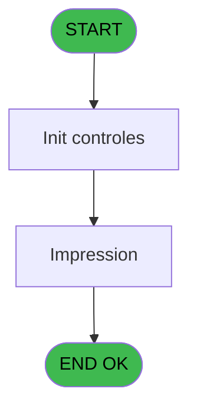

# EXB IDE 25 - Ventes saison

> **Analyse**: Phases 1-4 2026-02-03 10:39 -> 10:40 (17s) | Assemblage 10:40
> **Pipeline**: V7.2 Enrichi
> **Structure**: 4 onglets (Resume | Ecrans | Donnees | Connexions)

<!-- TAB:Resume -->

## 1. FICHE D'IDENTITE

| Attribut | Valeur |
|----------|--------|
| Projet | EXB |
| IDE Position | 25 |
| Nom Programme | Ventes saison |
| Fichier source | `Prg_25.xml` |
| Domaine metier | Ventes |
| Taches | 2 (1 ecrans visibles) |
| Tables modifiees | 0 |
| Programmes appeles | 0 |

## 2. DESCRIPTION FONCTIONNELLE

**Ventes saison** assure la gestion complete de ce processus, accessible depuis [Menu editions (IDE 19)](EXB-IDE-19.md).

Le flux de traitement s'organise en **1 blocs fonctionnels** :

- **Traitement** (2 taches) : traitements metier divers

**Logique metier** : 1 regles identifiees couvrant conditions metier.

## 3. BLOCS FONCTIONNELS

### 3.1 Traitement (2 taches)

Traitements internes.

---

#### 25 - Veuillez patienter... [[ECRAN]](#ecran-t1)

**Role** : Traitement : Veuillez patienter....
**Ecran** : 427 x 59 DLU (MDI) | [Voir mockup](#ecran-t1)

---

#### 25.1 - (sans nom) [[ECRAN]](#ecran-t2)

**Role** : Traitement interne.
**Ecran** : 422 x 56 DLU (MDI) | [Voir mockup](#ecran-t2)

## 5. REGLES METIER

1 regles identifiees:

### Autres (1 regles)

#### [RM-001] Si P0 nom village [A]='1' alors 'Excursions' sinon '??')

| Element | Detail |
|---------|--------|
| **Condition** | `P0 nom village [A]='1'` |
| **Si vrai** | 'Excursions' |
| **Si faux** | '??') |
| **Variables** | A (P0 nom village) |
| **Expression source** | Expression 6 : `IF (P0 nom village [A]='1','Excursions','??')` |
| **Exemple** | Si P0 nom village [A]='1' → 'Excursions'. Sinon → '??') |

## 6. CONTEXTE

- **Appele par**: [Menu editions (IDE 19)](EXB-IDE-19.md)
- **Appelle**: 0 programmes | **Tables**: 1 (W:0 R:1 L:0) | **Taches**: 2 | **Expressions**: 8

<!-- TAB:Ecrans -->

## 8. ECRANS

### 8.1 Forms visibles (1 / 2)

| # | Position | Tache | Nom | Type | Largeur | Hauteur | Bloc |
|---|----------|-------|-----|------|---------|---------|------|
| 1 | 25.1 | 25.1 | (sans nom) | MDI | 422 | 56 | Traitement |

### 8.2 Mockups Ecrans

---

#### 25.1 - (sans nom)
**Tache** : [25.1](#t2) | **Type** : MDI | **Dimensions** : 422 x 56 DLU
**Bloc** : Traitement | **Titre IDE** : (sans nom)

<!-- FORM-DATA:
{
    "width":  422,
    "vFactor":  8,
    "type":  "MDI",
    "hFactor":  8,
    "controls":  [
                     {
                         "x":  0,
                         "type":  "label",
                         "var":  "",
                         "y":  0,
                         "w":  423,
                         "fmt":  "",
                         "name":  "",
                         "h":  29,
                         "color":  "",
                         "text":  "",
                         "parent":  null
                     },
                     {
                         "x":  120,
                         "type":  "label",
                         "var":  "",
                         "y":  10,
                         "w":  221,
                         "fmt":  "",
                         "name":  "",
                         "h":  8,
                         "color":  "7",
                         "text":  "Impression en cours ...",
                         "parent":  null
                     },
                     {
                         "x":  0,
                         "type":  "label",
                         "var":  "",
                         "y":  29,
                         "w":  423,
                         "fmt":  "",
                         "name":  "",
                         "h":  27,
                         "color":  "",
                         "text":  "",
                         "parent":  null
                     },
                     {
                         "x":  72,
                         "type":  "label",
                         "var":  "",
                         "y":  38,
                         "w":  280,
                         "fmt":  "",
                         "name":  "",
                         "h":  8,
                         "color":  "",
                         "text":  "Ventes saison",
                         "parent":  null
                     },
                     {
                         "x":  4,
                         "type":  "image",
                         "var":  "",
                         "y":  2,
                         "w":  72,
                         "fmt":  "",
                         "name":  "",
                         "h":  25,
                         "color":  "",
                         "text":  "",
                         "parent":  null
                     }
                 ],
    "taskId":  "25.1",
    "height":  56
}
-->

## 9. NAVIGATION

Ecran unique: ****

### 9.3 Structure hierarchique (2 taches)

| Position | Tache | Type | Dimensions | Bloc |
|----------|-------|------|------------|------|
| **25.1** | [**Veuillez patienter...** (25)](#t1) [mockup](#ecran-t1) | MDI | 427x59 | Traitement |
| 25.1.1 | [(sans nom) (25.1)](#t2) [mockup](#ecran-t2) | MDI | 422x56 | |

### 9.4 Algorigramme

> **Legende**: Vert = START/END OK | Rouge = END KO | Bleu = Decisions
> *Algorigramme auto-genere. Utiliser `/algorigramme` pour une synthese metier detaillee.*

<!-- TAB:Donnees -->

## 10. TABLES

### Tables utilisees (1)

| ID | Nom | Description | Type | R | W | L | Usages |
|----|-----|-------------|------|---|---|---|--------|
| 300 | excursions_______exc |  | DB | R |   |   | 1 |

### Colonnes par table (1 / 1 tables avec colonnes identifiees)

Table 300 - excursions_______exc (R) - 1 usages

| Lettre | Variable | Acces | Type |
|--------|----------|-------|------|
| A | W1 total general | R | Numeric |
| B | W1 total type | R | Numeric |
| C | Total saison | R | Numeric |

## 11. VARIABLES

### 11.1 Parametres entrants (2)

Variables recues du programme appelant ([Menu editions (IDE 19)](EXB-IDE-19.md)).

| Lettre | Nom | Type | Usage dans |
|--------|-----|------|-----------|
| A | P0 nom village | Alpha | 1x parametre entrant |
| B | P0 masque montant | Alpha | - |

### 11.2 Autres (1)

Variables diverses.

| Lettre | Nom | Type | Usage dans |
|--------|-----|------|-----------|
| C | Total saison | Numeric | 1x refs |

## 12. EXPRESSIONS

**8 / 8 expressions decodees (100%)**

### 12.1 Repartition par type

| Type | Expressions | Regles |
|------|-------------|--------|
| CALCULATION | 3 | 0 |
| CONDITION | 2 | 5 |
| CONSTANTE | 1 | 0 |
| DATE | 1 | 0 |
| OTHER | 1 | 0 |

### 12.2 Expressions cles par type

#### CALCULATION (3 expressions)

| Type | IDE | Expression | Regle |
|------|-----|------------|-------|
| CALCULATION | 8 | `[G]+Total saison [C]` | - |
| CALCULATION | 5 | `[F]+[D]` | - |
| CALCULATION | 4 | `[E]+[D]` | - |

#### CONDITION (2 expressions)

| Type | IDE | Expression | Regle |
|------|-----|------------|-------|
| CONDITION | 6 | `IF (P0 nom village [A]='1','Excursions','??')` | [RM-001](#rm-RM-001) |
| CONDITION | 7 | `INIGet ('[MAGIC_LOGICAL_NAMES]preview')='O'` | - |

#### CONSTANTE (1 expressions)

| Type | IDE | Expression | Regle |
|------|-----|------------|-------|
| CONSTANTE | 3 | `0` | - |

#### DATE (1 expressions)

| Type | IDE | Expression | Regle |
|------|-----|------------|-------|
| DATE | 1 | `Date ()` | - |

#### OTHER (1 expressions)

| Type | IDE | Expression | Regle |
|------|-----|------------|-------|
| OTHER | 2 | `{1,2}` | - |

<!-- TAB:Connexions -->

## 13. GRAPHE D'APPELS

### 13.1 Chaine depuis Main (Callers)

Main -> ... -> [Menu editions (IDE 19)](EXB-IDE-19.md) -> **Ventes saison (IDE 25)**

### 13.2 Callers

| IDE | Nom Programme | Nb Appels |
|-----|---------------|-----------|
| [19](EXB-IDE-19.md) | Menu editions | 1 |

### 13.3 Callees (programmes appeles)

### 13.4 Detail Callees avec contexte

| IDE | Nom Programme | Appels | Contexte |
|-----|---------------|--------|----------|
| - | (aucun) | - | - |

## 14. RECOMMANDATIONS MIGRATION

### 14.1 Profil du programme

| Metrique | Valeur | Impact migration |
|----------|--------|-----------------|
| Lignes de logique | 25 | Programme compact |
| Expressions | 8 | Peu de logique |
| Tables WRITE | 0 | Impact faible |
| Sous-programmes | 0 | Peu de dependances |
| Ecrans visibles | 1 | Ecran unique ou traitement batch |
| Code desactive | 0% (0 / 25) | Code sain |
| Regles metier | 1 | Quelques regles a preserver |

### 14.2 Plan de migration par bloc

#### Traitement (2 taches: 2 ecrans, 0 traitement)

- **Strategie** : 2 composant(s) UI (Razor/React) avec formulaires et validation.
- Decomposer les taches en services unitaires testables.

### 14.3 Dependances critiques

| Dependance | Type | Appels | Impact |
|------------|------|--------|--------|

---
*Spec DETAILED generee par Pipeline V7.2 - 2026-02-03 10:40*
